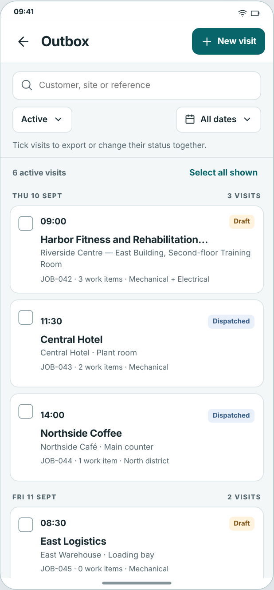
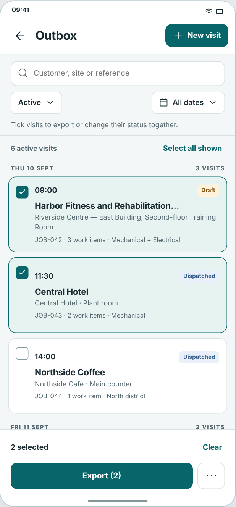
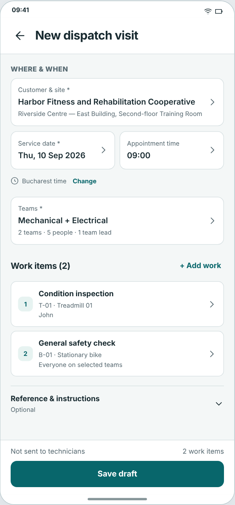
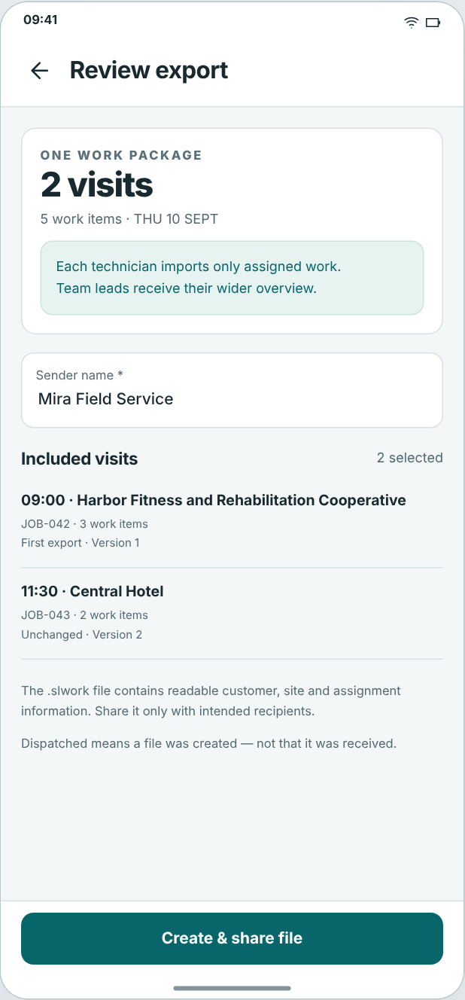

# ServiceLoop — UI/UX Implementation Reference v1.0

**Canonical manual · offline reading edition and mechanical exports supplied separately**

| Chapter | Question answered |
| --- | --- |
| [1. How to use this handoff](#overview) | How to use this handoff |
| [2. Pinned sources and scope](#source) | Pinned sources and scope |
| [3. Reference mockups and direction](#references) | Reference mockups and direction |
| [4. Applied research](#research) | Applied research |
| [5. Reconciliation and exceptions](#exceptions) | Reconciliation and exceptions |
| [6. Foundations and tokens](#foundations) | Foundations and tokens |
| [7. Branding and platform chrome](#branding) | Branding and platform chrome |
| [8. Primitive and component contracts](#components) | Primitive and component contracts |
| [9. Interaction and layout patterns](#patterns) | Interaction and layout patterns |
| [10. Semantic state catalogue](#states) | Semantic state catalogue |
| [11. Complete screen/action application](#screens) | Complete screen/action application |
| [12. Report and preview contract](#reports) | Report and preview contract |
| [13. Copy and localization catalogue](#localization) | Copy and localization catalogue |
| [14. Accessibility and field verification](#accessibility) | Accessibility and field verification |
| [15. Development sequence](#implementation) | Development sequence |
| [16. Paired visual specimens](#specimens) | Paired visual specimens |
| [17. Coverage and quality audit](#audit) | Coverage and quality audit |
| [18. Where do I look?](#lookup) | Where do I look? |

# 1. How to use this handoff

**B-013 · Whole-product presentation handoff · Version 1.0 · 9 September 2026**

**Status: proposed design/implementation reference, not a new repository amendment or runtime certification.** This is one decided mint/teal visual system for the functionally frozen ServiceLoop product. Adopted behavior, current controls, reported verification and presentation proposals are explicitly separated. The companion JSON and CSV are generated from the same working specification records as this manual.

**Read first.** The four supplied mockups govern visual character. `SOURCE_OF_TRUTH.md` and owner amendments govern business meaning. Current code establishes what exists, not permission to overwrite adopted requirements. None of this work changed the repository, implemented UI, merged branches, generated AI artwork or ran Android tests.

**Product boundary.** A local-first service book: customer → site → equipment → plan → due work → visit → recorded result/report → next obligation. Adopted asynchronous Dispatch and one-way Calendar projection are included. No backend, accounts, live synchronization, invoicing, inventory, chat, web coordinator or iOS project is introduced. This design is not Routine Repeater's visual identity.

**What is complete here.** Every one of the 357 named C-source action groups has a disposition and a presentation mapping; current-only Dispatch/Calendar and supporting controls are added separately. Explicit inputs, inherited variants, component states and screen compositions have mechanical references. Pending adopted behavior remains pending: allocating its UI is not claiming it already works. The audit measures coverage of this enumerated source/document inventory, not a compiler-proven census of every runtime branch or an accessibility certification.

**Using the reference.** Start with a screen's composition. Its action and input rows reference complete component contracts and shared patterns. Inheritance is normative: local overrides win only for presentation and only where explicit. A source/behavior exception is resolved through the recorded owner/repository authority before coding it, not silently through styling. Detailed Romanian copy is an editorial proposal for the post-B-013 B-017 localization stage; no translation infrastructure or mass resource migration is authorized by this handoff.

# 2. Pinned sources and scope

## Source authority and inspection boundary

The connected GitHub branch read was repeated on continuation. The only returned branch was `master` at **`1fd51131b040ab62af3874c1106615b75f3008fe`**, unchanged from the earlier inspection. All cited repository paths below use this immutable pin. The accepted production functional-freeze checkpoint remains **`bf55b0bd027fa25c48fc2dfd930d257688088ecb`**. Later documentation commits do not become new runtime evidence.

Authority is explicit owner decisions in `BASELINE_DECISIONS.md`, then the adopted Conceptual App Map, adopted conceptual UI/UX, and its action coverage. The reference Complete Functional App Map is not a second active specification. Its 375 action rows are not added to the implemented/complete totals; only the named FC-01/02/03 and later adopted amendments enter scope. Original proposal banners in older documents do not undo their later adoption.

Source inspection used connected read-only file/tree requests, including navigation, five principal UI files, theme/launcher/string resources, relevant models and the report implementation, plus project/state/Dispatch documents. This was not an Android build or runtime execution. The source manifest describes inspected content versus tree-listed/test-evidence material. No complete locally executable clone or compiler AST was available to this research session; no claim of automated whole-repository code coverage is made.

The pinned project reports Room v11; minSdk29; compile/target37; AGP9.3.2; Gradle9.5.0 with exact wrapper filename; JDK20; Java target11; Kotlin2.2.10; Compose BOM2026.02.01. Preserve them. Do not upgrade libraries simply to implement this design.

The reported SL-5C checkpoint has 201 passing unit and19 instrumentation tests. Those are prior reported results, not tests repeated here. Real canonical notification delivery and Calendar-provider mutation remain unclaimed in the acceptance documents. B-008 still requires a real technician evaluating a coherent Romanian-localized pilot build after UI/localization work. Source review, HTML specimens and color calculations cannot replace that evidence.

### Disposition vocabulary

| Classification | Meaning in this handoff |
|---|---|
| Implemented | A corresponding control/path was seen in source; this does not certify all runtime behavior or exact parity with every source paragraph. |
| Adopted/pending | Required by the adopted action contract but no complete corresponding exposed path was established, or only partial controls were seen. Target presentation is still specified. |
| Implemented action / proposed grouping | The action exists; this document changes its grouping or container without authorizing a business change. |
| External/system-owned | Only launch, supplied content, permissions and return behavior are app-controlled. OS chrome is excluded from app visual-completeness counts. |
| Out of scope/superseded | Explicitly displaced by a later amendment or never adopted; retained in traceability but not a shipping control. |
| Reported verification | Evidence stated in repository milestone documents; not freshly performed here. |
| Proposed presentation | Exact colors, dimensions, copy and component choices selected here for owner/developer handoff. |

| Source ID / pinned path | Blob SHA | Inspection |
| --- | --- | --- |
| [SRC01 · `docs/project/SOURCE_OF_TRUTH.md`](https://github.com/daemon-fr/serviceloop/blob/1fd51131b040ab62af3874c1106615b75f3008fe/docs/project/SOURCE_OF_TRUTH.md) | `ec2eaf48bd4ce31990df608dd0d64fdcb0227e13` | Read authority and current freeze/forward sequence |
| [SRC02 · `docs/project/BASELINE_DECISIONS.md`](https://github.com/daemon-fr/serviceloop/blob/1fd51131b040ab62af3874c1106615b75f3008fe/docs/project/BASELINE_DECISIONS.md) | `f187588bad45feb1d306ecaa86419a45d7343d64` | Read B-001 through B-018 owner amendments |
| [SRC03 · `docs/project/IMPLEMENTATION_STATE.md`](https://github.com/daemon-fr/serviceloop/blob/1fd51131b040ab62af3874c1106615b75f3008fe/docs/project/IMPLEMENTATION_STATE.md) | `80d2e860f71d98812eb143db283a8757566c61ed` | Read reported tests/provider gaps/toolchain |
| [SRC04 · `AGENTS.md`](https://github.com/daemon-fr/serviceloop/blob/1fd51131b040ab62af3874c1106615b75f3008fe/AGENTS.md) | `d3f272f672406e370ff936a9744b8571a54151cd` | Read implementation/verification/Git/AVD boundaries |
| [SRC05 · `docs/product/ServiceLoop_Conceptual_App_Map_v0_1.md`](https://github.com/daemon-fr/serviceloop/blob/1fd51131b040ab62af3874c1106615b75f3008fe/docs/product/ServiceLoop_Conceptual_App_Map_v0_1.md) | `6423a3c64442b71f3a25fedf98985a6ab5674db4` | Read named357 C action groups, rules and workflows; later amendments override |
| [SRC06 · `docs/product/ServiceLoop_Conceptual_UI_UX_Design_v0_1.md`](https://github.com/daemon-fr/serviceloop/blob/1fd51131b040ab62af3874c1106615b75f3008fe/docs/product/ServiceLoop_Conceptual_UI_UX_Design_v0_1.md) | `870ac5f3c78ee79a33b7e7e67d739b696770dcd6` | Authority/visual/background and conflict/coverage structure inspected; old visual language superseded by four supplied mockups |
| [SRC07 · `docs/product/ServiceLoop_UI_UX_Action_Coverage_v0_1.md`](https://github.com/daemon-fr/serviceloop/blob/1fd51131b040ab62af3874c1106615b75f3008fe/docs/product/ServiceLoop_UI_UX_Action_Coverage_v0_1.md) | `798206315a9460b3e039e66f4f0bbbef3e541ab3` | C/F source-family and action-coverage structure inspected;375 F rows not independently adopted |
| [SRC08 · `docs/internal/DISPATCH_PACKAGES_PROTOTYPE.md`](https://github.com/daemon-fr/serviceloop/blob/1fd51131b040ab62af3874c1106615b75f3008fe/docs/internal/DISPATCH_PACKAGES_PROTOTYPE.md) | `c35c7f63c7ea360e199c7baa4ae93f16eca2419a` | Read adopted Dispatch implementation/reference including generation/import/ownership |
| [SRC09 · `app/src/main/java/com/v16studio/serviceloop/ui/ServiceLoopApp.kt`](https://github.com/daemon-fr/serviceloop/blob/1fd51131b040ab62af3874c1106615b75f3008fe/app/src/main/java/com/v16studio/serviceloop/ui/ServiceLoopApp.kt) | `9391e05542329572595ff69e2c72165a221af26b` | Principal navigation, root/detail/settings/inspection/completion/report UI read across checkpoint/continuation |
| [SRC10 · `app/src/main/java/com/v16studio/serviceloop/ui/DailyOperationsUi.kt`](https://github.com/daemon-fr/serviceloop/blob/1fd51131b040ab62af3874c1106615b75f3008fe/app/src/main/java/com/v16studio/serviceloop/ui/DailyOperationsUi.kt) | `6edc56c685e2cd2cd6d74a847f3233253db04ed8` | Directory/edit/setup/fieldwork/contact/long-text functions inspected |
| [SRC11 · `app/src/main/java/com/v16studio/serviceloop/ui/Stage4Ui.kt`](https://github.com/daemon-fr/serviceloop/blob/1fd51131b040ab62af3874c1106615b75f3008fe/app/src/main/java/com/v16studio/serviceloop/ui/Stage4Ui.kt) | `4d17fdfe66f6e9fa67233dfe25a26fa997c5b1b1` | History/correction/lifecycle/recovery/CSV/erase inspected |
| [SRC12 · `app/src/main/java/com/v16studio/serviceloop/ui/DispatchUi.kt`](https://github.com/daemon-fr/serviceloop/blob/1fd51131b040ab62af3874c1106615b75f3008fe/app/src/main/java/com/v16studio/serviceloop/ui/DispatchUi.kt) | `ed2a34863dce055d6cff304e1b9e8eff4905d997` | Identity/directory/Teams/import/handoff inspected |
| [SRC13 · `app/src/main/java/com/v16studio/serviceloop/ui/DispatchCoordinatorUiV2.kt`](https://github.com/daemon-fr/serviceloop/blob/1fd51131b040ab62af3874c1106615b75f3008fe/app/src/main/java/com/v16studio/serviceloop/ui/DispatchCoordinatorUiV2.kt) | `0d0788d6ec15ea8bb2a7573a949af3d57d0a4974` | Outbox/editor/pickers/export/conditional Home inspected |
| [SRC14 · `app/src/main/java/com/v16studio/serviceloop/ui/theme/Theme.kt`](https://github.com/daemon-fr/serviceloop/blob/1fd51131b040ab62af3874c1106615b75f3008fe/app/src/main/java/com/v16studio/serviceloop/ui/theme/Theme.kt) | `6ba5a572c462d6baa42251454a06cbd2beef98a1` | Current light/dark Material mapping inspected |
| [SRC15 · `app/src/main/java/com/v16studio/serviceloop/ui/theme/ServiceLoopColors.kt`](https://github.com/daemon-fr/serviceloop/blob/1fd51131b040ab62af3874c1106615b75f3008fe/app/src/main/java/com/v16studio/serviceloop/ui/theme/ServiceLoopColors.kt) | `73a515d84c5e97e837fb244f4627d6a4cee88a02` | Current palette/semantic family source inspected |
| [SRC16 · `app/src/main/res/drawable/ic_launcher_foreground.xml`](https://github.com/daemon-fr/serviceloop/blob/1fd51131b040ab62af3874c1106615b75f3008fe/app/src/main/res/drawable/ic_launcher_foreground.xml) | `3308cd115badbcb75b3be40a56d39caa09657354` | Existing108dp document-loop vector inspected |
| [SRC17 · `app/src/main/res/mipmap-anydpi/ic_launcher.xml`](https://github.com/daemon-fr/serviceloop/blob/1fd51131b040ab62af3874c1106615b75f3008fe/app/src/main/res/mipmap-anydpi/ic_launcher.xml) | `6f3b755bf50c6b03d8714a9c6184705e6a08389f` | Background/foreground/monochrome refs inspected |
| [SRC18 · `app/src/main/res/values/strings.xml`](https://github.com/daemon-fr/serviceloop/blob/1fd51131b040ab62af3874c1106615b75f3008fe/app/src/main/res/values/strings.xml) | `04bc93bf1100c9d69fb809f8a63a82b0376810d5` | Only app_name; no reviewed Romanian catalogue established |
| [SRC19 · `app/src/main/java/com/v16studio/serviceloop/report/ReportService.kt`](https://github.com/daemon-fr/serviceloop/blob/1fd51131b040ab62af3874c1106615b75f3008fe/app/src/main/java/com/v16studio/serviceloop/report/ReportService.kt) | `ee59e6525a045d049ee3f337c60baa9bf0e66481` | Report output, geometry/retained bytes/photo generation inspected |
| [SRC20 · `app/src/main/java/com/v16studio/serviceloop/domain/ReminderModels.kt`](https://github.com/daemon-fr/serviceloop/blob/1fd51131b040ab62af3874c1106615b75f3008fe/app/src/main/java/com/v16studio/serviceloop/domain/ReminderModels.kt) | `bdc9f18664d18d0fae1b78d331482ac35df0bb5e` | Reminder runtime/summary/due states inspected |
| [SRC21 · `app/src/main/java/com/v16studio/serviceloop/calendar/CalendarIntegration.kt`](https://github.com/daemon-fr/serviceloop/blob/1fd51131b040ab62af3874c1106615b75f3008fe/app/src/main/java/com/v16studio/serviceloop/calendar/CalendarIntegration.kt) | `f0364919347c1a6c41479bf8d6d45008d423a074` | UI-relevant Calendar model/provider states inspected |
| [SRC22 · `app/src/main/java/com/v16studio/serviceloop/data/DispatchPackage.kt`](https://github.com/daemon-fr/serviceloop/blob/1fd51131b040ab62af3874c1106615b75f3008fe/app/src/main/java/com/v16studio/serviceloop/data/DispatchPackage.kt) | `f7432bbb2eafa6908f36ef6b97d24c3239a70b2e` | Codec bounds/current classification enums/preparation and import projection inspected |
| [SRC23 · `app/src/androidTest/java/com/v16studio/serviceloop/DispatchCoordinatorUiTest.kt`](https://github.com/daemon-fr/serviceloop/blob/1fd51131b040ab62af3874c1106615b75f3008fe/app/src/androidTest/java/com/v16studio/serviceloop/DispatchCoordinatorUiTest.kt) | `4801b9640a679ee804805da02de2250cb8ed18ed` | Test file/tree and reported coverage reference; not run here |
| [SRC24 · `app/src/androidTest/java/com/v16studio/serviceloop/CompletionUiSemanticTest.kt`](https://github.com/daemon-fr/serviceloop/blob/1fd51131b040ab62af3874c1106615b75f3008fe/app/src/androidTest/java/com/v16studio/serviceloop/CompletionUiSemanticTest.kt) | `78621c90d7b6cccfc5044055e2d232dffa29e7f4` | Test file/tree and reported coverage reference; not run here |

**No evidence inflation:** tree-listed tests are references, not freshly run suites. See E11 for the distinction between named-action coverage and an automated source census. Canonical ServiceLoop AVD and business dataset were not modified.

# 3. Reference mockups and direction

## Observations from the four supplied reference images

The images show one visual language rather than four screen-specific styles: pale neutral canvas; white surfaces; dark slate primary text; muted secondary text; deep teal commands; very restrained outlines; modest rounded corners; airy grouping; mint selected rows; amber Draft and blue Dispatched badges. Headers are confident but not oversized. Optional content can be collapsed. Review summaries use unboxed rows and dividers rather than a card for everything.

The selected Outbox uses a contextual bottom bar with count/Clear and Export/More. The nonselected screen reserves more space for rows. The editor has a single principal Save draft and an explicit not-sent fact; the export review explains assignment visibility, readable package contents and the meaning of Dispatched. These truthfulness cues are part of the design, not expendable legal fine print.

The references are 618×1328 pixels with no authoritative dp scale. The literal token choices in this manual are deliberate Android design values, not pixel measurements re-labelled dp. Fictional OS chrome, device outlines, inconsistent sample totals and accidental line breaks are not requirements. Long names must remain accessible even when a list summary is shortened.

### Minimal justified adjustments

1. **Meaningful controls need stronger boundaries than decorative cards.** Keep the light hairline for nonessential grouping; use `outlineControl` for editable fields, unchecked boxes and control affordances where the outline carries meaning. This is the smallest adjustment needed to avoid low-contrast controls.
2. **Large-text layouts grow and stack.** Do not preserve the screenshot's side-by-side date/time at the cost of clipping. Names on details and review can wrap fully. Bottom regions are measured, never laid over the last item.
3. **Separate hit areas.** The Outbox checkbox selects; the body opens. A badge is not a chip button. A picker summary is not a text input.
4. **No fixed screenshot counts.** Date headings and footer totals come from the same actual filtered/prepared records. First export/version wording maps per Visit, not per transport package.
5. **Dark is the same product.** Use neutral blue-slate dark surfaces and mint/teal actions, not RR's amber photography, a color inversion, pure-black-everywhere or translucent green panels.

| Reference | Pixels | SHA-256 |
| --- | --- | --- |
| M01 · Outbox · unselected | 618×1328 | 993b5c8376eebf052c9df01e97932b1d77da3572f853733f97b2e2a165bc7184 |
| M02 · Outbox · selected | 618×1328 | cdabb353913d28486ee7979a0a17e77037153c200a92e9781fabbf8005ac5616 |
| M03 · New dispatch visit | 618×1328 | 3e81229e7c921fea9d475dedcba91e4ff4c5ac2811b2009d51053988b8dcdb20 |
| M04 · Review export | 618×1328 | 34d574e194eec80cec5b73f57120cd2282be34b16620755c498026539dab9a46 |

<figure class="reference"><figcaption>M01 — Outbox · unselected. Source reference only; textual tokens and contracts govern implementation.</figcaption></figure>

<figure class="reference"><figcaption>M02 — Outbox · selected. Source reference only; textual tokens and contracts govern implementation.</figcaption></figure>

<figure class="reference"><figcaption>M03 — New dispatch visit. Source reference only; textual tokens and contracts govern implementation.</figcaption></figure>

<figure class="reference"><figcaption>M04 — Review export. Source reference only; textual tokens and contracts govern implementation.</figcaption></figure>

Reference images are bundled alongside the Markdown in the ZIP and embedded in the offline HTML. The manual’s textual contracts do not require earlier chat messages or interpreting unlabelled image pixels.

# 4. Applied research

Sources were consulted on9 September2026. Platform and accessibility guidance is distinguished from first-party usability heuristics and our project-specific choices. No new user study, interview, field productivity measurement or conversion claim was performed. Older substantive research is dated rather than passed off as a current trend.

## R01 · Android · Compose accessibility API defaults

**Evidence type:** Platform implementation guidance. **Date:** Living official documentation; inspected2026-09-09. [Primary source](https://developer.android.com/develop/ui/compose/accessibility/api-defaults).

Compose supplies useful accessibility defaults, but small custom targets and nested actions still need deliberate semantics and sufficient target geometry.

**ServiceLoop decision:** This proposal uses48dp targets and separates checkbox selection from body navigation; a one-action selectable row has one semantics node.

## R02 · Android · Compose semantics

**Evidence type:** Platform implementation guidance. **Date:** Living official documentation; inspected2026-09-09. [Primary source](https://developer.android.com/develop/ui/compose/accessibility/semantics).

Semantics convey meaning to accessibility services and tests independently of visual pixels.

**ServiceLoop decision:** Use headings, pane titles, roles, selected/state descriptions, live regions and deliberate merge boundaries; do not announce decorative marks as content.

## R03 · W3C · WCAG 2.2

**Evidence type:** Accessibility standard, not native-app runtime certification. **Date:** W3C Recommendation; current page consulted2026-09-09. [Primary source](https://www.w3.org/TR/WCAG22/).

Contrast criteria distinguish normal text, meaningful non-text information and exceptions. Focus must not be obscured; resizing needs usable content.

**ServiceLoop decision:** Choose4.5:1 for all informative text,3:1 for meaningful control/selection/focus graphics,200% type test; use labels as redundant cues. Decorative borders/disabled commands explicitly excluded from claims.

## R04 · W3C · WCAG2ICT

**Evidence type:** Applying accessibility guidance beyond web. **Date:** Working Group guidance; consulted2026-09-09. [Primary source](https://www.w3.org/TR/wcag2ict/).

Guidance addresses applying WCAG concepts to non-web documents/software.

**ServiceLoop decision:** Use the criteria as engineering targets, not an assertion that CSS pixels are Android dp or that a PDF is tagged/accessible by default.

## R05 · Android · Insets in Compose

**Evidence type:** Platform implementation guidance. **Date:** Living official documentation; consulted2026-09-09. [Primary source](https://developer.android.com/develop/ui/compose/system/insets-ui).

System bars and IME contribute changing insets; consuming insets and padding correctly avoids overlap and double spacing.

**ServiceLoop decision:** One inset owner per layer, measured bottom bar, focused input and last row kept visible; do not hardcode fictional OS chrome from PNG.

## R06 · Android · Window size classes

**Evidence type:** Platform layout guidance. **Date:** Living official documentation; consulted2026-09-09. [Primary source](https://developer.android.com/develop/ui/compose/layouts/adaptive/use-window-size-classes).

Available window width and height matter rather than the marketing model of a device.

**ServiceLoop decision:** Use600/840 width classes and compact-height handling; our360dp/1.3-scale form-pair limits are project design decisions, not mandatory platform breakpoints.

## R07 · Android · State in Compose

**Evidence type:** State management guidance. **Date:** Living official documentation; consulted2026-09-09. [Primary source](https://developer.android.com/develop/ui/compose/state).

Recomposition, retained UI state and durable business persistence have different lifetimes.

**ServiceLoop decision:** Keep record buffers keyed to record identity/version. Never equate remembered input with a confirmed durable save.

## R08 · Android · Saving UI states

**Evidence type:** Platform lifecycle guidance. **Date:** Living official documentation; consulted2026-09-09. [Primary source](https://developer.android.com/topic/libraries/architecture/saving-states).

Saved UI state is not a universal replacement for durable local storage across every interruption.

**ServiceLoop decision:** Preserve adopted Working/correction persistence and explicit general-form buffers; do not promise reboot recovery merely from rememberSaveable.

## R09 · Nielsen Norman Group · Recognition and recall

**Evidence type:** First-party usability explanation/heuristic. **Date:** 15 January2024; consulted2026-09-09. [Primary source](https://www.nngroup.com/articles/recognition-and-recall/).

Visible options and context reduce reliance on remembering information from elsewhere.

**ServiceLoop decision:** Show customer/site/equipment context with stable references; label major actions and expose relevant current states. No claimed field-productivity percentage.

## R10 · Nielsen Norman Group · Progressive disclosure

**Evidence type:** Usability guidance. **Date:** First-party article; consulted2026-09-09. [Primary source](https://www.nngroup.com/articles/progressive-disclosure/).

Less frequent detail can be deferred without hiding the primary task.

**ServiceLoop decision:** Collapse optional notes/reference fields; keep required data, blockers and save failures visible. More contains named uncommon actions, not undiscoverable gestures.

## R11 · Nielsen Norman Group · Form whitespace

**Evidence type:** Established usability guidance; not a 2026 field trial. **Date:** 3 November2013; consulted2026-09-09. [Primary source](https://www.nngroup.com/articles/form-design-white-space/).

Spacing and grouping influence perceived relationships in forms.

**ServiceLoop decision:** Choose12dp intra-group/24dp inter-section and persistent labels near values; do not transfer unrelated study conversion results to ServiceLoop.

## R12 · Nielsen Norman Group · Placeholder text in form fields

**Evidence type:** First-party usability guidance. **Date:** 11 October2019; consulted2026-09-09. [Primary source](https://www.nngroup.com/videos/placeholders-form-fields/).

Placeholder-only labels can disappear during entry.

**ServiceLoop decision:** Use persistent visible field labels, including populated and error states; placeholders are examples only.

## R13 · Nielsen Norman Group · Dark mode

**Evidence type:** Usability synthesis with context-dependent findings. **Date:** First-party research synthesis; consulted2026-09-09. [Primary source](https://www.nngroup.com/articles/dark-mode/).

Dark appearance is not automatically superior for every task/user/environment.

**ServiceLoop decision:** Provide deliberate neutral dark surfaces and full contrast, follow system preference, and test in bright/dim conditions; no outdoor-use guarantee.

## R14 · Android · Material 3 in Compose

**Evidence type:** Platform/design-system guidance. **Date:** Living official documentation; consulted2026-09-09. [Primary source](https://developer.android.com/develop/ui/compose/designsystems/material3).

Material role-based theming and component styling are separable from application semantics.

**ServiceLoop decision:** Define complete role mapping plus semantic extensions. Stable ServiceLoop color rather than dynamic wallpaper color is our branding choice.

## R15 · Android · Adaptive icons

**Evidence type:** Platform asset contract. **Date:** Living official documentation; consulted2026-09-09. [Primary source](https://developer.android.com/develop/ui/compose/system/icon_design_adaptive).

Adaptive layers and monochrome treatment are presented through launcher masking and platform rendering.

**ServiceLoop decision:** Retain existing108dp vector mark and monochrome reference, check safe central shape across masks; no fake app-controlled launcher tint.

## R16 · Android · Splash screens

**Evidence type:** Platform startup guidance. **Date:** Living official documentation; consulted2026-09-09. [Primary source](https://developer.android.com/develop/ui/views/launch/splash-screen).

System splash presentation should integrate with application startup.

**ServiceLoop decision:** Keep existing mark and solid background; no added decorative waiting interval or extra splash Activity.

## R17 · Android · Test accessibility in Compose

**Evidence type:** Verification guidance. **Date:** Living official documentation; consulted2026-09-09. [Primary source](https://developer.android.com/develop/ui/compose/accessibility/testing).

Automated checks complement, not replace, manual assistive-technology evaluation.

**ServiceLoop decision:** Use available accessibility checks plus TalkBack, keyboard and rendered scaling tests; color calculations alone do not pass runtime access.

## R18 · Google · Material icons/symbols licensing

**Evidence type:** Asset provenance/licensing guidance. **Date:** Official guide; consulted2026-09-09. [Primary source](https://developers.google.com/fonts/docs/material_icons).

Google makes the Material icon assets available under Apache2.0.

**ServiceLoop decision:** Use only selected static vectors, preserve licence notices and source pin; no bundled icon-font files or unrelated paid asset pack.

# 5. Reconciliation and exceptions

Ordinary visual decisions are resolved here. These exceptions are business/evidence boundaries, not unexplained visual placeholders. They must not be “fixed” by making a failed or absent behavior look successful. An implemented field does not prove the full adopted action contract.

## E01 · Authority drift in older documents

**Disposition:** Resolved by existing amendments.

**Evidence:** Older Conceptual UI and AGENTS scope text can still say Dispatch/Calendar excluded. B-015/B-016 explicitly adopt them; B-017 sequences Romanian later.

**Required handling:** Include those adopted responsibilities; do not activate unrelated F-reference features. No owner clarification needed for this resolved authority conflict.

## E02 · Mockup dimensions versus actual Android geometry

**Disposition:** Resolved presentation decision.

**Evidence:** No authoritative scale relates618px to dp. Light hairlines may be too weak as sole control boundary; long labels cannot always retain same row arrangement.

**Required handling:** Use exact tokens/minimums, stronger meaningful outlines, growth/stacking rules. Do not copy fictional OS frame/counts or claim pixel-perfect Android parity.

## E03 · Adopted surfaces not fully exposed

**Disposition:** Functional reconciliation required.

**Evidence:** Current routing selects Home/recovery and has no distinct Welcome/help route. Dedicated machine/finding workspaces, some template edit/preview/photo management and broad list filters are described more fully than visible code.

**Required handling:** All named C actions remain mapped as adopted/pending. Allocate target locations; verify source/domain coverage before coding. Do not show dead buttons or reinterpret missing functions as automatically waived by functional-freeze prose.

## E04 · Appointment semantics in current shortcuts

**Disposition:** Consequential source/doc discrepancy.

**Evidence:** NewVisitScreen supplies start-of-day instant for a date-only Book; reschedule passes current Instant. Due Book selected commits a default tomorrow rather than adopted setup review. Dispatch filters use LocalDate.now while business time is an adopted cross-screen concept.

**Required handling:** Show intended date-only/timed distinctions and business-zone labels. Engineering must separately reconcile actual command inputs/clock semantics with B-011/R08/B-016 before claiming UI parity; a reskin must not hide wrong appointment instant or silently rewrite it.

## E05 · Explicit Save versus adopted durable autosave

**Disposition:** Consequential persistence/UX discrepancy.

**Evidence:** Inspection has explicit Save work/Save response; correction has delayed autosave. Per-Visit reminder can write immediately although older contract says editor Save. Some general forms use temporary buffers rather than proved durable recovery.

**Required handling:** Preserve truthful current save controls until an explicit reconciled implementation changes them. New chrome must not display Saved for an uncommitted buffer. B-014 inactive draft retention is already authoritative and cannot regress.

## E06 · Contact inheritance and creation fields

**Disposition:** Adopted/pending mapping.

**Evidence:** Site editor exposes independent override fields rather than the full inherited-contact switch; customer creation form does not expose all First-site controls from adopted map.

**Required handling:** Specify target fields but verify actual inheritance/default-site transaction in repository. Never silently combine two recipients or create an orphan site; no assertion these are merely visual.

## E07 · Reports and evidence display

**Disposition:** Presentation repair plus model-check boundary.

**Evidence:** FixedServiceRecordPdf has a single unwrapped caption draw line on photo pages. Adopted optional company logo does not appear in inspected render code. Historical PDF identity and content constraints are established.

**Required handling:** Wrap captions with measured height (safe presentation fix). Logo slot/model exposure is adopted/pending, not new invention. Preserve existing fixed geometry and bytes; no retroactive regeneration or private text substitution.

## E08 · Large lists and reachability

**Disposition:** Current UI truncation requires explicit resolution.

**Evidence:** CSV export customer selection takes first4; CSV preview displays first100 rows. Some lookup functions initially limit matches; reference action map expects complete access.

**Required handling:** Use lazy full eligible lists or explicit bounded pagination with count/access to remaining rows; do not call a first-N view complete. This is an already-adopted reachability correction, not a new analytics feature. Verify total counts and safe selected subset against full data.

## E09 · Truthful labels and optional provider evidence

**Disposition:** Verification gap, not new business design.

**Evidence:** Equipment view labels every nonoverdue plan Due soon; source documents leave actual notification delivery and Calendar mutation not run. Some read paths use nullable fallbacks that can look empty.

**Required handling:** Use actual DueClassifier and explicit loading/error. Keep provider/notification states accurately labelled; run authorized disposable-device/provider tests later without changing canonical data to manufacture evidence.

## E10 · Historical contact and answer switching exclusions

**Disposition:** Resolved by explicit amendments.

**Evidence:** Original C:S29-A05 allows hard deletion; older answer switch prose mentions destructive clearing. B-002 and B-014 supersede these.

**Required handling:** Retain old action IDs in traceability as superseded/amended. Entered-in-error history, separate inactive buffers and active-only reporting are mandatory; never reintroduce deletion/confirmation on ordinary answer switches.

## E11 · Source inventory versus proof of implementation

**Disposition:** Audit boundary.

**Evidence:** Manual connector review and the named action corpus are not a full compiler AST/control-coverage report. Some helper/layout variants share source symbols.

**Required handling:** Counts describe this enumerated inventory, not unqualified runtime exhaustiveness. A coding-agent route/control scan against the same pin is an additional acceptance gate; uncovered actual control must be reconciled using these contracts, not a fresh guessed style.

## E12 · Romanian/editorial/legal release inputs

**Disposition:** External validation/input boundary.

**Evidence:** No reviewed Romanian catalogue was present; actual publisher/public-policy URL and trade-approved terminology are not supplied by UI screenshots.

**Required handling:** Provide proposed English/Romanian copy and exact layout; defer localization implementation under B-017 and native technician review. No invented legal policy URL, compliance badge or receipt/safety claim.

# 6. Foundations and exact tokens

## Foundation decisions

### Color usage and hierarchy

Use opaque base surfaces. No hero photograph, glass blur or gradient backgrounds in business screens. `canvas` is the page; `surface` is the working card/field/bar; `surfaceSubtle` is a subdued read-only grouping; `surfaceRaised` is a menu/dialog. Do not put an elevation-driven tonal tint over these explicit colors. Informative text is never dimmed solely because the record is read-only.

`action` means interactive, not universal success. `selection` means chosen for a later action, not completed. Semantic badges use their named family ink/container. The same family is deliberately reused for multiple meanings, distinguished by text and optional glyph. A selected Draft row still has an amber Draft badge. If an error blocks saving, its readable message takes priority without recoloring every field red.

Only state layers and scrims use transparency. Solid buttons use `actionPressed`; neutral/selected rows use `action` at8% on the exact base and the computed composite listed below. Keyboard focus uses an external2dp ring plus2dp gap filled with the adjacent base. The untested generic focus-layer token is reserved only for the underlying ripple implementation; a contrast-bearing focus ring remains mandatory. No informative foreground may depend on an unknown photographic backdrop.

### Type, units and content fitting

Use Android's system sans-serif through `FontFamily.SansSerif`, system monospace for opaque identifiers. No downloadable or embedded font is needed for app UI; no font file is delivered. This avoids an unrelated typography-asset/licensing project and keeps system fallback for Romanian and other scripts. Font weights are the specified400/500/600/700; do not simulate narrow fonts to fit more content.

All UI geometry is **dp** and all type/line-height/letter-spacing **sp**. PDF geometry is **points**, deliberately separate. HTML specimen pixels only illustrate the geometry; browser scaling is not a device-density test. WCAG's CSS/point definitions are not mechanically equal to Android dp/sp. Test the actual Compose scaled result, including nonlinear font scaling where supported.

Normal lists: title up to2 lines, supporting context up to2 lines, then a separately labelled full detail on open. Critical record identity is never silently omitted from review/confirmation; use full wrapping. IDs are monospace, selectable in detail, and may use a short display only with the full value reachable by existing detail/Copy ID. Long customer/site names take priority over decorative alignment. Numeric time can align using tabular figures where system font supports them; do not pad translated strings with spaces.

Controls have **minimum** heights, not fixed heights. `heightIn(min=...)`, padding and measured text create the resulting height. A two-line button grows; the action remains a single focus target. No auto-shrink-text, ellipsized destructive command, or label hiding to satisfy a fixed mockup box.

### Density and responsive rules

Below600dp usable width:16dp page inset.600–839dp:24dp.840dp+:32dp, max840dp content or640dp forms centered. These constraints prevent a new tablet dashboard product while keeping large windows usable.

A short-field pair is permitted only when all conditions hold: usable width>=360dp; fontScale<1.3; `(contentWidth−8dp)/2>=148dp`; each label fits at most2 lines at measured scale. Otherwise stack with12dp gap. At scale>=1.5 or narrow width, put badges below titles rather than beside them. Team member/leader rows become stacked labelled choices with the technician identity first. No horizontal scroll for ordinary form content.

At usable height<480dp use56dp minimum top bar. If toolbar+IME+footer leaves less than160dp for body content, place the primary action at the end of the scroll region rather than pinning it. Scroll focused input and its error into view; consume status/navigation/IME insets exactly once. Bottom bar height is measured and included once in list padding. Maintain at least16dp scroll space after the final row.

### Feedback and sensory scope

Use platform ripple with restrained state layer and exact press/selection timing tokens. Decorative route transitions are0ms; bounded component transitions180ms. When system animation is disabled, use0ms without hiding necessary state feedback. No infinite attention animation, animated progress percentage without measurable progress, flashing overdue status or new haptic/sound feature. Haptics are not introduced; retain only any existing platform behavior of native controls.

### Material 3 mapping

Map the complete `ColorScheme` roles to the table in this manual rather than defining primary/background and leaving unspecified defaults. The app-level semantic colors extend Material for status families. Every custom primitive reads the same tokens. Dynamic wallpaper color is not enabled: system light/dark appearance is followed while brand action colors stay stable. This does not add an in-app appearance customization screen.

## Color roles · literal values

| Token | Light | Dark | Use | Do not use for |
| --- | --- | --- | --- | --- |
| `color.canvas` | #F4F7F7 | #10191C | Page background | Do not tint all content mint |
| `color.surface` | #FFFFFF | #19262B | Cards, fields and bars | Do not overlay translucent green |
| `color.surfaceSubtle` | #EDF2F3 | #223239 | Read-only/supporting regions | Not selected state |
| `color.surfaceRaised` | #FFFFFF | #293C43 | Menus and modal surfaces | No automatic tonal overlay |
| `color.textPrimary` | #182A30 | #EAF2F4 | Main content and headings | Never lower opacity for ordinary text |
| `color.textSecondary` | #566870 | #B7C7CD | Metadata and helpers | Not an error color |
| `color.textMuted` | #586D75 | #9AAFBA | Optional minor metadata | Not body text over photography |
| `color.onAction` | #FFFFFF | #062F32 | Text/icons on primary fill | Not default text |
| `color.action` | #08666B | #79D4CE | Primary buttons and interactive text | Not generic success |
| `color.actionPressed` | #07565B | #69BDB8 | Pressed solid button | No darkening beyond this token |
| `color.selection` | #E7F3F1 | #173C3D | Selected row fill | Not completed work |
| `color.onSelection` | #075C62 | #A4E6DF | Selection labels/meaningful marks | Not arbitrary badge colors |
| `color.selectionOutline` | #08747A | #79D4CE | Selected row outline/check glyph family | Not destructive state |
| `color.outlineDecorative` | #D8E1E3 | #344951 | Nonessential card edges/dividers | Never sole field/checkbox boundary |
| `color.outlineControl` | #6A828C | #809AA5 | Meaningful field/control boundary | Not table separators everywhere |
| `color.icon` | #566870 | #B7C7CD | Non-decorative secondary icons | Do not tint user photographs |
| `color.focus` | #005A61 | #A4E6DF | External keyboard focus ring | Never focus ring adjacent to same-color action fill without gap |
| `color.disabledContainer` | #E6ECEE | #2A383E | Unavailable command background | No error/permission messages |
| `color.disabledText` | #75858B | #82969F | Unavailable command text only | Read-only values must remain full contrast |
| `color.neutralContainer` | #EDF2F3 | #263A42 | Neutral lifecycle badge | No success implication |
| `color.neutralInk` | #425D67 | #D1E0E5 | Neutral lifecycle text/icon | Not disabled text |
| `color.infoContainer` | #EAF0FA | #20384F | Booked/Dispatched/informational | Never delivered receipt |
| `color.infoInk` | #315F96 | #B8D7FF | Info text/icon | Do not erase warning with selection |
| `color.warningContainer` | #FFF3DD | #493519 | Draft/overdue/caution container | Not selected |
| `color.warningInk` | #875100 | #FFDA97 | Warning text/icon | Not all warnings block work |
| `color.errorContainer` | #FBE9E8 | #49282D | Failed/invalid/destructive attention | Not ordinary overdue by itself |
| `color.errorInk` | #A32D35 | #FFC0C4 | Error/destructive text and icon | Do not call all partial work failure |
| `color.destructive` | #A32D35 | #FFB3B9 | Destructive confirmation fill | Not ordinary Cancel navigation |
| `color.onDestructive` | #FFFFFF | #3B0A12 | Destructive filled button label | Not normal report ink |
| `color.successContainer` | #E5F2EB | #173C30 | Saved/verified explicit local success | No safety certification |
| `color.successInk` | #236347 | #A5E3BF | Saved/verified label and check | Not fulfilled unless domain says so |
| `color.workingContainer` | #E5F3F2 | #163B3E | Working/review-in-progress | No percentage completion claim |
| `color.workingInk` | #07666B | #A0E4DF | Working labels | Not remote live presence |
| `color.historyContainer` | #EEEAF4 | #362E45 | Superseded/revision context | Voided still needs error treatment |
| `color.historyInk` | #66517F | #D9C9F1 | Revision/history cue | Not active data ownership |
| `color.photoMat` | #E6ECEE | #0C1316 | Photo/PDF surroundings | Never change PDF paper with theme |
| `color.scrimBase` | #000000 | #000000 | Modal background compositing only | No transparent content surfaces |

## Typography · sp

| Token | Size/line height | Weight | Letter spacing | Family |
| --- | --- | --- | --- | --- |
| `type.screenTitle` | 22 / 28 | 700 | 0 | system-sans |
| `type.heroCount` | 32 / 40 | 700 | 0 | system-sans |
| `type.sectionTitle` | 18 / 24 | 600 | 0 | system-sans |
| `type.itemTitle` | 16 / 22 | 600 | 0 | system-sans |
| `type.body` | 16 / 24 | 400 | 0 | system-sans |
| `type.supporting` | 14 / 20 | 400 | 0 | system-sans |
| `type.label` | 14 / 20 | 600 | 0 | system-sans |
| `type.meta` | 12 / 18 | 400 | 0 | system-sans |
| `type.dayHeading` | 12 / 18 | 700 | 0.6 | system-sans |
| `type.button` | 16 / 22 | 600 | 0 | system-sans |
| `type.identifier` | 14 / 20 | 500 | 0 | system-monospace |
| `type.badge` | 12 / 16 | 600 | 0 | system-sans |

## Space tokens

| Token | Literal value | Unit/use |
| --- | --- | --- |
| `space.none` | 0 | dp unless name states ratio/fontScale or ms; see foundation rules |
| `space.hair` | 2 | dp unless name states ratio/fontScale or ms; see foundation rules |
| `space.xs` | 4 | dp unless name states ratio/fontScale or ms; see foundation rules |
| `space.sm` | 8 | dp unless name states ratio/fontScale or ms; see foundation rules |
| `space.md` | 12 | dp unless name states ratio/fontScale or ms; see foundation rules |
| `space.lg` | 16 | dp unless name states ratio/fontScale or ms; see foundation rules |
| `space.xl` | 20 | dp unless name states ratio/fontScale or ms; see foundation rules |
| `space.section` | 24 | dp unless name states ratio/fontScale or ms; see foundation rules |
| `space.major` | 32 | dp unless name states ratio/fontScale or ms; see foundation rules |
| `space.hero` | 40 | dp unless name states ratio/fontScale or ms; see foundation rules |
| `space.large` | 48 | dp unless name states ratio/fontScale or ms; see foundation rules |

## Radius tokens

| Token | Literal value | Unit/use |
| --- | --- | --- |
| `radius.badge` | 8 | dp unless name states ratio/fontScale or ms; see foundation rules |
| `radius.field` | 12 | dp unless name states ratio/fontScale or ms; see foundation rules |
| `radius.card` | 16 | dp unless name states ratio/fontScale or ms; see foundation rules |
| `radius.dialog` | 24 | dp unless name states ratio/fontScale or ms; see foundation rules |
| `radius.pill` | 999 | dp unless name states ratio/fontScale or ms; see foundation rules |

## Stroke tokens

| Token | Literal value | Unit/use |
| --- | --- | --- |
| `stroke.divider` | 1 | dp unless name states ratio/fontScale or ms; see foundation rules |
| `stroke.outline` | 1 | dp unless name states ratio/fontScale or ms; see foundation rules |
| `stroke.selected` | 1.5 | dp unless name states ratio/fontScale or ms; see foundation rules |
| `stroke.focus` | 2 | dp unless name states ratio/fontScale or ms; see foundation rules |

## Size tokens

| Token | Literal value | Unit/use |
| --- | --- | --- |
| `size.touchMin` | 48 | dp unless name states ratio/fontScale or ms; see foundation rules |
| `size.iconSmall` | 20 | dp unless name states ratio/fontScale or ms; see foundation rules |
| `size.icon` | 24 | dp unless name states ratio/fontScale or ms; see foundation rules |
| `size.iconLarge` | 32 | dp unless name states ratio/fontScale or ms; see foundation rules |
| `size.checkboxGlyph` | 24 | dp unless name states ratio/fontScale or ms; see foundation rules |
| `size.buttonMin` | 48 | dp unless name states ratio/fontScale or ms; see foundation rules |
| `size.buttonPrimaryMin` | 52 | dp unless name states ratio/fontScale or ms; see foundation rules |
| `size.fieldMin` | 64 | dp unless name states ratio/fontScale or ms; see foundation rules |
| `size.pickerMin` | 64 | dp unless name states ratio/fontScale or ms; see foundation rules |
| `size.topBarMin` | 64 | dp unless name states ratio/fontScale or ms; see foundation rules |
| `size.bottomNavMin` | 80 | dp unless name states ratio/fontScale or ms; see foundation rules |
| `size.listRowMin` | 64 | dp unless name states ratio/fontScale or ms; see foundation rules |
| `size.photoThumb` | 64 | dp unless name states ratio/fontScale or ms; see foundation rules |
| `size.photoGridMin` | 88 | dp unless name states ratio/fontScale or ms; see foundation rules |
| `size.sheetMaxWidth` | 560 | dp unless name states ratio/fontScale or ms; see foundation rules |
| `size.dialogMaxWidth` | 560 | dp unless name states ratio/fontScale or ms; see foundation rules |
| `size.menuMinWidth` | 196 | dp unless name states ratio/fontScale or ms; see foundation rules |
| `size.menuMaxWidth` | 320 | dp unless name states ratio/fontScale or ms; see foundation rules |
| `size.formMaxWidth` | 640 | dp unless name states ratio/fontScale or ms; see foundation rules |
| `size.contentMaxWidth` | 840 | dp unless name states ratio/fontScale or ms; see foundation rules |
| `size.narrowThreshold` | 360 | dp unless name states ratio/fontScale or ms; see foundation rules |
| `size.mediumThreshold` | 600 | dp unless name states ratio/fontScale or ms; see foundation rules |
| `size.expandedThreshold` | 840 | dp unless name states ratio/fontScale or ms; see foundation rules |
| `size.compactHeightThreshold` | 480 | dp unless name states ratio/fontScale or ms; see foundation rules |
| `size.pairMinCellWidth` | 148 | dp unless name states ratio/fontScale or ms; see foundation rules |

## Layout tokens

| Token | Literal value | Unit/use |
| --- | --- | --- |
| `layout.pageInsetCompact` | 16 | dp unless name states ratio/fontScale or ms; see foundation rules |
| `layout.pageInsetMedium` | 24 | dp unless name states ratio/fontScale or ms; see foundation rules |
| `layout.pageInsetExpanded` | 32 | dp unless name states ratio/fontScale or ms; see foundation rules |
| `layout.bodyGap` | 12 | dp unless name states ratio/fontScale or ms; see foundation rules |
| `layout.sectionGap` | 24 | dp unless name states ratio/fontScale or ms; see foundation rules |
| `layout.buttonGap` | 8 | dp unless name states ratio/fontScale or ms; see foundation rules |
| `layout.cardPadding` | 16 | dp unless name states ratio/fontScale or ms; see foundation rules |
| `layout.barPadding` | 16 | dp unless name states ratio/fontScale or ms; see foundation rules |
| `layout.pairGap` | 8 | dp unless name states ratio/fontScale or ms; see foundation rules |
| `layout.fontScaleStackThreshold` | 1.3 | dp unless name states ratio/fontScale or ms; see foundation rules |
| `layout.badgeFontScaleStackThreshold` | 1.5 | dp unless name states ratio/fontScale or ms; see foundation rules |
| `layout.bodyMinimumVisibleHeight` | 160 | dp unless name states ratio/fontScale or ms; see foundation rules |

## Motion tokens

| Token | Literal value | Unit/use |
| --- | --- | --- |
| `motion.pressMs` | 80 | milliseconds/easing |
| `motion.smallMs` | 120 | milliseconds/easing |
| `motion.containerMs` | 180 | milliseconds/easing |
| `motion.dialogMs` | 180 | milliseconds/easing |
| `motion.routeMs` | 0 | milliseconds/easing |
| `motion.reducedMs` | 0 | milliseconds/easing |
| `motion.easing` | cubic-bezier(0.2,0,0,1) | milliseconds/easing |

## Elevation tokens

| Token | Literal value | Unit/use |
| --- | --- | --- |
| `elevation.restDp` | 0 | dp unless name states ratio/fontScale or ms; see foundation rules |
| `elevation.menuDp` | 3 | dp unless name states ratio/fontScale or ms; see foundation rules |
| `elevation.dialogDp` | 6 | dp unless name states ratio/fontScale or ms; see foundation rules |
| `elevation.bottomBarDp` | 0 | dp unless name states ratio/fontScale or ms; see foundation rules |

## Alpha tokens

| Token | Literal value | Unit/use |
| --- | --- | --- |
| `alpha.pressed` | 0.08 | ratio; explicit compositing only |
| `alpha.hover` | 0.04 | ratio; explicit compositing only |
| `alpha.scrimLight` | 0.4 | ratio; explicit compositing only |
| `alpha.scrimDark` | 0.64 | ratio; explicit compositing only |

## Complete Material mapping

| Material role | Token | Override/constraint |
| --- | --- | --- |
| primary | color.action | No automatic tint beyond defined state layers |
| onPrimary | color.onAction | No automatic tint beyond defined state layers |
| primaryContainer | color.selection | No automatic tint beyond defined state layers |
| onPrimaryContainer | color.onSelection | No automatic tint beyond defined state layers |
| secondary | color.onSelection | No automatic tint beyond defined state layers |
| onSecondary | color.surface | Dark: color.onAction |
| secondaryContainer | color.selection | No automatic tint beyond defined state layers |
| onSecondaryContainer | color.onSelection | No automatic tint beyond defined state layers |
| tertiary | color.historyInk | No automatic tint beyond defined state layers |
| onTertiary | color.surface | Dark: color.onAction |
| tertiaryContainer | color.historyContainer | No automatic tint beyond defined state layers |
| onTertiaryContainer | color.historyInk | No automatic tint beyond defined state layers |
| background | color.canvas | No automatic tint beyond defined state layers |
| onBackground | color.textPrimary | No automatic tint beyond defined state layers |
| surface | color.surface | No automatic tint beyond defined state layers |
| onSurface | color.textPrimary | No automatic tint beyond defined state layers |
| surfaceVariant | color.surfaceSubtle | No automatic tint beyond defined state layers |
| onSurfaceVariant | color.textSecondary | No automatic tint beyond defined state layers |
| surfaceTint | color.action | No automatic tint beyond defined state layers |
| surfaceDim | color.canvas | No automatic tint beyond defined state layers |
| surfaceBright | color.surfaceRaised | No automatic tint beyond defined state layers |
| surfaceContainerLowest | color.canvas | No automatic tint beyond defined state layers |
| surfaceContainerLow | color.surface | No automatic tint beyond defined state layers |
| surfaceContainer | color.surfaceSubtle | No automatic tint beyond defined state layers |
| surfaceContainerHigh | color.surfaceRaised | No automatic tint beyond defined state layers |
| surfaceContainerHighest | color.surfaceRaised | No automatic tint beyond defined state layers |
| outline | color.outlineControl | No automatic tint beyond defined state layers |
| outlineVariant | color.outlineDecorative | No automatic tint beyond defined state layers |
| error | color.destructive | No automatic tint beyond defined state layers |
| onError | color.onDestructive | No automatic tint beyond defined state layers |
| errorContainer | color.errorContainer | No automatic tint beyond defined state layers |
| onErrorContainer | color.errorInk | No automatic tint beyond defined state layers |
| scrim | color.scrimBase | No automatic tint beyond defined state layers |

| Inverse role | Light | Dark |
| --- | --- | --- |
| inverseSurface | #223239 | #EDF2F3 |
| inverseOnSurface | #EAF2F4 | #182A30 |
| inversePrimary | #79D4CE | #08666B |

| Fixed compatibility role | Light | Dark |
| --- | --- | --- |
| primaryFixed | #E7F3F1 | #E7F3F1 |
| primaryFixedDim | #CCEBE5 | #CCEBE5 |
| onPrimaryFixed | #075C62 | #075C62 |
| onPrimaryFixedVariant | #182A30 | #182A30 |
| secondaryFixed | #E7F3F1 | #E7F3F1 |
| secondaryFixedDim | #CCEBE5 | #CCEBE5 |
| onSecondaryFixed | #075C62 | #075C62 |
| onSecondaryFixedVariant | #425D67 | #425D67 |
| tertiaryFixed | #EEEAF4 | #EEEAF4 |
| tertiaryFixedDim | #DDD4EA | #DDD4EA |
| onTertiaryFixed | #66517F | #66517F |
| onTertiaryFixedVariant | #44305D | #44305D |

Fixed Material roles are the same in both appearances and are compatibility mappings, not new UI controls. Existing specified components use the normal theme-dependent action/container roles. All colors are literal sRGB. For pinned Material versions without a newer named role, map the role-equivalent primitive locally rather than upgrade toolchain or invent a fallback palette. Tonal elevation on app-owned opaque surfaces remains0dp; shadow elevation is only menu3dp/dialog6dp, not a hidden fill change.

## Explicit compositing

| Theme | Composite | Result |
| --- | --- | --- |
| light | rowPressedOnSurface | #EBF3F3 |
| light | rowPressedOnSelection | #D5E8E6 |
| light | modalScrimOnCanvas | #929494 |
| light | hoverOnSurface | #F5F9F9 |
| dark | rowPressedOnSurface | #213438 |
| dark | rowPressedOnSelection | #1F4849 |
| dark | modalScrimOnCanvas | #06090A |
| dark | hoverOnSurface | #1D2D32 |

Formula: output channel = round(alpha × foreground + (1−alpha) × base) in the declared sRGB color-channel representation. Row press uses action/8%; hover action/4%; modal scrim black/40% Light or64% Dark over canvas in the example. Do not put informative text on the scrim. A dialog itself remains opaque surfaceRaised.

## Calculated contrast results

WCAG relative-luminance ratio: `(Llighter+0.05)/(Ldarker+0.05)`, using sRGB linearization. Values below are calculated token checks, not rendered-pixel, TalkBack or device-accessibility evidence. All informative text is targeted at4.5:1; meaningful icons/control/focus boundaries at3:1. Decorative outlines and disabled-only labels are excluded and cannot serve as the sole meaningful active control. Read-only information is not disabled.

| Theme | Foreground | Background | Ratio | Target | Result |
| --- | --- | --- | --- | --- | --- |
| light | textPrimary | canvas | 13.799:1 | 4.5 | PASS |
| light | textPrimary | surface | 14.865:1 | 4.5 | PASS |
| light | textPrimary | surfaceSubtle | 13.163:1 | 4.5 | PASS |
| light | textPrimary | surfaceRaised | 14.865:1 | 4.5 | PASS |
| light | textPrimary | selection | 13.087:1 | 4.5 | PASS |
| light | textSecondary | canvas | 5.400:1 | 4.5 | PASS |
| light | textSecondary | surface | 5.818:1 | 4.5 | PASS |
| light | textSecondary | surfaceSubtle | 5.152:1 | 4.5 | PASS |
| light | textSecondary | surfaceRaised | 5.818:1 | 4.5 | PASS |
| light | textSecondary | selection | 5.122:1 | 4.5 | PASS |
| light | textMuted | canvas | 5.051:1 | 4.5 | PASS |
| light | textMuted | surface | 5.441:1 | 4.5 | PASS |
| light | textMuted | surfaceSubtle | 4.819:1 | 4.5 | PASS |
| light | textMuted | surfaceRaised | 5.441:1 | 4.5 | PASS |
| light | textMuted | selection | 4.791:1 | 4.5 | PASS |
| light | action | canvas | 6.242:1 | 4.5 | PASS |
| light | action | surface | 6.724:1 | 4.5 | PASS |
| light | action | surfaceSubtle | 5.954:1 | 4.5 | PASS |
| light | action | surfaceRaised | 6.724:1 | 4.5 | PASS |
| light | action | selection | 5.920:1 | 4.5 | PASS |
| light | icon | canvas | 5.400:1 | 3 | PASS |
| light | icon | surface | 5.818:1 | 3 | PASS |
| light | icon | surfaceSubtle | 5.152:1 | 3 | PASS |
| light | icon | surfaceRaised | 5.818:1 | 3 | PASS |
| light | icon | selection | 5.122:1 | 3 | PASS |
| light | onAction | action | 6.724:1 | 4.5 | PASS |
| light | onAction | actionPressed | 8.430:1 | 4.5 | PASS |
| light | onSelection | selection | 6.806:1 | 4.5 | PASS |
| light | onDestructive | destructive | 7.037:1 | 4.5 | PASS |
| light | neutralInk | neutralContainer | 6.213:1 | 4.5 | PASS |
| light | infoInk | infoContainer | 5.718:1 | 4.5 | PASS |
| light | warningInk | warningContainer | 5.961:1 | 4.5 | PASS |
| light | errorInk | errorContainer | 6.006:1 | 4.5 | PASS |
| light | successInk | successContainer | 6.186:1 | 4.5 | PASS |
| light | workingInk | workingContainer | 5.905:1 | 4.5 | PASS |
| light | historyInk | historyContainer | 5.810:1 | 4.5 | PASS |
| light | outlineControl | canvas | 3.760:1 | 3 | PASS |
| light | outlineControl | surface | 4.050:1 | 3 | PASS |
| light | outlineControl | surfaceSubtle | 3.587:1 | 3 | PASS |
| light | outlineControl | surfaceRaised | 4.050:1 | 3 | PASS |
| light | outlineControl | selection | 3.566:1 | 3 | PASS |
| light | focus | canvas | 7.398:1 | 3 | PASS |
| light | focus | surface | 7.969:1 | 3 | PASS |
| light | focus | surfaceSubtle | 7.057:1 | 3 | PASS |
| light | focus | surfaceRaised | 7.969:1 | 3 | PASS |
| light | focus | selection | 7.016:1 | 3 | PASS |
| light | selectionOutline | canvas | 5.144:1 | 3 | PASS |
| light | selectionOutline | surface | 5.542:1 | 3 | PASS |
| light | selectionOutline | surfaceSubtle | 4.907:1 | 3 | PASS |
| light | selectionOutline | surfaceRaised | 5.542:1 | 3 | PASS |
| light | selectionOutline | selection | 4.879:1 | 3 | PASS |
| dark | textPrimary | canvas | 15.711:1 | 4.5 | PASS |
| dark | textPrimary | surface | 13.673:1 | 4.5 | PASS |
| dark | textPrimary | surfaceSubtle | 11.688:1 | 4.5 | PASS |
| dark | textPrimary | surfaceRaised | 10.159:1 | 4.5 | PASS |
| dark | textPrimary | selection | 10.574:1 | 4.5 | PASS |
| dark | textSecondary | canvas | 10.243:1 | 4.5 | PASS |
| dark | textSecondary | surface | 8.914:1 | 4.5 | PASS |
| dark | textSecondary | surfaceSubtle | 7.620:1 | 4.5 | PASS |
| dark | textSecondary | surfaceRaised | 6.623:1 | 4.5 | PASS |
| dark | textSecondary | selection | 6.893:1 | 4.5 | PASS |
| dark | textMuted | canvas | 7.824:1 | 4.5 | PASS |
| dark | textMuted | surface | 6.808:1 | 4.5 | PASS |
| dark | textMuted | surfaceSubtle | 5.820:1 | 4.5 | PASS |
| dark | textMuted | surfaceRaised | 5.059:1 | 4.5 | PASS |
| dark | textMuted | selection | 5.265:1 | 4.5 | PASS |
| dark | action | canvas | 10.291:1 | 4.5 | PASS |
| dark | action | surface | 8.956:1 | 4.5 | PASS |
| dark | action | surfaceSubtle | 7.656:1 | 4.5 | PASS |
| dark | action | surfaceRaised | 6.654:1 | 4.5 | PASS |
| dark | action | selection | 6.926:1 | 4.5 | PASS |
| dark | icon | canvas | 10.243:1 | 3 | PASS |
| dark | icon | surface | 8.914:1 | 3 | PASS |
| dark | icon | surfaceSubtle | 7.620:1 | 3 | PASS |
| dark | icon | surfaceRaised | 6.623:1 | 3 | PASS |
| dark | icon | selection | 6.893:1 | 3 | PASS |
| dark | onAction | action | 8.300:1 | 4.5 | PASS |
| dark | onAction | actionPressed | 6.554:1 | 4.5 | PASS |
| dark | onSelection | selection | 8.549:1 | 4.5 | PASS |
| dark | onDestructive | destructive | 10.016:1 | 4.5 | PASS |
| dark | neutralInk | neutralContainer | 8.778:1 | 4.5 | PASS |
| dark | infoInk | infoContainer | 8.162:1 | 4.5 | PASS |
| dark | warningInk | warningContainer | 8.706:1 | 4.5 | PASS |
| dark | errorInk | errorContainer | 8.364:1 | 4.5 | PASS |
| dark | successInk | successContainer | 8.311:1 | 4.5 | PASS |
| dark | workingInk | workingContainer | 8.476:1 | 4.5 | PASS |
| dark | historyInk | historyContainer | 8.310:1 | 4.5 | PASS |
| dark | outlineControl | canvas | 6.014:1 | 3 | PASS |
| dark | outlineControl | surface | 5.234:1 | 3 | PASS |
| dark | outlineControl | surfaceSubtle | 4.474:1 | 3 | PASS |
| dark | outlineControl | surfaceRaised | 3.888:1 | 3 | PASS |
| dark | outlineControl | selection | 4.047:1 | 3 | PASS |
| dark | focus | canvas | 12.703:1 | 3 | PASS |
| dark | focus | surface | 11.055:1 | 3 | PASS |
| dark | focus | surfaceSubtle | 9.450:1 | 3 | PASS |
| dark | focus | surfaceRaised | 8.214:1 | 3 | PASS |
| dark | focus | selection | 8.549:1 | 3 | PASS |
| dark | selectionOutline | canvas | 10.291:1 | 3 | PASS |
| dark | selectionOutline | surface | 8.956:1 | 3 | PASS |
| dark | selectionOutline | surfaceSubtle | 7.656:1 | 3 | PASS |
| dark | selectionOutline | surfaceRaised | 6.654:1 | 3 | PASS |
| dark | selectionOutline | selection | 6.926:1 | 3 | PASS |
| light | textPrimary | rowPressedOnSurface | 13.199:1 | 4.5 | PASS |
| light | textSecondary | rowPressedOnSurface | 5.166:1 | 4.5 | PASS |
| light | action | rowPressedOnSurface | 5.970:1 | 4.5 | PASS |
| light | outlineControl | rowPressedOnSurface | 3.597:1 | 3 | PASS |
| light | textPrimary | rowPressedOnSelection | 11.690:1 | 4.5 | PASS |
| light | textSecondary | rowPressedOnSelection | 4.575:1 | 4.5 | PASS |
| light | action | rowPressedOnSelection | 5.288:1 | 4.5 | PASS |
| light | outlineControl | rowPressedOnSelection | 3.185:1 | 3 | PASS |
| light | textPrimary | hoverOnSurface | 14.016:1 | 4.5 | PASS |
| light | textSecondary | hoverOnSurface | 5.485:1 | 4.5 | PASS |
| light | action | hoverOnSurface | 6.340:1 | 4.5 | PASS |
| light | outlineControl | hoverOnSurface | 3.819:1 | 3 | PASS |
| dark | textPrimary | rowPressedOnSurface | 11.473:1 | 4.5 | PASS |
| dark | textSecondary | rowPressedOnSurface | 7.480:1 | 4.5 | PASS |
| dark | action | rowPressedOnSurface | 7.515:1 | 4.5 | PASS |
| dark | outlineControl | rowPressedOnSurface | 4.392:1 | 3 | PASS |
| dark | textPrimary | rowPressedOnSelection | 8.891:1 | 4.5 | PASS |
| dark | textSecondary | rowPressedOnSelection | 5.796:1 | 4.5 | PASS |
| dark | action | rowPressedOnSelection | 5.824:1 | 4.5 | PASS |
| dark | outlineControl | rowPressedOnSelection | 3.403:1 | 3 | PASS |
| dark | textPrimary | hoverOnSurface | 12.558:1 | 4.5 | PASS |
| dark | textSecondary | hoverOnSurface | 8.187:1 | 4.5 | PASS |
| dark | action | hoverOnSurface | 8.226:1 | 4.5 | PASS |
| dark | outlineControl | hoverOnSurface | 4.807:1 | 3 | PASS |
| light | neutralInk | canvas | 6.513:1 | 4.5 | PASS |
| light | neutralInk | surface | 7.016:1 | 4.5 | PASS |
| light | neutralInk | surfaceSubtle | 6.213:1 | 4.5 | PASS |
| light | neutralInk | surfaceRaised | 7.016:1 | 4.5 | PASS |
| light | neutralInk | selection | 6.177:1 | 4.5 | PASS |
| light | infoInk | canvas | 6.077:1 | 4.5 | PASS |
| light | infoInk | surface | 6.546:1 | 4.5 | PASS |
| light | infoInk | surfaceSubtle | 5.797:1 | 4.5 | PASS |
| light | infoInk | surfaceRaised | 6.546:1 | 4.5 | PASS |
| light | infoInk | selection | 5.763:1 | 4.5 | PASS |
| light | warningInk | canvas | 6.078:1 | 4.5 | PASS |
| light | warningInk | surface | 6.548:1 | 4.5 | PASS |
| light | warningInk | surfaceSubtle | 5.798:1 | 4.5 | PASS |
| light | warningInk | surfaceRaised | 6.548:1 | 4.5 | PASS |
| light | warningInk | selection | 5.765:1 | 4.5 | PASS |
| light | errorInk | canvas | 6.533:1 | 4.5 | PASS |
| light | errorInk | surface | 7.037:1 | 4.5 | PASS |
| light | errorInk | surfaceSubtle | 6.232:1 | 4.5 | PASS |
| light | errorInk | surfaceRaised | 7.037:1 | 4.5 | PASS |
| light | errorInk | selection | 6.196:1 | 4.5 | PASS |
| light | successInk | canvas | 6.614:1 | 4.5 | PASS |
| light | successInk | surface | 7.125:1 | 4.5 | PASS |
| light | successInk | surfaceSubtle | 6.310:1 | 4.5 | PASS |
| light | successInk | surfaceRaised | 7.125:1 | 4.5 | PASS |
| light | successInk | selection | 6.273:1 | 4.5 | PASS |
| light | workingInk | canvas | 6.244:1 | 4.5 | PASS |
| light | workingInk | surface | 6.727:1 | 4.5 | PASS |
| light | workingInk | surfaceSubtle | 5.957:1 | 4.5 | PASS |
| light | workingInk | surfaceRaised | 6.727:1 | 4.5 | PASS |
| light | workingInk | selection | 5.922:1 | 4.5 | PASS |
| light | historyInk | canvas | 6.395:1 | 4.5 | PASS |
| light | historyInk | surface | 6.889:1 | 4.5 | PASS |
| light | historyInk | surfaceSubtle | 6.100:1 | 4.5 | PASS |
| light | historyInk | surfaceRaised | 6.889:1 | 4.5 | PASS |
| light | historyInk | selection | 6.065:1 | 4.5 | PASS |
| light | destructive | canvas | 6.533:1 | 4.5 | PASS |
| light | destructive | surface | 7.037:1 | 4.5 | PASS |
| light | destructive | surfaceSubtle | 6.232:1 | 4.5 | PASS |
| light | destructive | surfaceRaised | 7.037:1 | 4.5 | PASS |
| light | destructive | selection | 6.196:1 | 4.5 | PASS |
| light | textPrimary | photoMat | 12.457:1 | 4.5 | PASS |
| light | textSecondary | photoMat | 4.875:1 | 4.5 | PASS |
| light | icon | photoMat | 4.875:1 | 3 | PASS |
| light | action | photoMat | 5.634:1 | 4.5 | PASS |
| light | outlineControl | photoMat | 3.394:1 | 3 | PASS |
| light | action | canvas | 6.242:1 | 3 | PASS |
| light | action | surface | 6.724:1 | 3 | PASS |
| light | action | surfaceRaised | 6.724:1 | 3 | PASS |
| light | action | selection | 5.920:1 | 3 | PASS |
| light | destructive | canvas | 6.533:1 | 3 | PASS |
| light | destructive | surface | 7.037:1 | 3 | PASS |
| light | destructive | surfaceRaised | 7.037:1 | 3 | PASS |
| light | destructive | selection | 6.196:1 | 3 | PASS |
| light | selectionOutline | canvas | 5.144:1 | 3 | PASS |
| light | selectionOutline | surface | 5.542:1 | 3 | PASS |
| light | selectionOutline | surfaceRaised | 5.542:1 | 3 | PASS |
| light | selectionOutline | selection | 4.879:1 | 3 | PASS |
| dark | neutralInk | canvas | 13.164:1 | 4.5 | PASS |
| dark | neutralInk | surface | 11.456:1 | 4.5 | PASS |
| dark | neutralInk | surfaceSubtle | 9.792:1 | 4.5 | PASS |
| dark | neutralInk | surfaceRaised | 8.511:1 | 4.5 | PASS |
| dark | neutralInk | selection | 8.859:1 | 4.5 | PASS |
| dark | infoInk | canvas | 12.058:1 | 4.5 | PASS |
| dark | infoInk | surface | 10.493:1 | 4.5 | PASS |
| dark | infoInk | surfaceSubtle | 8.970:1 | 4.5 | PASS |
| dark | infoInk | surfaceRaised | 7.796:1 | 4.5 | PASS |
| dark | infoInk | selection | 8.115:1 | 4.5 | PASS |
| dark | warningInk | canvas | 13.353:1 | 4.5 | PASS |
| dark | warningInk | surface | 11.620:1 | 4.5 | PASS |
| dark | warningInk | surfaceSubtle | 9.933:1 | 4.5 | PASS |
| dark | warningInk | surfaceRaised | 8.633:1 | 4.5 | PASS |
| dark | warningInk | selection | 8.986:1 | 4.5 | PASS |
| dark | errorInk | canvas | 11.537:1 | 4.5 | PASS |
| dark | errorInk | surface | 10.040:1 | 4.5 | PASS |
| dark | errorInk | surfaceSubtle | 8.582:1 | 4.5 | PASS |
| dark | errorInk | surfaceRaised | 7.460:1 | 4.5 | PASS |
| dark | errorInk | selection | 7.764:1 | 4.5 | PASS |
| dark | successInk | canvas | 12.175:1 | 4.5 | PASS |
| dark | successInk | surface | 10.595:1 | 4.5 | PASS |
| dark | successInk | surfaceSubtle | 9.057:1 | 4.5 | PASS |
| dark | successInk | surfaceRaised | 7.872:1 | 4.5 | PASS |
| dark | successInk | selection | 8.193:1 | 4.5 | PASS |
| dark | workingInk | canvas | 12.444:1 | 4.5 | PASS |
| dark | workingInk | surface | 10.830:1 | 4.5 | PASS |
| dark | workingInk | surfaceSubtle | 9.257:1 | 4.5 | PASS |
| dark | workingInk | surfaceRaised | 8.046:1 | 4.5 | PASS |
| dark | workingInk | selection | 8.375:1 | 4.5 | PASS |
| dark | historyInk | canvas | 11.525:1 | 4.5 | PASS |
| dark | historyInk | surface | 10.030:1 | 4.5 | PASS |
| dark | historyInk | surfaceSubtle | 8.574:1 | 4.5 | PASS |
| dark | historyInk | surfaceRaised | 7.452:1 | 4.5 | PASS |
| dark | historyInk | selection | 7.757:1 | 4.5 | PASS |
| dark | destructive | canvas | 10.528:1 | 4.5 | PASS |
| dark | destructive | surface | 9.162:1 | 4.5 | PASS |
| dark | destructive | surfaceSubtle | 7.832:1 | 4.5 | PASS |
| dark | destructive | surfaceRaised | 6.807:1 | 4.5 | PASS |
| dark | destructive | selection | 7.085:1 | 4.5 | PASS |
| dark | textPrimary | photoMat | 16.518:1 | 4.5 | PASS |
| dark | textSecondary | photoMat | 10.768:1 | 4.5 | PASS |
| dark | icon | photoMat | 10.768:1 | 3 | PASS |
| dark | action | photoMat | 10.819:1 | 4.5 | PASS |
| dark | outlineControl | photoMat | 6.322:1 | 3 | PASS |
| dark | action | canvas | 10.291:1 | 3 | PASS |
| dark | action | surface | 8.956:1 | 3 | PASS |
| dark | action | surfaceRaised | 6.654:1 | 3 | PASS |
| dark | action | selection | 6.926:1 | 3 | PASS |
| dark | destructive | canvas | 10.528:1 | 3 | PASS |
| dark | destructive | surface | 9.162:1 | 3 | PASS |
| dark | destructive | surfaceRaised | 6.807:1 | 3 | PASS |
| dark | destructive | selection | 7.085:1 | 3 | PASS |
| dark | selectionOutline | canvas | 10.291:1 | 3 | PASS |
| dark | selectionOutline | surface | 8.956:1 | 3 | PASS |
| dark | selectionOutline | surfaceRaised | 6.654:1 | 3 | PASS |
| dark | selectionOutline | selection | 6.926:1 | 3 | PASS |
| light | inverseOnSurface | inverseSurface | 11.688:1 | 4.5 | PASS |
| light | inversePrimary | inverseSurface | 7.656:1 | 4.5 | PASS |
| dark | inverseOnSurface | inverseSurface | 13.163:1 | 4.5 | PASS |
| dark | inversePrimary | inverseSurface | 5.954:1 | 4.5 | PASS |
| both fixed roles | primary fixed ink #075C62 | #E7F3F1 | 6.806:1 | 4.5 | PASS |
| both fixed roles | primary fixed ink #075C62 | #CCEBE5 | 6.105:1 | 4.5 | PASS |
| both fixed roles | primary fixed ink #182A30 | #E7F3F1 | 13.087:1 | 4.5 | PASS |
| both fixed roles | primary fixed ink #182A30 | #CCEBE5 | 11.738:1 | 4.5 | PASS |
| both fixed roles | secondary fixed ink #075C62 | #E7F3F1 | 6.806:1 | 4.5 | PASS |
| both fixed roles | secondary fixed ink #075C62 | #CCEBE5 | 6.105:1 | 4.5 | PASS |
| both fixed roles | secondary fixed ink #425D67 | #E7F3F1 | 6.177:1 | 4.5 | PASS |
| both fixed roles | secondary fixed ink #425D67 | #CCEBE5 | 5.540:1 | 4.5 | PASS |
| both fixed roles | tertiary fixed ink #66517F | #EEEAF4 | 5.810:1 | 4.5 | PASS |
| both fixed roles | tertiary fixed ink #66517F | #DDD4EA | 4.816:1 | 4.5 | PASS |
| both fixed roles | tertiary fixed ink #44305D | #EEEAF4 | 9.696:1 | 4.5 | PASS |
| both fixed roles | tertiary fixed ink #44305D | #DDD4EA | 8.037:1 | 4.5 | PASS |
| light | onSecondary→surface | secondary→onSelection | 7.731:1 | 4.5 | PASS |
| light | onTertiary→surface | tertiary→historyInk | 6.889:1 | 4.5 | PASS |
| dark | onSecondary→onAction | secondary→onSelection | 10.246:1 | 4.5 | PASS |
| dark | onTertiary→onAction | tertiary→historyInk | 9.295:1 | 4.5 | PASS |
| report | report.ink | report.background | 21.000:1 | 4.5 | PASS |
| report | report.supporting | report.background | 9.740:1 | 4.5 | PASS |
| report | report.accent | report.background | 6.724:1 | 4.5 | PASS |

# 7. Branding and platform chrome

## Branding, icons and platform chrome

The existing foreground launcher vector is a white two-arrow loop with three short document lines at its center in a108dp viewport. The adaptive definition already supplies background, foreground and monochrome references. Preserve that existing mark: this is not a rebranding exercise. Match the existing background geometry and use the new light brand teal for the launcher background only after checking all density variants agree; do not use the technician business logo as the app icon.

For launcher composition, keep the identifying mark inside the platform-safe central region and review round/squircle masks. Monochrome remains a single-color mask whose final tint is launcher-owned. In-app brand mark is32dp with8dp clear space, optional on Welcome and the restrained Home eyebrow only; no repeated decorative logo on every form. The Android system splash uses the existing mark and solid brand/canvas treatment with no artificial delay, video or extra “loading logo” Activity.

Use static **Material Symbols Outlined**,24dp optical size, weight400, grade0, fill0 for general UI. Choose only needed vectors, include their Apache2.0 notice, and pin the selected source during implementation. Do not ship the entire font library or pull icons over the network. Existing app-owned launcher asset is retained. Status glyph names in the state table are semantic aliases to these selected vector assets, not a demand to install an icon font. A loading glyph alias means the normal C25 progress indicator.

Core mapping: Back=`arrow_back` (auto-mirrored); Search=`search`; Settings=`settings`; More=`more_horiz`; Add=`add`; selector disclosure=`chevron_right` (auto-mirrored); expand/collapse=`expand_more/expand_less`; Date=`calendar_today`; Time=`schedule`; Customer=`business`; Site=`location_on`; Equipment=`build`; Work=`assignment`; History=`history`; photo=`photo`; camera=`photo_camera`; external open=`open_in_new`; Share=`share`; Copy=`content_copy`; delete=`delete_outline`; warning=`warning_amber`; error=`error_outline`; verified local save=`check`; lock/private=`lock_outline`; text expand=`open_in_full`; report=`description`; restore=`restore`; backup=`backup`. Meaning is always also expressed in visible labels where necessary. Never use a decorative checkbox tick to mean fieldwork was completed.

Status and navigation bar surfaces extend to screen edges using the adjacent opaque page/bar base. Light appearance requests dark status/navigation icons; dark appearance requests light icons. Let required OS contrast protections remain available, especially three-button navigation; do not remove them to mimic reference PNG chrome. Photos/PDF pages are contained within the content viewport, not behind unprotected status text. Keyboard and system permission/picker/chooser rendering remain OS-owned.

The small notification icon must be a clear single-color silhouette. The current launcher foreground is not assumed suitable as a tiny notification image without inspection; simplify to the retained document-loop identity if necessary, with no full-color square and no extra information encoded only by tint. Notification shade font/layout are not app tokens.

# 8. Foundations → primitives → components

Every component inherits foundation values and P19/P20 accessibility/adaptation. Local anatomy, state and interaction below are mandatory overrides. Token roles resolve independently in both appearances; no component may introduce an unlisted hex value. Components specify only existing/adopted roles; no widget, chart, map, signature pad, payment control or new sensory feature is invented.

## Consolidation matrix

| Current family / symbol | Target | Share implementation? | Important distinction |
| --- | --- | --- | --- |
| RootScaffold / DetailScaffold | C01+C02+C03+C22 | Common inset/body shell | Root nav absent in unfinished editor; commit footer not root nav |
| AccentCard / DailyRow / SummaryRow | C10/C11/C12 | Shared surface tokens, distinct semantic composables | Information, open record and checkbox+open are not the same click contract |
| DailyField / OutlinedTextField | C08/C23/C30 | Shared labelled-input base with typed adapters | Picker is C09 button, not editable text pretending to be date |
| StatusChip / workflow labels | C15 + state adapter | Shared badge shape/type, semantic roles by state | FilterChip C16 is interactive; status badge is not |
| Buttons / OutlinedButton / TextButton | C05/C06/C07 | Shared geometry with emphasis variants | Dangerous commit vs harmless Cancel vs local section Save |
| Radio / Checkbox / membership matrix | C13/C28 | Choice primitive shared; target grouping differs | Single-action row merges; Outbox selection and open separate |
| AlertDialog / selection editor | C19/C20/C34 | Modal shell shared, contracts distinct | Selector stages parent; destructive guard revalidates; long editor full page |
| LongTextEditor / correction note | C23/P06 | Same-buffer expandable editor | Parent explicit Save versus durable draft is not inferred from editor style |
| ReportPreviewScreen / photo viewer | C24/C31 | Fit/zoom primitives only | PDF page bytes/version and image ownership distinct |
| Loading placeholders / error text | C18/C25 | Consistent feedback family | Initial read failure, stale refresh and actual empty data cannot share false-success state |

## C01 · App scaffold

| Contract field | Specification |
| --- | --- |
| Purpose / exclusions | Single app-owned page; not a record or interaction target. |
| Anatomy | System insets → top app bar → scrollable content → optional bottom navigation OR contextual/commit bar. Never two competing bottom bars. |
| Geometry / style | canvas; content width ≤840dp; forms ≤640dp. Insets 16dp below 600dp, 24dp at 600–839dp, 32dp at ≥840dp. Center constrained content, not every text line. Layout sizes exclude system insets. |
| Behavior / save | One nested-scroll owner per page. State and destination remain unchanged on size/appearance changes. Root pages retain session filters and scroll; detail returns to actual caller. |
| Applicable states | Content; initial loading; refresh with retained data; empty; no results; read failure; restricted recovery. Loading/error cannot masquerade as empty. |
| Accessibility | Screen title is a heading. Reading order follows visual order. Traverse top actions, content, bottom actions. Content behind modal is inaccessible. |
| Adaptation | At usable height <480dp use 56dp-minimum top bar; short forms still scroll. IME consumes inset once. If pinned areas leave <160dp body, move primary action into scroll content; never hide the focused field. |
| Verification | 320/360/411/600/840dp width; 1.0/1.3/2.0 text scale; landscape and IME. Last control scrolls above bottom area. |

**Light/Dark token roles:** `color.canvas`, `color.surface`, `color.textPrimary`, `color.textSecondary`, `color.outlineDecorative`.

**Replacement/use references:**  All page shells use C01; this list names direct controls, not every inherited wrapper.

## C02 · Top app bar

| Contract field | Specification |
| --- | --- |
| Purpose / exclusions | Navigation and page identity; not a giant dashboard heading. |
| Anatomy | 48dp Back slot; title; at most two 48dp actions. Root Home uses ServiceLoop eyebrow + Home. Root Work/Customers use title. Detail contains no duplicate heading below. |
| Geometry / style | surface, no elevation; bottom decorative 1dp line; minimum 64dp; title screenTitle, 22/28sp 700. Leading/trailing inset 4dp inside page grid. Title expands vertically when needed. |
| Behavior / save | Back follows P04 save contract. Search/Settings/More use actual routes. Outbox New visit uses a label+plus action; below 360dp or insufficient title room move New visit below the bar, not to an unexplained plus. |
| Applicable states | Root; detail; dirty form; read-only; busy. Busy disables only unsafe mutation, not safe navigation unless atomic switch in progress. |
| Accessibility | Back name “Back”; More name “More actions”. Decorative glyph in labelled action has null description. Do not read ServiceLoop twice. |
| Adaptation | Title max two lines; full title remains in semantics. Long record names belong in content. Text actions wrap without reducing type; icon targets remain 48dp. |
| Verification | No toolbar collision at 200% type; Back respects parent dirty guard, not independent popBackStack. |

**Light/Dark token roles:** `color.surface`, `color.textPrimary`, `color.action`, `color.outlineDecorative`.

**Replacement/use references:** 

## C03 · Root navigation

| Contract field | Specification |
| --- | --- |
| Purpose / exclusions | Home / Work / Customers only; no fourth root. |
| Anatomy | Three equal navigation destinations, 24dp glyph above 12/18sp label. Selected mint pill behind glyph and bold label. |
| Geometry / style | surface; 80dp minimum plus bottom safe inset. Glyph indicator 64×32dp with radius pill. Horizontal slots ≥64dp. |
| Behavior / save | Tap changes root with session state restoration. Reselect does not create another root instance or discard a Working record. |
| Applicable states | Selected; unselected; pressed; keyboard focus. Not present in editors or modal workspaces. |
| Accessibility | Tab role and selected state per destination. Labels Home/Work/Customers; no Unicode-character pseudo-icons. |
| Adaptation | Allow labels to wrap to two lines and navigation height grow; for compact-height landscape retain reachable navigation rather than hiding it. No new tablet navigation product. |
| Verification | Keyboard navigation visits each root once; large labels fit; root round-trip retains list context. |

**Light/Dark token roles:** `color.surface`, `color.selection`, `color.action`, `color.textSecondary`, `color.focus`.

**Replacement/use references:** [S02](#s02), [S03](#s03), [S05](#s05)

## C04 · Section and date heading

| Contract field | Specification |
| --- | --- |
| Purpose / exclusions | Structure, not a button unless a separate named action exists. |
| Anatomy | Section title left; optional count; separate trailing text action. Day heading has date on left, visit count right. Body starts 12dp below. |
| Geometry / style | sectionTitle 18/24sp; dayHeading 12/18sp 700 with 0.6sp spacing. Section top gap 24dp, no extra card around heading. |
| Behavior / save | Heading itself does nothing. Add work/View all/Select all are distinct C07 actions. |
| Applicable states | Default; empty count; loading count unavailable. Never display zero while counts are unread. |
| Accessibility | heading semantics; date spoken in full including year when needed. Count names units; not an unnamed number. |
| Adaptation | Stack action under heading with 8dp gap when it cannot fit. Never squeeze customer data to preserve right-aligned count. |
| Verification | 0,1,20 counts and long Romanian heading; full date accessible. |

**Light/Dark token roles:** `color.textPrimary`, `color.textSecondary`, `color.action`.

**Replacement/use references:** 

## C05 · Primary or secondary button

| Contract field | Specification |
| --- | --- |
| Purpose / exclusions | Explicit command. Primary is the one dominant task, not all commands. |
| Anatomy | Optional 20dp leading icon; 8dp gap; verb/object text; 20dp busy indicator replacing leading icon or preceding label. |
| Geometry / style | Primary min 52dp, secondary min 48dp; horizontal pad 20dp, vertical 12dp; radius field=12dp; button 16/22sp 600. Primary action/onAction; secondary surface/action with outlineControl 1dp. |
| Behavior / save | Fire exactly once per accepted activation; disable during in-flight same mutation. Validation attempt focuses first error. Do not disable every invalid form with no explanation. Validity still rechecked at domain commit. |
| Applicable states | Rest; pressed; focused; busy; unavailable. Read-only contexts omit mutation buttons rather than dim all records. Busy label describes actual phase. |
| Accessibility | Button role; visible label supplies name. Busy state announced once politely. Disabled reason is visible outside disabled target. |
| Adaptation | Multiline labels grow height. Equal-width pair only when both labels fit comfortably; otherwise stack full width, primary first in page flow. |
| Verification | Double tap/retry produces one effect; no clipped “Discard my local documentation …” at 200% type. |

**Light/Dark token roles:** `color.action`, `color.onAction`, `color.actionPressed`, `color.surface`, `color.outlineControl`, `color.disabledContainer`, `color.disabledText`, `color.focus`.

**Replacement/use references:** [S01](#s01), [S02](#s02), [S03](#s03), [S05](#s05), [S06](#s06), [S07](#s07), [S09](#s09), [S11](#s11), [S13](#s13), [S14](#s14), [S15](#s15), [S16](#s16), [S17](#s17), [S18](#s18), [S19](#s19), [S20](#s20), [S22](#s22), [S23](#s23), [S24](#s24), [S25](#s25), [S26](#s26), [S27](#s27), [S28](#s28), [S29](#s29), [S31](#s31), [S32](#s32), [S33](#s33), [S34](#s34), [S35](#s35), [S36](#s36), [S37](#s37), [S39](#s39), [D01](#d01), [D02](#d02), [D04](#d04), [D06](#d06), [D07](#d07), [D08](#d08), [D09](#d09), [D10](#d10), [D11](#d11), [D12](#d12), [D13](#d13), [X02](#x02), [X03](#x03), [X04](#x04), [X05](#x05), [X06](#x06), [X08](#x08), [X09](#x09), [X10](#x10), [X11](#x11), [X12](#x12), [X13](#x13), [X14](#x14), [X15](#x15), [X17](#x17), [X19](#x19)

## C06 · Destructive confirmation button

| Contract field | Specification |
| --- | --- |
| Purpose / exclusions | Only a reviewed irreversible/destructive action, never generic Cancel. |
| Anatomy | Verb/object label; adjacent explicit consequence text in parent C20. No trash glyph substitute for a named command. |
| Geometry / style | C05 dimensions. destructive/onDestructive fill only on final confirmation; entry action is errorInk text. |
| Behavior / save | Requires current eligibility, required reason/typed confirmation and fresh domain check. Cancel remains safe. No optimistic success. |
| Applicable states | Eligible; blocked with reason; in progress. Red color does not remove required safeguards. |
| Accessibility | Announce exact object/action. Initial modal focus is on title or safe action, never destructive action. |
| Adaptation | Label wraps; destructive and safe buttons stack if needed. Keyboard Enter inside reason field does not confirm deletion. |
| Verification | Cancel changes nothing; failing commit preserves original; accidental double press cannot repeat effect. |

**Light/Dark token roles:** `color.destructive`, `color.onDestructive`, `color.errorInk`, `color.errorContainer`, `color.focus`.

**Replacement/use references:** [S06](#s06), [S08](#s08), [S10](#s10), [S12](#s12), [S13](#s13), [S16](#s16), [S17](#s17), [S19](#s19), [S20](#s20), [S22](#s22), [S23](#s23), [S25](#s25), [S26](#s26), [S29](#s29), [S33](#s33), [S35](#s35), [D01](#d01), [D03](#d03), [D04](#d04), [D07](#d07), [D09](#d09), [D12](#d12), [X13](#x13), [X19](#x19)

## C07 · Text action and icon action

| Contract field | Specification |
| --- | --- |
| Purpose / exclusions | Secondary commands/navigation; never decorative badges. |
| Anatomy | Text action with verb/object, or standard 24dp glyph in 48dp square. Trailing glyph in labelled action is decorative. |
| Geometry / style | Text min height48dp, pad8dp horizontal; label14/20sp600, action ink. Icon 24dp, 48dp target, radius12dp. Visible focus ring2dp outside with2dp surface gap. |
| Behavior / save | Standard press/release activation. Tooltips only supplement explicit accessible names; no hover dependence. Long press is never sole route. |
| Applicable states | Rest; pressed; focus; blocked. Pure navigation has no “loading success” animation. |
| Accessibility | Named action including context for repeated controls: “Open JOB-042”, “Remove Condition inspection”. |
| Adaptation | Do not shrink target to make row fit. Move infrequent labelled actions into C21 menu with same names. |
| Verification | Screen reader and keyboard reach all repeated actions with distinguishable names. |

**Light/Dark token roles:** `color.action`, `color.focus`, `color.disabledText`, `color.surface`.

**Replacement/use references:** [S01](#s01), [S02](#s02), [S03](#s03), [S04](#s04), [S05](#s05), [S06](#s06), [S07](#s07), [S08](#s08), [S09](#s09), [S10](#s10), [S11](#s11), [S12](#s12), [S13](#s13), [S14](#s14), [S16](#s16), [S17](#s17), [S18](#s18), [S19](#s19), [S20](#s20), [S21](#s21), [S22](#s22), [S23](#s23), [S24](#s24), [S25](#s25), [S26](#s26), [S27](#s27), [S28](#s28), [S29](#s29), [S31](#s31), [S32](#s32), [S33](#s33), [S34](#s34), [S35](#s35), [S36](#s36), [S37](#s37), [S38](#s38), [S39](#s39), [S40](#s40), [D02](#d02), [D03](#d03), [D04](#d04), [D05](#d05), [D06](#d06), [D07](#d07), [D08](#d08), [D09](#d09), [D10](#d10), [D11](#d11), [D12](#d12), [D13](#d13), [X02](#x02), [X03](#x03), [X05](#x05), [X06](#x06), [X07](#x07), [X08](#x08), [X09](#x09), [X10](#x10), [X11](#x11), [X12](#x12), [X13](#x13), [X14](#x14), [X15](#x15), [X16](#x16), [X17](#x17), [X20](#x20)

## C08 · Text input

| Contract field | Specification |
| --- | --- |
| Purpose / exclusions | Actual editable content with explicit input/save contract. |
| Anatomy | Persistent label above value inside bounded field; required marker read as Required; optional helper; error below. Never placeholder-only label. |
| Geometry / style | surface; outlineControl1dp; radius12dp; min64dp; pad12dp vertical/16dp horizontal; value body16/24sp; label supporting14/20sp. Focus border2dp; error border/error text errorInk. |
| Behavior / save | P04/P13 validation; IME appropriate to field. String length/uniqueness/range from adopted input record. Preserve entered invalid text; do not coerce blank numeric to zero. Does not save merely on blur unless screen contract explicitly autosaves. |
| Applicable states | Empty; filled; focused; dirty; invalid; unavailable; read-only. Read-only uses C10 full-contrast value, not disabled input. |
| Accessibility | EditableText semantics; label, Required, helper/error; password secrets are not read or rescued. Error live announcement once after failed submit. |
| Adaptation | Width fills parent; text wraps only for multiline fields. 200% scale grows line/padding area. Cursor scrolled above IME and action bar. |
| Verification | Enter long Unicode, decimals, zero/negative where allowed, overflow and trailing spaces; unchanged parent on cancel. |

**Light/Dark token roles:** `color.surface`, `color.textPrimary`, `color.textSecondary`, `color.outlineControl`, `color.focus`, `color.errorInk`, `color.disabledContainer`, `color.disabledText`.

**Replacement/use references:** [S07](#s07), [S09](#s09), [S11](#s11), [S14](#s14), [S17](#s17), [S18](#s18), [S20](#s20), [S22](#s22), [S26](#s26), [S28](#s28), [S31](#s31), [S34](#s34), [S35](#s35), [S39](#s39), [D04](#d04), [D08](#d08), [D09](#d09), [D12](#d12), [X01](#x01), [X02](#x02), [X03](#x03), [X04](#x04), [X06](#x06), [X09](#x09), [X10](#x10)

## C09 · Picker summary

| Contract field | Specification |
| --- | --- |
| Purpose / exclusions | A button that shows a selected entity/date/time, not a text editor. |
| Anatomy | Persistent label; selected main value; optional context line; trailing24dp chevron/calendar/time glyph. Empty says Choose [subject]. |
| Geometry / style | surface, outlineDecorative1dp, radius12dp, pad16dp; min64dp; main itemTitle16/22sp; label/support supporting14/20sp; gap4dp; affordance icon uses icon token. |
| Behavior / save | Entire summary opens exact selector. No caret/keyboard on summary. Required indication remains. Read-only becomes C10 without chevron. |
| Applicable states | Unselected; selected; focus; pressed; error; read-only. Missing relationship is error, not “Choose” over a saved corrupt link. |
| Accessibility | Button role/name “Customer and site, [customer], [site], change”. Value available in full. Errors associated. |
| Adaptation | Main value up to3 visible lines then full detail in selector; for editor identity prefer wrapping unbounded. Pair date/time only per layout rule; stack on large fonts. |
| Verification | Tap opens correct picker, cancel preserves value; long selected site fits; no accidental text keyboard. |

**Light/Dark token roles:** `color.surface`, `color.textPrimary`, `color.textSecondary`, `color.icon`, `color.outlineDecorative`, `color.outlineControl`, `color.focus`, `color.errorInk`.

**Replacement/use references:** [S09](#s09), [S11](#s11), [S12](#s12), [S14](#s14), [S18](#s18), [S22](#s22), [S23](#s23), [S28](#s28), [S29](#s29), [S36](#s36), [X06](#x06), [X09](#x09), [X16](#x16)

## C10 · Read-only key/value and panel

| Contract field | Specification |
| --- | --- |
| Purpose / exclusions | Information with no implicit action. |
| Anatomy | Label supporting, value body; optional helper/status. Unboxed by default; surfaceSubtle only for meaningful grouped reference/privacy information. |
| Geometry / style | 4dp label/value gap; 12dp between pairs; panel pad16dp radius12dp; full-contrast text. Do not imitate disabled fields. |
| Behavior / save | No onClick. Read-only report text can use selection for deliberate copy where allowed; private fields stay out of support-copy helpers. |
| Applicable states | Present; genuinely absent (“Not supplied”/“Not recorded”); historical; failed lookup separately. Not focusable as a button. |
| Accessibility | Read label then full value; information-only panels may merge simple pairs. Historical context is announced. |
| Adaptation | Wrap values without ellipsis on detail screens. IDs may break at hyphens visually; preserve original copied value. |
| Verification | TalkBack does not suggest tap; long reference readable; blank differs from unread. |

**Light/Dark token roles:** `color.surfaceSubtle`, `color.textPrimary`, `color.textSecondary`, `color.outlineDecorative`.

**Replacement/use references:** [S20](#s20), [S35](#s35), [S38](#s38)

## C11 · Record row / navigable card

| Contract field | Specification |
| --- | --- |
| Purpose / exclusions | Open one record without selection or mutation. |
| Anatomy | Optional64dp thumbnail; title; context; metadata; status; trailing20dp chevron only when useful. |
| Geometry / style | Unboxed divider row for dense registers; card radius16dp/pad16dp for multi-context visit work. Min64dp. Gap12dp between cards; 1dp decorative edge. |
| Behavior / save | Whole non-child area opens named record. Explicit row child actions keep own targets. No swipe-to-complete/archive. |
| Applicable states | Normal; pressed; focus; historical/read-only label; inaccessible/deleted target error. |
| Accessibility | One open target with title+context+state, except independent child command. Full accessible names even where visual excerpt is shortened. |
| Adaptation | Customer title2 lines, site2 lines, key metadata wrap. Badge moves below title if width<360 or fontScale≥1.5. Detail gives full names. |
| Verification | Two same-named machines remain distinguishable by reference; no body/child double activation. |

**Light/Dark token roles:** `color.surface`, `color.canvas`, `color.textPrimary`, `color.textSecondary`, `color.outlineDecorative`, `color.icon`, `color.focus`.

**Replacement/use references:** [S02](#s02), [S03](#s03), [S04](#s04), [S05](#s05), [S06](#s06), [S08](#s08), [S10](#s10), [S13](#s13), [S15](#s15), [S16](#s16), [S17](#s17), [S19](#s19), [S20](#s20), [S21](#s21), [S22](#s22), [S24](#s24), [S25](#s25), [S27](#s27), [S30](#s30), [S32](#s32), [S37](#s37), [S38](#s38), [D03](#d03), [D13](#d13), [X01](#x01), [X05](#x05), [X06](#x06), [X07](#x07)

## C12 · Selectable visit card

| Contract field | Specification |
| --- | --- |
| Purpose / exclusions | Two independent responsibilities: checkbox selects; body opens. |
| Anatomy | Leading48dp selection target; body with time+status row, customer title, site, reference/work count/team summary. No checkbox inside clickable body subtree. |
| Geometry / style | Card radius16dp, padding12dp leading and16dp remaining. Unselected surface/outlineDecorative1dp; selected selection/selectionOutline1.5dp. Checkbox24dp in48dp target; body weight1. |
| Behavior / save | Checkbox toggles only selection. Body opens even when selected. Select all affects visible results only; filter change intersects selection with visible IDs. No selection from long press. |
| Applicable states | Unselected; selected; focus; pressed; selected+warning/error; itemless Draft; Concluded. Existing status remains independent. |
| Accessibility | Two focus stops: “Select visit [ref/customer/time]” Checkbox; “Open visit […]” Button. Native checked state. Do not merge both actions into one node. |
| Adaptation | Status moves to its own line at narrow/large text. Selection target never overlaps opening target. Whole row height grows. |
| Verification | Keyboard Space on checkbox never opens; Enter on body never toggles; filtered hidden selections cleared. |

**Light/Dark token roles:** `color.surface`, `color.selection`, `color.selectionOutline`, `color.textPrimary`, `color.textSecondary`, `color.outlineDecorative`, `color.outlineControl`, `color.action`, `color.onAction`, `color.focus`.

**Replacement/use references:** 

## C13 · Checkbox and radio option row

| Contract field | Specification |
| --- | --- |
| Purpose / exclusions | Boolean or exclusive staged value; not a navigation card. |
| Anatomy | 24dp control glyph in48dp target; label; optional supporting line. For a single-purpose whole row, parent toggle/select owns event and child callback null. |
| Geometry / style | Min48dp; pad8dp vertical, gap12dp; body16/24sp; unchecked boundary outlineControl; checked action/onAction. |
| Behavior / save | Checkbox independent boolean/set member; radio select within named group. Preserve empty assignee set = Everyone. Only actual mutation contract may persist immediately. |
| Applicable states | Checked/unchecked; selected/unselected; indeterminate where true partial selection exists; unavailable; focus; error. |
| Accessibility | Native Checkbox/RadioButton role, checked/selected state, label+subject. No duplicate child click. Reason for disabled leader appears as “Select membership first”. |
| Adaptation | Label wraps unbounded; ≥48dp target. Never compress columns by shrinking checkbox hit area. |
| Verification | Multi-select several teams; leader disabled for nonmember; status selection retains inactive drafts per B-014. |

**Light/Dark token roles:** `color.action`, `color.onAction`, `color.outlineControl`, `color.textPrimary`, `color.textSecondary`, `color.focus`, `color.disabledText`.

**Replacement/use references:** [S03](#s03), [S09](#s09), [S12](#s12), [S14](#s14), [S18](#s18), [S19](#s19), [S21](#s21), [S22](#s22), [S23](#s23), [S24](#s24), [S26](#s26), [S28](#s28), [S29](#s29), [S32](#s32), [S33](#s33), [S34](#s34), [S35](#s35), [S36](#s36), [S37](#s37), [D02](#d02), [D04](#d04), [D05](#d05), [D06](#d06), [D08](#d08), [D12](#d12), [D13](#d13), [X04](#x04), [X05](#x05), [X08](#x08), [X09](#x09), [X11](#x11), [X13](#x13), [X16](#x16)

## C14 · Preference switch row

| Contract field | Specification |
| --- | --- |
| Purpose / exclusions | Binary setting with explicit immediate-versus-staged semantics. |
| Anatomy | Label+helper left; platform Material switch trailing. Entire row may toggle when there is no separate child action. |
| Geometry / style | Min64dp; 16dp vertical pad; switch min48dp target. Checked track action, thumb onAction; unchecked track surfaceSubtle with outlineControl border. |
| Behavior / save | Settings contract determines persistence. Permission launch does not imply enabled. Stage Reminder settings until Save; Coordinator enable remains immediate. Show exact runtime result separately. |
| Applicable states | On/off; requested but blocked; saving; save failed; unavailable. Requested On and effective Blocked can coexist. |
| Accessibility | Switch role+On/Off state plus “Blocked by Android” separate status, not a contradictory switch label. |
| Adaptation | At text scale2 or short width move switch below label aligned start; keep helper visible. |
| Verification | Deny permission/cancel form; stored intent and actual permission are separately represented. |

**Light/Dark token roles:** `color.action`, `color.onAction`, `color.surfaceSubtle`, `color.outlineControl`, `color.textPrimary`, `color.textSecondary`, `color.errorInk`, `color.focus`.

**Replacement/use references:** [S08](#s08), [S09](#s09), [S10](#s10), [S32](#s32), [D02](#d02), [D08](#d08), [X01](#x01), [X16](#x16)

## C15 · Status badge

| Contract field | Specification |
| --- | --- |
| Purpose / exclusions | Noninteractive state evidence; no click or pill-button semantics. |
| Anatomy | Short label; optional16dp redundant glyph if no other noncolor distinction; no trailing chevron. |
| Geometry / style | 12/16sp600; padding8dp horizontal4dp vertical; radius8dp; minimum visual24dp, no forced touch target because no action. Semantic color pair from state catalogue. |
| Behavior / save | No mutation. State adapter derives from domain fact; selected card never overwrites badge family. |
| Applicable states | Every ST entry. Loading is not a false badge. Unknown enum displays “State unavailable” with a readable error context, not a guessed state. |
| Accessibility | State text included in parent record announcement. Not a separate button; separate heading/navigation only if it carries real detail action elsewhere. |
| Adaptation | Badge wraps to2 lines then occupies full line; never forces title to zero width. Full text in accessibility tree. |
| Verification | Draft and Dispatched recognizable in both themes; no color-only distinctions. |

**Light/Dark token roles:** `color.neutralContainer`, `color.neutralInk`, `color.infoContainer`, `color.infoInk`, `color.warningContainer`, `color.warningInk`, `color.errorContainer`, `color.errorInk`, `color.successContainer`, `color.successInk`, `color.workingContainer`, `color.workingInk`, `color.historyContainer`, `color.historyInk`.

**Replacement/use references:** 

## C16 · Filter chip / scope pill

| Contract field | Specification |
| --- | --- |
| Purpose / exclusions | View filtering; distinct from status badge and commit action. |
| Anatomy | Current filter label; optional icon; dropdown indicator for menus, close icon only for explicit removable inherited scope. |
| Geometry / style | Visual min40dp, touch min48dp with nonoverlapping layout; radius12dp; pad12dp; label14/20sp600. Selected selection/onSelection/selectionOutline; unselected surface/textPrimary/outlineControl. |
| Behavior / save | Single-choice filter menu uses C21 or C19. Multiple values use C13. Cancelling a staged filter preserves old set. Removing scope explicit. |
| Applicable states | Selected; unselected; menu open; focus; pressed; active inherited scope. |
| Accessibility | Button “Status, Active, change” or selected filter role as appropriate. Close name includes removed scope. |
| Adaptation | Wrap into lines or consolidate existing filters under named Filters; never horizontally clip a fixed Row. |
| Verification | All existing filter choices reachable; active filters visible; no-result has clear/reset. |

**Light/Dark token roles:** `color.selection`, `color.onSelection`, `color.selectionOutline`, `color.surface`, `color.textPrimary`, `color.outlineControl`, `color.focus`.

**Replacement/use references:** [S03](#s03), [S04](#s04), [S05](#s05), [S15](#s15), [S37](#s37), [S40](#s40), [X05](#x05)

## C17 · Search field

| Contract field | Specification |
| --- | --- |
| Purpose / exclusions | Local lookup or current-list filtering. |
| Anatomy | Leading search glyph; persistent accessible search label; text; trailing Clear when nonempty. Visible hint names searched entities. |
| Geometry / style | Min48dp; surface/outlineDecorative, radius12dp; 16dp horizontal padding; body16/24sp; icon24dp and48dp Clear target. |
| Behavior / save | Keep current query during session return. Empty global query shows instructions, not all historical data. Do not send query remotely. Search/clear never mutates records. |
| Applicable states | Empty; typing; populated; no results; read failure; busy with prior results. |
| Accessibility | Search input label not just hint. Clear search explicit name. Result-count announcement debounced after change, not every keystroke. |
| Adaptation | Full-width. Keyboard Search dismisses IME or moves to results without creating/saving anything. |
| Verification | Long site/ref matches; clear returns original visible set; DB failure not no matches. |

**Light/Dark token roles:** `color.surface`, `color.textPrimary`, `color.textSecondary`, `color.icon`, `color.outlineDecorative`, `color.focus`.

**Replacement/use references:** [S03](#s03), [S04](#s04), [S05](#s05), [S15](#s15), [S40](#s40), [D02](#d02), [X05](#x05), [X07](#x07)

## C18 · Notice / blocker / save banner

| Contract field | Specification |
| --- | --- |
| Purpose / exclusions | Persistent contextual explanation, not transient toast. |
| Anatomy | 24dp icon; title; optional body; max2 relevant actions, stacked as needed; optional dismissal only where source permits. |
| Geometry / style | 16dp padding,12dp gaps,radius12dp. info/warning/error/success semantic pair; explanatory paragraphs body16/24sp. Error blocker has named object. |
| Behavior / save | Place inline at owning field for validation; top-of-content for page-wide failures. Save failure remains until resolved. Opening blocker returns to same review context. |
| Applicable states | Info; caution; blocking; failed save; retained-data refresh warning; nonblocking recovery notice. |
| Accessibility | Polite liveRegion for change; error semantics linked to field. No continuous announcement of Saved timestamp; announce failure once. |
| Adaptation | Unbounded height; actions wrap. A long warning cannot consume entire non-scrollable header. |
| Verification | Failure shown without lost input; retry only retries intended operation; warning readable on selected parent. |

**Light/Dark token roles:** `color.infoContainer`, `color.infoInk`, `color.warningContainer`, `color.warningInk`, `color.errorContainer`, `color.errorInk`, `color.successContainer`, `color.successInk`.

**Replacement/use references:** [S02](#s02), [S33](#s33)

## C19 · Selector sheet / full-page selector

| Contract field | Specification |
| --- | --- |
| Purpose / exclusions | Find/select entities; staging semantics determined by source selector. |
| Anatomy | Title; optional instruction; search; scrollable options; Cancel and Use selection for staged multiple selection. Single-choice instant-return rows use no redundant Apply. |
| Geometry / style | surfaceRaised; sheet max560dp, radius24dp top; handle32×4dp decorative; title22/28sp; pad24dp; rows min56dp. On height<600dp or IME/nested editor use full-page inset scaffold. |
| Behavior / save | Dismiss discards staged selection; prior parent remains. Single choice returns chosen value only. Search on demand; no giant inline directory in editor. |
| Applicable states | Loading; empty source; no matches; selected; ineligible with cause; failed read. No create-on-search-failure. |
| Accessibility | paneTitle; modal focus trap; selected role; return focus to launching summary. Labels include customer/site/equipment references. |
| Adaptation | Never fixed420/500dp dialog lists; use remaining height and scroll. Clear keyboard first on Back, then modal. |
| Verification | Hundreds of options; choose/cancel; activity recreation; no broken staged parent. |

**Light/Dark token roles:** `color.surfaceRaised`, `color.textPrimary`, `color.textSecondary`, `color.action`, `color.selection`, `color.outlineControl`, `color.focus`.

**Replacement/use references:** [S18](#s18), [S20](#s20), [S23](#s23)

## C20 · Decision dialog

| Contract field | Specification |
| --- | --- |
| Purpose / exclusions | A short consequential choice; long editors use C19/full-page. |
| Anatomy | Title; named subject; body/consequences; optional reason; safe cancel; named confirmation. Loss counts listed separately. |
| Geometry / style | Width min(window−32dp,560dp), radius24dp, padding24dp; title22/28sp; body16/24sp; content gap16dp; action gap8dp. Body scrolls; action area remains reachable. |
| Behavior / save | Outside/Back performs safe cancellation except noncancelable final dataset switch. No side effect on opening. Destructive confirms use C06. Safe action gets initial focus after title. |
| Applicable states | Review; reason missing; blocked; committing; failed. Disable repeat confirm only in flight. |
| Accessibility | Dialog/pane title; consequence read before actions. Typed ERASE/REPLACE keeps exact security words; helper explains them in localized language. |
| Adaptation | At ≥1.3 scale or long labels stack actions, safe cancel first in focus order and destructive last. Dialog becomes full-page when input + IME would hide content. |
| Verification | Long names, keyboard, cancellation, stale eligibility and retry are covered. |

**Light/Dark token roles:** `color.surfaceRaised`, `color.textPrimary`, `color.textSecondary`, `color.action`, `color.errorInk`, `color.destructive`, `color.onDestructive`, `color.focus`.

**Replacement/use references:** [D01](#d01), [X03](#x03), [X06](#x06)

## C21 · Menu and tooltip

| Contract field | Specification |
| --- | --- |
| Purpose / exclusions | Existing secondary action or finite filter choices, not hidden essential workflow. |
| Anatomy | Labelled menu rows with optional20dp glyph; separators for destructive section. Tooltip only for icon explanation. |
| Geometry / style | surfaceRaised; radius12dp; menu width196–320dp capped by window−32; rows min48dp; pad12dp; elevation3dp. Tooltips textPrimary on surfaceRaised, body14/20sp. |
| Behavior / save | Dismiss restores focus. Current single-choice filter shows check and selected semantics. Disabled command includes short reason in an adjacent non-disabled explanation. |
| Applicable states | Open; selected; focus; disabled; empty menu not shown. |
| Accessibility | Menu item action names preserved; no duplicate “More” labels among different objects. Escape/Back closes. |
| Adaptation | Wrap menu item text; menu scrolls in short windows. Never place the only Save or Resume inside overflow. |
| Verification | Focus navigation and all mixed-status menu variants. |

**Light/Dark token roles:** `color.surfaceRaised`, `color.textPrimary`, `color.action`, `color.outlineDecorative`, `color.focus`, `color.disabledText`.

**Replacement/use references:** [S03](#s03), [S05](#s05), [S15](#s15), [S40](#s40), [X05](#x05)

## C22 · Pinned commit / selection bar

| Contract field | Specification |
| --- | --- |
| Purpose / exclusions | Stable task action region, not a bottom navigation layer. |
| Anatomy | Optional count/status line; primary button; optional48dp overflow alongside; safe Cancel may be separate text action when needed. |
| Geometry / style | surface; top1dp decorative divider; page inset16/24/32dp; vertical12dp; content height measured + safe inset. Count line24dp minimum; gap12dp to primary. |
| Behavior / save | Appears only with selected rows in list; disappears at zero. Form bar stays while valid input/validation attempts available. Mutating action state from source, not label. |
| Applicable states | Zero selection absent; selected; mixed eligibility; busy; failed commit; IME. |
| Accessibility | Count politely announces on selection changes; controls remain after list in traversal. No overlay covering focused last row. |
| Adaptation | Consume measured bar padding once. IME lifts bar only if ≥160dp body remains; otherwise place action in scroll body. Re-layout, no lost draft. |
| Verification | Last list item visible, clear selection focus safe, 200% labels and bottom gestures. |

**Light/Dark token roles:** `color.surface`, `color.textPrimary`, `color.textSecondary`, `color.outlineDecorative`, `color.action`, `color.onAction`.

**Replacement/use references:** 

## C23 · Long text editor

| Contract field | Specification |
| --- | --- |
| Purpose / exclusions | Compact and expanded views share one buffer; B-010. |
| Anatomy | C08 compact multiline,3 minimum visible lines; bottom-right24dp expand glyph in48dp target; text area reserves56dp on last line region. Expanded surface title+same buffer+Done. |
| Geometry / style | Compact field grows with font scale; not a hard dp height. Expanded max content width840dp; body16/24sp;16dp insets; primary Done min52dp above safe inset. |
| Behavior / save | Expand never saves parent. Done/Back collapses same buffer without discarding text; source autosave/explicit-save policy remains. No second independent copy that overwrites late edits. |
| Applicable states | Compact; expanded; focused; dirty; invalid; save failed; read-only separate C10. |
| Accessibility | Expand name includes field title; focus/cursor restored. Public/private designation announced. Do not rescue passphrases. |
| Adaptation | IME-safe and scrollable; long paragraphs wrap. No nested conflicting vertical scroll in compact 3-line field beyond its text-scroll behavior. |
| Verification | Edit expanded, collapse, cancel parent, reopen; exact buffer retained. B-014 switch preserves inactive text. |

**Light/Dark token roles:** `color.surface`, `color.textPrimary`, `color.textSecondary`, `color.outlineControl`, `color.focus`, `color.errorInk`.

**Replacement/use references:** [S07](#s07), [S09](#s09), [S11](#s11), [S12](#s12), [S14](#s14), [S18](#s18), [S19](#s19), [S21](#s21), [S22](#s22), [S23](#s23), [S24](#s24), [S26](#s26), [S28](#s28), [S29](#s29), [D07](#d07), [X06](#x06), [X20](#x20)

## C24 · Photo thumbnail / viewer

| Contract field | Specification |
| --- | --- |
| Purpose / exclusions | Identify evidence, distinguish missing media from absent photo. |
| Anatomy | 64dp thumb for identification;88dp minimum grid cells for evidence; overlay inclusion label outside image; full viewer with caption, explicit Previous/Next/Zoom/Fit. |
| Geometry / style | Fit for evidence view; crop allowed only identification thumbnail. radius8dp; photoMat background; outlineDecorative. Caption14/20sp; no tinted photo. |
| Behavior / save | Source gallery untouched; app copy acknowledged only after successful ownership write. Remove/replace requires source contract. Report selection independent of viewing. |
| Applicable states | No photo; decoding; ready; missing/unreadable; selected for report; historical read-only; added in correction. |
| Accessibility | Action name “View photo [n], [equipment], [caption]”; decoration hidden. Accessible zoom/navigation alongside pinch. |
| Adaptation | Responsive grid min88dp, gap8dp; full viewer fits image then scroll caption/actions. Do not lose evidence via visual cropping. |
| Verification | Cancel picker, empty camera success, corrupt media, long caption, missing original recovery. |

**Light/Dark token roles:** `color.photoMat`, `color.surface`, `color.textPrimary`, `color.textSecondary`, `color.outlineDecorative`, `color.selection`, `color.selectionOutline`.

**Replacement/use references:** [S10](#s10), [S11](#s11), [S21](#s21), [S23](#s23), [S24](#s24), [S25](#s25), [S31](#s31), [D04](#d04)

## C25 · Progress and operation result

| Contract field | Specification |
| --- | --- |
| Purpose / exclusions | Truthful asynchronous state; no fabricated percent. |
| Anatomy | Named operation; phase; determinate progress only with known denominator; counts; safe Cancel if phase permits; terminal result with Next/Done/Retry. |
| Geometry / style | 24dp inline spinner or4dp progress line; body16/24sp; status section12dp gaps. Long operation page uses C01 not permanently blocking modal. |
| Behavior / save | Disable cancel during final atomic switch only, with “Finishing replacement”. Preserve source and old good artifact on failure. No success before durable effect/readback. |
| Applicable states | Preparing; active; interrupted; complete; incomplete; unverified; failed; cancelled. |
| Accessibility | progressBarRangeInfo when real; phase announced politely, not every byte. Completed/failed focus goes to result heading. |
| Adaptation | Phase/error details scroll; primary terminal actions reachable with big type. |
| Verification | Inject fail before/after artifact adoption and business commit; truthful result and retry. |

**Light/Dark token roles:** `color.textPrimary`, `color.textSecondary`, `color.action`, `color.errorInk`, `color.warningInk`, `color.successInk`.

**Replacement/use references:** 

## C26 · History/version row

| Contract field | Specification |
| --- | --- |
| Purpose / exclusions | Open immutable historical evidence with identity intact. |
| Anatomy | Event title/date; recorded timestamp separate; reference; revision/rendition; current/superseded/void marker; context snapshot. |
| Geometry / style | C11 unboxed row;12dp vertical padding; title16/22sp; supporting14/20sp; separator1dp; history badge only when needed. |
| Behavior / save | Open specific immutable revision; never switch current revision by viewing. No swipe delete. Correction is separate named route. |
| Applicable states | Current; superseded; voided; missing file; corrected; entered in error. |
| Accessibility | Read event date and recorded date distinctly. Open action names exact version. |
| Adaptation | Long identifiers wrap; no table requiring horizontal scrolling for basic record identity. |
| Verification | Restore older backup and view reused visible version numbers without conflating unique IDs. |

**Light/Dark token roles:** `color.textPrimary`, `color.textSecondary`, `color.historyContainer`, `color.historyInk`, `color.errorContainer`, `color.errorInk`, `color.outlineDecorative`.

**Replacement/use references:** [S25](#s25), [S39](#s39), [S40](#s40)

## C27 · Outcome / fulfillment review

| Contract field | Specification |
| --- | --- |
| Purpose / exclusions | Separate work result from service obligation effect. |
| Anatomy | Equipment reference+service title;3 outcome choices; required work/reason; checklist state; independent fulfillment checkbox only if eligible; exact before/after date; blockers. |
| Geometry / style | surface card radius16dp16dp pad; internal groups16dp apart; radio rowsC13; before/after C10; warning/error C18. |
| Behavior / save | No “all complete”. Performed does not auto-check fulfillment. Changing result revalidates eligibility; domain owns effects. Use calculated date is an explicit command; override needs reason. |
| Applicable states | Unchosen; performed; partial; not performed; checklist blocked; history-only; one-off; eligible unchecked/checked; invalid next date. |
| Accessibility | Each outcome has radio state; fulfillment separate checkbox with full service context. Explain disabled eligibility in readable text. |
| Adaptation | Always one column; no horizontal radio row for long translations. Date/reason expansions push content downward. |
| Verification | Partial attendance can finalize truthfully; no second recurrence effect after retry. |

**Light/Dark token roles:** `color.surface`, `color.textPrimary`, `color.textSecondary`, `color.warningInk`, `color.warningContainer`, `color.errorInk`, `color.successInk`, `color.action`.

**Replacement/use references:** [S24](#s24), [S26](#s26)

## C28 · Team membership matrix

| Contract field | Specification |
| --- | --- |
| Purpose / exclusions | Two independent booleans per technician; membership gates leader. |
| Anatomy | Team heading; Member / Technician / Leader column labels; per-technician member checkbox, name, leader checkbox. |
| Geometry / style | Default columns48dp / remaining /48dp; row min56dp; text16/24sp. At narrow/large type use named technician then separate Member and Leader rows. |
| Behavior / save | Membership/leadership changes follow existing immediate repository write; removing membership removes leader under current contract. No new global role or login. |
| Applicable states | Nonmember; member; member leader; saving; failed; empty team directory. |
| Accessibility | Explicit names “[technician], member of [team]” and “[technician], leader of [team]”. Do not imply permission authentication. |
| Adaptation | Stack at width<400dp or fontScale≥1.3; maintain same row order and no lost checkbox state. |
| Verification | One technician in multiple teams and multiple leaders; failed write not shown as saved. |

**Light/Dark token roles:** `color.surface`, `color.textPrimary`, `color.textSecondary`, `color.action`, `color.outlineControl`, `color.disabledText`, `color.focus`.

**Replacement/use references:** 

## C29 · Expandable optional section

| Contract field | Specification |
| --- | --- |
| Purpose / exclusions | Progressive disclosure without hidden errors. |
| Anatomy | Heading; summary or Optional; trailing chevron; expanded children below divider. |
| Geometry / style | min56dp summary target; title16/22sp600; supporting14/20sp;24dp section gap;12dp expanded content gap; no surrounding card by default. |
| Behavior / save | Toggle only visibility. Persist expanded state for screen session. Automatically expand when its field receives validation error; do not clear hidden values. |
| Applicable states | Collapsed empty; collapsed with summary; expanded; expanded invalid; read-only. |
| Accessibility | Button with Expanded/Collapsed state; headings remain reachable. Error count included when collapsed by deliberate user action. |
| Adaptation | Wrap summary; focused child forces expansion; preserve text across changes. |
| Verification | Hidden invalid optional input cannot produce unexplained Save failure. |

**Light/Dark token roles:** `color.textPrimary`, `color.textSecondary`, `color.icon`, `color.outlineDecorative`, `color.focus`.

**Replacement/use references:** [X06](#x06)

## C30 · Date/time input and zone summary

| Contract field | Specification |
| --- | --- |
| Purpose / exclusions | Edit date/time intent without changing business-time policy. |
| Anatomy | C09 date/time summary → calendar/time dialog with typed alternative; zone summary+[Change] → searchable IANA zone list. Optional time has explicit Clear time. |
| Geometry / style | Use C19/C20 chrome; date/time values16/24sp600; preview label14/20sp. Two fields side-by-side only per responsive rule. |
| Behavior / save | Strictly preserve local date vs stored instant semantics. Locale presentation parses into existing domain types. Ambiguous/nonexistent time requires adopted explicit decision. Zone changes show consequences; no implicit UTC conversion. |
| Applicable states | Unset; valid; malformed typed; out-of-domain range; DST gap/overlap; read-only. |
| Accessibility | Full date spoken; required/optional; timezone and offset where disambiguation needed. Never use color alone for selected day. |
| Adaptation | Typed date entry remains available when calendar grid unusable with200% text; full-page modal in landscape/IME. |
| Verification | Leap day, midnight, timezone difference, past entry, optional no-time booking. |

**Light/Dark token roles:** `color.surfaceRaised`, `color.textPrimary`, `color.textSecondary`, `color.action`, `color.selection`, `color.outlineControl`, `color.errorInk`, `color.focus`.

**Replacement/use references:** [S12](#s12), [S14](#s14), [S18](#s18), [S19](#s19), [S20](#s20), [S24](#s24), [S26](#s26), [S28](#s28), [S29](#s29), [S31](#s31), [S32](#s32), [S40](#s40), [D07](#d07), [X05](#x05), [X06](#x06), [X09](#x09)

## C31 · PDF preview chrome / text view

| Contract field | Specification |
| --- | --- |
| Purpose / exclusions | App display around immutable customer document. |
| Anatomy | Revision identity/status; PDF/Text view controls; page counter; zoom/fit/navigation; separate permitted file actions; warning when historical/void. |
| Geometry / style | Surrounding photoMat adapts to theme. Paper stays white. Toolbar surface. Text view uses normal app text roles and wraps all public content. |
| Behavior / save | Display stored bytes, not regenerated on theme change. Draft cannot share. Voided original ordinary Share disabled; void notice valid under B-003. Missing file exposes recreate/original restore, never fake page. |
| Applicable states | Loading; ready; draft; historical; superseded; voided; generating; failed; missing. |
| Accessibility | Structured text alternative is essential; page bitmap has page name, not invented OCR. Controls named and reachable. |
| Adaptation | Fit-to-width initially; page selection+zoom explicit; actions move to bottom/menu without hiding restrictions. |
| Verification | Theme toggle preserves PDF hash and current rendition; missing photo blocks faithful generation. |

**Light/Dark token roles:** `color.photoMat`, `color.surface`, `color.textPrimary`, `color.textSecondary`, `color.warningInk`, `color.errorInk`, `color.action`.

**Replacement/use references:** [S24](#s24), [S26](#s26), [S39](#s39)

## C32 · Snackbar / brief acknowledgement

| Contract field | Specification |
| --- | --- |
| Purpose / exclusions | Noncritical ephemeral confirmation only. |
| Anatomy | One sentence; optional named action; optional close. No stack of snackbars. |
| Geometry / style | surfaceRaised/textPrimary;16dp pad;radius12dp;action accent; sits above active bottom area and IME. |
| Behavior / save | Use for Copied or harmless filter action, never only place save failure/backup failure lives. Timeout respects accessibility recommended duration; persistent result remains if important. |
| Applicable states | Showing; action pressed; dismissed. Not a domain state. |
| Accessibility | Polite live region; focus is not stolen; actionable snackbar remains long enough for accessibility settings. |
| Adaptation | Text wraps; action moves under long body. |
| Verification | Copiable ID acknowledgement; no lost important error after timeout. |

**Light/Dark token roles:** `color.surfaceRaised`, `color.textPrimary`, `color.action`.

**Replacement/use references:** 

## C33 · Scope breadcrumb / identification strip

| Contract field | Specification |
| --- | --- |
| Purpose / exclusions | Context for similarly named machines and records. |
| Anatomy | Customer → site as separate named links when available; equipment name+reference; short scope chip only when it changes search scope. |
| Geometry / style | Unboxed supporting14/20sp; action links;8dp gaps;16dp bottom separation before work content. |
| Behavior / save | Follow current entity routes but identify historical snapshot context. Do not silently navigate to current owner as though original. |
| Applicable states | Current; historical; parent archived; unavailable link. |
| Accessibility | Link/button roles only for available destination; read snapshot vs current distinction. |
| Adaptation | Wrap per entity; never horizontal breadcrumb scroll for essential context. |
| Verification | Equipment moved customer; preserved original-site identification. |

**Light/Dark token roles:** `color.textPrimary`, `color.textSecondary`, `color.action`, `color.historyInk`.

**Replacement/use references:** [S08](#s08), [S10](#s10)

## C34 · Dependency list / destructive review

| Contract field | Specification |
| --- | --- |
| Purpose / exclusions | Name each blocker, preserve one-by-one resolution. |
| Anatomy | Consequence summary; named blocking records; Open blocking item; required reason; safe cancel; confirm only eligible. |
| Geometry / style | C20 for short set, C01 full page when >3 blockers; C11 rows;16dp groups. |
| Behavior / save | Return from blocker refreshes eligibility. Never cascade cancel/archive to make primary enable. Respects FC-03 correction lock. |
| Applicable states | Checking; blocked; allowed; stale eligibility; committing; failed. |
| Accessibility | Blocker role/name/explanation; count named objects, no unexplained disabled confirm. |
| Adaptation | Scrollable; confirmation outside long list only with measured safe padding. |
| Verification | Resolve a correction, return, revalidate; simultaneous changed blocker prevents stale commit. |

**Light/Dark token roles:** `color.textPrimary`, `color.textSecondary`, `color.errorInk`, `color.warningInk`, `color.action`.

**Replacement/use references:** [S06](#s06), [S08](#s08), [S10](#s10), [S12](#s12), [S13](#s13), [S16](#s16)

## C35 · Application / business identity

| Contract field | Specification |
| --- | --- |
| Purpose / exclusions | Retain established ServiceLoop mark; separate customer-report branding. |
| Anatomy | ServiceLoop text and existing loop/document mark for app identity. Business name/technician/logo only from saved report identity snapshot. |
| Geometry / style | App inline mark24dp,clear space8dp; wordmark20/26sp600. Business logo max96×48pt in newly rendered PDF; no forced tint; white mat if needed. |
| Behavior / save | No new image generation/rebrand. Preserve existing adaptive foreground/background/monochrome paths. System splash hands off to content without added marketing hold. |
| Applicable states | App launch; system-themed icon; profile logo absent/present/missing; historical identity. |
| Accessibility | Launcher label ServiceLoop. Decorative inline brand icon hidden when wordmark present. Missing business name is a report blocker, not a fabricated logo. |
| Adaptation | Logos fit without crop/distortion. Long business name wraps; no huge brand header in fieldwork. |
| Verification | Adaptive masks and themed icon; existing PDF identity unaffected by profile edit. |

**Light/Dark token roles:** `color.action`, `color.onAction`, `color.canvas`, `color.surface`, `color.textPrimary`.

**Replacement/use references:** 

## C36 · Notification content

| Contract field | Specification |
| --- | --- |
| Purpose / exclusions | OS-owned shell with app-controlled privacy-safe content. |
| Anatomy | Monochrome small icon; channel name; generic work/appointment title and body; no customer identity/access notes/findings. |
| Geometry / style | No custom notification card reskin. Prepare white-alpha notification glyph from approved simplified existing mark; resource rendering tested at24dp-equivalent. |
| Behavior / save | Tap opens actual current destination; dismiss does not fulfill work. No Done/Snooze task shortcuts. Test requested does not mean heard. |
| Applicable states | Permission blocked; channel blocked; requested; suppressed obsolete; posted request accepted. Actual visibility not inferred. |
| Accessibility | Concise meaningful text; system supplies notification accessibility. Expanded body preserves privacy. |
| Adaptation | OS handles collapsed/expanded/lock-screen; short title and body must remain meaningful if truncated. |
| Verification | Real device channel/permission/time change tests; no sensitive lock-screen text. |

**Light/Dark token roles:** `color.textPrimary`.

**Replacement/use references:** [X18](#x18)

# 9. Layout and interaction patterns

## L01 · First-use / gated state

**Composition:** C01+C02+C10+C05+C07.

Center a <=480dp column in available area, page inset, brand32dp above proposition; body16/24; three actions stacked8dp; local-storage explanation16dp below. Scroll when content exceeds window. No bottom navigation before initialized dataset.

## L02 · Home overview

**Composition:** C01+C02+C03+C04+C11+C18.

One vertical lazy list, <=840dp. Resume region first; sections24dp apart, rows12dp apart. Readable counts and actual scopes, not metric dashboard tiles. Root nav outside list. Conditional coordinator shortcut row three equal48dp actions, wrap to vertical at width<360 or scale>=1.3.

## L03 · Register / filtered list

**Composition:** C01+C02+C03 or C22+C17+C16+C11/C12.

Search field followed by8dp filters; result count and list12dp below. Compact chips wrap, not shrink. Outbox screen has no root nav; root registers do. Date heading24dp above and12dp below. List bottom padding measured bar height+16dp; no duplicate static96dp plus scaffold inset.

## L04 · Record detail / settings

**Composition:** C01+C02+C33+C10+C11+C29.

Full identity first, state second, primary action, grouped content. Private notes and uncommon management in labelled expansion or More. <=640dp reading column. Normally one scroll region; one main task action above content and no duplicate full-width button repeated without reason.

## L05 · Explicit editor

**Composition:** C01+C02+C08+C09+C23+C22.

Title then16dp to first section. Fields12dp apart; sections24dp. One full-width pinned Save/Create and16dp padding. On keyboard/open compact height: if body<160dp, action moves into scrolling footer. Two columns only for brief date/time or quantity/unit under the exact pair rule; never Name+Details side-by-side.

## L06 · Working / correction workspace

**Composition:** C01+C02+C33+C18+C23+C27.

Persistent compact identity and actual save-status region; main content lazily scrolls. Never label uncommitted buffer Saved. Outcome, active draft and public/private regions remain separate. Review/Commit action at appropriate phase, not a global Done that advances every record.

## L07 · Review before commit

**Composition:** C01+C02+C10+C18+C11+C22.

Summary panel16dp inner padding; review details unboxed separated by1dp decorative lines+16dp padding. Warnings near affected record and an actionable blocker summary before commit. Primary footer reflects exact action, not vague Confirm. Parent snapshot refreshed/reconfirmed on stale input.

## L08 · History / immutable record

**Composition:** C01+C02+C16+C26+C10.

Scope and version context at top; filters compact; chronological unboxed rows with date rail only if it does not imply editable steps. Old values selectable for reading; lifecycle and report availability distinct. No floating editable widgets within frozen content.

## L09 · File operation / recovery

**Composition:** C01+C02+C25+C18+C10+C22.

Visible phase title and actual selected artifact identity; read/verify/result not hidden behind one spinner. Destructive replacement only after validated candidate and loss review; no routine root navigation during final atomic switch. All nonblocking phases scroll and preserve context.

## L10 · Report viewer

**Composition:** C01+C02+C31.

Mat background surrounds immutable white page. Top status/version and PDF/Text selector; bottom compact page/zoom controls if body>=160dp. Save/Share in explicit toolbar/menu with eligibility; text mode reflows in app theme. Page image never recolored in dark theme.

## L11 · Selector / decision overlay

**Composition:** C19 or C20.

Width min(window−32dp,560dp). At usable width<360dp with long content, scale>=1.5, IME present, or usable height<600dp use full-screen chooser/editor; simple confirmations may remain dialogs if all actions fit. Title+body16dp gaps, content scrolls, actions outside scroll. Neutral Cancel remains reachable.

## L12 · System notification

**Composition:** C36.

OS owns visible notification chrome, dimensions, grouping, font and final emphasis. App supplies privacy-safe text, valid small icon, channel and PendingIntent. Specification covers payload and response semantics only; no reskin of OS notification shade.

## P01 · Reading, navigation and repeat-tap safety

**Applies to:** All surfaces.

Resolve records by stable ID and dataset. A read failure is not empty data. Read-only navigation may stay available while unrelated work saves; mutation controls disable while their actual command is in flight. After success navigate once, not every recomposition. Return restores caller filter/scroll and focus to invoking control. Missing/deleted target explains and returns to real parent, never similar-name record. Do not create persistent records just to display an editor.

## P02 · List loading / refresh / empty / no results

**Applies to:** S02–S05, S15, S40, X03–X05.

First load: C25+Reading saved records, no sample rows or zero count. Existing rows plus refresh failure: retain data with C18 warning and Retry; do not blank list. True empty: concise subject-specific explanation plus authorized Add. Filtered empty: No records match + Clear filters/search. Busy count is absent/dash in accessible text, not 0. Large list keys stable ID; section counts from entire filtered result, not composed viewport.

## P03 · Search, filters and sorting

**Applies to:** Registers, selectors, Outbox.

Search uses persistent label and clear action; 200ms UI debounce is a presentation choice only, no new server. Apply multi-field filters only from valid staged sheet; Cancel restores previous filter. Date ranges inclusive and clearly named. Enter search does not accidentally trigger save. Filter chips with current value are buttons, status badges are not. Stable source/domain sort tie-breaks retained. Outbox current selection intersects visible results; announce number deselected after filtering. No invisible selection carried into batch actions.

## P04 · Explicit save, dirty state and back

**Applies to:** General forms, Dispatch parent/editor.

Read values into draft once per record version; do not reset buffer on incidental recomposition. Save validates field errors, moves focus to first invalid input, announces summary, then persists through existing repository. Show Saving only while committing; Saved only after acknowledgement. Back on clean form returns; on dirty form Keep editing / Discard changes. Keyboard Back first dismisses IME. Parent Save not invoked by child Apply, expanded Done or external picker result. Retain draft on write failure. Use existing recovery guarantees; rememberSaveable alone is not a full durable recovery promise.

## P05 · Durable working draft and separate response buffers

**Applies to:** S20–S24, S26, X12.

Preserve B-014 buffers for Issue-found explanation, NA reason, Text/Number Value. Switching mode changes active disposition but not inactive content. Only active content validates/reports. Display Saving/Saved on this device time/Not saved truthfully. Current explicit response-save controls remain visible until independently approved reconciliation to adopted autosave; never visually claim autosave while requiring undisclosed save. Back from durable draft leaves it available; Discard is a separate destructive operation. Correction commit always waits for last draft checkpoint.

## P06 · Long text expansion

**Applies to:** B-010 and all multiline fields.

Compact min3 lines, grows to5 at normal view; 24dp expand icon inside48dp target at bottom-right with content padding preventing overlap. Expand uses the same mutable text state, title/visibility label, scrollable input and Done above safe inset/IME. Done/Back collapses only; no shadow copy silently dropped. Do not place secrets/passphrases in recoverable text buffers or rescue clipboard. Long text never auto-truncates when collapsed.

## P07 · Visible-only multi-selection and batch actions

**Applies to:** Outbox and due selection.

Checkbox48dp target is distinct from row body open. Selected surface uses mint+1.5dp outline, status badge retains its own semantic palette. Select all shown toggles only visible results; Clear touches only selection. One bottom bar: count/Clear then Export(N)+48dp overflow. Height measured; no overlap with bottom row. Due selection further constrained to one site/current unclaimed obligations. Outbox mixed statuses may export only when all satisfy same export eligibility; Conclude/Reopen homogeneous only, never silently process eligible subset.

## P08 · External system handoff

**Applies to:** Photo, file, chooser, dialer, map, Calendar.

Checkpoint relevant parent/dataset/operation target before launching. Use actual OS permission/picker/chooser, not app mock replacement. Return/cancel rechecks authoritative state and does not infer receipt, call outcome, photo validity, or task completion. Validate selected bytes and preserve last good result. Missing handler shows named explanation and already-adopted fallback only. Redelivered intent/result must not duplicate effects. If dataset or parent changed, explain stale result instead of attaching to newly visible record.

## P09 · Review, freshness and atomic commit

**Applies to:** Finalize, correction, import/export, restore.

Review is non-mutating unless explicitly described as a durable parent draft. Show exact records/versions/counts and before/after; revalidate permissions, identities, eligibility and stale preparation at commit. Double tap/retry opens same successful result or safely reattempts failure, never repeats business effects. Partial success is forbidden for atomic scopes; Dispatch Apply safe subset means the reviewed explicit subset only, with separate no-op/conflict results. Never erase a previous good dataset/file before replacement ready.

## P10 · Guarded irreversible action

**Applies to:** Erase, restore, discard, lifecycle, handoff.

Name subject and concrete loss/retained content before final action. Neutral Keep/Cancel is initial focus; dangerous action not keyboard default. Typed ERASE/REPLACE tokens remain exact literal English tokens to match validator, with proposed Romanian surrounding instructions; never translate token alone. Blockers are individually linked; do not cascade-cancel to simplify. During short atomic switch disable dismiss with visible Finishing replacement; afterward offer truthful result/recovery. Confirmation is not repeated for harmless navigation.

## P11 · Status coexistence and priority

**Applies to:** All rows/detail/review.

Priority: failed durable save or restricted recovery > blocking invalid/conflict > stale actionable warning > record lifecycle > due urgency > selection. Selection is background/checkbox only, not semantic success. One primary status badge and secondary labels as needed; stack when crowded. Critical error is outside decorative collapsed areas. A concluded selected row still says Concluded; an overdue booked plan shows both Overdue and Booked; a finalized record with failed PDF shows both facts.

## P12 · Progressive disclosure without data loss

**Applies to:** Optional sections and More.

Optional blank fields may be initially collapsed; show count/summary when populated. Expand changes visibility only, retains buffers. Keep current blockers/required fields/actual save failure visible or auto-expand affected section. Infrequent management actions in explicit More, not long press. For adoption-pending actions allocate exact menu location but do not display nonfunctioning controls in shipping build. Privacy-labelled expansions do not establish access control.

## P13 · Date, time, number and zone entry

**Applies to:** All date-driven forms.

Use typed date/time adapters around existing domain parser, not string-only uncontrolled fields. Display localized medium dates and system 12/24-hour time; transport remains ISO local dates/time and explicit IANA zone when required. Manual alternative with visible example; finite decimal accepts locale separator and canonicalizes at validation. Ambiguous mixed separators rejected, not guessed; preserve signed numbers. Business dates use business clock. Past/finite/daylight-saving validity follows adopted domain. A blank appointment is date-only, not00:00.

## P14 · Photo ownership and privacy

**Applies to:** S11, S21, S23, S24, D04.

Validate dimensions/bytes and complete app-private copy before saved acknowledgement. Normalizer limits from adopted/source contract, not aesthetic downsampling. Profile/capture captions and report inclusion separate; default report Off. Image viewer reads exact retained copy, exposes missing-file route. Historical replacement only integrity-match original or explicit correction. Decorative identification crop uses center-crop thumbnail, full image uses fit; never crop evidence or report photos silently.

## P15 · Outcome / checklist / obligation

**Applies to:** S22–S26.

Three independent controls: active answer state, checklist Reviewed acknowledgement, outcome. Fourth explicit fulfillment checkbox only when domain eligible and initially unchecked. Actual due effect shown immediately beneath selected fulfillment and confirmed at Finalize. No all-OK shortcut or green equipment health label. Partial/unperformed work can finalize with required reasons; uncleared required responses block Reviewed but not truthful partial record. A problem found does not itself mean inspection unperformed.

## P16 · History versions and report identity

**Applies to:** S25,S26,S39,S40.

Read captured snapshot, not current joined master data, for historical meaning. Date of event distinct from date recorded. Version selector says Current/Superseded/Voided/Re-created with identity; viewing never promotes. PDF viewer may change its chrome; original PDF bytes cannot be overwritten by new theme. Current correction/void notice may share; void original ordinary Share blocked under B-003; historical export remains separate permitted evidence route. Missing photo cannot be omitted to make generation succeed.

## P17 · Local Dispatch semantics

**Applies to:** X01–X15.

File IDs/checksums are routing/integrity, not authentication. Empty assignees means Everyone among selected Visit Teams, leaders see overview without mandatory documentation. Import does not claim local recurrence automatically. Higher generation changes only untouched eligible Booked work; older ignored/no rollback, equal-different material conflict. Handoff is local responsibility only and explicitly reviews substantive data loss. Parallel reports valid. Participation complete has no fake Not performed or PDF.

## P18 · Calendar projection and reminders

**Applies to:** S32,X16–X18.

B-016 Calendar is adopted one-way local provider, off initially. Permission/selection/links are device state; failures never revert Visit. Date-only no event; timed Booked automatic; fixed60min display block not actual labour. Global Off preserves existing events; preferred change affects new/unlinked. Missing event requires deliberate Recreate. Calendar and local notifications reset delivery Off on restore; no cloud delivery assertion. Approximate reminders assist, work lists authoritative.

## P19 · Focus, TalkBack and keyboard

**Applies to:** All app-owned controls.

Use actual role and state; visible label supplies accessible name. A row with one action merges informative text; selection+open row has two focus nodes in consistent order. Announce pane title on open and concise commit/error changes via polite liveRegion; assertive only critical loss/error. Do not read every keystroke validation repeatedly. Move focus to first invalid field after Save, restore invoking focus after dialog. Keep focused controls unobscured above IME and pinned regions. Decorative icons null.

## P20 · Adaptation, contrast and motion

**Applies to:** All layouts.

Measure usable window/insets, not phone model. At width<360dp or fontScale>=1.3 stack short-field pairs; otherwise pair only if each cell>=148dp and both measured labels fit2 lines. At scale>=1.5 or narrow width place badges under title. At height<480dp compact topbar56dp and move pinned action into scroll if body<160dp. No fixed content heights. Respect animator scale0; routes no decorative transition; small180ms selection/menu transitions not prerequisites. No new haptic feature.

# 10. Semantic state catalogue

State IDs map semantic meaning, not a new persistence enum or new product state. Some entries are derived labels/presentation variants; their code column names the mapping key, not a proposed database migration. Standard badge uses C15; serious failure uses C18 as well. Label is mandatory; an optional20dp glyph supplies redundant recognition. Lifecycle and due state can coexist; selection and save never replace them. Text/icon use familyInk on familyContainer. Inline semantic text uses the same ink on a tested neutral base. No green full-screen “safe” result.

## DUE family

**ST-DUE-OVERDUE — Overdue / Restant**

`OVERDUE` · `color.warningInk` / `color.warningContainer` · glyph alias `schedule`. Business due date before Today; may coexist with Booked/Working. Not failed work or permission error.

**Accessible state:** visible label + subject/cause; [P19](#p19). **Coexistence:** [P11](#p11); independent state dimensions remain visible.

**ST-DUE-TODAY — Due today / Scadent azi**

`TODAY` · `color.warningInk` / `color.warningContainer` · glyph alias `today`. Business due date today; no assertion that visit is already late.

**Accessible state:** visible label + subject/cause; [P19](#p19). **Coexistence:** [P11](#p11); independent state dimensions remain visible.

**ST-DUE-DUE_SOON — Due soon / Scadent în curând**

`DUE_SOON` · `color.neutralInk` / `color.neutralContainer` · glyph alias `event`. Tomorrow through configured horizon; Home range may explicitly include Today as aggregate.

**Accessible state:** visible label + subject/cause; [P19](#p19). **Coexistence:** [P11](#p11); independent state dimensions remain visible.

**ST-DUE-UPCOMING — Upcoming / Viitor**

`UPCOMING` · `color.neutralInk` / `color.neutralContainer` · glyph alias `event`. Beyond horizon; not due soon merely because not overdue.

**Accessible state:** visible label + subject/cause; [P19](#p19). **Coexistence:** [P11](#p11); independent state dimensions remain visible.

**ST-DUE-NONE — No active plan / Fără plan activ**

`NONE` · `color.neutralInk` / `color.neutralContainer` · glyph alias `event_busy`. Only when domain proves no active plan. Missing read is not this state.

**Accessible state:** visible label + subject/cause; [P19](#p19). **Coexistence:** [P11](#p11); independent state dimensions remain visible.

## VISIT family

**ST-VISIT-BOOKED — Booked / Programată**

`BOOKED` · `color.infoInk` / `color.infoContainer` · glyph alias `event`. Appointment exists; obligation can remain overdue.

**Accessible state:** visible label + subject/cause; [P19](#p19). **Coexistence:** [P11](#p11); independent state dimensions remain visible.

**ST-VISIT-WORKING — Working / În lucru**

`WORKING` · `color.workingInk` / `color.workingContainer` · glyph alias `edit_note`. Durable unfinished visit; no finalized result.

**Accessible state:** visible label + subject/cause; [P19](#p19). **Coexistence:** [P11](#p11); independent state dimensions remain visible.

**ST-VISIT-FINALIZED — Finalized / Finalizată**

`FINALIZED` · `color.neutralInk` / `color.neutralContainer` · glyph alias `description`. Immutable service record exists; not proof of fulfilled all work, safety or successful PDF.

**Accessible state:** visible label + subject/cause; [P19](#p19). **Coexistence:** [P11](#p11); independent state dimensions remain visible.

**ST-VISIT-CANCELLED — Cancelled / Anulată**

`CANCELLED` · `color.neutralInk` / `color.neutralContainer` · glyph alias `event_busy`. Booking cancelled, history retained; outstanding services not fulfilled.

**Accessible state:** visible label + subject/cause; [P19](#p19). **Coexistence:** [P11](#p11); independent state dimensions remain visible.

**ST-VISIT-PASSED — Appointment passed — outcome not recorded / Programare trecută — rezultat neînregistrat**

`PASSED` · `color.warningInk` / `color.warningContainer` · glyph alias `history`. Derived Booked attention cue, not automatic no-show/cancellation.

**Accessible state:** visible label + subject/cause; [P19](#p19). **Coexistence:** [P11](#p11); independent state dimensions remain visible.

**ST-VISIT-PARTICIPATION_COMPLETE — Participation complete / Participare încheiată**

`PARTICIPATION_COMPLETE` · `color.neutralInk` / `color.neutralContainer` · glyph alias `person_check`. Only local involvement ended; no fake final report or central completion.

**Accessible state:** visible label + subject/cause; [P19](#p19). **Coexistence:** [P11](#p11); independent state dimensions remain visible.

**ST-VISIT-DISPATCH_WITHDRAWN — Assignment withdrawn / Repartizare retrasă**

`DISPATCH_WITHDRAWN` · `color.warningInk` / `color.warningContainer` · glyph alias `person_off`. Newer package removed final applicable assignment from untouched Booked work; no central cancellation.

**Accessible state:** visible label + subject/cause; [P19](#p19). **Coexistence:** [P11](#p11); independent state dimensions remain visible.

## OUTCOME family

**ST-OUTCOME-PERFORMED — Performed / Efectuată**

`PERFORMED` · `color.neutralInk` / `color.neutralContainer` · glyph alias `check`. Human outcome for this work line; does not automatically fulfill obligation.

**Accessible state:** visible label + subject/cause; [P19](#p19). **Coexistence:** [P11](#p11); independent state dimensions remain visible.

**ST-OUTCOME-PARTLY_PERFORMED — Partly performed / Efectuată parțial**

`PARTLY_PERFORMED` · `color.warningInk` / `color.warningContainer` · glyph alias `remove_done`. Partial recorded work; obligation usually remains outstanding.

**Accessible state:** visible label + subject/cause; [P19](#p19). **Coexistence:** [P11](#p11); independent state dimensions remain visible.

**ST-OUTCOME-NOT_PERFORMED — Not performed / Neefectuată**

`NOT_PERFORMED` · `color.neutralInk` / `color.neutralContainer` · glyph alias `remove`. Legitimate recorded outcome with required reason, not parser/save failure.

**Accessible state:** visible label + subject/cause; [P19](#p19). **Coexistence:** [P11](#p11); independent state dimensions remain visible.

**ST-OUTCOME-UNSET — Choose outcome / Alege rezultatul**

`UNSET` · `color.warningInk` / `color.warningContainer` · glyph alias `help_outline`. No selected result; finalization blocker where required.

**Accessible state:** visible label + subject/cause; [P19](#p19). **Coexistence:** [P11](#p11); independent state dimensions remain visible.

## CHECKLIST family

**ST-CHECKLIST-NOT_STARTED — Not started / Neîncepută**

`NOT_STARTED` · `color.neutralInk` / `color.neutralContainer` · glyph alias `list_alt`. No reviewed progress asserted.

**Accessible state:** visible label + subject/cause; [P19](#p19). **Coexistence:** [P11](#p11); independent state dimensions remain visible.

**ST-CHECKLIST-IN_PROGRESS — In progress / În curs**

`IN_PROGRESS` · `color.workingInk` / `color.workingContainer` · glyph alias `edit_note`. Some active answer state; review still required.

**Accessible state:** visible label + subject/cause; [P19](#p19). **Coexistence:** [P11](#p11); independent state dimensions remain visible.

**ST-CHECKLIST-REVIEWED — Reviewed / Revizuită**

`REVIEWED` · `color.successInk` / `color.successContainer` · glyph alias `fact_check`. Required active answers accounted for and acknowledged; not all OK/safety.

**Accessible state:** visible label + subject/cause; [P19](#p19). **Coexistence:** [P11](#p11); independent state dimensions remain visible.

**ST-CHECKLIST-OK — OK / În regulă**

`OK` · `color.successInk` / `color.successContainer` · glyph alias `check`. Technician answer to this item only.

**Accessible state:** visible label + subject/cause; [P19](#p19). **Coexistence:** [P11](#p11); independent state dimensions remain visible.

**ST-CHECKLIST-ISSUE_FOUND — Issue found / Problemă constatată**

`ISSUE_FOUND` · `color.warningInk` / `color.warningContainer` · glyph alias `report_problem`. Needs active public description; does not automatically prevent inspection fulfillment.

**Accessible state:** visible label + subject/cause; [P19](#p19). **Coexistence:** [P11](#p11); independent state dimensions remain visible.

**ST-CHECKLIST-NOT_APPLICABLE — Not applicable / Nu se aplică**

`NOT_APPLICABLE` · `color.neutralInk` / `color.neutralContainer` · glyph alias `remove_circle_outline`. Active reason required; inactive prior drafts retained.

**Accessible state:** visible label + subject/cause; [P19](#p19). **Coexistence:** [P11](#p11); independent state dimensions remain visible.

**ST-CHECKLIST-NOT_CHECKED — Not checked / Neverificat**

`NOT_CHECKED` · `color.neutralInk` / `color.neutralContainer` · glyph alias `radio_button_unchecked`. Explicit unperformed check; never equivalent to OK.

**Accessible state:** visible label + subject/cause; [P19](#p19). **Coexistence:** [P11](#p11); independent state dimensions remain visible.

**ST-CHECKLIST-UNANSWERED — Not recorded / Neînregistrat**

`UNANSWERED` · `color.neutralInk` / `color.neutralContainer` · glyph alias `radio_button_unchecked`. No active text/value; not coerced to0.

**Accessible state:** visible label + subject/cause; [P19](#p19). **Coexistence:** [P11](#p11); independent state dimensions remain visible.

**ST-CHECKLIST-VALUE — Value recorded / Valoare înregistrată**

`VALUE` · `color.neutralInk` / `color.neutralContainer` · glyph alias `text_fields`. Actual active value, with captured unit; no automatic threshold judgement.

**Accessible state:** visible label + subject/cause; [P19](#p19). **Coexistence:** [P11](#p11); independent state dimensions remain visible.

**ST-CHECKLIST-INVALID — Check response / Verifică răspunsul**

`INVALID` · `color.errorInk` / `color.errorContainer` · glyph alias `error_outline`. Active required/parse error, not ordinary unanswered optional field.

**Accessible state:** visible label + subject/cause; [P19](#p19). **Coexistence:** [P11](#p11); independent state dimensions remain visible.

## FOLLOWUP family

**ST-FOLLOWUP-OPEN — Open / Deschisă**

`OPEN` · `color.neutralInk` / `color.neutralContainer` · glyph alias `pending_actions`. Outstanding task, may coexist with separate overdue/today cue.

**Accessible state:** visible label + subject/cause; [P19](#p19). **Coexistence:** [P11](#p11); independent state dimensions remain visible.

**ST-FOLLOWUP-RESOLVED — Resolved / Rezolvată**

`RESOLVED` · `color.successInk` / `color.successContainer` · glyph alias `check_circle_outline`. Explicit task resolution only; not machine certification or plan fulfillment.

**Accessible state:** visible label + subject/cause; [P19](#p19). **Coexistence:** [P11](#p11); independent state dimensions remain visible.

**ST-FOLLOWUP-CANCELLED — Cancelled / Anulată**

`CANCELLED` · `color.neutralInk` / `color.neutralContainer` · glyph alias `cancel`. Reasoned task cancellation; does not prove fault repaired.

**Accessible state:** visible label + subject/cause; [P19](#p19). **Coexistence:** [P11](#p11); independent state dimensions remain visible.

## MASTER family

**ST-MASTER-ACTIVE — Active / Activ**

`ACTIVE` · `color.neutralInk` / `color.neutralContainer` · glyph alias `circle`. Current usable record, not selected UI state.

**Accessible state:** visible label + subject/cause; [P19](#p19). **Coexistence:** [P11](#p11); independent state dimensions remain visible.

**ST-MASTER-ARCHIVED — Archived / Arhivat**

`ARCHIVED` · `color.neutralInk` / `color.neutralContainer` · glyph alias `archive`. Retained historical record; unavailable for new current work until eligible restore.

**Accessible state:** visible label + subject/cause; [P19](#p19). **Coexistence:** [P11](#p11); independent state dimensions remain visible.

**ST-MASTER-IN_SERVICE — In service / În serviciu**

`IN_SERVICE` · `color.neutralInk` / `color.neutralContainer` · glyph alias `build`. Equipment participates in work; no Healthy claim.

**Accessible state:** visible label + subject/cause; [P19](#p19). **Coexistence:** [P11](#p11); independent state dimensions remain visible.

**ST-MASTER-RETIRED — Retired / Retras**

`RETIRED` · `color.neutralInk` / `color.neutralContainer` · glyph alias `inventory_2`. Equipment retained outside active workflow; not hard delete.

**Accessible state:** visible label + subject/cause; [P19](#p19). **Coexistence:** [P11](#p11); independent state dimensions remain visible.

**ST-MASTER-PAUSED — Paused / Suspendat**

`PAUSED` · `color.neutralInk` / `color.neutralContainer` · glyph alias `pause_circle_outline`. Plan retains due date but stops active participation.

**Accessible state:** visible label + subject/cause; [P19](#p19). **Coexistence:** [P11](#p11); independent state dimensions remain visible.

**ST-MASTER-ENDED — Ended / Încheiat**

`ENDED` · `color.neutralInk` / `color.neutralContainer` · glyph alias `stop_circle`. No future plan obligation; not reversible enable switch.

**Accessible state:** visible label + subject/cause; [P19](#p19). **Coexistence:** [P11](#p11); independent state dimensions remain visible.

## OBSERVATION family

**ST-OBSERVATION-NOT_ASSESSED — Not assessed / Neevaluat**

`NOT_ASSESSED` · `color.neutralInk` / `color.neutralContainer` · glyph alias `help_outline`. Legitimate dated observation; not safe/healthy.

**Accessible state:** visible label + subject/cause; [P19](#p19). **Coexistence:** [P11](#p11); independent state dimensions remain visible.

**ST-OBSERVATION-NO_ISSUE_OBSERVED — No issue observed / Nicio problemă observată**

`NO_ISSUE_OBSERVED` · `color.neutralInk` / `color.neutralContainer` · glyph alias `visibility`. Observation within this visit only; not automatic full safety.

**Accessible state:** visible label + subject/cause; [P19](#p19). **Coexistence:** [P11](#p11); independent state dimensions remain visible.

**ST-OBSERVATION-ISSUE_OBSERVED — Issue observed / Problemă observată**

`ISSUE_OBSERVED` · `color.warningInk` / `color.warningContainer` · glyph alias `report_problem`. Dated human observation, distinct from open follow-up counts.

**Accessible state:** visible label + subject/cause; [P19](#p19). **Coexistence:** [P11](#p11); independent state dimensions remain visible.

**ST-OBSERVATION-RESOLVED_DURING_VISIT — Resolved during visit / Rezolvată în timpul vizitei**

`RESOLVED_DURING_VISIT` · `color.successInk` / `color.successContainer` · glyph alias `build_circle`. Finding disposition with public work note, not whole-equipment certification.

**Accessible state:** visible label + subject/cause; [P19](#p19). **Coexistence:** [P11](#p11); independent state dimensions remain visible.

**ST-OBSERVATION-FOLLOWUP_NEEDED — Corrective follow-up needed / Este necesară o acțiune corectivă**

`FOLLOWUP_NEEDED` · `color.warningInk` / `color.warningContainer` · glyph alias `assignment_late`. Requires actual valid proposal/link; proposal not live until parent commit.

**Accessible state:** visible label + subject/cause; [P19](#p19). **Coexistence:** [P11](#p11); independent state dimensions remain visible.

**ST-OBSERVATION-NO_FURTHER_ACTION — No further action / Fără acțiuni suplimentare**

`NO_FURTHER_ACTION` · `color.neutralInk` / `color.neutralContainer` · glyph alias `remove`. Technician judgement with reason, not app endorsement.

**Accessible state:** visible label + subject/cause; [P19](#p19). **Coexistence:** [P11](#p11); independent state dimensions remain visible.

## HISTORY family

**ST-HISTORY-CURRENT — Current version / Versiune curentă**

`CURRENT` · `color.neutralInk` / `color.neutralContainer` · glyph alias `description`. Authoritative current record/report context, not receipt.

**Accessible state:** visible label + subject/cause; [P19](#p19). **Coexistence:** [P11](#p11); independent state dimensions remain visible.

**ST-HISTORY-CORRECTION_DRAFT — Correction draft / Ciornă de corecție**

`CORRECTION_DRAFT` · `color.workingInk` / `color.workingContainer` · glyph alias `edit_document`. Original remains current; draft retained independently.

**Accessible state:** visible label + subject/cause; [P19](#p19). **Coexistence:** [P11](#p11); independent state dimensions remain visible.

**ST-HISTORY-SUPERSEDED — Superseded / Înlocuită de o versiune nouă**

`SUPERSEDED` · `color.historyInk` / `color.historyContainer` · glyph alias `history`. Old revision retained; warning before permitted sharing, no promotion on open.

**Accessible state:** visible label + subject/cause; [P19](#p19). **Coexistence:** [P11](#p11); independent state dimensions remain visible.

**ST-HISTORY-VOIDED — Voided / Invalidată**

`VOIDED` · `color.errorInk` / `color.errorContainer` · glyph alias `block`. No longer valid service evidence; retained view/export; ordinary share of original blocked.

**Accessible state:** visible label + subject/cause; [P19](#p19). **Coexistence:** [P11](#p11); independent state dimensions remain visible.

**ST-HISTORY-VOID_NOTICE — Void notice / Notificare de invalidare**

`VOID_NOTICE` · `color.historyInk` / `color.historyContainer` · glyph alias `notification_important`. New public notice of invalidation; not overwritten old PDF.

**Accessible state:** visible label + subject/cause; [P19](#p19). **Coexistence:** [P11](#p11); independent state dimensions remain visible.

**ST-HISTORY-RECREATED — Re-created copy / Copie recreată**

`RECREATED` · `color.historyInk` / `color.historyContainer` · glyph alias `file_copy`. New rendition identity/time from preserved snapshot, not recovered original bytes.

**Accessible state:** visible label + subject/cause; [P19](#p19). **Coexistence:** [P11](#p11); independent state dimensions remain visible.

**ST-HISTORY-ENTERED_IN_ERROR — Entered in error / Introdusă eronat**

`ENTERED_IN_ERROR` · `color.warningInk` / `color.warningContainer` · glyph alias `edit_note`. Saved contact history retained with reason under B-002.

**Accessible state:** visible label + subject/cause; [P19](#p19). **Coexistence:** [P11](#p11); independent state dimensions remain visible.

## SAVE family

**ST-SAVE-DIRTY — Unsaved changes / Modificări nesalvate**

`DIRTY` · `color.warningInk` / `color.warningContainer` · glyph alias `edit_note`. Only local input buffer; not durable record.

**Accessible state:** visible label + subject/cause; [P19](#p19). **Coexistence:** [P11](#p11); independent state dimensions remain visible.

**ST-SAVE-SAVING — Saving… / Se salvează…**

`SAVING` · `color.workingInk` / `color.workingContainer` · glyph alias `progress_activity`. Actual write pending; no fabricated timestamp/progress percentage.

**Accessible state:** visible label + subject/cause; [P19](#p19). **Coexistence:** [P11](#p11); independent state dimensions remain visible.

**ST-SAVE-SAVED — Saved on this device / Salvat pe acest dispozitiv**

`SAVED` · `color.successInk` / `color.successContainer` · glyph alias `check`. Actual durable acknowledgement with time; not backed up/synchronized.

**Accessible state:** visible label + subject/cause; [P19](#p19). **Coexistence:** [P11](#p11); independent state dimensions remain visible.

**ST-SAVE-FAILED — Not saved — action needed / Nesalvat — este necesară o acțiune**

`FAILED` · `color.errorInk` / `color.errorContainer` · glyph alias `error_outline`. Keep input and last durable checkpoint; priority above routine status.

**Accessible state:** visible label + subject/cause; [P19](#p19). **Coexistence:** [P11](#p11); independent state dimensions remain visible.

**ST-SAVE-RECOVERED_BUFFER — Recovered unsaved input / Date nesalvate recuperate**

`RECOVERED_BUFFER` · `color.warningInk` / `color.warningContainer` · glyph alias `restore`. Not automatically applied to record; explicit resume/discard.

**Accessible state:** visible label + subject/cause; [P19](#p19). **Coexistence:** [P11](#p11); independent state dimensions remain visible.

**ST-SAVE-LOADING — Reading saved records… / Se citesc înregistrările salvate…**

`LOADING` · `color.neutralInk` / `color.neutralContainer` · glyph alias `progress_activity`. No zero counts/empty state until read complete.

**Accessible state:** visible label + subject/cause; [P19](#p19). **Coexistence:** [P11](#p11); independent state dimensions remain visible.

**ST-SAVE-REFRESH_FAILED — Could not refresh — showing saved data / Actualizare eșuată — se afișează datele salvate**

`REFRESH_FAILED` · `color.warningInk` / `color.warningContainer` · glyph alias `refresh`. Keep previous durable list, Retry; not current fresh read claim.

**Accessible state:** visible label + subject/cause; [P19](#p19). **Coexistence:** [P11](#p11); independent state dimensions remain visible.

**ST-SAVE-EMPTY — No records yet / Nu există încă înregistrări**

`EMPTY` · `color.neutralInk` / `color.neutralContainer` · glyph alias `inbox`. Successful read and genuinely empty relevant dataset.

**Accessible state:** visible label + subject/cause; [P19](#p19). **Coexistence:** [P11](#p11); independent state dimensions remain visible.

**ST-SAVE-NO_RESULTS — No records match / Nicio înregistrare nu corespunde**

`NO_RESULTS` · `color.neutralInk` / `color.neutralContainer` · glyph alias `search_off`. Successful filtered empty result; Clear filters, not reset data.

**Accessible state:** visible label + subject/cause; [P19](#p19). **Coexistence:** [P11](#p11); independent state dimensions remain visible.

## REPORT family

**ST-REPORT-NOT_GENERATED — Not generated / Negenerat**

`NOT_GENERATED` · `color.neutralInk` / `color.neutralContainer` · glyph alias `description`. Final record may exist without PDF.

**Accessible state:** visible label + subject/cause; [P19](#p19). **Coexistence:** [P11](#p11); independent state dimensions remain visible.

**ST-REPORT-GENERATING — Generating PDF… / Se generează PDF…**

`GENERATING` · `color.workingInk` / `color.workingContainer` · glyph alias `progress_activity`. Actual rendering operation; no received/sent meaning.

**Accessible state:** visible label + subject/cause; [P19](#p19). **Coexistence:** [P11](#p11); independent state dimensions remain visible.

**ST-REPORT-READY — PDF ready / PDF pregătit**

`READY` · `color.successInk` / `color.successContainer` · glyph alias `task`. Stored verified usable rendition exists; not delivered.

**Accessible state:** visible label + subject/cause; [P19](#p19). **Coexistence:** [P11](#p11); independent state dimensions remain visible.

**ST-REPORT-FAILED — PDF generation failed / Generarea PDF a eșuat**

`FAILED` · `color.errorInk` / `color.errorContainer` · glyph alias `error_outline`. Final record remains finalized; retry generation only.

**Accessible state:** visible label + subject/cause; [P19](#p19). **Coexistence:** [P11](#p11); independent state dimensions remain visible.

**ST-REPORT-MISSING — Report file missing / Fișierul raportului lipsește**

`MISSING` · `color.errorInk` / `color.errorContainer` · glyph alias `file_present`. Recorded identity remains; recovery or explicit new rendition, not silently reconstructed original.

**Accessible state:** visible label + subject/cause; [P19](#p19). **Coexistence:** [P11](#p11); independent state dimensions remain visible.

**ST-REPORT-DRAFT — Draft preview / Previzualizare ciornă**

`DRAFT` · `color.warningInk` / `color.warningContainer` · glyph alias `draft`. Public staged data, no external Save/Share allowed.

**Accessible state:** visible label + subject/cause; [P19](#p19). **Coexistence:** [P11](#p11); independent state dimensions remain visible.

## OUTBOX family

**ST-OUTBOX-DRAFT — Draft / Ciornă**

`DRAFT` · `color.warningInk` / `color.warningContainer` · glyph alias `draft`. No successful usable export artifact; itemless Draft valid but not export-ready.

**Accessible state:** visible label + subject/cause; [P19](#p19). **Coexistence:** [P11](#p11); independent state dimensions remain visible.

**ST-OUTBOX-DISPATCHED — Dispatched / Exportată pentru trimitere**

`DISPATCHED` · `color.infoInk` / `color.infoContainer` · glyph alias `outbox`. Usable package created/export metadata committed; NOT delivered/received/accepted.

**Accessible state:** visible label + subject/cause; [P19](#p19). **Coexistence:** [P11](#p11); independent state dimensions remain visible.

**ST-OUTBOX-CONCLUDED — Concluded / Încheiată în coordonare**

`CONCLUDED` · `color.neutralInk` / `color.neutralContainer` · glyph alias `archive`. Office bookkeeping only; readonly until Reopen; not technician completion.

**Accessible state:** visible label + subject/cause; [P19](#p19). **Coexistence:** [P11](#p11); independent state dimensions remain visible.

**ST-OUTBOX-MATERIAL_CHANGED — Changes not exported / Modificări neexportate**

`MATERIAL_CHANGED` · `color.warningInk` / `color.warningContainer` · glyph alias `edit_note`. Last successful generation remains until new export; no automatic push.

**Accessible state:** visible label + subject/cause; [P19](#p19). **Coexistence:** [P11](#p11); independent state dimensions remain visible.

**ST-OUTBOX-EXPORT_STALE — Review changed — review again / Date modificate — revizuiește din nou**

`EXPORT_STALE` · `color.warningInk` / `color.warningContainer` · glyph alias `refresh`. Prepared material stale; no false status/generation advance.

**Accessible state:** visible label + subject/cause; [P19](#p19). **Coexistence:** [P11](#p11); independent state dimensions remain visible.

**ST-OUTBOX-NOT_READY — Needs work before export / Necesită lucrare înainte de export**

`NOT_READY` · `color.warningInk` / `color.warningContainer` · glyph alias `assignment_late`. Itemless Draft cannot export; not inability to save Draft.

**Accessible state:** visible label + subject/cause; [P19](#p19). **Coexistence:** [P11](#p11); independent state dimensions remain visible.

## IMPORT family

**ST-IMPORT-NEW_VISIT — New visit / Vizită nouă**

`NEW_VISIT` · `color.infoInk` / `color.infoContainer` · glyph alias `add`. Eligible new local copy only after Apply.

**Accessible state:** visible label + subject/cause; [P19](#p19). **Coexistence:** [P11](#p11); independent state dimensions remain visible.

**ST-IMPORT-UPDATE — Update available / Actualizare disponibilă**

`UPDATE` · `color.infoInk` / `color.infoContainer` · glyph alias `update`. Higher generation may update same untouched eligible local Visit after review.

**Accessible state:** visible label + subject/cause; [P19](#p19). **Coexistence:** [P11](#p11); independent state dimensions remain visible.

**ST-IMPORT-ASSIGNMENT_REMOVED — Assignment withdrawal / Retragere repartizare**

`ASSIGNMENT_REMOVED` · `color.warningInk` / `color.warningContainer` · glyph alias `person_off`. Safe higher-generation removal reviewed; not delete started historical evidence.

**Accessible state:** visible label + subject/cause; [P19](#p19). **Coexistence:** [P11](#p11); independent state dimensions remain visible.

**ST-IMPORT-ALREADY_CURRENT — Already current / Deja actuală**

`ALREADY_CURRENT` · `color.neutralInk` / `color.neutralContainer` · glyph alias `check`. Same generation/material; no mutation/replay.

**Accessible state:** visible label + subject/cause; [P19](#p19). **Coexistence:** [P11](#p11); independent state dimensions remain visible.

**ST-IMPORT-OLDER_GENERATION — Older version — not applied / Versiune mai veche — neaplicată**

`OLDER_GENERATION` · `color.neutralInk` / `color.neutralContainer` · glyph alias `history`. No rollback to old generation.

**Accessible state:** visible label + subject/cause; [P19](#p19). **Coexistence:** [P11](#p11); independent state dimensions remain visible.

**ST-IMPORT-CONFLICT — Package conflict / Conflict în pachet**

`CONFLICT` · `color.errorInk` / `color.errorContainer` · glyph alias `error_outline`. Same identity/version different material or hard directory conflict; no overwrite.

**Accessible state:** visible label + subject/cause; [P19](#p19). **Coexistence:** [P11](#p11); independent state dimensions remain visible.

**ST-IMPORT-LOCAL_CONFLICT — Local changes — not overwritten / Modificări locale — nesuprascrise**

`LOCAL_CONFLICT` · `color.warningInk` / `color.warningContainer` · glyph alias `edit_note`. Local material changed; incoming copy cannot silently rewrite.

**Accessible state:** visible label + subject/cause; [P19](#p19). **Coexistence:** [P11](#p11); independent state dimensions remain visible.

**ST-IMPORT-UPDATE_BLOCKED — Update blocked / Actualizare blocată**

`UPDATE_BLOCKED` · `color.errorInk` / `color.errorContainer` · glyph alias `block`. Current state prevents safe update; show cause/route not fake success.

**Accessible state:** visible label + subject/cause; [P19](#p19). **Coexistence:** [P11](#p11); independent state dimensions remain visible.

**ST-IMPORT-NOT_ASSIGNED — Not assigned to you / Nu îți este repartizată**

`NOT_ASSIGNED` · `color.neutralInk` / `color.neutralContainer` · glyph alias `person_off`. Not applicable to this identity; leader-visible/current/conflict are not this classification.

**Accessible state:** visible label + subject/cause; [P19](#p19). **Coexistence:** [P11](#p11); independent state dimensions remain visible.

**ST-IMPORT-EXISTING_UNCHANGED — Existing unchanged / Existentă nemodificată**

`EXISTING_UNCHANGED` · `color.neutralInk` / `color.neutralContainer` · glyph alias `check`. Directory same reference/fields; safe reuse without mutation.

**Accessible state:** visible label + subject/cause; [P19](#p19). **Coexistence:** [P11](#p11); independent state dimensions remain visible.

**ST-IMPORT-NEW — New directory entry / Înregistrare nouă în registru**

`NEW` · `color.infoInk` / `color.infoContainer` · glyph alias `add`. Proposed create-only directory entry; not durable yet.

**Accessible state:** visible label + subject/cause; [P19](#p19). **Coexistence:** [P11](#p11); independent state dimensions remain visible.

**ST-IMPORT-POSSIBLE_DUPLICATE — Possible duplicate / Posibil duplicat**

`POSSIBLE_DUPLICATE` · `color.warningInk` / `color.warningContainer` · glyph alias `content_copy`. Human identity decision needed; similar name alone not same entity.

**Accessible state:** visible label + subject/cause; [P19](#p19). **Coexistence:** [P11](#p11); independent state dimensions remain visible.

**ST-IMPORT-SKIPPED — Skipped branch / Ramură omisă**

`SKIPPED` · `color.neutralInk` / `color.neutralContainer` · glyph alias `skip_next`. Explicit skip with dependent scope retained in result; no partial hidden hierarchy.

**Accessible state:** visible label + subject/cause; [P19](#p19). **Coexistence:** [P11](#p11); independent state dimensions remain visible.

**ST-IMPORT-APPLIED — Applied on this device / Aplicată pe acest dispozitiv**

`APPLIED` · `color.successInk` / `color.successContainer` · glyph alias `check`. Actual local transaction committed; no remote acceptance/status broadcast.

**Accessible state:** visible label + subject/cause; [P19](#p19). **Coexistence:** [P11](#p11); independent state dimensions remain visible.

## DOCUMENT family

**ST-DOCUMENT-ASSIGNED — Assigned to you / Repartizată ție**

`ASSIGNED` · `color.infoInk` / `color.infoContainer` · glyph alias `person`. Package assignment, not exclusive central claim.

**Accessible state:** visible label + subject/cause; [P19](#p19). **Coexistence:** [P11](#p11); independent state dimensions remain visible.

**ST-DOCUMENT-EVERYONE — Everyone on selected teams / Toți din echipele selectate**

`EVERYONE` · `color.infoInk` / `color.infoContainer` · glyph alias `groups`. Empty explicit assignees means participant union, not nobody.

**Accessible state:** visible label + subject/cause; [P19](#p19). **Coexistence:** [P11](#p11); independent state dimensions remain visible.

**ST-DOCUMENT-LEADER_OBSERVE — Leader overview / Privire de ansamblu pentru lider**

`LEADER_OBSERVE` · `color.neutralInk` / `color.neutralContainer` · glyph alias `visibility`. Visible for overview, not automatically mandatory documentation.

**Accessible state:** visible label + subject/cause; [P19](#p19). **Coexistence:** [P11](#p11); independent state dimensions remain visible.

**ST-DOCUMENT-PENDING — Choose documentation responsibility / Alege responsabilitatea documentării**

`PENDING` · `color.warningInk` / `color.warningContainer` · glyph alias `pending_actions`. No local documentation decision yet.

**Accessible state:** visible label + subject/cause; [P19](#p19). **Coexistence:** [P11](#p11); independent state dimensions remain visible.

**ST-DOCUMENT-DOCUMENT_LOCAL — Documenting on this device / Documentare pe acest dispozitiv**

`DOCUMENT_LOCAL` · `color.workingInk` / `color.workingContainer` · glyph alias `edit_document`. Local responsibility selected; may strictly match current local obligation.

**Accessible state:** visible label + subject/cause; [P19](#p19). **Coexistence:** [P11](#p11); independent state dimensions remain visible.

**ST-DOCUMENT-DEFERRED — Documentation handed off locally / Documentare predată local**

`DEFERRED` · `color.neutralInk` / `color.neutralContainer` · glyph alias `forward`. Local handoff only; acceptance and exclusivity not proven.

**Accessible state:** visible label + subject/cause; [P19](#p19). **Coexistence:** [P11](#p11); independent state dimensions remain visible.

## RECOVERY family

**ST-RECOVERY-FULL_VERIFIED — Verified complete backup / Copie completă verificată**

`FULL_VERIFIED` · `color.successInk` / `color.successContainer` · glyph alias `verified_user`. Actual written package read back/verified against captured full snapshot; later changes may exist.

**Accessible state:** visible label + subject/cause; [P19](#p19). **Coexistence:** [P11](#p11); independent state dimensions remain visible.

**ST-RECOVERY-WRITTEN_UNVERIFIED — Written — not verified / Scrisă — neverificată**

`WRITTEN_UNVERIFIED` · `color.warningInk` / `color.warningContainer` · glyph alias `help_outline`. External write acknowledgement only, not verified full recovery coverage.

**Accessible state:** visible label + subject/cause; [P19](#p19). **Coexistence:** [P11](#p11); independent state dimensions remain visible.

**ST-RECOVERY-INCOMPLETE — Incomplete recovery copy / Copie de recuperare incompletă**

`INCOMPLETE` · `color.warningInk` / `color.warningContainer` · glyph alias `report_problem`. Known missing-file manifest explicitly acknowledged; never Full backup.

**Accessible state:** visible label + subject/cause; [P19](#p19). **Coexistence:** [P11](#p11); independent state dimensions remain visible.

**ST-RECOVERY-INVALID — Invalid or damaged package / Pachet invalid sau deteriorat**

`INVALID` · `color.errorInk` / `color.errorContainer` · glyph alias `error_outline`. Cannot safely import/replace; retain current dataset.

**Accessible state:** visible label + subject/cause; [P19](#p19). **Coexistence:** [P11](#p11); independent state dimensions remain visible.

**ST-RECOVERY-UNLOCK_FAILED — Could not unlock package / Pachetul nu poate fi deblocat**

`UNLOCK_FAILED` · `color.errorInk` / `color.errorContainer` · glyph alias `lock`. Wrong secret or damaged data not distinguished without evidence; no live replacement.

**Accessible state:** visible label + subject/cause; [P19](#p19). **Coexistence:** [P11](#p11); independent state dimensions remain visible.

**ST-RECOVERY-CHANGED — Changed since verified backup / Modificat după copia verificată**

`CHANGED` · `color.warningInk` / `color.warningContainer` · glyph alias `backup`. New business edits after snapshot, not merely after slow write finished.

**Accessible state:** visible label + subject/cause; [P19](#p19). **Coexistence:** [P11](#p11); independent state dimensions remain visible.

**ST-RECOVERY-REPLACING — Finishing replacement… / Se finalizează înlocuirea…**

`REPLACING` · `color.workingInk` / `color.workingContainer` · glyph alias `progress_activity`. Short atomic phase; dismiss/cancel temporarily disabled; recoverable swap.

**Accessible state:** visible label + subject/cause; [P19](#p19). **Coexistence:** [P11](#p11); independent state dimensions remain visible.

**ST-RECOVERY-RESTORED — Restored on this device / Restaurat pe acest dispozitiv**

`RESTORED` · `color.successInk` / `color.successContainer` · glyph alias `restore`. Dataset replacement succeeded; local reminders/Calendar reset Off; not merge/sync.

**Accessible state:** visible label + subject/cause; [P19](#p19). **Coexistence:** [P11](#p11); independent state dimensions remain visible.

**ST-RECOVERY-RESTRICTED — Recovery required / Recuperare necesară**

`RESTRICTED` · `color.errorInk` / `color.errorContainer` · glyph alias `warning`. Business dataset not safe to open; preserve files, expose safe recovery only.

**Accessible state:** visible label + subject/cause; [P19](#p19). **Coexistence:** [P11](#p11); independent state dimensions remain visible.

**ST-RECOVERY-FILE_MISSING — Evidence file missing / Fișier de dovezi lipsă**

`FILE_MISSING` · `color.errorInk` / `color.errorContainer` · glyph alias `broken_image`. Specific retained reference unavailable; no guessed image or silent omission.

**Accessible state:** visible label + subject/cause; [P19](#p19). **Coexistence:** [P11](#p11); independent state dimensions remain visible.

## CALENDAR family

**ST-CALENDAR-OFF — Off / Dezactivată**

`OFF` · `color.neutralInk` / `color.neutralContainer` · glyph alias `event_busy`. Local integration disabled; prior external events can remain.

**Accessible state:** visible label + subject/cause; [P19](#p19). **Coexistence:** [P11](#p11); independent state dimensions remain visible.

**ST-CALENDAR-PERMISSION — Permission needed / Permisiune necesară**

`PERMISSION` · `color.warningInk` / `color.warningContainer` · glyph alias `lock`. Actual Calendar read/write capability missing; Visit unaffected.

**Accessible state:** visible label + subject/cause; [P19](#p19). **Coexistence:** [P11](#p11); independent state dimensions remain visible.

**ST-CALENDAR-CHOOSE — Choose calendar / Alege calendarul**

`CHOOSE` · `color.warningInk` / `color.warningContainer` · glyph alias `event`. Need actual writable destination; no invented default Google account.

**Accessible state:** visible label + subject/cause; [P19](#p19). **Coexistence:** [P11](#p11); independent state dimensions remain visible.

**ST-CALENDAR-UNAVAILABLE — Selected calendar unavailable / Calendarul selectat nu este disponibil**

`UNAVAILABLE` · `color.warningInk` / `color.warningContainer` · glyph alias `event_busy`. Previously selected provider missing/unavailable; keep bindings/error truth.

**Accessible state:** visible label + subject/cause; [P19](#p19). **Coexistence:** [P11](#p11); independent state dimensions remain visible.

**ST-CALENDAR-ACTIVE — Active / Activă**

`ACTIVE` · `color.neutralInk` / `color.neutralContainer` · glyph alias `event_available`. One-way projection enabled, not proof of cloud sync.

**Accessible state:** visible label + subject/cause; [P19](#p19). **Coexistence:** [P11](#p11); independent state dimensions remain visible.

**ST-CALENDAR-SYNCED — Linked calendar event / Eveniment asociat în calendar**

`SYNCED` · `color.infoInk` / `color.infoContainer` · glyph alias `link`. Actual managed local provider link; external changes do not update ServiceLoop.

**Accessible state:** visible label + subject/cause; [P19](#p19). **Coexistence:** [P11](#p11); independent state dimensions remain visible.

**ST-CALENDAR-MISSING — Calendar event missing / Evenimentul din calendar lipsește**

`MISSING` · `color.warningInk` / `color.warningContainer` · glyph alias `event_busy`. External event deleted; explicit Recreate, not automatic duplicate.

**Accessible state:** visible label + subject/cause; [P19](#p19). **Coexistence:** [P11](#p11); independent state dimensions remain visible.

**ST-CALENDAR-SUPPRESSED — Removed from Calendar / Eliminat din calendar**

`SUPPRESSED` · `color.neutralInk` / `color.neutralContainer` · glyph alias `event_busy`. Explicit per-visit suppression; Add required to resume projection.

**Accessible state:** visible label + subject/cause; [P19](#p19). **Coexistence:** [P11](#p11); independent state dimensions remain visible.

**ST-CALENDAR-DELETE_PENDING — Removal pending / Eliminare în așteptare**

`DELETE_PENDING` · `color.warningInk` / `color.warningContainer` · glyph alias `pending_actions`. Business cancellation committed; provider removal still needs retry.

**Accessible state:** visible label + subject/cause; [P19](#p19). **Coexistence:** [P11](#p11); independent state dimensions remain visible.

**ST-CALENDAR-INELIGIBLE — Not eligible for Calendar / Neeligibilă pentru calendar**

`INELIGIBLE` · `color.neutralInk` / `color.neutralContainer` · glyph alias `event_busy`. Date-only/non-Booked or otherwise ineligible; no all-day/labour duration fiction.

**Accessible state:** visible label + subject/cause; [P19](#p19). **Coexistence:** [P11](#p11); independent state dimensions remain visible.

**ST-CALENDAR-NEEDS_ATTENTION — Calendar needs attention / Calendarul necesită atenție**

`NEEDS_ATTENTION` · `color.warningInk` / `color.warningContainer` · glyph alias `error_outline`. Actual store/provider problem; not business failure.

**Accessible state:** visible label + subject/cause; [P19](#p19). **Coexistence:** [P11](#p11); independent state dimensions remain visible.

## NOTIFY family

**ST-NOTIFY-OFF — Reminders off / Mementouri dezactivate**

`OFF` · `color.neutralInk` / `color.neutralContainer` · glyph alias `notifications_off`. Local delivery intent Off, saved preferred schedule may remain.

**Accessible state:** visible label + subject/cause; [P19](#p19). **Coexistence:** [P11](#p11); independent state dimensions remain visible.

**ST-NOTIFY-BLOCKED — Requested — blocked by Android / Solicitate — blocate de Android**

`BLOCKED` · `color.warningInk` / `color.warningContainer` · glyph alias `notifications_off`. User intent retained; actual permission/channel prevents posting.

**Accessible state:** visible label + subject/cause; [P19](#p19). **Coexistence:** [P11](#p11); independent state dimensions remain visible.

**ST-NOTIFY-RETRY — Scheduling needs retry / Programarea necesită reîncercare**

`RETRY` · `color.warningInk` / `color.warningContainer` · glyph alias `refresh`. Actual local scheduling error; no precise/exact promise.

**Accessible state:** visible label + subject/cause; [P19](#p19). **Coexistence:** [P11](#p11); independent state dimensions remain visible.

**ST-NOTIFY-APPROXIMATE — Active — approximate / Active — aproximative**

`APPROXIMATE` · `color.neutralInk` / `color.neutralContainer` · glyph alias `notifications`. Eligible ordinary delivery; timing may be delayed.

**Accessible state:** visible label + subject/cause; [P19](#p19). **Coexistence:** [P11](#p11); independent state dimensions remain visible.

**ST-NOTIFY-REQUESTED — Test requested / Test solicitat**

`REQUESTED` · `color.infoInk` / `color.infoContainer` · glyph alias `notifications_active`. Notify request made, not proof of display/hearing.

**Accessible state:** visible label + subject/cause; [P19](#p19). **Coexistence:** [P11](#p11); independent state dimensions remain visible.

**ST-NOTIFY-SUPPRESSED — Not requested: no eligible content / Nesolicitat: fără conținut eligibil**

`SUPPRESSED` · `color.neutralInk` / `color.neutralContainer` · glyph alias `notifications_off`. No stale/past/ineligible reminder posted; underlying work state unchanged.

**Accessible state:** visible label + subject/cause; [P19](#p19). **Coexistence:** [P11](#p11); independent state dimensions remain visible.

## UI family

**ST-UI-SELECTED — Selected / Selectat**

`SELECTED` · `color.onSelection` / `color.selection` · glyph alias `check_box`. Mint background plus checkbox/outline; never completion.

**Accessible state:** visible label + subject/cause; [P19](#p19). **Coexistence:** [P11](#p11); independent state dimensions remain visible.

**ST-UI-UNSELECTED — Not selected / Neselectat**

`UNSELECTED` · `color.textPrimary` / `color.surface` · glyph alias `check_box_outline_blank`. Row opening remains separate from selection.

**Accessible state:** visible label + subject/cause; [P19](#p19). **Coexistence:** [P11](#p11); independent state dimensions remain visible.

**ST-UI-READ_ONLY — Read-only / Doar citire**

`READ_ONLY` · `color.textPrimary` / `color.surfaceSubtle` · glyph alias `lock`. Full-contrast retained value; not disabled/faded content.

**Accessible state:** visible label + subject/cause; [P19](#p19). **Coexistence:** [P11](#p11); independent state dimensions remain visible.

**ST-UI-DISABLED — Unavailable / Indisponibil**

`DISABLED` · `color.disabledText` / `color.disabledContainer` · glyph alias `block`. Unavailable command only; visible reason uses normal readable text.

**Accessible state:** visible label + subject/cause; [P19](#p19). **Coexistence:** [P11](#p11); independent state dimensions remain visible.

**ST-UI-FOCUSED — Keyboard focus / Focalizare tastatură**

`FOCUSED` · `color.focus` / `color.surface` · glyph alias `keyboard`. 2dp outline separated by2dp surface gap; not selected state.

**Accessible state:** visible label + subject/cause; [P19](#p19). **Coexistence:** [P11](#p11); independent state dimensions remain visible.

**ST-UI-PRESSED — Pressed / Apăsat**

`PRESSED` · `color.textPrimary` / `color.surface` · glyph alias `touch_app`. Momentary action feedback, no durable state change.

**Accessible state:** visible label + subject/cause; [P19](#p19). **Coexistence:** [P11](#p11); independent state dimensions remain visible.

## FULFILL family

**ST-FULFILL-ELIGIBLE — Eligible — not selected / Eligibilă — neselectată**

`ELIGIBLE` · `color.neutralInk` / `color.neutralContainer` · glyph alias `check_box_outline_blank`. May explicitly fulfill current obligation; not prechecked automatically.

**Accessible state:** visible label + subject/cause; [P19](#p19). **Coexistence:** [P11](#p11); independent state dimensions remain visible.

**ST-FULFILL-HISTORY_ONLY — History only / Doar istoric**

`HISTORY_ONLY` · `color.neutralInk` / `color.neutralContainer` · glyph alias `history`. Recorded historical work without current recurrence effect.

**Accessible state:** visible label + subject/cause; [P19](#p19). **Coexistence:** [P11](#p11); independent state dimensions remain visible.

**ST-FULFILL-NO_CURRENT_OBLIGATION — One-off work — no recurrence effect / Lucrare ocazională — fără efect recurent**

`NO_CURRENT_OBLIGATION` · `color.neutralInk` / `color.neutralContainer` · glyph alias `description`. No recurring obligation exists for this line.

**Accessible state:** visible label + subject/cause; [P19](#p19). **Coexistence:** [P11](#p11); independent state dimensions remain visible.

**ST-FULFILL-OUTCOME_INELIGIBLE — Outcome cannot fulfill this obligation / Rezultatul nu poate îndeplini obligația**

`OUTCOME_INELIGIBLE` · `color.warningInk` / `color.warningContainer` · glyph alias `block`. Partial/unperformed outcome cannot fulfill; can still record truthful visit.

**Accessible state:** visible label + subject/cause; [P19](#p19). **Coexistence:** [P11](#p11); independent state dimensions remain visible.

**ST-FULFILL-CHECKLIST_NOT_REVIEWED — Review checklist first / Revizuiește întâi lista**

`CHECKLIST_NOT_REVIEWED` · `color.warningInk` / `color.warningContainer` · glyph alias `fact_check`. Checklist review missing; go to actual item, do not infer OK.

**Accessible state:** visible label + subject/cause; [P19](#p19). **Coexistence:** [P11](#p11); independent state dimensions remain visible.

**ST-FULFILL-PLAN_INELIGIBLE — Plan is not active / Planul nu este activ**

`PLAN_INELIGIBLE` · `color.warningInk` / `color.warningContainer` · glyph alias `pause_circle_outline`. Current plan lifecycle prevents fulfillment.

**Accessible state:** visible label + subject/cause; [P19](#p19). **Coexistence:** [P11](#p11); independent state dimensions remain visible.

**ST-FULFILL-CURRENT_OBLIGATION_CHANGED — Current obligation changed / Obligația curentă s-a schimbat**

`CURRENT_OBLIGATION_CHANGED` · `color.warningInk` / `color.warningContainer` · glyph alias `update`. Revalidate exact obligation, never consume newer one by accident.

**Accessible state:** visible label + subject/cause; [P19](#p19). **Coexistence:** [P11](#p11); independent state dimensions remain visible.

# 11. Screen-by-screen implementation contract

Each surface has an explicit composition, source/status, component usage, action rows and input rows. S01–S40 preserve the adopted conceptual destinations; D01–D13 are reusable dialogs/workspaces; X01–X20 enumerate adopted current Dispatch/Calendar and integrated supporting surfaces. They are **design surfaces**, not a promise of73 separate Navigation routes. Shared panels/dialogs may remain in existing routes. No new bottom-nav destination is introduced.

| Surface | Title | Layout | Source/status |
| --- | --- | --- | --- |
| [S01](#s01) | Welcome | [L01](#l01) | adopted/pending |
| [S02](#s02) | Home | [L02](#l02) | implemented / adopted gaps recorded |
| [S03](#s03) | Work | [L03](#l03) | implemented / adopted gaps recorded |
| [S04](#s04) | Search | [L03](#l03) | implemented / adopted gaps recorded |
| [S05](#s05) | Customers | [L03](#l03) | implemented / adopted gaps recorded |
| [S06](#s06) | Customer | [L04](#l04) | implemented / adopted gaps recorded |
| [S07](#s07) | Customer editor | [L05](#l05) | implemented / adopted gaps recorded |
| [S08](#s08) | Site | [L04](#l04) | implemented / adopted gaps recorded |
| [S09](#s09) | Site editor | [L05](#l05) | implemented / adopted gaps recorded |
| [S10](#s10) | Equipment | [L04](#l04) | implemented / adopted gaps recorded |
| [S11](#s11) | Equipment editor | [L05](#l05) | implemented / adopted gaps recorded |
| [S12](#s12) | Move equipment | [L07](#l07) | implemented / adopted gaps recorded |
| [S13](#s13) | Service plan | [L04](#l04) | implemented / adopted gaps recorded |
| [S14](#s14) | Service-plan editor | [L05](#l05) | implemented / adopted gaps recorded |
| [S15](#s15) | Inspection templates | [L03](#l03) | implemented / adopted gaps recorded |
| [S16](#s16) | Template | [L04](#l04) | implemented / adopted gaps recorded |
| [S17](#s17) | Template editor | [L05](#l05) | implemented / adopted gaps recorded |
| [S18](#s18) | Visit setup | [L05](#l05) | implemented / adopted gaps recorded |
| [S19](#s19) | Visit | [L04](#l04) | implemented / adopted gaps recorded |
| [S20](#s20) | Working visit | [L06](#l06) | implemented / adopted gaps recorded |
| [S21](#s21) | Equipment in visit | [L06](#l06) | adopted/pending standalone workspace; parts/photos controls integrated elsewhere |
| [S22](#s22) | Work item and checklist | [L06](#l06) | implemented / adopted gaps recorded |
| [S23](#s23) | Finding | [L05](#l05) | adopted/pending; inline description implemented |
| [S24](#s24) | Review completion | [L07](#l07) | implemented / adopted gaps recorded |
| [S25](#s25) | Final service record | [L08](#l08) | implemented / adopted gaps recorded |
| [S26](#s26) | Correction and void | [L06](#l06) | implemented / adopted gaps recorded |
| [S27](#s27) | Follow-up | [L04](#l04) | implemented / adopted gaps recorded |
| [S28](#s28) | Follow-up editor | [L05](#l05) | implemented / adopted gaps recorded |
| [S29](#s29) | Contact or sharing note | [L05](#l05) | implemented / adopted gaps recorded |
| [S30](#s30) | Settings | [L04](#l04) | implemented / adopted gaps recorded |
| [S31](#s31) | Business and report identity | [L05](#l05) | implemented / adopted gaps recorded |
| [S32](#s32) | Reminders | [L05](#l05) | implemented / adopted gaps recorded |
| [S33](#s33) | Data and recovery | [L04](#l04) | implemented / adopted gaps recorded |
| [S34](#s34) | Create backup | [L09](#l09) | implemented / adopted gaps recorded |
| [S35](#s35) | Inspect or restore backup | [L09](#l09) | implemented / adopted gaps recorded |
| [S36](#s36) | CSV export | [L09](#l09) | implemented / adopted gaps recorded |
| [S37](#s37) | Directory import | [L09](#l09) | implemented / adopted gaps recorded |
| [S38](#s38) | Privacy, help and app information | [L04](#l04) | adopted/pending |
| [S39](#s39) | Customer report | [L10](#l10) | implemented / adopted gaps recorded |
| [S40](#s40) | History | [L08](#l08) | implemented / adopted gaps recorded |
| [D01](#d01) | Unsaved changes and save rescue | [L11](#l11) | implemented components / adopted variants |
| [D02](#d02) | Entity selector | [L11](#l11) | implemented components / adopted variants |
| [D03](#d03) | Dependency review | [L11](#l11) | implemented components / adopted variants |
| [D04](#d04) | Photo workspace | [L11](#l11) | implemented components / adopted variants |
| [D05](#d05) | Contact and navigation handoff | [L11](#l11) | implemented components / adopted variants |
| [D06](#d06) | Reasoned date/state change | [L11](#l11) | implemented components / adopted variants |
| [D07](#d07) | Close or reopen follow-up | [L11](#l11) | implemented components / adopted variants |
| [D08](#d08) | Template item editor | [L11](#l11) | implemented components / adopted variants |
| [D09](#d09) | Part entry | [L11](#l11) | implemented components / adopted variants |
| [D10](#d10) | Notification permission education | [L11](#l11) | implemented components / adopted variants |
| [D11](#d11) | File-operation progress | [L11](#l11) | implemented components / adopted variants |
| [D12](#d12) | Erase local dataset | [L11](#l11) | implemented components / adopted variants |
| [D13](#d13) | Possible duplicate | [L11](#l11) | implemented components / adopted variants |
| [X01](#x01) | Coordinator tools | [L04](#l04) | implemented / adopted gaps recorded |
| [X02](#x02) | Technician identity | [L05](#l05) | implemented / adopted gaps recorded |
| [X03](#x03) | Technicians | [L03](#l03) | implemented / adopted gaps recorded |
| [X04](#x04) | Teams | [L04](#l04) | implemented / adopted gaps recorded |
| [X05](#x05) | Outbox | [L03](#l03) | implemented / adopted gaps recorded |
| [X06](#x06) | Dispatch visit editor | [L05](#l05) | implemented / adopted gaps recorded |
| [X07](#x07) | Dispatch site selection | [L11](#l11) | implemented / adopted gaps recorded |
| [X08](#x08) | Dispatch teams selection | [L11](#l11) | implemented / adopted gaps recorded |
| [X09](#x09) | Dispatch work-item editor | [L05](#l05) | implemented / adopted gaps recorded |
| [X10](#x10) | Review export | [L07](#l07) | implemented / adopted gaps recorded |
| [X11](#x11) | Import work package | [L09](#l09) | implemented / adopted gaps recorded |
| [X12](#x12) | Dispatch responsibility panel | [L06](#l06) | implemented / adopted gaps recorded |
| [X13](#x13) | Documentation handoff | [L11](#l11) | implemented / adopted gaps recorded |
| [X14](#x14) | Technician rename review | [L11](#l11) | implemented / adopted gaps recorded |
| [X15](#x15) | Conclude/reopen review | [L11](#l11) | implemented / adopted gaps recorded |
| [X16](#x16) | Calendar integration | [L04](#l04) | implemented / adopted gaps recorded |
| [X17](#x17) | Visit Calendar panel | [L04](#l04) | implemented / adopted gaps recorded |
| [X18](#x18) | Notification surface | [L12](#l12) | external/system-owned shell; app-owned content/handoff |
| [X19](#x19) | Restricted recovery | [L09](#l09) | implemented / adopted gaps recorded |
| [X20](#x20) | Expanded text editor | [L05](#l05) | implemented / adopted gaps recorded |

## S01 · Welcome

**Romanian proposed title:** Bun venit. **Source symbol:** `ServiceLoopApp / initialization`. **Source:** [app/src/main/java/com/v16studio/serviceloop/ui/ServiceLoopApp.kt](https://github.com/daemon-fr/serviceloop/blob/1fd51131b040ab62af3874c1106615b75f3008fe/app/src/main/java/com/v16studio/serviceloop/ui/ServiceLoopApp.kt). **Classification:** adopted/pending.

**Entry/exit:** use the corresponding source action links in this ledger; toolbar/system Back returns to the actual caller under P01/P04/P05. Root surfaces Home/Work/Customers preserve session context. Notification/file entries reconstruct their legitimate parent; they do not open unrelated records or replay committed actions.

**Top-to-bottom composition:** App mark/ServiceLoop; proposition “Know what needs service. Record the work. Keep the history.”; local-storage explanation; Start empty; Import existing directory; Restore backup; local-storage help. No sample records, forced business setup or permission prompt.

**Layout contract:** [L01](#l01). **Primary action:** Start empty. **Secondary/overflow:** Import existing directory; Restore backup; How local storage works.

**Components:** [C01](#c01), [C02](#c02), [C05](#c05), [C07](#c07), [C18](#c18). **Appearance:** canvas/surface/textPrimary/textSecondary plus the component-specific tested semantic roles; no local literal colors.

**Applicable local states:** New install; initialization failed; restore entry; successful reset. **Behavior/integrity:** Source start route currently selects Home or data-recovery, not a distinct Welcome route. This adopted surface is pending; no fabricated implemented Welcome claim. Failed initialization cannot create an apparently empty successful dataset.

**Adaptation/keyboard/read-only:** [P20](#p20) and [L01](#l01) apply completely; full identity on detail/review, measured footer once, no disabled treatment for readable history.

**Accessibility/acceptance:** [P19](#p19); run [V01](#v01), [V02](#v02), [V03](#v03), [V04](#v04) and the scenario on each action below. Platform-owned renderings are not app-reskinned.

### Action/control mapping

**C:S01-A01 · Start empty**

Classification: **adopted/pending**. Component [C05](#c05); pattern [P01](#p01). **Location:** Primary footer or current review/section commit named Start empty; conditional variants never shown simultaneously as competing primary actions.

**Effect / cancellation / guard:** Initialize empty dataset/business zone then Home; failure remains retry state, not a false empty success.

**Accessible contract:** [C05](#c05) + [P19](#p19). **Copy:** `action_c_s01_a01` → Începe fără date. **Test:** `T-C-S01-A01` applies success/cancel/blocked/retry to this exact effect.

**C:S01-A02 · Import existing directory**

Classification: **adopted/pending**. Component [C07](#c07); pattern [P01](#p01). **Location:** Explicit labelled secondary action in the matching S01 section; infrequent management variants in named More menu per screen composition.

**Effect / cancellation / guard:** Open create-only directory import; initialize only when import commits.

**Accessible contract:** [C07](#c07) + [P19](#p19). **Copy:** `action_c_s01_a02` → Importă registrul existent. **Test:** `T-C-S01-A02` applies success/cancel/blocked/retry to this exact effect.

**C:S01-A03 · Restore backup**

Classification: **adopted/pending**. Component [C07](#c07); pattern [P01](#p01). **Location:** Toolbar Back/Cancel or safe dialog dismissal; obey exact parent save contract.

**Effect / cancellation / guard:** Open empty-dataset restore; validation/cancel leaves Welcome unchanged.

**Accessible contract:** [C07](#c07) + [P19](#p19). **Copy:** `action_c_s01_a03` → Restaurează copia de siguranță. **Test:** `T-C-S01-A03` applies success/cancel/blocked/retry to this exact effect.

**C:S01-A04 · How local storage works**

Classification: **adopted/pending**. Component [C07](#c07); pattern [P01](#p01). **Location:** Explicit labelled secondary action in the matching S01 section; infrequent management variants in named More menu per screen composition.

**Effect / cancellation / guard:** Open bundled local-storage explanation, not permission or account signup.

**Accessible contract:** [C07](#c07) + [P19](#p19). **Copy:** `action_c_s01_a04` → Cum funcționează stocarea locală. **Test:** `T-C-S01-A04` applies success/cancel/blocked/retry to this exact effect.

## S02 · Home

**Romanian proposed title:** Acasă. **Source symbol:** `HomeScreen / RootScaffold`. **Source:** [app/src/main/java/com/v16studio/serviceloop/ui/ServiceLoopApp.kt](https://github.com/daemon-fr/serviceloop/blob/1fd51131b040ab62af3874c1106615b75f3008fe/app/src/main/java/com/v16studio/serviceloop/ui/ServiceLoopApp.kt). **Classification:** implemented / adopted gaps recorded.

**Entry/exit:** use the corresponding source action links in this ledger; toolbar/system Back returns to the actual caller under P01/P04/P05. Root surfaces Home/Work/Customers preserve session context. Notification/file entries reconstruct their legitimate parent; they do not open unrelated records or replay committed actions.

**Top-to-bottom composition:** Business-local today and zone difference notice; conditional equal-weight Technicians/Teams/Outbox shortcuts; unfinished visit resume region; next appointments; overdue and due-soon sections; due follow-ups; records needing attention; understated backup/capability notices. Counts have named units and scopes; each section shows up to3 rows then View all.

**Layout contract:** [L02](#l02). **Primary action:** Resume visit when one is prominent; otherwise New visit. **Secondary/overflow:** View all per section; Search; Settings; Add first customer when empty.

**Components:** [C01](#c01), [C02](#c02), [C03](#c03), [C05](#c05), [C07](#c07), [C11](#c11), [C18](#c18). **Appearance:** canvas/surface/textPrimary/textSecondary plus the component-specific tested semantic roles; no local literal colors.

**Applicable local states:** Initial load; empty business; working draft; appointments passed; refresh failed with previous data; recovery/capability notice. **Behavior/integrity:** No sum of overlapping totals; booked obligations can remain overdue. Resume targets the specific saved work, not arbitrary first machine. Broad errors precede reassuring zero counts.

**Adaptation/keyboard/read-only:** [P20](#p20) and [L02](#l02) apply completely; full identity on detail/review, measured footer once, no disabled treatment for readable history.

**Accessibility/acceptance:** [P19](#p19); run [V01](#v01), [V02](#v02), [V03](#v03), [V04](#v04) and the scenario on each action below. Platform-owned renderings are not app-reskinned.

### Action/control mapping

**C:S02-A01 · Overdue services / View all**

Classification: **implemented**. Component [C11](#c11); pattern [P01](#p01). **Location:** Named relationship/result row in S02 body, after identity within its labelled section; trailing chevron only when navigable.

**Effect / cancellation / guard:** Open Due services with due before business Today, including booked obligations; individual row opens plan.

**Accessible contract:** [C11](#c11) + [P19](#p19). **Copy:** `action_c_s02_a01` → Servicii restante / Vezi toate. **Test:** `T-C-S02-A01` applies success/cancel/blocked/retry to this exact effect.

Individual variants share this complete guard but remain separate controls when simultaneously applicable:

• **C:S02-A01-V01** — Overdue services / Servicii restante; `action_c_s02_a01_v01`; inherits the parent location and guard above.

• **C:S02-A01-V02** — View all / Vezi toate; `action_c_s02_a01_v02`; inherits the parent location and guard above.

**C:S02-A02 · Due soon / View all**

Classification: **implemented**. Component [C11](#c11); pattern [P01](#p01). **Location:** Named relationship/result row in S02 body, after identity within its labelled section; trailing chevron only when navigable.

**Effect / cancellation / guard:** Open Today through configured horizon; subtitle discloses inclusive range.

**Accessible contract:** [C11](#c11) + [P19](#p19). **Copy:** `action_c_s02_a02` → Servicii scadente în curând / Vezi toate. **Test:** `T-C-S02-A02` applies success/cancel/blocked/retry to this exact effect.

Individual variants share this complete guard but remain separate controls when simultaneously applicable:

• **C:S02-A02-V01** — Due soon / Servicii scadente în curând; `action_c_s02_a02_v01`; inherits the parent location and guard above.

• **C:S02-A02-V02** — View all / Vezi toate; `action_c_s02_a02_v02`; inherits the parent location and guard above.

**C:S02-A03 · Booked visits / View all**

Classification: **adopted/pending (partial control exposed)**. Component [C11](#c11); pattern [P01](#p01). **Location:** Named relationship/result row in S02 body, after identity within its labelled section; trailing chevron only when navigable.

**Effect / cancellation / guard:** Upcoming booking scope; separately expose passed unresolved appointments, never auto-complete.

**Accessible contract:** [C11](#c11) + [P19](#p19). **Copy:** `action_c_s02_a03` → Vizite programate / Vezi toate. **Test:** `T-C-S02-A03` applies success/cancel/blocked/retry to this exact effect.

Individual variants share this complete guard but remain separate controls when simultaneously applicable:

• **C:S02-A03-V01** — Booked visits / Vizite programate; `action_c_s02_a03_v01`; inherits the parent location and guard above.

• **C:S02-A03-V02** — View all / Vezi toate; `action_c_s02_a03_v02`; inherits the parent location and guard above.

**C:S02-A04 · Unfinished visits / View all**

Classification: **adopted/pending (partial control exposed)**. Component [C11](#c11); pattern [P01](#p01). **Location:** Named relationship/result row in S02 body, after identity within its labelled section; trailing chevron only when navigable.

**Effect / cancellation / guard:** Open actual Working record; correction drafts separately labelled; no guessing a different visit.

**Accessible contract:** [C11](#c11) + [P19](#p19). **Copy:** `action_c_s02_a04` → Vizite nefinalizate / Vezi toate. **Test:** `T-C-S02-A04` applies success/cancel/blocked/retry to this exact effect.

Individual variants share this complete guard but remain separate controls when simultaneously applicable:

• **C:S02-A04-V01** — Unfinished visits / Vizite nefinalizate; `action_c_s02_a04_v01`; inherits the parent location and guard above.

• **C:S02-A04-V02** — View all / Vezi toate; `action_c_s02_a04_v02`; inherits the parent location and guard above.

**C:S02-A05 · Follow-ups / View all**

Classification: **adopted/pending (partial control exposed)**. Component [C11](#c11); pattern [P01](#p01). **Location:** Named relationship/result row in S02 body, after identity within its labelled section; trailing chevron only when navigable.

**Effect / cancellation / guard:** Open relevant due/open Contact or Corrective task scope; all-open route includes future tasks.

**Accessible contract:** [C11](#c11) + [P19](#p19). **Copy:** `action_c_s02_a05` → Acțiuni de urmărire / Vezi toate. **Test:** `T-C-S02-A05` applies success/cancel/blocked/retry to this exact effect.

Individual variants share this complete guard but remain separate controls when simultaneously applicable:

• **C:S02-A05-V01** — Follow-ups / Acțiuni de urmărire; `action_c_s02_a05_v01`; inherits the parent location and guard above.

• **C:S02-A05-V02** — View all / Vezi toate; `action_c_s02_a05_v02`; inherits the parent location and guard above.

**C:S02-A06 · New visit**

Classification: **implemented**. Component [C05](#c05); pattern [P01](#p01). **Location:** Primary footer or current review/section commit named New visit; conditional variants never shown simultaneously as competing primary actions.

**Effect / cancellation / guard:** Open setup without fabricated customer/visit; no record before explicit action.

**Accessible contract:** [C05](#c05) + [P19](#p19). **Copy:** `action_c_s02_a06` → Vizită nouă. **Test:** `T-C-S02-A06` applies success/cancel/blocked/retry to this exact effect.

**C:S02-A07 · Add first customer**

Classification: **implemented**. Component [C05](#c05); pattern [P01](#p01). **Location:** Primary footer or current review/section commit named Add first customer; conditional variants never shown simultaneously as competing primary actions.

**Effect / cancellation / guard:** Only empty-directory state; open editor and remove duplicate empty prompt after creation.

**Accessible contract:** [C05](#c05) + [P19](#p19). **Copy:** `action_c_s02_a07` → Adaugă primul client. **Test:** `T-C-S02-A07` applies success/cancel/blocked/retry to this exact effect.

**C:S02-A08 · Search**

Classification: **implemented**. Component [C07](#c07); pattern [P01](#p01). **Location:** Named top-bar action; returned destination restores invoking context.

**Effect / cancellation / guard:** Open global local-data lookup; retain Home return.

**Accessible contract:** [C07](#c07) + [P19](#p19). **Copy:** `action_c_s02_a08` → Caută. **Test:** `T-C-S02-A08` applies success/cancel/blocked/retry to this exact effect.

**C:S02-A09 · Settings**

Classification: **implemented**. Component [C07](#c07); pattern [P01](#p01). **Location:** Named top-bar action; returned destination restores invoking context.

**Effect / cancellation / guard:** Open settings; no business-state change.

**Accessible contract:** [C07](#c07) + [P19](#p19). **Copy:** `action_c_s02_a09` → Setări. **Test:** `T-C-S02-A09` applies success/cancel/blocked/retry to this exact effect.

**C:S02-A10 · Backup/recovery notice**

Classification: **adopted/pending**. Component [C18](#c18); pattern [P01](#p01). **Location:** Toolbar Back/Cancel or safe dialog dismissal; obey exact parent save contract.

**Effect / cancellation / guard:** Open actual recovery/backup/draft issue, never generic Everything secure.

**Accessible contract:** [C18](#c18) + [P19](#p19). **Copy:** `action_c_s02_a10` → Atenționare copie de siguranță/recuperare. **Test:** `T-C-S02-A10` applies success/cancel/blocked/retry to this exact effect.

**C:S02-A11 · Enable/check reminders**

Classification: **adopted/pending**. Component [C07](#c07); pattern [P01](#p01). **Location:** Explicit labelled secondary action in the matching S02 section; infrequent management variants in named More menu per screen composition.

**Effect / cancellation / guard:** Open contextual permission/settings route; core lists stay accessible.

**Accessible contract:** [C07](#c07) + [P19](#p19). **Copy:** `action_c_s02_a11` → Activează/verifică mementourile. **Test:** `T-C-S02-A11` applies success/cancel/blocked/retry to this exact effect.

**C:S02-A12 · Work / Customers**

Classification: **implemented**. Component [C03](#c03); pattern [P01](#p01). **Location:** Root bottom navigation, or separate Settings toolbar action as named; never inside unfinished editor.

**Effect / cancellation / guard:** Switch root and retain session filter/scroll; never discard durable Working data.

**Accessible contract:** [C03](#c03) + [P19](#p19). **Copy:** `action_c_s02_a12` → Lucrări / Clienți. **Test:** `T-C-S02-A12` applies success/cancel/blocked/retry to this exact effect.

Individual variants share this complete guard but remain separate controls when simultaneously applicable:

• **C:S02-A12-V01** — Work / Lucrări; `action_c_s02_a12_v01`; inherits the parent location and guard above.

• **C:S02-A12-V02** — Customers / Clienți; `action_c_s02_a12_v02`; inherits the parent location and guard above.

## S03 · Work

**Romanian proposed title:** Lucrări. **Source symbol:** `WorkScreen / DueServicesScreen`. **Source:** [app/src/main/java/com/v16studio/serviceloop/ui/ServiceLoopApp.kt](https://github.com/daemon-fr/serviceloop/blob/1fd51131b040ab62af3874c1106615b75f3008fe/app/src/main/java/com/v16studio/serviceloop/ui/ServiceLoopApp.kt). **Classification:** implemented / adopted gaps recorded.

**Entry/exit:** use the corresponding source action links in this ledger; toolbar/system Back returns to the actual caller under P01/P04/P05. Root surfaces Home/Work/Customers preserve session context. Notification/file entries reconstruct their legitimate parent; they do not open unrelated records or replay committed actions.

**Top-to-bottom composition:** Root tabs Due services / Visits / Follow-ups; search; compact filters and Sort menu; inherited scope chips; result count; sections/list; optional selection bar for due services. More menu includes History and Import work package, rather than an oversized extra content section.

**Layout contract:** [L03](#l03). **Primary action:** New visit in Visits; Book/Start selected in valid Due selection; New follow-up in Follow-ups. **Secondary/overflow:** Filters; Sort; Clear; History; Import work package.

**Components:** [C01](#c01), [C02](#c02), [C03](#c03), [C05](#c05), [C07](#c07), [C11](#c11), [C13](#c13), [C16](#c16), [C17](#c17), [C18](#c18), [C21](#c21). **Appearance:** canvas/surface/textPrimary/textSecondary plus the component-specific tested semantic roles; no local literal colors.

**Applicable local states:** Each tab empty/no-match/loading/read error; overdue+booked; partial selection; historical/void visits. **Behavior/integrity:** Due selection one site only; claimed work points to existing visit. Current direct Book-selected shortcut auto-chooses tomorrow: record E04; adopted review setup must not be silently replaced. Preserve current effects until adjudicated.

**Adaptation/keyboard/read-only:** [P20](#p20) and [L03](#l03) apply completely; full identity on detail/review, measured footer once, no disabled treatment for readable history.

**Accessibility/acceptance:** [P19](#p19); run [V01](#v01), [V02](#v02), [V03](#v03), [V04](#v04) and the scenario on each action below. Platform-owned renderings are not app-reskinned.

### Action/control mapping

**C:S03-A01 · Due services / Visits / Follow-ups**

Classification: **implemented**. Component [C16](#c16); pattern [P03](#p03). **Location:** List/selector controls immediately below top bar and before result count; never a status badge.

**Effect / cancellation / guard:** Change list family with each tab's retained session context; no mutation.

**Accessible contract:** [C16](#c16) + [P19](#p19). **Copy:** `action_c_s03_a01` → Servicii scadente / Vizite / Acțiuni de urmărire. **Test:** `T-C-S03-A01` applies success/cancel/blocked/retry to this exact effect.

Individual variants share this complete guard but remain separate controls when simultaneously applicable:

• **C:S03-A01-V01** — Due services / Servicii scadente; `action_c_s03_a01_v01`; inherits the parent location and guard above.

• **C:S03-A01-V02** — Visits / Vizite; `action_c_s03_a01_v02`; inherits the parent location and guard above.

• **C:S03-A01-V03** — Follow-ups / Acțiuni de urmărire; `action_c_s03_a01_v03`; inherits the parent location and guard above.

**C:S03-A02 · Search / Clear**

Classification: **adopted/pending (partial control exposed)**. Component [C17](#c17); pattern [P03](#p03). **Location:** List/selector controls immediately below top bar and before result count; never a status badge.

**Effect / cancellation / guard:** Filter the active list by names/references/context; no-results distinct from empty.

**Accessible contract:** [C17](#c17) + [P19](#p19). **Copy:** `action_c_s03_a02` → Caută / Șterge. **Test:** `T-C-S03-A02` applies success/cancel/blocked/retry to this exact effect.

Individual variants share this complete guard but remain separate controls when simultaneously applicable:

• **C:S03-A02-V01** — Search / Caută; `action_c_s03_a02_v01`; inherits the parent location and guard above.

• **C:S03-A02-V02** — Clear / Șterge; `action_c_s03_a02_v02`; inherits the parent location and guard above.

**C:S03-A03 · Due filters**

Classification: **adopted/pending (partial control exposed)**. Component [C16](#c16); pattern [P03](#p03). **Location:** List/selector controls immediately below top bar and before result count; never a status badge.

**Effect / cancellation / guard:** State/date/booking/customer/site/template scopes per adopted contract; staged Apply and Clear defaults.

**Accessible contract:** [C16](#c16) + [P19](#p19). **Copy:** `action_c_s03_a03` → Filtre servicii scadente. **Test:** `T-C-S03-A03` applies success/cancel/blocked/retry to this exact effect.

**C:S03-A04 · Due sort**

Classification: **adopted/pending**. Component [C21](#c21); pattern [P12](#p12). **Location:** Explicit labelled secondary action in the matching S03 section; infrequent management variants in named More menu per screen composition.

**Effect / cancellation / guard:** Oldest due, Customer/site, Equipment name; stable reference tie-break; view only.

**Accessible contract:** [C21](#c21) + [P19](#p19). **Copy:** `action_c_s03_a04` → Sortare servicii scadente. **Test:** `T-C-S03-A04` applies success/cancel/blocked/retry to this exact effect.

**C:S03-A05 · Visit filters**

Classification: **adopted/pending (partial control exposed)**. Component [C16](#c16); pattern [P03](#p03). **Location:** List/selector controls immediately below top bar and before result count; never a status badge.

**Effect / cancellation / guard:** State/date/customer/site; include void indicator with final history; never convert passed booking.

**Accessible contract:** [C16](#c16) + [P19](#p19). **Copy:** `action_c_s03_a05` → Filtre vizite. **Test:** `T-C-S03-A05` applies success/cancel/blocked/retry to this exact effect.

**C:S03-A06 · Visit sort**

Classification: **adopted/pending**. Component [C21](#c21); pattern [P12](#p12). **Location:** Explicit labelled secondary action in the matching S03 section; infrequent management variants in named More menu per screen composition.

**Effect / cancellation / guard:** Specify appointment versus actual-date meaning; ascending/descending/last-edited choices.

**Accessible contract:** [C21](#c21) + [P19](#p19). **Copy:** `action_c_s03_a06` → Sortare vizite. **Test:** `T-C-S03-A06` applies success/cancel/blocked/retry to this exact effect.

**C:S03-A07 · Follow-up filters**

Classification: **adopted/pending (partial control exposed)**. Component [C16](#c16); pattern [P03](#p03). **Location:** List/selector controls immediately below top bar and before result count; never a status badge.

**Effect / cancellation / guard:** Type/state/date/context; change visibility only, not task state.

**Accessible contract:** [C16](#c16) + [P19](#p19). **Copy:** `action_c_s03_a07` → Filtre acțiuni de urmărire. **Test:** `T-C-S03-A07` applies success/cancel/blocked/retry to this exact effect.

**C:S03-A08 · Follow-up sort**

Classification: **adopted/pending**. Component [C21](#c21); pattern [P12](#p12). **Location:** Explicit labelled secondary action in the matching S03 section; infrequent management variants in named More menu per screen composition.

**Effect / cancellation / guard:** Due oldest, Customer/site, Recently updated; preserve records.

**Accessible contract:** [C21](#c21) + [P19](#p19). **Copy:** `action_c_s03_a08` → Sortare acțiuni de urmărire. **Test:** `T-C-S03-A08` applies success/cancel/blocked/retry to this exact effect.

**C:S03-A09 · Open row / linked booking badge**

Classification: **adopted/pending (partial control exposed)**. Component [C11](#c11); pattern [P01](#p01). **Location:** Named relationship/result row in S03 body, after identity within its labelled section; trailing chevron only when navigable.

**Effect / cancellation / guard:** Route by actual current entity state; unavailable link explains, never matches by similar name.

**Accessible contract:** [C11](#c11) + [P19](#p19). **Copy:** `action_c_s03_a09` → Deschide rândul / vizita asociată. **Test:** `T-C-S03-A09` applies success/cancel/blocked/retry to this exact effect.

Individual variants share this complete guard but remain separate controls when simultaneously applicable:

• **C:S03-A09-V01** — Open row / Deschide rândul; `action_c_s03_a09_v01`; inherits the parent location and guard above.

• **C:S03-A09-V02** — linked booking badge / vizita asociată; `action_c_s03_a09_v02`; inherits the parent location and guard above.

**C:S03-A10 · Select services**

Classification: **implemented**. Component [C13](#c13); pattern [P07](#p07). **Location:** Labelled choice/selection group named Select services in S03; option toggles retain group/parent context.

**Effect / cancellation / guard:** One site; current unclaimed obligations only. Claimed work offers its existing visit.

**Accessible contract:** [C13](#c13) + [P19](#p19). **Copy:** `action_c_s03_a10` → Selectează serviciile. **Test:** `T-C-S03-A10` applies success/cancel/blocked/retry to this exact effect.

**C:S03-A11 · Book selected / Start selected**

Classification: **adopted/pending (partial control exposed)**. Component [C05](#c05); pattern [P01](#p01). **Location:** Primary footer or current review/section commit named Book selected / Start selected; conditional variants never shown simultaneously as competing primary actions.

**Effect / cancellation / guard:** Adopted setup review with staged work; current direct commit divergence E04 is not a cosmetic fix.

**Accessible contract:** [C05](#c05) + [P19](#p19). **Copy:** `action_c_s03_a11` → Programează selecția / Începe selecția. **Test:** `T-C-S03-A11` applies success/cancel/blocked/retry to this exact effect.

Individual variants share this complete guard but remain separate controls when simultaneously applicable:

• **C:S03-A11-V01** — Book selected / Programează selecția; `action_c_s03_a11_v01`; inherits the parent location and guard above.

• **C:S03-A11-V02** — Start selected / Începe selecția; `action_c_s03_a11_v02`; inherits the parent location and guard above.

**C:S03-A12 · Contact selected site**

Classification: **adopted/pending**. Component [C07](#c07); pattern [P01](#p01). **Location:** Explicit labelled secondary action in the matching S03 section; infrequent management variants in named More menu per screen composition.

**Effect / cancellation / guard:** Open explicit contact handoff for same-site scope; no contact record until entered.

**Accessible contract:** [C07](#c07) + [P19](#p19). **Copy:** `action_c_s03_a12` → Contactează locația selectată. **Test:** `T-C-S03-A12` applies success/cancel/blocked/retry to this exact effect.

**C:S03-A13 · New visit / New follow-up**

Classification: **adopted/pending (partial control exposed)**. Component [C05](#c05); pattern [P01](#p01). **Location:** Primary footer or current review/section commit named New visit / New follow-up; conditional variants never shown simultaneously as competing primary actions.

**Effect / cancellation / guard:** Open corresponding scoped editor; no blank durable entity before save/start.

**Accessible contract:** [C05](#c05) + [P19](#p19). **Copy:** `action_c_s03_a13` → Vizită nouă / Acțiune de urmărire nouă. **Test:** `T-C-S03-A13` applies success/cancel/blocked/retry to this exact effect.

Individual variants share this complete guard but remain separate controls when simultaneously applicable:

• **C:S03-A13-V01** — New visit / Vizită nouă; `action_c_s03_a13_v01`; inherits the parent location and guard above.

• **C:S03-A13-V02** — New follow-up / Acțiune de urmărire nouă; `action_c_s03_a13_v02`; inherits the parent location and guard above.

**C:S03-A14 · Home / Customers / Settings**

Classification: **implemented**. Component [C03](#c03); pattern [P01](#p01). **Location:** Root bottom navigation, or separate Settings toolbar action as named; never inside unfinished editor.

**Effect / cancellation / guard:** Root/context navigation with state retention and no business mutation.

**Accessible contract:** [C03](#c03) + [P19](#p19). **Copy:** `action_c_s03_a14` → Acasă / Clienți / Setări. **Test:** `T-C-S03-A14` applies success/cancel/blocked/retry to this exact effect.

Individual variants share this complete guard but remain separate controls when simultaneously applicable:

• **C:S03-A14-V01** — Home / Acasă; `action_c_s03_a14_v01`; inherits the parent location and guard above.

• **C:S03-A14-V02** — Customers / Clienți; `action_c_s03_a14_v02`; inherits the parent location and guard above.

• **C:S03-A14-V03** — Settings / Setări; `action_c_s03_a14_v03`; inherits the parent location and guard above.

## S04 · Search

**Romanian proposed title:** Căutare. **Source symbol:** `SearchScreen`. **Source:** [app/src/main/java/com/v16studio/serviceloop/ui/DailyOperationsUi.kt](https://github.com/daemon-fr/serviceloop/blob/1fd51131b040ab62af3874c1106615b75f3008fe/app/src/main/java/com/v16studio/serviceloop/ui/DailyOperationsUi.kt). **Classification:** implemented / adopted gaps recorded.

**Entry/exit:** use the corresponding source action links in this ledger; toolbar/system Back returns to the actual caller under P01/P04/P05. Root surfaces Home/Work/Customers preserve session context. Notification/file entries reconstruct their legitimate parent; they do not open unrelated records or replay committed actions.

**Top-to-bottom composition:** Focused search field; entity scope controls; Include inactive; grouped result headers; title/reference/parent/state for each result. Empty query shows searchable fields instead of all records.

**Layout contract:** [L03](#l03). **Primary action:** Open result. **Secondary/overflow:** Clear search; entity scope; Include inactive; Back.

**Components:** [C01](#c01), [C02](#c02), [C07](#c07), [C11](#c11), [C16](#c16), [C17](#c17), [C18](#c18). **Appearance:** canvas/surface/textPrimary/textSecondary plus the component-specific tested semantic roles; no local literal colors.

**Applicable local states:** Empty query; searching; results; no matches; read failure. **Behavior/integrity:** Only local structured search; not photo OCR/PDF-byte search. Entity chips/inactive scope are adopted coverage not proven exposed by current SearchScreen.

**Adaptation/keyboard/read-only:** [P20](#p20) and [L03](#l03) apply completely; full identity on detail/review, measured footer once, no disabled treatment for readable history.

**Accessibility/acceptance:** [P19](#p19); run [V01](#v01), [V02](#v02), [V03](#v03), [V04](#v04) and the scenario on each action below. Platform-owned renderings are not app-reskinned.

### Action/control mapping

**C:S04-A01 · Search text / Clear**

Classification: **implemented**. Component [C17](#c17); pattern [P03](#p03). **Location:** List/selector controls immediately below top bar and before result count; never a status badge.

**Effect / cancellation / guard:** Debounced local lookup; empty query explains fields, not full history dump.

**Accessible contract:** [C17](#c17) + [P19](#p19). **Copy:** `action_c_s04_a01` → Text căutare / Șterge. **Test:** `T-C-S04-A01` applies success/cancel/blocked/retry to this exact effect.

Individual variants share this complete guard but remain separate controls when simultaneously applicable:

• **C:S04-A01-V01** — Search text / Text căutare; `action_c_s04_a01_v01`; inherits the parent location and guard above.

• **C:S04-A01-V02** — Clear / Șterge; `action_c_s04_a01_v02`; inherits the parent location and guard above.

**C:S04-A02 · Entity chips / Include inactive**

Classification: **adopted/pending**. Component [C16](#c16); pattern [P03](#p03). **Location:** List/selector controls immediately below top bar and before result count; never a status badge.

**Effect / cancellation / guard:** Filter entity/inactive scope; no activation or merge.

**Accessible contract:** [C16](#c16) + [P19](#p19). **Copy:** `action_c_s04_a02` → Tip înregistrare / Include inactive. **Test:** `T-C-S04-A02` applies success/cancel/blocked/retry to this exact effect.

Individual variants share this complete guard but remain separate controls when simultaneously applicable:

• **C:S04-A02-V01** — Entity chips / Tip înregistrare; `action_c_s04_a02_v01`; inherits the parent location and guard above.

• **C:S04-A02-V02** — Include inactive / Include inactive; `action_c_s04_a02_v02`; inherits the parent location and guard above.

**C:S04-A03 · Result row**

Classification: **implemented**. Component [C11](#c11); pattern [P01](#p01). **Location:** Named relationship/result row in S04 body, after identity within its labelled section; trailing chevron only when navigable.

**Effect / cancellation / guard:** Open typed entity using stable ID; preserve actual caller route.

**Accessible contract:** [C11](#c11) + [P19](#p19). **Copy:** `action_c_s04_a03` → Rezultat. **Test:** `T-C-S04-A03` applies success/cancel/blocked/retry to this exact effect.

**C:S04-A04 · Back**

Classification: **implemented**. Component [C07](#c07); pattern [P01](#p01). **Location:** Toolbar Back/Cancel or safe dialog dismissal; obey exact parent save contract.

**Effect / cancellation / guard:** Return with previous page context; query session-only.

**Accessible contract:** [C07](#c07) + [P19](#p19). **Copy:** `action_c_s04_a04` → Înapoi. **Test:** `T-C-S04-A04` applies success/cancel/blocked/retry to this exact effect.

## S05 · Customers

**Romanian proposed title:** Clienți. **Source symbol:** `CustomersScreen`. **Source:** [app/src/main/java/com/v16studio/serviceloop/ui/ServiceLoopApp.kt](https://github.com/daemon-fr/serviceloop/blob/1fd51131b040ab62af3874c1106615b75f3008fe/app/src/main/java/com/v16studio/serviceloop/ui/ServiceLoopApp.kt). **Classification:** implemented / adopted gaps recorded.

**Entry/exit:** use the corresponding source action links in this ledger; toolbar/system Back returns to the actual caller under P01/P04/P05. Root surfaces Home/Work/Customers preserve session context. Notification/file entries reconstruct their legitimate parent; they do not open unrelated records or replay committed actions.

**Top-to-bottom composition:** Three peer tabs Customers / Sites / Equipment under B-011; search and filters; count and compact unboxed rows; context-sensitive Add. Equipment rows show reference, customer/site and nearest actual due date; photo is supplementary.

**Layout contract:** [L03](#l03). **Primary action:** Add customer / Add equipment according to tab. **Secondary/overflow:** Search; Filters; Sort; open row; inherited import scope Clear.

**Components:** [C01](#c01), [C02](#c02), [C03](#c03), [C05](#c05), [C07](#c07), [C11](#c11), [C16](#c16), [C17](#c17), [C18](#c18), [C21](#c21). **Appearance:** canvas/surface/textPrimary/textSecondary plus the component-specific tested semantic roles; no local literal colors.

**Applicable local states:** No directory; no sites; no equipment; no matches; archived/retired; failed load. **Behavior/integrity:** Do not return to old two-tab model. Add site requires customer context, not orphan site. Missing due date reads No active plan only if domain proves it.

**Adaptation/keyboard/read-only:** [P20](#p20) and [L03](#l03) apply completely; full identity on detail/review, measured footer once, no disabled treatment for readable history.

**Accessibility/acceptance:** [P19](#p19); run [V01](#v01), [V02](#v02), [V03](#v03), [V04](#v04) and the scenario on each action below. Platform-owned renderings are not app-reskinned.

### Action/control mapping

**C:S05-A01 · Customers / Equipment / Sites**

Classification: **implemented**. Component [C16](#c16); pattern [P03](#p03). **Location:** List/selector controls immediately below top bar and before result count; never a status badge.

**Effect / cancellation / guard:** B-011 adds peer Sites register to original source action; selected tab retained.

**Accessible contract:** [C16](#c16) + [P19](#p19). **Copy:** `action_c_s05_a01` → Clienți / Echipamente / Locații. **Test:** `T-C-S05-A01` applies success/cancel/blocked/retry to this exact effect.

Individual variants share this complete guard but remain separate controls when simultaneously applicable:

• **C:S05-A01-V01** — Customers / Clienți; `action_c_s05_a01_v01`; inherits the parent location and guard above.

• **C:S05-A01-V02** — Equipment / Echipamente; `action_c_s05_a01_v02`; inherits the parent location and guard above.

• **C:S05-A01-V03** — Sites / Locații; `action_c_s05_a01_v03`; inherits the parent location and guard above.

**C:S05-A02 · Search / Clear**

Classification: **adopted/pending**. Component [C17](#c17); pattern [P03](#p03). **Location:** List/selector controls immediately below top bar and before result count; never a status badge.

**Effect / cancellation / guard:** Search fields appropriate to active register, including references and equipment identifiers.

**Accessible contract:** [C17](#c17) + [P19](#p19). **Copy:** `action_c_s05_a02` → Caută / Șterge. **Test:** `T-C-S05-A02` applies success/cancel/blocked/retry to this exact effect.

Individual variants share this complete guard but remain separate controls when simultaneously applicable:

• **C:S05-A02-V01** — Search / Caută; `action_c_s05_a02_v01`; inherits the parent location and guard above.

• **C:S05-A02-V02** — Clear / Șterge; `action_c_s05_a02_v02`; inherits the parent location and guard above.

**C:S05-A03 · Filters**

Classification: **adopted/pending**. Component [C16](#c16); pattern [P03](#p03). **Location:** List/selector controls immediately below top bar and before result count; never a status badge.

**Effect / cancellation / guard:** Active/archive/in-service/retired/context/has-plan scopes; no reactivation.

**Accessible contract:** [C16](#c16) + [P19](#p19). **Copy:** `action_c_s05_a03` → Filtre. **Test:** `T-C-S05-A03` applies success/cancel/blocked/retry to this exact effect.

**C:S05-A04 · Sort**

Classification: **adopted/pending**. Component [C21](#c21); pattern [P12](#p12). **Location:** Explicit labelled secondary action in the matching S05 section; infrequent management variants in named More menu per screen composition.

**Effect / cancellation / guard:** Name/recent and equipment next-due; absent dates after dated records; stable reference tie-break.

**Accessible contract:** [C21](#c21) + [P19](#p19). **Copy:** `action_c_s05_a04` → Sortare. **Test:** `T-C-S05-A04` applies success/cancel/blocked/retry to this exact effect.

**C:S05-A05 · Customer / equipment / site row**

Classification: **implemented**. Component [C11](#c11); pattern [P01](#p01). **Location:** Named relationship/result row in S05 body, after identity within its labelled section; trailing chevron only when navigable.

**Effect / cancellation / guard:** Open correct stable-ID detail; no hidden long-press dependency.

**Accessible contract:** [C11](#c11) + [P19](#p19). **Copy:** `action_c_s05_a05` → Rând client / echipament / locație. **Test:** `T-C-S05-A05` applies success/cancel/blocked/retry to this exact effect.

Individual variants share this complete guard but remain separate controls when simultaneously applicable:

• **C:S05-A05-V01** — Customer / Rând client; `action_c_s05_a05_v01`; inherits the parent location and guard above.

• **C:S05-A05-V02** — equipment / echipament; `action_c_s05_a05_v02`; inherits the parent location and guard above.

• **C:S05-A05-V03** — site row / locație; `action_c_s05_a05_v03`; inherits the parent location and guard above.

**C:S05-A06 · Add customer / Add equipment**

Classification: **implemented**. Component [C05](#c05); pattern [P01](#p01). **Location:** Primary footer or current review/section commit named Add customer / Add equipment; conditional variants never shown simultaneously as competing primary actions.

**Effect / cancellation / guard:** Equipment first selects actual site; cancellation creates nothing.

**Accessible contract:** [C05](#c05) + [P19](#p19). **Copy:** `action_c_s05_a06` → Adaugă client / Adaugă echipament. **Test:** `T-C-S05-A06` applies success/cancel/blocked/retry to this exact effect.

Individual variants share this complete guard but remain separate controls when simultaneously applicable:

• **C:S05-A06-V01** — Add customer / Adaugă client; `action_c_s05_a06_v01`; inherits the parent location and guard above.

• **C:S05-A06-V02** — Add equipment / Adaugă echipament; `action_c_s05_a06_v02`; inherits the parent location and guard above.

**C:S05-A07 · Global search / Settings**

Classification: **implemented**. Component [C07](#c07); pattern [P01](#p01). **Location:** Named top-bar action; returned destination restores invoking context.

**Effect / cancellation / guard:** Open supporting route and return here.

**Accessible contract:** [C07](#c07) + [P19](#p19). **Copy:** `action_c_s05_a07` → Căutare globală / Setări. **Test:** `T-C-S05-A07` applies success/cancel/blocked/retry to this exact effect.

Individual variants share this complete guard but remain separate controls when simultaneously applicable:

• **C:S05-A07-V01** — Global search / Căutare globală; `action_c_s05_a07_v01`; inherits the parent location and guard above.

• **C:S05-A07-V02** — Settings / Setări; `action_c_s05_a07_v02`; inherits the parent location and guard above.

**C:S05-A08 · Home / Work**

Classification: **implemented**. Component [C03](#c03); pattern [P01](#p01). **Location:** Root bottom navigation, or separate Settings toolbar action as named; never inside unfinished editor.

**Effect / cancellation / guard:** Switch root without business mutation.

**Accessible contract:** [C03](#c03) + [P19](#p19). **Copy:** `action_c_s05_a08` → Acasă / Lucrări. **Test:** `T-C-S05-A08` applies success/cancel/blocked/retry to this exact effect.

Individual variants share this complete guard but remain separate controls when simultaneously applicable:

• **C:S05-A08-V01** — Home / Acasă; `action_c_s05_a08_v01`; inherits the parent location and guard above.

• **C:S05-A08-V02** — Work / Lucrări; `action_c_s05_a08_v02`; inherits the parent location and guard above.

## S06 · Customer

**Romanian proposed title:** Client. **Source symbol:** `CustomerDetailScreen`. **Source:** [app/src/main/java/com/v16studio/serviceloop/ui/DailyOperationsUi.kt](https://github.com/daemon-fr/serviceloop/blob/1fd51131b040ab62af3874c1106615b75f3008fe/app/src/main/java/com/v16studio/serviceloop/ui/DailyOperationsUi.kt). **Classification:** implemented / adopted gaps recorded.

**Entry/exit:** use the corresponding source action links in this ledger; toolbar/system Back returns to the actual caller under P01/P04/P05. Root surfaces Home/Work/Customers preserve session context. Notification/file entries reconstruct their legitimate parent; they do not open unrelated records or replay committed actions.

**Top-to-bottom composition:** Full customer name/reference; archived banner if needed; main contact summary; contact actions; Sites/Equipment tabs with Sites default; due/visit/follow-up links; recent contact/history; private notes in labelled expansion; More for lifecycle.

**Layout contract:** [L04](#l04). **Primary action:** Add site or New visit according to eligible context. **Secondary/overflow:** Edit customer; Contact; Record contact; Equipment; History; Archive/Restore; Delete unused only if permitted.

**Components:** [C01](#c01), [C02](#c02), [C05](#c05), [C06](#c06), [C07](#c07), [C11](#c11), [C18](#c18), [C34](#c34). **Appearance:** canvas/surface/textPrimary/textSecondary plus the component-specific tested semantic roles; no local literal colors.

**Applicable local states:** Active; archived; no site/equipment/contact; recent note entered in error; read failure. **Behavior/integrity:** B-002 prohibits normal hard deletion of saved contact notes. Move Entered-in-error form out of every contact list row into named review; retain reason and history.

**Adaptation/keyboard/read-only:** [P20](#p20) and [L04](#l04) apply completely; full identity on detail/review, measured footer once, no disabled treatment for readable history.

**Accessibility/acceptance:** [P19](#p19); run [V01](#v01), [V02](#v02), [V03](#v03), [V04](#v04) and the scenario on each action below. Platform-owned renderings are not app-reskinned.

### Action/control mapping

**C:S06-A01 · Edit customer**

Classification: **implemented**. Component [C07](#c07); pattern [P01](#p01). **Location:** Explicit labelled secondary action in the matching S06 section; infrequent management variants in named More menu per screen composition.

**Effect / cancellation / guard:** Active only; archived customer restore first; master edits never rewrite history.

**Accessible contract:** [C07](#c07) + [P19](#p19). **Copy:** `action_c_s06_a01` → Editează clientul. **Test:** `T-C-S06-A01` applies success/cancel/blocked/retry to this exact effect.

**C:S06-A02 · Contact**

Classification: **implemented**. Component [C07](#c07); pattern [P01](#p01). **Location:** Explicit labelled secondary action in the matching S06 section; infrequent management variants in named More menu per screen composition.

**Effect / cancellation / guard:** Show available current main contact, missing fields link to editor.

**Accessible contract:** [C07](#c07) + [P19](#p19). **Copy:** `action_c_s06_a02` → Contactează. **Test:** `T-C-S06-A02` applies success/cancel/blocked/retry to this exact effect.

**C:S06-A03 · Site row / Add site**

Classification: **implemented**. Component [C11](#c11); pattern [P01](#p01). **Location:** Named relationship/result row in S06 body, after identity within its labelled section; trailing chevron only when navigable.

**Effect / cancellation / guard:** Open existing detail or new scoped site editor; new site only when eligible.

**Accessible contract:** [C11](#c11) + [P19](#p19). **Copy:** `action_c_s06_a03` → Locație / Adaugă locație. **Test:** `T-C-S06-A03` applies success/cancel/blocked/retry to this exact effect.

Individual variants share this complete guard but remain separate controls when simultaneously applicable:

• **C:S06-A03-V01** — Site row / Locație; `action_c_s06_a03_v01`; inherits the parent location and guard above.

• **C:S06-A03-V02** — Add site / Adaugă locație; `action_c_s06_a03_v02`; inherits the parent location and guard above.

**C:S06-A04 · Equipment / Due services / Visits / Follow-ups**

Classification: **adopted/pending**. Component [C11](#c11); pattern [P01](#p01). **Location:** Named relationship/result row in S06 body, after identity within its labelled section; trailing chevron only when navigable.

**Effect / cancellation / guard:** Open explicitly customer-scoped list with clearable visible scope.

**Accessible contract:** [C11](#c11) + [P19](#p19). **Copy:** `action_c_s06_a04` → Echipamente / Servicii scadente / Vizite / Acțiuni de urmărire. **Test:** `T-C-S06-A04` applies success/cancel/blocked/retry to this exact effect.

Individual variants share this complete guard but remain separate controls when simultaneously applicable:

• **C:S06-A04-V01** — Equipment / Echipamente; `action_c_s06_a04_v01`; inherits the parent location and guard above.

• **C:S06-A04-V02** — Due services / Servicii scadente; `action_c_s06_a04_v02`; inherits the parent location and guard above.

• **C:S06-A04-V03** — Visits / Vizite; `action_c_s06_a04_v03`; inherits the parent location and guard above.

• **C:S06-A04-V04** — Follow-ups / Acțiuni de urmărire; `action_c_s06_a04_v04`; inherits the parent location and guard above.

**C:S06-A05 · History**

Classification: **implemented**. Component [C11](#c11); pattern [P01](#p01). **Location:** Named relationship/result row in S06 body, after identity within its labelled section; trailing chevron only when navigable.

**Effect / cancellation / guard:** Show original event context, not retargeted current ownership.

**Accessible contract:** [C11](#c11) + [P19](#p19). **Copy:** `action_c_s06_a05` → Istoric. **Test:** `T-C-S06-A05` applies success/cancel/blocked/retry to this exact effect.

**C:S06-A06 · New visit / Record contact / Add follow-up**

Classification: **adopted/pending (partial control exposed)**. Component [C07](#c07); pattern [P01](#p01). **Location:** Explicit labelled secondary action in the matching S06 section; infrequent management variants in named More menu per screen composition.

**Effect / cancellation / guard:** Use unambiguous default site when applicable; archived context blocks new current work.

**Accessible contract:** [C07](#c07) + [P19](#p19). **Copy:** `action_c_s06_a06` → Vizită nouă / Înregistrează contactarea / Adaugă acțiune de urmărire. **Test:** `T-C-S06-A06` applies success/cancel/blocked/retry to this exact effect.

Individual variants share this complete guard but remain separate controls when simultaneously applicable:

• **C:S06-A06-V01** — New visit / Vizită nouă; `action_c_s06_a06_v01`; inherits the parent location and guard above.

• **C:S06-A06-V02** — Record contact / Înregistrează contactarea; `action_c_s06_a06_v02`; inherits the parent location and guard above.

• **C:S06-A06-V03** — Add follow-up / Adaugă acțiune de urmărire; `action_c_s06_a06_v03`; inherits the parent location and guard above.

**C:S06-A07 · Archive / Restore customer**

Classification: **implemented**. Component [C34](#c34); pattern [P10](#p10). **Location:** Record More → named lifecycle/destructive action; opens explicit review. On dedicated review, named confirmation is footer last.

**Effect / cancellation / guard:** Reasoned dependency review; no cascading child cancellation/archive.

**Accessible contract:** [C34](#c34) + [P19](#p19). **Copy:** `action_c_s06_a07` → Arhivează / Restaurează clientul. **Test:** `T-C-S06-A07` applies success/cancel/blocked/retry to this exact effect.

Individual variants share this complete guard but remain separate controls when simultaneously applicable:

• **C:S06-A07-V01** — Archive / Arhivează; `action_c_s06_a07_v01`; inherits the parent location and guard above.

• **C:S06-A07-V02** — Restore customer / Restaurează clientul; `action_c_s06_a07_v02`; inherits the parent location and guard above.

**C:S06-A08 · Delete unused customer**

Classification: **adopted/pending**. Component [C06](#c06); pattern [P10](#p10). **Location:** Record More → named lifecycle/destructive action; opens explicit review. On dedicated review, named confirmation is footer last.

**Effect / cancellation / guard:** Only explicit eligible unused record and named dependencies; otherwise Archive alternative.

**Accessible contract:** [C06](#c06) + [P19](#p19). **Copy:** `action_c_s06_a08` → Șterge clientul neutilizat. **Test:** `T-C-S06-A08` applies success/cancel/blocked/retry to this exact effect.

**C:S06-A09 · Add first equipment**

Classification: **adopted/pending**. Component [C05](#c05); pattern [P01](#p01). **Location:** Primary footer or current review/section commit named Add first equipment; conditional variants never shown simultaneously as competing primary actions.

**Effect / cancellation / guard:** Choose real eligible site when needed; save commits only in equipment editor.

**Accessible contract:** [C05](#c05) + [P19](#p19). **Copy:** `action_c_s06_a09` → Adaugă primul echipament. **Test:** `T-C-S06-A09` applies success/cancel/blocked/retry to this exact effect.

## S07 · Customer editor

**Romanian proposed title:** Editare client. **Source symbol:** `CustomerEditorScreen`. **Source:** [app/src/main/java/com/v16studio/serviceloop/ui/DailyOperationsUi.kt](https://github.com/daemon-fr/serviceloop/blob/1fd51131b040ab62af3874c1106615b75f3008fe/app/src/main/java/com/v16studio/serviceloop/ui/DailyOperationsUi.kt). **Classification:** implemented / adopted gaps recorded.

**Entry/exit:** use the corresponding source action links in this ledger; toolbar/system Back returns to the actual caller under P01/P04/P05. Root surfaces Home/Work/Customers preserve session context. Notification/file entries reconstruct their legitimate parent; they do not open unrelated records or replay committed actions.

**Top-to-bottom composition:** Customer name required; optional contact name, phone, email; private internal notes; creation-only First site group (site name Main site, address optional) when adopted path available; selected-contact-data actions next to phone/email.

**Layout contract:** [L05](#l05). **Primary action:** Save customer. **Secondary/overflow:** Cancel/Back; selected contact-data picker; Edit site details for existing customer.

**Components:** [C01](#c01), [C02](#c02), [C05](#c05), [C07](#c07), [C08](#c08), [C18](#c18), [C23](#c23). **Appearance:** canvas/surface/textPrimary/textSecondary plus the component-specific tested semantic roles; no local literal colors.

**Applicable local states:** New/edit; dirty; duplicate review; invalid required name; write failed; unavailable contact handler. **Behavior/integrity:** Create customer+first site atomically under adopted rule. Source current form does not expose First-site fields/contact picker; record as adopted/pending wiring rather than pretending this is a styling-only change.

**Adaptation/keyboard/read-only:** [P20](#p20) and [L05](#l05) apply completely; full identity on detail/review, measured footer once, no disabled treatment for readable history.

**Accessibility/acceptance:** [P19](#p19); run [V01](#v01), [V02](#v02), [V03](#v03), [V04](#v04) and the scenario on each action below. Platform-owned renderings are not app-reskinned.

### Action/control mapping

**C:S07-A01 · Save customer**

Classification: **adopted/pending (partial control exposed)**. Component [C05](#c05); pattern [P01](#p01). **Location:** Primary footer or current review/section commit named Save customer; conditional variants never shown simultaneously as competing primary actions.

**Effect / cancellation / guard:** Validate; adopted create customer+first-site atomic transaction; duplicate review; error retains buffer.

**Accessible contract:** [C05](#c05) + [P19](#p19). **Copy:** `action_c_s07_a01` → Salvează clientul. **Test:** `T-C-S07-A01` applies success/cancel/blocked/retry to this exact effect.

**C:S07-A02 · Choose phone / Choose email from contacts**

Classification: **adopted/pending**. Component [C07](#c07); pattern [P01](#p01). **Location:** Explicit labelled secondary action in the matching S07 section; infrequent management variants in named More menu per screen composition.

**Effect / cancellation / guard:** Selected-data handoff only; manual entry remains; no contact-list sync.

**Accessible contract:** [C07](#c07) + [P19](#p19). **Copy:** `action_c_s07_a02` → Alege telefon / e-mail din contacte. **Test:** `T-C-S07-A02` applies success/cancel/blocked/retry to this exact effect.

Individual variants share this complete guard but remain separate controls when simultaneously applicable:

• **C:S07-A02-V01** — Choose phone / Alege telefon; `action_c_s07_a02_v01`; inherits the parent location and guard above.

• **C:S07-A02-V02** — Choose email from contacts / e-mail din contacte; `action_c_s07_a02_v02`; inherits the parent location and guard above.

**C:S07-A03 · Edit site details**

Classification: **adopted/pending**. Component [C07](#c07); pattern [P01](#p01). **Location:** Explicit labelled secondary action in the matching S07 section; infrequent management variants in named More menu per screen composition.

**Effect / cancellation / guard:** Existing customer only; save/discard current form first; do not implicitly save two records.

**Accessible contract:** [C07](#c07) + [P19](#p19). **Copy:** `action_c_s07_a03` → Editează datele locației. **Test:** `T-C-S07-A03` applies success/cancel/blocked/retry to this exact effect.

**C:S07-A04 · Cancel / Back**

Classification: **implemented**. Component [C07](#c07); pattern [P01](#p01). **Location:** Toolbar Back/Cancel or safe dialog dismissal; obey exact parent save contract.

**Effect / cancellation / guard:** Dirty guard preserves old record; new cancelled form creates no customer/site.

**Accessible contract:** [C07](#c07) + [P19](#p19). **Copy:** `action_c_s07_a04` → Renunță / Înapoi. **Test:** `T-C-S07-A04` applies success/cancel/blocked/retry to this exact effect.

Individual variants share this complete guard but remain separate controls when simultaneously applicable:

• **C:S07-A04-V01** — Cancel / Renunță; `action_c_s07_a04_v01`; inherits the parent location and guard above.

• **C:S07-A04-V02** — Back / Înapoi; `action_c_s07_a04_v02`; inherits the parent location and guard above.

### Explicit input order and validation

**F:S07-name · Customer name / Numele clientului**

implemented field; [C08](#c08); **Requirement:** Required. **Visibility:** Public identification. **Keyboard/IME:** Text / words capitalization; Next, last field Done.

**Validation:** Trim only at submission; required when marked; adopted general name/title bound120; preserve source-specific stricter rule. Never silently truncate. **Save/retention:** Explicit parent Save. **Error copy:** `field_s07_name_error` — Enter a name. / Introdu un nume.

**F:S07-contact · Contact name / Numele persoanei de contact**

implemented field; [C08](#c08); **Requirement:** Optional. **Visibility:** Contact information. **Keyboard/IME:** Text / words capitalization; Next, last field Done.

**Validation:** Trim only at submission; required when marked; adopted general name/title bound120; preserve source-specific stricter rule. Never silently truncate. **Save/retention:** Explicit parent Save. **Error copy:** `field_s07_contact_error` — Enter a name. / Introdu un nume.

**F:S07-phone · Phone / Telefon**

implemented field; [C08](#c08); **Requirement:** Optional. **Visibility:** Contact information. **Keyboard/IME:** Phone keyboard; Next.

**Validation:** Optional; allow international +, spaces and punctuation; do not promise valid/deliverable contact. **Save/retention:** Explicit parent Save. **Error copy:** `field_s07_phone_error` — Check the phone number. / Verifică numărul de telefon.

**F:S07-email · Email / E-mail**

implemented field; [C08](#c08); **Requirement:** Optional. **Visibility:** Contact information. **Keyboard/IME:** Email keyboard / no autocorrect; Next.

**Validation:** Optional; basic structure validation only where existing save contract requires it. No lookup or delivery verification. **Save/retention:** Explicit parent Save. **Error copy:** `field_s07_email_error` — Check the email address. / Verifică adresa de e-mail.

**F:S07-notes · Internal notes / Note interne**

implemented field; [C23](#c23); **Requirement:** Optional. **Visibility:** Private — not on reports. **Keyboard/IME:** Multiline text / sentence capitalization; Newline.

**Validation:** Adopted notes bound4000; preserve full Unicode and lines; active required reasons nonblank; public/private explicit. **Save/retention:** Explicit parent Save. **Error copy:** `field_s07_notes_error` — Enter the required explanation. / Introdu explicația obligatorie.

**F:S07-first-site · First site name / Numele primei locații**

adopted/pending field; [C08](#c08); **Requirement:** Creation only; required under adopted path. **Visibility:** Public identification. **Keyboard/IME:** Text / words capitalization; Next, last field Done.

**Validation:** Trim only at submission; required when marked; adopted general name/title bound120; preserve source-specific stricter rule. Never silently truncate. **Save/retention:** Explicit parent Save. **Error copy:** `field_s07_first-site_error` — Enter a name. / Introdu un nume.

**F:S07-address · Service address / Adresa locației**

adopted/pending field; [C08](#c08); **Requirement:** Optional; creation first-site group. **Visibility:** Public address. **Keyboard/IME:** Text / sentence capitalization; Next.

**Validation:** Plain text; adopted short explanation/guidance bound500 when that field is governed by U2. No markup execution. **Save/retention:** Explicit parent Save. **Error copy:** `field_s07_address_error` — Check this text. / Verifică acest text.

## S08 · Site

**Romanian proposed title:** Locație. **Source symbol:** `SiteDetailScreen`. **Source:** [app/src/main/java/com/v16studio/serviceloop/ui/DailyOperationsUi.kt](https://github.com/daemon-fr/serviceloop/blob/1fd51131b040ab62af3874c1106615b75f3008fe/app/src/main/java/com/v16studio/serviceloop/ui/DailyOperationsUi.kt). **Classification:** implemented / adopted gaps recorded.

**Entry/exit:** use the corresponding source action links in this ledger; toolbar/system Back returns to the actual caller under P01/P04/P05. Root surfaces Home/Work/Customers preserve session context. Notification/file entries reconstruct their legitimate parent; they do not open unrelated records or replay committed actions.

**Top-to-bottom composition:** Site name/reference; customer breadcrumb; address and current contact source; Default site label; private access expansion; equipment list; scoped work/history; lifecycle More.

**Layout contract:** [L04](#l04). **Primary action:** Add equipment / New visit according to context. **Secondary/overflow:** Edit site; Contact; Open map; Make default; Show retired equipment; History; lifecycle.

**Components:** [C01](#c01), [C02](#c02), [C06](#c06), [C07](#c07), [C11](#c11), [C14](#c14), [C18](#c18), [C33](#c33), [C34](#c34). **Appearance:** canvas/surface/textPrimary/textSecondary plus the component-specific tested semantic roles; no local literal colors.

**Applicable local states:** Active/archived; missing address/contact; no equipment; default/nondefault; read failure. **Behavior/integrity:** Private access notes never copied into message/report by layout convenience. Customer inheritance must not be described as mixed contact fields.

**Adaptation/keyboard/read-only:** [P20](#p20) and [L04](#l04) apply completely; full identity on detail/review, measured footer once, no disabled treatment for readable history.

**Accessibility/acceptance:** [P19](#p19); run [V01](#v01), [V02](#v02), [V03](#v03), [V04](#v04) and the scenario on each action below. Platform-owned renderings are not app-reskinned.

### Action/control mapping

**C:S08-A01 · Customer breadcrumb**

Classification: **implemented**. Component [C33](#c33); pattern [P01](#p01). **Location:** Named relationship/result row in S08 body, after identity within its labelled section; trailing chevron only when navigable.

**Effect / cancellation / guard:** Open current owning customer without changing ownership.

**Accessible contract:** [C33](#c33) + [P19](#p19). **Copy:** `action_c_s08_a01` → Client. **Test:** `T-C-S08-A01` applies success/cancel/blocked/retry to this exact effect.

**C:S08-A02 · Edit site**

Classification: **implemented**. Component [C07](#c07); pattern [P01](#p01). **Location:** Explicit labelled secondary action in the matching S08 section; infrequent management variants in named More menu per screen composition.

**Effect / cancellation / guard:** Eligible active site editor; history unchanged.

**Accessible contract:** [C07](#c07) + [P19](#p19). **Copy:** `action_c_s08_a02` → Editează locația. **Test:** `T-C-S08-A02` applies success/cancel/blocked/retry to this exact effect.

**C:S08-A03 · Contact / Open map**

Classification: **adopted/pending (partial control exposed)**. Component [C07](#c07); pattern [P01](#p01). **Location:** Explicit labelled secondary action in the matching S08 section; infrequent management variants in named More menu per screen composition.

**Effect / cancellation / guard:** Use selected actual contact/address; missing values explain and offer editor.

**Accessible contract:** [C07](#c07) + [P19](#p19). **Copy:** `action_c_s08_a03` → Contactează / Deschide harta. **Test:** `T-C-S08-A03` applies success/cancel/blocked/retry to this exact effect.

Individual variants share this complete guard but remain separate controls when simultaneously applicable:

• **C:S08-A03-V01** — Contact / Contactează; `action_c_s08_a03_v01`; inherits the parent location and guard above.

• **C:S08-A03-V02** — Open map / Deschide harta; `action_c_s08_a03_v02`; inherits the parent location and guard above.

**C:S08-A04 · Make default site**

Classification: **adopted/pending**. Component [C07](#c07); pattern [P01](#p01). **Location:** Explicit labelled secondary action in the matching S08 section; infrequent management variants in named More menu per screen composition.

**Effect / cancellation / guard:** One active default per eligible customer; previous default remains a normal site.

**Accessible contract:** [C07](#c07) + [P19](#p19). **Copy:** `action_c_s08_a04` → Setează ca locație implicită. **Test:** `T-C-S08-A04` applies success/cancel/blocked/retry to this exact effect.

**C:S08-A05 · Equipment row / Add equipment**

Classification: **implemented**. Component [C11](#c11); pattern [P01](#p01). **Location:** Named relationship/result row in S08 body, after identity within its labelled section; trailing chevron only when navigable.

**Effect / cancellation / guard:** Open or create equipment at this site; retired visibility controlled explicitly.

**Accessible contract:** [C11](#c11) + [P19](#p19). **Copy:** `action_c_s08_a05` → Echipament / Adaugă echipament. **Test:** `T-C-S08-A05` applies success/cancel/blocked/retry to this exact effect.

Individual variants share this complete guard but remain separate controls when simultaneously applicable:

• **C:S08-A05-V01** — Equipment row / Echipament; `action_c_s08_a05_v01`; inherits the parent location and guard above.

• **C:S08-A05-V02** — Add equipment / Adaugă echipament; `action_c_s08_a05_v02`; inherits the parent location and guard above.

**C:S08-A06 · Due services / Visits / Follow-ups**

Classification: **adopted/pending**. Component [C11](#c11); pattern [P01](#p01). **Location:** Named relationship/result row in S08 body, after identity within its labelled section; trailing chevron only when navigable.

**Effect / cancellation / guard:** Scoped list with visible site context and named count units.

**Accessible contract:** [C11](#c11) + [P19](#p19). **Copy:** `action_c_s08_a06` → Servicii scadente / Vizite / Acțiuni de urmărire. **Test:** `T-C-S08-A06` applies success/cancel/blocked/retry to this exact effect.

Individual variants share this complete guard but remain separate controls when simultaneously applicable:

• **C:S08-A06-V01** — Due services / Servicii scadente; `action_c_s08_a06_v01`; inherits the parent location and guard above.

• **C:S08-A06-V02** — Visits / Vizite; `action_c_s08_a06_v02`; inherits the parent location and guard above.

• **C:S08-A06-V03** — Follow-ups / Acțiuni de urmărire; `action_c_s08_a06_v03`; inherits the parent location and guard above.

**C:S08-A07 · History**

Classification: **implemented**. Component [C11](#c11); pattern [P01](#p01). **Location:** Named relationship/result row in S08 body, after identity within its labelled section; trailing chevron only when navigable.

**Effect / cancellation / guard:** Include visits originally here even after equipment moves.

**Accessible contract:** [C11](#c11) + [P19](#p19). **Copy:** `action_c_s08_a07` → Istoric. **Test:** `T-C-S08-A07` applies success/cancel/blocked/retry to this exact effect.

**C:S08-A08 · Book visit / Start visit / Record contact / Add follow-up**

Classification: **adopted/pending**. Component [C07](#c07); pattern [P01](#p01). **Location:** Explicit labelled secondary action in the matching S08 section; infrequent management variants in named More menu per screen composition.

**Effect / cancellation / guard:** Eligible context only; no automatic message/outcome.

**Accessible contract:** [C07](#c07) + [P19](#p19). **Copy:** `action_c_s08_a08` → Programează vizită / Începe vizita / Înregistrează contactarea / Adaugă acțiune de urmărire. **Test:** `T-C-S08-A08` applies success/cancel/blocked/retry to this exact effect.

Individual variants share this complete guard but remain separate controls when simultaneously applicable:

• **C:S08-A08-V01** — Book visit / Programează vizită; `action_c_s08_a08_v01`; inherits the parent location and guard above.

• **C:S08-A08-V02** — Start visit / Începe vizita; `action_c_s08_a08_v02`; inherits the parent location and guard above.

• **C:S08-A08-V03** — Record contact / Înregistrează contactarea; `action_c_s08_a08_v03`; inherits the parent location and guard above.

• **C:S08-A08-V04** — Add follow-up / Adaugă acțiune de urmărire; `action_c_s08_a08_v04`; inherits the parent location and guard above.

**C:S08-A09 · Archive / Restore site**

Classification: **implemented**. Component [C34](#c34); pattern [P10](#p10). **Location:** Record More → named lifecycle/destructive action; opens explicit review. On dedicated review, named confirmation is footer last.

**Effect / cancellation / guard:** Named blockers and reason; no cascading cancellation.

**Accessible contract:** [C34](#c34) + [P19](#p19). **Copy:** `action_c_s08_a09` → Arhivează / Restaurează locația. **Test:** `T-C-S08-A09` applies success/cancel/blocked/retry to this exact effect.

Individual variants share this complete guard but remain separate controls when simultaneously applicable:

• **C:S08-A09-V01** — Archive / Arhivează; `action_c_s08_a09_v01`; inherits the parent location and guard above.

• **C:S08-A09-V02** — Restore site / Restaurează locația; `action_c_s08_a09_v02`; inherits the parent location and guard above.

**C:S08-A10 · Delete unused site**

Classification: **adopted/pending**. Component [C06](#c06); pattern [P10](#p10). **Location:** Record More → named lifecycle/destructive action; opens explicit review. On dedicated review, named confirmation is footer last.

**Effect / cancellation / guard:** Unused only; explicitly resolve default-site consequence.

**Accessible contract:** [C06](#c06) + [P19](#p19). **Copy:** `action_c_s08_a10` → Șterge locația neutilizată. **Test:** `T-C-S08-A10` applies success/cancel/blocked/retry to this exact effect.

**C:S08-A11 · Show retired equipment**

Classification: **adopted/pending**. Component [C14](#c14); pattern [P01](#p01). **Location:** Explicit labelled secondary action in the matching S08 section; infrequent management variants in named More menu per screen composition.

**Effect / cancellation / guard:** Visibility only, never returns equipment/plans to service.

**Accessible contract:** [C14](#c14) + [P19](#p19). **Copy:** `action_c_s08_a11` → Arată echipamentele retrase. **Test:** `T-C-S08-A11` applies success/cancel/blocked/retry to this exact effect.

## S09 · Site editor

**Romanian proposed title:** Editare locație. **Source symbol:** `SiteEditorScreen`. **Source:** [app/src/main/java/com/v16studio/serviceloop/ui/DailyOperationsUi.kt](https://github.com/daemon-fr/serviceloop/blob/1fd51131b040ab62af3874c1106615b75f3008fe/app/src/main/java/com/v16studio/serviceloop/ui/DailyOperationsUi.kt). **Classification:** implemented / adopted gaps recorded.

**Entry/exit:** use the corresponding source action links in this ledger; toolbar/system Back returns to the actual caller under P01/P04/P05. Root surfaces Home/Work/Customers preserve session context. Notification/file entries reconstruct their legitimate parent; they do not open unrelated records or replay committed actions.

**Top-to-bottom composition:** Customer picker for new/eligible unused site; Site name required; address; Use customer contact choice plus explicit independent contact fields; private access notes; Default site control where current behavior exposes it.

**Layout contract:** [L05](#l05). **Primary action:** Save site. **Secondary/overflow:** Cancel/Back; selected contact-data actions.

**Components:** [C01](#c01), [C02](#c02), [C05](#c05), [C07](#c07), [C08](#c08), [C09](#c09), [C13](#c13), [C14](#c14), [C18](#c18), [C23](#c23). **Appearance:** canvas/surface/textPrimary/textSecondary plus the component-specific tested semantic roles; no local literal colors.

**Applicable local states:** New/edit; default; inherited/separate contact; duplicate name; reassignment blocked; failed save. **Behavior/integrity:** Current implementation uses override fields/default checkbox rather than explicit inherited switch. Preserve stored behavior; use E06 for the functional gap. Never silently mix two recipients.

**Adaptation/keyboard/read-only:** [P20](#p20) and [L05](#l05) apply completely; full identity on detail/review, measured footer once, no disabled treatment for readable history.

**Accessibility/acceptance:** [P19](#p19); run [V01](#v01), [V02](#v02), [V03](#v03), [V04](#v04) and the scenario on each action below. Platform-owned renderings are not app-reskinned.

### Action/control mapping

**C:S09-A01 · Select customer**

Classification: **adopted/pending**. Component [C09](#c09); pattern [P01](#p01). **Location:** Named Select customer field/selector in S09 content order; error directly below; see individual field ledger.

**Effect / cancellation / guard:** New or eligible unused site only; used ownership changes require separate legitimate workflow.

**Accessible contract:** [C09](#c09) + [P19](#p19). **Copy:** `action_c_s09_a01` → Selectează clientul. **Test:** `T-C-S09-A01` applies success/cancel/blocked/retry to this exact effect.

**C:S09-A02 · Use customer's main contact**

Classification: **adopted/pending**. Component [C14](#c14); pattern [P01](#p01). **Location:** Explicit labelled secondary action in the matching S09 section; infrequent management variants in named More menu per screen composition.

**Effect / cancellation / guard:** Choose inherited versus separate contact as adopted; source override-field model divergence E06.

**Accessible contract:** [C14](#c14) + [P19](#p19). **Copy:** `action_c_s09_a02` → Folosește contactul principal al clientului. **Test:** `T-C-S09-A02` applies success/cancel/blocked/retry to this exact effect.

**C:S09-A03 · Choose phone / Choose email**

Classification: **adopted/pending**. Component [C07](#c07); pattern [P01](#p01). **Location:** Explicit labelled secondary action in the matching S09 section; infrequent management variants in named More menu per screen composition.

**Effect / cancellation / guard:** Selected-contact-data picker, not broad address-book read; cancel unchanged.

**Accessible contract:** [C07](#c07) + [P19](#p19). **Copy:** `action_c_s09_a03` → Alege telefonul / e-mailul. **Test:** `T-C-S09-A03` applies success/cancel/blocked/retry to this exact effect.

Individual variants share this complete guard but remain separate controls when simultaneously applicable:

• **C:S09-A03-V01** — Choose phone / Alege telefonul; `action_c_s09_a03_v01`; inherits the parent location and guard above.

• **C:S09-A03-V02** — Choose email / e-mailul; `action_c_s09_a03_v02`; inherits the parent location and guard above.

**C:S09-A04 · Save site**

Classification: **implemented**. Component [C05](#c05); pattern [P01](#p01). **Location:** Primary footer or current review/section commit named Save site; conditional variants never shown simultaneously as competing primary actions.

**Effect / cancellation / guard:** Validate duplicate naming and eligibility; confirmation for allowed reassignment/default effect; no history rewrite.

**Accessible contract:** [C05](#c05) + [P19](#p19). **Copy:** `action_c_s09_a04` → Salvează locația. **Test:** `T-C-S09-A04` applies success/cancel/blocked/retry to this exact effect.

**C:S09-A05 · Cancel / Back**

Classification: **implemented**. Component [C07](#c07); pattern [P01](#p01). **Location:** Toolbar Back/Cancel or safe dialog dismissal; obey exact parent save contract.

**Effect / cancellation / guard:** Discard only uncommitted draft after guard.

**Accessible contract:** [C07](#c07) + [P19](#p19). **Copy:** `action_c_s09_a05` → Renunță / Înapoi. **Test:** `T-C-S09-A05` applies success/cancel/blocked/retry to this exact effect.

Individual variants share this complete guard but remain separate controls when simultaneously applicable:

• **C:S09-A05-V01** — Cancel / Renunță; `action_c_s09_a05_v01`; inherits the parent location and guard above.

• **C:S09-A05-V02** — Back / Înapoi; `action_c_s09_a05_v02`; inherits the parent location and guard above.

### Explicit input order and validation

**F:S09-customer · Customer / Client**

adopted/pending field; [C09](#c09); **Requirement:** Required/new or unused eligible. **Visibility:** Public identification. **Keyboard/IME:** No IME until searchable chooser; enter/space opens.

**Validation:** Choose stable eligible ID, not display string. Clear only for explicitly optional relation; parent validates again at save. **Save/retention:** Explicit parent Save. **Error copy:** `field_s09_customer_error` — Choose an eligible record. / Alege o înregistrare eligibilă.

**F:S09-name · Site name / Numele locației**

implemented field; [C08](#c08); **Requirement:** Required. **Visibility:** Public identification. **Keyboard/IME:** Text / words capitalization; Next, last field Done.

**Validation:** Trim only at submission; required when marked; adopted general name/title bound120; preserve source-specific stricter rule. Never silently truncate. **Save/retention:** Explicit parent Save. **Error copy:** `field_s09_name_error` — Enter a name. / Introdu un nume.

**F:S09-address · Address / Adresă**

implemented field; [C08](#c08); **Requirement:** Optional. **Visibility:** Public address. **Keyboard/IME:** Text / sentence capitalization; Next.

**Validation:** Plain text; adopted short explanation/guidance bound500 when that field is governed by U2. No markup execution. **Save/retention:** Explicit parent Save. **Error copy:** `field_s09_address_error` — Check this text. / Verifică acest text.

**F:S09-inherit · Use customer's main contact / Folosește contactul principal al clientului**

adopted/pending field; [C14](#c14); **Requirement:** Explicit mode; source reconciliation E06. **Visibility:** Contact inheritance. **Keyboard/IME:** Switch / Space toggles.

**Validation:** Preference intent, not ambiguous record status; show actual external capability separately. **Save/retention:** Explicit parent Save. **Error copy:** `field_s09_inherit_error` — Review this setting. / Revizuiește această setare.

**F:S09-contact · Contact name / Nume contact**

implemented field; [C08](#c08); **Requirement:** Optional when independent. **Visibility:** Contact information. **Keyboard/IME:** Text / words capitalization; Next, last field Done.

**Validation:** Trim only at submission; required when marked; adopted general name/title bound120; preserve source-specific stricter rule. Never silently truncate. **Save/retention:** Explicit parent Save. **Error copy:** `field_s09_contact_error` — Enter a name. / Introdu un nume.

**F:S09-phone · Phone / Telefon**

implemented field; [C08](#c08); **Requirement:** Optional when independent. **Visibility:** Contact information. **Keyboard/IME:** Phone keyboard; Next.

**Validation:** Optional; allow international +, spaces and punctuation; do not promise valid/deliverable contact. **Save/retention:** Explicit parent Save. **Error copy:** `field_s09_phone_error` — Check the phone number. / Verifică numărul de telefon.

**F:S09-email · Email / E-mail**

implemented field; [C08](#c08); **Requirement:** Optional when independent. **Visibility:** Contact information. **Keyboard/IME:** Email keyboard / no autocorrect; Next.

**Validation:** Optional; basic structure validation only where existing save contract requires it. No lookup or delivery verification. **Save/retention:** Explicit parent Save. **Error copy:** `field_s09_email_error` — Check the email address. / Verifică adresa de e-mail.

**F:S09-access · Access notes / Note de acces**

implemented field; [C23](#c23); **Requirement:** Optional. **Visibility:** Private — not on reports. **Keyboard/IME:** Multiline text / sentence capitalization; Newline.

**Validation:** Adopted notes bound4000; preserve full Unicode and lines; active required reasons nonblank; public/private explicit. **Save/retention:** Explicit parent Save. **Error copy:** `field_s09_access_error` — Enter the required explanation. / Introdu explicația obligatorie.

**F:S09-default · Default site / Locație implicită**

implemented field; [C13](#c13); **Requirement:** Optional preference in current editor. **Visibility:** Current master data. **Keyboard/IME:** Checkbox / Space toggles.

**Validation:** Boolean/selection buffer only unless immediate setting explicitly specified; dependent constraints checked before commit. **Save/retention:** Explicit parent Save. **Error copy:** `field_s09_default_error` — Review the selection. / Revizuiește selecția.

## S10 · Equipment

**Romanian proposed title:** Echipament. **Source symbol:** `EquipmentScreen`. **Source:** [app/src/main/java/com/v16studio/serviceloop/ui/ServiceLoopApp.kt](https://github.com/daemon-fr/serviceloop/blob/1fd51131b040ab62af3874c1106615b75f3008fe/app/src/main/java/com/v16studio/serviceloop/ui/ServiceLoopApp.kt). **Classification:** implemented / adopted gaps recorded.

**Entry/exit:** use the corresponding source action links in this ledger; toolbar/system Back returns to the actual caller under P01/P04/P05. Root surfaces Home/Work/Customers preserve session context. Notification/file entries reconstruct their legitimate parent; they do not open unrelated records or replay committed actions.

**Top-to-bottom composition:** Identification photo64dp or neutral placeholder; full name/internal identifier/reference; make/model and serial; customer/site links; state; plan list with each actual due state; dated observation distinct from unresolved findings; history/private notes.

**Layout contract:** [L04](#l04). **Primary action:** Start/Resume linked work when actually available; otherwise Create visit. **Secondary/overflow:** Edit; Add service plan; History; Move; Retire/Return; Delete unused; Show paused/ended plans.

**Components:** [C01](#c01), [C02](#c02), [C06](#c06), [C07](#c07), [C11](#c11), [C14](#c14), [C18](#c18), [C24](#c24), [C33](#c33), [C34](#c34). **Appearance:** canvas/surface/textPrimary/textSecondary plus the component-specific tested semantic roles; no local literal colors.

**Applicable local states:** In service/retired; unknown serial; no active plan; overdue/due/upcoming; archived parent. **Behavior/integrity:** Do not label every nonoverdue plan Due soon; use real DueClassifier. Existing Resume callback may be null; do not create an inert active button.

**Adaptation/keyboard/read-only:** [P20](#p20) and [L04](#l04) apply completely; full identity on detail/review, measured footer once, no disabled treatment for readable history.

**Accessibility/acceptance:** [P19](#p19); run [V01](#v01), [V02](#v02), [V03](#v03), [V04](#v04) and the scenario on each action below. Platform-owned renderings are not app-reskinned.

### Action/control mapping

**C:S10-A01 · Edit equipment**

Classification: **implemented**. Component [C07](#c07); pattern [P01](#p01). **Location:** Explicit labelled secondary action in the matching S10 section; infrequent management variants in named More menu per screen composition.

**Effect / cancellation / guard:** In-service eligible record only; preserve captured historical identity.

**Accessible contract:** [C07](#c07) + [P19](#p19). **Copy:** `action_c_s10_a01` → Editează echipamentul. **Test:** `T-C-S10-A01` applies success/cancel/blocked/retry to this exact effect.

**C:S10-A02 · Site/customer links**

Classification: **adopted/pending (partial control exposed)**. Component [C33](#c33); pattern [P01](#p01). **Location:** Named relationship/result row in S10 body, after identity within its labelled section; trailing chevron only when navigable.

**Effect / cancellation / guard:** Current location explicitly distinct from historical origin.

**Accessible contract:** [C33](#c33) + [P19](#p19). **Copy:** `action_c_s10_a02` → Legături locație/client. **Test:** `T-C-S10-A02` applies success/cancel/blocked/retry to this exact effect.

**C:S10-A03 · Photo**

Classification: **adopted/pending**. Component [C24](#c24); pattern [P14](#p14). **Location:** Photo/evidence group of S10; thumbnail opens viewer, labelled intake/selection actions adjacent.

**Effect / cancellation / guard:** View existing identity photograph; replace through equipment editor; missing copy explained.

**Accessible contract:** [C24](#c24) + [P19](#p19). **Copy:** `action_c_s10_a03` → Fotografie. **Test:** `T-C-S10-A03` applies success/cancel/blocked/retry to this exact effect.

**C:S10-A04 · Plan row / Add service plan**

Classification: **implemented**. Component [C11](#c11); pattern [P01](#p01). **Location:** Named relationship/result row in S10 body, after identity within its labelled section; trailing chevron only when navigable.

**Effect / cancellation / guard:** One machine can have multiple plans; no auto-plan from equipment type.

**Accessible contract:** [C11](#c11) + [P19](#p19). **Copy:** `action_c_s10_a04` → Plan / Adaugă plan de service. **Test:** `T-C-S10-A04` applies success/cancel/blocked/retry to this exact effect.

Individual variants share this complete guard but remain separate controls when simultaneously applicable:

• **C:S10-A04-V01** — Plan row / Plan; `action_c_s10_a04_v01`; inherits the parent location and guard above.

• **C:S10-A04-V02** — Add service plan / Adaugă plan de service; `action_c_s10_a04_v02`; inherits the parent location and guard above.

**C:S10-A05 · Show paused/ended plans**

Classification: **adopted/pending**. Component [C14](#c14); pattern [P01](#p01). **Location:** Explicit labelled secondary action in the matching S10 section; infrequent management variants in named More menu per screen composition.

**Effect / cancellation / guard:** Retained inactive rows only; no change in due counts.

**Accessible contract:** [C14](#c14) + [P19](#p19). **Copy:** `action_c_s10_a05` → Arată planurile suspendate/încheiate. **Test:** `T-C-S10-A05` applies success/cancel/blocked/retry to this exact effect.

**C:S10-A06 · Book / Start visit / Record past visit**

Classification: **adopted/pending (partial control exposed)**. Component [C07](#c07); pattern [P01](#p01). **Location:** Explicit labelled secondary action in the matching S10 section; infrequent management variants in named More menu per screen composition.

**Effect / cancellation / guard:** Stage appropriate context/mode; historical inactive work does not reactivate schedule.

**Accessible contract:** [C07](#c07) + [P19](#p19). **Copy:** `action_c_s10_a06` → Programează / Începe vizita / Înregistrează vizită trecută. **Test:** `T-C-S10-A06` applies success/cancel/blocked/retry to this exact effect.

Individual variants share this complete guard but remain separate controls when simultaneously applicable:

• **C:S10-A06-V01** — Book / Programează; `action_c_s10_a06_v01`; inherits the parent location and guard above.

• **C:S10-A06-V02** — Start visit / Începe vizita; `action_c_s10_a06_v02`; inherits the parent location and guard above.

• **C:S10-A06-V03** — Record past visit / Înregistrează vizită trecută; `action_c_s10_a06_v03`; inherits the parent location and guard above.

**C:S10-A07 · Follow-ups / Add corrective follow-up**

Classification: **adopted/pending**. Component [C11](#c11); pattern [P01](#p01). **Location:** Named relationship/result row in S10 body, after identity within its labelled section; trailing chevron only when navigable.

**Effect / cancellation / guard:** Open actual scoped tasks; new corrective task needs eligible context.

**Accessible contract:** [C11](#c11) + [P19](#p19). **Copy:** `action_c_s10_a07` → Acțiuni de urmărire / Adaugă acțiune corectivă. **Test:** `T-C-S10-A07` applies success/cancel/blocked/retry to this exact effect.

Individual variants share this complete guard but remain separate controls when simultaneously applicable:

• **C:S10-A07-V01** — Follow-ups / Acțiuni de urmărire; `action_c_s10_a07_v01`; inherits the parent location and guard above.

• **C:S10-A07-V02** — Add corrective follow-up / Adaugă acțiune corectivă; `action_c_s10_a07_v02`; inherits the parent location and guard above.

**C:S10-A08 · History**

Classification: **implemented**. Component [C11](#c11); pattern [P01](#p01). **Location:** Named relationship/result row in S10 body, after identity within its labelled section; trailing chevron only when navigable.

**Effect / cancellation / guard:** All original locations with explicit origin; no relabelling past records.

**Accessible contract:** [C11](#c11) + [P19](#p19). **Copy:** `action_c_s10_a08` → Istoric. **Test:** `T-C-S10-A08` applies success/cancel/blocked/retry to this exact effect.

**C:S10-A09 · Move equipment**

Classification: **implemented**. Component [C34](#c34); pattern [P10](#p10). **Location:** Record More → named lifecycle/destructive action; opens explicit review. On dedicated review, named confirmation is footer last.

**Effect / cancellation / guard:** Separate move workflow with actual blockers including correction draft.

**Accessible contract:** [C34](#c34) + [P19](#p19). **Copy:** `action_c_s10_a09` → Mută echipamentul. **Test:** `T-C-S10-A09` applies success/cancel/blocked/retry to this exact effect.

**C:S10-A10 · Retire / Return to service**

Classification: **implemented**. Component [C34](#c34); pattern [P10](#p10). **Location:** Record More → named lifecycle/destructive action; opens explicit review. On dedicated review, named confirmation is footer last.

**Effect / cancellation / guard:** Reason/guards; return does not resurrect ended plans.

**Accessible contract:** [C34](#c34) + [P19](#p19). **Copy:** `action_c_s10_a10` → Retrage / Repune în serviciu. **Test:** `T-C-S10-A10` applies success/cancel/blocked/retry to this exact effect.

Individual variants share this complete guard but remain separate controls when simultaneously applicable:

• **C:S10-A10-V01** — Retire / Retrage; `action_c_s10_a10_v01`; inherits the parent location and guard above.

• **C:S10-A10-V02** — Return to service / Repune în serviciu; `action_c_s10_a10_v02`; inherits the parent location and guard above.

**C:S10-A11 · Delete unused equipment**

Classification: **adopted/pending**. Component [C06](#c06); pattern [P10](#p10). **Location:** Record More → named lifecycle/destructive action; opens explicit review. On dedicated review, named confirmation is footer last.

**Effect / cancellation / guard:** Only unused record; otherwise Retire, never purge history.

**Accessible contract:** [C06](#c06) + [P19](#p19). **Copy:** `action_c_s10_a11` → Șterge echipamentul neutilizat. **Test:** `T-C-S10-A11` applies success/cancel/blocked/retry to this exact effect.

## S11 · Equipment editor

**Romanian proposed title:** Editare echipament. **Source symbol:** `EquipmentEditorScreen`. **Source:** [app/src/main/java/com/v16studio/serviceloop/ui/DailyOperationsUi.kt](https://github.com/daemon-fr/serviceloop/blob/1fd51131b040ab62af3874c1106615b75f3008fe/app/src/main/java/com/v16studio/serviceloop/ui/DailyOperationsUi.kt). **Classification:** implemented / adopted gaps recorded.

**Entry/exit:** use the corresponding source action links in this ledger; toolbar/system Back returns to the actual caller under P01/P04/P05. Root surfaces Home/Work/Customers preserve session context. Notification/file entries reconstruct their legitimate parent; they do not open unrelated records or replay committed actions.

**Top-to-bottom composition:** Site picker for creation; name required; type/make/model; serial and internal identifier optional; profile photo intake; private notes. Site read-only after creation, relocation separate.

**Layout contract:** [L05](#l05). **Primary action:** Save equipment. **Secondary/overflow:** Cancel/Back; Add/change/remove photograph.

**Components:** [C01](#c01), [C02](#c02), [C05](#c05), [C07](#c07), [C08](#c08), [C09](#c09), [C18](#c18), [C23](#c23), [C24](#c24). **Appearance:** canvas/surface/textPrimary/textSecondary plus the component-specific tested semantic roles; no local literal colors.

**Applicable local states:** New/edit; duplicate warning; no selected site; missing identifier allowed; file/write failure. **Behavior/integrity:** Type/photo field coverage exists in adopted map but not all current form fields. No serial-required rule or photo-driven identification shortcut.

**Adaptation/keyboard/read-only:** [P20](#p20) and [L05](#l05) apply completely; full identity on detail/review, measured footer once, no disabled treatment for readable history.

**Accessibility/acceptance:** [P19](#p19); run [V01](#v01), [V02](#v02), [V03](#v03), [V04](#v04) and the scenario on each action below. Platform-owned renderings are not app-reskinned.

### Action/control mapping

**C:S11-A01 · Choose site**

Classification: **implemented**. Component [C09](#c09); pattern [P01](#p01). **Location:** Named Choose site field/selector in S11 content order; error directly below; see individual field ledger.

**Effect / cancellation / guard:** New equipment only; no choice blocks save; used equipment relocation is separate.

**Accessible contract:** [C09](#c09) + [P19](#p19). **Copy:** `action_c_s11_a01` → Alege locația. **Test:** `T-C-S11-A01` applies success/cancel/blocked/retry to this exact effect.

**C:S11-A02 · Add/change/remove photograph**

Classification: **adopted/pending**. Component [C24](#c24); pattern [P14](#p14). **Location:** Photo/evidence group of S11; thumbnail opens viewer, labelled intake/selection actions adjacent.

**Effect / cancellation / guard:** Stage owned image in form; discard cleans only unreferenced temporary copy.

**Accessible contract:** [C24](#c24) + [P19](#p19). **Copy:** `action_c_s11_a02` → Adaugă/schimbă/elimină fotografia. **Test:** `T-C-S11-A02` applies success/cancel/blocked/retry to this exact effect.

**C:S11-A03 · Save equipment**

Classification: **implemented**. Component [C05](#c05); pattern [P01](#p01). **Location:** Primary footer or current review/section commit named Save equipment; conditional variants never shown simultaneously as competing primary actions.

**Effect / cancellation / guard:** Required name/site; identifiers may be blank; duplicate warning cannot prove identity; save atomic.

**Accessible contract:** [C05](#c05) + [P19](#p19). **Copy:** `action_c_s11_a03` → Salvează echipamentul. **Test:** `T-C-S11-A03` applies success/cancel/blocked/retry to this exact effect.

**C:S11-A04 · Cancel / Back**

Classification: **implemented**. Component [C07](#c07); pattern [P01](#p01). **Location:** Toolbar Back/Cancel or safe dialog dismissal; obey exact parent save contract.

**Effect / cancellation / guard:** No partial row/permanent orphan image.

**Accessible contract:** [C07](#c07) + [P19](#p19). **Copy:** `action_c_s11_a04` → Renunță / Înapoi. **Test:** `T-C-S11-A04` applies success/cancel/blocked/retry to this exact effect.

Individual variants share this complete guard but remain separate controls when simultaneously applicable:

• **C:S11-A04-V01** — Cancel / Renunță; `action_c_s11_a04_v01`; inherits the parent location and guard above.

• **C:S11-A04-V02** — Back / Înapoi; `action_c_s11_a04_v02`; inherits the parent location and guard above.

### Explicit input order and validation

**F:S11-site · Site / Locație**

implemented field; [C09](#c09); **Requirement:** Required on create; fixed on edit. **Visibility:** Current location. **Keyboard/IME:** No IME until searchable chooser; enter/space opens.

**Validation:** Choose stable eligible ID, not display string. Clear only for explicitly optional relation; parent validates again at save. **Save/retention:** Explicit parent Save. **Error copy:** `field_s11_site_error` — Choose an eligible record. / Alege o înregistrare eligibilă.

**F:S11-name · Equipment name / Numele echipamentului**

implemented field; [C08](#c08); **Requirement:** Required. **Visibility:** Public identification. **Keyboard/IME:** Text / words capitalization; Next, last field Done.

**Validation:** Trim only at submission; required when marked; adopted general name/title bound120; preserve source-specific stricter rule. Never silently truncate. **Save/retention:** Explicit parent Save. **Error copy:** `field_s11_name_error` — Enter a name. / Introdu un nume.

**F:S11-type · Type / Tip**

adopted/pending field; [C08](#c08); **Requirement:** Optional adopted field. **Visibility:** Public identification. **Keyboard/IME:** Text / sentence capitalization; Next.

**Validation:** Plain text; adopted short explanation/guidance bound500 when that field is governed by U2. No markup execution. **Save/retention:** Explicit parent Save. **Error copy:** `field_s11_type_error` — Check this text. / Verifică acest text.

**F:S11-make · Make / Marcă**

implemented field; [C08](#c08); **Requirement:** Optional. **Visibility:** Public identification. **Keyboard/IME:** Text / sentence capitalization; Next.

**Validation:** Plain text; adopted short explanation/guidance bound500 when that field is governed by U2. No markup execution. **Save/retention:** Explicit parent Save. **Error copy:** `field_s11_make_error` — Check this text. / Verifică acest text.

**F:S11-model · Model / Model**

implemented field; [C08](#c08); **Requirement:** Optional. **Visibility:** Public identification. **Keyboard/IME:** Text / sentence capitalization; Next.

**Validation:** Plain text; adopted short explanation/guidance bound500 when that field is governed by U2. No markup execution. **Save/retention:** Explicit parent Save. **Error copy:** `field_s11_model_error` — Check this text. / Verifică acest text.

**F:S11-serial · Serial number / Număr de serie**

implemented field; [C08](#c08); **Requirement:** Optional. **Visibility:** Public identification. **Keyboard/IME:** Text / no autocorrect; Next.

**Validation:** Plain identifier, adopted max120 unless format-specific codec differs; preserve exact identity, never parse as display name. **Save/retention:** Explicit parent Save. **Error copy:** `field_s11_serial_error` — Check the identifier. / Verifică identificatorul.

**F:S11-internal-id · Internal identifier / Identificator intern**

implemented field; [C08](#c08); **Requirement:** Optional. **Visibility:** Equipment identity, not private narrative. **Keyboard/IME:** Text / no autocorrect; Next.

**Validation:** Plain identifier, adopted max120 unless format-specific codec differs; preserve exact identity, never parse as display name. **Save/retention:** Explicit parent Save. **Error copy:** `field_s11_internal-id_error` — Check the identifier. / Verifică identificatorul.

**F:S11-photo · Identification photo / Fotografie de identificare**

adopted/pending field; [C24](#c24); **Requirement:** Optional adopted intake. **Visibility:** Owned identification media. **Keyboard/IME:** External camera/selected-media handoff.

**Validation:** Validate bytes/ownership before saved; preserve source normalizer (longest edge2560, no upscale), report inclusion explicit. **Save/retention:** Explicit parent Save. **Error copy:** `field_s11_photo_error` — Choose a readable image. / Alege o imagine lizibilă.

**F:S11-notes · Internal notes / Note interne**

implemented field; [C23](#c23); **Requirement:** Optional. **Visibility:** Private — not on reports. **Keyboard/IME:** Multiline text / sentence capitalization; Newline.

**Validation:** Adopted notes bound4000; preserve full Unicode and lines; active required reasons nonblank; public/private explicit. **Save/retention:** Explicit parent Save. **Error copy:** `field_s11_notes_error` — Enter the required explanation. / Introdu explicația obligatorie.

## S12 · Move equipment

**Romanian proposed title:** Mutare echipament. **Source symbol:** `MoveEquipmentScreen`. **Source:** [app/src/main/java/com/v16studio/serviceloop/ui/Stage4Ui.kt](https://github.com/daemon-fr/serviceloop/blob/1fd51131b040ab62af3874c1106615b75f3008fe/app/src/main/java/com/v16studio/serviceloop/ui/Stage4Ui.kt). **Classification:** implemented / adopted gaps recorded.

**Entry/exit:** use the corresponding source action links in this ledger; toolbar/system Back returns to the actual caller under P01/P04/P05. Root surfaces Home/Work/Customers preserve session context. Notification/file entries reconstruct their legitimate parent; they do not open unrelated records or replay committed actions.

**Top-to-bottom composition:** Equipment identity; old context; blocking records; destination picker; effective date; required reason; carried plan states/dates; explicit carry/history acknowledgement; cross-customer warning when applicable.

**Layout contract:** [L07](#l07). **Primary action:** Move equipment when allowed. **Secondary/overflow:** Open blocking item / Open correction; Cancel.

**Components:** [C01](#c01), [C02](#c02), [C06](#c06), [C07](#c07), [C09](#c09), [C13](#c13), [C18](#c18), [C23](#c23), [C30](#c30), [C34](#c34). **Appearance:** canvas/surface/textPrimary/textSecondary plus the component-specific tested semantic roles; no local literal colors.

**Applicable local states:** Checking; blocked; eligible; same-site invalid; committing; failed. **Behavior/integrity:** FC-03 open correction is a blocker. Resolve dependencies individually; no auto-cancel or historical retargeting. Source date editing uses device LocalDate.now: reconcile with business-date rule E03.

**Adaptation/keyboard/read-only:** [P20](#p20) and [L07](#l07) apply completely; full identity on detail/review, measured footer once, no disabled treatment for readable history.

**Accessibility/acceptance:** [P19](#p19); run [V01](#v01), [V02](#v02), [V03](#v03), [V04](#v04) and the scenario on each action below. Platform-owned renderings are not app-reskinned.

### Action/control mapping

**C:S12-A01 · Choose destination**

Classification: **implemented**. Component [C09](#c09); pattern [P01](#p01). **Location:** Named Choose destination field/selector in S12 content order; error directly below; see individual field ledger.

**Effect / cancellation / guard:** Active eligible site; same-site invalid; creating site does not move equipment.

**Accessible contract:** [C09](#c09) + [P19](#p19). **Copy:** `action_c_s12_a01` → Alege destinația. **Test:** `T-C-S12-A01` applies success/cancel/blocked/retry to this exact effect.

**C:S12-A02 · Inspect blockers**

Classification: **implemented**. Component [C34](#c34); pattern [P10](#p10). **Location:** Record More → named lifecycle/destructive action; opens explicit review. On dedicated review, named confirmation is footer last.

**Effect / cancellation / guard:** Booked/Working/Open tasks/correction drafts resolved individually, not silently cancelled.

**Accessible contract:** [C34](#c34) + [P19](#p19). **Copy:** `action_c_s12_a02` → Verifică blocajele. **Test:** `T-C-S12-A02` applies success/cancel/blocked/retry to this exact effect.

**C:S12-A03 · Confirm move**

Classification: **implemented**. Component [C06](#c06); pattern [P10](#p10). **Location:** Record More → named lifecycle/destructive action; opens explicit review. On dedicated review, named confirmation is footer last.

**Effect / cancellation / guard:** Required date/reason/acknowledgement; change current site and retain prior history plus carried plan states/dates.

**Accessible contract:** [C06](#c06) + [P19](#p19). **Copy:** `action_c_s12_a03` → Confirmă mutarea. **Test:** `T-C-S12-A03` applies success/cancel/blocked/retry to this exact effect.

**C:S12-A04 · Cancel**

Classification: **implemented**. Component [C07](#c07); pattern [P01](#p01). **Location:** Toolbar Back/Cancel or safe dialog dismissal; obey exact parent save contract.

**Effect / cancellation / guard:** No move from selection or acknowledgement alone.

**Accessible contract:** [C07](#c07) + [P19](#p19). **Copy:** `action_c_s12_a04` → Renunță. **Test:** `T-C-S12-A04` applies success/cancel/blocked/retry to this exact effect.

### Explicit input order and validation

**F:S12-destination · Destination site / Locație destinație**

implemented field; [C09](#c09); **Requirement:** Required/different eligible site. **Visibility:** Master current location. **Keyboard/IME:** No IME until searchable chooser; enter/space opens.

**Validation:** Choose stable eligible ID, not display string. Clear only for explicitly optional relation; parent validates again at save. **Save/retention:** Explicit parent Save. **Error copy:** `field_s12_destination_error` — Choose an eligible record. / Alege o înregistrare eligibilă.

**F:S12-date · Effective move date / Data efectivă a mutării**

implemented field; [C30](#c30); **Requirement:** Required. **Visibility:** Historical move entry. **Keyboard/IME:** Date picker / manual alternative; Next.

**Validation:** Real calendar date not after business Today; history/date eligibility checks remain repository-owned. **Save/retention:** Explicit parent Save. **Error copy:** `field_s12_date_error` — Choose today or an earlier date. / Alege ziua de azi sau o dată anterioară.

**F:S12-reason · Reason for move / Motivul mutării**

implemented field; [C23](#c23); **Requirement:** Required. **Visibility:** Change record. **Keyboard/IME:** Multiline text / sentence capitalization; Newline.

**Validation:** Adopted notes bound4000; preserve full Unicode and lines; active required reasons nonblank; public/private explicit. **Save/retention:** Explicit parent Save. **Error copy:** `field_s12_reason_error` — Enter the required explanation. / Introdu explicația obligatorie.

**F:S12-ack · Carry plans; retain old history / Transferă planurile; păstrează istoricul**

implemented field; [C13](#c13); **Requirement:** Required. **Visibility:** Explicit loss/consequence acknowledgement. **Keyboard/IME:** Checkbox / Space toggles.

**Validation:** Boolean/selection buffer only unless immediate setting explicitly specified; dependent constraints checked before commit. **Save/retention:** Explicit parent Save. **Error copy:** `field_s12_ack_error` — Review the selection. / Revizuiește selecția.

## S13 · Service plan

**Romanian proposed title:** Plan de service. **Source symbol:** `PlanDetailScreen`. **Source:** [app/src/main/java/com/v16studio/serviceloop/ui/DailyOperationsUi.kt](https://github.com/daemon-fr/serviceloop/blob/1fd51131b040ab62af3874c1106615b75f3008fe/app/src/main/java/com/v16studio/serviceloop/ui/DailyOperationsUi.kt). **Classification:** implemented / adopted gaps recorded.

**Entry/exit:** use the corresponding source action links in this ledger; toolbar/system Back returns to the actual caller under P01/P04/P05. Root surfaces Home/Work/Customers preserve session context. Notification/file entries reconstruct their legitimate parent; they do not open unrelated records or replay committed actions.

**Top-to-bottom composition:** Name/reference; equipment/context; recurrence; due date/state; last counted fulfillment vs supplied earlier service; template/revision; linked Booked/Working visit; change/fulfillment history.

**Layout contract:** [L04](#l04). **Primary action:** Book/Start service if unclaimed; otherwise Open linked visit. **Secondary/overflow:** Edit; Contact; Record contact; Pause/Resume/End; Record past; Delete unused.

**Components:** [C01](#c01), [C02](#c02), [C05](#c05), [C06](#c06), [C07](#c07), [C11](#c11), [C18](#c18), [C34](#c34). **Appearance:** canvas/surface/textPrimary/textSecondary plus the component-specific tested semantic roles; no local literal colors.

**Applicable local states:** Active/paused/ended; claimed; archived template; overdue retained on resume; read failure. **Behavior/integrity:** Interval edit does not move current due date. Pause retains date; End not an ordinary toggle. Book/Start cannot steal another claim.

**Adaptation/keyboard/read-only:** [P20](#p20) and [L04](#l04) apply completely; full identity on detail/review, measured footer once, no disabled treatment for readable history.

**Accessibility/acceptance:** [P19](#p19); run [V01](#v01), [V02](#v02), [V03](#v03), [V04](#v04) and the scenario on each action below. Platform-owned renderings are not app-reskinned.

### Action/control mapping

**C:S13-A01 · Edit plan**

Classification: **implemented**. Component [C07](#c07); pattern [P01](#p01). **Location:** Explicit labelled secondary action in the matching S13 section; infrequent management variants in named More menu per screen composition.

**Effect / cancellation / guard:** Working claims block material changes; explain and open actual visit.

**Accessible contract:** [C07](#c07) + [P19](#p19). **Copy:** `action_c_s13_a01` → Editează planul. **Test:** `T-C-S13-A01` applies success/cancel/blocked/retry to this exact effect.

**C:S13-A02 · Book / Start service**

Classification: **implemented**. Component [C05](#c05); pattern [P01](#p01). **Location:** Primary footer or current review/section commit named Book / Start service; conditional variants never shown simultaneously as competing primary actions.

**Effect / cancellation / guard:** Only active unclaimed current obligation; otherwise open linked visit.

**Accessible contract:** [C05](#c05) + [P19](#p19). **Copy:** `action_c_s13_a02` → Programează / Începe serviciul. **Test:** `T-C-S13-A02` applies success/cancel/blocked/retry to this exact effect.

Individual variants share this complete guard but remain separate controls when simultaneously applicable:

• **C:S13-A02-V01** — Book / Programează; `action_c_s13_a02_v01`; inherits the parent location and guard above.

• **C:S13-A02-V02** — Start service / Începe serviciul; `action_c_s13_a02_v02`; inherits the parent location and guard above.

**C:S13-A03 · Open linked visit**

Classification: **adopted/pending**. Component [C11](#c11); pattern [P01](#p01). **Location:** Named relationship/result row in S13 body, after identity within its labelled section; trailing chevron only when navigable.

**Effect / cancellation / guard:** Use captured obligation identity and actual Visit state.

**Accessible contract:** [C11](#c11) + [P19](#p19). **Copy:** `action_c_s13_a03` → Deschide vizita asociată. **Test:** `T-C-S13-A03` applies success/cancel/blocked/retry to this exact effect.

**C:S13-A04 · Contact / Record contact / Add contact follow-up**

Classification: **adopted/pending**. Component [C07](#c07); pattern [P01](#p01). **Location:** Explicit labelled secondary action in the matching S13 section; infrequent management variants in named More menu per screen composition.

**Effect / cancellation / guard:** No due-date change from communication or task creation.

**Accessible contract:** [C07](#c07) + [P19](#p19). **Copy:** `action_c_s13_a04` → Contactează / Înregistrează contactarea / Adaugă urmărire contact. **Test:** `T-C-S13-A04` applies success/cancel/blocked/retry to this exact effect.

Individual variants share this complete guard but remain separate controls when simultaneously applicable:

• **C:S13-A04-V01** — Contact / Contactează; `action_c_s13_a04_v01`; inherits the parent location and guard above.

• **C:S13-A04-V02** — Record contact / Înregistrează contactarea; `action_c_s13_a04_v02`; inherits the parent location and guard above.

• **C:S13-A04-V03** — Add contact follow-up / Adaugă urmărire contact; `action_c_s13_a04_v03`; inherits the parent location and guard above.

**C:S13-A05 · Template**

Classification: **adopted/pending**. Component [C11](#c11); pattern [P01](#p01). **Location:** Named relationship/result row in S13 body, after identity within its labelled section; trailing chevron only when navigable.

**Effect / cancellation / guard:** Read selected template/revision; retained archived assigned template visibly identified.

**Accessible contract:** [C11](#c11) + [P19](#p19). **Copy:** `action_c_s13_a05` → Șablon. **Test:** `T-C-S13-A05` applies success/cancel/blocked/retry to this exact effect.

**C:S13-A06 · Pause plan**

Classification: **implemented**. Component [C34](#c34); pattern [P10](#p10). **Location:** Record More → named lifecycle/destructive action; opens explicit review. On dedicated review, named confirmation is footer last.

**Effect / cancellation / guard:** Clear claims first; required reason; retain current due date; unrelated corrective tasks stay open.

**Accessible contract:** [C34](#c34) + [P19](#p19). **Copy:** `action_c_s13_a06` → Suspendă planul. **Test:** `T-C-S13-A06` applies success/cancel/blocked/retry to this exact effect.

**C:S13-A07 · Resume plan**

Classification: **implemented**. Component [C34](#c34); pattern [P10](#p10). **Location:** Record More → named lifecycle/destructive action; opens explicit review. On dedicated review, named confirmation is footer last.

**Effect / cancellation / guard:** Show retained due and deliberate Keep/current replacement decision; may remain overdue.

**Accessible contract:** [C34](#c34) + [P19](#p19). **Copy:** `action_c_s13_a07` → Reia planul. **Test:** `T-C-S13-A07` applies success/cancel/blocked/retry to this exact effect.

**C:S13-A08 · End plan**

Classification: **implemented**. Component [C34](#c34); pattern [P10](#p10). **Location:** Record More → named lifecycle/destructive action; opens explicit review. On dedicated review, named confirmation is footer last.

**Effect / cancellation / guard:** Clear claims/reason; no future active obligation; not a reversible enable switch.

**Accessible contract:** [C34](#c34) + [P19](#p19). **Copy:** `action_c_s13_a08` → Încheie planul. **Test:** `T-C-S13-A08` applies success/cancel/blocked/retry to this exact effect.

**C:S13-A09 · Record past service**

Classification: **adopted/pending**. Component [C07](#c07); pattern [P01](#p01). **Location:** Explicit labelled secondary action in the matching S13 section; infrequent management variants in named More menu per screen composition.

**Effect / cancellation / guard:** Historical default History only; no automatic advancement/resumption.

**Accessible contract:** [C07](#c07) + [P19](#p19). **Copy:** `action_c_s13_a09` → Înregistrează serviciu trecut. **Test:** `T-C-S13-A09` applies success/cancel/blocked/retry to this exact effect.

**C:S13-A10 · Delete unused plan**

Classification: **adopted/pending**. Component [C06](#c06); pattern [P10](#p10). **Location:** Record More → named lifecycle/destructive action; opens explicit review. On dedicated review, named confirmation is footer last.

**Effect / cancellation / guard:** No prior references beyond setup; otherwise End.

**Accessible contract:** [C06](#c06) + [P19](#p19). **Copy:** `action_c_s13_a10` → Șterge planul neutilizat. **Test:** `T-C-S13-A10` applies success/cancel/blocked/retry to this exact effect.

**C:S13-A11 · Machine / History entry**

Classification: **adopted/pending**. Component [C11](#c11); pattern [P01](#p01). **Location:** Named relationship/result row in S13 body, after identity within its labelled section; trailing chevron only when navigable.

**Effect / cancellation / guard:** Navigate original subject/event; no direct edit of finalized last-service value.

**Accessible contract:** [C11](#c11) + [P19](#p19). **Copy:** `action_c_s13_a11` → Echipament / Înregistrare din istoric. **Test:** `T-C-S13-A11` applies success/cancel/blocked/retry to this exact effect.

Individual variants share this complete guard but remain separate controls when simultaneously applicable:

• **C:S13-A11-V01** — Machine / Echipament; `action_c_s13_a11_v01`; inherits the parent location and guard above.

• **C:S13-A11-V02** — History entry / Înregistrare din istoric; `action_c_s13_a11_v02`; inherits the parent location and guard above.

## S14 · Service-plan editor

**Romanian proposed title:** Editare plan de service. **Source symbol:** `PlanEditorScreen`. **Source:** [app/src/main/java/com/v16studio/serviceloop/ui/DailyOperationsUi.kt](https://github.com/daemon-fr/serviceloop/blob/1fd51131b040ab62af3874c1106615b75f3008fe/app/src/main/java/com/v16studio/serviceloop/ui/DailyOperationsUi.kt). **Classification:** implemented / adopted gaps recorded.

**Entry/exit:** use the corresponding source action links in this ledger; toolbar/system Back returns to the actual caller under P01/P04/P05. Root surfaces Home/Work/Customers preserve session context. Notification/file entries reconstruct their legitimate parent; they do not open unrelated records or replay committed actions.

**Top-to-bottom composition:** Equipment fixed; service name; Every positive count+unit; required next due; optional earlier service date/source; suggested due with Use suggestion; optional template; explicit reason if existing live due date changes.

**Layout contract:** [L05](#l05). **Primary action:** Save plan. **Secondary/overflow:** Use suggestion; Clear template; Cancel/Back.

**Components:** [C01](#c01), [C02](#c02), [C05](#c05), [C07](#c07), [C08](#c08), [C09](#c09), [C13](#c13), [C18](#c18), [C23](#c23), [C30](#c30). **Appearance:** canvas/surface/textPrimary/textSecondary plus the component-specific tested semantic roles; no local literal colors.

**Applicable local states:** New/edit; historical setup locked after real fulfillment; working claim blocker; invalid date/overflow. **Behavior/integrity:** Existing default next due is today whereas adopted initial is blank. E05 preserves distinction for approval, not silent UI assumption. No usage counters, thresholds or weekday recurrence.

**Adaptation/keyboard/read-only:** [P20](#p20) and [L05](#l05) apply completely; full identity on detail/review, measured footer once, no disabled treatment for readable history.

**Accessibility/acceptance:** [P19](#p19); run [V01](#v01), [V02](#v02), [V03](#v03), [V04](#v04) and the scenario on each action below. Platform-owned renderings are not app-reskinned.

### Action/control mapping

**C:S14-A01 · Choose/clear template**

Classification: **implemented**. Component [C09](#c09); pattern [P01](#p01). **Location:** Named Choose/clear template field/selector in S14 content order; error directly below; see individual field ledger.

**Effect / cancellation / guard:** Future work only; captured existing checklists unchanged.

**Accessible contract:** [C09](#c09) + [P19](#p19). **Copy:** `action_c_s14_a01` → Alege/elimină șablonul. **Test:** `T-C-S14-A01` applies success/cancel/blocked/retry to this exact effect.

**C:S14-A02 · Use suggested due date**

Classification: **adopted/pending**. Component [C07](#c07); pattern [P01](#p01). **Location:** Explicit labelled secondary action in the matching S14 section; infrequent management variants in named More menu per screen composition.

**Effect / cancellation / guard:** Set buffer from supplied earlier date+interval; still needs Save and never creates service history.

**Accessible contract:** [C07](#c07) + [P19](#p19). **Copy:** `action_c_s14_a02` → Folosește data scadentă sugerată. **Test:** `T-C-S14-A02` applies success/cancel/blocked/retry to this exact effect.

**C:S14-A03 · Interval or due-date fields**

Classification: **adopted/pending (partial control exposed)**. Component [C30](#c30); pattern [P13](#p13). **Location:** Named Interval or due-date fields field/selector in S14 content order; error directly below; see individual field ledger.

**Effect / cancellation / guard:** Interval edit alone leaves due date; changed live due requires reason and before/after; reject invalid/overflow.

**Accessible contract:** [C30](#c30) + [P19](#p19). **Copy:** `action_c_s14_a03` → Interval / Data scadentă. **Test:** `T-C-S14-A03` applies success/cancel/blocked/retry to this exact effect.

**C:S14-A04 · Save plan**

Classification: **implemented**. Component [C05](#c05); pattern [P01](#p01). **Location:** Primary footer or current review/section commit named Save plan; conditional variants never shown simultaneously as competing primary actions.

**Effect / cancellation / guard:** Create obligation or update valid fields/history; no guessed completion. Working claim guard retained.

**Accessible contract:** [C05](#c05) + [P19](#p19). **Copy:** `action_c_s14_a04` → Salvează planul. **Test:** `T-C-S14-A04` applies success/cancel/blocked/retry to this exact effect.

**C:S14-A05 · Cancel / Back**

Classification: **implemented**. Component [C07](#c07); pattern [P01](#p01). **Location:** Toolbar Back/Cancel or safe dialog dismissal; obey exact parent save contract.

**Effect / cancellation / guard:** Leave previous dates/settings unchanged.

**Accessible contract:** [C07](#c07) + [P19](#p19). **Copy:** `action_c_s14_a05` → Renunță / Înapoi. **Test:** `T-C-S14-A05` applies success/cancel/blocked/retry to this exact effect.

Individual variants share this complete guard but remain separate controls when simultaneously applicable:

• **C:S14-A05-V01** — Cancel / Renunță; `action_c_s14_a05_v01`; inherits the parent location and guard above.

• **C:S14-A05-V02** — Back / Înapoi; `action_c_s14_a05_v02`; inherits the parent location and guard above.

### Explicit input order and validation

**F:S14-name · Service name / Numele serviciului**

implemented field; [C08](#c08); **Requirement:** Required/unique active-paused at machine. **Visibility:** Public plan identity. **Keyboard/IME:** Text / words capitalization; Next, last field Done.

**Validation:** Trim only at submission; required when marked; adopted general name/title bound120; preserve source-specific stricter rule. Never silently truncate. **Save/retention:** Explicit parent Save. **Error copy:** `field_s14_name_error` — Enter a name. / Introdu un nume.

**F:S14-interval · Every / La fiecare**

implemented field; [C08](#c08); **Requirement:** Required. **Visibility:** Recurrence definition. **Keyboard/IME:** Number keyboard; Next.

**Validation:** Positive whole integer within existing domain interval/duration bounds; check overflow before date math; no fractions. **Save/retention:** Explicit parent Save. **Error copy:** `field_s14_interval_error` — Enter a positive whole number. / Introdu un număr întreg pozitiv.

**F:S14-unit · Unit / Unitate**

implemented field; [C13](#c13); **Requirement:** Days/Weeks/Months/Years. **Visibility:** Recurrence definition. **Keyboard/IME:** Radio group / arrows select / Space confirms.

**Validation:** Only declared supported enum values; no free-form arbitrary future interpretation. **Save/retention:** Explicit parent Save. **Error copy:** `field_s14_unit_error` — Choose an option. / Alege o opțiune.

**F:S14-due · Next due date / Următoarea scadență**

implemented field; [C30](#c30); **Requirement:** Required. **Visibility:** Business date. **Keyboard/IME:** Date picker plus explicit manual ISO alternative; Next.

**Validation:** Adopted date policy per parent; no future actual date; From<=To; reject invalid calendar values; no invisible date rollover. **Save/retention:** Explicit parent Save. **Error copy:** `field_s14_due_error` — Choose a valid date. / Alege o dată validă.

**F:S14-earlier · Earlier service date / Data serviciului anterior**

adopted/pending field; [C30](#c30); **Requirement:** Optional; locked after first fulfillment. **Visibility:** Supplied historical information, not proof of in-app service. **Keyboard/IME:** Date picker / Clear / manual alternative; Next.

**Validation:** Blank means not supplied; no zero-date or fabricated default; validate nonblank calendar date. **Save/retention:** Explicit parent Save. **Error copy:** `field_s14_earlier_error` — Choose a valid date or clear it. / Alege o dată validă sau șterge valoarea.

**F:S14-earlier-source · Earlier-service source / Sursa serviciului anterior**

adopted/pending field; [C08](#c08); **Requirement:** Optional. **Visibility:** Setup provenance. **Keyboard/IME:** Text / sentence capitalization; Next.

**Validation:** Plain text; adopted short explanation/guidance bound500 when that field is governed by U2. No markup execution. **Save/retention:** Explicit parent Save. **Error copy:** `field_s14_earlier-source_error` — Check this text. / Verifică acest text.

**F:S14-template · Inspection template / Șablon inspecție**

implemented field; [C09](#c09); **Requirement:** Optional/None. **Visibility:** Future captured checklist. **Keyboard/IME:** No IME until searchable chooser; enter/space opens.

**Validation:** Choose stable eligible ID, not display string. Clear only for explicitly optional relation; parent validates again at save. **Save/retention:** Explicit parent Save. **Error copy:** `field_s14_template_error` — Choose an eligible record. / Alege o înregistrare eligibilă.

**F:S14-due-reason · Reason for date change / Motivul schimbării datei**

implemented field; [C23](#c23); **Requirement:** Changed live due only. **Visibility:** required history reason. **Keyboard/IME:** Multiline text / sentence capitalization; Newline.

**Validation:** Adopted notes bound4000; preserve full Unicode and lines; active required reasons nonblank; public/private explicit. **Save/retention:** Explicit parent Save. **Error copy:** `field_s14_due-reason_error` — Enter the required explanation. / Introdu explicația obligatorie.

## S15 · Inspection templates

**Romanian proposed title:** Șabloane de inspecție. **Source symbol:** `TemplateListScreen`. **Source:** [app/src/main/java/com/v16studio/serviceloop/ui/DailyOperationsUi.kt](https://github.com/daemon-fr/serviceloop/blob/1fd51131b040ab62af3874c1106615b75f3008fe/app/src/main/java/com/v16studio/serviceloop/ui/DailyOperationsUi.kt). **Classification:** implemented / adopted gaps recorded.

**Entry/exit:** use the corresponding source action links in this ledger; toolbar/system Back returns to the actual caller under P01/P04/P05. Root surfaces Home/Work/Customers preserve session context. Notification/file entries reconstruct their legitimate parent; they do not open unrelated records or replay committed actions.

**Top-to-bottom composition:** Search; Active/Archived/All filter; Sort; title+item count+revision+usage rows; empty optional-checklist explanation.

**Layout contract:** [L03](#l03). **Primary action:** Create template. **Secondary/overflow:** Open template; filters/sort.

**Components:** [C01](#c01), [C02](#c02), [C05](#c05), [C11](#c11), [C16](#c16), [C17](#c17), [C18](#c18), [C21](#c21). **Appearance:** canvas/surface/textPrimary/textSecondary plus the component-specific tested semantic roles; no local literal colors.

**Applicable local states:** Empty; matches/no matches; archived; loading/error. **Behavior/integrity:** No downloaded specialist/compliance catalog. Missing current filters are adopted/pending, not invented current functionality.

**Adaptation/keyboard/read-only:** [P20](#p20) and [L03](#l03) apply completely; full identity on detail/review, measured footer once, no disabled treatment for readable history.

**Accessibility/acceptance:** [P19](#p19); run [V01](#v01), [V02](#v02), [V03](#v03), [V04](#v04) and the scenario on each action below. Platform-owned renderings are not app-reskinned.

### Action/control mapping

**C:S15-A01 · Search / Clear**

Classification: **adopted/pending**. Component [C17](#c17); pattern [P03](#p03). **Location:** List/selector controls immediately below top bar and before result count; never a status badge.

**Effect / cancellation / guard:** Filter template names; empty and no match distinct.

**Accessible contract:** [C17](#c17) + [P19](#p19). **Copy:** `action_c_s15_a01` → Caută / Șterge. **Test:** `T-C-S15-A01` applies success/cancel/blocked/retry to this exact effect.

Individual variants share this complete guard but remain separate controls when simultaneously applicable:

• **C:S15-A01-V01** — Search / Caută; `action_c_s15_a01_v01`; inherits the parent location and guard above.

• **C:S15-A01-V02** — Clear / Șterge; `action_c_s15_a01_v02`; inherits the parent location and guard above.

**C:S15-A02 · Active / Archived / All**

Classification: **adopted/pending**. Component [C16](#c16); pattern [P03](#p03). **Location:** List/selector controls immediately below top bar and before result count; never a status badge.

**Effect / cancellation / guard:** View scope only, default active.

**Accessible contract:** [C16](#c16) + [P19](#p19). **Copy:** `action_c_s15_a02` → Active / Arhivate / Toate. **Test:** `T-C-S15-A02` applies success/cancel/blocked/retry to this exact effect.

Individual variants share this complete guard but remain separate controls when simultaneously applicable:

• **C:S15-A02-V01** — Active / Active; `action_c_s15_a02_v01`; inherits the parent location and guard above.

• **C:S15-A02-V02** — Archived / Arhivate; `action_c_s15_a02_v02`; inherits the parent location and guard above.

• **C:S15-A02-V03** — All / Toate; `action_c_s15_a02_v03`; inherits the parent location and guard above.

**C:S15-A03 · Sort**

Classification: **adopted/pending**. Component [C21](#c21); pattern [P12](#p12). **Location:** Explicit labelled secondary action in the matching S15 section; infrequent management variants in named More menu per screen composition.

**Effect / cancellation / guard:** Name default or recently changed; no reordering of template items.

**Accessible contract:** [C21](#c21) + [P19](#p19). **Copy:** `action_c_s15_a03` → Sortare. **Test:** `T-C-S15-A03` applies success/cancel/blocked/retry to this exact effect.

**C:S15-A04 · Template row**

Classification: **implemented**. Component [C11](#c11); pattern [P01](#p01). **Location:** Named relationship/result row in S15 body, after identity within its labelled section; trailing chevron only when navigable.

**Effect / cancellation / guard:** Open actual template/revision detail.

**Accessible contract:** [C11](#c11) + [P19](#p19). **Copy:** `action_c_s15_a04` → Șablon. **Test:** `T-C-S15-A04` applies success/cancel/blocked/retry to this exact effect.

**C:S15-A05 · New template**

Classification: **implemented**. Component [C05](#c05); pattern [P01](#p01). **Location:** Primary footer or current review/section commit named New template; conditional variants never shown simultaneously as competing primary actions.

**Effect / cancellation / guard:** Blank staged editor; cancel publishes nothing.

**Accessible contract:** [C05](#c05) + [P19](#p19). **Copy:** `action_c_s15_a05` → Șablon nou. **Test:** `T-C-S15-A05` applies success/cancel/blocked/retry to this exact effect.

## S16 · Template

**Romanian proposed title:** Șablon. **Source symbol:** `TemplateDetailScreen`. **Source:** [app/src/main/java/com/v16studio/serviceloop/ui/DailyOperationsUi.kt](https://github.com/daemon-fr/serviceloop/blob/1fd51131b040ab62af3874c1106615b75f3008fe/app/src/main/java/com/v16studio/serviceloop/ui/DailyOperationsUi.kt). **Classification:** implemented / adopted gaps recorded.

**Entry/exit:** use the corresponding source action links in this ledger; toolbar/system Back returns to the actual caller under P01/P04/P05. Root surfaces Home/Work/Customers preserve session context. Notification/file entries reconstruct their legitimate parent; they do not open unrelated records or replay committed actions.

**Top-to-bottom composition:** Template identity/revision/state; ordered read-only item preview with type, required status and unit; assigned-plan count; retained-revision explanation; secondary actions.

**Layout contract:** [L04](#l04). **Primary action:** Edit template / Use this template in selector mode. **Secondary/overflow:** Duplicate; Assigned plans; Archive/Restore; Delete unused.

**Components:** [C01](#c01), [C02](#c02), [C05](#c05), [C06](#c06), [C07](#c07), [C11](#c11), [C18](#c18), [C34](#c34). **Appearance:** canvas/surface/textPrimary/textSecondary plus the component-specific tested semantic roles; no local literal colors.

**Applicable local states:** Active/archived; selection mode; historical usage; failed read. **Behavior/integrity:** Existing work keeps captured revision. Archived assigned template may remain usable; never imply an empty checklist.

**Adaptation/keyboard/read-only:** [P20](#p20) and [L04](#l04) apply completely; full identity on detail/review, measured footer once, no disabled treatment for readable history.

**Accessibility/acceptance:** [P19](#p19); run [V01](#v01), [V02](#v02), [V03](#v03), [V04](#v04) and the scenario on each action below. Platform-owned renderings are not app-reskinned.

### Action/control mapping

**C:S16-A01 · Edit**

Classification: **implemented**. Component [C07](#c07); pattern [P01](#p01). **Location:** Explicit labelled secondary action in the matching S16 section; infrequent management variants in named More menu per screen composition.

**Effect / cancellation / guard:** Open next reusable revision for active template; current working/final captures unaffected.

**Accessible contract:** [C07](#c07) + [P19](#p19). **Copy:** `action_c_s16_a01` → Editează. **Test:** `T-C-S16-A01` applies success/cancel/blocked/retry to this exact effect.

**C:S16-A02 · Duplicate**

Classification: **adopted/pending**. Component [C07](#c07); pattern [P01](#p01). **Location:** Explicit labelled secondary action in the matching S16 section; infrequent management variants in named More menu per screen composition.

**Effect / cancellation / guard:** New editor with copied config and new identity only on Save.

**Accessible contract:** [C07](#c07) + [P19](#p19). **Copy:** `action_c_s16_a02` → Duplică. **Test:** `T-C-S16-A02` applies success/cancel/blocked/retry to this exact effect.

**C:S16-A03 · Assigned plans**

Classification: **adopted/pending**. Component [C11](#c11); pattern [P01](#p01). **Location:** Named relationship/result row in S16 body, after identity within its labelled section; trailing chevron only when navigable.

**Effect / cancellation / guard:** Open all-state due/plan scope with template chip; no separate management subsystem.

**Accessible contract:** [C11](#c11) + [P19](#p19). **Copy:** `action_c_s16_a03` → Planuri asociate. **Test:** `T-C-S16-A03` applies success/cancel/blocked/retry to this exact effect.

**C:S16-A04 · Archive / Restore template**

Classification: **adopted/pending**. Component [C34](#c34); pattern [P10](#p10). **Location:** Record More → named lifecycle/destructive action; opens explicit review. On dedicated review, named confirmation is footer last.

**Effect / cancellation / guard:** Freeze/hide new choices; existing assigned frozen revision remains usable with badge.

**Accessible contract:** [C34](#c34) + [P19](#p19). **Copy:** `action_c_s16_a04` → Arhivează / Restaurează șablonul. **Test:** `T-C-S16-A04` applies success/cancel/blocked/retry to this exact effect.

Individual variants share this complete guard but remain separate controls when simultaneously applicable:

• **C:S16-A04-V01** — Archive / Arhivează; `action_c_s16_a04_v01`; inherits the parent location and guard above.

• **C:S16-A04-V02** — Restore template / Restaurează șablonul; `action_c_s16_a04_v02`; inherits the parent location and guard above.

**C:S16-A05 · Delete unused template**

Classification: **adopted/pending**. Component [C06](#c06); pattern [P10](#p10). **Location:** Record More → named lifecycle/destructive action; opens explicit review. On dedicated review, named confirmation is footer last.

**Effect / cancellation / guard:** Only truly unreferenced template; otherwise archive.

**Accessible contract:** [C06](#c06) + [P19](#p19). **Copy:** `action_c_s16_a05` → Șterge șablonul neutilizat. **Test:** `T-C-S16-A05` applies success/cancel/blocked/retry to this exact effect.

**C:S16-A06 · Use this template**

Classification: **adopted/pending**. Component [C05](#c05); pattern [P01](#p01). **Location:** Primary footer or current review/section commit named Use this template; conditional variants never shown simultaneously as competing primary actions.

**Effect / cancellation / guard:** Selector entry only; return staged choice without publishing edits.

**Accessible contract:** [C05](#c05) + [P19](#p19). **Copy:** `action_c_s16_a06` → Folosește acest șablon. **Test:** `T-C-S16-A06` applies success/cancel/blocked/retry to this exact effect.

## S17 · Template editor

**Romanian proposed title:** Editare șablon. **Source symbol:** `TemplateEditorScreen`. **Source:** [app/src/main/java/com/v16studio/serviceloop/ui/DailyOperationsUi.kt](https://github.com/daemon-fr/serviceloop/blob/1fd51131b040ab62af3874c1106615b75f3008fe/app/src/main/java/com/v16studio/serviceloop/ui/DailyOperationsUi.kt). **Classification:** implemented / adopted gaps recorded.

**Entry/exit:** use the corresponding source action links in this ledger; toolbar/system Back returns to the actual caller under P01/P04/P05. Root surfaces Home/Work/Customers preserve session context. Notification/file entries reconstruct their legitimate parent; they do not open unrelated records or replay committed actions.

**Top-to-bottom composition:** Required template name; ordered item list; per-item edit and explicit Up/Down/Remove; Add item opens child editor; Preview; revision-effect explanation.

**Layout contract:** [L05](#l05). **Primary action:** Save template / Publish new revision. **Secondary/overflow:** Add item; Edit item; Move up/down; Remove; Preview; Cancel.

**Components:** [C01](#c01), [C02](#c02), [C05](#c05), [C06](#c06), [C07](#c07), [C08](#c08), [C11](#c11), [C18](#c18). **Appearance:** canvas/surface/textPrimary/textSecondary plus the component-specific tested semantic roles; no local literal colors.

**Applicable local states:** New/revision/duplicate; dirty; zero item invalid; first/last move disabled; publish failure. **Behavior/integrity:** Current add/reorder/remove exists; edit staged item and preview pending exposure. No drag-only reordering, no conditional script builder.

**Adaptation/keyboard/read-only:** [P20](#p20) and [L05](#l05) apply completely; full identity on detail/review, measured footer once, no disabled treatment for readable history.

**Accessibility/acceptance:** [P19](#p19); run [V01](#v01), [V02](#v02), [V03](#v03), [V04](#v04) and the scenario on each action below. Platform-owned renderings are not app-reskinned.

### Action/control mapping

**C:S17-A01 · Add item**

Classification: **implemented**. Component [C07](#c07); pattern [P01](#p01). **Location:** Explicit labelled secondary action in the matching S17 section; infrequent management variants in named More menu per screen composition.

**Effect / cancellation / guard:** Open staged item editor; cancellation leaves template unchanged.

**Accessible contract:** [C07](#c07) + [P19](#p19). **Copy:** `action_c_s17_a01` → Adaugă element. **Test:** `T-C-S17-A01` applies success/cancel/blocked/retry to this exact effect.

**C:S17-A02 · Edit item**

Classification: **adopted/pending**. Component [C11](#c11); pattern [P01](#p01). **Location:** Named relationship/result row in S17 body, after identity within its labelled section; trailing chevron only when navigable.

**Effect / cancellation / guard:** Edit selected staged item; no revision publication until template Save.

**Accessible contract:** [C11](#c11) + [P19](#p19). **Copy:** `action_c_s17_a02` → Editează elementul. **Test:** `T-C-S17-A02` applies success/cancel/blocked/retry to this exact effect.

**C:S17-A03 · Move up / Move down**

Classification: **implemented**. Component [C07](#c07); pattern [P01](#p01). **Location:** Explicit labelled secondary action in the matching S17 section; infrequent management variants in named More menu per screen composition.

**Effect / cancellation / guard:** Reorder staged list, boundary disabled; optional drag is redundant, not essential.

**Accessible contract:** [C07](#c07) + [P19](#p19). **Copy:** `action_c_s17_a03` → Mută în sus / Mută în jos. **Test:** `T-C-S17-A03` applies success/cancel/blocked/retry to this exact effect.

Individual variants share this complete guard but remain separate controls when simultaneously applicable:

• **C:S17-A03-V01** — Move up / Mută în sus; `action_c_s17_a03_v01`; inherits the parent location and guard above.

• **C:S17-A03-V02** — Move down / Mută în jos; `action_c_s17_a03_v02`; inherits the parent location and guard above.

**C:S17-A04 · Remove item**

Classification: **implemented**. Component [C06](#c06); pattern [P10](#p10). **Location:** Record More → named lifecycle/destructive action; opens explicit review. On dedicated review, named confirmation is footer last.

**Effect / cancellation / guard:** Confirm selected staged removal; retain old published revisions/answers.

**Accessible contract:** [C06](#c06) + [P19](#p19). **Copy:** `action_c_s17_a04` → Elimină elementul. **Test:** `T-C-S17-A04` applies success/cancel/blocked/retry to this exact effect.

**C:S17-A05 · Preview**

Classification: **adopted/pending**. Component [C07](#c07); pattern [P01](#p01). **Location:** Explicit labelled secondary action in the matching S17 section; infrequent management variants in named More menu per screen composition.

**Effect / cancellation / guard:** Read-only preview of proposed version; no publish.

**Accessible contract:** [C07](#c07) + [P19](#p19). **Copy:** `action_c_s17_a05` → Previzualizează. **Test:** `T-C-S17-A05` applies success/cancel/blocked/retry to this exact effect.

**C:S17-A06 · Save template**

Classification: **implemented**. Component [C05](#c05); pattern [P01](#p01). **Location:** Primary footer or current review/section commit named Save template; conditional variants never shown simultaneously as competing primary actions.

**Effect / cancellation / guard:** Validate name/items; publish new identity/revision; existing Working captures unchanged.

**Accessible contract:** [C05](#c05) + [P19](#p19). **Copy:** `action_c_s17_a06` → Salvează șablonul. **Test:** `T-C-S17-A06` applies success/cancel/blocked/retry to this exact effect.

**C:S17-A07 · Cancel / Back**

Classification: **implemented**. Component [C07](#c07); pattern [P01](#p01). **Location:** Toolbar Back/Cancel or safe dialog dismissal; obey exact parent save contract.

**Effect / cancellation / guard:** Discard staged draft only; no removal of past revisions.

**Accessible contract:** [C07](#c07) + [P19](#p19). **Copy:** `action_c_s17_a07` → Renunță / Înapoi. **Test:** `T-C-S17-A07` applies success/cancel/blocked/retry to this exact effect.

Individual variants share this complete guard but remain separate controls when simultaneously applicable:

• **C:S17-A07-V01** — Cancel / Renunță; `action_c_s17_a07_v01`; inherits the parent location and guard above.

• **C:S17-A07-V02** — Back / Înapoi; `action_c_s17_a07_v02`; inherits the parent location and guard above.

### Explicit input order and validation

**F:S17-name · Template name / Numele șablonului**

implemented field; [C08](#c08); **Requirement:** Required/unique active. **Visibility:** Reusable template identity. **Keyboard/IME:** Text / words capitalization; Next, last field Done.

**Validation:** Trim only at submission; required when marked; adopted general name/title bound120; preserve source-specific stricter rule. Never silently truncate. **Save/retention:** Explicit parent Save. **Error copy:** `field_s17_name_error` — Enter a name. / Introdu un nume.

## S18 · Visit setup

**Romanian proposed title:** Pregătire vizită. **Source symbol:** `NewVisitScreen`. **Source:** [app/src/main/java/com/v16studio/serviceloop/ui/DailyOperationsUi.kt](https://github.com/daemon-fr/serviceloop/blob/1fd51131b040ab62af3874c1106615b75f3008fe/app/src/main/java/com/v16studio/serviceloop/ui/DailyOperationsUi.kt). **Classification:** implemented / adopted gaps recorded.

**Entry/exit:** use the corresponding source action links in this ledger; toolbar/system Back returns to the actual caller under P01/P04/P05. Root surfaces Home/Work/Customers preserve session context. Notification/file entries reconstruct their legitimate parent; they do not open unrelated records or replay committed actions.

**Top-to-bottom composition:** Customer/site picker; selected work grouped by equipment; Add work for plans/one-off; service/booking date; optional appointment time/duration/reminder; private note; linked follow-ups. State-aware Book/Start/Record past actions.

**Layout contract:** [L05](#l05). **Primary action:** Future date: Book visit; today: Start visit; past: Record past visit. **Secondary/overflow:** Other valid mode action; Add/remove work; Cancel.

**Components:** [C01](#c01), [C02](#c02), [C05](#c05), [C07](#c07), [C08](#c08), [C09](#c09), [C13](#c13), [C18](#c18), [C19](#c19), [C23](#c23), [C30](#c30). **Appearance:** canvas/surface/textPrimary/textSecondary plus the component-specific tested semantic roles; no local literal colors.

**Applicable local states:** New/booked edit; future/today/past; unavailable obligation; empty work; past-date warning. **Behavior/integrity:** B-011 date determines primary. Current Book commits start-of-day instant and setup has no time input; E04 isolates date-only/timed discrepancy. Do not equate midnight with absent time.

**Adaptation/keyboard/read-only:** [P20](#p20) and [L05](#l05) apply completely; full identity on detail/review, measured footer once, no disabled treatment for readable history.

**Accessibility/acceptance:** [P19](#p19); run [V01](#v01), [V02](#v02), [V03](#v03), [V04](#v04) and the scenario on each action below. Platform-owned renderings are not app-reskinned.

### Action/control mapping

**C:S18-A01 · Mode**

Classification: **adopted/pending (partial control exposed)**. Component [C13](#c13); pattern [P04](#p04). **Location:** Labelled choice/selection group named Mode in S18; option toggles retain group/parent context.

**Effect / cancellation / guard:** Book/Start/Past preserves compatible buffer, no existing-state mutation just from switching. Date-driven primary B-011.

**Accessible contract:** [C13](#c13) + [P19](#p19). **Copy:** `action_c_s18_a01` → Mod. **Test:** `T-C-S18-A01` applies success/cancel/blocked/retry to this exact effect.

**C:S18-A02 · Choose customer/site**

Classification: **adopted/pending (partial control exposed)**. Component [C09](#c09); pattern [P01](#p01). **Location:** Named Choose customer/site field/selector in S18 content order; error directly below; see individual field ledger.

**Effect / cancellation / guard:** One actual site; changing clears incompatible work only after named confirmation.

**Accessible contract:** [C09](#c09) + [P19](#p19). **Copy:** `action_c_s18_a02` → Alege clientul/locația. **Test:** `T-C-S18-A02` applies success/cancel/blocked/retry to this exact effect.

**C:S18-A03 · Add/remove machine**

Classification: **adopted/pending (partial control exposed)**. Component [C19](#c19); pattern [P04](#p04). **Location:** Explicit labelled secondary action in the matching S18 section; infrequent management variants in named More menu per screen composition.

**Effect / cancellation / guard:** Same-site staged equipment; removing staging changes no history.

**Accessible contract:** [C19](#c19) + [P19](#p19). **Copy:** `action_c_s18_a03` → Adaugă/elimină echipament. **Test:** `T-C-S18-A03` applies success/cancel/blocked/retry to this exact effect.

**C:S18-A04 · Select plan / Add one-off / Edit one-off**

Classification: **adopted/pending (partial control exposed)**. Component [C13](#c13); pattern [P04](#p04). **Location:** Labelled choice/selection group named Select plan / Add one-off / Edit one-off in S18; option toggles retain group/parent context.

**Effect / cancellation / guard:** One plan per visit; reject claimed/invalid links instead of silently substituting obligations.

**Accessible contract:** [C13](#c13) + [P19](#p19). **Copy:** `action_c_s18_a04` → Selectează plan / Adaugă lucrare ocazională / Editează lucrarea ocazională. **Test:** `T-C-S18-A04` applies success/cancel/blocked/retry to this exact effect.

Individual variants share this complete guard but remain separate controls when simultaneously applicable:

• **C:S18-A04-V01** — Select plan / Selectează plan; `action_c_s18_a04_v01`; inherits the parent location and guard above.

• **C:S18-A04-V02** — Add one-off / Adaugă lucrare ocazională; `action_c_s18_a04_v02`; inherits the parent location and guard above.

• **C:S18-A04-V03** — Edit one-off / Editează lucrarea ocazională; `action_c_s18_a04_v03`; inherits the parent location and guard above.

**C:S18-A05 · Select linked follow-ups**

Classification: **adopted/pending**. Component [C19](#c19); pattern [P04](#p04). **Location:** Explicit labelled secondary action in the matching S18 section; infrequent management variants in named More menu per screen composition.

**Effect / cancellation / guard:** Same-context open tasks; linkage alone never resolves/reschedules.

**Accessible contract:** [C19](#c19) + [P19](#p19). **Copy:** `action_c_s18_a05` → Selectează acțiunile asociate. **Test:** `T-C-S18-A05` applies success/cancel/blocked/retry to this exact effect.

**C:S18-A06 · Date / Time / Duration / Reminder**

Classification: **adopted/pending (partial control exposed)**. Component [C30](#c30); pattern [P13](#p13). **Location:** Named Date / Time / Duration / Reminder field/selector in S18 content order; error directly below; see individual field ledger.

**Effect / cancellation / guard:** Stage valid actual/appointment fields; existing reschedule reason; explicit ambiguous/nonexistent local-time handling.

**Accessible contract:** [C30](#c30) + [P19](#p19). **Copy:** `action_c_s18_a06` → Dată / Oră / Durată / Memento. **Test:** `T-C-S18-A06` applies success/cancel/blocked/retry to this exact effect.

Individual variants share this complete guard but remain separate controls when simultaneously applicable:

• **C:S18-A06-V01** — Date / Dată; `action_c_s18_a06_v01`; inherits the parent location and guard above.

• **C:S18-A06-V02** — Time / Oră; `action_c_s18_a06_v02`; inherits the parent location and guard above.

• **C:S18-A06-V03** — Duration / Durată; `action_c_s18_a06_v03`; inherits the parent location and guard above.

• **C:S18-A06-V04** — Reminder / Memento; `action_c_s18_a06_v04`; inherits the parent location and guard above.

**C:S18-A07 · Book visit / Save booking**

Classification: **adopted/pending (partial control exposed)**. Component [C05](#c05); pattern [P01](#p01). **Location:** Primary footer or current review/section commit named Book visit / Save booking; conditional variants never shown simultaneously as competing primary actions.

**Effect / cancellation / guard:** Revalidate claims and timing atomically; overlap warning permits deliberate continue. E04 current wiring gap.

**Accessible contract:** [C05](#c05) + [P19](#p19). **Copy:** `action_c_s18_a07` → Programează vizita / Salvează programarea. **Test:** `T-C-S18-A07` applies success/cancel/blocked/retry to this exact effect.

Individual variants share this complete guard but remain separate controls when simultaneously applicable:

• **C:S18-A07-V01** — Book visit / Programează vizita; `action_c_s18_a07_v01`; inherits the parent location and guard above.

• **C:S18-A07-V02** — Save booking / Salvează programarea; `action_c_s18_a07_v02`; inherits the parent location and guard above.

**C:S18-A08 · Start visit**

Classification: **implemented**. Component [C05](#c05); pattern [P01](#p01). **Location:** Primary footer or current review/section commit named Start visit; conditional variants never shown simultaneously as competing primary actions.

**Effect / cancellation / guard:** Create Working snapshots and reserve only eligible current obligations; no half-started state.

**Accessible contract:** [C05](#c05) + [P19](#p19). **Copy:** `action_c_s18_a08` → Începe vizita. **Test:** `T-C-S18-A08` applies success/cancel/blocked/retry to this exact effect.

**C:S18-A09 · Create historical draft**

Classification: **implemented**. Component [C05](#c05); pattern [P01](#p01). **Location:** Primary footer or current review/section commit named Create historical draft; conditional variants never shown simultaneously as competing primary actions.

**Effect / cancellation / guard:** Nonfuture actual date; History-only defaults, no automatic current claim/advance.

**Accessible contract:** [C05](#c05) + [P19](#p19). **Copy:** `action_c_s18_a09` → Creează ciornă istorică. **Test:** `T-C-S18-A09` applies success/cancel/blocked/retry to this exact effect.

**C:S18-A10 · Cancel / Back**

Classification: **implemented**. Component [C07](#c07); pattern [P01](#p01). **Location:** Toolbar Back/Cancel or safe dialog dismissal; obey exact parent save contract.

**Effect / cancellation / guard:** New setup creates no visit; existing booking unchanged.

**Accessible contract:** [C07](#c07) + [P19](#p19). **Copy:** `action_c_s18_a10` → Renunță / Înapoi. **Test:** `T-C-S18-A10` applies success/cancel/blocked/retry to this exact effect.

Individual variants share this complete guard but remain separate controls when simultaneously applicable:

• **C:S18-A10-V01** — Cancel / Renunță; `action_c_s18_a10_v01`; inherits the parent location and guard above.

• **C:S18-A10-V02** — Back / Înapoi; `action_c_s18_a10_v02`; inherits the parent location and guard above.

### Explicit input order and validation

**F:S18-mode · Visit mode / Modul vizitei**

implemented field; [C13](#c13); **Requirement:** Book/Start/Past. **Visibility:** Workflow mode, not instant mutation. **Keyboard/IME:** Radio group / arrows select / Space confirms.

**Validation:** Only declared supported enum values; no free-form arbitrary future interpretation. **Save/retention:** Explicit parent Save. **Error copy:** `field_s18_mode_error` — Choose an option. / Alege o opțiune.

**F:S18-site · Customer & site / Client și locație**

implemented field; [C09](#c09); **Requirement:** Required. **Visibility:** One site only. **Keyboard/IME:** No IME until searchable chooser; enter/space opens.

**Validation:** Choose stable eligible ID, not display string. Clear only for explicitly optional relation; parent validates again at save. **Save/retention:** Explicit parent Save. **Error copy:** `field_s18_site_error` — Choose an eligible record. / Alege o înregistrare eligibilă.

**F:S18-work · Equipment & work / Echipamente și lucrări**

implemented field; [C09](#c09); **Requirement:** One or more valid lines. **Visibility:** Staged plan/one-off scope. **Keyboard/IME:** No IME until searchable chooser; enter/space opens.

**Validation:** Choose stable eligible ID, not display string. Clear only for explicitly optional relation; parent validates again at save. **Save/retention:** Explicit parent Save. **Error copy:** `field_s18_work_error` — Choose an eligible record. / Alege o înregistrare eligibilă.

**F:S18-oneoff · One-off service title / Titlul lucrării ocazionale**

implemented field; [C08](#c08); **Requirement:** Required for one-off. **Visibility:** Public service title. **Keyboard/IME:** Text / words capitalization; Next, last field Done.

**Validation:** Trim only at submission; required when marked; adopted general name/title bound120; preserve source-specific stricter rule. Never silently truncate. **Save/retention:** Explicit parent Save. **Error copy:** `field_s18_oneoff_error` — Enter a name. / Introdu un nume.

**F:S18-template · One-off checklist / Lista lucrării ocazionale**

adopted/pending field; [C09](#c09); **Requirement:** Optional. **Visibility:** Captured when work starts. **Keyboard/IME:** No IME until searchable chooser; enter/space opens.

**Validation:** Choose stable eligible ID, not display string. Clear only for explicitly optional relation; parent validates again at save. **Save/retention:** Explicit parent Save. **Error copy:** `field_s18_template_error` — Choose an eligible record. / Alege o înregistrare eligibilă.

**F:S18-date · Appointment / service date / Data programării / serviciului**

implemented field; [C30](#c30); **Requirement:** Required per mode. **Visibility:** Business/local date. **Keyboard/IME:** Date picker plus explicit manual ISO alternative; Next.

**Validation:** Adopted date policy per parent; no future actual date; From<=To; reject invalid calendar values; no invisible date rollover. **Save/retention:** Explicit parent Save. **Error copy:** `field_s18_date_error` — Choose a valid date. / Alege o dată validă.

**F:S18-time · Appointment time / Ora programării**

adopted/pending field; [C30](#c30); **Requirement:** Booked optional. **Visibility:** Stored appointment local time/zone. **Keyboard/IME:** Time picker / Clear / manual alternative; Next.

**Validation:** Blank is date-only, never00:00. Nonblank real local time with parent zone and ambiguity policy. **Save/retention:** Explicit parent Save. **Error copy:** `field_s18_time_error` — Choose a valid time or leave it blank. / Alege o oră validă sau lasă câmpul gol.

**F:S18-duration · Estimated duration / Durată estimată**

adopted/pending field; [C08](#c08); **Requirement:** Optional only when time supplied. **Visibility:** Appointment display; not work timer. **Keyboard/IME:** Number keyboard; Next.

**Validation:** Positive whole integer within existing domain interval/duration bounds; check overflow before date math; no fractions. **Save/retention:** Explicit parent Save. **Error copy:** `field_s18_duration_error` — Enter a positive whole number. / Introdu un număr întreg pozitiv.

**F:S18-reminder · Reminder lead / Avans memento**

adopted/pending field; [C13](#c13); **Requirement:** Default/Off/2h/1day. **Visibility:** Local reminder preference. **Keyboard/IME:** Radio group / arrows select / Space confirms.

**Validation:** Only declared supported enum values; no free-form arbitrary future interpretation. **Save/retention:** Explicit parent Save. **Error copy:** `field_s18_reminder_error` — Choose an option. / Alege o opțiune.

**F:S18-note · Appointment note / Notă programare**

adopted/pending field; [C23](#c23); **Requirement:** Optional. **Visibility:** Private — not on reports. **Keyboard/IME:** Multiline text / sentence capitalization; Newline.

**Validation:** Adopted notes bound4000; preserve full Unicode and lines; active required reasons nonblank; public/private explicit. **Save/retention:** Explicit parent Save. **Error copy:** `field_s18_note_error` — Enter the required explanation. / Introdu explicația obligatorie.

**F:S18-followups · Linked follow-ups / Acțiuni asociate**

adopted/pending field; [C09](#c09); **Requirement:** Optional same-context open. **Visibility:** No automatic closure. **Keyboard/IME:** No IME until searchable chooser; enter/space opens.

**Validation:** Choose stable eligible ID, not display string. Clear only for explicitly optional relation; parent validates again at save. **Save/retention:** Explicit parent Save. **Error copy:** `field_s18_followups_error` — Choose an eligible record. / Alege o înregistrare eligibilă.

## S19 · Visit

**Romanian proposed title:** Vizită. **Source symbol:** `VisitDetailScreen`. **Source:** [app/src/main/java/com/v16studio/serviceloop/ui/DailyOperationsUi.kt](https://github.com/daemon-fr/serviceloop/blob/1fd51131b040ab62af3874c1106615b75f3008fe/app/src/main/java/com/v16studio/serviceloop/ui/DailyOperationsUi.kt). **Classification:** implemented / adopted gaps recorded.

**Entry/exit:** use the corresponding source action links in this ledger; toolbar/system Back returns to the actual caller under P01/P04/P05. Root surfaces Home/Work/Customers preserve session context. Notification/file entries reconstruct their legitimate parent; they do not open unrelated records or replay committed actions.

**Top-to-bottom composition:** Visit identity/state; customer/site; appointment vs actual date; work list; relevant Calendar panel; contact and map; conditional Start/Restore; reschedule/cancel in named reviews, not large editable sections always visible.

**Layout contract:** [L04](#l04). **Primary action:** Start visit for Booked; Restore booking for eligible Cancelled. **Secondary/overflow:** Edit booking; Contact; Map; Record contact; Change reminder; Cancel booking; Create another visit.

**Components:** [C01](#c01), [C02](#c02), [C05](#c05), [C06](#c06), [C07](#c07), [C11](#c11), [C13](#c13), [C18](#c18), [C23](#c23), [C30](#c30). **Appearance:** canvas/surface/textPrimary/textSecondary plus the component-specific tested semantic roles; no local literal colors.

**Applicable local states:** Booked; appointment passed; cancelled; changed captured data; restore blocked; loading/error. **Behavior/integrity:** B-011 allows conservative same-Visit restore, not just old Create-another. Reacquire all claims or none. Changing appointment date must not use Instant.now as its actual appointment time; E04.

**Adaptation/keyboard/read-only:** [P20](#p20) and [L04](#l04) apply completely; full identity on detail/review, measured footer once, no disabled treatment for readable history.

**Accessibility/acceptance:** [P19](#p19); run [V01](#v01), [V02](#v02), [V03](#v03), [V04](#v04) and the scenario on each action below. Platform-owned renderings are not app-reskinned.

### Action/control mapping

**C:S19-A01 · Edit/reschedule booking**

Classification: **adopted/pending (partial control exposed)**. Component [C07](#c07); pattern [P01](#p01). **Location:** Explicit labelled secondary action in the matching S19 section; infrequent management variants in named More menu per screen composition.

**Effect / cancellation / guard:** Reasoned appointment edit; original business due stays unchanged.

**Accessible contract:** [C07](#c07) + [P19](#p19). **Copy:** `action_c_s19_a01` → Editează/reprogramează vizita. **Test:** `T-C-S19-A01` applies success/cancel/blocked/retry to this exact effect.

**C:S19-A02 · Contact / Open map / Record contact**

Classification: **adopted/pending**. Component [C07](#c07); pattern [P01](#p01). **Location:** Explicit labelled secondary action in the matching S19 section; infrequent management variants in named More menu per screen composition.

**Effect / cancellation / guard:** Explicit external handoff or manual result; attendance never inferred.

**Accessible contract:** [C07](#c07) + [P19](#p19). **Copy:** `action_c_s19_a02` → Contactează / Deschide harta / Înregistrează contactarea. **Test:** `T-C-S19-A02` applies success/cancel/blocked/retry to this exact effect.

Individual variants share this complete guard but remain separate controls when simultaneously applicable:

• **C:S19-A02-V01** — Contact / Contactează; `action_c_s19_a02_v01`; inherits the parent location and guard above.

• **C:S19-A02-V02** — Open map / Deschide harta; `action_c_s19_a02_v02`; inherits the parent location and guard above.

• **C:S19-A02-V03** — Record contact / Înregistrează contactarea; `action_c_s19_a02_v03`; inherits the parent location and guard above.

**C:S19-A03 · Machine / Plan / Follow-up row**

Classification: **implemented**. Component [C11](#c11); pattern [P01](#p01). **Location:** Named relationship/result row in S19 body, after identity within its labelled section; trailing chevron only when navigable.

**Effect / cancellation / guard:** Open stable-ID related record and return to actual visit.

**Accessible contract:** [C11](#c11) + [P19](#p19). **Copy:** `action_c_s19_a03` → Echipament / Plan / Acțiune asociată. **Test:** `T-C-S19-A03` applies success/cancel/blocked/retry to this exact effect.

Individual variants share this complete guard but remain separate controls when simultaneously applicable:

• **C:S19-A03-V01** — Machine / Echipament; `action_c_s19_a03_v01`; inherits the parent location and guard above.

• **C:S19-A03-V02** — Plan / Plan; `action_c_s19_a03_v02`; inherits the parent location and guard above.

• **C:S19-A03-V03** — Follow-up row / Acțiune asociată; `action_c_s19_a03_v03`; inherits the parent location and guard above.

**C:S19-A04 · Start visit**

Classification: **adopted/pending (partial control exposed)**. Component [C05](#c05); pattern [P01](#p01). **Location:** Primary footer or current review/section commit named Start visit; conditional variants never shown simultaneously as competing primary actions.

**Effect / cancellation / guard:** Revalidate changed records/template, confirm captured identity; actual date not blindly stale booking date.

**Accessible contract:** [C05](#c05) + [P19](#p19). **Copy:** `action_c_s19_a04` → Începe vizita. **Test:** `T-C-S19-A04` applies success/cancel/blocked/retry to this exact effect.

**C:S19-A05 · Cancel booking**

Classification: **implemented**. Component [C06](#c06); pattern [P10](#p10). **Location:** Record More → named lifecycle/destructive action; opens explicit review. On dedicated review, named confirmation is footer last.

**Effect / cancellation / guard:** Require reason; release claims, stop alerts, keep booking history and due dates.

**Accessible contract:** [C06](#c06) + [P19](#p19). **Copy:** `action_c_s19_a05` → Anulează programarea. **Test:** `T-C-S19-A05` applies success/cancel/blocked/retry to this exact effect.

**C:S19-A06 · Create another visit from this / Restore booking**

Classification: **implemented**. Component [C05](#c05); pattern [P01](#p01). **Location:** Primary footer or current review/section commit named Create another visit from this / Restore booking; conditional variants never shown simultaneously as competing primary actions.

**Effect / cancellation / guard:** B-011 adds same-Visit guarded restore; preserve history and reacquire all claims or none. Separate new-visit route only if adopted/wired.

**Accessible contract:** [C05](#c05) + [P19](#p19). **Copy:** `action_c_s19_a06` → Creează altă vizită / Restaurează programarea. **Test:** `T-C-S19-A06` applies success/cancel/blocked/retry to this exact effect.

Individual variants share this complete guard but remain separate controls when simultaneously applicable:

• **C:S19-A06-V01** — Create another visit from this / Creează altă vizită; `action_c_s19_a06_v01`; inherits the parent location and guard above.

• **C:S19-A06-V02** — Restore booking / Restaurează programarea; `action_c_s19_a06_v02`; inherits the parent location and guard above.

**C:S19-A07 · Change reminder**

Classification: **adopted/pending (partial control exposed)**. Component [C13](#c13); pattern [P04](#p04). **Location:** Labelled choice/selection group named Change reminder in S19; option toggles retain group/parent context.

**Effect / cancellation / guard:** Actual per-visit override; explicit Save contract differs current immediate callback—record E05.

**Accessible contract:** [C13](#c13) + [P19](#p19). **Copy:** `action_c_s19_a07` → Schimbă mementoul. **Test:** `T-C-S19-A07` applies success/cancel/blocked/retry to this exact effect.

### Explicit input order and validation

**F:S19-date · New appointment date / Noua dată a programării**

implemented field; [C30](#c30); **Requirement:** Required for reschedule/restore. **Visibility:** Appointment, not due date. **Keyboard/IME:** Date picker / manual alternative; Next.

**Validation:** Nonpast new appointment under adopted contract; historical work uses distinct mode; enforce source guard on save. **Save/retention:** Explicit parent Save. **Error copy:** `field_s19_date_error` — Choose a valid appointment date. / Alege o dată de programare validă.

**F:S19-reason · Rescheduling reason / Motivul reprogramării**

implemented field; [C23](#c23); **Requirement:** Required for changed booking. **Visibility:** Change history. **Keyboard/IME:** Multiline text / sentence capitalization; Newline.

**Validation:** Adopted notes bound4000; preserve full Unicode and lines; active required reasons nonblank; public/private explicit. **Save/retention:** Explicit parent Save. **Error copy:** `field_s19_reason_error` — Enter the required explanation. / Introdu explicația obligatorie.

**F:S19-cancel · Cancellation reason / Motivul anulării**

implemented field; [C23](#c23); **Requirement:** Required for cancellation. **Visibility:** Retained booking history. **Keyboard/IME:** Multiline text / sentence capitalization; Newline.

**Validation:** Adopted notes bound4000; preserve full Unicode and lines; active required reasons nonblank; public/private explicit. **Save/retention:** Explicit parent Save. **Error copy:** `field_s19_cancel_error` — Enter the required explanation. / Introdu explicația obligatorie.

**F:S19-reminder · Appointment reminder / Memento programare**

implemented field; [C13](#c13); **Requirement:** Default/Off/2h/1day. **Visibility:** Local override; current immediate vs adopted Save E05. **Keyboard/IME:** Radio group / arrows select / Space confirms.

**Validation:** Only declared supported enum values; no free-form arbitrary future interpretation. **Save/retention:** Explicit parent Save. **Error copy:** `field_s19_reminder_error` — Choose an option. / Alege o opțiune.

## S20 · Working visit

**Romanian proposed title:** Vizită în lucru. **Source symbol:** `VisitDetailScreen / InspectionScreen`. **Source:** [app/src/main/java/com/v16studio/serviceloop/ui/DailyOperationsUi.kt](https://github.com/daemon-fr/serviceloop/blob/1fd51131b040ab62af3874c1106615b75f3008fe/app/src/main/java/com/v16studio/serviceloop/ui/DailyOperationsUi.kt). **Classification:** implemented / adopted gaps recorded.

**Entry/exit:** use the corresponding source action links in this ledger; toolbar/system Back returns to the actual caller under P01/P04/P05. Root surfaces Home/Work/Customers preserve session context. Notification/file entries reconstruct their legitimate parent; they do not open unrelated records or replay committed actions.

**Top-to-bottom composition:** Full captured identity/date; Saved locally checkpoint; machine/service progress; conditional Dispatch responsibility; public work separate private access; Review identification; evidence; linked follow-ups; completion entry.

**Layout contract:** [L06](#l06). **Primary action:** Continue next selected work / Review completion. **Secondary/overflow:** Add/remove equipment/services; Leave for later; Discard working visit via review.

**Components:** [C01](#c01), [C02](#c02), [C05](#c05), [C06](#c06), [C07](#c07), [C08](#c08), [C10](#c10), [C11](#c11), [C18](#c18), [C19](#c19), [C30](#c30). **Appearance:** canvas/surface/textPrimary/textSecondary plus the component-specific tested semantic roles; no local literal colors.

**Applicable local states:** Working; historical-entry; save pending/failed; incomplete outcomes; new item; remote generation conflict. **Behavior/integrity:** Back leaves durable work. No global complete. Current machine/work overview is consolidated; design may group existing lines but cannot assume absent machine-observation data exists.

**Adaptation/keyboard/read-only:** [P20](#p20) and [L06](#l06) apply completely; full identity on detail/review, measured footer once, no disabled treatment for readable history.

**Accessibility/acceptance:** [P19](#p19); run [V01](#v01), [V02](#v02), [V03](#v03), [V04](#v04) and the scenario on each action below. Platform-owned renderings are not app-reskinned.

### Action/control mapping

**C:S20-A01 · Machine card**

Classification: **implemented**. Component [C11](#c11); pattern [P01](#p01). **Location:** Named relationship/result row in S20 body, after identity within its labelled section; trailing chevron only when navigable.

**Effect / cancellation / guard:** Open machine workspace for this Working visit, not master-data editor.

**Accessible contract:** [C11](#c11) + [P19](#p19). **Copy:** `action_c_s20_a01` → Echipament. **Test:** `T-C-S20-A01` applies success/cancel/blocked/retry to this exact effect.

**C:S20-A02 · Add equipment/services**

Classification: **implemented**. Component [C19](#c19); pattern [P04](#p04). **Location:** Explicit labelled secondary action in the matching S20 section; infrequent management variants in named More menu per screen composition.

**Effect / cancellation / guard:** Same site; capture newly added lines now without refreshing existing captured answers.

**Accessible contract:** [C19](#c19) + [P19](#p19). **Copy:** `action_c_s20_a02` → Adaugă echipamente/servicii. **Test:** `T-C-S20-A02` applies success/cancel/blocked/retry to this exact effect.

**C:S20-A03 · Remove machine/service**

Classification: **adopted/pending**. Component [C06](#c06); pattern [P10](#p10). **Location:** Record More → named lifecycle/destructive action; opens explicit review. On dedicated review, named confirmation is footer last.

**Effect / cancellation / guard:** Confirm exact draft answers/evidence/claims affected; shared machine evidence retained while referenced.

**Accessible contract:** [C06](#c06) + [P19](#p19). **Copy:** `action_c_s20_a03` → Elimină echipamentul/serviciul. **Test:** `T-C-S20-A03` applies success/cancel/blocked/retry to this exact effect.

**C:S20-A04 · Actual service date**

Classification: **adopted/pending**. Component [C30](#c30); pattern [P13](#p13). **Location:** Named Actual service date field/selector in S20 content order; error directly below; see individual field ledger.

**Effect / cancellation / guard:** Nonfuture date; changing may make fulfillment ineligible, not advance schedule itself.

**Accessible contract:** [C30](#c30) + [P19](#p19). **Copy:** `action_c_s20_a04` → Data efectivă a serviciului. **Test:** `T-C-S20-A04` applies success/cancel/blocked/retry to this exact effect.

**C:S20-A05 · Review identification**

Classification: **adopted/pending**. Component [C10](#c10); pattern [P01](#p01). **Location:** Explicit labelled secondary action in the matching S20 section; infrequent management variants in named More menu per screen composition.

**Effect / cancellation / guard:** Show captured/current differences; explicit refresh/typo correction cannot reassign subject links.

**Accessible contract:** [C10](#c10) + [P19](#p19). **Copy:** `action_c_s20_a05` → Revizuiește identificarea. **Test:** `T-C-S20-A05` applies success/cancel/blocked/retry to this exact effect.

**C:S20-A06 · Contact / Open map**

Classification: **adopted/pending**. Component [C07](#c07); pattern [P01](#p01). **Location:** Explicit labelled secondary action in the matching S20 section; infrequent management variants in named More menu per screen composition.

**Effect / cancellation / guard:** Checkpoint before handoff; distinguish current from snapshot address.

**Accessible contract:** [C07](#c07) + [P19](#p19). **Copy:** `action_c_s20_a06` → Contactează / Deschide harta. **Test:** `T-C-S20-A06` applies success/cancel/blocked/retry to this exact effect.

Individual variants share this complete guard but remain separate controls when simultaneously applicable:

• **C:S20-A06-V01** — Contact / Contactează; `action_c_s20_a06_v01`; inherits the parent location and guard above.

• **C:S20-A06-V02** — Open map / Deschide harta; `action_c_s20_a06_v02`; inherits the parent location and guard above.

**C:S20-A07 · Linked follow-ups**

Classification: **adopted/pending**. Component [C11](#c11); pattern [P01](#p01). **Location:** Named relationship/result row in S20 body, after identity within its labelled section; trailing chevron only when navigable.

**Effect / cancellation / guard:** Open reference or stage completion decision; merely viewing never closes a task.

**Accessible contract:** [C11](#c11) + [P19](#p19). **Copy:** `action_c_s20_a07` → Acțiuni asociate. **Test:** `T-C-S20-A07` applies success/cancel/blocked/retry to this exact effect.

**C:S20-A08 · Review completion**

Classification: **implemented**. Component [C05](#c05); pattern [P01](#p01). **Location:** Primary footer or current review/section commit named Review completion; conditional variants never shown simultaneously as competing primary actions.

**Effect / cancellation / guard:** After confirmed checkpoint; actual blockers handled in review; incomplete work may be recorded.

**Accessible contract:** [C05](#c05) + [P19](#p19). **Copy:** `action_c_s20_a08` → Revizuiește finalizarea. **Test:** `T-C-S20-A08` applies success/cancel/blocked/retry to this exact effect.

**C:S20-A09 · Leave visit for later**

Classification: **implemented**. Component [C07](#c07); pattern [P01](#p01). **Location:** Explicit labelled secondary action in the matching S20 section; infrequent management variants in named More menu per screen composition.

**Effect / cancellation / guard:** Leave saved Working record available; failed save uses D01; never called Cancel visit.

**Accessible contract:** [C07](#c07) + [P19](#p19). **Copy:** `action_c_s20_a09` → Lasă vizita pentru mai târziu. **Test:** `T-C-S20-A09` applies success/cancel/blocked/retry to this exact effect.

**C:S20-A10 · Discard working visit**

Classification: **adopted/pending**. Component [C06](#c06); pattern [P10](#p10). **Location:** Record More → named lifecycle/destructive action; opens explicit review. On dedicated review, named confirmation is footer last.

**Effect / cancellation / guard:** Named content loss/reason; ad hoc removed or booking-origin retained cancelled; no recurrence advance.

**Accessible contract:** [C06](#c06) + [P19](#p19). **Copy:** `action_c_s20_a10` → Abandonează vizita în lucru. **Test:** `T-C-S20-A10` applies success/cancel/blocked/retry to this exact effect.

### Explicit input order and validation

**F:S20-date · Actual service date / Data efectivă a serviciului**

adopted/pending field; [C30](#c30); **Requirement:** Required. **Visibility:** Visit actual day. **Keyboard/IME:** Date picker / manual alternative; Next.

**Validation:** Real calendar date not after business Today; history/date eligibility checks remain repository-owned. **Save/retention:** Durable Working checkpoint. **Error copy:** `field_s20_date_error` — Choose today or an earlier date. / Alege ziua de azi sau o dată anterioară.

**F:S20-identity · Captured identification / Identificare capturată**

adopted/pending field; [C08](#c08); **Requirement:** Explicit review/refresh. **Visibility:** Immutable subject links; snapshot text corrections only. **Keyboard/IME:** Text / sentence capitalization; Next.

**Validation:** Plain text; adopted short explanation/guidance bound500 when that field is governed by U2. No markup execution. **Save/retention:** Durable Working checkpoint. **Error copy:** `field_s20_identity_error` — Check this text. / Verifică acest text.

## S21 · Equipment in visit

**Romanian proposed title:** Echipament în vizită. **Source symbol:** `FieldEvidenceScreen / InspectionScreen`. **Source:** [app/src/main/java/com/v16studio/serviceloop/ui/DailyOperationsUi.kt](https://github.com/daemon-fr/serviceloop/blob/1fd51131b040ab62af3874c1106615b75f3008fe/app/src/main/java/com/v16studio/serviceloop/ui/DailyOperationsUi.kt). **Classification:** adopted/pending standalone workspace; parts/photos controls integrated elsewhere.

**Entry/exit:** use the corresponding source action links in this ledger; toolbar/system Back returns to the actual caller under P01/P04/P05. Root surfaces Home/Work/Customers preserve session context. Notification/file entries reconstruct their legitimate parent; they do not open unrelated records or replay committed actions.

**Top-to-bottom composition:** Captured equipment reference/name; service rows; observation state; public customer observations; private notes; findings; parts; photos; existing corrective tasks; return-to-visit path.

**Layout contract:** [L06](#l06). **Primary action:** Open work item. **Secondary/overflow:** Add finding/part/photo; History; Master equipment; Back to visit.

**Components:** [C01](#c01), [C02](#c02), [C07](#c07), [C11](#c11), [C13](#c13), [C18](#c18), [C23](#c23), [C24](#c24). **Appearance:** canvas/surface/textPrimary/textSecondary plus the component-specific tested semantic roles; no local literal colors.

**Applicable local states:** Not assessed/no issue/issue; missing photo; multiple services; dirty/failed save; read-only history variant. **Behavior/integrity:** C requires machine-level evidence while source often takes workItemId. E07 blocks silently reparenting evidence during UI grouping. No Healthy certification label.

**Adaptation/keyboard/read-only:** [P20](#p20) and [L06](#l06) apply completely; full identity on detail/review, measured footer once, no disabled treatment for readable history.

**Accessibility/acceptance:** [P19](#p19); run [V01](#v01), [V02](#v02), [V03](#v03), [V04](#v04) and the scenario on each action below. Platform-owned renderings are not app-reskinned.

### Action/control mapping

**C:S21-A01 · Work-item row**

Classification: **adopted/pending**. Component [C11](#c11); pattern [P01](#p01). **Location:** Named relationship/result row in S21 body, after identity within its labelled section; trailing chevron only when navigable.

**Effect / cancellation / guard:** Open captured service/checklist in this visit; no inferred outcome on return.

**Accessible contract:** [C11](#c11) + [P19](#p19). **Copy:** `action_c_s21_a01` → Lucrare. **Test:** `T-C-S21-A01` applies success/cancel/blocked/retry to this exact effect.

**C:S21-A02 · Observation**

Classification: **adopted/pending**. Component [C13](#c13); pattern [P04](#p04). **Location:** Labelled choice/selection group named Observation in S21; option toggles retain group/parent context.

**Effect / cancellation / guard:** Not assessed / No issue observed / Issue observed; consistency with findings; never machine-health certification.

**Accessible contract:** [C13](#c13) + [P19](#p19). **Copy:** `action_c_s21_a02` → Observație. **Test:** `T-C-S21-A02` applies success/cancel/blocked/retry to this exact effect.

**C:S21-A03 · Customer observations / Internal notes**

Classification: **adopted/pending**. Component [C23](#c23); pattern [P06](#p06). **Location:** Named Customer observations / Internal notes field/selector in S21 content order; error directly below; see individual field ledger.

**Effect / cancellation / guard:** Distinct public/private fields and applicable saved checkpoint; never copy private into public.

**Accessible contract:** [C23](#c23) + [P19](#p19). **Copy:** `action_c_s21_a03` → Observații pentru client / Note interne. **Test:** `T-C-S21-A03` applies success/cancel/blocked/retry to this exact effect.

Individual variants share this complete guard but remain separate controls when simultaneously applicable:

• **C:S21-A03-V01** — Customer observations / Observații pentru client; `action_c_s21_a03_v01`; inherits the parent location and guard above.

• **C:S21-A03-V02** — Internal notes / Note interne; `action_c_s21_a03_v02`; inherits the parent location and guard above.

**C:S21-A04 · Add/edit finding**

Classification: **adopted/pending**. Component [C11](#c11); pattern [P01](#p01). **Location:** Named relationship/result row in S21 body, after identity within its labelled section; trailing chevron only when navigable.

**Effect / cancellation / guard:** Own finding editor/captured subject; unfinished placeholder remains flagged until described.

**Accessible contract:** [C11](#c11) + [P19](#p19). **Copy:** `action_c_s21_a04` → Adaugă/editează constatare. **Test:** `T-C-S21-A04` applies success/cancel/blocked/retry to this exact effect.

**C:S21-A05 · Add/edit part**

Classification: **adopted/pending**. Component [C11](#c11); pattern [P01](#p01). **Location:** Named relationship/result row in S21 body, after identity within its labelled section; trailing chevron only when navigable.

**Effect / cancellation / guard:** Record description/quantity/unit only; no inventory or pricing effects.

**Accessible contract:** [C11](#c11) + [P19](#p19). **Copy:** `action_c_s21_a05` → Adaugă/editează piesă. **Test:** `T-C-S21-A05` applies success/cancel/blocked/retry to this exact effect.

**C:S21-A06 · Add/view photos**

Classification: **adopted/pending**. Component [C24](#c24); pattern [P14](#p14). **Location:** Photo/evidence group of S21; thumbnail opens viewer, labelled intake/selection actions adjacent.

**Effect / cancellation / guard:** Validate owned copy before Saved; new photo report inclusion Off.

**Accessible contract:** [C24](#c24) + [P19](#p19). **Copy:** `action_c_s21_a06` → Adaugă/vizualizează fotografii. **Test:** `T-C-S21-A06` applies success/cancel/blocked/retry to this exact effect.

**C:S21-A07 · Existing corrective follow-up**

Classification: **adopted/pending**. Component [C11](#c11); pattern [P01](#p01). **Location:** Named relationship/result row in S21 body, after identity within its labelled section; trailing chevron only when navigable.

**Effect / cancellation / guard:** Inspect/link explicitly, no resolution or due-date mutation.

**Accessible contract:** [C11](#c11) + [P19](#p19). **Copy:** `action_c_s21_a07` → Acțiune corectivă existentă. **Test:** `T-C-S21-A07` applies success/cancel/blocked/retry to this exact effect.

**C:S21-A08 · Equipment history / Master equipment**

Classification: **adopted/pending**. Component [C11](#c11); pattern [P01](#p01). **Location:** Named relationship/result row in S21 body, after identity within its labelled section; trailing chevron only when navigable.

**Effect / cancellation / guard:** Return path to active visit; master edits cannot alter snapshot silently.

**Accessible contract:** [C11](#c11) + [P19](#p19). **Copy:** `action_c_s21_a08` → Istoric echipament / Fișă echipament. **Test:** `T-C-S21-A08` applies success/cancel/blocked/retry to this exact effect.

Individual variants share this complete guard but remain separate controls when simultaneously applicable:

• **C:S21-A08-V01** — Equipment history / Istoric echipament; `action_c_s21_a08_v01`; inherits the parent location and guard above.

• **C:S21-A08-V02** — Master equipment / Fișă echipament; `action_c_s21_a08_v02`; inherits the parent location and guard above.

**C:S21-A09 · Back to visit**

Classification: **adopted/pending**. Component [C07](#c07); pattern [P01](#p01). **Location:** Toolbar Back/Cancel or safe dialog dismissal; obey exact parent save contract.

**Effect / cancellation / guard:** Checkpoint first, failed-save rescue if needed; no automatic cancellation.

**Accessible contract:** [C07](#c07) + [P19](#p19). **Copy:** `action_c_s21_a09` → Înapoi la vizită. **Test:** `T-C-S21-A09` applies success/cancel/blocked/retry to this exact effect.

### Explicit input order and validation

**F:S21-observation · Observation / Observație**

adopted/pending field; [C13](#c13); **Requirement:** Not assessed / No issue observed / Issue observed. **Visibility:** Dated human observation. **Keyboard/IME:** Radio group / arrows select / Space confirms.

**Validation:** Only declared supported enum values; no free-form arbitrary future interpretation. **Save/retention:** Durable Working checkpoint. **Error copy:** `field_s21_observation_error` — Choose an option. / Alege o opțiune.

**F:S21-public · Customer observations / Observații pentru client**

adopted/pending field; [C23](#c23); **Requirement:** Optional. **Visibility:** Public. **Keyboard/IME:** Multiline text / sentence capitalization; Newline.

**Validation:** Adopted notes bound4000; preserve full Unicode and lines; active required reasons nonblank; public/private explicit. **Save/retention:** Durable Working checkpoint. **Error copy:** `field_s21_public_error` — Enter the required explanation. / Introdu explicația obligatorie.

**F:S21-private · Internal notes / Note interne**

adopted/pending field; [C23](#c23); **Requirement:** Optional. **Visibility:** Private — not on reports. **Keyboard/IME:** Multiline text / sentence capitalization; Newline.

**Validation:** Adopted notes bound4000; preserve full Unicode and lines; active required reasons nonblank; public/private explicit. **Save/retention:** Durable Working checkpoint. **Error copy:** `field_s21_private_error` — Enter the required explanation. / Introdu explicația obligatorie.

## S22 · Work item and checklist

**Romanian proposed title:** Lucrare și listă de verificare. **Source symbol:** `InspectionScreen / QuestionBlock / ValueQuestion`. **Source:** [app/src/main/java/com/v16studio/serviceloop/ui/ServiceLoopApp.kt](https://github.com/daemon-fr/serviceloop/blob/1fd51131b040ab62af3874c1106615b75f3008fe/app/src/main/java/com/v16studio/serviceloop/ui/ServiceLoopApp.kt). **Classification:** implemented / adopted gaps recorded.

**Entry/exit:** use the corresponding source action links in this ledger; toolbar/system Back returns to the actual caller under P01/P04/P05. Root surfaces Home/Work/Customers preserve session context. Notification/file entries reconstruct their legitimate parent; they do not open unrelated records or replay committed actions.

**Top-to-bottom composition:** Equipment/site/visit context; save banner; public Work performed; captured plan/template; ordered questions; inline disposition and relevant answer/reason; inactive draft retained; checklist review summary; Parts/photos; Review completion.

**Layout contract:** [L06](#l06). **Primary action:** Mark checklist reviewed when valid, then Review completion. **Secondary/overflow:** Save work/response when source requires; Expand text; View finding; Back.

**Components:** [C01](#c01), [C02](#c02), [C05](#c05), [C06](#c06), [C07](#c07), [C08](#c08), [C09](#c09), [C11](#c11), [C13](#c13), [C18](#c18), [C23](#c23). **Appearance:** canvas/surface/textPrimary/textSecondary plus the component-specific tested semantic roles; no local literal colors.

**Applicable local states:** Not checked; OK; Issue found; NA; text/number value; invalid reading; reviewed/in-progress; save failed. **Behavior/integrity:** B-014 switching preserves each saved draft and never inserts canned NA reason. Only active answer affects report. Current explicit save buttons remain explicit unless a separate persistence change is approved.

**Adaptation/keyboard/read-only:** [P20](#p20) and [L06](#l06) apply completely; full identity on detail/review, measured footer once, no disabled treatment for readable history.

**Accessibility/acceptance:** [P19](#p19); run [V01](#v01), [V02](#v02), [V03](#v03), [V04](#v04) and the scenario on each action below. Platform-owned renderings are not app-reskinned.

### Action/control mapping

**C:S22-A01 · Work performed**

Classification: **adopted/pending (partial control exposed)**. Component [C23](#c23); pattern [P06](#p06). **Location:** Named Work performed field/selector in S22 content order; error directly below; see individual field ledger.

**Effect / cancellation / guard:** Public work buffer; preserve current explicit Save until approved autosave reconciliation; not fulfillment.

**Accessible contract:** [C23](#c23) + [P19](#p19). **Copy:** `action_c_s22_a01` → Lucrare efectuată. **Test:** `T-C-S22-A01` applies success/cancel/blocked/retry to this exact effect.

**C:S22-A02 · OK / Issue found / Not applicable / Not checked**

Classification: **adopted/pending (partial control exposed)**. Component [C13](#c13); pattern [P04](#p04). **Location:** Labelled choice/selection group named OK / Issue found / Not applicable / Not checked in S22; option toggles retain group/parent context.

**Effect / cancellation / guard:** B-014 retains separate drafts; active answer only validates/report; Issue description inline under B-009.

**Accessible contract:** [C13](#c13) + [P19](#p19). **Copy:** `action_c_s22_a02` → În regulă / Problemă constatată / Nu se aplică / Neverificat. **Test:** `T-C-S22-A02` applies success/cancel/blocked/retry to this exact effect.

Individual variants share this complete guard but remain separate controls when simultaneously applicable:

• **C:S22-A02-V01** — OK / În regulă; `action_c_s22_a02_v01`; inherits the parent location and guard above.

• **C:S22-A02-V02** — Issue found / Problemă constatată; `action_c_s22_a02_v02`; inherits the parent location and guard above.

• **C:S22-A02-V03** — Not applicable / Nu se aplică; `action_c_s22_a02_v03`; inherits the parent location and guard above.

• **C:S22-A02-V04** — Not checked / Neverificat; `action_c_s22_a02_v04`; inherits the parent location and guard above.

**C:S22-A03 · Text / Number value**

Classification: **adopted/pending (partial control exposed)**. Component [C08](#c08); pattern [P04](#p04). **Location:** Named Text / Number value field/selector in S22 content order; error directly below; see individual field ledger.

**Effect / cancellation / guard:** Finite signed decimal with captured unit or text; malformed draft not coerced to zero.

**Accessible contract:** [C08](#c08) + [P19](#p19). **Copy:** `action_c_s22_a03` → Text / Valoare numerică. **Test:** `T-C-S22-A03` applies success/cancel/blocked/retry to this exact effect.

Individual variants share this complete guard but remain separate controls when simultaneously applicable:

• **C:S22-A03-V01** — Text / Text; `action_c_s22_a03_v01`; inherits the parent location and guard above.

• **C:S22-A03-V02** — Number value / Valoare numerică; `action_c_s22_a03_v02`; inherits the parent location and guard above.

**C:S22-A04 · Mark not applicable / Enter value instead**

Classification: **adopted/pending (partial control exposed)**. Component [C13](#c13); pattern [P04](#p04). **Location:** Labelled choice/selection group named Mark not applicable / Enter value instead in S22; option toggles retain group/parent context.

**Effect / cancellation / guard:** B-014 nondestructive switch with retained value/reason; no canned NA reason.

**Accessible contract:** [C13](#c13) + [P19](#p19). **Copy:** `action_c_s22_a04` → Marchează Nu se aplică / Introdu valoarea. **Test:** `T-C-S22-A04` applies success/cancel/blocked/retry to this exact effect.

Individual variants share this complete guard but remain separate controls when simultaneously applicable:

• **C:S22-A04-V01** — Mark not applicable / Marchează Nu se aplică; `action_c_s22_a04_v01`; inherits the parent location and guard above.

• **C:S22-A04-V02** — Enter value instead / Introdu valoarea; `action_c_s22_a04_v02`; inherits the parent location and guard above.

**C:S22-A05 · View/edit linked finding**

Classification: **adopted/pending**. Component [C11](#c11); pattern [P01](#p01). **Location:** Named relationship/result row in S22 body, after identity within its labelled section; trailing chevron only when navigable.

**Effect / cancellation / guard:** Open current linked finding detail; active Issue needs actual description/disposition.

**Accessible contract:** [C11](#c11) + [P19](#p19). **Copy:** `action_c_s22_a05` → Vizualizează/editează constatarea. **Test:** `T-C-S22-A05` applies success/cancel/blocked/retry to this exact effect.

**C:S22-A06 · Mark checklist reviewed**

Classification: **implemented**. Component [C05](#c05); pattern [P01](#p01). **Location:** Primary footer or current review/section commit named Mark checklist reviewed; conditional variants never shown simultaneously as competing primary actions.

**Effect / cancellation / guard:** All required active answers valid plus explicit review; later edits invalidate Reviewed; not a safety pass.

**Accessible contract:** [C05](#c05) + [P19](#p19). **Copy:** `action_c_s22_a06` → Marchează lista ca revizuită. **Test:** `T-C-S22-A06` applies success/cancel/blocked/retry to this exact effect.

**C:S22-A07 · Choose/change checklist**

Classification: **adopted/pending**. Component [C09](#c09); pattern [P01](#p01). **Location:** Named Choose/change checklist field/selector in S22 content order; error directly below; see individual field ledger.

**Effect / cancellation / guard:** One-off before answers only; no guessed migration of existing answers.

**Accessible contract:** [C09](#c09) + [P19](#p19). **Copy:** `action_c_s22_a07` → Alege/schimbă lista. **Test:** `T-C-S22-A07` applies success/cancel/blocked/retry to this exact effect.

**C:S22-A08 · Keep finding / Remove draft finding**

Classification: **adopted/pending**. Component [C06](#c06); pattern [P10](#p10). **Location:** Record More → named lifecycle/destructive action; opens explicit review. On dedicated review, named confirmation is footer last.

**Effect / cancellation / guard:** Explicit independent finding consequences only; do not destroy B-014 response draft during ordinary switching.

**Accessible contract:** [C06](#c06) + [P19](#p19). **Copy:** `action_c_s22_a08` → Păstrează constatarea / Elimină constatarea din ciornă. **Test:** `T-C-S22-A08` applies success/cancel/blocked/retry to this exact effect.

Individual variants share this complete guard but remain separate controls when simultaneously applicable:

• **C:S22-A08-V01** — Keep finding / Păstrează constatarea; `action_c_s22_a08_v01`; inherits the parent location and guard above.

• **C:S22-A08-V02** — Remove draft finding / Elimină constatarea din ciornă; `action_c_s22_a08_v02`; inherits the parent location and guard above.

**C:S22-A09 · Back**

Classification: **implemented**. Component [C07](#c07); pattern [P01](#p01). **Location:** Toolbar Back/Cancel or safe dialog dismissal; obey exact parent save contract.

**Effect / cancellation / guard:** Checkpoint then original machine/visit; no automatic completion.

**Accessible contract:** [C07](#c07) + [P19](#p19). **Copy:** `action_c_s22_a09` → Înapoi. **Test:** `T-C-S22-A09` applies success/cancel/blocked/retry to this exact effect.

### Explicit input order and validation

**F:S22-work · Work performed / Lucrare efectuată**

implemented field; [C23](#c23); **Requirement:** Required for Performed/Partly at finalization. **Visibility:** Public. **Keyboard/IME:** Multiline text / sentence capitalization; Newline.

**Validation:** Adopted notes bound4000; preserve full Unicode and lines; active required reasons nonblank; public/private explicit. **Save/retention:** Current explicit Save work/Save response plus disposition save; adopted autosave reconciliation E05. **Error copy:** `field_s22_work_error` — Enter the required explanation. / Introdu explicația obligatorie.

**F:S22-status · Status response / Răspuns stare**

implemented field; [C13](#c13); **Requirement:** OK/Issue/NA/Not checked. **Visibility:** Only active disposition reports. **Keyboard/IME:** Radio group / arrows select / Space confirms.

**Validation:** Only declared supported enum values; no free-form arbitrary future interpretation. **Save/retention:** Current explicit Save work/Save response plus disposition save; adopted autosave reconciliation E05. **Error copy:** `field_s22_status_error` — Choose an option. / Alege o opțiune.

**F:S22-issue · Issue found description / Descriere problemă constatată**

implemented field; [C23](#c23); **Requirement:** Active Issue requires text. **Visibility:** Public; retained separate draft B-014. **Keyboard/IME:** Multiline text / sentence capitalization; Newline.

**Validation:** Adopted notes bound4000; preserve full Unicode and lines; active required reasons nonblank; public/private explicit. **Save/retention:** Current explicit Save work/Save response plus disposition save; adopted autosave reconciliation E05. **Error copy:** `field_s22_issue_error` — Enter the required explanation. / Introdu explicația obligatorie.

**F:S22-na · Not-applicable reason / Motiv Nu se aplică**

implemented field; [C23](#c23); **Requirement:** Active NA requires text. **Visibility:** Public; retained separate draft B-014. **Keyboard/IME:** Multiline text / sentence capitalization; Newline.

**Validation:** Adopted notes bound4000; preserve full Unicode and lines; active required reasons nonblank; public/private explicit. **Save/retention:** Current explicit Save work/Save response plus disposition save; adopted autosave reconciliation E05. **Error copy:** `field_s22_na_error` — Enter the required explanation. / Introdu explicația obligatorie.

**F:S22-text · Text response / Răspuns text**

implemented field; [C08](#c08); **Requirement:** Required item/value mode. **Visibility:** Public; inactive draft retained. **Keyboard/IME:** Text / sentence capitalization; Next.

**Validation:** Plain text; adopted short explanation/guidance bound500 when that field is governed by U2. No markup execution. **Save/retention:** Current explicit Save work/Save response plus disposition save; adopted autosave reconciliation E05. **Error copy:** `field_s22_text_error` — Check this text. / Verifică acest text.

**F:S22-number · Number response / Răspuns numeric**

implemented field; [C08](#c08); **Requirement:** Required item/value mode. **Visibility:** Public; unit captured readonly. **Keyboard/IME:** Signed decimal keyboard where available, explicit minus allowed; Done.

**Validation:** Finite signed decimal; no NaN/infinity; comma/dot handling per P13, captured unit fixed; invalid draft not0. **Save/retention:** Current explicit Save work/Save response plus disposition save; adopted autosave reconciliation E05. **Error copy:** `field_s22_number_error` — Enter a finite number. / Introdu un număr finit.

## S23 · Finding

**Romanian proposed title:** Constatare. **Source symbol:** `QuestionBlock / FieldEvidenceScreen`. **Source:** [app/src/main/java/com/v16studio/serviceloop/ui/ServiceLoopApp.kt](https://github.com/daemon-fr/serviceloop/blob/1fd51131b040ab62af3874c1106615b75f3008fe/app/src/main/java/com/v16studio/serviceloop/ui/ServiceLoopApp.kt). **Classification:** adopted/pending; inline description implemented.

**Entry/exit:** use the corresponding source action links in this ledger; toolbar/system Back returns to the actual caller under P01/P04/P05. Root surfaces Home/Work/Customers preserve session context. Notification/file entries reconstruct their legitimate parent; they do not open unrelated records or replay committed actions.

**Top-to-bottom composition:** Fixed equipment/source question; kind; public description; disposition; resolution/no-action reason; proposed/link corrective follow-up; selected existing/new photos; save.

**Layout contract:** [L05](#l05). **Primary action:** Save finding. **Secondary/overflow:** New/link corrective follow-up; Select photos; Remove draft finding with guard; Cancel.

**Components:** [C01](#c01), [C02](#c02), [C05](#c05), [C06](#c06), [C07](#c07), [C09](#c09), [C13](#c13), [C18](#c18), [C19](#c19), [C23](#c23), [C24](#c24). **Appearance:** canvas/surface/textPrimary/textSecondary plus the component-specific tested semantic roles; no local literal colors.

**Applicable local states:** New/general; inline checklist issue; unfinished; resolved in visit; follow-up required; correction mode. **Behavior/integrity:** Standalone full finding editor not found as route in pinned UI; retain adopted/pending status. Inline primary description is B-009; no duplicate public task description.

**Adaptation/keyboard/read-only:** [P20](#p20) and [L05](#l05) apply completely; full identity on detail/review, measured footer once, no disabled treatment for readable history.

**Accessibility/acceptance:** [P19](#p19); run [V01](#v01), [V02](#v02), [V03](#v03), [V04](#v04) and the scenario on each action below. Platform-owned renderings are not app-reskinned.

### Action/control mapping

**C:S23-A01 · Disposition**

Classification: **adopted/pending**. Component [C13](#c13); pattern [P04](#p04). **Location:** Labelled choice/selection group named Disposition in S23; option toggles retain group/parent context.

**Effect / cancellation / guard:** Resolved during visit / Corrective follow-up needed / No further action; applicable explanation required.

**Accessible contract:** [C13](#c13) + [P19](#p19). **Copy:** `action_c_s23_a01` → Dispoziție. **Test:** `T-C-S23-A01` applies success/cancel/blocked/retry to this exact effect.

**C:S23-A02 · New corrective follow-up**

Classification: **adopted/pending**. Component [C07](#c07); pattern [P01](#p01). **Location:** Explicit labelled secondary action in the matching S23 section; infrequent management variants in named More menu per screen composition.

**Effect / cancellation / guard:** Stage child proposal with source finding, not a live global task before parent commit.

**Accessible contract:** [C07](#c07) + [P19](#p19). **Copy:** `action_c_s23_a02` → Acțiune corectivă nouă. **Test:** `T-C-S23-A02` applies success/cancel/blocked/retry to this exact effect.

**C:S23-A03 · Link existing corrective follow-up**

Classification: **adopted/pending**. Component [C19](#c19); pattern [P04](#p04). **Location:** Explicit labelled secondary action in the matching S23 section; infrequent management variants in named More menu per screen composition.

**Effect / cancellation / guard:** Same machine open task; linkage changes no task state/date.

**Accessible contract:** [C19](#c19) + [P19](#p19). **Copy:** `action_c_s23_a03` → Asociază o acțiune corectivă existentă. **Test:** `T-C-S23-A03` applies success/cancel/blocked/retry to this exact effect.

**C:S23-A04 · Select/add photographs**

Classification: **adopted/pending**. Component [C24](#c24); pattern [P14](#p14). **Location:** Photo/evidence group of S23; thumbnail opens viewer, labelled intake/selection actions adjacent.

**Effect / cancellation / guard:** Link saved same-context photos; customer report inclusion remains a separate choice.

**Accessible contract:** [C24](#c24) + [P19](#p19). **Copy:** `action_c_s23_a04` → Selectează/adaugă fotografii. **Test:** `T-C-S23-A04` applies success/cancel/blocked/retry to this exact effect.

**C:S23-A05 · Save finding**

Classification: **adopted/pending**. Component [C05](#c05); pattern [P01](#p01). **Location:** Primary footer or current review/section commit named Save finding; conditional variants never shown simultaneously as competing primary actions.

**Effect / cancellation / guard:** Validate description/disposition and save to current draft, not independently finalize task effects.

**Accessible contract:** [C05](#c05) + [P19](#p19). **Copy:** `action_c_s23_a05` → Salvează constatarea. **Test:** `T-C-S23-A05` applies success/cancel/blocked/retry to this exact effect.

**C:S23-A06 · Remove finding**

Classification: **adopted/pending**. Component [C06](#c06); pattern [P10](#p10). **Location:** Record More → named lifecycle/destructive action; opens explicit review. On dedicated review, named confirmation is footer last.

**Effect / cancellation / guard:** Confirm draft-only consequences and linked answer; never auto-cancel an existing live task.

**Accessible contract:** [C06](#c06) + [P19](#p19). **Copy:** `action_c_s23_a06` → Elimină constatarea. **Test:** `T-C-S23-A06` applies success/cancel/blocked/retry to this exact effect.

**C:S23-A07 · Cancel / Back**

Classification: **adopted/pending**. Component [C07](#c07); pattern [P01](#p01). **Location:** Toolbar Back/Cancel or safe dialog dismissal; obey exact parent save contract.

**Effect / cancellation / guard:** Discard uncommitted editor changes, retain saved finding.

**Accessible contract:** [C07](#c07) + [P19](#p19). **Copy:** `action_c_s23_a07` → Renunță / Înapoi. **Test:** `T-C-S23-A07` applies success/cancel/blocked/retry to this exact effect.

Individual variants share this complete guard but remain separate controls when simultaneously applicable:

• **C:S23-A07-V01** — Cancel / Renunță; `action_c_s23_a07_v01`; inherits the parent location and guard above.

• **C:S23-A07-V02** — Back / Înapoi; `action_c_s23_a07_v02`; inherits the parent location and guard above.

### Explicit input order and validation

**F:S23-kind · Finding kind / Tip constatare**

adopted/pending field; [C13](#c13); **Requirement:** Observation/Issue. **Visibility:** Public. **Keyboard/IME:** Radio group / arrows select / Space confirms.

**Validation:** Only declared supported enum values; no free-form arbitrary future interpretation. **Save/retention:** Explicit finding Save to parent Working/correction draft. **Error copy:** `field_s23_kind_error` — Choose an option. / Alege o opțiune.

**F:S23-text · Finding description / Descriere constatare**

adopted/pending field; [C23](#c23); **Requirement:** Required. **Visibility:** Public; supplies corrective task public description B-007. **Keyboard/IME:** Multiline text / sentence capitalization; Newline.

**Validation:** Adopted notes bound4000; preserve full Unicode and lines; active required reasons nonblank; public/private explicit. **Save/retention:** Explicit finding Save to parent Working/correction draft. **Error copy:** `field_s23_text_error` — Enter the required explanation. / Introdu explicația obligatorie.

**F:S23-disposition · Disposition / Dispoziție**

adopted/pending field; [C13](#c13); **Requirement:** Resolved during visit / Follow-up / No action. **Visibility:** Human judgement, not app endorsement. **Keyboard/IME:** Radio group / arrows select / Space confirms.

**Validation:** Only declared supported enum values; no free-form arbitrary future interpretation. **Save/retention:** Explicit finding Save to parent Working/correction draft. **Error copy:** `field_s23_disposition_error` — Choose an option. / Alege o opțiune.

**F:S23-resolution · Resolution/work note / Notă rezolvare/lucrare**

adopted/pending field; [C23](#c23); **Requirement:** Resolved only. **Visibility:** required public explanation. **Keyboard/IME:** Multiline text / sentence capitalization; Newline.

**Validation:** Adopted notes bound4000; preserve full Unicode and lines; active required reasons nonblank; public/private explicit. **Save/retention:** Explicit finding Save to parent Working/correction draft. **Error copy:** `field_s23_resolution_error` — Enter the required explanation. / Introdu explicația obligatorie.

**F:S23-reason · No-further-action reason / Motiv fără acțiuni suplimentare**

adopted/pending field; [C23](#c23); **Requirement:** No action only. **Visibility:** Public judgement. **Keyboard/IME:** Multiline text / sentence capitalization; Newline.

**Validation:** Adopted notes bound4000; preserve full Unicode and lines; active required reasons nonblank; public/private explicit. **Save/retention:** Explicit finding Save to parent Working/correction draft. **Error copy:** `field_s23_reason_error` — Enter the required explanation. / Introdu explicația obligatorie.

**F:S23-link · Corrective follow-up / Acțiune corectivă**

adopted/pending field; [C09](#c09); **Requirement:** Required when follow-up needed. **Visibility:** Existing link or staged new proposal. **Keyboard/IME:** No IME until searchable chooser; enter/space opens.

**Validation:** Choose stable eligible ID, not display string. Clear only for explicitly optional relation; parent validates again at save. **Save/retention:** Explicit finding Save to parent Working/correction draft. **Error copy:** `field_s23_link_error` — Choose an eligible record. / Alege o înregistrare eligibilă.

**F:S23-photos · Finding photos / Fotografii constatare**

adopted/pending field; [C24](#c24); **Requirement:** Optional. **Visibility:** Saved evidence; report inclusion separate. **Keyboard/IME:** External camera/selected-media handoff.

**Validation:** Validate bytes/ownership before saved; preserve source normalizer (longest edge2560, no upscale), report inclusion explicit. **Save/retention:** Explicit finding Save to parent Working/correction draft. **Error copy:** `field_s23_photos_error` — Choose a readable image. / Alege o imagine lizibilă.

## S24 · Review completion

**Romanian proposed title:** Revizuire finalizare. **Source symbol:** `CompletionReviewScreen / CompletionLineCard`. **Source:** [app/src/main/java/com/v16studio/serviceloop/ui/ServiceLoopApp.kt](https://github.com/daemon-fr/serviceloop/blob/1fd51131b040ab62af3874c1106615b75f3008fe/app/src/main/java/com/v16studio/serviceloop/ui/ServiceLoopApp.kt). **Classification:** implemented / adopted gaps recorded.

**Entry/exit:** use the corresponding source action links in this ledger; toolbar/system Back returns to the actual caller under P01/P04/P05. Root surfaces Home/Work/Customers preserve session context. Notification/file entries reconstruct their legitimate parent; they do not open unrelated records or replay committed actions.

**Top-to-bottom composition:** Captured business identity; date/context; per-service C27; findings/follow-ups; selected public photos; report preview; exact blockers linking source fields; finalization consequences.

**Layout contract:** [L07](#l07). **Primary action:** Finalize record. **Secondary/overflow:** Use calculated date; Override with reason; Edit blocked field; Refresh identity; Draft report preview; Back.

**Components:** [C01](#c01), [C02](#c02), [C05](#c05), [C07](#c07), [C11](#c11), [C13](#c13), [C18](#c18), [C23](#c23), [C24](#c24), [C27](#c27), [C30](#c30), [C31](#c31). **Appearance:** canvas/surface/textPrimary/textSecondary plus the component-specific tested semantic roles; no local literal colors.

**Applicable local states:** Outcome missing; partial/unperformed; eligible unchecked/checked; stale obligation; identity missing; finalizing; failure. **Behavior/integrity:** Finalize permits legitimate partial/no work; only checked eligible obligations advance once. PDF failure cannot roll back finalization. No default fulfillment checkbox.

**Adaptation/keyboard/read-only:** [P20](#p20) and [L07](#l07) apply completely; full identity on detail/review, measured footer once, no disabled treatment for readable history.

**Accessibility/acceptance:** [P19](#p19); run [V01](#v01), [V02](#v02), [V03](#v03), [V04](#v04) and the scenario on each action below. Platform-owned renderings are not app-reskinned.

### Action/control mapping

**C:S24-A01 · Edit date/identification/machine/work**

Classification: **adopted/pending (partial control exposed)**. Component [C11](#c11); pattern [P01](#p01). **Location:** Named relationship/result row in S24 body, after identity within its labelled section; trailing chevron only when navigable.

**Effect / cancellation / guard:** Open actual source field; return review; changed answers may require re-review.

**Accessible contract:** [C11](#c11) + [P19](#p19). **Copy:** `action_c_s24_a01` → Editează data/identificarea/echipamentul/lucrarea. **Test:** `T-C-S24-A01` applies success/cancel/blocked/retry to this exact effect.

**C:S24-A02 · Outcome per line**

Classification: **implemented**. Component [C13](#c13); pattern [P04](#p04). **Location:** Labelled choice/selection group named Outcome per line in S24; option toggles retain group/parent context.

**Effect / cancellation / guard:** Performed/Partly/Not performed plus required notes; never auto-check obligation fulfillment.

**Accessible contract:** [C13](#c13) + [P19](#p19). **Copy:** `action_c_s24_a02` → Rezultatul lucrării. **Test:** `T-C-S24-A02` applies success/cancel/blocked/retry to this exact effect.

**C:S24-A03 · Fulfills current obligation / History only**

Classification: **adopted/pending (partial control exposed)**. Component [C27](#c27); pattern [P15](#p15). **Location:** Explicit labelled secondary action in the matching S24 section; infrequent management variants in named More menu per screen composition.

**Effect / cancellation / guard:** Only current eligible obligation; explicit choice shows exact date effect, blocked reason otherwise.

**Accessible contract:** [C27](#c27) + [P19](#p19). **Copy:** `action_c_s24_a03` → Îndeplinește obligația curentă / Doar istoric. **Test:** `T-C-S24-A03` applies success/cancel/blocked/retry to this exact effect.

Individual variants share this complete guard but remain separate controls when simultaneously applicable:

• **C:S24-A03-V01** — Fulfills current obligation / Îndeplinește obligația curentă; `action_c_s24_a03_v01`; inherits the parent location and guard above.

• **C:S24-A03-V02** — History only / Doar istoric; `action_c_s24_a03_v02`; inherits the parent location and guard above.

**C:S24-A04 · Next due date / Use calculated date**

Classification: **adopted/pending (partial control exposed)**. Component [C30](#c30); pattern [P13](#p13). **Location:** Named Next due date / Use calculated date field/selector in S24 content order; error directly below; see individual field ledger.

**Effect / cancellation / guard:** Actual date+captured interval, explicit override reason; unrelated plans untouched.

**Accessible contract:** [C30](#c30) + [P19](#p19). **Copy:** `action_c_s24_a04` → Următoarea scadență / Folosește data calculată. **Test:** `T-C-S24-A04` applies success/cancel/blocked/retry to this exact effect.

Individual variants share this complete guard but remain separate controls when simultaneously applicable:

• **C:S24-A04-V01** — Next due date / Următoarea scadență; `action_c_s24_a04_v01`; inherits the parent location and guard above.

• **C:S24-A04-V02** — Use calculated date / Folosește data calculată; `action_c_s24_a04_v02`; inherits the parent location and guard above.

**C:S24-A05 · Corrective task proposal**

Classification: **adopted/pending**. Component [C11](#c11); pattern [P01](#p01). **Location:** Named relationship/result row in S24 body, after identity within its labelled section; trailing chevron only when navigable.

**Effect / cancellation / guard:** Review valid proposed/link existing task; no cross-machine merge or premature task creation.

**Accessible contract:** [C11](#c11) + [P19](#p19). **Copy:** `action_c_s24_a05` → Propunere acțiune corectivă. **Test:** `T-C-S24-A05` applies success/cancel/blocked/retry to this exact effect.

**C:S24-A06 · Existing linked follow-up: Keep open / Resolve**

Classification: **adopted/pending**. Component [C13](#c13); pattern [P04](#p04). **Location:** Labelled choice/selection group named Existing linked follow-up: Keep open / Resolve in S24; option toggles retain group/parent context.

**Effect / cancellation / guard:** Default keep; require dated outcome; commit effect only with finalization.

**Accessible contract:** [C13](#c13) + [P19](#p19). **Copy:** `action_c_s24_a06` → Acțiune asociată: Lasă deschisă / Rezolvă. **Test:** `T-C-S24-A06` applies success/cancel/blocked/retry to this exact effect.

Individual variants share this complete guard but remain separate controls when simultaneously applicable:

• **C:S24-A06-V01** — Existing linked follow-up: Keep open / Acțiune asociată: Lasă deschisă; `action_c_s24_a06_v01`; inherits the parent location and guard above.

• **C:S24-A06-V02** — Resolve / Rezolvă; `action_c_s24_a06_v02`; inherits the parent location and guard above.

**C:S24-A07 · Select report photos**

Classification: **adopted/pending**. Component [C24](#c24); pattern [P14](#p14). **Location:** Photo/evidence group of S24; thumbnail opens viewer, labelled intake/selection actions adjacent.

**Effect / cancellation / guard:** Only saved public-eligible photos; defaults Off; private notes cannot be selected.

**Accessible contract:** [C24](#c24) + [P19](#p19). **Copy:** `action_c_s24_a07` → Selectează fotografiile raportului. **Test:** `T-C-S24-A07` applies success/cancel/blocked/retry to this exact effect.

**C:S24-A08 · Draft report preview**

Classification: **adopted/pending**. Component [C31](#c31); pattern [P01](#p01). **Location:** Explicit labelled secondary action in the matching S24 section; infrequent management variants in named More menu per screen composition.

**Effect / cancellation / guard:** Public snapshot only; no external Share/Save action in draft.

**Accessible contract:** [C31](#c31) + [P19](#p19). **Copy:** `action_c_s24_a08` → Previzualizează ciorna raportului. **Test:** `T-C-S24-A08` applies success/cancel/blocked/retry to this exact effect.

**C:S24-A09 · Business profile**

Classification: **implemented**. Component [C11](#c11); pattern [P01](#p01). **Location:** Named relationship/result row in S24 body, after identity within its labelled section; trailing chevron only when navigable.

**Effect / cancellation / guard:** Get required business/technician name, then explicitly refresh captured identity; no automatic historical rewrite.

**Accessible contract:** [C11](#c11) + [P19](#p19). **Copy:** `action_c_s24_a09` → Datele firmei. **Test:** `T-C-S24-A09` applies success/cancel/blocked/retry to this exact effect.

**C:S24-A10 · Finalize record**

Classification: **implemented**. Component [C05](#c05); pattern [P01](#p01). **Location:** Primary footer or current review/section commit named Finalize record; conditional variants never shown simultaneously as competing primary actions.

**Effect / cancellation / guard:** Atomic record+selected eligible obligation effects/tasks; exactly-once retry; PDF failure separate.

**Accessible contract:** [C05](#c05) + [P19](#p19). **Copy:** `action_c_s24_a10` → Finalizează înregistrarea. **Test:** `T-C-S24-A10` applies success/cancel/blocked/retry to this exact effect.

**C:S24-A11 · Back to working visit**

Classification: **implemented**. Component [C07](#c07); pattern [P01](#p01). **Location:** Toolbar Back/Cancel or safe dialog dismissal; obey exact parent save contract.

**Effect / cancellation / guard:** Review choices remain saved draft, not business completion.

**Accessible contract:** [C07](#c07) + [P19](#p19). **Copy:** `action_c_s24_a11` → Înapoi la vizita în lucru. **Test:** `T-C-S24-A11` applies success/cancel/blocked/retry to this exact effect.

### Explicit input order and validation

**F:S24-outcome · Work outcome / Rezultatul lucrării**

implemented field; [C13](#c13); **Requirement:** Performed/Partly/Not performed required. **Visibility:** No auto-fulfillment. **Keyboard/IME:** Radio group / arrows select / Space confirms.

**Validation:** Only declared supported enum values; no free-form arbitrary future interpretation. **Save/retention:** Saved review choices, business effects only at Finalize. **Error copy:** `field_s24_outcome_error` — Choose an option. / Alege o opțiune.

**F:S24-reason · Incomplete/not-performed reason / Motiv lucrare incompletă/neefectuată**

implemented field; [C23](#c23); **Requirement:** Required where active validation demands. **Visibility:** Public. **Keyboard/IME:** Multiline text / sentence capitalization; Newline.

**Validation:** Adopted notes bound4000; preserve full Unicode and lines; active required reasons nonblank; public/private explicit. **Save/retention:** Saved review choices, business effects only at Finalize. **Error copy:** `field_s24_reason_error` — Enter the required explanation. / Introdu explicația obligatorie.

**F:S24-fulfill · Fulfills current obligation / Îndeplinește obligația curentă**

implemented field; [C13](#c13); **Requirement:** Initially Off; only eligible. **Visibility:** Explicit recurrence effect. **Keyboard/IME:** Checkbox / Space toggles.

**Validation:** Boolean/selection buffer only unless immediate setting explicitly specified; dependent constraints checked before commit. **Save/retention:** Saved review choices, business effects only at Finalize. **Error copy:** `field_s24_fulfill_error` — Review the selection. / Revizuiește selecția.

**F:S24-next · Confirmed next due / Următoarea scadență confirmată**

implemented field; [C30](#c30); **Requirement:** When fulfilling. **Visibility:** Actual+captured interval or reasoned override. **Keyboard/IME:** Date picker plus explicit manual ISO alternative; Next.

**Validation:** Adopted date policy per parent; no future actual date; From<=To; reject invalid calendar values; no invisible date rollover. **Save/retention:** Saved review choices, business effects only at Finalize. **Error copy:** `field_s24_next_error` — Choose a valid date. / Alege o dată validă.

**F:S24-override · Override reason / Motiv derogare**

implemented field; [C23](#c23); **Requirement:** Manual next-date only. **Visibility:** Retained history. **Keyboard/IME:** Multiline text / sentence capitalization; Newline.

**Validation:** Adopted notes bound4000; preserve full Unicode and lines; active required reasons nonblank; public/private explicit. **Save/retention:** Saved review choices, business effects only at Finalize. **Error copy:** `field_s24_override_error` — Enter the required explanation. / Introdu explicația obligatorie.

**F:S24-followup · Keep open / Resolve / Lasă deschisă / Rezolvă**

adopted/pending field; [C13](#c13); **Requirement:** Default Keep open. **Visibility:** Staged effect, not standalone completion. **Keyboard/IME:** Radio group / arrows select / Space confirms.

**Validation:** Only declared supported enum values; no free-form arbitrary future interpretation. **Save/retention:** Saved review choices, business effects only at Finalize. **Error copy:** `field_s24_followup_error` — Choose an option. / Alege o opțiune.

**F:S24-photos · Report photo selection / Selecție fotografii raport**

adopted/pending field; [C13](#c13); **Requirement:** Per eligible saved photo. **Visibility:** Public selection only. **Keyboard/IME:** Checkbox / Space toggles.

**Validation:** Boolean/selection buffer only unless immediate setting explicitly specified; dependent constraints checked before commit. **Save/retention:** Saved review choices, business effects only at Finalize. **Error copy:** `field_s24_photos_error` — Review the selection. / Revizuiește selecția.

## S25 · Final service record

**Romanian proposed title:** Fișă de service finalizată. **Source symbol:** `FinalRecordScreen`. **Source:** [app/src/main/java/com/v16studio/serviceloop/ui/ServiceLoopApp.kt](https://github.com/daemon-fr/serviceloop/blob/1fd51131b040ab62af3874c1106615b75f3008fe/app/src/main/java/com/v16studio/serviceloop/ui/ServiceLoopApp.kt). **Classification:** implemented / adopted gaps recorded.

**Entry/exit:** use the corresponding source action links in this ledger; toolbar/system Back returns to the actual caller under P01/P04/P05. Root surfaces Home/Work/Customers preserve session context. Notification/file entries reconstruct their legitimate parent; they do not open unrelated records or replay committed actions.

**Top-to-bottom composition:** Record/reference actual+recorded dates; immutable context; outcomes/fulfillment effects; findings and parts; private expansion; current revision/PDF availability; Dispatch provenance; version list; relevant task links.

**Layout contract:** [L08](#l08). **Primary action:** Generate customer PDF or View report. **Secondary/overflow:** Correct/resume correction; Void; Record versions; Return visit; retained photos; contact note.

**Components:** [C01](#c01), [C02](#c02), [C05](#c05), [C06](#c06), [C07](#c07), [C11](#c11), [C18](#c18), [C24](#c24), [C26](#c26). **Appearance:** canvas/surface/textPrimary/textSecondary plus the component-specific tested semantic roles; no local literal colors.

**Applicable local states:** Current/superseded/void; PDF absent/generating/failed/missing/ready; correction pending. **Behavior/integrity:** Keep separate record and PDF result. No historical edit in place. B-003 blocks ordinary sharing of voided original, not reading/export as historical evidence.

**Adaptation/keyboard/read-only:** [P20](#p20) and [L08](#l08) apply completely; full identity on detail/review, measured footer once, no disabled treatment for readable history.

**Accessibility/acceptance:** [P19](#p19); run [V01](#v01), [V02](#v02), [V03](#v03), [V04](#v04) and the scenario on each action below. Platform-owned renderings are not app-reskinned.

### Action/control mapping

**C:S25-A01 · Generate customer PDF / View report**

Classification: **implemented**. Component [C05](#c05); pattern [P01](#p01). **Location:** Primary footer or current review/section commit named Generate customer PDF / View report; conditional variants never shown simultaneously as competing primary actions.

**Effect / cancellation / guard:** From fixed public snapshot; failed PDF leaves final service record and schedules committed.

**Accessible contract:** [C05](#c05) + [P19](#p19). **Copy:** `action_c_s25_a01` → Generează PDF pentru client / Vezi raportul. **Test:** `T-C-S25-A01` applies success/cancel/blocked/retry to this exact effect.

Individual variants share this complete guard but remain separate controls when simultaneously applicable:

• **C:S25-A01-V01** — Generate customer PDF / Generează PDF pentru client; `action_c_s25_a01_v01`; inherits the parent location and guard above.

• **C:S25-A01-V02** — View report / Vezi raportul; `action_c_s25_a01_v02`; inherits the parent location and guard above.

**C:S25-A02 · Record versions / Report versions**

Classification: **implemented**. Component [C26](#c26); pattern [P16](#p16). **Location:** Named relationship/result row in S25 body, after identity within its labelled section; trailing chevron only when navigable.

**Effect / cancellation / guard:** Open exact immutable version, never promote it to current by viewing.

**Accessible contract:** [C26](#c26) + [P19](#p19). **Copy:** `action_c_s25_a02` → Versiuni înregistrare / Versiuni raport. **Test:** `T-C-S25-A02` applies success/cancel/blocked/retry to this exact effect.

Individual variants share this complete guard but remain separate controls when simultaneously applicable:

• **C:S25-A02-V01** — Record versions / Versiuni înregistrare; `action_c_s25_a02_v01`; inherits the parent location and guard above.

• **C:S25-A02-V02** — Report versions / Versiuni raport; `action_c_s25_a02_v02`; inherits the parent location and guard above.

**C:S25-A03 · Correct record / Resume correction**

Classification: **implemented**. Component [C07](#c07); pattern [P01](#p01). **Location:** Explicit labelled secondary action in the matching S25 section; infrequent management variants in named More menu per screen composition.

**Effect / cancellation / guard:** New/existing durable correction draft; original stays current until commit.

**Accessible contract:** [C07](#c07) + [P19](#p19). **Copy:** `action_c_s25_a03` → Corectează înregistrarea / Reia corecția. **Test:** `T-C-S25-A03` applies success/cancel/blocked/retry to this exact effect.

Individual variants share this complete guard but remain separate controls when simultaneously applicable:

• **C:S25-A03-V01** — Correct record / Corectează înregistrarea; `action_c_s25_a03_v01`; inherits the parent location and guard above.

• **C:S25-A03-V02** — Resume correction / Reia corecția; `action_c_s25_a03_v02`; inherits the parent location and guard above.

**C:S25-A04 · Void this record**

Classification: **implemented**. Component [C06](#c06); pattern [P10](#p10). **Location:** Record More → named lifecycle/destructive action; opens explicit review. On dedicated review, named confirmation is footer last.

**Effect / cancellation / guard:** Reason and explicit downstream reconciliation; retain evidence and old PDF bytes.

**Accessible contract:** [C06](#c06) + [P19](#p19). **Copy:** `action_c_s25_a04` → Invalidează înregistrarea. **Test:** `T-C-S25-A04` applies success/cancel/blocked/retry to this exact effect.

**C:S25-A05 · Follow-up / Plan / Equipment / Original site/customer**

Classification: **adopted/pending**. Component [C11](#c11); pattern [P01](#p01). **Location:** Named relationship/result row in S25 body, after identity within its labelled section; trailing chevron only when navigable.

**Effect / cancellation / guard:** Stable linked entities; current changes clearly distinguished from captured identity.

**Accessible contract:** [C11](#c11) + [P19](#p19). **Copy:** `action_c_s25_a05` → Acțiune / Plan / Echipament / Locație-client original. **Test:** `T-C-S25-A05` applies success/cancel/blocked/retry to this exact effect.

Individual variants share this complete guard but remain separate controls when simultaneously applicable:

• **C:S25-A05-V01** — Follow-up / Acțiune; `action_c_s25_a05_v01`; inherits the parent location and guard above.

• **C:S25-A05-V02** — Plan / Plan; `action_c_s25_a05_v02`; inherits the parent location and guard above.

• **C:S25-A05-V03** — Equipment / Echipament; `action_c_s25_a05_v03`; inherits the parent location and guard above.

• **C:S25-A05-V04** — Original site/customer / Locație-client original; `action_c_s25_a05_v04`; inherits the parent location and guard above.

**C:S25-A06 · Create return visit**

Classification: **adopted/pending**. Component [C07](#c07); pattern [P01](#p01). **Location:** Explicit labelled secondary action in the matching S25 section; infrequent management variants in named More menu per screen composition.

**Effect / cancellation / guard:** Only still-open eligible work; do not copy finished outcomes/answers/consumed obligations.

**Accessible contract:** [C07](#c07) + [P19](#p19). **Copy:** `action_c_s25_a06` → Creează vizită de revenire. **Test:** `T-C-S25-A06` applies success/cancel/blocked/retry to this exact effect.

**C:S25-A07 · Add contact/sharing note**

Classification: **adopted/pending**. Component [C07](#c07); pattern [P01](#p01). **Location:** Explicit labelled secondary action in the matching S25 section; infrequent management variants in named More menu per screen composition.

**Effect / cancellation / guard:** Manual fact attached to exact record/report version; no automatic Delivered status.

**Accessible contract:** [C07](#c07) + [P19](#p19). **Copy:** `action_c_s25_a07` → Adaugă notă de contactare/transmitere. **Test:** `T-C-S25-A07` applies success/cancel/blocked/retry to this exact effect.

**C:S25-A08 · View retained photograph**

Classification: **adopted/pending**. Component [C24](#c24); pattern [P14](#p14). **Location:** Photo/evidence group of S25; thumbnail opens viewer, labelled intake/selection actions adjacent.

**Effect / cancellation / guard:** Read-only evidence including unselected private photos; missing file recovery, not fabricated reconstruction.

**Accessible contract:** [C24](#c24) + [P19](#p19). **Copy:** `action_c_s25_a08` → Vezi fotografia păstrată. **Test:** `T-C-S25-A08` applies success/cancel/blocked/retry to this exact effect.

## S26 · Correction and void

**Romanian proposed title:** Corectare și anulare fișă. **Source symbol:** `CorrectionScreen`. **Source:** [app/src/main/java/com/v16studio/serviceloop/ui/Stage4Ui.kt](https://github.com/daemon-fr/serviceloop/blob/1fd51131b040ab62af3874c1106615b75f3008fe/app/src/main/java/com/v16studio/serviceloop/ui/Stage4Ui.kt). **Classification:** implemented / adopted gaps recorded.

**Entry/exit:** use the corresponding source action links in this ledger; toolbar/system Back returns to the actual caller under P01/P04/P05. Root surfaces Home/Work/Customers preserve session context. Notification/file entries reconstruct their legitimate parent; they do not open unrelated records or replay committed actions.

**Top-to-bottom composition:** Current revision notice; reason; fixed subject links; editable captured historical text/date/answers/work/evidence; before/after schedule review; affected follow-ups; public explanation/private detail; proposed report.

**Layout contract:** [L06](#l06). **Primary action:** Commit correction / Confirm void. **Secondary/overflow:** Leave correction for later; Discard correction draft; Open blocker; Preview.

**Components:** [C01](#c01), [C02](#c02), [C05](#c05), [C06](#c06), [C07](#c07), [C08](#c08), [C13](#c13), [C18](#c18), [C23](#c23), [C27](#c27), [C30](#c30), [C31](#c31). **Appearance:** canvas/surface/textPrimary/textSecondary plus the component-specific tested semantic roles; no local literal colors.

**Applicable local states:** Durable draft; saving/saved/not saved; stale revision; schedule blocked; new evidence labelled; committing; failure. **Behavior/integrity:** Back preserves draft; discarded draft is not undo of original. Retained B-014 source state not leak into active answer. Separate copy-rescue is never passphrase/complete recovery.

**Adaptation/keyboard/read-only:** [P20](#p20) and [L06](#l06) apply completely; full identity on detail/review, measured footer once, no disabled treatment for readable history.

**Accessibility/acceptance:** [P19](#p19); run [V01](#v01), [V02](#v02), [V03](#v03), [V04](#v04) and the scenario on each action below. Platform-owned renderings are not app-reskinned.

### Action/control mapping

**C:S26-A01 · Edit captured fields/outcomes**

Classification: **implemented**. Component [C23](#c23); pattern [P06](#p06). **Location:** Named Edit captured fields/outcomes field/selector in S26 content order; error directly below; see individual field ledger.

**Effect / cancellation / guard:** Correction draft only; original subject links fixed; no new template substitution.

**Accessible contract:** [C23](#c23) + [P19](#p19). **Copy:** `action_c_s26_a01` → Editează datele/rezultatele capturate. **Test:** `T-C-S26-A01` applies success/cancel/blocked/retry to this exact effect.

**C:S26-A02 · Reconcile affected plan**

Classification: **implemented**. Component [C27](#c27); pattern [P15](#p15). **Location:** Explicit labelled secondary action in the matching S26 section; infrequent management variants in named More menu per screen composition.

**Effect / cancellation / guard:** Show old effect/current state/later events; confirm permitted correction rather than consume next obligation.

**Accessible contract:** [C27](#c27) + [P19](#p19). **Copy:** `action_c_s26_a02` → Reconciliază planul afectat. **Test:** `T-C-S26-A02` applies success/cancel/blocked/retry to this exact effect.

**C:S26-A03 · Affected follow-up: Keep / Cancel as erroneous / Add required task**

Classification: **implemented**. Component [C13](#c13); pattern [P04](#p04). **Location:** Labelled choice/selection group named Affected follow-up: Keep / Cancel as erroneous / Add required task in S26; option toggles retain group/parent context.

**Effect / cancellation / guard:** Keep default; reason for cancellation; resolved work not automatically reopened.

**Accessible contract:** [C13](#c13) + [P19](#p19). **Copy:** `action_c_s26_a03` → Acțiune afectată: Păstrează / Anulează ca eronată / Adaugă acțiune necesară. **Test:** `T-C-S26-A03` applies success/cancel/blocked/retry to this exact effect.

Individual variants share this complete guard but remain separate controls when simultaneously applicable:

• **C:S26-A03-V01** — Affected follow-up: Keep / Acțiune afectată: Păstrează; `action_c_s26_a03_v01`; inherits the parent location and guard above.

• **C:S26-A03-V02** — Cancel as erroneous / Anulează ca eronată; `action_c_s26_a03_v02`; inherits the parent location and guard above.

• **C:S26-A03-V03** — Add required task / Adaugă acțiune necesară; `action_c_s26_a03_v03`; inherits the parent location and guard above.

**C:S26-A04 · Preview proposed report**

Classification: **adopted/pending**. Component [C31](#c31); pattern [P01](#p01). **Location:** Explicit labelled secondary action in the matching S26 section; infrequent management variants in named More menu per screen composition.

**Effect / cancellation / guard:** DRAFT CORRECTION/VOID NOTICE; no export before commit.

**Accessible contract:** [C31](#c31) + [P19](#p19). **Copy:** `action_c_s26_a04` → Previzualizează raportul propus. **Test:** `T-C-S26-A04` applies success/cancel/blocked/retry to this exact effect.

**C:S26-A05 · Commit correction / Confirm void**

Classification: **implemented**. Component [C05](#c05); pattern [P01](#p01). **Location:** Primary footer or current review/section commit named Commit correction / Confirm void; conditional variants never shown simultaneously as competing primary actions.

**Effect / cancellation / guard:** Atomic next revision plus explicit effects; retry returns committed result; old bytes preserved.

**Accessible contract:** [C05](#c05) + [P19](#p19). **Copy:** `action_c_s26_a05` → Aplică corecția / Confirmă invalidarea. **Test:** `T-C-S26-A05` applies success/cancel/blocked/retry to this exact effect.

Individual variants share this complete guard but remain separate controls when simultaneously applicable:

• **C:S26-A05-V01** — Commit correction / Aplică corecția; `action_c_s26_a05_v01`; inherits the parent location and guard above.

• **C:S26-A05-V02** — Confirm void / Confirmă invalidarea; `action_c_s26_a05_v02`; inherits the parent location and guard above.

**C:S26-A06 · Leave correction for later**

Classification: **implemented**. Component [C07](#c07); pattern [P01](#p01). **Location:** Explicit labelled secondary action in the matching S26 section; infrequent management variants in named More menu per screen composition.

**Effect / cancellation / guard:** Back leaves durable draft and original active; failed checkpoint uses rescue.

**Accessible contract:** [C07](#c07) + [P19](#p19). **Copy:** `action_c_s26_a06` → Lasă corecția pentru mai târziu. **Test:** `T-C-S26-A06` applies success/cancel/blocked/retry to this exact effect.

**C:S26-A07 · Discard correction draft**

Classification: **implemented**. Component [C06](#c06); pattern [P10](#p10). **Location:** Record More → named lifecycle/destructive action; opens explicit review. On dedicated review, named confirmation is footer last.

**Effect / cancellation / guard:** Only staged correction removed after confirmation; original/history/PDF remain.

**Accessible contract:** [C06](#c06) + [P19](#p19). **Copy:** `action_c_s26_a07` → Renunță la ciorna corecției. **Test:** `T-C-S26-A07` applies success/cancel/blocked/retry to this exact effect.

### Explicit input order and validation

**F:S26-reason · Correction reason / Motivul corecției**

implemented field; [C23](#c23); **Requirement:** Required. **Visibility:** Version history. **Keyboard/IME:** Multiline text / sentence capitalization; Newline.

**Validation:** Adopted notes bound4000; preserve full Unicode and lines; active required reasons nonblank; public/private explicit. **Save/retention:** Durable correction draft; Commit applies revision/effects. **Error copy:** `field_s26_reason_error` — Enter the required explanation. / Introdu explicația obligatorie.

**F:S26-actual · Actual service date / Data efectivă a serviciului**

implemented field; [C30](#c30); **Requirement:** Required. **Visibility:** Captured historical date with ordering guards. **Keyboard/IME:** Date picker / manual alternative; Next.

**Validation:** Real calendar date not after business Today; history/date eligibility checks remain repository-owned. **Save/retention:** Durable correction draft; Commit applies revision/effects. **Error copy:** `field_s26_actual_error` — Choose today or an earlier date. / Alege ziua de azi sau o dată anterioară.

**F:S26-customer · Historical customer text / Text istoric client**

implemented field; [C08](#c08); **Requirement:** Required identity text. **Visibility:** Subject link fixed. **Keyboard/IME:** Text / words capitalization; Next, last field Done.

**Validation:** Trim only at submission; required when marked; adopted general name/title bound120; preserve source-specific stricter rule. Never silently truncate. **Save/retention:** Durable correction draft; Commit applies revision/effects. **Error copy:** `field_s26_customer_error` — Enter a name. / Introdu un nume.

**F:S26-site · Historical site text / Text istoric locație**

implemented field; [C08](#c08); **Requirement:** Required identity text. **Visibility:** Subject link fixed. **Keyboard/IME:** Text / words capitalization; Next, last field Done.

**Validation:** Trim only at submission; required when marked; adopted general name/title bound120; preserve source-specific stricter rule. Never silently truncate. **Save/retention:** Durable correction draft; Commit applies revision/effects. **Error copy:** `field_s26_site_error` — Enter a name. / Introdu un nume.

**F:S26-address · Historical address / Adresă istorică**

implemented field; [C08](#c08); **Requirement:** Optional. **Visibility:** Snapshot only. **Keyboard/IME:** Text / sentence capitalization; Next.

**Validation:** Plain text; adopted short explanation/guidance bound500 when that field is governed by U2. No markup execution. **Save/retention:** Durable correction draft; Commit applies revision/effects. **Error copy:** `field_s26_address_error` — Check this text. / Verifică acest text.

**F:S26-work · Corrected public work / Lucrare publică corectată**

implemented field; [C23](#c23); **Requirement:** Outcome-dependent. **Visibility:** Public. **Keyboard/IME:** Multiline text / sentence capitalization; Newline.

**Validation:** Adopted notes bound4000; preserve full Unicode and lines; active required reasons nonblank; public/private explicit. **Save/retention:** Durable correction draft; Commit applies revision/effects. **Error copy:** `field_s26_work_error` — Enter the required explanation. / Introdu explicația obligatorie.

**F:S26-private · Internal correction note / Notă internă corecție**

implemented field; [C23](#c23); **Requirement:** Optional. **Visibility:** Private. **Keyboard/IME:** Multiline text / sentence capitalization; Newline.

**Validation:** Adopted notes bound4000; preserve full Unicode and lines; active required reasons nonblank; public/private explicit. **Save/retention:** Durable correction draft; Commit applies revision/effects. **Error copy:** `field_s26_private_error` — Enter the required explanation. / Introdu explicația obligatorie.

**F:S26-next · Proposed next due / Următoarea scadență propusă**

implemented field; [C30](#c30); **Requirement:** Only relevant reconciliation. **Visibility:** No consume-next-obligation shortcut. **Keyboard/IME:** Date picker plus explicit manual ISO alternative; Next.

**Validation:** Adopted date policy per parent; no future actual date; From<=To; reject invalid calendar values; no invisible date rollover. **Save/retention:** Durable correction draft; Commit applies revision/effects. **Error copy:** `field_s26_next_error` — Choose a valid date. / Alege o dată validă.

**F:S26-retain · Calculate / Retain-manual / Calculează / Păstrează-manual**

implemented field; [C13](#c13); **Requirement:** Explicit per affected plan. **Visibility:** Guards block unavailable effects. **Keyboard/IME:** Radio group / arrows select / Space confirms.

**Validation:** Only declared supported enum values; no free-form arbitrary future interpretation. **Save/retention:** Durable correction draft; Commit applies revision/effects. **Error copy:** `field_s26_retain_error` — Choose an option. / Alege o opțiune.

**F:S26-override · Reconciliation reason / Motiv reconciliere**

implemented field; [C23](#c23); **Requirement:** Manual retention/override. **Visibility:** Retained history. **Keyboard/IME:** Multiline text / sentence capitalization; Newline.

**Validation:** Adopted notes bound4000; preserve full Unicode and lines; active required reasons nonblank; public/private explicit. **Save/retention:** Durable correction draft; Commit applies revision/effects. **Error copy:** `field_s26_override_error` — Enter the required explanation. / Introdu explicația obligatorie.

**F:S26-ack · Reviewed schedule effect / Am revizuit efectul asupra planului**

implemented field; [C13](#c13); **Requirement:** Required as adopted. **Visibility:** Not generic all-completed. **Keyboard/IME:** Checkbox / Space toggles.

**Validation:** Boolean/selection buffer only unless immediate setting explicitly specified; dependent constraints checked before commit. **Save/retention:** Durable correction draft; Commit applies revision/effects. **Error copy:** `field_s26_ack_error` — Review the selection. / Revizuiește selecția.

**F:S26-voidpublic · Public void explanation / Explicație publică invalidare**

adopted/pending field; [C23](#c23); **Requirement:** Void required. **Visibility:** Public notice. **Keyboard/IME:** Multiline text / sentence capitalization; Newline.

**Validation:** Adopted notes bound4000; preserve full Unicode and lines; active required reasons nonblank; public/private explicit. **Save/retention:** Durable correction draft; Commit applies revision/effects. **Error copy:** `field_s26_voidpublic_error` — Enter the required explanation. / Introdu explicația obligatorie.

**F:S26-voidprivate · Private void detail / Detalii private invalidare**

adopted/pending field; [C23](#c23); **Requirement:** Optional. **Visibility:** Never implicitly copied to public. **Keyboard/IME:** Multiline text / sentence capitalization; Newline.

**Validation:** Adopted notes bound4000; preserve full Unicode and lines; active required reasons nonblank; public/private explicit. **Save/retention:** Durable correction draft; Commit applies revision/effects. **Error copy:** `field_s26_voidprivate_error` — Enter the required explanation. / Introdu explicația obligatorie.

## S27 · Follow-up

**Romanian proposed title:** Acțiune ulterioară. **Source symbol:** `FollowUpDetailScreen`. **Source:** [app/src/main/java/com/v16studio/serviceloop/ui/DailyOperationsUi.kt](https://github.com/daemon-fr/serviceloop/blob/1fd51131b040ab62af3874c1106615b75f3008fe/app/src/main/java/com/v16studio/serviceloop/ui/DailyOperationsUi.kt). **Classification:** implemented / adopted gaps recorded.

**Entry/exit:** use the corresponding source action links in this ledger; toolbar/system Back returns to the actual caller under P01/P04/P05. Root surfaces Home/Work/Customers preserve session context. Notification/file entries reconstruct their legitimate parent; they do not open unrelated records or replay committed actions.

**Top-to-bottom composition:** Type/title/date/state; real customer/site/equipment; source public finding separate private planning note; linked visit; closure/change history; named date/state actions.

**Layout contract:** [L04](#l04). **Primary action:** Resolve when work/contact actually supports it. **Secondary/overflow:** Edit/reschedule; Contact; Book/Start related; Cancel; Reopen; source link.

**Components:** [C01](#c01), [C02](#c02), [C05](#c05), [C07](#c07), [C11](#c11), [C18](#c18). **Appearance:** canvas/surface/textPrimary/textSecondary plus the component-specific tested semantic roles; no local literal colors.

**Applicable local states:** Open/resolved/cancelled; overdue/upcoming; archived context; originating immutable link; failure. **Behavior/integrity:** Move current always-visible edit/closure form into named review without changing write semantics. Closure never changes plan due or historical report.

**Adaptation/keyboard/read-only:** [P20](#p20) and [L04](#l04) apply completely; full identity on detail/review, measured footer once, no disabled treatment for readable history.

**Accessibility/acceptance:** [P19](#p19); run [V01](#v01), [V02](#v02), [V03](#v03), [V04](#v04) and the scenario on each action below. Platform-owned renderings are not app-reskinned.

### Action/control mapping

**C:S27-A01 · Edit/reschedule**

Classification: **implemented**. Component [C07](#c07); pattern [P01](#p01). **Location:** Explicit labelled secondary action in the matching S27 section; infrequent management variants in named More menu per screen composition.

**Effect / cancellation / guard:** Open task only; changed due date needs reason; plan date unchanged.

**Accessible contract:** [C07](#c07) + [P19](#p19). **Copy:** `action_c_s27_a01` → Editează/reprogramează. **Test:** `T-C-S27-A01` applies success/cancel/blocked/retry to this exact effect.

**C:S27-A02 · Contact / Open map / Record contact**

Classification: **adopted/pending**. Component [C07](#c07); pattern [P01](#p01). **Location:** Explicit labelled secondary action in the matching S27 section; infrequent management variants in named More menu per screen composition.

**Effect / cancellation / guard:** External action is not resolution; user records actual result.

**Accessible contract:** [C07](#c07) + [P19](#p19). **Copy:** `action_c_s27_a02` → Contactează / Deschide harta / Înregistrează contactarea. **Test:** `T-C-S27-A02` applies success/cancel/blocked/retry to this exact effect.

Individual variants share this complete guard but remain separate controls when simultaneously applicable:

• **C:S27-A02-V01** — Contact / Contactează; `action_c_s27_a02_v01`; inherits the parent location and guard above.

• **C:S27-A02-V02** — Open map / Deschide harta; `action_c_s27_a02_v02`; inherits the parent location and guard above.

• **C:S27-A02-V03** — Record contact / Înregistrează contactarea; `action_c_s27_a02_v03`; inherits the parent location and guard above.

**C:S27-A03 · Book / Start related visit**

Classification: **adopted/pending**. Component [C07](#c07); pattern [P01](#p01). **Location:** Explicit labelled secondary action in the matching S27 section; infrequent management variants in named More menu per screen composition.

**Effect / cancellation / guard:** Need real eligible site/equipment; booking does not resolve task.

**Accessible contract:** [C07](#c07) + [P19](#p19). **Copy:** `action_c_s27_a03` → Programează / Începe vizita asociată. **Test:** `T-C-S27-A03` applies success/cancel/blocked/retry to this exact effect.

Individual variants share this complete guard but remain separate controls when simultaneously applicable:

• **C:S27-A03-V01** — Book / Programează; `action_c_s27_a03_v01`; inherits the parent location and guard above.

• **C:S27-A03-V02** — Start related visit / Începe vizita asociată; `action_c_s27_a03_v02`; inherits the parent location and guard above.

**C:S27-A04 · Resolve / Cancel**

Classification: **implemented**. Component [C05](#c05); pattern [P01](#p01). **Location:** Primary footer or current review/section commit named Resolve / Cancel; conditional variants never shown simultaneously as competing primary actions.

**Effect / cancellation / guard:** Dated outcome/reason; standalone commit or parent-staged action according to entry.

**Accessible contract:** [C05](#c05) + [P19](#p19). **Copy:** `action_c_s27_a04` → Rezolvă / Anulează. **Test:** `T-C-S27-A04` applies success/cancel/blocked/retry to this exact effect.

Individual variants share this complete guard but remain separate controls when simultaneously applicable:

• **C:S27-A04-V01** — Resolve / Rezolvă; `action_c_s27_a04_v01`; inherits the parent location and guard above.

• **C:S27-A04-V02** — Cancel / Anulează; `action_c_s27_a04_v02`; inherits the parent location and guard above.

**C:S27-A05 · Reopen**

Classification: **implemented**. Component [C05](#c05); pattern [P01](#p01). **Location:** Primary footer or current review/section commit named Reopen; conditional variants never shown simultaneously as competing primary actions.

**Effect / cancellation / guard:** New date/reason/context validation; retain closure history.

**Accessible contract:** [C05](#c05) + [P19](#p19). **Copy:** `action_c_s27_a05` → Redeschide. **Test:** `T-C-S27-A05` applies success/cancel/blocked/retry to this exact effect.

**C:S27-A06 · Source finding/record / linked visit / context**

Classification: **adopted/pending**. Component [C11](#c11); pattern [P01](#p01). **Location:** Named relationship/result row in S27 body, after identity within its labelled section; trailing chevron only when navigable.

**Effect / cancellation / guard:** Open exact source snapshot or record; no rewriting original text.

**Accessible contract:** [C11](#c11) + [P19](#p19). **Copy:** `action_c_s27_a06` → Constatare/înregistrare sursă / vizită / context. **Test:** `T-C-S27-A06` applies success/cancel/blocked/retry to this exact effect.

Individual variants share this complete guard but remain separate controls when simultaneously applicable:

• **C:S27-A06-V01** — Source finding/record / Constatare/înregistrare sursă; `action_c_s27_a06_v01`; inherits the parent location and guard above.

• **C:S27-A06-V02** — linked visit / vizită; `action_c_s27_a06_v02`; inherits the parent location and guard above.

• **C:S27-A06-V03** — context / context; `action_c_s27_a06_v03`; inherits the parent location and guard above.

## S28 · Follow-up editor

**Romanian proposed title:** Editare acțiune ulterioară. **Source symbol:** `FollowUpEditorScreen`. **Source:** [app/src/main/java/com/v16studio/serviceloop/ui/DailyOperationsUi.kt](https://github.com/daemon-fr/serviceloop/blob/1fd51131b040ab62af3874c1106615b75f3008fe/app/src/main/java/com/v16studio/serviceloop/ui/DailyOperationsUi.kt). **Classification:** implemented / adopted gaps recorded.

**Entry/exit:** use the corresponding source action links in this ledger; toolbar/system Back returns to the actual caller under P01/P04/P05. Root surfaces Home/Work/Customers preserve session context. Notification/file entries reconstruct their legitimate parent; they do not open unrelated records or replay committed actions.

**Top-to-bottom composition:** Type Contact/Corrective; title; due date; constrained customer/site/equipment; private note; reason for changed date. Staged-child header explicitly Not yet live.

**Layout contract:** [L05](#l05). **Primary action:** Save follow-up or Use follow-up for child proposal. **Secondary/overflow:** Choose context; Cancel.

**Components:** [C01](#c01), [C02](#c02), [C05](#c05), [C07](#c07), [C08](#c08), [C09](#c09), [C13](#c13), [C18](#c18), [C23](#c23), [C30](#c30). **Appearance:** canvas/surface/textPrimary/textSecondary plus the component-specific tested semantic roles; no local literal colors.

**Applicable local states:** Standalone/staged/new/edit; overdue accepted warning; required context missing; write failure. **Behavior/integrity:** Source standalone form accepts customer-only Corrective selection; E08 requires confirming adopted equipment context before wiring. Parent draft cancel must not create live follow-up.

**Adaptation/keyboard/read-only:** [P20](#p20) and [L05](#l05) apply completely; full identity on detail/review, measured footer once, no disabled treatment for readable history.

**Accessibility/acceptance:** [P19](#p19); run [V01](#v01), [V02](#v02), [V03](#v03), [V04](#v04) and the scenario on each action below. Platform-owned renderings are not app-reskinned.

### Action/control mapping

**C:S28-A01 · Type / context selectors**

Classification: **adopted/pending (partial control exposed)**. Component [C09](#c09); pattern [P01](#p01). **Location:** Named Type / context selectors field/selector in S28 content order; error directly below; see individual field ledger.

**Effect / cancellation / guard:** Contact/Corrective requirements; broader context clears incompatible selection only explicitly.

**Accessible contract:** [C09](#c09) + [P19](#p19). **Copy:** `action_c_s28_a01` → Tip / Selectoare context. **Test:** `T-C-S28-A01` applies success/cancel/blocked/retry to this exact effect.

Individual variants share this complete guard but remain separate controls when simultaneously applicable:

• **C:S28-A01-V01** — Type / Tip; `action_c_s28_a01_v01`; inherits the parent location and guard above.

• **C:S28-A01-V02** — context selectors / Selectoare context; `action_c_s28_a01_v02`; inherits the parent location and guard above.

**C:S28-A02 · Follow-up date**

Classification: **implemented**. Component [C30](#c30); pattern [P13](#p13). **Location:** Named Follow-up date field/selector in S28 content order; error directly below; see individual field ledger.

**Effect / cancellation / guard:** Past allowed with already-overdue warning; existing date-change reason; no plan due effect.

**Accessible contract:** [C30](#c30) + [P19](#p19). **Copy:** `action_c_s28_a02` → Data acțiunii de urmărire. **Test:** `T-C-S28-A02` applies success/cancel/blocked/retry to this exact effect.

**C:S28-A03 · Save follow-up / Use follow-up**

Classification: **adopted/pending (partial control exposed)**. Component [C05](#c05); pattern [P01](#p01). **Location:** Primary footer or current review/section commit named Save follow-up / Use follow-up; conditional variants never shown simultaneously as competing primary actions.

**Effect / cancellation / guard:** Standalone creates task; child returns proposal until parent commits. Button wording tells the difference.

**Accessible contract:** [C05](#c05) + [P19](#p19). **Copy:** `action_c_s28_a03` → Salvează acțiunea / Folosește acțiunea. **Test:** `T-C-S28-A03` applies success/cancel/blocked/retry to this exact effect.

Individual variants share this complete guard but remain separate controls when simultaneously applicable:

• **C:S28-A03-V01** — Save follow-up / Salvează acțiunea; `action_c_s28_a03_v01`; inherits the parent location and guard above.

• **C:S28-A03-V02** — Use follow-up / Folosește acțiunea; `action_c_s28_a03_v02`; inherits the parent location and guard above.

**C:S28-A04 · Cancel / Back**

Classification: **implemented**. Component [C07](#c07); pattern [P01](#p01). **Location:** Toolbar Back/Cancel or safe dialog dismissal; obey exact parent save contract.

**Effect / cancellation / guard:** Discard current uncommitted input, not previously live task.

**Accessible contract:** [C07](#c07) + [P19](#p19). **Copy:** `action_c_s28_a04` → Renunță / Înapoi. **Test:** `T-C-S28-A04` applies success/cancel/blocked/retry to this exact effect.

Individual variants share this complete guard but remain separate controls when simultaneously applicable:

• **C:S28-A04-V01** — Cancel / Renunță; `action_c_s28_a04_v01`; inherits the parent location and guard above.

• **C:S28-A04-V02** — Back / Înapoi; `action_c_s28_a04_v02`; inherits the parent location and guard above.

### Explicit input order and validation

**F:S28-type · Follow-up type / Tip acțiune de urmărire**

implemented field; [C13](#c13); **Requirement:** Contact/Corrective. **Visibility:** No arbitrary categories. **Keyboard/IME:** Radio group / arrows select / Space confirms.

**Validation:** Only declared supported enum values; no free-form arbitrary future interpretation. **Save/retention:** Standalone Save commits; child Use follow-up stages parent. **Error copy:** `field_s28_type_error` — Choose an option. / Alege o opțiune.

**F:S28-name · Title / Titlu**

implemented field; [C08](#c08); **Requirement:** Required. **Visibility:** Task identity. **Keyboard/IME:** Text / words capitalization; Next, last field Done.

**Validation:** Trim only at submission; required when marked; adopted general name/title bound120; preserve source-specific stricter rule. Never silently truncate. **Save/retention:** Standalone Save commits; child Use follow-up stages parent. **Error copy:** `field_s28_name_error` — Enter a name. / Introdu un nume.

**F:S28-due · Follow-up date / Data acțiunii**

implemented field; [C30](#c30); **Requirement:** Required; past allowed with warning. **Visibility:** Task date, not service-plan date. **Keyboard/IME:** Date picker plus explicit manual ISO alternative; Next.

**Validation:** Adopted date policy per parent; no future actual date; From<=To; reject invalid calendar values; no invisible date rollover. **Save/retention:** Standalone Save commits; child Use follow-up stages parent. **Error copy:** `field_s28_due_error` — Choose a valid date. / Alege o dată validă.

**F:S28-customer · Customer / Client**

adopted/pending field; [C09](#c09); **Requirement:** Required. **Visibility:** Context. **Keyboard/IME:** No IME until searchable chooser; enter/space opens.

**Validation:** Choose stable eligible ID, not display string. Clear only for explicitly optional relation; parent validates again at save. **Save/retention:** Standalone Save commits; child Use follow-up stages parent. **Error copy:** `field_s28_customer_error` — Choose an eligible record. / Alege o înregistrare eligibilă.

**F:S28-site · Site / Locație**

adopted/pending field; [C09](#c09); **Requirement:** Corrective required; Contact optional. **Visibility:** Context. **Keyboard/IME:** No IME until searchable chooser; enter/space opens.

**Validation:** Choose stable eligible ID, not display string. Clear only for explicitly optional relation; parent validates again at save. **Save/retention:** Standalone Save commits; child Use follow-up stages parent. **Error copy:** `field_s28_site_error` — Choose an eligible record. / Alege o înregistrare eligibilă.

**F:S28-equipment · Equipment / Echipament**

adopted/pending field; [C09](#c09); **Requirement:** Corrective required; Contact optional. **Visibility:** Context. **Keyboard/IME:** No IME until searchable chooser; enter/space opens.

**Validation:** Choose stable eligible ID, not display string. Clear only for explicitly optional relation; parent validates again at save. **Save/retention:** Standalone Save commits; child Use follow-up stages parent. **Error copy:** `field_s28_equipment_error` — Choose an eligible record. / Alege o înregistrare eligibilă.

**F:S28-notes · Internal task notes / Note interne acțiune**

implemented field; [C23](#c23); **Requirement:** Optional. **Visibility:** Private. **Keyboard/IME:** Multiline text / sentence capitalization; Newline.

**Validation:** Adopted notes bound4000; preserve full Unicode and lines; active required reasons nonblank; public/private explicit. **Save/retention:** Standalone Save commits; child Use follow-up stages parent. **Error copy:** `field_s28_notes_error` — Enter the required explanation. / Introdu explicația obligatorie.

**F:S28-reason · Reason for date change / Motivul schimbării datei**

adopted/pending field; [C23](#c23); **Requirement:** Changed existing due. **Visibility:** History. **Keyboard/IME:** Multiline text / sentence capitalization; Newline.

**Validation:** Adopted notes bound4000; preserve full Unicode and lines; active required reasons nonblank; public/private explicit. **Save/retention:** Standalone Save commits; child Use follow-up stages parent. **Error copy:** `field_s28_reason_error` — Enter the required explanation. / Introdu explicația obligatorie.

## S29 · Contact or sharing note

**Romanian proposed title:** Notă de contact sau transmitere. **Source symbol:** `ContactNoteEditorScreen / ContactNoteScreen`. **Source:** [app/src/main/java/com/v16studio/serviceloop/ui/DailyOperationsUi.kt](https://github.com/daemon-fr/serviceloop/blob/1fd51131b040ab62af3874c1106615b75f3008fe/app/src/main/java/com/v16studio/serviceloop/ui/DailyOperationsUi.kt). **Classification:** implemented / adopted gaps recorded.

**Entry/exit:** use the corresponding source action links in this ledger; toolbar/system Back returns to the actual caller under P01/P04/P05. Root surfaces Home/Work/Customers preserve session context. Notification/file entries reconstruct their legitimate parent; they do not open unrelated records or replay committed actions.

**Top-to-bottom composition:** Customer/context; selected channel; actual occurred date/time; actual outcome; private details; optional staged contact follow-up; read-only history mode with entered-in-error reason.

**Layout contract:** [L05](#l05). **Primary action:** Save contact note. **Secondary/overflow:** Create staged follow-up; Book after save; Mark entered in error; Cancel.

**Components:** [C01](#c01), [C02](#c02), [C05](#c05), [C06](#c06), [C07](#c07), [C09](#c09), [C13](#c13), [C18](#c18), [C23](#c23), [C30](#c30). **Appearance:** canvas/surface/textPrimary/textSecondary plus the component-specific tested semantic roles; no local literal colors.

**Applicable local states:** New/read-only/error-marked; dirty; failed save; externally returned with no outcome. **Behavior/integrity:** B-002 supersedes Edit/delete original note language: saved history retained, erroneous note marked with reason. Handoff does not automatically create contact success.

**Adaptation/keyboard/read-only:** [P20](#p20) and [L05](#l05) apply completely; full identity on detail/review, measured footer once, no disabled treatment for readable history.

**Accessibility/acceptance:** [P19](#p19); run [V01](#v01), [V02](#v02), [V03](#v03), [V04](#v04) and the scenario on each action below. Platform-owned renderings are not app-reskinned.

### Action/control mapping

**C:S29-A01 · Save contact note**

Classification: **implemented**. Component [C05](#c05); pattern [P01](#p01). **Location:** Primary footer or current review/section commit named Save contact note; conditional variants never shown simultaneously as competing primary actions.

**Effect / cancellation / guard:** Persist user-entered result plus any accepted staged task atomically; no inferred due/booking effect.

**Accessible contract:** [C05](#c05) + [P19](#p19). **Copy:** `action_c_s29_a01` → Salvează nota de contactare. **Test:** `T-C-S29-A01` applies success/cancel/blocked/retry to this exact effect.

**C:S29-A02 · Add/edit follow-up proposal**

Classification: **adopted/pending**. Component [C07](#c07); pattern [P01](#p01). **Location:** Explicit labelled secondary action in the matching S29 section; infrequent management variants in named More menu per screen composition.

**Effect / cancellation / guard:** Child proposal only; removing toggle does not delete previously live task.

**Accessible contract:** [C07](#c07) + [P19](#p19). **Copy:** `action_c_s29_a02` → Adaugă/editează propunerea de urmărire. **Test:** `T-C-S29-A02` applies success/cancel/blocked/retry to this exact effect.

**C:S29-A03 · Book visit**

Classification: **adopted/pending**. Component [C07](#c07); pattern [P01](#p01). **Location:** Explicit labelled secondary action in the matching S29 section; infrequent management variants in named More menu per screen composition.

**Effect / cancellation / guard:** After saved note only; cancelling booking retains note; never means message sent.

**Accessible contract:** [C07](#c07) + [P19](#p19). **Copy:** `action_c_s29_a03` → Programează vizita. **Test:** `T-C-S29-A03` applies success/cancel/blocked/retry to this exact effect.

**C:S29-A04 · Edit note / Mark entered in error**

Classification: **implemented / amended by B-002**. Component [C07](#c07); pattern [P01](#p01). **Location:** Explicit labelled secondary action in the matching S29 section; infrequent management variants in named More menu per screen composition.

**Effect / cancellation / guard:** B-002 preservation rule supersedes ordinary historical mutation/deletion; retain reason and saved historical meaning.

**Accessible contract:** [C07](#c07) + [P19](#p19). **Copy:** `action_c_s29_a04` → Corectează nota / Marchează ca introdusă eronat. **Test:** `T-C-S29-A04` applies success/cancel/blocked/retry to this exact effect.

Individual variants share this complete guard but remain separate controls when simultaneously applicable:

• **C:S29-A04-V01** — Edit note / Corectează nota; `action_c_s29_a04_v01`; inherits the parent location and guard above.

• **C:S29-A04-V02** — Mark entered in error / Marchează ca introdusă eronat; `action_c_s29_a04_v02`; inherits the parent location and guard above.

**C:S29-A05 · Delete erroneous unlinked note**

Classification: **out-of-scope/superseded**. Component [C06](#c06); pattern [P10](#p10). **Location:** Record More → named lifecycle/destructive action; opens explicit review. On dedicated review, named confirmation is footer last.

**Effect / cancellation / guard:** SUPERSEDED by B-002: do not implement hard delete; expose Mark entered in error with reason instead.

**Accessible contract:** [C06](#c06) + [P19](#p19). **Copy:** `action_c_s29_a05` → Șterge nota eronată fără legături. **Test:** `T-C-S29-A05` applies success/cancel/blocked/retry to this exact effect.

**C:S29-A06 · Cancel / Back**

Classification: **implemented**. Component [C07](#c07); pattern [P01](#p01). **Location:** Toolbar Back/Cancel or safe dialog dismissal; obey exact parent save contract.

**Effect / cancellation / guard:** New form creates no communication event; read-only view just returns.

**Accessible contract:** [C07](#c07) + [P19](#p19). **Copy:** `action_c_s29_a06` → Renunță / Înapoi. **Test:** `T-C-S29-A06` applies success/cancel/blocked/retry to this exact effect.

Individual variants share this complete guard but remain separate controls when simultaneously applicable:

• **C:S29-A06-V01** — Cancel / Renunță; `action_c_s29_a06_v01`; inherits the parent location and guard above.

• **C:S29-A06-V02** — Back / Înapoi; `action_c_s29_a06_v02`; inherits the parent location and guard above.

### Explicit input order and validation

**F:S29-customer · Customer / Client**

implemented field; [C09](#c09); **Requirement:** Required. **Visibility:** Actual contact context. **Keyboard/IME:** No IME until searchable chooser; enter/space opens.

**Validation:** Choose stable eligible ID, not display string. Clear only for explicitly optional relation; parent validates again at save. **Save/retention:** Explicit parent Save. **Error copy:** `field_s29_customer_error` — Choose an eligible record. / Alege o înregistrare eligibilă.

**F:S29-links · Related records / Înregistrări asociate**

adopted/pending field; [C09](#c09); **Requirement:** Optional actual context. **Visibility:** No fabricated record link. **Keyboard/IME:** No IME until searchable chooser; enter/space opens.

**Validation:** Choose stable eligible ID, not display string. Clear only for explicitly optional relation; parent validates again at save. **Save/retention:** Explicit parent Save. **Error copy:** `field_s29_links_error` — Choose an eligible record. / Alege o înregistrare eligibilă.

**F:S29-channel · Contact channel / Canal contactare**

implemented field; [C13](#c13); **Requirement:** Call/Text/Email/In person/Other. **Visibility:** Manual event. **Keyboard/IME:** Radio group / arrows select / Space confirms.

**Validation:** Only declared supported enum values; no free-form arbitrary future interpretation. **Save/retention:** Explicit parent Save. **Error copy:** `field_s29_channel_error` — Choose an option. / Alege o opțiune.

**F:S29-occurred · Occurred on / A avut loc la**

adopted/pending field; [C30](#c30); **Requirement:** Nonfuture actual date/time. **Visibility:** Event timestamp separate from created timestamp. **Keyboard/IME:** Date picker / manual alternative; Next.

**Validation:** Real calendar date not after business Today; history/date eligibility checks remain repository-owned. **Save/retention:** Explicit parent Save. **Error copy:** `field_s29_occurred_error` — Choose today or an earlier date. / Alege ziua de azi sau o dată anterioară.

**F:S29-outcome · Actual outcome / Rezultat efectiv**

implemented field; [C23](#c23); **Requirement:** Required. **Visibility:** Manual statement, not app verification. **Keyboard/IME:** Multiline text / sentence capitalization; Newline.

**Validation:** Adopted notes bound4000; preserve full Unicode and lines; active required reasons nonblank; public/private explicit. **Save/retention:** Explicit parent Save. **Error copy:** `field_s29_outcome_error` — Enter the required explanation. / Introdu explicația obligatorie.

**F:S29-notes · Internal details / Detalii interne**

implemented field; [C23](#c23); **Requirement:** Optional except Other explanation. **Visibility:** Private. **Keyboard/IME:** Multiline text / sentence capitalization; Newline.

**Validation:** Adopted notes bound4000; preserve full Unicode and lines; active required reasons nonblank; public/private explicit. **Save/retention:** Explicit parent Save. **Error copy:** `field_s29_notes_error` — Enter the required explanation. / Introdu explicația obligatorie.

**F:S29-followup · Create follow-up / Creează acțiune de urmărire**

adopted/pending field; [C13](#c13); **Requirement:** Default Off. **Visibility:** Stages child until contact Save. **Keyboard/IME:** Checkbox / Space toggles.

**Validation:** Boolean/selection buffer only unless immediate setting explicitly specified; dependent constraints checked before commit. **Save/retention:** Explicit parent Save. **Error copy:** `field_s29_followup_error` — Review the selection. / Revizuiește selecția.

**F:S29-error · Entered-in-error reason / Motiv introducere eronată**

implemented field; [C23](#c23); **Requirement:** When marking saved note erroneous. **Visibility:** Historical correction; no hard delete. **Keyboard/IME:** Multiline text / sentence capitalization; Newline.

**Validation:** Adopted notes bound4000; preserve full Unicode and lines; active required reasons nonblank; public/private explicit. **Save/retention:** Explicit parent Save. **Error copy:** `field_s29_error_error` — Enter the required explanation. / Introdu explicația obligatorie.

## S30 · Settings

**Romanian proposed title:** Setări. **Source symbol:** `SettingsScreen`. **Source:** [app/src/main/java/com/v16studio/serviceloop/ui/ServiceLoopApp.kt](https://github.com/daemon-fr/serviceloop/blob/1fd51131b040ab62af3874c1106615b75f3008fe/app/src/main/java/com/v16studio/serviceloop/ui/ServiceLoopApp.kt). **Classification:** implemented / adopted gaps recorded.

**Entry/exit:** use the corresponding source action links in this ledger; toolbar/system Back returns to the actual caller under P01/P04/P05. Root surfaces Home/Work/Customers preserve session context. Notification/file entries reconstruct their legitimate parent; they do not open unrelated records or replay committed actions.

**Top-to-bottom composition:** Unboxed grouped rows: Business/report identity; Inspection templates; Reminders with actual status; Calendar integration with actual status; Coordinator tools; Data/recovery; Privacy/help/app information.

**Layout contract:** [L04](#l04). **Primary action:** None; each row is named navigation. **Secondary/overflow:** Back.

**Components:** [C01](#c01), [C02](#c02), [C11](#c11), [C18](#c18). **Appearance:** canvas/surface/textPrimary/textSecondary plus the component-specific tested semantic roles; no local literal colors.

**Applicable local states:** Healthy; notification/calendar blocked; identity not set; backup attention. **Behavior/integrity:** Do not invent accounts, themes, sound catalog or new settings. System appearance remains automatic. Privacy/help is adopted/pending where missing.

**Adaptation/keyboard/read-only:** [P20](#p20) and [L04](#l04) apply completely; full identity on detail/review, measured footer once, no disabled treatment for readable history.

**Accessibility/acceptance:** [P19](#p19); run [V01](#v01), [V02](#v02), [V03](#v03), [V04](#v04) and the scenario on each action below. Platform-owned renderings are not app-reskinned.

### Action/control mapping

**C:S30-A01 · Business and report identity**

Classification: **implemented**. Component [C11](#c11); pattern [P01](#p01). **Location:** Named relationship/result row in S30 body, after identity within its labelled section; trailing chevron only when navigable.

**Effect / cancellation / guard:** Current name or Not set; missing report identity does not block early directory work.

**Accessible contract:** [C11](#c11) + [P19](#p19). **Copy:** `action_c_s30_a01` → Datele firmei și identitatea raportului. **Test:** `T-C-S30-A01` applies success/cancel/blocked/retry to this exact effect.

**C:S30-A02 · Reminders**

Classification: **implemented**. Component [C11](#c11); pattern [P01](#p01). **Location:** Named relationship/result row in S30 body, after identity within its labelled section; trailing chevron only when navigable.

**Effect / cancellation / guard:** Show requested/actual blocked or approximate state; never infer delivery.

**Accessible contract:** [C11](#c11) + [P19](#p19). **Copy:** `action_c_s30_a02` → Mementouri. **Test:** `T-C-S30-A02` applies success/cancel/blocked/retry to this exact effect.

**C:S30-A03 · Inspection templates**

Classification: **implemented**. Component [C11](#c11); pattern [P01](#p01). **Location:** Named relationship/result row in S30 body, after identity within its labelled section; trailing chevron only when navigable.

**Effect / cancellation / guard:** Current active-template count if loaded; templates optional.

**Accessible contract:** [C11](#c11) + [P19](#p19). **Copy:** `action_c_s30_a03` → Șabloane de inspecție. **Test:** `T-C-S30-A03` applies success/cancel/blocked/retry to this exact effect.

**C:S30-A04 · Data and recovery**

Classification: **implemented**. Component [C11](#c11); pattern [P01](#p01). **Location:** Named relationship/result row in S30 body, after identity within its labelled section; trailing chevron only when navigable.

**Effect / cancellation / guard:** Actual verified backup/changed-since state; no false safe badge.

**Accessible contract:** [C11](#c11) + [P19](#p19). **Copy:** `action_c_s30_a04` → Date și recuperare. **Test:** `T-C-S30-A04` applies success/cancel/blocked/retry to this exact effect.

**C:S30-A05 · Privacy, help, and app information**

Classification: **adopted/pending**. Component [C11](#c11); pattern [P01](#p01). **Location:** Named relationship/result row in S30 body, after identity within its labelled section; trailing chevron only when navigable.

**Effect / cancellation / guard:** Bundled guidance/notices; adopted not currently exposed in Settings source.

**Accessible contract:** [C11](#c11) + [P19](#p19). **Copy:** `action_c_s30_a05` → Confidențialitate, ajutor și informații. **Test:** `T-C-S30-A05` applies success/cancel/blocked/retry to this exact effect.

## S31 · Business and report identity

**Romanian proposed title:** Identitate profesională și rapoarte. **Source symbol:** `BusinessProfileScreen`. **Source:** [app/src/main/java/com/v16studio/serviceloop/ui/ServiceLoopApp.kt](https://github.com/daemon-fr/serviceloop/blob/1fd51131b040ab62af3874c1106615b75f3008fe/app/src/main/java/com/v16studio/serviceloop/ui/ServiceLoopApp.kt). **Classification:** implemented / adopted gaps recorded.

**Entry/exit:** use the corresponding source action links in this ledger; toolbar/system Back returns to the actual caller under P01/P04/P05. Root surfaces Home/Work/Customers preserve session context. Notification/file entries reconstruct their legitimate parent; they do not open unrelated records or replay committed actions.

**Top-to-bottom composition:** Business/display name; technician name; optional phone/email/address/logo; business time zone with preview of consequences; source snapshot refresh at returning parent.

**Layout contract:** [L05](#l05). **Primary action:** Save profile. **Secondary/overflow:** Add/change/remove logo; Change business time zone; Cancel.

**Components:** [C01](#c01), [C02](#c02), [C05](#c05), [C07](#c07), [C08](#c08), [C18](#c18), [C24](#c24), [C30](#c30). **Appearance:** canvas/surface/textPrimary/textSecondary plus the component-specific tested semantic roles; no local literal colors.

**Applicable local states:** Unset; partial profile; report-ready; logo missing; business/device zone differ; dirty/failure. **Behavior/integrity:** Profile save does not rewrite captured Working or finalized identity. Missing required identity blocks finalization, not earlier fieldwork.

**Adaptation/keyboard/read-only:** [P20](#p20) and [L05](#l05) apply completely; full identity on detail/review, measured footer once, no disabled treatment for readable history.

**Accessibility/acceptance:** [P19](#p19); run [V01](#v01), [V02](#v02), [V03](#v03), [V04](#v04) and the scenario on each action below. Platform-owned renderings are not app-reskinned.

### Action/control mapping

**C:S31-A01 · Add/change/remove logo**

Classification: **adopted/pending**. Component [C24](#c24); pattern [P14](#p14). **Location:** Photo/evidence group of S31; thumbnail opens viewer, labelled intake/selection actions adjacent.

**Effect / cancellation / guard:** Stage business logo, future explicit captures only; not ServiceLoop branding or historical rewrite.

**Accessible contract:** [C24](#c24) + [P19](#p19). **Copy:** `action_c_s31_a01` → Adaugă/schimbă/elimină sigla. **Test:** `T-C-S31-A01` applies success/cancel/blocked/retry to this exact effect.

**C:S31-A02 · Business time zone**

Classification: **implemented**. Component [C30](#c30); pattern [P13](#p13). **Location:** Named Business time zone field/selector in S31 content order; error directly below; see individual field ledger.

**Effect / cancellation / guard:** Preserve existing dates/appointment instants+zones; preview changed Today/future-default meaning.

**Accessible contract:** [C30](#c30) + [P19](#p19). **Copy:** `action_c_s31_a02` → Fusul orar al firmei. **Test:** `T-C-S31-A02` applies success/cancel/blocked/retry to this exact effect.

**C:S31-A03 · Save profile**

Classification: **adopted/pending (partial control exposed)**. Component [C05](#c05); pattern [P01](#p01). **Location:** Primary footer or current review/section commit named Save profile; conditional variants never shown simultaneously as competing primary actions.

**Effect / cancellation / guard:** Save current identity; caller must explicitly refresh working snapshot; no issued report mutation.

**Accessible contract:** [C05](#c05) + [P19](#p19). **Copy:** `action_c_s31_a03` → Salvează profilul. **Test:** `T-C-S31-A03` applies success/cancel/blocked/retry to this exact effect.

**C:S31-A04 · Cancel / Back**

Classification: **implemented**. Component [C07](#c07); pattern [P01](#p01). **Location:** Toolbar Back/Cancel or safe dialog dismissal; obey exact parent save contract.

**Effect / cancellation / guard:** Discard current buffer only; early work allowed without completed profile.

**Accessible contract:** [C07](#c07) + [P19](#p19). **Copy:** `action_c_s31_a04` → Renunță / Înapoi. **Test:** `T-C-S31-A04` applies success/cancel/blocked/retry to this exact effect.

Individual variants share this complete guard but remain separate controls when simultaneously applicable:

• **C:S31-A04-V01** — Cancel / Renunță; `action_c_s31_a04_v01`; inherits the parent location and guard above.

• **C:S31-A04-V02** — Back / Înapoi; `action_c_s31_a04_v02`; inherits the parent location and guard above.

### Explicit input order and validation

**F:S31-business · Business/display name / Denumire firmă/nume afișat**

implemented field; [C08](#c08); **Requirement:** Required before finalization. **Visibility:** Report identity. **Keyboard/IME:** Text / words capitalization; Next, last field Done.

**Validation:** Trim only at submission; required when marked; adopted general name/title bound120; preserve source-specific stricter rule. Never silently truncate. **Save/retention:** Explicit parent Save. **Error copy:** `field_s31_business_error` — Enter a name. / Introdu un nume.

**F:S31-technician · Technician name / Numele tehnicianului**

implemented field; [C08](#c08); **Requirement:** Required before finalization. **Visibility:** Report identity distinct from Dispatch ID. **Keyboard/IME:** Text / words capitalization; Next, last field Done.

**Validation:** Trim only at submission; required when marked; adopted general name/title bound120; preserve source-specific stricter rule. Never silently truncate. **Save/retention:** Explicit parent Save. **Error copy:** `field_s31_technician_error` — Enter a name. / Introdu un nume.

**F:S31-phone · Business phone / Telefon firmă**

implemented field; [C08](#c08); **Requirement:** Optional. **Visibility:** Public contact. **Keyboard/IME:** Phone keyboard; Next.

**Validation:** Optional; allow international +, spaces and punctuation; do not promise valid/deliverable contact. **Save/retention:** Explicit parent Save. **Error copy:** `field_s31_phone_error` — Check the phone number. / Verifică numărul de telefon.

**F:S31-email · Business email / E-mail firmă**

implemented field; [C08](#c08); **Requirement:** Optional. **Visibility:** Public contact. **Keyboard/IME:** Email keyboard / no autocorrect; Next.

**Validation:** Optional; basic structure validation only where existing save contract requires it. No lookup or delivery verification. **Save/retention:** Explicit parent Save. **Error copy:** `field_s31_email_error` — Check the email address. / Verifică adresa de e-mail.

**F:S31-address · Business address / Adresă firmă**

implemented field; [C08](#c08); **Requirement:** Optional. **Visibility:** Public contact. **Keyboard/IME:** Text / sentence capitalization; Next.

**Validation:** Plain text; adopted short explanation/guidance bound500 when that field is governed by U2. No markup execution. **Save/retention:** Explicit parent Save. **Error copy:** `field_s31_address_error` — Check this text. / Verifică acest text.

**F:S31-logo · Report logo / Siglă raport**

adopted/pending field; [C24](#c24); **Requirement:** Optional adopted slot. **Visibility:** Company brand, not app logo. **Keyboard/IME:** External camera/selected-media handoff.

**Validation:** Validate bytes/ownership before saved; preserve source normalizer (longest edge2560, no upscale), report inclusion explicit. **Save/retention:** Explicit parent Save. **Error copy:** `field_s31_logo_error` — Choose a readable image. / Alege o imagine lizibilă.

**F:S31-zone · Business time zone / Fusul orar al firmei**

implemented field; [C30](#c30); **Requirement:** Required initialized device zone. **Visibility:** Changes future defaults/Today only. **Keyboard/IME:** Searchable named-zone picker; no keyboard after choice.

**Validation:** IANA ZoneId, valid supplied zone retained. Display city label plus ID/detail; no location permission. **Save/retention:** Explicit parent Save. **Error copy:** `field_s31_zone_error` — Choose a valid time zone. / Alege un fus orar valid.

## S32 · Reminders

**Romanian proposed title:** Mementouri. **Source symbol:** `ReminderSettingsScreen`. **Source:** [app/src/main/java/com/v16studio/serviceloop/ui/ServiceLoopApp.kt](https://github.com/daemon-fr/serviceloop/blob/1fd51131b040ab62af3874c1106615b75f3008fe/app/src/main/java/com/v16studio/serviceloop/ui/ServiceLoopApp.kt). **Classification:** implemented / adopted gaps recorded.

**Entry/exit:** use the corresponding source action links in this ledger; toolbar/system Back returns to the actual caller under P01/P04/P05. Root surfaces Home/Work/Customers preserve session context. Notification/file entries reconstruct their legitimate parent; they do not open unrelated records or replay committed actions.

**Top-to-bottom composition:** Actual permission+two channel states; requested delivery switch; Daily summary switch; time/days/content; shared horizon0/7/14/30; backup inclusion; approximate appointment toggle and lead2h/1day; explicit Save; test and system settings.

**Layout contract:** [L05](#l05). **Primary action:** Save reminder settings. **Secondary/overflow:** Send test notification; Android notification settings; Backup reminder settings; Cancel.

**Components:** [C01](#c01), [C02](#c02), [C05](#c05), [C07](#c07), [C11](#c11), [C13](#c13), [C14](#c14), [C18](#c18), [C30](#c30). **Appearance:** canvas/surface/textPrimary/textSecondary plus the component-specific tested semantic roles; no local literal colors.

**Applicable local states:** Requested Off/On; permission denied; channels blocked; retry error; approximate active; dirty. **Behavior/integrity:** No exact alarms or RR sound catalogue. Source desired-vs-actual capability modeled separately; system permission changes not undone by Cancel.

**Adaptation/keyboard/read-only:** [P20](#p20) and [L05](#l05) apply completely; full identity on detail/review, measured footer once, no disabled treatment for readable history.

**Accessibility/acceptance:** [P19](#p19); run [V01](#v01), [V02](#v02), [V03](#v03), [V04](#v04) and the scenario on each action below. Platform-owned renderings are not app-reskinned.

### Action/control mapping

**C:S32-A01 · Request local reminders**

Classification: **implemented**. Component [C14](#c14); pattern [P01](#p01). **Location:** Explicit labelled secondary action in the matching S32 section; infrequent management variants in named More menu per screen composition.

**Effect / cancellation / guard:** Stage delivery intent; contextual OS permission external and not undone by Cancel; records stay usable.

**Accessible contract:** [C14](#c14) + [P19](#p19). **Copy:** `action_c_s32_a01` → Solicită mementouri locale. **Test:** `T-C-S32-A01` applies success/cancel/blocked/retry to this exact effect.

**C:S32-A02 · Summary time/days/content**

Classification: **implemented**. Component [C30](#c30); pattern [P13](#p13). **Location:** Named Summary time/days/content field/selector in S32 content order; error directly below; see individual field ledger.

**Effect / cancellation / guard:** 08:00/all-days defaults; at least one day if enabled; individual category choices.

**Accessible contract:** [C30](#c30) + [P19](#p19). **Copy:** `action_c_s32_a02` → Ora/zilele/conținutul rezumatului. **Test:** `T-C-S32-A02` applies success/cancel/blocked/retry to this exact effect.

**C:S32-A03 · Due-soon horizon**

Classification: **implemented**. Component [C13](#c13); pattern [P04](#p04). **Location:** Labelled choice/selection group named Due-soon horizon in S32; option toggles retain group/parent context.

**Effect / cancellation / guard:** 0/7/14/30-day shared filter/reminder horizon; changes visibility, not dates.

**Accessible contract:** [C13](#c13) + [P19](#p19). **Copy:** `action_c_s32_a03` → Orizontul scadențelor apropiate. **Test:** `T-C-S32-A03` applies success/cancel/blocked/retry to this exact effect.

**C:S32-A04 · Approximate appointment alerts / default lead**

Classification: **implemented**. Component [C14](#c14); pattern [P01](#p01). **Location:** Explicit labelled secondary action in the matching S32 section; infrequent management variants in named More menu per screen composition.

**Effect / cancellation / guard:** Off default;2h/1day lead; preserve explicit per-visit overrides and disclose impact.

**Accessible contract:** [C14](#c14) + [P19](#p19). **Copy:** `action_c_s32_a04` → Alerte aproximative de programare / Avans implicit. **Test:** `T-C-S32-A04` applies success/cancel/blocked/retry to this exact effect.

Individual variants share this complete guard but remain separate controls when simultaneously applicable:

• **C:S32-A04-V01** — Approximate appointment alerts / Alerte aproximative de programare; `action_c_s32_a04_v01`; inherits the parent location and guard above.

• **C:S32-A04-V02** — default lead / Avans implicit; `action_c_s32_a04_v02`; inherits the parent location and guard above.

**C:S32-A05 · Save reminder settings**

Classification: **implemented**. Component [C05](#c05); pattern [P01](#p01). **Location:** Primary footer or current review/section commit named Save reminder settings; conditional variants never shown simultaneously as competing primary actions.

**Effect / cancellation / guard:** Commit preferences then normal reconcile; failure retains prior settings; no business effects.

**Accessible contract:** [C05](#c05) + [P19](#p19). **Copy:** `action_c_s32_a05` → Salvează setările mementourilor. **Test:** `T-C-S32-A05` applies success/cancel/blocked/retry to this exact effect.

**C:S32-A06 · Android notification settings**

Classification: **implemented**. Component [C07](#c07); pattern [P01](#p01). **Location:** Named top-bar action; returned destination restores invoking context.

**Effect / cancellation / guard:** App or two actual channels; recheck state after return; Android owns sound/vibration.

**Accessible contract:** [C07](#c07) + [P19](#p19). **Copy:** `action_c_s32_a06` → Setările Android pentru notificări. **Test:** `T-C-S32-A06` applies success/cancel/blocked/retry to this exact effect.

**C:S32-A07 · Send test notification**

Classification: **implemented**. Component [C07](#c07); pattern [P01](#p01). **Location:** Explicit labelled secondary action in the matching S32 section; infrequent management variants in named More menu per screen composition.

**Effect / cancellation / guard:** Generic immediate request; display Test requested, not heard/delivered; no business data changes.

**Accessible contract:** [C07](#c07) + [P19](#p19). **Copy:** `action_c_s32_a07` → Trimite notificare de test. **Test:** `T-C-S32-A07` applies success/cancel/blocked/retry to this exact effect.

**C:S32-A08 · Backup reminder settings**

Classification: **adopted/pending**. Component [C11](#c11); pattern [P01](#p01). **Location:** Named relationship/result row in S32 body, after identity within its labelled section; trailing chevron only when navigable.

**Effect / cancellation / guard:** Navigate after save/discard current draft; no duplicate age setting.

**Accessible contract:** [C11](#c11) + [P19](#p19). **Copy:** `action_c_s32_a08` → Setări memento copie de siguranță. **Test:** `T-C-S32-A08` applies success/cancel/blocked/retry to this exact effect.

**C:S32-A09 · Cancel / Back**

Classification: **implemented**. Component [C07](#c07); pattern [P01](#p01). **Location:** Toolbar Back/Cancel or safe dialog dismissal; obey exact parent save contract.

**Effect / cancellation / guard:** Discard app settings buffer, not OS permission choice already performed.

**Accessible contract:** [C07](#c07) + [P19](#p19). **Copy:** `action_c_s32_a09` → Renunță / Înapoi. **Test:** `T-C-S32-A09` applies success/cancel/blocked/retry to this exact effect.

Individual variants share this complete guard but remain separate controls when simultaneously applicable:

• **C:S32-A09-V01** — Cancel / Renunță; `action_c_s32_a09_v01`; inherits the parent location and guard above.

• **C:S32-A09-V02** — Back / Înapoi; `action_c_s32_a09_v02`; inherits the parent location and guard above.

### Explicit input order and validation

**F:S32-delivery · Request local reminders / Solicită mementouri locale**

implemented field; [C14](#c14); **Requirement:** Off initially. **Visibility:** Device-local intent. **Keyboard/IME:** Switch / Space toggles.

**Validation:** Preference intent, not ambiguous record status; show actual external capability separately. **Save/retention:** Explicit Save; OS permission change external and not undone by Cancel. **Error copy:** `field_s32_delivery_error` — Review this setting. / Revizuiește această setare.

**F:S32-summary · Daily summary / Rezumat zilnic**

implemented field; [C14](#c14); **Requirement:** Stored default On. **Visibility:** Preference, not active permission. **Keyboard/IME:** Switch / Space toggles.

**Validation:** Preference intent, not ambiguous record status; show actual external capability separately. **Save/retention:** Explicit Save; OS permission change external and not undone by Cancel. **Error copy:** `field_s32_summary_error` — Review this setting. / Revizuiește această setare.

**F:S32-time · Summary time / Ora rezumatului**

implemented field; [C30](#c30); **Requirement:** Required when enabled. **Visibility:** Business-zone time. **Keyboard/IME:** Time picker / manual locale12/24 alternative; Next.

**Validation:** 00:00–23:59 canonical minute precision; required only when parent requests time. Do not infer device time zone. **Save/retention:** Explicit Save; OS permission change external and not undone by Cancel. **Error copy:** `field_s32_time_error` — Choose a valid time. / Alege o oră validă.

**F:S32-days · Summary days / Zilele rezumatului**

implemented field; [C13](#c13); **Requirement:** At least1 when enabled. **Visibility:** Seven weekday choices. **Keyboard/IME:** Checkbox / Space toggles.

**Validation:** Boolean/selection buffer only unless immediate setting explicitly specified; dependent constraints checked before commit. **Save/retention:** Explicit Save; OS permission change external and not undone by Cancel. **Error copy:** `field_s32_days_error` — Review the selection. / Revizuiește selecția.

**F:S32-horizon · Due-soon horizon / Orizont scadențe apropiate**

implemented field; [C13](#c13); **Requirement:** 0/7/14/30 default14. **Visibility:** Shared Home/Due/reminder horizon. **Keyboard/IME:** Radio group / arrows select / Space confirms.

**Validation:** Only declared supported enum values; no free-form arbitrary future interpretation. **Save/retention:** Explicit Save; OS permission change external and not undone by Cancel. **Error copy:** `field_s32_horizon_error` — Choose an option. / Alege o opțiune.

**F:S32-due · Include due services / Include servicii scadente**

implemented field; [C14](#c14); **Requirement:** Default On. **Visibility:** Generic counts. **Keyboard/IME:** Switch / Space toggles.

**Validation:** Preference intent, not ambiguous record status; show actual external capability separately. **Save/retention:** Explicit Save; OS permission change external and not undone by Cancel. **Error copy:** `field_s32_due_error` — Review this setting. / Revizuiește această setare.

**F:S32-visits · Include visits / Include vizite**

implemented field; [C14](#c14); **Requirement:** Default On. **Visibility:** Generic counts. **Keyboard/IME:** Switch / Space toggles.

**Validation:** Preference intent, not ambiguous record status; show actual external capability separately. **Save/retention:** Explicit Save; OS permission change external and not undone by Cancel. **Error copy:** `field_s32_visits_error` — Review this setting. / Revizuiește această setare.

**F:S32-followups · Include follow-ups / Include acțiuni de urmărire**

implemented field; [C14](#c14); **Requirement:** Default On. **Visibility:** Generic counts. **Keyboard/IME:** Switch / Space toggles.

**Validation:** Preference intent, not ambiguous record status; show actual external capability separately. **Save/retention:** Explicit Save; OS permission change external and not undone by Cancel. **Error copy:** `field_s32_followups_error` — Review this setting. / Revizuiește această setare.

**F:S32-unfinished · Include unfinished work / Include lucrări nefinalizate**

implemented field; [C14](#c14); **Requirement:** Default On. **Visibility:** Generic counts. **Keyboard/IME:** Switch / Space toggles.

**Validation:** Preference intent, not ambiguous record status; show actual external capability separately. **Save/retention:** Explicit Save; OS permission change external and not undone by Cancel. **Error copy:** `field_s32_unfinished_error` — Review this setting. / Revizuiește această setare.

**F:S32-backup · Include backup reminder / Include memento copie siguranță**

implemented field; [C14](#c14); **Requirement:** Default On. **Visibility:** Backup age configured S33. **Keyboard/IME:** Switch / Space toggles.

**Validation:** Preference intent, not ambiguous record status; show actual external capability separately. **Save/retention:** Explicit Save; OS permission change external and not undone by Cancel. **Error copy:** `field_s32_backup_error` — Review this setting. / Revizuiește această setare.

**F:S32-appointments · Appointment alerts / Alerte programări**

implemented field; [C14](#c14); **Requirement:** Default Off. **Visibility:** Approximate only. **Keyboard/IME:** Switch / Space toggles.

**Validation:** Preference intent, not ambiguous record status; show actual external capability separately. **Save/retention:** Explicit Save; OS permission change external and not undone by Cancel. **Error copy:** `field_s32_appointments_error` — Review this setting. / Revizuiește această setare.

**F:S32-lead · Default lead / Avans implicit**

implemented field; [C13](#c13); **Requirement:** 2h/1day default2h. **Visibility:** Explicit Visit override unchanged. **Keyboard/IME:** Radio group / arrows select / Space confirms.

**Validation:** Only declared supported enum values; no free-form arbitrary future interpretation. **Save/retention:** Explicit Save; OS permission change external and not undone by Cancel. **Error copy:** `field_s32_lead_error` — Choose an option. / Alege o opțiune.

## S33 · Data and recovery

**Romanian proposed title:** Date și recuperare. **Source symbol:** `DataRecoveryScreen`. **Source:** [app/src/main/java/com/v16studio/serviceloop/ui/Stage4Ui.kt](https://github.com/daemon-fr/serviceloop/blob/1fd51131b040ab62af3874c1106615b75f3008fe/app/src/main/java/com/v16studio/serviceloop/ui/Stage4Ui.kt). **Classification:** implemented / adopted gaps recorded.

**Entry/exit:** use the corresponding source action links in this ledger; toolbar/system Back returns to the actual caller under P01/P04/P05. Root surfaces Home/Work/Customers preserve session context. Notification/file entries reconstruct their legitimate parent; they do not open unrelated records or replay committed actions.

**Top-to-bottom composition:** Dataset identity+real counts/storage; last verified full backup and changed-since coverage; incomplete-restore warning; backup age switch; create/inspect/restore/export/import; separated erase entry.

**Layout contract:** [L04](#l04). **Primary action:** Create full backup. **Secondary/overflow:** Inspect/verify; Restore; CSV export/import; recovery help; Erase.

**Components:** [C01](#c01), [C02](#c02), [C05](#c05), [C06](#c06), [C07](#c07), [C13](#c13), [C18](#c18). **Appearance:** canvas/surface/textPrimary/textSecondary plus the component-specific tested semantic roles; no local literal colors.

**Applicable local states:** Unknown counts/loading; changed/not changed; no backup; incomplete restored; restricted recovery. **Behavior/integrity:** Existing source zero fallback while loading needs error-state adapter, not fabricated counts. Backup reminder age change remains immediate.

**Adaptation/keyboard/read-only:** [P20](#p20) and [L04](#l04) apply completely; full identity on detail/review, measured footer once, no disabled treatment for readable history.

**Accessibility/acceptance:** [P19](#p19); run [V01](#v01), [V02](#v02), [V03](#v03), [V04](#v04) and the scenario on each action below. Platform-owned renderings are not app-reskinned.

### Action/control mapping

**C:S33-A01 · Create full backup**

Classification: **implemented**. Component [C05](#c05); pattern [P01](#p01). **Location:** Primary footer or current review/section commit named Create full backup; conditional variants never shown simultaneously as competing primary actions.

**Effect / cancellation / guard:** Open source check/passphrase/file destination flow; no upload assumption.

**Accessible contract:** [C05](#c05) + [P19](#p19). **Copy:** `action_c_s33_a01` → Creează copie de siguranță completă. **Test:** `T-C-S33-A01` applies success/cancel/blocked/retry to this exact effect.

**C:S33-A02 · Inspect/verify a backup**

Classification: **implemented**. Component [C07](#c07); pattern [P01](#p01). **Location:** Toolbar Back/Cancel or safe dialog dismissal; obey exact parent save contract.

**Effect / cancellation / guard:** Read-only verification first, no replacement on open.

**Accessible contract:** [C07](#c07) + [P19](#p19). **Copy:** `action_c_s33_a02` → Inspectează/verifică o copie. **Test:** `T-C-S33-A02` applies success/cancel/blocked/retry to this exact effect.

**C:S33-A03 · Restore a backup**

Classification: **implemented**. Component [C07](#c07); pattern [P01](#p01). **Location:** Toolbar Back/Cancel or safe dialog dismissal; obey exact parent save contract.

**Effect / cancellation / guard:** Staged verification and explicit dataset replacement; never merge.

**Accessible contract:** [C07](#c07) + [P19](#p19). **Copy:** `action_c_s33_a03` → Restaurează o copie. **Test:** `T-C-S33-A03` applies success/cancel/blocked/retry to this exact effect.

**C:S33-A04 · Export readable CSV**

Classification: **implemented**. Component [C07](#c07); pattern [P01](#p01). **Location:** Explicit labelled secondary action in the matching S33 section; infrequent management variants in named More menu per screen composition.

**Effect / cancellation / guard:** Readable selected export, not a complete backup.

**Accessible contract:** [C07](#c07) + [P19](#p19). **Copy:** `action_c_s33_a04` → Exportă CSV lizibil. **Test:** `T-C-S33-A04` applies success/cancel/blocked/retry to this exact effect.

**C:S33-A05 · Import customers and equipment**

Classification: **implemented**. Component [C07](#c07); pattern [P01](#p01). **Location:** Explicit labelled secondary action in the matching S33 section; infrequent management variants in named More menu per screen composition.

**Effect / cancellation / guard:** Create-only directory import with review; no overwrite/history import.

**Accessible contract:** [C07](#c07) + [P19](#p19). **Copy:** `action_c_s33_a05` → Importă clienți și echipamente. **Test:** `T-C-S33-A05` applies success/cancel/blocked/retry to this exact effect.

**C:S33-A06 · Backup reminder**

Classification: **implemented**. Component [C13](#c13); pattern [P04](#p04). **Location:** Labelled choice/selection group named Backup reminder in S33; option toggles retain group/parent context.

**Effect / cancellation / guard:** Off/1/7/30 days immediate preference save; only changed-data/age participation.

**Accessible contract:** [C13](#c13) + [P19](#p19). **Copy:** `action_c_s33_a06` → Memento copie de siguranță. **Test:** `T-C-S33-A06` applies success/cancel/blocked/retry to this exact effect.

**C:S33-A07 · Erase this device's data**

Classification: **implemented**. Component [C06](#c06); pattern [P10](#p10). **Location:** Record More → named lifecycle/destructive action; opens explicit review. On dedicated review, named confirmation is footer last.

**Effect / cancellation / guard:** Open full destructive review; no one-tap reset.

**Accessible contract:** [C06](#c06) + [P19](#p19). **Copy:** `action_c_s33_a07` → Șterge datele de pe acest dispozitiv. **Test:** `T-C-S33-A07` applies success/cancel/blocked/retry to this exact effect.

**C:S33-A08 · Recovery guidance / data-integrity warning**

Classification: **implemented**. Component [C18](#c18); pattern [P01](#p01). **Location:** Explicit labelled secondary action in the matching S33 section; infrequent management variants in named More menu per screen composition.

**Effect / cancellation / guard:** Name missing files/records and recovery options, do not hide errors from counts.

**Accessible contract:** [C18](#c18) + [P19](#p19). **Copy:** `action_c_s33_a08` → Ghid recuperare / Avertizare integritate. **Test:** `T-C-S33-A08` applies success/cancel/blocked/retry to this exact effect.

Individual variants share this complete guard but remain separate controls when simultaneously applicable:

• **C:S33-A08-V01** — Recovery guidance / Ghid recuperare; `action_c_s33_a08_v01`; inherits the parent location and guard above.

• **C:S33-A08-V02** — data-integrity warning / Avertizare integritate; `action_c_s33_a08_v02`; inherits the parent location and guard above.

### Explicit input order and validation

**F:S33-age · Backup reminder age / Interval memento copie siguranță**

implemented field; [C13](#c13); **Requirement:** Off/1/7/30 default7. **Visibility:** Changed-data/age rule only. **Keyboard/IME:** Radio group / arrows select / Space confirms.

**Validation:** Only declared supported enum values; no free-form arbitrary future interpretation. **Save/retention:** Immediate preference save with actual acknowledgement. **Error copy:** `field_s33_age_error` — Choose an option. / Alege o opțiune.

## S34 · Create backup

**Romanian proposed title:** Creare copie de siguranță. **Source symbol:** `BackupScreen(create)`. **Source:** [app/src/main/java/com/v16studio/serviceloop/ui/Stage4Ui.kt](https://github.com/daemon-fr/serviceloop/blob/1fd51131b040ab62af3874c1106615b75f3008fe/app/src/main/java/com/v16studio/serviceloop/ui/Stage4Ui.kt). **Classification:** implemented / adopted gaps recorded.

**Entry/exit:** use the corresponding source action links in this ledger; toolbar/system Back returns to the actual caller under P01/P04/P05. Root surfaces Home/Work/Customers preserve session context. Notification/file entries reconstruct their legitimate parent; they do not open unrelated records or replay committed actions.

**Top-to-bottom composition:** Source check/counts/space; complete vs explicit incomplete branch; passphrase+confirmation+show; forgotten-passphrase acknowledgement; phase/progress; destination handoff; readback verification; result.

**Layout contract:** [L09](#l09). **Primary action:** Create backup / Create recovery copy. **Secondary/overflow:** Check data; Verify saved file; Choose another destination; Retry; Done; Cancel when safe.

**Components:** [C01](#c01), [C02](#c02), [C05](#c05), [C07](#c07), [C08](#c08), [C13](#c13), [C18](#c18). **Appearance:** canvas/surface/textPrimary/textSecondary plus the component-specific tested semantic roles; no local literal colors.

**Applicable local states:** Checking; source missing files; protecting; writing; written-unverified; verifying; verified full/incomplete; failed. **Behavior/integrity:** No passphrase persistence/rescue/telemetry. Incomplete never advances Last verified full backup. Provider return alone is not verification.

**Adaptation/keyboard/read-only:** [P20](#p20) and [L09](#l09) apply completely; full identity on detail/review, measured footer once, no disabled treatment for readable history.

**Accessibility/acceptance:** [P19](#p19); run [V01](#v01), [V02](#v02), [V03](#v03), [V04](#v04) and the scenario on each action below. Platform-owned renderings are not app-reskinned.

### Action/control mapping

**C:S34-A01 · Check data**

Classification: **adopted/pending (partial control exposed)**. Component [C05](#c05); pattern [P01](#p01). **Location:** Primary footer or current review/section commit named Check data; conditional variants never shown simultaneously as competing primary actions.

**Effect / cancellation / guard:** Verify source refs/files and checkpoint drafts; missing files prevent Complete label.

**Accessible contract:** [C05](#c05) + [P19](#p19). **Copy:** `action_c_s34_a01` → Verifică datele. **Test:** `T-C-S34-A01` applies success/cancel/blocked/retry to this exact effect.

**C:S34-A02 · Create incomplete recovery copy**

Classification: **adopted/pending (partial control exposed)**. Component [C13](#c13); pattern [P04](#p04). **Location:** Labelled choice/selection group named Create incomplete recovery copy in S34; option toggles retain group/parent context.

**Effect / cancellation / guard:** Only known missing source files and acknowledgement; never update verified-full coverage.

**Accessible contract:** [C13](#c13) + [P19](#p19). **Copy:** `action_c_s34_a02` → Creează copie de recuperare incompletă. **Test:** `T-C-S34-A02` applies success/cancel/blocked/retry to this exact effect.

**C:S34-A03 · Show/hide passphrase**

Classification: **adopted/pending**. Component [C07](#c07); pattern [P01](#p01). **Location:** Explicit labelled secondary action in the matching S34 section; infrequent management variants in named More menu per screen composition.

**Effect / cancellation / guard:** Visibility only; no clipboard/secret persistence.

**Accessible contract:** [C07](#c07) + [P19](#p19). **Copy:** `action_c_s34_a03` → Arată/ascunde fraza secretă. **Test:** `T-C-S34-A03` applies success/cancel/blocked/retry to this exact effect.

**C:S34-A04 · Create backup / Create recovery copy**

Classification: **implemented**. Component [C05](#c05); pattern [P01](#p01). **Location:** Primary footer or current review/section commit named Create backup / Create recovery copy; conditional variants never shown simultaneously as competing primary actions.

**Effect / cancellation / guard:** Consistent snapshot, protect, write selected destination; partial external output disclosed.

**Accessible contract:** [C05](#c05) + [P19](#p19). **Copy:** `action_c_s34_a04` → Creează copia de siguranță / copia de recuperare. **Test:** `T-C-S34-A04` applies success/cancel/blocked/retry to this exact effect.

Individual variants share this complete guard but remain separate controls when simultaneously applicable:

• **C:S34-A04-V01** — Create backup / Creează copia de siguranță; `action_c_s34_a04_v01`; inherits the parent location and guard above.

• **C:S34-A04-V02** — Create recovery copy / copia de recuperare; `action_c_s34_a04_v02`; inherits the parent location and guard above.

**C:S34-A05 · Verify saved file**

Classification: **implemented**. Component [C05](#c05); pattern [P01](#p01). **Location:** Primary footer or current review/section commit named Verify saved file; conditional variants never shown simultaneously as competing primary actions.

**Effect / cancellation / guard:** Read actual written package and compare snapshot; verified full metadata only after success.

**Accessible contract:** [C05](#c05) + [P19](#p19). **Copy:** `action_c_s34_a05` → Verifică fișierul salvat. **Test:** `T-C-S34-A05` applies success/cancel/blocked/retry to this exact effect.

**C:S34-A06 · Choose another destination / Retry**

Classification: **adopted/pending (partial control exposed)**. Component [C07](#c07); pattern [P01](#p01). **Location:** Explicit labelled secondary action in the matching S34 section; infrequent management variants in named More menu per screen composition.

**Effect / cancellation / guard:** Preserve previous good backup/source; no automatic overwrite.

**Accessible contract:** [C07](#c07) + [P19](#p19). **Copy:** `action_c_s34_a06` → Alege altă destinație / Reîncearcă. **Test:** `T-C-S34-A06` applies success/cancel/blocked/retry to this exact effect.

Individual variants share this complete guard but remain separate controls when simultaneously applicable:

• **C:S34-A06-V01** — Choose another destination / Alege altă destinație; `action_c_s34_a06_v01`; inherits the parent location and guard above.

• **C:S34-A06-V02** — Retry / Reîncearcă; `action_c_s34_a06_v02`; inherits the parent location and guard above.

**C:S34-A07 · Done**

Classification: **implemented**. Component [C05](#c05); pattern [P01](#p01). **Location:** Primary footer or current review/section commit named Done; conditional variants never shown simultaneously as competing primary actions.

**Effect / cancellation / guard:** Return after truthful full/incomplete/unverified outcome; later edits remain changed-since-snapshot.

**Accessible contract:** [C05](#c05) + [P19](#p19). **Copy:** `action_c_s34_a07` → Gata. **Test:** `T-C-S34-A07` applies success/cancel/blocked/retry to this exact effect.

### Explicit input order and validation

**F:S34-passphrase · Passphrase / Frază secretă**

implemented field; [C08](#c08); **Requirement:** Required12+. **Visibility:** Secret, memory only. **Keyboard/IME:** Password text / no suggestions / Next.

**Validation:** At least12 characters including spaces; do not trim, persist, log or rescue-copy; confirm exact match. **Save/retention:** Explicit parent Save. **Error copy:** `field_s34_passphrase_error` — Use at least 12 characters; both entries must match. / Folosește cel puțin 12 caractere; ambele valori trebuie să coincidă.

**F:S34-confirm · Confirm passphrase / Confirmă fraza secretă**

implemented field; [C08](#c08); **Requirement:** Required exact match. **Visibility:** Secret, memory only. **Keyboard/IME:** Password text / no suggestions / Next.

**Validation:** At least12 characters including spaces; do not trim, persist, log or rescue-copy; confirm exact match. **Save/retention:** Explicit parent Save. **Error copy:** `field_s34_confirm_error` — Use at least 12 characters; both entries must match. / Folosește cel puțin 12 caractere; ambele valori trebuie să coincidă.

**F:S34-incomplete · Incomplete recovery copy / Copie de recuperare incompletă**

implemented field; [C13](#c13); **Requirement:** Only named missing files. **Visibility:** Never Full backup. **Keyboard/IME:** Checkbox / Space toggles.

**Validation:** Boolean/selection buffer only unless immediate setting explicitly specified; dependent constraints checked before commit. **Save/retention:** Explicit parent Save. **Error copy:** `field_s34_incomplete_error` — Review the selection. / Revizuiește selecția.

**F:S34-ack · I understand there is no reset / Înțeleg că nu există resetare**

adopted/pending field; [C13](#c13); **Requirement:** Adopted acknowledgement. **Visibility:** No passphrase backdoor. **Keyboard/IME:** Checkbox / Space toggles.

**Validation:** Boolean/selection buffer only unless immediate setting explicitly specified; dependent constraints checked before commit. **Save/retention:** Explicit parent Save. **Error copy:** `field_s34_ack_error` — Review the selection. / Revizuiește selecția.

## S35 · Inspect or restore backup

**Romanian proposed title:** Verificare sau restaurare copie. **Source symbol:** `BackupScreen(inspect/restore)`. **Source:** [app/src/main/java/com/v16studio/serviceloop/ui/Stage4Ui.kt](https://github.com/daemon-fr/serviceloop/blob/1fd51131b040ab62af3874c1106615b75f3008fe/app/src/main/java/com/v16studio/serviceloop/ui/Stage4Ui.kt). **Classification:** implemented / adopted gaps recorded.

**Entry/exit:** use the corresponding source action links in this ledger; toolbar/system Back returns to the actual caller under P01/P04/P05. Root surfaces Home/Work/Customers preserve session context. Notification/file entries reconstruct their legitimate parent; they do not open unrelated records or replay committed actions.

**Top-to-bottom composition:** Choose file; passphrase; Unlock and inspect; validated snapshot identity/version/counts/integrity; current dataset comparison; back up current first; replace acknowledgement+REPLACE; final switch; result/recovery.

**Layout contract:** [L09](#l09). **Primary action:** Unlock and inspect, then Replace local dataset only after explicit review. **Secondary/overflow:** Inspect only; Back up current; Cancel; Return to previous dataset when recoverable.

**Components:** [C01](#c01), [C02](#c02), [C05](#c05), [C06](#c06), [C07](#c07), [C08](#c08), [C10](#c10), [C13](#c13), [C18](#c18). **Appearance:** canvas/surface/textPrimary/textSecondary plus the component-specific tested semantic roles; no local literal colors.

**Applicable local states:** Unsupported/corrupt/wrong passphrase; complete/incomplete; unverified; ready to replace; switching; failed recovery. **Behavior/integrity:** Restore replacement not merge. Preserve one valid dataset. Local reminder delivery and Calendar integration reset Off; prior external Calendar events not globally erased.

**Adaptation/keyboard/read-only:** [P20](#p20) and [L09](#l09) apply completely; full identity on detail/review, measured footer once, no disabled treatment for readable history.

**Accessibility/acceptance:** [P19](#p19); run [V01](#v01), [V02](#v02), [V03](#v03), [V04](#v04) and the scenario on each action below. Platform-owned renderings are not app-reskinned.

### Action/control mapping

**C:S35-A01 · Choose backup**

Classification: **implemented**. Component [C07](#c07); pattern [P01](#p01). **Location:** Toolbar Back/Cancel or safe dialog dismissal; obey exact parent save contract.

**Effect / cancellation / guard:** Copy chosen file to isolated staging; actual contents validate, not filename trust.

**Accessible contract:** [C07](#c07) + [P19](#p19). **Copy:** `action_c_s35_a01` → Alege copia de siguranță. **Test:** `T-C-S35-A01` applies success/cancel/blocked/retry to this exact effect.

**C:S35-A02 · Unlock and inspect**

Classification: **implemented**. Component [C05](#c05); pattern [P01](#p01). **Location:** Primary footer or current review/section commit named Unlock and inspect; conditional variants never shown simultaneously as competing primary actions.

**Effect / cancellation / guard:** Passphrase/integrity/refs/files/format check; failure cannot mutate live dataset.

**Accessible contract:** [C05](#c05) + [P19](#p19). **Copy:** `action_c_s35_a02` → Deblochează și inspectează. **Test:** `T-C-S35-A02` applies success/cancel/blocked/retry to this exact effect.

**C:S35-A03 · Inspect only / View contents summary**

Classification: **implemented**. Component [C10](#c10); pattern [P01](#p01). **Location:** Explicit labelled secondary action in the matching S35 section; infrequent management variants in named More menu per screen composition.

**Effect / cancellation / guard:** Read validation summary without switching datasets.

**Accessible contract:** [C10](#c10) + [P19](#p19). **Copy:** `action_c_s35_a03` → Doar inspectare / Vezi rezumatul. **Test:** `T-C-S35-A03` applies success/cancel/blocked/retry to this exact effect.

Individual variants share this complete guard but remain separate controls when simultaneously applicable:

• **C:S35-A03-V01** — Inspect only / Doar inspectare; `action_c_s35_a03_v01`; inherits the parent location and guard above.

• **C:S35-A03-V02** — View contents summary / Vezi rezumatul; `action_c_s35_a03_v02`; inherits the parent location and guard above.

**C:S35-A04 · Back up current data first**

Classification: **adopted/pending**. Component [C07](#c07); pattern [P01](#p01). **Location:** Toolbar Back/Cancel or safe dialog dismissal; obey exact parent save contract.

**Effect / cancellation / guard:** Return to candidate after backup; failure never advances replacement automatically.

**Accessible contract:** [C07](#c07) + [P19](#p19). **Copy:** `action_c_s35_a04` → Creează întâi o copie a datelor curente. **Test:** `T-C-S35-A04` applies success/cancel/blocked/retry to this exact effect.

**C:S35-A05 · Continue to replacement**

Classification: **adopted/pending (partial control exposed)**. Component [C05](#c05); pattern [P01](#p01). **Location:** Primary footer or current review/section commit named Continue to replacement; conditional variants never shown simultaneously as competing primary actions.

**Effect / cancellation / guard:** Explicit newer-data/working-draft/loss/incomplete acknowledgements before final switch.

**Accessible contract:** [C05](#c05) + [P19](#p19). **Copy:** `action_c_s35_a05` → Continuă înlocuirea. **Test:** `T-C-S35-A05` applies success/cancel/blocked/retry to this exact effect.

**C:S35-A06 · Replace local dataset**

Classification: **implemented**. Component [C06](#c06); pattern [P10](#p10). **Location:** Record More → named lifecycle/destructive action; opens explicit review. On dedicated review, named confirmation is footer last.

**Effect / cancellation / guard:** Typed REPLACE, sufficient storage, unchanged validated candidate; recoverably swap all or none.

**Accessible contract:** [C06](#c06) + [P19](#p19). **Copy:** `action_c_s35_a06` → Înlocuiește setul de date local. **Test:** `T-C-S35-A06` applies success/cancel/blocked/retry to this exact effect.

**C:S35-A07 · Open restored data**

Classification: **implemented**. Component [C05](#c05); pattern [P01](#p01). **Location:** Primary footer or current review/section commit named Open restored data; conditional variants never shown simultaneously as competing primary actions.

**Effect / cancellation / guard:** Summary then Home; local reminders and Calendar start Off; backup file retained.

**Accessible contract:** [C05](#c05) + [P19](#p19). **Copy:** `action_c_s35_a07` → Deschide datele restaurate. **Test:** `T-C-S35-A07` applies success/cancel/blocked/retry to this exact effect.

**C:S35-A08 · Return to previous dataset**

Classification: **adopted/pending (partial control exposed)**. Component [C05](#c05); pattern [P01](#p01). **Location:** Primary footer or current review/section commit named Return to previous dataset; conditional variants never shown simultaneously as competing primary actions.

**Effect / cancellation / guard:** Interrupted/failed switch only; select verified intact copy, never erase when neither validates.

**Accessible contract:** [C05](#c05) + [P19](#p19). **Copy:** `action_c_s35_a08` → Revino la setul de date anterior. **Test:** `T-C-S35-A08` applies success/cancel/blocked/retry to this exact effect.

**C:S35-A09 · Cancel / Back**

Classification: **implemented**. Component [C07](#c07); pattern [P01](#p01). **Location:** Toolbar Back/Cancel or safe dialog dismissal; obey exact parent save contract.

**Effect / cancellation / guard:** Before atomic switch clean staging only; during switch explain temporary disabled cancel.

**Accessible contract:** [C07](#c07) + [P19](#p19). **Copy:** `action_c_s35_a09` → Renunță / Înapoi. **Test:** `T-C-S35-A09` applies success/cancel/blocked/retry to this exact effect.

Individual variants share this complete guard but remain separate controls when simultaneously applicable:

• **C:S35-A09-V01** — Cancel / Renunță; `action_c_s35_a09_v01`; inherits the parent location and guard above.

• **C:S35-A09-V02** — Back / Înapoi; `action_c_s35_a09_v02`; inherits the parent location and guard above.

### Explicit input order and validation

**F:S35-passphrase · Passphrase / Frază secretă**

implemented field; [C08](#c08); **Requirement:** Required unlock. **Visibility:** Secret, memory only. **Keyboard/IME:** Password text / no suggestions / Next.

**Validation:** At least12 characters including spaces; do not trim, persist, log or rescue-copy; confirm exact match. **Save/retention:** Explicit parent Save. **Error copy:** `field_s35_passphrase_error` — Use at least 12 characters; both entries must match. / Folosește cel puțin 12 caractere; ambele valori trebuie să coincidă.

**F:S35-loss · Replace all current local data / Înlocuiește toate datele locale curente**

adopted/pending field; [C13](#c13); **Requirement:** Required before replacement. **Visibility:** Loss review. **Keyboard/IME:** Checkbox / Space toggles.

**Validation:** Boolean/selection buffer only unless immediate setting explicitly specified; dependent constraints checked before commit. **Save/retention:** Explicit parent Save. **Error copy:** `field_s35_loss_error` — Review the selection. / Revizuiește selecția.

**F:S35-incomplete · Accept listed missing files / Accept fișierele lipsă indicate**

implemented field; [C13](#c13); **Requirement:** Incomplete only. **Visibility:** required limitation. **Keyboard/IME:** Checkbox / Space toggles.

**Validation:** Boolean/selection buffer only unless immediate setting explicitly specified; dependent constraints checked before commit. **Save/retention:** Explicit parent Save. **Error copy:** `field_s35_incomplete_error` — Review the selection. / Revizuiește selecția.

**F:S35-skipbackup · Proceed without new backup / Continuă fără copie nouă**

adopted/pending field; [C13](#c13); **Requirement:** When current backup skipped. **Visibility:** Explicit loss choice. **Keyboard/IME:** Checkbox / Space toggles.

**Validation:** Boolean/selection buffer only unless immediate setting explicitly specified; dependent constraints checked before commit. **Save/retention:** Explicit parent Save. **Error copy:** `field_s35_skipbackup_error` — Review the selection. / Revizuiește selecția.

**F:S35-token · Type REPLACE / Tastează REPLACE**

implemented field; [C08](#c08); **Requirement:** Required final switch. **Visibility:** Literal token not translated. **Keyboard/IME:** ASCII text / no autocorrect / Done.

**Validation:** Exact literal ERASE or REPLACE displayed and validated; keep token unchanged across languages; acknowledgement required separately. **Save/retention:** Explicit parent Save. **Error copy:** `field_s35_token_error` — Type the displayed confirmation word exactly. / Tastează exact cuvântul de confirmare afișat.

## S36 · CSV export

**Romanian proposed title:** Export CSV. **Source symbol:** `CsvExportScreen`. **Source:** [app/src/main/java/com/v16studio/serviceloop/ui/Stage4Ui.kt](https://github.com/daemon-fr/serviceloop/blob/1fd51131b040ab62af3874c1106615b75f3008fe/app/src/main/java/com/v16studio/serviceloop/ui/Stage4Ui.kt). **Classification:** implemented / adopted gaps recorded.

**Entry/exit:** use the corresponding source action links in this ledger; toolbar/system Back returns to the actual caller under P01/P04/P05. Root surfaces Home/Work/Customers preserve session context. Notification/file entries reconstruct their legitimate parent; they do not open unrelated records or replay committed actions.

**Top-to-bottom composition:** Readable unencrypted warning; Directory/Records scope; customer/all; archived toggle; private notes Off; prior revisions option; counts; Create export; file result and Share.

**Layout contract:** [L09](#l09). **Primary action:** Create export. **Secondary/overflow:** Save another copy; Share completed export; Done/Cancel.

**Components:** [C01](#c01), [C02](#c02), [C05](#c05), [C07](#c07), [C09](#c09), [C13](#c13), [C18](#c18). **Appearance:** canvas/surface/textPrimary/textSecondary plus the component-specific tested semantic roles; no local literal colors.

**Applicable local states:** Preparing; writing; ready; partial/failed; no eligible rows. **Behavior/integrity:** CSV not backup. Public/private columns exact; do not default private notes on. Formula-like strings escaped as text under source contract.

**Adaptation/keyboard/read-only:** [P20](#p20) and [L09](#l09) apply completely; full identity on detail/review, measured footer once, no disabled treatment for readable history.

**Accessibility/acceptance:** [P19](#p19); run [V01](#v01), [V02](#v02), [V03](#v03), [V04](#v04) and the scenario on each action below. Platform-owned renderings are not app-reskinned.

### Action/control mapping

**C:S36-A01 · Export type/scope/options**

Classification: **adopted/pending (partial control exposed)**. Component [C13](#c13); pattern [P04](#p04). **Location:** Labelled choice/selection group named Export type/scope/options in S36; option toggles retain group/parent context.

**Effect / cancellation / guard:** Directory or Records; optional inactive/private/old revisions with plaintext warning; no mutation.

**Accessible contract:** [C13](#c13) + [P19](#p19). **Copy:** `action_c_s36_a01` → Tipul/domeniul/opțiunile exportului. **Test:** `T-C-S36-A01` applies success/cancel/blocked/retry to this exact effect.

**C:S36-A02 · Create export**

Classification: **implemented**. Component [C05](#c05); pattern [P01](#p01). **Location:** Primary footer or current review/section commit named Create export; conditional variants never shown simultaneously as competing primary actions.

**Effect / cancellation / guard:** Exact selected CSV/package contract; interrupted external output incomplete, source remains.

**Accessible contract:** [C05](#c05) + [P19](#p19). **Copy:** `action_c_s36_a02` → Creează exportul. **Test:** `T-C-S36-A02` applies success/cancel/blocked/retry to this exact effect.

**C:S36-A03 · Save another copy / Share export**

Classification: **adopted/pending**. Component [C07](#c07); pattern [P01](#p01). **Location:** Explicit labelled secondary action in the matching S36 section; infrequent management variants in named More menu per screen composition.

**Effect / cancellation / guard:** Completed bytes only through picker/chooser; no receipt or backup-success inference.

**Accessible contract:** [C07](#c07) + [P19](#p19). **Copy:** `action_c_s36_a03` → Salvează altă copie / Distribuie exportul. **Test:** `T-C-S36-A03` applies success/cancel/blocked/retry to this exact effect.

Individual variants share this complete guard but remain separate controls when simultaneously applicable:

• **C:S36-A03-V01** — Save another copy / Salvează altă copie; `action_c_s36_a03_v01`; inherits the parent location and guard above.

• **C:S36-A03-V02** — Share export / Distribuie exportul; `action_c_s36_a03_v02`; inherits the parent location and guard above.

**C:S36-A04 · Done / Back**

Classification: **implemented**. Component [C07](#c07); pattern [P01](#p01). **Location:** Toolbar Back/Cancel or safe dialog dismissal; obey exact parent save contract.

**Effect / cancellation / guard:** Return with truthful outcome; cancelled destination produces no valid copy claim.

**Accessible contract:** [C07](#c07) + [P19](#p19). **Copy:** `action_c_s36_a04` → Gata / Înapoi. **Test:** `T-C-S36-A04` applies success/cancel/blocked/retry to this exact effect.

Individual variants share this complete guard but remain separate controls when simultaneously applicable:

• **C:S36-A04-V01** — Done / Gata; `action_c_s36_a04_v01`; inherits the parent location and guard above.

• **C:S36-A04-V02** — Back / Înapoi; `action_c_s36_a04_v02`; inherits the parent location and guard above.

### Explicit input order and validation

**F:S36-type · Export type / Tip export**

implemented field; [C13](#c13); **Requirement:** Directory/Records. **Visibility:** Not complete backup. **Keyboard/IME:** Radio group / arrows select / Space confirms.

**Validation:** Only declared supported enum values; no free-form arbitrary future interpretation. **Save/retention:** Explicit parent Save. **Error copy:** `field_s36_type_error` — Choose an option. / Alege o opțiune.

**F:S36-scope · Customer scope / Domeniu clienți**

implemented field; [C09](#c09); **Requirement:** All/one customer. **Visibility:** Exact export scope. **Keyboard/IME:** No IME until searchable chooser; enter/space opens.

**Validation:** Choose stable eligible ID, not display string. Clear only for explicitly optional relation; parent validates again at save. **Save/retention:** Explicit parent Save. **Error copy:** `field_s36_scope_error` — Choose an eligible record. / Alege o înregistrare eligibilă.

**F:S36-inactive · Include archived/retired/ended / Include arhivate/retrase/încheiate**

implemented field; [C13](#c13); **Requirement:** Default On adopted. **Visibility:** Retained records. **Keyboard/IME:** Checkbox / Space toggles.

**Validation:** Boolean/selection buffer only unless immediate setting explicitly specified; dependent constraints checked before commit. **Save/retention:** Explicit parent Save. **Error copy:** `field_s36_inactive_error` — Review the selection. / Revizuiește selecția.

**F:S36-private · Include private/access notes / Include note private/de acces**

implemented field; [C13](#c13); **Requirement:** Default Off. **Visibility:** Plaintext warning required. **Keyboard/IME:** Checkbox / Space toggles.

**Validation:** Boolean/selection buffer only unless immediate setting explicitly specified; dependent constraints checked before commit. **Save/retention:** Explicit parent Save. **Error copy:** `field_s36_private_error` — Review the selection. / Revizuiește selecția.

**F:S36-old · Include previous revisions / Include versiuni anterioare**

implemented field; [C13](#c13); **Requirement:** Records only/default Off. **Visibility:** History export. **Keyboard/IME:** Checkbox / Space toggles.

**Validation:** Boolean/selection buffer only unless immediate setting explicitly specified; dependent constraints checked before commit. **Save/retention:** Explicit parent Save. **Error copy:** `field_s36_old_error` — Review the selection. / Revizuiește selecția.

## S37 · Directory import

**Romanian proposed title:** Import nomenclator. **Source symbol:** `CsvImportScreen`. **Source:** [app/src/main/java/com/v16studio/serviceloop/ui/Stage4Ui.kt](https://github.com/daemon-fr/serviceloop/blob/1fd51131b040ab62af3874c1106615b75f3008fe/app/src/main/java/com/v16studio/serviceloop/ui/Stage4Ui.kt). **Classification:** implemented / adopted gaps recorded.

**Entry/exit:** use the corresponding source action links in this ledger; toolbar/system Back returns to the actual caller under P01/P04/P05. Root surfaces Home/Work/Customers preserve session context. Notification/file entries reconstruct their legitimate parent; they do not open unrelated records or replay committed actions.

**Top-to-bottom composition:** Get template/worked example; fixed rules; choose CSV; validation progress; summary/errors/warnings/new/unchanged row filter; individual duplicate/skip choices; confirmation and atomic import result.

**Layout contract:** [L09](#l09). **Primary action:** Import reviewed records. **Secondary/overflow:** Choose corrected file; Save validation report; View imported customers; Cancel.

**Components:** [C01](#c01), [C02](#c02), [C05](#c05), [C07](#c07), [C11](#c11), [C13](#c13), [C16](#c16), [C18](#c18). **Appearance:** canvas/surface/textPrimary/textSecondary plus the component-specific tested semantic roles; no local literal colors.

**Applicable local states:** Bad format/size; duplicate conflict; explicit skip; valid preview; importing; success/failure. **Behavior/integrity:** Create-only, never overwrites changed existing refs; any remaining invalid dependency blocks commit. No plan/history/media import.

**Adaptation/keyboard/read-only:** [P20](#p20) and [L09](#l09) apply completely; full identity on detail/review, measured footer once, no disabled treatment for readable history.

**Accessibility/acceptance:** [P19](#p19); run [V01](#v01), [V02](#v02), [V03](#v03), [V04](#v04) and the scenario on each action below. Platform-owned renderings are not app-reskinned.

### Action/control mapping

**C:S37-A01 · Save blank template / Save worked example**

Classification: **implemented**. Component [C07](#c07); pattern [P01](#p01). **Location:** Explicit labelled secondary action in the matching S37 section; infrequent management variants in named More menu per screen composition.

**Effect / cancellation / guard:** User-selected CSV destination; fictional example is never automatically imported.

**Accessible contract:** [C07](#c07) + [P19](#p19). **Copy:** `action_c_s37_a01` → Salvează șablon gol / Salvează exemplu. **Test:** `T-C-S37-A01` applies success/cancel/blocked/retry to this exact effect.

Individual variants share this complete guard but remain separate controls when simultaneously applicable:

• **C:S37-A01-V01** — Save blank template / Salvează șablon gol; `action_c_s37_a01_v01`; inherits the parent location and guard above.

• **C:S37-A01-V02** — Save worked example / Salvează exemplu; `action_c_s37_a01_v02`; inherits the parent location and guard above.

**C:S37-A02 · Read import rules**

Classification: **adopted/pending**. Component [C07](#c07); pattern [P01](#p01). **Location:** Explicit labelled secondary action in the matching S37 section; infrequent management variants in named More menu per screen composition.

**Effect / cancellation / guard:** Fixed schema/limits/create-only policy, no broad permissions.

**Accessible contract:** [C07](#c07) + [P19](#p19). **Copy:** `action_c_s37_a02` → Citește regulile de import. **Test:** `T-C-S37-A02` applies success/cancel/blocked/retry to this exact effect.

**C:S37-A03 · Choose CSV**

Classification: **implemented**. Component [C07](#c07); pattern [P01](#p01). **Location:** Explicit labelled secondary action in the matching S37 section; infrequent management variants in named More menu per screen composition.

**Effect / cancellation / guard:** Bounded staging and encoding/header/field validation; no records during reading.

**Accessible contract:** [C07](#c07) + [P19](#p19). **Copy:** `action_c_s37_a03` → Alege CSV. **Test:** `T-C-S37-A03` applies success/cancel/blocked/retry to this exact effect.

**C:S37-A04 · Preview row / filter Errors, Warnings, New, Existing unchanged**

Classification: **adopted/pending (partial control exposed)**. Component [C16](#c16); pattern [P03](#p03). **Location:** List/selector controls immediately below top bar and before result count; never a status badge.

**Effect / cancellation / guard:** Show row number/proposed hierarchy/exact messages; viewing not commit.

**Accessible contract:** [C16](#c16) + [P19](#p19). **Copy:** `action_c_s37_a04` → Previzualizare / Erori, Avertizări, Noi, Existente nemodificate. **Test:** `T-C-S37-A04` applies success/cancel/blocked/retry to this exact effect.

Individual variants share this complete guard but remain separate controls when simultaneously applicable:

• **C:S37-A04-V01** — Preview row / Previzualizare; `action_c_s37_a04_v01`; inherits the parent location and guard above.

• **C:S37-A04-V02** — filter Errors, Warnings, New, Existing unchanged / Erori, Avertizări, Noi, Existente nemodificate; `action_c_s37_a04_v02`; inherits the parent location and guard above.

**C:S37-A05 · Review possible duplicate**

Classification: **adopted/pending (partial control exposed)**. Component [C13](#c13); pattern [P04](#p04). **Location:** Labelled choice/selection group named Review possible duplicate in S37; option toggles retain group/parent context.

**Effect / cancellation / guard:** Create separate or Skip valid branch; never automatic name-based merge.

**Accessible contract:** [C13](#c13) + [P19](#p19). **Copy:** `action_c_s37_a05` → Revizuiește posibilul duplicat. **Test:** `T-C-S37-A05` applies success/cancel/blocked/retry to this exact effect.

**C:S37-A06 · Save validation report**

Classification: **implemented**. Component [C07](#c07); pattern [P01](#p01). **Location:** Explicit labelled secondary action in the matching S37 section; infrequent management variants in named More menu per screen composition.

**Effect / cancellation / guard:** Readable row messages to chosen file; source/database unchanged.

**Accessible contract:** [C07](#c07) + [P19](#p19). **Copy:** `action_c_s37_a06` → Salvează raportul de validare. **Test:** `T-C-S37-A06` applies success/cancel/blocked/retry to this exact effect.

**C:S37-A07 · Choose corrected file**

Classification: **implemented**. Component [C07](#c07); pattern [P01](#p01). **Location:** Explicit labelled secondary action in the matching S37 section; infrequent management variants in named More menu per screen composition.

**Effect / cancellation / guard:** Discard prior preview and validate against current dataset anew.

**Accessible contract:** [C07](#c07) + [P19](#p19). **Copy:** `action_c_s37_a07` → Alege fișierul corectat. **Test:** `T-C-S37-A07` applies success/cancel/blocked/retry to this exact effect.

**C:S37-A08 · Import reviewed records**

Classification: **implemented**. Component [C05](#c05); pattern [P01](#p01). **Location:** Primary footer or current review/section commit named Import reviewed records; conditional variants never shown simultaneously as competing primary actions.

**Effect / cancellation / guard:** Valid non-skipped hierarchy all-or-none; exact unchanged refs may be reused, conflicts never overwritten.

**Accessible contract:** [C05](#c05) + [P19](#p19). **Copy:** `action_c_s37_a08` → Importă înregistrările revizuite. **Test:** `T-C-S37-A08` applies success/cancel/blocked/retry to this exact effect.

**C:S37-A09 · View imported customers / Equipment without active plans**

Classification: **adopted/pending (partial control exposed)**. Component [C11](#c11); pattern [P01](#p01). **Location:** Named relationship/result row in S37 body, after identity within its labelled section; trailing chevron only when navigable.

**Effect / cancellation / guard:** Scoped results, no fabricated prior service or reminders from equipment alone.

**Accessible contract:** [C11](#c11) + [P19](#p19). **Copy:** `action_c_s37_a09` → Vezi clienții importați / Echipamente fără planuri active. **Test:** `T-C-S37-A09` applies success/cancel/blocked/retry to this exact effect.

Individual variants share this complete guard but remain separate controls when simultaneously applicable:

• **C:S37-A09-V01** — View imported customers / Vezi clienții importați; `action_c_s37_a09_v01`; inherits the parent location and guard above.

• **C:S37-A09-V02** — Equipment without active plans / Echipamente fără planuri active; `action_c_s37_a09_v02`; inherits the parent location and guard above.

**C:S37-A10 · Cancel / Back**

Classification: **implemented**. Component [C07](#c07); pattern [P01](#p01). **Location:** Toolbar Back/Cancel or safe dialog dismissal; obey exact parent save contract.

**Effect / cancellation / guard:** Before commit remove staging only; current dataset untouched.

**Accessible contract:** [C07](#c07) + [P19](#p19). **Copy:** `action_c_s37_a10` → Renunță / Înapoi. **Test:** `T-C-S37-A10` applies success/cancel/blocked/retry to this exact effect.

Individual variants share this complete guard but remain separate controls when simultaneously applicable:

• **C:S37-A10-V01** — Cancel / Renunță; `action_c_s37_a10_v01`; inherits the parent location and guard above.

• **C:S37-A10-V02** — Back / Înapoi; `action_c_s37_a10_v02`; inherits the parent location and guard above.

## S38 · Privacy, help and app information

**Romanian proposed title:** Confidențialitate, ajutor și aplicație. **Source symbol:** `No standalone route in pinned navigation`. **Source:** [docs/product/ServiceLoop_Conceptual_App_Map_v0_1.md](https://github.com/daemon-fr/serviceloop/blob/1fd51131b040ab62af3874c1106615b75f3008fe/docs/product/ServiceLoop_Conceptual_App_Map_v0_1.md). **Classification:** adopted/pending.

**Entry/exit:** use the corresponding source action links in this ledger; toolbar/system Back returns to the actual caller under P01/P04/P05. Root surfaces Home/Work/Customers preserve session context. Notification/file entries reconstruct their legitimate parent; they do not open unrelated records or replay committed actions.

**Top-to-bottom composition:** Bundled topic list and readable text: getting started, due/partial/correction meaning, local recovery, permissions/handoffs, actual policy, reports, accessibility, installed app/third-party notices; public policy link.

**Layout contract:** [L04](#l04). **Primary action:** Open selected topic. **Secondary/overflow:** Copy support details; Open published policy; context-return.

**Components:** [C01](#c01), [C02](#c02), [C07](#c07), [C10](#c10), [C11](#c11), [C18](#c18). **Appearance:** canvas/surface/textPrimary/textSecondary plus the component-specific tested semantic roles; no local literal colors.

**Applicable local states:** Offline; external browser unavailable; missing publisher URL before release. **Behavior/integrity:** No invented privacy URL/publisher/license assertions. This is adopted/pending; release publisher inputs remain explicit exception rather than fake legal text.

**Adaptation/keyboard/read-only:** [P20](#p20) and [L04](#l04) apply completely; full identity on detail/review, measured footer once, no disabled treatment for readable history.

**Accessibility/acceptance:** [P19](#p19); run [V01](#v01), [V02](#v02), [V03](#v03), [V04](#v04) and the scenario on each action below. Platform-owned renderings are not app-reskinned.

### Action/control mapping

**C:S38-A01 · Getting started**

Classification: **adopted/pending**. Component [C11](#c11); pattern [P01](#p01). **Location:** Named relationship/result row in S38 body, after identity within its labelled section; trailing chevron only when navigable.

**Effect / cancellation / guard:** Bundled task help with actual reachable links; no fixture data injection.

**Accessible contract:** [C11](#c11) + [P19](#p19). **Copy:** `action_c_s38_a01` → Primii pași. **Test:** `T-C-S38-A01` applies success/cancel/blocked/retry to this exact effect.

**C:S38-A02 · Due dates, partial work, and corrections**

Classification: **adopted/pending**. Component [C11](#c11); pattern [P01](#p01). **Location:** Named relationship/result row in S38 body, after identity within its labelled section; trailing chevron only when navigable.

**Effect / cancellation / guard:** Explain independent outcomes/fulfillment and history rules without changing them.

**Accessible contract:** [C11](#c11) + [P19](#p19). **Copy:** `action_c_s38_a02` → Scadențe, lucrări parțiale și corecții. **Test:** `T-C-S38-A02` applies success/cancel/blocked/retry to this exact effect.

**C:S38-A03 · Local storage and recovery**

Classification: **adopted/pending**. Component [C11](#c11); pattern [P01](#p01). **Location:** Named relationship/result row in S38 body, after identity within its labelled section; trailing chevron only when navigable.

**Effect / cancellation / guard:** Save versus backup/export; loss/uninstall/passphrase/same-device limits; one authoritative device.

**Accessible contract:** [C11](#c11) + [P19](#p19). **Copy:** `action_c_s38_a03` → Stocare locală și recuperare. **Test:** `T-C-S38-A03` applies success/cancel/blocked/retry to this exact effect.

**C:S38-A04 · Permissions and external apps**

Classification: **adopted/pending**. Component [C11](#c11); pattern [P01](#p01). **Location:** Named relationship/result row in S38 body, after identity within its labelled section; trailing chevron only when navigable.

**Effect / cancellation / guard:** Optional capability and selected-data handoffs; reading help never prompts permissions.

**Accessible contract:** [C11](#c11) + [P19](#p19). **Copy:** `action_c_s38_a04` → Permisiuni și aplicații externe. **Test:** `T-C-S38-A04` applies success/cancel/blocked/retry to this exact effect.

**C:S38-A05 · Privacy policy**

Classification: **adopted/pending**. Component [C11](#c11); pattern [P01](#p01). **Location:** Named relationship/result row in S38 body, after identity within its labelled section; trailing chevron only when navigable.

**Effect / cancellation / guard:** Bundled truthful policy plus owner-provided public URL if available; no invented publisher/legal assertion.

**Accessible contract:** [C11](#c11) + [P19](#p19). **Copy:** `action_c_s38_a05` → Politica de confidențialitate. **Test:** `T-C-S38-A05` applies success/cancel/blocked/retry to this exact effect.

**C:S38-A06 · What reports contain**

Classification: **adopted/pending**. Component [C11](#c11); pattern [P01](#p01). **Location:** Named relationship/result row in S38 body, after identity within its labelled section; trailing chevron only when navigable.

**Effect / cancellation / guard:** Public data/photo selection versus private/access notes; no certification or receipt claim.

**Accessible contract:** [C11](#c11) + [P19](#p19). **Copy:** `action_c_s38_a06` → Ce conțin rapoartele. **Test:** `T-C-S38-A06` applies success/cancel/blocked/retry to this exact effect.

**C:S38-A07 · Accessibility and display**

Classification: **adopted/pending**. Component [C11](#c11); pattern [P01](#p01). **Location:** Named relationship/result row in S38 body, after identity within its labelled section; trailing chevron only when navigable.

**Effect / cancellation / guard:** System scaling/appearance, labelled controls, text report and reorder alternatives.

**Accessible contract:** [C11](#c11) + [P19](#p19). **Copy:** `action_c_s38_a07` → Accesibilitate și afișare. **Test:** `T-C-S38-A07` applies success/cancel/blocked/retry to this exact effect.

**C:S38-A08 · App information / third-party notices**

Classification: **adopted/pending**. Component [C10](#c10); pattern [P01](#p01). **Location:** Explicit labelled secondary action in the matching S38 section; infrequent management variants in named More menu per screen composition.

**Effect / cancellation / guard:** Actual installed build/format/publisher/notices, not placeholder certification.

**Accessible contract:** [C10](#c10) + [P19](#p19). **Copy:** `action_c_s38_a08` → Informații aplicație / Mențiuni terți. **Test:** `T-C-S38-A08` applies success/cancel/blocked/retry to this exact effect.

Individual variants share this complete guard but remain separate controls when simultaneously applicable:

• **C:S38-A08-V01** — App information / Informații aplicație; `action_c_s38_a08_v01`; inherits the parent location and guard above.

• **C:S38-A08-V02** — third-party notices / Mențiuni terți; `action_c_s38_a08_v02`; inherits the parent location and guard above.

**C:S38-A09 · Copy support details**

Classification: **adopted/pending**. Component [C07](#c07); pattern [P01](#p01). **Location:** Explicit labelled secondary action in the matching S38 section; infrequent management variants in named More menu per screen composition.

**Effect / cancellation / guard:** App/OS/capability/error/coarse-storage only; exclude customer content, secrets and identifiers.

**Accessible contract:** [C07](#c07) + [P19](#p19). **Copy:** `action_c_s38_a09` → Copiază datele pentru suport. **Test:** `T-C-S38-A09` applies success/cancel/blocked/retry to this exact effect.

## S39 · Customer report

**Romanian proposed title:** Raport pentru client. **Source symbol:** `ReportPreviewScreen`. **Source:** [app/src/main/java/com/v16studio/serviceloop/ui/ServiceLoopApp.kt](https://github.com/daemon-fr/serviceloop/blob/1fd51131b040ab62af3874c1106615b75f3008fe/app/src/main/java/com/v16studio/serviceloop/ui/ServiceLoopApp.kt). **Classification:** implemented / adopted gaps recorded.

**Entry/exit:** use the corresponding source action links in this ledger; toolbar/system Back returns to the actual caller under P01/P04/P05. Root surfaces Home/Work/Customers preserve session context. Notification/file entries reconstruct their legitimate parent; they do not open unrelated records or replay committed actions.

**Top-to-bottom composition:** Fixed record/rendition identity and status; PDF/Text tabs; page/zoom/fit controls; readable public content; current-vs-history warning; allowed file commands and handoff note.

**Layout contract:** [L10](#l10). **Primary action:** Share PDF for eligible final; Retry/Generate if absent. **Secondary/overflow:** Save copy; Open externally; Page/zoom; Record handoff; Back to editing for draft.

**Components:** [C01](#c01), [C02](#c02), [C05](#c05), [C07](#c07), [C08](#c08), [C18](#c18), [C26](#c26), [C31](#c31). **Appearance:** canvas/surface/textPrimary/textSecondary plus the component-specific tested semantic roles; no local literal colors.

**Applicable local states:** Draft/current/superseded/void notice/voided original; missing/failed photo/PDF; generating. **Behavior/integrity:** No dark paper. Existing original bytes immutable. Void original ordinary Share disabled; historical export/read allowed. Changing app theme never rerenders stored output.

**Adaptation/keyboard/read-only:** [P20](#p20) and [L10](#l10) apply completely; full identity on detail/review, measured footer once, no disabled treatment for readable history.

**Accessibility/acceptance:** [P19](#p19); run [V01](#v01), [V02](#v02), [V03](#v03), [V04](#v04) and the scenario on each action below. Platform-owned renderings are not app-reskinned.

### Action/control mapping

**C:S39-A01 · Previous page / Next page / Go to page**

Classification: **implemented**. Component [C31](#c31); pattern [P01](#p01). **Location:** Viewer page-control bar: Previous, page/current total and Go to page, Next.

**Effect / cancellation / guard:** Navigate actual rendered PDF bounds, label current/total; reject invalid page; error offers Retry/Text view.

**Accessible contract:** [C31](#c31) + [P19](#p19). **Copy:** `action_c_s39_a01` → Pagina anterioară / Pagina următoare / Mergi la pagina. **Test:** `T-C-S39-A01` applies success/cancel/blocked/retry to this exact effect.

Individual variants share this complete guard but remain separate controls when simultaneously applicable:

• **C:S39-A01-V01** — Previous page / Pagina anterioară; `action_c_s39_a01_v01`; inherits the parent location and guard above.

• **C:S39-A01-V02** — Next page / Pagina următoare; `action_c_s39_a01_v02`; inherits the parent location and guard above.

• **C:S39-A01-V03** — Go to page / Mergi la pagina; `action_c_s39_a01_v03`; inherits the parent location and guard above.

**C:S39-A02 · Zoom in / Zoom out / Fit page**

Classification: **adopted/pending (partial control exposed)**. Component [C31](#c31); pattern [P01](#p01). **Location:** Explicit labelled secondary action in the matching S39 section; infrequent management variants in named More menu per screen composition.

**Effect / cancellation / guard:** Inspect rendered layout; gestures are redundant alternatives, never edit file bytes.

**Accessible contract:** [C31](#c31) + [P19](#p19). **Copy:** `action_c_s39_a02` → Mărește / Micșorează / Încadrează pagina. **Test:** `T-C-S39-A02` applies success/cancel/blocked/retry to this exact effect.

Individual variants share this complete guard but remain separate controls when simultaneously applicable:

• **C:S39-A02-V01** — Zoom in / Mărește; `action_c_s39_a02_v01`; inherits the parent location and guard above.

• **C:S39-A02-V02** — Zoom out / Micșorează; `action_c_s39_a02_v02`; inherits the parent location and guard above.

• **C:S39-A02-V03** — Fit page / Încadrează pagina; `action_c_s39_a02_v03`; inherits the parent location and guard above.

**C:S39-A03 · Text view / PDF view**

Classification: **adopted/pending (partial control exposed)**. Component [C31](#c31); pattern [P01](#p01). **Location:** Explicit labelled secondary action in the matching S39 section; infrequent management variants in named More menu per screen composition.

**Effect / cancellation / guard:** Same public snapshot versus exact retained page; text alternative is not a claim of accessible tagging in the PDF.

**Accessible contract:** [C31](#c31) + [P19](#p19). **Copy:** `action_c_s39_a03` → Vizualizare text / Vizualizare PDF. **Test:** `T-C-S39-A03` applies success/cancel/blocked/retry to this exact effect.

Individual variants share this complete guard but remain separate controls when simultaneously applicable:

• **C:S39-A03-V01** — Text view / Vizualizare text; `action_c_s39_a03_v01`; inherits the parent location and guard above.

• **C:S39-A03-V02** — PDF view / Vizualizare PDF; `action_c_s39_a03_v02`; inherits the parent location and guard above.

**C:S39-A04 · Report version**

Classification: **adopted/pending (partial control exposed)**. Component [C26](#c26); pattern [P16](#p16). **Location:** Named relationship/result row in S39 body, after identity within its labelled section; trailing chevron only when navigable.

**Effect / cancellation / guard:** Select exact rendition ordered by revision/generation; current/superseded/voided indicators remain visible.

**Accessible contract:** [C26](#c26) + [P19](#p19). **Copy:** `action_c_s39_a04` → Versiunea raportului. **Test:** `T-C-S39-A04` applies success/cancel/blocked/retry to this exact effect.

**C:S39-A05 · Save a PDF copy**

Classification: **implemented**. Component [C07](#c07); pattern [P01](#p01). **Location:** Explicit labelled secondary action in the matching S39 section; infrequent management variants in named More menu per screen composition.

**Effect / cancellation / guard:** Final generated version only; exact bytes to chosen destination; failure retains stored original.

**Accessible contract:** [C07](#c07) + [P19](#p19). **Copy:** `action_c_s39_a05` → Salvează o copie PDF. **Test:** `T-C-S39-A05` applies success/cancel/blocked/retry to this exact effect.

**C:S39-A06 · Share PDF**

Classification: **implemented**. Component [C07](#c07); pattern [P01](#p01). **Location:** Explicit labelled secondary action in the matching S39 section; infrequent management variants in named More menu per screen composition.

**Effect / cancellation / guard:** B-003 blocks ordinary Share of void original; superseded requires warning; valid notice may share. No receipt claim.

**Accessible contract:** [C07](#c07) + [P19](#p19). **Copy:** `action_c_s39_a06` → Distribuie PDF. **Test:** `T-C-S39-A06` applies success/cancel/blocked/retry to this exact effect.

**C:S39-A07 · Open in another app**

Classification: **adopted/pending**. Component [C07](#c07); pattern [P01](#p01). **Location:** Explicit labelled secondary action in the matching S39 section; infrequent management variants in named More menu per screen composition.

**Effect / cancellation / guard:** Eligible final bytes; absent handler leaves internal PDF/text usable. Not enabled for drafts.

**Accessible contract:** [C07](#c07) + [P19](#p19). **Copy:** `action_c_s39_a07` → Deschide în altă aplicație. **Test:** `T-C-S39-A07` applies success/cancel/blocked/retry to this exact effect.

**C:S39-A08 · Record handoff note**

Classification: **adopted/pending**. Component [C07](#c07); pattern [P01](#p01). **Location:** Explicit labelled secondary action in the matching S39 section; infrequent management variants in named More menu per screen composition.

**Effect / cancellation / guard:** Manual result for exact report version, no inferred delivery.

**Accessible contract:** [C07](#c07) + [P19](#p19). **Copy:** `action_c_s39_a08` → Înregistrează nota de transmitere. **Test:** `T-C-S39-A08` applies success/cancel/blocked/retry to this exact effect.

**C:S39-A09 · Retry generation / Re-create missing PDF**

Classification: **implemented**. Component [C05](#c05); pattern [P01](#p01). **Location:** Primary footer or current review/section commit named Retry generation / Re-create missing PDF; conditional variants never shown simultaneously as competing primary actions.

**Effect / cancellation / guard:** New labelled rendition for missing bytes; selected missing photo blocks faithful output unless corrected/recovered.

**Accessible contract:** [C05](#c05) + [P19](#p19). **Copy:** `action_c_s39_a09` → Reîncearcă generarea / Recreează PDF lipsă. **Test:** `T-C-S39-A09` applies success/cancel/blocked/retry to this exact effect.

Individual variants share this complete guard but remain separate controls when simultaneously applicable:

• **C:S39-A09-V01** — Retry generation / Reîncearcă generarea; `action_c_s39_a09_v01`; inherits the parent location and guard above.

• **C:S39-A09-V02** — Re-create missing PDF / Recreează PDF lipsă; `action_c_s39_a09_v02`; inherits the parent location and guard above.

**C:S39-A10 · Back / Return to editing**

Classification: **implemented**. Component [C07](#c07); pattern [P01](#p01). **Location:** Toolbar Back/Cancel or safe dialog dismissal; obey exact parent save contract.

**Effect / cancellation / guard:** Exact final or draft caller; draft mode has no external export path.

**Accessible contract:** [C07](#c07) + [P19](#p19). **Copy:** `action_c_s39_a10` → Înapoi / Înapoi la editare. **Test:** `T-C-S39-A10` applies success/cancel/blocked/retry to this exact effect.

Individual variants share this complete guard but remain separate controls when simultaneously applicable:

• **C:S39-A10-V01** — Back / Înapoi; `action_c_s39_a10_v01`; inherits the parent location and guard above.

• **C:S39-A10-V02** — Return to editing / Înapoi la editare; `action_c_s39_a10_v02`; inherits the parent location and guard above.

### Explicit input order and validation

**F:S39-page · Go to page / Mergi la pagina**

adopted/pending; [C08](#c08); **Requirement:** 1 through current PDF page count. **Visibility:** Navigation only, not PDF modification. **Keyboard/IME:** Number keyboard; Next.

**Validation:** Whole integer in1..actual page count; empty/invalid/out-of-range rejected, not clamped silently. **Save/retention:** Confirm navigates to the chosen actual page; Cancel leaves page unchanged. **Error copy:** `field_s39_page_error` — Enter a positive whole number. / Introdu un număr întreg pozitiv.

## S40 · History

**Romanian proposed title:** Istoric. **Source symbol:** `HistoryScreen`. **Source:** [app/src/main/java/com/v16studio/serviceloop/ui/Stage4Ui.kt](https://github.com/daemon-fr/serviceloop/blob/1fd51131b040ab62af3874c1106615b75f3008fe/app/src/main/java/com/v16studio/serviceloop/ui/Stage4Ui.kt). **Classification:** implemented / adopted gaps recorded.

**Entry/exit:** use the corresponding source action links in this ledger; toolbar/system Back returns to the actual caller under P01/P04/P05. Root surfaces Home/Work/Customers preserve session context. Notification/file entries reconstruct their legitimate parent; they do not open unrelated records or replay committed actions.

**Top-to-bottom composition:** Scope heading; search; type/date/sort; event rows with event and recorded dates; record/reference/version/status; record-past entry where adopted.

**Layout contract:** [L08](#l08). **Primary action:** Open historical entry. **Secondary/overflow:** Filter; Sort; Record past visit; Clear date/search; Back.

**Components:** [C01](#c01), [C02](#c02), [C07](#c07), [C16](#c16), [C17](#c17), [C18](#c18), [C21](#c21), [C26](#c26), [C30](#c30). **Appearance:** canvas/surface/textPrimary/textSecondary plus the component-specific tested semantic roles; no local literal colors.

**Applicable local states:** Global/customer/site/equipment; empty/no-match/error; void/superseded/error-marked notes. **Behavior/integrity:** Past-work entry must seed historical intent and original scope; source generic visit/new route divergence E04, not silently assumed correct.

**Adaptation/keyboard/read-only:** [P20](#p20) and [L08](#l08) apply completely; full identity on detail/review, measured footer once, no disabled treatment for readable history.

**Accessibility/acceptance:** [P19](#p19); run [V01](#v01), [V02](#v02), [V03](#v03), [V04](#v04) and the scenario on each action below. Platform-owned renderings are not app-reskinned.

### Action/control mapping

**C:S40-A01 · Type filter**

Classification: **implemented**. Component [C16](#c16); pattern [P03](#p03). **Location:** List/selector controls immediately below top bar and before result count; never a status badge.

**Effect / cancellation / guard:** All/Service records/Contacts/Follow-ups/Changes within fixed scope.

**Accessible contract:** [C16](#c16) + [P19](#p19). **Copy:** `action_c_s40_a01` → Filtru tip. **Test:** `T-C-S40-A01` applies success/cancel/blocked/retry to this exact effect.

**C:S40-A02 · Date range / Clear**

Classification: **implemented**. Component [C30](#c30); pattern [P13](#p13). **Location:** Named Date range / Clear field/selector in S40 content order; error directly below; see individual field ledger.

**Effect / cancellation / guard:** Valid From/To only; no silently accepted reversed range.

**Accessible contract:** [C30](#c30) + [P19](#p19). **Copy:** `action_c_s40_a02` → Interval de date / Șterge. **Test:** `T-C-S40-A02` applies success/cancel/blocked/retry to this exact effect.

Individual variants share this complete guard but remain separate controls when simultaneously applicable:

• **C:S40-A02-V01** — Date range / Interval de date; `action_c_s40_a02_v01`; inherits the parent location and guard above.

• **C:S40-A02-V02** — Clear / Șterge; `action_c_s40_a02_v02`; inherits the parent location and guard above.

**C:S40-A03 · Sort**

Classification: **implemented**. Component [C21](#c21); pattern [P12](#p12). **Location:** Explicit labelled secondary action in the matching S40 section; infrequent management variants in named More menu per screen composition.

**Effect / cancellation / guard:** Event newest/oldest or recorded most recently; distinguish backdated event from recording date.

**Accessible contract:** [C21](#c21) + [P19](#p19). **Copy:** `action_c_s40_a03` → Sortare. **Test:** `T-C-S40-A03` applies success/cancel/blocked/retry to this exact effect.

**C:S40-A04 · Search within history**

Classification: **implemented**. Component [C17](#c17); pattern [P03](#p03). **Location:** List/selector controls immediately below top bar and before result count; never a status badge.

**Effect / cancellation / guard:** Local structured/text records in scope; not PDF-byte or photo OCR.

**Accessible contract:** [C17](#c17) + [P19](#p19). **Copy:** `action_c_s40_a04` → Caută în istoric. **Test:** `T-C-S40-A04` applies success/cancel/blocked/retry to this exact effect.

**C:S40-A05 · Entry row**

Classification: **implemented**. Component [C26](#c26); pattern [P16](#p16). **Location:** Named relationship/result row in S40 body, after identity within its labelled section; trailing chevron only when navigable.

**Effect / cancellation / guard:** Open correct actual record/change route; historical change cannot replay transition.

**Accessible contract:** [C26](#c26) + [P19](#p19). **Copy:** `action_c_s40_a05` → Înregistrare. **Test:** `T-C-S40-A05` applies success/cancel/blocked/retry to this exact effect.

**C:S40-A06 · Record past visit**

Classification: **implemented**. Component [C07](#c07); pattern [P01](#p01). **Location:** Explicit labelled secondary action in the matching S40 section; infrequent management variants in named More menu per screen composition.

**Effect / cancellation / guard:** Historical mode/context/date explicitly staged, no automatic current obligation consumption.

**Accessible contract:** [C07](#c07) + [P19](#p19). **Copy:** `action_c_s40_a06` → Înregistrează vizită trecută. **Test:** `T-C-S40-A06` applies success/cancel/blocked/retry to this exact effect.

## D01 · Unsaved changes and save rescue

**Romanian proposed title:** Modificări nesalvate. **Source symbol:** `UnsavedChangesGuard / SaveStateBanner`. **Source:** [app/src/main/java/com/v16studio/serviceloop/ui/DailyOperationsUi.kt](https://github.com/daemon-fr/serviceloop/blob/1fd51131b040ab62af3874c1106615b75f3008fe/app/src/main/java/com/v16studio/serviceloop/ui/DailyOperationsUi.kt). **Classification:** implemented components / adopted variants.

**Entry/exit:** use the corresponding source action links in this ledger; toolbar/system Back returns to the actual caller under P01/P04/P05. Root surfaces Home/Work/Customers preserve session context. Notification/file entries reconstruct their legitimate parent; they do not open unrelated records or replay committed actions.

**Top-to-bottom composition:** Ordinary dirty form vs failed durable checkpoint; Keep editing; Discard only uncommitted input; Retry failed save; leave without later unsaved input only with explicit loss review.

**Layout contract:** [L11](#l11). **Primary action:** Named safe/commit choice according to action contract. **Secondary/overflow:** Cancel/Back; source-specific actions.

**Components:** [C01](#c01), [C02](#c02), [C05](#c05), [C06](#c06), [C18](#c18), [C20](#c20). **Appearance:** canvas/surface/textPrimary/textSecondary plus the component-specific tested semantic roles; no local literal colors.

**Applicable local states:** Open; staged; error; ineligible; committing; safe return. **Behavior/integrity:** P04/P10; each action retains its own downstream effect in the action ledger.

**Adaptation/keyboard/read-only:** [P20](#p20) and [L11](#l11) apply completely; full identity on detail/review, measured footer once, no disabled treatment for readable history.

**Accessibility/acceptance:** [P19](#p19); run [V01](#v01), [V02](#v02), [V03](#v03), [V04](#v04) and the scenario on each action below. Platform-owned renderings are not app-reskinned.

### Action/control mapping

**C:D01-A01 · Keep editing / Resume recovered input**

Classification: **implemented**. Component [C20](#c20); pattern [P10](#p10). **Location:** Explicit labelled secondary action in the matching D01 section; infrequent management variants in named More menu per screen composition.

**Effect / cancellation / guard:** Return to the same editor and buffer; no business mutation. Missing parent produces a safe explanation.

**Accessible contract:** [C20](#c20) + [P19](#p19). **Copy:** `action_c_d01_a01` → Continuă editarea / Reia datele recuperate. **Test:** `T-C-D01-A01` applies success/cancel/blocked/retry to this exact effect.

Individual variants share this complete guard but remain separate controls when simultaneously applicable:

• **C:D01-A01-V01** — Keep editing / Continuă editarea; `action_c_d01_a01_v01`; inherits the parent location and guard above.

• **C:D01-A01-V02** — Resume recovered input / Reia datele recuperate; `action_c_d01_a01_v02`; inherits the parent location and guard above.

**C:D01-A02 · Discard changes**

Classification: **implemented**. Component [C06](#c06); pattern [P10](#p10). **Location:** Explicit labelled secondary action in the matching D01 section; infrequent management variants in named More menu per screen composition.

**Effect / cancellation / guard:** Discard only uncommitted input after named loss review; keep the last durable record.

**Accessible contract:** [C06](#c06) + [P19](#p19). **Copy:** `action_c_d01_a02` → Renunță la modificări. **Test:** `T-C-D01-A02` applies success/cancel/blocked/retry to this exact effect.

**C:D01-A03 · Retry saving**

Classification: **adopted/pending (partial control exposed)**. Component [C05](#c05); pattern [P01](#p01). **Location:** Primary footer or current review/section commit named Retry saving; conditional variants never shown simultaneously as competing primary actions.

**Effect / cancellation / guard:** Retry the failed write and wait for actual durable acknowledgement before departure.

**Accessible contract:** [C05](#c05) + [P19](#p19). **Copy:** `action_c_d01_a03` → Reîncearcă salvarea. **Test:** `T-C-D01-A03` applies success/cancel/blocked/retry to this exact effect.

**C:D01-A04 · Leave without unsaved changes**

Classification: **adopted/pending**. Component [C06](#c06); pattern [P10](#p10). **Location:** Explicit labelled secondary action in the matching D01 section; infrequent management variants in named More menu per screen composition.

**Effect / cancellation / guard:** Only after save failure; explain the last confirmed checkpoint and exactly what is lost.

**Accessible contract:** [C06](#c06) + [P19](#p19). **Copy:** `action_c_d01_a04` → Ieși fără modificările nesalvate. **Test:** `T-C-D01-A04` applies success/cancel/blocked/retry to this exact effect.

## D02 · Entity selector

**Romanian proposed title:** Selectare înregistrare. **Source symbol:** `DispatchSitePickerDialog / EquipmentSiteSelectorScreen`. **Source:** [app/src/main/java/com/v16studio/serviceloop/ui/DispatchCoordinatorUiV2.kt](https://github.com/daemon-fr/serviceloop/blob/1fd51131b040ab62af3874c1106615b75f3008fe/app/src/main/java/com/v16studio/serviceloop/ui/DispatchCoordinatorUiV2.kt). **Classification:** implemented components / adopted variants.

**Entry/exit:** use the corresponding source action links in this ledger; toolbar/system Back returns to the actual caller under P01/P04/P05. Root surfaces Home/Work/Customers preserve session context. Notification/file entries reconstruct their legitimate parent; they do not open unrelated records or replay committed actions.

**Top-to-bottom composition:** Search eligible records with parent identity; single selection returns; multiple selection uses Use selection; creation only if adopted caller permits it; historical scope labelled; Cancel retains parent.

**Layout contract:** [L11](#l11). **Primary action:** Named safe/commit choice according to action contract. **Secondary/overflow:** Cancel/Back; source-specific actions.

**Components:** [C01](#c01), [C02](#c02), [C05](#c05), [C07](#c07), [C13](#c13), [C14](#c14), [C17](#c17), [C18](#c18). **Appearance:** canvas/surface/textPrimary/textSecondary plus the component-specific tested semantic roles; no local literal colors.

**Applicable local states:** Open; staged; error; ineligible; committing; safe return. **Behavior/integrity:** P03/P04; each action retains its own downstream effect in the action ledger.

**Adaptation/keyboard/read-only:** [P20](#p20) and [L11](#l11) apply completely; full identity on detail/review, measured footer once, no disabled treatment for readable history.

**Accessibility/acceptance:** [P19](#p19); run [V01](#v01), [V02](#v02), [V03](#v03), [V04](#v04) and the scenario on each action below. Platform-owned renderings are not app-reskinned.

### Action/control mapping

**C:D02-A01 · Search / Clear search**

Classification: **implemented**. Component [C17](#c17); pattern [P03](#p03). **Location:** List/selector controls immediately below top bar and before result count; never a status badge.

**Effect / cancellation / guard:** Filter eligible local records by actual identity/context; no match does not create a record.

**Accessible contract:** [C17](#c17) + [P19](#p19). **Copy:** `action_c_d02_a01` → Caută / Șterge căutarea. **Test:** `T-C-D02-A01` applies success/cancel/blocked/retry to this exact effect.

Individual variants share this complete guard but remain separate controls when simultaneously applicable:

• **C:D02-A01-V01** — Search / Caută; `action_c_d02_a01_v01`; inherits the parent location and guard above.

• **C:D02-A01-V02** — Clear search / Șterge căutarea; `action_c_d02_a01_v02`; inherits the parent location and guard above.

**C:D02-A02 · Select row / selection checkbox**

Classification: **implemented**. Component [C13](#c13); pattern [P04](#p04). **Location:** Labelled choice/selection group named Select row / selection checkbox in D02; option toggles retain group/parent context.

**Effect / cancellation / guard:** Single-choice row or staged multi-selection; ineligible rows explain why. No mutation of parent yet.

**Accessible contract:** [C13](#c13) + [P19](#p19). **Copy:** `action_c_d02_a02` → Selectează rândul / Selectează. **Test:** `T-C-D02-A02` applies success/cancel/blocked/retry to this exact effect.

Individual variants share this complete guard but remain separate controls when simultaneously applicable:

• **C:D02-A02-V01** — Select row / Selectează rândul; `action_c_d02_a02_v01`; inherits the parent location and guard above.

• **C:D02-A02-V02** — selection checkbox / Selectează; `action_c_d02_a02_v02`; inherits the parent location and guard above.

**C:D02-A03 · Use selection**

Classification: **adopted/pending**. Component [C05](#c05); pattern [P01](#p01). **Location:** Primary footer or current review/section commit named Use selection; conditional variants never shown simultaneously as competing primary actions.

**Effect / cancellation / guard:** Return valid staged selection to parent; parent Save still owns persistence.

**Accessible contract:** [C05](#c05) + [P19](#p19). **Copy:** `action_c_d02_a03` → Folosește selecția. **Test:** `T-C-D02-A03` applies success/cancel/blocked/retry to this exact effect.

**C:D02-A04 · Add customer / Add site / Add equipment / Add template**

Classification: **adopted/pending**. Component [C07](#c07); pattern [P01](#p01). **Location:** Explicit labelled secondary action in the matching D02 section; infrequent management variants in named More menu per screen composition.

**Effect / cancellation / guard:** Open only entity editors authorized for this selector; return the saved result. Cancelling restores previous selection.

**Accessible contract:** [C07](#c07) + [P19](#p19). **Copy:** `action_c_d02_a04` → Adaugă client / Adaugă locație / Adaugă echipament / Adaugă șablon. **Test:** `T-C-D02-A04` applies success/cancel/blocked/retry to this exact effect.

Individual variants share this complete guard but remain separate controls when simultaneously applicable:

• **C:D02-A04-V01** — Add customer / Adaugă client; `action_c_d02_a04_v01`; inherits the parent location and guard above.

• **C:D02-A04-V02** — Add site / Adaugă locație; `action_c_d02_a04_v02`; inherits the parent location and guard above.

• **C:D02-A04-V03** — Add equipment / Adaugă echipament; `action_c_d02_a04_v03`; inherits the parent location and guard above.

• **C:D02-A04-V04** — Add template / Adaugă șablon; `action_c_d02_a04_v04`; inherits the parent location and guard above.

**C:D02-A05 · Show historical/inactive**

Classification: **adopted/pending**. Component [C14](#c14); pattern [P01](#p01). **Location:** Explicit labelled secondary action in the matching D02 section; infrequent management variants in named More menu per screen composition.

**Effect / cancellation / guard:** Only in scopes allowing historical selection; does not reactivate records or make them current eligible.

**Accessible contract:** [C14](#c14) + [P19](#p19). **Copy:** `action_c_d02_a05` → Arată înregistrările istorice/inactive. **Test:** `T-C-D02-A05` applies success/cancel/blocked/retry to this exact effect.

**C:D02-A06 · Cancel**

Classification: **implemented**. Component [C07](#c07); pattern [P01](#p01). **Location:** Toolbar Back/Cancel or safe dialog dismissal; obey exact parent save contract.

**Effect / cancellation / guard:** Discard staged choice and return the parent's previous selection.

**Accessible contract:** [C07](#c07) + [P19](#p19). **Copy:** `action_c_d02_a06` → Renunță. **Test:** `T-C-D02-A06` applies success/cancel/blocked/retry to this exact effect.

## D03 · Dependency review

**Romanian proposed title:** Verificare dependențe. **Source symbol:** `LifecycleScreen / MoveEquipmentScreen`. **Source:** [app/src/main/java/com/v16studio/serviceloop/ui/Stage4Ui.kt](https://github.com/daemon-fr/serviceloop/blob/1fd51131b040ab62af3874c1106615b75f3008fe/app/src/main/java/com/v16studio/serviceloop/ui/Stage4Ui.kt). **Classification:** implemented components / adopted variants.

**Entry/exit:** use the corresponding source action links in this ledger; toolbar/system Back returns to the actual caller under P01/P04/P05. Root surfaces Home/Work/Customers preserve session context. Notification/file entries reconstruct their legitimate parent; they do not open unrelated records or replay committed actions.

**Top-to-bottom composition:** Named consequences/blockers, required reason, correct mutation name, Open blocker, Cancel. No cascading removal.

**Layout contract:** [L11](#l11). **Primary action:** Named safe/commit choice according to action contract. **Secondary/overflow:** Cancel/Back; source-specific actions.

**Components:** [C01](#c01), [C02](#c02), [C06](#c06), [C07](#c07), [C11](#c11), [C18](#c18). **Appearance:** canvas/surface/textPrimary/textSecondary plus the component-specific tested semantic roles; no local literal colors.

**Applicable local states:** Open; staged; error; ineligible; committing; safe return. **Behavior/integrity:** P10; each action retains its own downstream effect in the action ledger.

**Adaptation/keyboard/read-only:** [P20](#p20) and [L11](#l11) apply completely; full identity on detail/review, measured footer once, no disabled treatment for readable history.

**Accessibility/acceptance:** [P19](#p19); run [V01](#v01), [V02](#v02), [V03](#v03), [V04](#v04) and the scenario on each action below. Platform-owned renderings are not app-reskinned.

### Action/control mapping

**C:D03-A01 · Open blocking item**

Classification: **implemented**. Component [C11](#c11); pattern [P01](#p01). **Location:** Named relationship/result row in D03 body, after identity within its labelled section; trailing chevron only when navigable.

**Effect / cancellation / guard:** Open the named actual dependency; return rechecks guards without auto-resolving anything.

**Accessible contract:** [C11](#c11) + [P19](#p19). **Copy:** `action_c_d03_a01` → Deschide elementul care blochează. **Test:** `T-C-D03-A01` applies success/cancel/blocked/retry to this exact effect.

**C:D03-A02 · Confirm named action**

Classification: **implemented**. Component [C06](#c06); pattern [P10](#p10). **Location:** Explicit labelled secondary action in the matching D03 section; infrequent management variants in named More menu per screen composition.

**Effect / cancellation / guard:** Use Archive/Retire/Remove wording for this subject; commit only with current guards/reason satisfied.

**Accessible contract:** [C06](#c06) + [P19](#p19). **Copy:** `action_c_d03_a02` → Confirmă acțiunea indicată. **Test:** `T-C-D03-A02` applies success/cancel/blocked/retry to this exact effect.

**C:D03-A03 · Cancel**

Classification: **implemented**. Component [C07](#c07); pattern [P01](#p01). **Location:** Toolbar Back/Cancel or safe dialog dismissal; obey exact parent save contract.

**Effect / cancellation / guard:** Close review without changes; preserve records and blockers.

**Accessible contract:** [C07](#c07) + [P19](#p19). **Copy:** `action_c_d03_a03` → Renunță. **Test:** `T-C-D03-A03` applies success/cancel/blocked/retry to this exact effect.

## D04 · Photo workspace

**Romanian proposed title:** Fotografii. **Source symbol:** `FieldEvidenceScreen / CorrectionScreen`. **Source:** [app/src/main/java/com/v16studio/serviceloop/ui/DailyOperationsUi.kt](https://github.com/daemon-fr/serviceloop/blob/1fd51131b040ab62af3874c1106615b75f3008fe/app/src/main/java/com/v16studio/serviceloop/ui/DailyOperationsUi.kt). **Classification:** implemented components / adopted variants.

**Entry/exit:** use the corresponding source action links in this ledger; toolbar/system Back returns to the actual caller under P01/P04/P05. Root surfaces Home/Work/Customers preserve session context. Notification/file entries reconstruct their legitimate parent; they do not open unrelated records or replay committed actions.

**Top-to-bottom composition:** Intake→validated local copy→caption/report inclusion→viewer. Previous/Next/Zoom/Fit and missing-original checks are adopted coverage; no claim all are currently exposed.

**Layout contract:** [L11](#l11). **Primary action:** Named safe/commit choice according to action contract. **Secondary/overflow:** Cancel/Back; source-specific actions.

**Components:** [C01](#c01), [C02](#c02), [C05](#c05), [C06](#c06), [C07](#c07), [C08](#c08), [C13](#c13), [C18](#c18), [C24](#c24). **Appearance:** canvas/surface/textPrimary/textSecondary plus the component-specific tested semantic roles; no local literal colors.

**Applicable local states:** Open; staged; error; ineligible; committing; safe return. **Behavior/integrity:** P08/P14; each action retains its own downstream effect in the action ledger.

**Adaptation/keyboard/read-only:** [P20](#p20) and [L11](#l11) apply completely; full identity on detail/review, measured footer once, no disabled treatment for readable history.

**Accessibility/acceptance:** [P19](#p19); run [V01](#v01), [V02](#v02), [V03](#v03), [V04](#v04) and the scenario on each action below. Platform-owned renderings are not app-reskinned.

### Action/control mapping

**C:D04-A01 · Take photo**

Classification: **implemented**. Component [C07](#c07); pattern [P01](#p01). **Location:** Explicit labelled secondary action in the matching D04 section; infrequent management variants in named More menu per screen composition.

**Effect / cancellation / guard:** Checkpoint original dataset/record target; launch external camera with scoped destination; validate/copy returned bytes before Saved.

**Accessible contract:** [C07](#c07) + [P19](#p19). **Copy:** `action_c_d04_a01` → Fotografiază. **Test:** `T-C-D04-A01` applies success/cancel/blocked/retry to this exact effect.

**C:D04-A02 · Choose photo**

Classification: **implemented**. Component [C07](#c07); pattern [P01](#p01). **Location:** Explicit labelled secondary action in the matching D04 section; infrequent management variants in named More menu per screen composition.

**Effect / cancellation / guard:** System selected-media picker; copy only chosen validated image; inaccessible source offers retry or another image.

**Accessible contract:** [C07](#c07) + [P19](#p19). **Copy:** `action_c_d04_a02` → Alege fotografie. **Test:** `T-C-D04-A02` applies success/cancel/blocked/retry to this exact effect.

**C:D04-A03 · View / Previous / Next / Zoom in / Zoom out / Fit**

Classification: **adopted/pending**. Component [C24](#c24); pattern [P14](#p14). **Location:** Photo/evidence group of D04; thumbnail opens viewer, labelled intake/selection actions adjacent.

**Effect / cancellation / guard:** Inspect retained image; gestures supplement individually labelled controls. Missing bytes show File missing.

**Accessible contract:** [C24](#c24) + [P19](#p19). **Copy:** `action_c_d04_a03` → Vizualizează / Anterior / Următor / Mărește / Micșorează / Încadrează. **Test:** `T-C-D04-A03` applies success/cancel/blocked/retry to this exact effect.

Individual variants share this complete guard but remain separate controls when simultaneously applicable:

• **C:D04-A03-V01** — View / Vizualizează; `action_c_d04_a03_v01`; inherits the parent location and guard above.

• **C:D04-A03-V02** — Previous / Anterior; `action_c_d04_a03_v02`; inherits the parent location and guard above.

• **C:D04-A03-V03** — Next / Următor; `action_c_d04_a03_v03`; inherits the parent location and guard above.

• **C:D04-A03-V04** — Zoom in / Mărește; `action_c_d04_a03_v04`; inherits the parent location and guard above.

• **C:D04-A03-V05** — Zoom out / Micșorează; `action_c_d04_a03_v05`; inherits the parent location and guard above.

• **C:D04-A03-V06** — Fit / Încadrează; `action_c_d04_a03_v06`; inherits the parent location and guard above.

**C:D04-A04 · Caption**

Classification: **adopted/pending (partial control exposed)**. Component [C08](#c08); pattern [P04](#p04). **Location:** Named Caption field/selector in D04 content order; error directly below; see individual field ledger.

**Effect / cancellation / guard:** Plain text maximum500 under adopted contract; clearly customer-visible only when included; Save follows parent mode.

**Accessible contract:** [C08](#c08) + [P19](#p19). **Copy:** `action_c_d04_a04` → Legendă. **Test:** `T-C-D04-A04` applies success/cancel/blocked/retry to this exact effect.

**C:D04-A05 · Include in customer report**

Classification: **adopted/pending (partial control exposed)**. Component [C13](#c13); pattern [P04](#p04). **Location:** Labelled choice/selection group named Include in customer report in D04; option toggles retain group/parent context.

**Effect / cancellation / guard:** Off for new working evidence; draft selection only; no private/access fields made selectable.

**Accessible contract:** [C13](#c13) + [P19](#p19). **Copy:** `action_c_d04_a05` → Include în raportul pentru client. **Test:** `T-C-D04-A05` applies success/cancel/blocked/retry to this exact effect.

**C:D04-A06 · Remove / Replace**

Classification: **adopted/pending**. Component [C06](#c06); pattern [P10](#p10). **Location:** Explicit labelled secondary action in the matching D04 section; infrequent management variants in named More menu per screen composition.

**Effect / cancellation / guard:** Allowed editable context only; confirm app-copy/reference effects. Never remove gallery originals or historical retained evidence.

**Accessible contract:** [C06](#c06) + [P19](#p19). **Copy:** `action_c_d04_a06` → Elimină / Înlocuiește. **Test:** `T-C-D04-A06` applies success/cancel/blocked/retry to this exact effect.

Individual variants share this complete guard but remain separate controls when simultaneously applicable:

• **C:D04-A06-V01** — Remove / Elimină; `action_c_d04_a06_v01`; inherits the parent location and guard above.

• **C:D04-A06-V02** — Replace / Înlocuiește; `action_c_d04_a06_v02`; inherits the parent location and guard above.

**C:D04-A07 · Use / Done**

Classification: **adopted/pending**. Component [C05](#c05); pattern [P01](#p01). **Location:** Primary footer or current review/section commit named Use / Done; conditional variants never shown simultaneously as competing primary actions.

**Effect / cancellation / guard:** Accept verified intake or close viewer. Explicit-form parent still must Save; autosave waits for acknowledgement.

**Accessible contract:** [C05](#c05) + [P19](#p19). **Copy:** `action_c_d04_a07` → Folosește / Gata. **Test:** `T-C-D04-A07` applies success/cancel/blocked/retry to this exact effect.

Individual variants share this complete guard but remain separate controls when simultaneously applicable:

• **C:D04-A07-V01** — Use / Folosește; `action_c_d04_a07_v01`; inherits the parent location and guard above.

• **C:D04-A07-V02** — Done / Gata; `action_c_d04_a07_v02`; inherits the parent location and guard above.

**C:D04-A08 · Locate missing original**

Classification: **adopted/pending**. Component [C07](#c07); pattern [P01](#p01). **Location:** Explicit labelled secondary action in the matching D04 section; infrequent management variants in named More menu per screen composition.

**Effect / cancellation / guard:** Select replacement candidate and accept as original only on stored integrity match; otherwise correction route.

**Accessible contract:** [C07](#c07) + [P19](#p19). **Copy:** `action_c_d04_a08` → Localizează originalul lipsă. **Test:** `T-C-D04-A08` applies success/cancel/blocked/retry to this exact effect.

### Explicit input order and validation

**F:D04-caption · Caption / Legendă**

implemented field; [C08](#c08); **Requirement:** Optional/max500. **Visibility:** Public only when included. **Keyboard/IME:** Text / sentence capitalization; Next.

**Validation:** Plain text; adopted short explanation/guidance bound500 when that field is governed by U2. No markup execution. **Save/retention:** Parent explicit-save or Working checkpoint, never viewer-close guessing. **Error copy:** `field_d04_caption_error` — Check this text. / Verifică acest text.

**F:D04-include · Include in customer report / Include în raportul pentru client**

implemented field; [C13](#c13); **Requirement:** Default Off for working evidence. **Visibility:** Separate from image ownership. **Keyboard/IME:** Checkbox / Space toggles.

**Validation:** Boolean/selection buffer only unless immediate setting explicitly specified; dependent constraints checked before commit. **Save/retention:** Parent explicit-save or Working checkpoint, never viewer-close guessing. **Error copy:** `field_d04_include_error` — Review the selection. / Revizuiește selecția.

## D05 · Contact and navigation handoff

**Romanian proposed title:** Contact și navigare. **Source symbol:** `CustomerDetailScreen / handoff`. **Source:** [app/src/main/java/com/v16studio/serviceloop/ui/DailyOperationsUi.kt](https://github.com/daemon-fr/serviceloop/blob/1fd51131b040ab62af3874c1106615b75f3008fe/app/src/main/java/com/v16studio/serviceloop/ui/DailyOperationsUi.kt). **Classification:** implemented components / adopted variants.

**Entry/exit:** use the corresponding source action links in this ledger; toolbar/system Back returns to the actual caller under P01/P04/P05. Root surfaces Home/Work/Customers preserve session context. Notification/file entries reconstruct their legitimate parent; they do not open unrelated records or replay committed actions.

**Top-to-bottom composition:** Actual recipient/site override versus customer; dialer/SMS/email/map/copy; Record actual contact after return; no automatic delivery history.

**Layout contract:** [L11](#l11). **Primary action:** Named safe/commit choice according to action contract. **Secondary/overflow:** Cancel/Back; source-specific actions.

**Components:** [C01](#c01), [C02](#c02), [C07](#c07), [C13](#c13), [C18](#c18). **Appearance:** canvas/surface/textPrimary/textSecondary plus the component-specific tested semantic roles; no local literal colors.

**Applicable local states:** Open; staged; error; ineligible; committing; safe return. **Behavior/integrity:** P08; each action retains its own downstream effect in the action ledger.

**Adaptation/keyboard/read-only:** [P20](#p20) and [L11](#l11) apply completely; full identity on detail/review, measured footer once, no disabled treatment for readable history.

**Accessibility/acceptance:** [P19](#p19); run [V01](#v01), [V02](#v02), [V03](#v03), [V04](#v04) and the scenario on each action below. Platform-owned renderings are not app-reskinned.

### Action/control mapping

**C:D05-A01 · Recipient: Site contact / Customer contact**

Classification: **adopted/pending**. Component [C13](#c13); pattern [P04](#p04). **Location:** Labelled choice/selection group named Recipient: Site contact / Customer contact in D05; option toggles retain group/parent context.

**Effect / cancellation / guard:** Choose one displayed source with actual values, not an invisible mixture of contacts.

**Accessible contract:** [C13](#c13) + [P19](#p19). **Copy:** `action_c_d05_a01` → Destinatar: contactul locației / contactul clientului. **Test:** `T-C-D05-A01` applies success/cancel/blocked/retry to this exact effect.

Individual variants share this complete guard but remain separate controls when simultaneously applicable:

• **C:D05-A01-V01** — Recipient: Site contact / Destinatar: contactul locației; `action_c_d05_a01_v01`; inherits the parent location and guard above.

• **C:D05-A01-V02** — Customer contact / contactul clientului; `action_c_d05_a01_v02`; inherits the parent location and guard above.

**C:D05-A02 · Open dialer**

Classification: **implemented**. Component [C07](#c07); pattern [P01](#p01). **Location:** Explicit labelled secondary action in the matching D05 section; infrequent management variants in named More menu per screen composition.

**Effect / cancellation / guard:** Pass the selected number to dialer; user initiates call. No connected/contact record implied.

**Accessible contract:** [C07](#c07) + [P19](#p19). **Copy:** `action_c_d05_a02` → Deschide aplicația Telefon. **Test:** `T-C-D05-A02` applies success/cancel/blocked/retry to this exact effect.

**C:D05-A03 · Compose text message**

Classification: **implemented**. Component [C07](#c07); pattern [P01](#p01). **Location:** Explicit labelled secondary action in the matching D05 section; infrequent management variants in named More menu per screen composition.

**Effect / cancellation / guard:** Open external SMS composer with reviewed minimal content; no automatic send.

**Accessible contract:** [C07](#c07) + [P19](#p19). **Copy:** `action_c_d05_a03` → Compune mesaj text. **Test:** `T-C-D05-A03` applies success/cancel/blocked/retry to this exact effect.

**C:D05-A04 · Compose email**

Classification: **implemented**. Component [C07](#c07); pattern [P01](#p01). **Location:** Explicit labelled secondary action in the matching D05 section; infrequent management variants in named More menu per screen composition.

**Effect / cancellation / guard:** Open external composer with recipient/subject/body; no send/receipt assertion.

**Accessible contract:** [C07](#c07) + [P19](#p19). **Copy:** `action_c_d05_a04` → Compune e-mail. **Test:** `T-C-D05-A04` applies success/cancel/blocked/retry to this exact effect.

**C:D05-A05 · Open map**

Classification: **implemented**. Component [C07](#c07); pattern [P01](#p01). **Location:** Explicit labelled secondary action in the matching D05 section; infrequent management variants in named More menu per screen composition.

**Effect / cancellation / guard:** Hand off visible address; no in-app geocoding/location tracking; missing address links to edit.

**Accessible contract:** [C07](#c07) + [P19](#p19). **Copy:** `action_c_d05_a05` → Deschide harta. **Test:** `T-C-D05-A05` applies success/cancel/blocked/retry to this exact effect.

**C:D05-A06 · Copy phone / email / address / prepared message**

Classification: **adopted/pending**. Component [C07](#c07); pattern [P01](#p01). **Location:** Explicit labelled secondary action in the matching D05 section; infrequent management variants in named More menu per screen composition.

**Effect / cancellation / guard:** Copy exactly selected visible content on explicit action; clipboard warning for sensitive content.

**Accessible contract:** [C07](#c07) + [P19](#p19). **Copy:** `action_c_d05_a06` → Copiază telefonul / e-mailul / adresa / mesajul. **Test:** `T-C-D05-A06` applies success/cancel/blocked/retry to this exact effect.

Individual variants share this complete guard but remain separate controls when simultaneously applicable:

• **C:D05-A06-V01** — Copy phone / Copiază telefonul; `action_c_d05_a06_v01`; inherits the parent location and guard above.

• **C:D05-A06-V02** — email / e-mailul; `action_c_d05_a06_v02`; inherits the parent location and guard above.

• **C:D05-A06-V03** — address / adresa; `action_c_d05_a06_v03`; inherits the parent location and guard above.

• **C:D05-A06-V04** — prepared message / mesajul; `action_c_d05_a06_v04`; inherits the parent location and guard above.

**C:D05-A07 · Record contact outcome**

Classification: **implemented**. Component [C07](#c07); pattern [P01](#p01). **Location:** Explicit labelled secondary action in the matching D05 section; infrequent management variants in named More menu per screen composition.

**Effect / cancellation / guard:** Open manual contact editor; external return never records an outcome automatically.

**Accessible contract:** [C07](#c07) + [P19](#p19). **Copy:** `action_c_d05_a07` → Înregistrează rezultatul contactării. **Test:** `T-C-D05-A07` applies success/cancel/blocked/retry to this exact effect.

**C:D05-A08 · Close**

Classification: **adopted/pending**. Component [C07](#c07); pattern [P01](#p01). **Location:** Toolbar Back/Cancel or safe dialog dismissal; obey exact parent save contract.

**Effect / cancellation / guard:** Return to caller; no obligation/booking/follow-up changes.

**Accessible contract:** [C07](#c07) + [P19](#p19). **Copy:** `action_c_d05_a08` → Închide. **Test:** `T-C-D05-A08` applies success/cancel/blocked/retry to this exact effect.

## D06 · Reasoned date/state change

**Romanian proposed title:** Schimbare dată sau stare. **Source symbol:** `LifecycleScreen / VisitDetailScreen`. **Source:** [app/src/main/java/com/v16studio/serviceloop/ui/Stage4Ui.kt](https://github.com/daemon-fr/serviceloop/blob/1fd51131b040ab62af3874c1106615b75f3008fe/app/src/main/java/com/v16studio/serviceloop/ui/Stage4Ui.kt). **Classification:** implemented components / adopted variants.

**Entry/exit:** use the corresponding source action links in this ledger; toolbar/system Back returns to the actual caller under P01/P04/P05. Root surfaces Home/Work/Customers preserve session context. Notification/file entries reconstruct their legitimate parent; they do not open unrelated records or replay committed actions.

**Top-to-bottom composition:** Old/new values; required reason; keep date option when defined; named Confirm; Cancel. Historical entry is read-only Close.

**Layout contract:** [L11](#l11). **Primary action:** Named safe/commit choice according to action contract. **Secondary/overflow:** Cancel/Back; source-specific actions.

**Components:** [C01](#c01), [C02](#c02), [C05](#c05), [C07](#c07), [C13](#c13), [C18](#c18). **Appearance:** canvas/surface/textPrimary/textSecondary plus the component-specific tested semantic roles; no local literal colors.

**Applicable local states:** Open; staged; error; ineligible; committing; safe return. **Behavior/integrity:** P10/P13; each action retains its own downstream effect in the action ledger.

**Adaptation/keyboard/read-only:** [P20](#p20) and [L11](#l11) apply completely; full identity on detail/review, measured footer once, no disabled treatment for readable history.

**Accessibility/acceptance:** [P19](#p19); run [V01](#v01), [V02](#v02), [V03](#v03), [V04](#v04) and the scenario on each action below. Platform-owned renderings are not app-reskinned.

### Action/control mapping

**C:D06-A01 · Confirm named change**

Classification: **implemented**. Component [C05](#c05); pattern [P01](#p01). **Location:** Primary footer or current review/section commit named Confirm named change; conditional variants never shown simultaneously as competing primary actions.

**Effect / cancellation / guard:** Commit displayed before/after date or state and required reason; fulfillment is not inferred.

**Accessible contract:** [C05](#c05) + [P19](#p19). **Copy:** `action_c_d06_a01` → Confirmă modificarea indicată. **Test:** `T-C-D06-A01` applies success/cancel/blocked/retry to this exact effect.

**C:D06-A02 · Keep current value**

Classification: **adopted/pending**. Component [C13](#c13); pattern [P04](#p04). **Location:** Labelled choice/selection group named Keep current value in D06; option toggles retain group/parent context.

**Effect / cancellation / guard:** Explicitly retain existing date even when overdue; do not recalculate silently.

**Accessible contract:** [C13](#c13) + [P19](#p19). **Copy:** `action_c_d06_a02` → Păstrează valoarea curentă. **Test:** `T-C-D06-A02` applies success/cancel/blocked/retry to this exact effect.

**C:D06-A03 · Cancel**

Classification: **implemented**. Component [C07](#c07); pattern [P01](#p01). **Location:** Toolbar Back/Cancel or safe dialog dismissal; obey exact parent save contract.

**Effect / cancellation / guard:** No state/date/history change; discard only this uncommitted proposal.

**Accessible contract:** [C07](#c07) + [P19](#p19). **Copy:** `action_c_d06_a03` → Renunță. **Test:** `T-C-D06-A03` applies success/cancel/blocked/retry to this exact effect.

**C:D06-A04 · Close**

Classification: **implemented**. Component [C07](#c07); pattern [P01](#p01). **Location:** Toolbar Back/Cancel or safe dialog dismissal; obey exact parent save contract.

**Effect / cancellation / guard:** Read-only historical variant only; cannot replay or undo historical transition.

**Accessible contract:** [C07](#c07) + [P19](#p19). **Copy:** `action_c_d06_a04` → Închide. **Test:** `T-C-D06-A04` applies success/cancel/blocked/retry to this exact effect.

## D07 · Close or reopen follow-up

**Romanian proposed title:** Închidere sau redeschidere acțiune. **Source symbol:** `FollowUpDetailScreen`. **Source:** [app/src/main/java/com/v16studio/serviceloop/ui/DailyOperationsUi.kt](https://github.com/daemon-fr/serviceloop/blob/1fd51131b040ab62af3874c1106615b75f3008fe/app/src/main/java/com/v16studio/serviceloop/ui/DailyOperationsUi.kt). **Classification:** implemented components / adopted variants.

**Entry/exit:** use the corresponding source action links in this ledger; toolbar/system Back returns to the actual caller under P01/P04/P05. Root surfaces Home/Work/Customers preserve session context. Notification/file entries reconstruct their legitimate parent; they do not open unrelated records or replay committed actions.

**Top-to-bottom composition:** Required reason/outcome and effective date; resolve/cancel/reopen distinct; parent completion stages, standalone applies. No plan fulfillment.

**Layout contract:** [L11](#l11). **Primary action:** Named safe/commit choice according to action contract. **Secondary/overflow:** Cancel/Back; source-specific actions.

**Components:** [C01](#c01), [C02](#c02), [C05](#c05), [C06](#c06), [C07](#c07), [C18](#c18), [C23](#c23), [C30](#c30). **Appearance:** canvas/surface/textPrimary/textSecondary plus the component-specific tested semantic roles; no local literal colors.

**Applicable local states:** Open; staged; error; ineligible; committing; safe return. **Behavior/integrity:** P09/P10; each action retains its own downstream effect in the action ledger.

**Adaptation/keyboard/read-only:** [P20](#p20) and [L11](#l11) apply completely; full identity on detail/review, measured footer once, no disabled treatment for readable history.

**Accessibility/acceptance:** [P19](#p19); run [V01](#v01), [V02](#v02), [V03](#v03), [V04](#v04) and the scenario on each action below. Platform-owned renderings are not app-reskinned.

### Action/control mapping

**C:D07-A01 · Resolve**

Classification: **implemented**. Component [C05](#c05); pattern [P01](#p01). **Location:** Primary footer or current review/section commit named Resolve; conditional variants never shown simultaneously as competing primary actions.

**Effect / cancellation / guard:** Require outcome/date; standalone writes task, review-child stages until parent commit; no plan fulfillment.

**Accessible contract:** [C05](#c05) + [P19](#p19). **Copy:** `action_c_d07_a01` → Marchează ca rezolvată. **Test:** `T-C-D07-A01` applies success/cancel/blocked/retry to this exact effect.

**C:D07-A02 · Cancel follow-up**

Classification: **implemented**. Component [C06](#c06); pattern [P10](#p10). **Location:** Explicit labelled secondary action in the matching D07 section; infrequent management variants in named More menu per screen composition.

**Effect / cancellation / guard:** Reason required; cancel only this follow-up, not proof of repair or visit cancellation.

**Accessible contract:** [C06](#c06) + [P19](#p19). **Copy:** `action_c_d07_a02` → Anulează acțiunea de urmărire. **Test:** `T-C-D07-A02` applies success/cancel/blocked/retry to this exact effect.

**C:D07-A03 · Reopen**

Classification: **implemented**. Component [C05](#c05); pattern [P01](#p01). **Location:** Primary footer or current review/section commit named Reopen; conditional variants never shown simultaneously as competing primary actions.

**Effect / cancellation / guard:** Require reason/new date and current active context; retain previous closure history.

**Accessible contract:** [C05](#c05) + [P19](#p19). **Copy:** `action_c_d07_a03` → Redeschide. **Test:** `T-C-D07-A03` applies success/cancel/blocked/retry to this exact effect.

**C:D07-A04 · Back**

Classification: **implemented**. Component [C07](#c07); pattern [P01](#p01). **Location:** Toolbar Back/Cancel or safe dialog dismissal; obey exact parent save contract.

**Effect / cancellation / guard:** Discard child changes or return unchanged; never close task before parent commit.

**Accessible contract:** [C07](#c07) + [P19](#p19). **Copy:** `action_c_d07_a04` → Înapoi. **Test:** `T-C-D07-A04` applies success/cancel/blocked/retry to this exact effect.

### Explicit input order and validation

**F:D07-outcome · Outcome note / Notă rezultat**

implemented field; [C23](#c23); **Requirement:** Resolve required. **Visibility:** Closure history. **Keyboard/IME:** Multiline text / sentence capitalization; Newline.

**Validation:** Adopted notes bound4000; preserve full Unicode and lines; active required reasons nonblank; public/private explicit. **Save/retention:** Standalone writes immediately; parent review stages effect. **Error copy:** `field_d07_outcome_error` — Enter the required explanation. / Introdu explicația obligatorie.

**F:D07-date · Resolved date / Data rezolvării**

adopted/pending field; [C30](#c30); **Requirement:** Resolve required. **Visibility:** Task closure, not service date. **Keyboard/IME:** Date picker / manual alternative; Next.

**Validation:** Real calendar date not after business Today; history/date eligibility checks remain repository-owned. **Save/retention:** Standalone writes immediately; parent review stages effect. **Error copy:** `field_d07_date_error` — Choose today or an earlier date. / Alege ziua de azi sau o dată anterioară.

**F:D07-cancel · Cancellation reason / Motiv anulare**

implemented field; [C23](#c23); **Requirement:** Cancel required. **Visibility:** History. **Keyboard/IME:** Multiline text / sentence capitalization; Newline.

**Validation:** Adopted notes bound4000; preserve full Unicode and lines; active required reasons nonblank; public/private explicit. **Save/retention:** Standalone writes immediately; parent review stages effect. **Error copy:** `field_d07_cancel_error` — Enter the required explanation. / Introdu explicația obligatorie.

**F:D07-reopen · Reopen reason / Motiv redeschidere**

implemented field; [C23](#c23); **Requirement:** Reopen required. **Visibility:** History. **Keyboard/IME:** Multiline text / sentence capitalization; Newline.

**Validation:** Adopted notes bound4000; preserve full Unicode and lines; active required reasons nonblank; public/private explicit. **Save/retention:** Standalone writes immediately; parent review stages effect. **Error copy:** `field_d07_reopen_error` — Enter the required explanation. / Introdu explicația obligatorie.

**F:D07-next · New follow-up date / Noua dată a acțiunii**

implemented field; [C30](#c30); **Requirement:** Reopen required. **Visibility:** Task date. **Keyboard/IME:** Date picker plus explicit manual ISO alternative; Next.

**Validation:** Adopted date policy per parent; no future actual date; From<=To; reject invalid calendar values; no invisible date rollover. **Save/retention:** Standalone writes immediately; parent review stages effect. **Error copy:** `field_d07_next_error` — Choose a valid date. / Alege o dată validă.

## D08 · Template item editor

**Romanian proposed title:** Editare punct de verificare. **Source symbol:** `TemplateEditorScreen`. **Source:** [app/src/main/java/com/v16studio/serviceloop/ui/DailyOperationsUi.kt](https://github.com/daemon-fr/serviceloop/blob/1fd51131b040ab62af3874c1106615b75f3008fe/app/src/main/java/com/v16studio/serviceloop/ui/DailyOperationsUi.kt). **Classification:** implemented components / adopted variants.

**Entry/exit:** use the corresponding source action links in this ledger; toolbar/system Back returns to the actual caller under P01/P04/P05. Root surfaces Home/Work/Customers preserve session context. Notification/file entries reconstruct their legitimate parent; they do not open unrelated records or replay committed actions.

**Top-to-bottom composition:** Label; Status/Text/Number; Required response; unit for Number; guidance; Save item stages parent; Cancel retains prior item. Type-change loss guard remains for template definition, not B-014 answer switching.

**Layout contract:** [L11](#l11). **Primary action:** Named safe/commit choice according to action contract. **Secondary/overflow:** Cancel/Back; source-specific actions.

**Components:** [C01](#c01), [C02](#c02), [C05](#c05), [C07](#c07), [C08](#c08), [C13](#c13), [C14](#c14), [C18](#c18). **Appearance:** canvas/surface/textPrimary/textSecondary plus the component-specific tested semantic roles; no local literal colors.

**Applicable local states:** Open; staged; error; ineligible; committing; safe return. **Behavior/integrity:** P04; each action retains its own downstream effect in the action ledger.

**Adaptation/keyboard/read-only:** [P20](#p20) and [L11](#l11) apply completely; full identity on detail/review, measured footer once, no disabled treatment for readable history.

**Accessibility/acceptance:** [P19](#p19); run [V01](#v01), [V02](#v02), [V03](#v03), [V04](#v04) and the scenario on each action below. Platform-owned renderings are not app-reskinned.

### Action/control mapping

**C:D08-A01 · Type**

Classification: **implemented**. Component [C13](#c13); pattern [P04](#p04). **Location:** Labelled choice/selection group named Type in D08; option toggles retain group/parent context.

**Effect / cancellation / guard:** Choose Status/Text/Number; show applicable unit configuration; historical answers unaffected.

**Accessible contract:** [C13](#c13) + [P19](#p19). **Copy:** `action_c_d08_a01` → Tip. **Test:** `T-C-D08-A01` applies success/cancel/blocked/retry to this exact effect.

**C:D08-A02 · Required response**

Classification: **implemented**. Component [C14](#c14); pattern [P01](#p01). **Location:** Explicit labelled secondary action in the matching D08 section; infrequent management variants in named More menu per screen composition.

**Effect / cancellation / guard:** Required for Reviewed checklist, not permission to block legitimate incomplete final records.

**Accessible contract:** [C14](#c14) + [P19](#p19). **Copy:** `action_c_d08_a02` → Răspuns obligatoriu. **Test:** `T-C-D08-A02` applies success/cancel/blocked/retry to this exact effect.

**C:D08-A03 · Save item**

Classification: **adopted/pending**. Component [C05](#c05); pattern [P01](#p01). **Location:** Primary footer or current review/section commit named Save item; conditional variants never shown simultaneously as competing primary actions.

**Effect / cancellation / guard:** Validate and return item to template editor buffer; parent Save publishes revision.

**Accessible contract:** [C05](#c05) + [P19](#p19). **Copy:** `action_c_d08_a03` → Salvează elementul. **Test:** `T-C-D08-A03` applies success/cancel/blocked/retry to this exact effect.

**C:D08-A04 · Cancel**

Classification: **adopted/pending**. Component [C07](#c07); pattern [P01](#p01). **Location:** Toolbar Back/Cancel or safe dialog dismissal; obey exact parent save contract.

**Effect / cancellation / guard:** Discard this item's edits, retaining previous staged item in parent.

**Accessible contract:** [C07](#c07) + [P19](#p19). **Copy:** `action_c_d08_a04` → Renunță. **Test:** `T-C-D08-A04` applies success/cancel/blocked/retry to this exact effect.

### Explicit input order and validation

**F:D08-label · Item label / Eticheta elementului**

implemented inline controls / adopted item-editor pending; [C08](#c08); **Requirement:** Required. **Visibility:** Captured checklist question. **Keyboard/IME:** Text / words capitalization; Next, last field Done.

**Validation:** Trim only at submission; required when marked; adopted general name/title bound120; preserve source-specific stricter rule. Never silently truncate. **Save/retention:** Save item stages parent template buffer. **Error copy:** `field_d08_label_error` — Enter a name. / Introdu un nume.

**F:D08-type · Type / Tip**

implemented inline controls / adopted item-editor pending; [C13](#c13); **Requirement:** Status/Text/Number. **Visibility:** Template data. **Keyboard/IME:** Radio group / arrows select / Space confirms.

**Validation:** Only declared supported enum values; no free-form arbitrary future interpretation. **Save/retention:** Save item stages parent template buffer. **Error copy:** `field_d08_type_error` — Choose an option. / Alege o opțiune.

**F:D08-required · Required response / Răspuns obligatoriu**

implemented inline controls / adopted item-editor pending; [C14](#c14); **Requirement:** Default On. **Visibility:** Reviewed constraint, not forced favorable result. **Keyboard/IME:** Switch / Space toggles.

**Validation:** Preference intent, not ambiguous record status; show actual external capability separately. **Save/retention:** Save item stages parent template buffer. **Error copy:** `field_d08_required_error` — Review this setting. / Revizuiește această setare.

**F:D08-unit · Unit / Unitate**

implemented inline controls / adopted item-editor pending; [C08](#c08); **Requirement:** Number only. **Visibility:** Captured unit. **Keyboard/IME:** Text / no autocorrect; Next.

**Validation:** Required for numeric template or part; adopted max32; captured inspection unit readonly. **Save/retention:** Save item stages parent template buffer. **Error copy:** `field_d08_unit_error` — Enter the unit. / Introdu unitatea.

**F:D08-guidance · Guidance / Îndrumare**

implemented inline controls / adopted item-editor pending; [C08](#c08); **Requirement:** Optional. **Visibility:** max500; technician guidance, not customer PDF. **Keyboard/IME:** Text / sentence capitalization; Next.

**Validation:** Plain text; adopted short explanation/guidance bound500 when that field is governed by U2. No markup execution. **Save/retention:** Save item stages parent template buffer. **Error copy:** `field_d08_guidance_error` — Check this text. / Verifică acest text.

## D09 · Part entry

**Romanian proposed title:** Piesă utilizată. **Source symbol:** `FieldEvidenceScreen`. **Source:** [app/src/main/java/com/v16studio/serviceloop/ui/DailyOperationsUi.kt](https://github.com/daemon-fr/serviceloop/blob/1fd51131b040ab62af3874c1106615b75f3008fe/app/src/main/java/com/v16studio/serviceloop/ui/DailyOperationsUi.kt). **Classification:** implemented components / adopted variants.

**Entry/exit:** use the corresponding source action links in this ledger; toolbar/system Back returns to the actual caller under P01/P04/P05. Root surfaces Home/Work/Customers preserve session context. Notification/file entries reconstruct their legitimate parent; they do not open unrelated records or replay committed actions.

**Top-to-bottom composition:** Description; positive quantity max3 fractional digits; unit; public note; save/remove within editable draft; no inventory or price.

**Layout contract:** [L11](#l11). **Primary action:** Named safe/commit choice according to action contract. **Secondary/overflow:** Cancel/Back; source-specific actions.

**Components:** [C01](#c01), [C02](#c02), [C05](#c05), [C06](#c06), [C07](#c07), [C08](#c08), [C18](#c18). **Appearance:** canvas/surface/textPrimary/textSecondary plus the component-specific tested semantic roles; no local literal colors.

**Applicable local states:** Open; staged; error; ineligible; committing; safe return. **Behavior/integrity:** P04; each action retains its own downstream effect in the action ledger.

**Adaptation/keyboard/read-only:** [P20](#p20) and [L11](#l11) apply completely; full identity on detail/review, measured footer once, no disabled treatment for readable history.

**Accessibility/acceptance:** [P19](#p19); run [V01](#v01), [V02](#v02), [V03](#v03), [V04](#v04) and the scenario on each action below. Platform-owned renderings are not app-reskinned.

### Action/control mapping

**C:D09-A01 · Save part**

Classification: **implemented**. Component [C05](#c05); pattern [P01](#p01). **Location:** Primary footer or current review/section commit named Save part; conditional variants never shown simultaneously as competing primary actions.

**Effect / cancellation / guard:** Validate description, positive quantity up to3 decimals and unit; save to current working/correction scope only.

**Accessible contract:** [C05](#c05) + [P19](#p19). **Copy:** `action_c_d09_a01` → Salvează piesa. **Test:** `T-C-D09-A01` applies success/cancel/blocked/retry to this exact effect.

**C:D09-A02 · Remove part**

Classification: **implemented**. Component [C06](#c06); pattern [P10](#p10). **Location:** Explicit labelled secondary action in the matching D09 section; infrequent management variants in named More menu per screen composition.

**Effect / cancellation / guard:** Editable draft row only; confirm selected removal; frozen record requires correction.

**Accessible contract:** [C06](#c06) + [P19](#p19). **Copy:** `action_c_d09_a02` → Elimină piesa. **Test:** `T-C-D09-A02` applies success/cancel/blocked/retry to this exact effect.

**C:D09-A03 · Cancel**

Classification: **adopted/pending**. Component [C07](#c07); pattern [P01](#p01). **Location:** Toolbar Back/Cancel or safe dialog dismissal; obey exact parent save contract.

**Effect / cancellation / guard:** Discard this uncommitted input; leave previously saved parts intact.

**Accessible contract:** [C07](#c07) + [P19](#p19). **Copy:** `action_c_d09_a03` → Renunță. **Test:** `T-C-D09-A03` applies success/cancel/blocked/retry to this exact effect.

### Explicit input order and validation

**F:D09-description · Part description / Descriere piesă**

implemented field; [C08](#c08); **Requirement:** Required. **Visibility:** Public. **Keyboard/IME:** Text / words capitalization; Next, last field Done.

**Validation:** Trim only at submission; required when marked; adopted general name/title bound120; preserve source-specific stricter rule. Never silently truncate. **Save/retention:** Explicit draft part Save. **Error copy:** `field_d09_description_error` — Enter a name. / Introdu un nume.

**F:D09-quantity · Quantity / Cantitate**

implemented field; [C08](#c08); **Requirement:** Required default1. **Visibility:** Public. **Keyboard/IME:** Decimal numeric keyboard; Next.

**Validation:** Positive finite decimal, up to3 decimal places under adopted parts contract; locale comma accepted with unambiguous canonicalization. **Save/retention:** Explicit draft part Save. **Error copy:** `field_d09_quantity_error` — Enter a positive quantity. / Introdu o cantitate pozitivă.

**F:D09-unit · Unit / Unitate**

implemented field; [C08](#c08); **Requirement:** Required default piece/item per current saved default. **Visibility:** Public. **Keyboard/IME:** Text / no autocorrect; Next.

**Validation:** Required for numeric template or part; adopted max32; captured inspection unit readonly. **Save/retention:** Explicit draft part Save. **Error copy:** `field_d09_unit_error` — Enter the unit. / Introdu unitatea.

**F:D09-note · Part note / Notă piesă**

adopted/pending field; [C08](#c08); **Requirement:** Optional. **Visibility:** max500/public. **Keyboard/IME:** Text / sentence capitalization; Next.

**Validation:** Plain text; adopted short explanation/guidance bound500 when that field is governed by U2. No markup execution. **Save/retention:** Explicit draft part Save. **Error copy:** `field_d09_note_error` — Check this text. / Verifică acest text.

## D10 · Notification permission education

**Romanian proposed title:** Permisiune notificări. **Source symbol:** `ReminderSettingsScreen`. **Source:** [app/src/main/java/com/v16studio/serviceloop/ui/ServiceLoopApp.kt](https://github.com/daemon-fr/serviceloop/blob/1fd51131b040ab62af3874c1106615b75f3008fe/app/src/main/java/com/v16studio/serviceloop/ui/ServiceLoopApp.kt). **Classification:** implemented components / adopted variants.

**Entry/exit:** use the corresponding source action links in this ledger; toolbar/system Back returns to the actual caller under P01/P04/P05. Root surfaces Home/Work/Customers preserve session context. Notification/file entries reconstruct their legitimate parent; they do not open unrelated records or replay committed actions.

**Top-to-bottom composition:** Approximate delivery; no business consequence; Enable, Android settings, Not now. Re-read actual capability on return.

**Layout contract:** [L11](#l11). **Primary action:** Named safe/commit choice according to action contract. **Secondary/overflow:** Cancel/Back; source-specific actions.

**Components:** [C01](#c01), [C02](#c02), [C05](#c05), [C07](#c07), [C18](#c18). **Appearance:** canvas/surface/textPrimary/textSecondary plus the component-specific tested semantic roles; no local literal colors.

**Applicable local states:** Open; staged; error; ineligible; committing; safe return. **Behavior/integrity:** P08/P18; each action retains its own downstream effect in the action ledger.

**Adaptation/keyboard/read-only:** [P20](#p20) and [L11](#l11) apply completely; full identity on detail/review, measured footer once, no disabled treatment for readable history.

**Accessibility/acceptance:** [P19](#p19); run [V01](#v01), [V02](#v02), [V03](#v03), [V04](#v04) and the scenario on each action below. Platform-owned renderings are not app-reskinned.

### Action/control mapping

**C:D10-A01 · Enable notifications**

Classification: **implemented**. Component [C05](#c05); pattern [P01](#p01). **Location:** Primary footer or current review/section commit named Enable notifications; conditional variants never shown simultaneously as competing primary actions.

**Effect / cancellation / guard:** Explain approximate delivery then request actual platform permission; denial leaves business features usable.

**Accessible contract:** [C05](#c05) + [P19](#p19). **Copy:** `action_c_d10_a01` → Activează notificările. **Test:** `T-C-D10-A01` applies success/cancel/blocked/retry to this exact effect.

**C:D10-A02 · Open Android notification settings**

Classification: **implemented**. Component [C07](#c07); pattern [P01](#p01). **Location:** Named top-bar action; returned destination restores invoking context.

**Effect / cancellation / guard:** Open correct app/channel settings and recheck actual state on resume; no presumed grant.

**Accessible contract:** [C07](#c07) + [P19](#p19). **Copy:** `action_c_d10_a02` → Deschide setările Android pentru notificări. **Test:** `T-C-D10-A02` applies success/cancel/blocked/retry to this exact effect.

**C:D10-A03 · Not now**

Classification: **adopted/pending**. Component [C07](#c07); pattern [P01](#p01). **Location:** Toolbar Back/Cancel or safe dialog dismissal; obey exact parent save contract.

**Effect / cancellation / guard:** Dismiss explanation without enabling; do not repeatedly force the prompt.

**Accessible contract:** [C07](#c07) + [P19](#p19). **Copy:** `action_c_d10_a03` → Nu acum. **Test:** `T-C-D10-A03` applies success/cancel/blocked/retry to this exact effect.

## D11 · File-operation progress

**Romanian proposed title:** Progres operație fișier. **Source symbol:** `BackupScreen / CsvImportScreen / ReportPreviewScreen`. **Source:** [app/src/main/java/com/v16studio/serviceloop/ui/Stage4Ui.kt](https://github.com/daemon-fr/serviceloop/blob/1fd51131b040ab62af3874c1106615b75f3008fe/app/src/main/java/com/v16studio/serviceloop/ui/Stage4Ui.kt). **Classification:** implemented components / adopted variants.

**Entry/exit:** use the corresponding source action links in this ledger; toolbar/system Back returns to the actual caller under P01/P04/P05. Root surfaces Home/Work/Customers preserve session context. Notification/file entries reconstruct their legitimate parent; they do not open unrelated records or replay committed actions.

**Top-to-bottom composition:** Real phase/count; Cancel until short atomic switch; Retry safely; Choose different destination; terminal Done. Source records/good output survive failure.

**Layout contract:** [L11](#l11). **Primary action:** Named safe/commit choice according to action contract. **Secondary/overflow:** Cancel/Back; source-specific actions.

**Components:** [C01](#c01), [C02](#c02), [C05](#c05), [C07](#c07), [C18](#c18). **Appearance:** canvas/surface/textPrimary/textSecondary plus the component-specific tested semantic roles; no local literal colors.

**Applicable local states:** Open; staged; error; ineligible; committing; safe return. **Behavior/integrity:** P08/P09; each action retains its own downstream effect in the action ledger.

**Adaptation/keyboard/read-only:** [P20](#p20) and [L11](#l11) apply completely; full identity on detail/review, measured footer once, no disabled treatment for readable history.

**Accessibility/acceptance:** [P19](#p19); run [V01](#v01), [V02](#v02), [V03](#v03), [V04](#v04) and the scenario on each action below. Platform-owned renderings are not app-reskinned.

### Action/control mapping

**C:D11-A01 · Cancel operation**

Classification: **adopted/pending**. Component [C07](#c07); pattern [P01](#p01). **Location:** Explicit labelled secondary action in the matching D11 section; infrequent management variants in named More menu per screen composition.

**Effect / cancellation / guard:** Before irreversible final commit stop safely and clean temporary owned files; disclose external partial output.

**Accessible contract:** [C07](#c07) + [P19](#p19). **Copy:** `action_c_d11_a01` → Anulează operația. **Test:** `T-C-D11-A01` applies success/cancel/blocked/retry to this exact effect.

**C:D11-A02 · Retry**

Classification: **implemented**. Component [C05](#c05); pattern [P01](#p01). **Location:** Primary footer or current review/section commit named Retry; conditional variants never shown simultaneously as competing primary actions.

**Effect / cancellation / guard:** Retry failed phase without replaying committed business effects.

**Accessible contract:** [C05](#c05) + [P19](#p19). **Copy:** `action_c_d11_a02` → Reîncearcă. **Test:** `T-C-D11-A02` applies success/cancel/blocked/retry to this exact effect.

**C:D11-A03 · Choose another file/destination**

Classification: **implemented**. Component [C07](#c07); pattern [P01](#p01). **Location:** Explicit labelled secondary action in the matching D11 section; infrequent management variants in named More menu per screen composition.

**Effect / cancellation / guard:** Reopen appropriate system picker; cancel preserves source and previous good outputs.

**Accessible contract:** [C07](#c07) + [P19](#p19). **Copy:** `action_c_d11_a03` → Alege alt fișier/altă destinație. **Test:** `T-C-D11-A03` applies success/cancel/blocked/retry to this exact effect.

**C:D11-A04 · Done / Return to record**

Classification: **adopted/pending**. Component [C05](#c05); pattern [P01](#p01). **Location:** Primary footer or current review/section commit named Done / Return to record; conditional variants never shown simultaneously as competing primary actions.

**Effect / cancellation / guard:** Only terminal result; name full/incomplete/unverified truthfully. Does not certify receipt.

**Accessible contract:** [C05](#c05) + [P19](#p19). **Copy:** `action_c_d11_a04` → Gata / Înapoi la înregistrare. **Test:** `T-C-D11-A04` applies success/cancel/blocked/retry to this exact effect.

Individual variants share this complete guard but remain separate controls when simultaneously applicable:

• **C:D11-A04-V01** — Done / Gata; `action_c_d11_a04_v01`; inherits the parent location and guard above.

• **C:D11-A04-V02** — Return to record / Înapoi la înregistrare; `action_c_d11_a04_v02`; inherits the parent location and guard above.

## D12 · Erase local dataset

**Romanian proposed title:** Ștergere date locale. **Source symbol:** `EraseScreen`. **Source:** [app/src/main/java/com/v16studio/serviceloop/ui/Stage4Ui.kt](https://github.com/daemon-fr/serviceloop/blob/1fd51131b040ab62af3874c1106615b75f3008fe/app/src/main/java/com/v16studio/serviceloop/ui/Stage4Ui.kt). **Classification:** implemented components / adopted variants.

**Entry/exit:** use the corresponding source action links in this ledger; toolbar/system Back returns to the actual caller under P01/P04/P05. Root surfaces Home/Work/Customers preserve session context. Notification/file entries reconstruct their legitimate parent; they do not open unrelated records or replay committed actions.

**Top-to-bottom composition:** Dataset/draft/file counts; backup status; Make backup first; required ERASE plus loss acknowledgement; final erase; safe Cancel. External exports not erased.

**Layout contract:** [L11](#l11). **Primary action:** Named safe/commit choice according to action contract. **Secondary/overflow:** Cancel/Back; source-specific actions.

**Components:** [C01](#c01), [C02](#c02), [C05](#c05), [C06](#c06), [C07](#c07), [C08](#c08), [C13](#c13), [C18](#c18). **Appearance:** canvas/surface/textPrimary/textSecondary plus the component-specific tested semantic roles; no local literal colors.

**Applicable local states:** Open; staged; error; ineligible; committing; safe return. **Behavior/integrity:** P10; each action retains its own downstream effect in the action ledger.

**Adaptation/keyboard/read-only:** [P20](#p20) and [L11](#l11) apply completely; full identity on detail/review, measured footer once, no disabled treatment for readable history.

**Accessibility/acceptance:** [P19](#p19); run [V01](#v01), [V02](#v02), [V03](#v03), [V04](#v04) and the scenario on each action below. Platform-owned renderings are not app-reskinned.

### Action/control mapping

**C:D12-A01 · Make backup first**

Classification: **implemented**. Component [C05](#c05); pattern [P01](#p01). **Location:** Primary footer or current review/section commit named Make backup first; conditional variants never shown simultaneously as competing primary actions.

**Effect / cancellation / guard:** Open backup and return; failure never continues automatically to erase.

**Accessible contract:** [C05](#c05) + [P19](#p19). **Copy:** `action_c_d12_a01` → Creează întâi o copie de siguranță. **Test:** `T-C-D12-A01` applies success/cancel/blocked/retry to this exact effect.

**C:D12-A02 · Erase local data**

Classification: **implemented**. Component [C06](#c06); pattern [P10](#p10). **Location:** Explicit labelled secondary action in the matching D12 section; infrequent management variants in named More menu per screen composition.

**Effect / cancellation / guard:** Typed ERASE plus loss acknowledgement; remove this dataset/files/settings/pending reminders only; failure restricted recovery.

**Accessible contract:** [C06](#c06) + [P19](#p19). **Copy:** `action_c_d12_a02` → Șterge datele locale. **Test:** `T-C-D12-A02` applies success/cancel/blocked/retry to this exact effect.

**C:D12-A03 · Cancel**

Classification: **implemented**. Component [C07](#c07); pattern [P01](#p01). **Location:** Toolbar Back/Cancel or safe dialog dismissal; obey exact parent save contract.

**Effect / cancellation / guard:** Leave dataset unchanged.

**Accessible contract:** [C07](#c07) + [P19](#p19). **Copy:** `action_c_d12_a03` → Renunță. **Test:** `T-C-D12-A03` applies success/cancel/blocked/retry to this exact effect.

### Explicit input order and validation

**F:D12-loss · I understand local data will be erased / Înțeleg că datele locale vor fi șterse**

implemented field; [C13](#c13); **Requirement:** Required. **Visibility:** Loss acknowledgement. **Keyboard/IME:** Checkbox / Space toggles.

**Validation:** Boolean/selection buffer only unless immediate setting explicitly specified; dependent constraints checked before commit. **Save/retention:** Explicit parent Save. **Error copy:** `field_d12_loss_error` — Review the selection. / Revizuiește selecția.

**F:D12-token · Type ERASE / Tastează ERASE**

implemented field; [C08](#c08); **Requirement:** Required. **Visibility:** Literal token not translated. **Keyboard/IME:** ASCII text / no autocorrect / Done.

**Validation:** Exact literal ERASE or REPLACE displayed and validated; keep token unchanged across languages; acknowledgement required separately. **Save/retention:** Explicit parent Save. **Error copy:** `field_d12_token_error` — Type the displayed confirmation word exactly. / Tastează exact cuvântul de confirmare afișat.

## D13 · Possible duplicate

**Romanian proposed title:** Posibil duplicat. **Source symbol:** `CsvImportScreen / ImportDispatchPackageScreen`. **Source:** [app/src/main/java/com/v16studio/serviceloop/ui/Stage4Ui.kt](https://github.com/daemon-fr/serviceloop/blob/1fd51131b040ab62af3874c1106615b75f3008fe/app/src/main/java/com/v16studio/serviceloop/ui/Stage4Ui.kt). **Classification:** implemented components / adopted variants.

**Entry/exit:** use the corresponding source action links in this ledger; toolbar/system Back returns to the actual caller under P01/P04/P05. Root surfaces Home/Work/Customers preserve session context. Notification/file entries reconstruct their legitimate parent; they do not open unrelated records or replay committed actions.

**Top-to-bottom composition:** Show actual candidate/reference fields; Open existing; explicitly create separate or skip eligible branch; conflicting same ref is hard error, no implicit merge.

**Layout contract:** [L11](#l11). **Primary action:** Named safe/commit choice according to action contract. **Secondary/overflow:** Cancel/Back; source-specific actions.

**Components:** [C01](#c01), [C02](#c02), [C05](#c05), [C07](#c07), [C11](#c11), [C13](#c13), [C18](#c18). **Appearance:** canvas/surface/textPrimary/textSecondary plus the component-specific tested semantic roles; no local literal colors.

**Applicable local states:** Open; staged; error; ineligible; committing; safe return. **Behavior/integrity:** P09; each action retains its own downstream effect in the action ledger.

**Adaptation/keyboard/read-only:** [P20](#p20) and [L11](#l11) apply completely; full identity on detail/review, measured footer once, no disabled treatment for readable history.

**Accessibility/acceptance:** [P19](#p19); run [V01](#v01), [V02](#v02), [V03](#v03), [V04](#v04) and the scenario on each action below. Platform-owned renderings are not app-reskinned.

### Action/control mapping

**C:D13-A01 · Open existing**

Classification: **adopted/pending**. Component [C11](#c11); pattern [P01](#p01). **Location:** Named relationship/result row in D13 body, after identity within its labelled section; trailing chevron only when navigable.

**Effect / cancellation / guard:** Inspect candidate while proposed new data remains uncommitted; no automatic merge.

**Accessible contract:** [C11](#c11) + [P19](#p19). **Copy:** `action_c_d13_a01` → Deschide înregistrarea existentă. **Test:** `T-C-D13-A01` applies success/cancel/blocked/retry to this exact effect.

**C:D13-A02 · Create separate record**

Classification: **adopted/pending**. Component [C05](#c05); pattern [P01](#p01). **Location:** Primary footer or current review/section commit named Create separate record; conditional variants never shown simultaneously as competing primary actions.

**Effect / cancellation / guard:** Explicit possible-duplicate decision; exact conflicting CSV references cannot be overridden.

**Accessible contract:** [C05](#c05) + [P19](#p19). **Copy:** `action_c_d13_a02` → Creează o înregistrare separată. **Test:** `T-C-D13-A02` applies success/cancel/blocked/retry to this exact effect.

**C:D13-A03 · Go back and edit / Cancel new record**

Classification: **adopted/pending**. Component [C07](#c07); pattern [P01](#p01). **Location:** Toolbar Back/Cancel or safe dialog dismissal; obey exact parent save contract.

**Effect / cancellation / guard:** Correct or abandon candidate; no duplicate is committed.

**Accessible contract:** [C07](#c07) + [P19](#p19). **Copy:** `action_c_d13_a03` → Înapoi la editare / Renunță la înregistrarea nouă. **Test:** `T-C-D13-A03` applies success/cancel/blocked/retry to this exact effect.

Individual variants share this complete guard but remain separate controls when simultaneously applicable:

• **C:D13-A03-V01** — Go back and edit / Înapoi la editare; `action_c_d13_a03_v01`; inherits the parent location and guard above.

• **C:D13-A03-V02** — Cancel new record / Renunță la înregistrarea nouă; `action_c_d13_a03_v02`; inherits the parent location and guard above.

**C:D13-A04 · Skip imported row/group**

Classification: **adopted/pending**. Component [C13](#c13); pattern [P04](#p04). **Location:** Labelled choice/selection group named Skip imported row/group in D13; option toggles retain group/parent context.

**Effect / cancellation / guard:** Omit selected valid branch and dependent children; recompute coherent preview.

**Accessible contract:** [C13](#c13) + [P19](#p19). **Copy:** `action_c_d13_a04` → Omite rândul/grupul importat. **Test:** `T-C-D13-A04` applies success/cancel/blocked/retry to this exact effect.

## X01 · Coordinator tools

**Romanian proposed title:** Instrumente coordonator. **Source symbol:** `DispatchSettings`. **Source:** [app/src/main/java/com/v16studio/serviceloop/ui/DispatchUi.kt](https://github.com/daemon-fr/serviceloop/blob/1fd51131b040ab62af3874c1106615b75f3008fe/app/src/main/java/com/v16studio/serviceloop/ui/DispatchUi.kt). **Classification:** implemented / adopted gaps recorded.

**Entry/exit:** use the corresponding source action links in this ledger; toolbar/system Back returns to the actual caller under P01/P04/P05. Root surfaces Home/Work/Customers preserve session context. Notification/file entries reconstruct their legitimate parent; they do not open unrelated records or replay committed actions.

**Top-to-bottom composition:** Technician identity row; immediate Coordinator tools switch; bounded file-based explanation; optional office recipient field with existing immediate write behavior.

**Layout contract:** [L04](#l04). **Primary action:** None. **Secondary/overflow:** Open Technician identity.

**Components:** [C01](#c01), [C02](#c02), [C08](#c08), [C11](#c11), [C14](#c14), [C18](#c18). **Appearance:** canvas/surface/textPrimary/textSecondary plus the component-specific tested semantic roles; no local literal colors.

**Applicable local states:** Off/On; office recipient empty/filled/write error. **Behavior/integrity:** Enabling only reveals local tools; no account/team synchronization.

**Adaptation/keyboard/read-only:** [P20](#p20) and [L04](#l04) apply completely; full identity on detail/review, measured footer once, no disabled treatment for readable history.

**Accessibility/acceptance:** [P19](#p19); run [V01](#v01), [V02](#v02), [V03](#v03), [V04](#v04) and the scenario on each action below. Platform-owned renderings are not app-reskinned.

### Action/control mapping

**I:X01-A01 · Open Technician identity**

Classification: **implemented**. Component [C11](#c11); pattern [P01](#p01). **Location:** Named relationship/result row in X01 body, after identity within its labelled section; trailing chevron only when navigable.

**Effect / cancellation / guard:** Identity is separate from report identity; no account requirement.

**Accessible contract:** [C11](#c11) + [P19](#p19). **Copy:** `action_i_x01_a01` → Deschide identitatea tehnicianului. **Test:** `T-I-X01-A01` applies success/cancel/blocked/retry to this exact effect.

**I:X01-A02 · Coordinator tools**

Classification: **implemented**. Component [C14](#c14); pattern [P01](#p01). **Location:** Explicit labelled secondary action in the matching X01 section; infrequent management variants in named More menu per screen composition.

**Effect / cancellation / guard:** Immediate local preference; Home reacts without restart; no remote work changes.

**Accessible contract:** [C14](#c14) + [P19](#p19). **Copy:** `action_i_x01_a02` → Instrumente de coordonare. **Test:** `T-I-X01-A02` applies success/cancel/blocked/retry to this exact effect.

**I:X01-A03 · Office report recipient**

Classification: **implemented**. Component [C08](#c08); pattern [P04](#p04). **Location:** Named Office report recipient field/selector in X01 content order; error directly below; see individual field ledger.

**Effect / cancellation / guard:** Optional local email preference; does not send/verify anything on edit.

**Accessible contract:** [C08](#c08) + [P19](#p19). **Copy:** `action_i_x01_a03` → Destinatar rapoarte la birou. **Test:** `T-I-X01-A03` applies success/cancel/blocked/retry to this exact effect.

### Explicit input order and validation

**F:X01-enabled · Coordinator tools / Instrumente de coordonare**

implemented field; [C14](#c14); **Requirement:** Default Off. **Visibility:** Local UI enablement, no remote control. **Keyboard/IME:** Switch / Space toggles.

**Validation:** Preference intent, not ambiguous record status; show actual external capability separately. **Save/retention:** Current immediate local preference write; do not invent unsaved Save semantics. **Error copy:** `field_x01_enabled_error` — Review this setting. / Revizuiește această setare.

**F:X01-office · Office report recipient / Destinatar rapoarte la birou**

implemented field; [C08](#c08); **Requirement:** Optional. **Visibility:** External share suggestion, no delivery verification. **Keyboard/IME:** Email keyboard / no autocorrect; Next.

**Validation:** Optional; basic structure validation only where existing save contract requires it. No lookup or delivery verification. **Save/retention:** Current immediate local preference write; do not invent unsaved Save semantics. **Error copy:** `field_x01_office_error` — Check the email address. / Verifică adresa de e-mail.

## X02 · Technician identity

**Romanian proposed title:** Identitate tehnician. **Source symbol:** `TechnicianIdentityScreen`. **Source:** [app/src/main/java/com/v16studio/serviceloop/ui/DispatchUi.kt](https://github.com/daemon-fr/serviceloop/blob/1fd51131b040ab62af3874c1106615b75f3008fe/app/src/main/java/com/v16studio/serviceloop/ui/DispatchUi.kt). **Classification:** implemented / adopted gaps recorded.

**Entry/exit:** use the corresponding source action links in this ledger; toolbar/system Back returns to the actual caller under P01/P04/P05. Root surfaces Home/Work/Customers preserve session context. Notification/file entries reconstruct their legitimate parent; they do not open unrelated records or replay committed actions.

**Top-to-bottom composition:** Name field; stable ID in monospace groups; Copy ID and Share identity; checksum-not-authentication helper.

**Layout contract:** [L05](#l05). **Primary action:** Save name. **Secondary/overflow:** Copy ID; Share identity.

**Components:** [C01](#c01), [C02](#c02), [C05](#c05), [C07](#c07), [C08](#c08), [C18](#c18). **Appearance:** canvas/surface/textPrimary/textSecondary plus the component-specific tested semantic roles; no local literal colors.

**Applicable local states:** Loading; canonical/legacy ID; rename failed; external handoff. **Behavior/integrity:** Never substitute report identity or regenerate ID after rename.

**Adaptation/keyboard/read-only:** [P20](#p20) and [L05](#l05) apply completely; full identity on detail/review, measured footer once, no disabled treatment for readable history.

**Accessibility/acceptance:** [P19](#p19); run [V01](#v01), [V02](#v02), [V03](#v03), [V04](#v04) and the scenario on each action below. Platform-owned renderings are not app-reskinned.

### Action/control mapping

**I:X02-A01 · Name**

Classification: **implemented**. Component [C08](#c08); pattern [P04](#p04). **Location:** Named Name field/selector in X02 content order; error directly below; see individual field ledger.

**Effect / cancellation / guard:** Edit display-name buffer only, stable Technician ID unchanged.

**Accessible contract:** [C08](#c08) + [P19](#p19). **Copy:** `action_i_x02_a01` → Nume. **Test:** `T-I-X02-A01` applies success/cancel/blocked/retry to this exact effect.

**I:X02-A02 · Save name**

Classification: **implemented**. Component [C05](#c05); pattern [P01](#p01). **Location:** Primary footer or current review/section commit named Save name; conditional variants never shown simultaneously as competing primary actions.

**Effect / cancellation / guard:** Commit nonblank name; old stable identity persists.

**Accessible contract:** [C05](#c05) + [P19](#p19). **Copy:** `action_i_x02_a02` → Salvează numele. **Test:** `T-I-X02-A02` applies success/cancel/blocked/retry to this exact effect.

**I:X02-A03 · Copy ID**

Classification: **implemented**. Component [C07](#c07); pattern [P01](#p01). **Location:** Explicit labelled secondary action in the matching X02 section; infrequent management variants in named More menu per screen composition.

**Effect / cancellation / guard:** Copy actual routing ID, not a password/authentication token.

**Accessible contract:** [C07](#c07) + [P19](#p19). **Copy:** `action_i_x02_a03` → Copiază ID-ul. **Test:** `T-I-X02-A03` applies success/cancel/blocked/retry to this exact effect.

**I:X02-A04 · Share identity**

Classification: **implemented**. Component [C07](#c07); pattern [P01](#p01). **Location:** Explicit labelled secondary action in the matching X02 section; infrequent management variants in named More menu per screen composition.

**Effect / cancellation / guard:** Create bounded .sltech and launch chooser; no receipt assertion.

**Accessible contract:** [C07](#c07) + [P19](#p19). **Copy:** `action_i_x02_a04` → Distribuie identitatea. **Test:** `T-I-X02-A04` applies success/cancel/blocked/retry to this exact effect.

### Explicit input order and validation

**F:X02-name · Technician name / Numele tehnicianului**

implemented field; [C08](#c08); **Requirement:** Required. **Visibility:** Self-declared stable-ID label. **Keyboard/IME:** Text / words capitalization; Done.

**Validation:** Nonblank; identity codec accepts1–200 characters; do not apply generic120 cap to existing identity payloads. **Save/retention:** Explicit Save name. **Error copy:** `field_x02_name_error` — Enter a display name. / Introdu un nume afișat.

## X03 · Technicians

**Romanian proposed title:** Tehnicieni. **Source symbol:** `DispatchTechniciansScreen`. **Source:** [app/src/main/java/com/v16studio/serviceloop/ui/DispatchUi.kt](https://github.com/daemon-fr/serviceloop/blob/1fd51131b040ab62af3874c1106615b75f3008fe/app/src/main/java/com/v16studio/serviceloop/ui/DispatchUi.kt). **Classification:** implemented / adopted gaps recorded.

**Entry/exit:** use the corresponding source action links in this ledger; toolbar/system Back returns to the actual caller under P01/P04/P05. Root surfaces Home/Work/Customers preserve session context. Notification/file entries reconstruct their legitimate parent; they do not open unrelated records or replay committed actions.

**Top-to-bottom composition:** Directory list; Import .sltech; Add manually expansion with ID+name; same-ID rename review.

**Layout contract:** [L03](#l03). **Primary action:** Import .sltech. **Secondary/overflow:** Add manually; Keep existing/Update name in review.

**Components:** [C01](#c01), [C02](#c02), [C05](#c05), [C07](#c07), [C08](#c08), [C18](#c18), [C20](#c20). **Appearance:** canvas/surface/textPrimary/textSecondary plus the component-specific tested semantic roles; no local literal colors.

**Applicable local states:** Empty; import invalid; canonical/legacy; same-ID name change. **Behavior/integrity:** Manual input checksum checked; file legacy identity retained; no new delete/merge identities.

**Adaptation/keyboard/read-only:** [P20](#p20) and [L03](#l03) apply completely; full identity on detail/review, measured footer once, no disabled treatment for readable history.

**Accessibility/acceptance:** [P19](#p19); run [V01](#v01), [V02](#v02), [V03](#v03), [V04](#v04) and the scenario on each action below. Platform-owned renderings are not app-reskinned.

### Action/control mapping

**I:X03-A01 · Import .sltech**

Classification: **implemented**. Component [C07](#c07); pattern [P01](#p01). **Location:** Explicit labelled secondary action in the matching X03 section; infrequent management variants in named More menu per screen composition.

**Effect / cancellation / guard:** System document picker; bounded valid identity decode; no silent conflicting-name replacement.

**Accessible contract:** [C07](#c07) + [P19](#p19). **Copy:** `action_i_x03_a01` → Importă .sltech. **Test:** `T-I-X03-A01` applies success/cancel/blocked/retry to this exact effect.

**I:X03-A02 · Technician ID**

Classification: **implemented**. Component [C08](#c08); pattern [P04](#p04). **Location:** Named Technician ID field/selector in X03 content order; error directly below; see individual field ledger.

**Effect / cancellation / guard:** Manual canonical checksum-valid ID; legacy file identities retained without renumbering.

**Accessible contract:** [C08](#c08) + [P19](#p19). **Copy:** `action_i_x03_a02` → ID tehnician. **Test:** `T-I-X03-A02` applies success/cancel/blocked/retry to this exact effect.

**I:X03-A03 · Name**

Classification: **implemented**. Component [C08](#c08); pattern [P04](#p04). **Location:** Named Name field/selector in X03 content order; error directly below; see individual field ledger.

**Effect / cancellation / guard:** Plain display name, not authenticated real-world identity.

**Accessible contract:** [C08](#c08) + [P19](#p19). **Copy:** `action_i_x03_a03` → Nume. **Test:** `T-I-X03-A03` applies success/cancel/blocked/retry to this exact effect.

**I:X03-A04 · Add manually**

Classification: **implemented**. Component [C05](#c05); pattern [P01](#p01). **Location:** Primary footer or current review/section commit named Add manually; conditional variants never shown simultaneously as competing primary actions.

**Effect / cancellation / guard:** Validate ID/name; same-ID different-name review; failure retains buffers.

**Accessible contract:** [C05](#c05) + [P19](#p19). **Copy:** `action_i_x03_a04` → Adaugă manual. **Test:** `T-I-X03-A04` applies success/cancel/blocked/retry to this exact effect.

**I:X03-A05 · Open rename review**

Classification: **implemented**. Component [C20](#c20); pattern [P10](#p10). **Location:** Explicit labelled secondary action in the matching X03 section; infrequent management variants in named More menu per screen composition.

**Effect / cancellation / guard:** Keep old or deliberately update incoming name for same ID.

**Accessible contract:** [C20](#c20) + [P19](#p19). **Copy:** `action_i_x03_a05` → Revizuiește schimbarea numelui. **Test:** `T-I-X03-A05` applies success/cancel/blocked/retry to this exact effect.

### Explicit input order and validation

**F:X03-id · Technician ID / ID tehnician**

implemented field; [C08](#c08); **Requirement:** Required canonical manual ID. **Visibility:** Checksum valid does not authenticate. **Keyboard/IME:** Text / no autocorrect; Next.

**Validation:** Plain identifier, adopted max120 unless format-specific codec differs; preserve exact identity, never parse as display name. **Save/retention:** Add manually/import with explicit rename review. **Error copy:** `field_x03_id_error` — Check the identifier. / Verifică identificatorul.

**F:X03-name · Name / Nume**

implemented field; [C08](#c08); **Requirement:** Required. **Visibility:** Local directory label. **Keyboard/IME:** Text / words capitalization; Done.

**Validation:** Nonblank; identity codec accepts1–200 characters; do not apply generic120 cap to existing identity payloads. **Save/retention:** Add manually/import with explicit rename review. **Error copy:** `field_x03_name_error` — Enter a display name. / Introdu un nume afișat.

## X04 · Teams

**Romanian proposed title:** Echipe. **Source symbol:** `DispatchTeamsScreen`. **Source:** [app/src/main/java/com/v16studio/serviceloop/ui/DispatchUi.kt](https://github.com/daemon-fr/serviceloop/blob/1fd51131b040ab62af3874c1106615b75f3008fe/app/src/main/java/com/v16studio/serviceloop/ui/DispatchUi.kt). **Classification:** implemented / adopted gaps recorded.

**Entry/exit:** use the corresponding source action links in this ledger; toolbar/system Back returns to the actual caller under P01/P04/P05. Root surfaces Home/Work/Customers preserve session context. Notification/file entries reconstruct their legitimate parent; they do not open unrelated records or replay committed actions.

**Top-to-bottom composition:** New team name+Create; each team heading then C28 membership/leader matrix; empty technician guidance.

**Layout contract:** [L04](#l04). **Primary action:** Create team. **Secondary/overflow:** Member and Leader checkboxes.

**Components:** [C01](#c01), [C02](#c02), [C05](#c05), [C08](#c08), [C13](#c13), [C18](#c18). **Appearance:** canvas/surface/textPrimary/textSecondary plus the component-specific tested semantic roles; no local literal colors.

**Applicable local states:** Empty; nonmember/member/leader; update in flight/failure. **Behavior/integrity:** No membership cleanup via false all-or-nothing team role. Multiple leaders valid.

**Adaptation/keyboard/read-only:** [P20](#p20) and [L04](#l04) apply completely; full identity on detail/review, measured footer once, no disabled treatment for readable history.

**Accessibility/acceptance:** [P19](#p19); run [V01](#v01), [V02](#v02), [V03](#v03), [V04](#v04) and the scenario on each action below. Platform-owned renderings are not app-reskinned.

### Action/control mapping

**I:X04-A01 · New team name**

Classification: **implemented**. Component [C08](#c08); pattern [P04](#p04). **Location:** Named New team name field/selector in X04 content order; error directly below; see individual field ledger.

**Effect / cancellation / guard:** Local team-name buffer, no membership change.

**Accessible contract:** [C08](#c08) + [P19](#p19). **Copy:** `action_i_x04_a01` → Nume echipă nouă. **Test:** `T-I-X04-A01` applies success/cancel/blocked/retry to this exact effect.

**I:X04-A02 · Create team**

Classification: **implemented**. Component [C05](#c05); pattern [P01](#p01). **Location:** Primary footer or current review/section commit named Create team; conditional variants never shown simultaneously as competing primary actions.

**Effect / cancellation / guard:** Save valid local team then clear buffer on success only.

**Accessible contract:** [C05](#c05) + [P19](#p19). **Copy:** `action_i_x04_a02` → Creează echipa. **Test:** `T-I-X04-A02` applies success/cancel/blocked/retry to this exact effect.

**I:X04-A03 · Member per technician**

Classification: **implemented**. Component [C13](#c13); pattern [P04](#p04). **Location:** Labelled choice/selection group named Member per technician in X04; option toggles retain group/parent context.

**Effect / cancellation / guard:** Immediate membership write; removing membership removes leader relation for that membership.

**Accessible contract:** [C13](#c13) + [P19](#p19). **Copy:** `action_i_x04_a03` → Membru: fiecare tehnician. **Test:** `T-I-X04-A03` applies success/cancel/blocked/retry to this exact effect.

**I:X04-A04 · Leader per technician**

Classification: **implemented**. Component [C13](#c13); pattern [P04](#p04). **Location:** Labelled choice/selection group named Leader per technician in X04; option toggles retain group/parent context.

**Effect / cancellation / guard:** Enabled only for members; multiple leaders supported, never assume one.

**Accessible contract:** [C13](#c13) + [P19](#p19). **Copy:** `action_i_x04_a04` → Lider: fiecare tehnician. **Test:** `T-I-X04-A04` applies success/cancel/blocked/retry to this exact effect.

### Explicit input order and validation

**F:X04-name · New team name / Nume echipă nouă**

implemented field; [C08](#c08); **Requirement:** Required. **Visibility:** Local coordinator team. **Keyboard/IME:** Text / words capitalization; Next, last field Done.

**Validation:** Trim only at submission; required when marked; adopted general name/title bound120; preserve source-specific stricter rule. Never silently truncate. **Save/retention:** Create team explicit; membership/leader immediate. **Error copy:** `field_x04_name_error` — Enter a name. / Introdu un nume.

**F:X04-member · Member / Membru**

implemented field; [C13](#c13); **Requirement:** Per technician. **Visibility:** Immediate membership mutation. **Keyboard/IME:** Checkbox / Space toggles.

**Validation:** Boolean/selection buffer only unless immediate setting explicitly specified; dependent constraints checked before commit. **Save/retention:** Create team explicit; membership/leader immediate. **Error copy:** `field_x04_member_error` — Review the selection. / Revizuiește selecția.

**F:X04-leader · Leader / Lider**

implemented field; [C13](#c13); **Requirement:** Per existing membership. **Visibility:** Immediate role mutation; multiple allowed. **Keyboard/IME:** Checkbox / Space toggles.

**Validation:** Boolean/selection buffer only unless immediate setting explicitly specified; dependent constraints checked before commit. **Save/retention:** Create team explicit; membership/leader immediate. **Error copy:** `field_x04_leader_error` — Review the selection. / Revizuiește selecția.

## X05 · Outbox

**Romanian proposed title:** De trimis. **Source symbol:** `DispatchOutboxScreen`. **Source:** [app/src/main/java/com/v16studio/serviceloop/ui/DispatchCoordinatorUiV2.kt](https://github.com/daemon-fr/serviceloop/blob/1fd51131b040ab62af3874c1106615b75f3008fe/app/src/main/java/com/v16studio/serviceloop/ui/DispatchCoordinatorUiV2.kt). **Classification:** implemented / adopted gaps recorded.

**Entry/exit:** use the corresponding source action links in this ledger; toolbar/system Back returns to the actual caller under P01/P04/P05. Root surfaces Home/Work/Customers preserve session context. Notification/file entries reconstruct their legitimate parent; they do not open unrelated records or replay committed actions.

**Top-to-bottom composition:** Reference mockup: Back+Outbox+New visit; search; Status/Date filters; help; result count+Select all shown; date groups; C12 cards; C22 only when selected.

**Layout contract:** [L03](#l03). **Primary action:** Export (N) when selected. **Secondary/overflow:** New visit; Clear; Filters; More→Mark concluded/Reopen if homogeneous.

**Components:** [C01](#c01), [C02](#c02), [C05](#c05), [C07](#c07), [C11](#c11), [C13](#c13), [C16](#c16), [C17](#c17), [C18](#c18), [C21](#c21), [C30](#c30). **Appearance:** canvas/surface/textPrimary/textSecondary plus the component-specific tested semantic roles; no local literal colors.

**Applicable local states:** Empty/no results; selected/unselected; Draft/Dispatched/Concluded; mixed/ineligible. **Behavior/integrity:** Selection is visible-only intersection; no partial batch mutation. Max100 export visits; every selected export visit has ≥1 work item.

**Adaptation/keyboard/read-only:** [P20](#p20) and [L03](#l03) apply completely; full identity on detail/review, measured footer once, no disabled treatment for readable history.

**Accessibility/acceptance:** [P19](#p19); run [V01](#v01), [V02](#v02), [V03](#v03), [V04](#v04) and the scenario on each action below. Platform-owned renderings are not app-reskinned.

### Action/control mapping

**I:X05-A01 · New visit**

Classification: **implemented**. Component [C05](#c05); pattern [P01](#p01). **Location:** Top bar New visit; below bar at narrow/large type.

**Effect / cancellation / guard:** Open dedicated unsaved Dispatch editor, not normal planner visit.

**Accessible contract:** [C05](#c05) + [P19](#p19). **Copy:** `action_i_x05_a01` → Vizită nouă. **Test:** `T-I-X05-A01` applies success/cancel/blocked/retry to this exact effect.

**I:X05-A02 · Search / Clear**

Classification: **implemented**. Component [C17](#c17); pattern [P03](#p03). **Location:** Full-width search below toolbar.

**Effect / cancellation / guard:** Customer/site/reference filtering; selection intersects visible IDs.

**Accessible contract:** [C17](#c17) + [P19](#p19). **Copy:** `action_i_x05_a02` → Caută / Șterge. **Test:** `T-I-X05-A02` applies success/cancel/blocked/retry to this exact effect.

Individual variants share this complete guard but remain separate controls when simultaneously applicable:

• **I:X05-A02-V01** — Search / Caută; `action_i_x05_a02_v01`; inherits the parent location and guard above.

• **I:X05-A02-V02** — Clear / Șterge; `action_i_x05_a02_v02`; inherits the parent location and guard above.

**I:X05-A03 · Status filter**

Classification: **implemented**. Component [C16](#c16); pattern [P03](#p03). **Location:** Left status filter below search.

**Effect / cancellation / guard:** Active/Draft/Dispatched/Concluded/All; no state mutation.

**Accessible contract:** [C16](#c16) + [P19](#p19). **Copy:** `action_i_x05_a03` → Filtru stare. **Test:** `T-I-X05-A03` applies success/cancel/blocked/retry to this exact effect.

**I:X05-A04 · Date filter / custom from-through**

Classification: **implemented**. Component [C30](#c30); pattern [P13](#p13). **Location:** Right date filter; custom range in its selector.

**Effect / cancellation / guard:** Today/Tomorrow/ISO week/next7/custom/all; malformed range gets explicit field error.

**Accessible contract:** [C30](#c30) + [P19](#p19). **Copy:** `action_i_x05_a04` → Filtru dată / de la-până la. **Test:** `T-I-X05-A04` applies success/cancel/blocked/retry to this exact effect.

Individual variants share this complete guard but remain separate controls when simultaneously applicable:

• **I:X05-A04-V01** — Date filter / Filtru dată; `action_i_x05_a04_v01`; inherits the parent location and guard above.

• **I:X05-A04-V02** — custom from-through / de la-până la; `action_i_x05_a04_v02`; inherits the parent location and guard above.

**I:X05-A05 · Select visit checkbox**

Classification: **implemented**. Component [C13](#c13); pattern [P07](#p07). **Location:** Independent leading48dp checkbox target in each visit card.

**Effect / cancellation / guard:** Toggle only selection; body remains open action even while selected.

**Accessible contract:** [C13](#c13) + [P19](#p19). **Copy:** `action_i_x05_a05` → Selectează vizita. **Test:** `T-I-X05-A05` applies success/cancel/blocked/retry to this exact effect.

**I:X05-A06 · Open visit body**

Classification: **implemented**. Component [C11](#c11); pattern [P01](#p01). **Location:** Remaining card body; open even while selected.

**Effect / cancellation / guard:** Navigate editor/read-only Concluded; never implicitly select.

**Accessible contract:** [C11](#c11) + [P19](#p19). **Copy:** `action_i_x05_a06` → Deschide vizita. **Test:** `T-I-X05-A06` applies success/cancel/blocked/retry to this exact effect.

**I:X05-A07 · Select all shown / Deselect all shown**

Classification: **implemented**. Component [C07](#c07); pattern [P01](#p01). **Location:** Count header trailing Select all shown/Deselect all shown.

**Effect / cancellation / guard:** Only currently visible; hidden records never targeted.

**Accessible contract:** [C07](#c07) + [P19](#p19). **Copy:** `action_i_x05_a07` → Selectează toate afișate / Deselectează toate afișate. **Test:** `T-I-X05-A07` applies success/cancel/blocked/retry to this exact effect.

Individual variants share this complete guard but remain separate controls when simultaneously applicable:

• **I:X05-A07-V01** — Select all shown / Selectează toate afișate; `action_i_x05_a07_v01`; inherits the parent location and guard above.

• **I:X05-A07-V02** — Deselect all shown / Deselectează toate afișate; `action_i_x05_a07_v02`; inherits the parent location and guard above.

**I:X05-A08 · Clear selection**

Classification: **implemented**. Component [C07](#c07); pattern [P01](#p01). **Location:** Selection footer first row trailing Clear.

**Effect / cancellation / guard:** Clear selected IDs only, not filters/data.

**Accessible contract:** [C07](#c07) + [P19](#p19). **Copy:** `action_i_x05_a08` → Șterge selecția. **Test:** `T-I-X05-A08` applies success/cancel/blocked/retry to this exact effect.

**I:X05-A09 · Export selected**

Classification: **implemented**. Component [C05](#c05); pattern [P01](#p01). **Location:** Selection footer primary Export(N).

**Effect / cancellation / guard:** Whole selection must be Draft/Dispatched, nonempty items and<=100; no silent partial export.

**Accessible contract:** [C05](#c05) + [P19](#p19). **Copy:** `action_i_x05_a09` → Exportă selecția. **Test:** `T-I-X05-A09` applies success/cancel/blocked/retry to this exact effect.

**I:X05-A10 · More selection actions**

Classification: **implemented actions / proposed menu grouping**. Component [C21](#c21); pattern [P12](#p12). **Location:** Selection footer trailing48dp More.

**Effect / cancellation / guard:** Expose eligible homogeneous Conclude/Reopen or explain mixed scope; no fabricated delete.

**Accessible contract:** [C21](#c21) + [P19](#p19). **Copy:** `action_i_x05_a10` → Mai multe acțiuni pentru selecție. **Test:** `T-I-X05-A10` applies success/cancel/blocked/retry to this exact effect.

**I:X05-A11 · Mark concluded**

Classification: **implemented**. Component [C05](#c05); pattern [P01](#p01). **Location:** More → Mark concluded when all Dispatched.

**Effect / cancellation / guard:** All Dispatched only; coordinator-local closure with confirmation.

**Accessible contract:** [C05](#c05) + [P19](#p19). **Copy:** `action_i_x05_a11` → Marchează ca încheiate. **Test:** `T-I-X05-A11` applies success/cancel/blocked/retry to this exact effect.

**I:X05-A12 · Reopen**

Classification: **implemented**. Component [C05](#c05); pattern [P01](#p01). **Location:** More → Reopen when all Concluded.

**Effect / cancellation / guard:** All Concluded only; retain export history/generation, return Dispatched.

**Accessible contract:** [C05](#c05) + [P19](#p19). **Copy:** `action_i_x05_a12` → Redeschide. **Test:** `T-I-X05-A12` applies success/cancel/blocked/retry to this exact effect.

## X06 · Dispatch visit editor

**Romanian proposed title:** Editare vizită de repartizat. **Source symbol:** `DispatchVisitEditorScreen`. **Source:** [app/src/main/java/com/v16studio/serviceloop/ui/DispatchCoordinatorUiV2.kt](https://github.com/daemon-fr/serviceloop/blob/1fd51131b040ab62af3874c1106615b75f3008fe/app/src/main/java/com/v16studio/serviceloop/ui/DispatchCoordinatorUiV2.kt). **Classification:** implemented / adopted gaps recorded.

**Entry/exit:** use the corresponding source action links in this ledger; toolbar/system Back returns to the actual caller under P01/P04/P05. Root surfaces Home/Work/Customers preserve session context. Notification/file entries reconstruct their legitimate parent; they do not open unrelated records or replay committed actions.

**Top-to-bottom composition:** WHERE & WHEN heading; customer/site C09; date/time pair; zone+Change; Teams summary; Work items count+Add work; numbered work summaries; Reference & instructions expansion; pinned Save draft/Save.

**Layout contract:** [L05](#l05). **Primary action:** Save draft / Save. **Secondary/overflow:** Choose site/teams; Add/edit/remove work; Mark concluded/Reopen.

**Components:** [C01](#c01), [C02](#c02), [C05](#c05), [C07](#c07), [C08](#c08), [C09](#c09), [C11](#c11), [C18](#c18), [C20](#c20), [C23](#c23), [C29](#c29), [C30](#c30). **Appearance:** canvas/surface/textPrimary/textSecondary plus the component-specific tested semantic roles; no local literal colors.

**Applicable local states:** New/Draft/Dispatched; itemless draft; Concluded read-only; dirty/error/stale. **Behavior/integrity:** Source 09:00 default retained unless owner changes. Teams required, at least1 participant; material edits create generation only at next export. Readonly hides mutation affordances.

**Adaptation/keyboard/read-only:** [P20](#p20) and [L05](#l05) apply completely; full identity on detail/review, measured footer once, no disabled treatment for readable history.

**Accessibility/acceptance:** [P19](#p19); run [V01](#v01), [V02](#v02), [V03](#v03), [V04](#v04) and the scenario on each action below. Platform-owned renderings are not app-reskinned.

### Action/control mapping

**I:X06-A01 · Customer & site picker**

Classification: **implemented**. Component [C09](#c09); pattern [P01](#p01). **Location:** Named Customer & site picker field/selector in X06 content order; error directly below; see individual field ledger.

**Effect / cancellation / guard:** Choose actual site; staged work invalidation gets named confirmation.

**Accessible contract:** [C09](#c09) + [P19](#p19). **Copy:** `action_i_x06_a01` → Selector client și locație. **Test:** `T-I-X06-A01` applies success/cancel/blocked/retry to this exact effect.

**I:X06-A02 · Service date**

Classification: **implemented**. Component [C30](#c30); pattern [P13](#p13). **Location:** Named Service date field/selector in X06 content order; error directly below; see individual field ledger.

**Effect / cancellation / guard:** Valid date; do not reinterpret business-zone semantics through formatting.

**Accessible contract:** [C30](#c30) + [P19](#p19). **Copy:** `action_i_x06_a02` → Data serviciului. **Test:** `T-I-X06-A02` applies success/cancel/blocked/retry to this exact effect.

**I:X06-A03 · Appointment time / Clear**

Classification: **implemented**. Component [C30](#c30); pattern [P13](#p13). **Location:** Named Appointment time / Clear field/selector in X06 content order; error directly below; see individual field ledger.

**Effect / cancellation / guard:** Optional explicit local time; blank is date-only, not midnight.

**Accessible contract:** [C30](#c30) + [P19](#p19). **Copy:** `action_i_x06_a03` → Ora programării / Șterge. **Test:** `T-I-X06-A03` applies success/cancel/blocked/retry to this exact effect.

Individual variants share this complete guard but remain separate controls when simultaneously applicable:

• **I:X06-A03-V01** — Appointment time / Ora programării; `action_i_x06_a03_v01`; inherits the parent location and guard above.

• **I:X06-A03-V02** — Clear / Șterge; `action_i_x06_a03_v02`; inherits the parent location and guard above.

**I:X06-A04 · Time zone / Change**

Classification: **implemented**. Component [C30](#c30); pattern [P13](#p13). **Location:** Named Time zone / Change field/selector in X06 content order; error directly below; see individual field ledger.

**Effect / cancellation / guard:** Valid IANA ZoneId; display readable zone, retain stored meaning.

**Accessible contract:** [C30](#c30) + [P19](#p19). **Copy:** `action_i_x06_a04` → Fus orar / Schimbă. **Test:** `T-I-X06-A04` applies success/cancel/blocked/retry to this exact effect.

Individual variants share this complete guard but remain separate controls when simultaneously applicable:

• **I:X06-A04-V01** — Time zone / Fus orar; `action_i_x06_a04_v01`; inherits the parent location and guard above.

• **I:X06-A04-V02** — Change / Schimbă; `action_i_x06_a04_v02`; inherits the parent location and guard above.

**I:X06-A05 · Teams picker**

Classification: **implemented**. Component [C09](#c09); pattern [P01](#p01). **Location:** Named Teams picker field/selector in X06 content order; error directly below; see individual field ledger.

**Effect / cancellation / guard:** Stage teams; block removal when item assignees become invalid.

**Accessible contract:** [C09](#c09) + [P19](#p19). **Copy:** `action_i_x06_a05` → Selector echipe. **Test:** `T-I-X06-A05` applies success/cancel/blocked/retry to this exact effect.

**I:X06-A06 · Add work**

Classification: **implemented**. Component [C07](#c07); pattern [P01](#p01). **Location:** Explicit labelled secondary action in the matching X06 section; infrequent management variants in named More menu per screen composition.

**Effect / cancellation / guard:** Need selected site; open child item editor; no persistent item until parent Save.

**Accessible contract:** [C07](#c07) + [P19](#p19). **Copy:** `action_i_x06_a06` → Adaugă lucrare. **Test:** `T-I-X06-A06` applies success/cancel/blocked/retry to this exact effect.

**I:X06-A07 · Open/edit work item**

Classification: **implemented**. Component [C11](#c11); pattern [P01](#p01). **Location:** Named relationship/result row in X06 body, after identity within its labelled section; trailing chevron only when navigable.

**Effect / cancellation / guard:** Stage same dispatchItemId changes; preserve assignment semantics.

**Accessible contract:** [C11](#c11) + [P19](#p19). **Copy:** `action_i_x06_a07` → Deschide/editează lucrarea. **Test:** `T-I-X06-A07` applies success/cancel/blocked/retry to this exact effect.

**I:X06-A08 · Remove work item**

Classification: **implemented**. Component [C07](#c07); pattern [P01](#p01). **Location:** Explicit labelled secondary action in the matching X06 section; infrequent management variants in named More menu per screen composition.

**Effect / cancellation / guard:** Remove only selected staged item; parent Save still governs persistence.

**Accessible contract:** [C07](#c07) + [P19](#p19). **Copy:** `action_i_x06_a08` → Elimină lucrarea. **Test:** `T-I-X06-A08` applies success/cancel/blocked/retry to this exact effect.

**I:X06-A09 · Reference & instructions expansion**

Classification: **implemented fields / proposed grouping**. Component [C29](#c29); pattern [P01](#p01). **Location:** Explicit labelled secondary action in the matching X06 section; infrequent management variants in named More menu per screen composition.

**Effect / cancellation / guard:** Display optional fields with retained values; collapse never clears.

**Accessible contract:** [C29](#c29) + [P19](#p19). **Copy:** `action_i_x06_a09` → Extindere referință și instrucțiuni. **Test:** `T-I-X06-A09` applies success/cancel/blocked/retry to this exact effect.

**I:X06-A10 · Reference**

Classification: **implemented**. Component [C08](#c08); pattern [P04](#p04). **Location:** Named Reference field/selector in X06 content order; error directly below; see individual field ledger.

**Effect / cancellation / guard:** Optional manager reference for this Dispatch definition.

**Accessible contract:** [C08](#c08) + [P19](#p19). **Copy:** `action_i_x06_a10` → Referință. **Test:** `T-I-X06-A10` applies success/cancel/blocked/retry to this exact effect.

**I:X06-A11 · Instructions**

Classification: **implemented**. Component [C23](#c23); pattern [P06](#p06). **Location:** Named Instructions field/selector in X06 content order; error directly below; see individual field ledger.

**Effect / cancellation / guard:** Plaintext included in package; not a private-only note field.

**Accessible contract:** [C23](#c23) + [P19](#p19). **Copy:** `action_i_x06_a11` → Instrucțiuni. **Test:** `T-I-X06-A11` applies success/cancel/blocked/retry to this exact effect.

**I:X06-A12 · Save draft / Save changes**

Classification: **implemented**. Component [C05](#c05); pattern [P01](#p01). **Location:** Primary footer or current review/section commit named Save draft / Save changes; conditional variants never shown simultaneously as competing primary actions.

**Effect / cancellation / guard:** Validate site/teams/people/date/time/zone/current freshness; atomically write parent/items/assignees.

**Accessible contract:** [C05](#c05) + [P19](#p19). **Copy:** `action_i_x06_a12` → Salvează ciorna / Salvează modificările. **Test:** `T-I-X06-A12` applies success/cancel/blocked/retry to this exact effect.

Individual variants share this complete guard but remain separate controls when simultaneously applicable:

• **I:X06-A12-V01** — Save draft / Salvează ciorna; `action_i_x06_a12_v01`; inherits the parent location and guard above.

• **I:X06-A12-V02** — Save changes / Salvează modificările; `action_i_x06_a12_v02`; inherits the parent location and guard above.

**I:X06-A13 · Mark concluded**

Classification: **implemented**. Component [C05](#c05); pattern [P01](#p01). **Location:** Primary footer or current review/section commit named Mark concluded; conditional variants never shown simultaneously as competing primary actions.

**Effect / cancellation / guard:** Dispatched and clean only; preserve export evidence; contextual confirmation.

**Accessible contract:** [C05](#c05) + [P19](#p19). **Copy:** `action_i_x06_a13` → Marchează ca încheiată. **Test:** `T-I-X06-A13` applies success/cancel/blocked/retry to this exact effect.

**I:X06-A14 · Reopen**

Classification: **implemented**. Component [C05](#c05); pattern [P01](#p01). **Location:** Primary footer or current review/section commit named Reopen; conditional variants never shown simultaneously as competing primary actions.

**Effect / cancellation / guard:** Concluded readonly to Dispatched; reload editor without generation reset.

**Accessible contract:** [C05](#c05) + [P19](#p19). **Copy:** `action_i_x06_a14` → Redeschide. **Test:** `T-I-X06-A14` applies success/cancel/blocked/retry to this exact effect.

**I:X06-A15 · Back / Keep editing / Discard changes**

Classification: **implemented**. Component [C20](#c20); pattern [P10](#p10). **Location:** Toolbar Back/Cancel or safe dialog dismissal; obey exact parent save contract.

**Effect / cancellation / guard:** Guard unsaved parent staging; no data mutation on open/cancel.

**Accessible contract:** [C20](#c20) + [P19](#p19). **Copy:** `action_i_x06_a15` → Înapoi / Continuă editarea / Renunță la modificări. **Test:** `T-I-X06-A15` applies success/cancel/blocked/retry to this exact effect.

Individual variants share this complete guard but remain separate controls when simultaneously applicable:

• **I:X06-A15-V01** — Back / Înapoi; `action_i_x06_a15_v01`; inherits the parent location and guard above.

• **I:X06-A15-V02** — Keep editing / Continuă editarea; `action_i_x06_a15_v02`; inherits the parent location and guard above.

• **I:X06-A15-V03** — Discard changes / Renunță la modificări; `action_i_x06_a15_v03`; inherits the parent location and guard above.

### Explicit input order and validation

**F:X06-site · Customer & site / Client și locație**

implemented field; [C09](#c09); **Requirement:** Required. **Visibility:** Actual site. **Keyboard/IME:** No IME until searchable chooser; enter/space opens.

**Validation:** Choose stable eligible ID, not display string. Clear only for explicitly optional relation; parent validates again at save. **Save/retention:** Explicit parent Save. **Error copy:** `field_x06_site_error` — Choose an eligible record. / Alege o înregistrare eligibilă.

**F:X06-service-date · Service date / Data serviciului**

implemented field; [C30](#c30); **Requirement:** Required. **Visibility:** Dispatch schedule. **Keyboard/IME:** Date picker plus explicit manual ISO alternative; Next.

**Validation:** Adopted date policy per parent; no future actual date; From<=To; reject invalid calendar values; no invisible date rollover. **Save/retention:** Explicit parent Save. **Error copy:** `field_x06_service-date_error` — Choose a valid date. / Alege o dată validă.

**F:X06-time · Appointment time / Ora programării**

implemented field; [C30](#c30); **Requirement:** Optional. **Visibility:** Date-only if blank. **Keyboard/IME:** Time picker / Clear / manual alternative; Next.

**Validation:** Blank is date-only, never00:00. Nonblank real local time with parent zone and ambiguity policy. **Save/retention:** Explicit parent Save. **Error copy:** `field_x06_time_error` — Choose a valid time or leave it blank. / Alege o oră validă sau lasă câmpul gol.

**F:X06-zone · Time zone / Fus orar**

implemented field; [C30](#c30); **Requirement:** Required. **Visibility:** Package IANA ZoneId. **Keyboard/IME:** Searchable named-zone picker; no keyboard after choice.

**Validation:** IANA ZoneId, valid supplied zone retained. Display city label plus ID/detail; no location permission. **Save/retention:** Explicit parent Save. **Error copy:** `field_x06_zone_error` — Choose a valid time zone. / Alege un fus orar valid.

**F:X06-teams · Teams / Echipe**

implemented field; [C09](#c09); **Requirement:** At least1 with participant. **Visibility:** Staged set. **Keyboard/IME:** No IME until searchable chooser; enter/space opens.

**Validation:** Choose stable eligible ID, not display string. Clear only for explicitly optional relation; parent validates again at save. **Save/retention:** Explicit parent Save. **Error copy:** `field_x06_teams_error` — Choose an eligible record. / Alege o înregistrare eligibilă.

**F:X06-reference · Reference / Referință**

implemented field; [C08](#c08); **Requirement:** Optional. **Visibility:** Manager reference. **Keyboard/IME:** Text / no autocorrect; Next.

**Validation:** Plain identifier, adopted max120 unless format-specific codec differs; preserve exact identity, never parse as display name. **Save/retention:** Explicit parent Save. **Error copy:** `field_x06_reference_error` — Check the identifier. / Verifică identificatorul.

**F:X06-instructions · Instructions / Instrucțiuni**

implemented field; [C23](#c23); **Requirement:** Optional; codec bound4000. **Visibility:** Readable shared package. **Keyboard/IME:** Multiline text / sentence capitalization; Newline.

**Validation:** Adopted notes bound4000; preserve full Unicode and lines; active required reasons nonblank; public/private explicit. **Save/retention:** Explicit parent Save. **Error copy:** `field_x06_instructions_error` — Enter the required explanation. / Introdu explicația obligatorie.

## X07 · Dispatch site selection

**Romanian proposed title:** Alegere locație pentru repartizare. **Source symbol:** `DispatchSitePickerDialog`. **Source:** [app/src/main/java/com/v16studio/serviceloop/ui/DispatchCoordinatorUiV2.kt](https://github.com/daemon-fr/serviceloop/blob/1fd51131b040ab62af3874c1106615b75f3008fe/app/src/main/java/com/v16studio/serviceloop/ui/DispatchCoordinatorUiV2.kt). **Classification:** implemented / adopted gaps recorded.

**Entry/exit:** use the corresponding source action links in this ledger; toolbar/system Back returns to the actual caller under P01/P04/P05. Root surfaces Home/Work/Customers preserve session context. Notification/file entries reconstruct their legitimate parent; they do not open unrelated records or replay committed actions.

**Top-to-bottom composition:** Title/search; customer+site+reference+address rows; no result; Cancel.

**Layout contract:** [L11](#l11). **Primary action:** Choose site row. **Secondary/overflow:** Cancel.

**Components:** [C01](#c01), [C02](#c02), [C07](#c07), [C11](#c11), [C17](#c17), [C18](#c18). **Appearance:** canvas/surface/textPrimary/textSecondary plus the component-specific tested semantic roles; no local literal colors.

**Applicable local states:** Loading; source empty/no match; selected; pending site-change loss guard. **Behavior/integrity:** Changing site with work items prompts; accept clears staged items, never retargets equipment.

**Adaptation/keyboard/read-only:** [P20](#p20) and [L11](#l11) apply completely; full identity on detail/review, measured footer once, no disabled treatment for readable history.

**Accessibility/acceptance:** [P19](#p19); run [V01](#v01), [V02](#v02), [V03](#v03), [V04](#v04) and the scenario on each action below. Platform-owned renderings are not app-reskinned.

### Action/control mapping

**I:X07-A01 · Search site/customer/address**

Classification: **implemented**. Component [C17](#c17); pattern [P03](#p03). **Location:** List/selector controls immediately below top bar and before result count; never a status badge.

**Effect / cancellation / guard:** Filter actual eligible source records.

**Accessible contract:** [C17](#c17) + [P19](#p19). **Copy:** `action_i_x07_a01` → Caută locație/client/adresă. **Test:** `T-I-X07-A01` applies success/cancel/blocked/retry to this exact effect.

**I:X07-A02 · Select site**

Classification: **implemented**. Component [C11](#c11); pattern [P01](#p01). **Location:** Named relationship/result row in X07 body, after identity within its labelled section; trailing chevron only when navigable.

**Effect / cancellation / guard:** Return one site ID; parent owns invalidation confirmation.

**Accessible contract:** [C11](#c11) + [P19](#p19). **Copy:** `action_i_x07_a02` → Selectează locația. **Test:** `T-I-X07-A02` applies success/cancel/blocked/retry to this exact effect.

**I:X07-A03 · Cancel**

Classification: **implemented**. Component [C07](#c07); pattern [P01](#p01). **Location:** Toolbar Back/Cancel or safe dialog dismissal; obey exact parent save contract.

**Effect / cancellation / guard:** Keep previous parent selection.

**Accessible contract:** [C07](#c07) + [P19](#p19). **Copy:** `action_i_x07_a03` → Renunță. **Test:** `T-I-X07-A03` applies success/cancel/blocked/retry to this exact effect.

## X08 · Dispatch teams selection

**Romanian proposed title:** Alegere echipe. **Source symbol:** `DispatchTeamPickerDialog`. **Source:** [app/src/main/java/com/v16studio/serviceloop/ui/DispatchCoordinatorUiV2.kt](https://github.com/daemon-fr/serviceloop/blob/1fd51131b040ab62af3874c1106615b75f3008fe/app/src/main/java/com/v16studio/serviceloop/ui/DispatchCoordinatorUiV2.kt). **Classification:** implemented / adopted gaps recorded.

**Entry/exit:** use the corresponding source action links in this ledger; toolbar/system Back returns to the actual caller under P01/P04/P05. Root surfaces Home/Work/Customers preserve session context. Notification/file entries reconstruct their legitimate parent; they do not open unrelated records or replay committed actions.

**Top-to-bottom composition:** Checkbox rows with team name+member count; selected count; Apply/Cancel; no teams guidance.

**Layout contract:** [L11](#l11). **Primary action:** Apply. **Secondary/overflow:** Cancel.

**Components:** [C01](#c01), [C02](#c02), [C05](#c05), [C07](#c07), [C13](#c13), [C18](#c18). **Appearance:** canvas/surface/textPrimary/textSecondary plus the component-specific tested semantic roles; no local literal colors.

**Applicable local states:** None/some selected; selected team with no people; assignment-removal blocker. **Behavior/integrity:** Apply returns staged team set; incompatible assignees block with repair guidance, no silent removal.

**Adaptation/keyboard/read-only:** [P20](#p20) and [L11](#l11) apply completely; full identity on detail/review, measured footer once, no disabled treatment for readable history.

**Accessibility/acceptance:** [P19](#p19); run [V01](#v01), [V02](#v02), [V03](#v03), [V04](#v04) and the scenario on each action below. Platform-owned renderings are not app-reskinned.

### Action/control mapping

**I:X08-A01 · Select team row**

Classification: **implemented**. Component [C13](#c13); pattern [P04](#p04). **Location:** Labelled choice/selection group named Select team row in X08; option toggles retain group/parent context.

**Effect / cancellation / guard:** Single row toggle over one semantics node; stage set.

**Accessible contract:** [C13](#c13) + [P19](#p19). **Copy:** `action_i_x08_a01` → Selectează echipa. **Test:** `T-I-X08-A01` applies success/cancel/blocked/retry to this exact effect.

**I:X08-A02 · Apply**

Classification: **implemented**. Component [C05](#c05); pattern [P01](#p01). **Location:** Primary footer or current review/section commit named Apply; conditional variants never shown simultaneously as competing primary actions.

**Effect / cancellation / guard:** Return staged set, parent validates assignee compatibility.

**Accessible contract:** [C05](#c05) + [P19](#p19). **Copy:** `action_i_x08_a02` → Aplică. **Test:** `T-I-X08-A02` applies success/cancel/blocked/retry to this exact effect.

**I:X08-A03 · Cancel**

Classification: **implemented**. Component [C07](#c07); pattern [P01](#p01). **Location:** Toolbar Back/Cancel or safe dialog dismissal; obey exact parent save contract.

**Effect / cancellation / guard:** Discard this selection buffer, keep parent's previous teams.

**Accessible contract:** [C07](#c07) + [P19](#p19). **Copy:** `action_i_x08_a03` → Renunță. **Test:** `T-I-X08-A03` applies success/cancel/blocked/retry to this exact effect.

## X09 · Dispatch work-item editor

**Romanian proposed title:** Editare lucrare repartizată. **Source symbol:** `DispatchWorkItemDialog`. **Source:** [app/src/main/java/com/v16studio/serviceloop/ui/DispatchCoordinatorUiV2.kt](https://github.com/daemon-fr/serviceloop/blob/1fd51131b040ab62af3874c1106615b75f3008fe/app/src/main/java/com/v16studio/serviceloop/ui/DispatchCoordinatorUiV2.kt). **Classification:** implemented / adopted gaps recorded.

**Entry/exit:** use the corresponding source action links in this ledger; toolbar/system Back returns to the actual caller under P01/P04/P05. Root surfaces Home/Work/Customers preserve session context. Notification/file entries reconstruct their legitimate parent; they do not open unrelated records or replay committed actions.

**Top-to-bottom composition:** Equipment selector scoped to selected site; task required; optional local Plan reference and due snapshot; assignee list plus explicit Everyone interpretation; Save item footer.

**Layout contract:** [L05](#l05). **Primary action:** Save item. **Secondary/overflow:** Cancel; choose equipment; choose assignees.

**Components:** [C01](#c01), [C02](#c02), [C05](#c05), [C07](#c07), [C08](#c08), [C09](#c09), [C13](#c13), [C18](#c18), [C30](#c30). **Appearance:** canvas/surface/textPrimary/textSecondary plus the component-specific tested semantic roles; no local literal colors.

**Applicable local states:** New/edit; missing equipment/title; malformed due; everyone/explicit subset. **Behavior/integrity:** Save item modifies parent draft only. Preserve dispatchItemId on edit. Empty assignees means Everyone among selected Teams.

**Adaptation/keyboard/read-only:** [P20](#p20) and [L05](#l05) apply completely; full identity on detail/review, measured footer once, no disabled treatment for readable history.

**Accessibility/acceptance:** [P19](#p19); run [V01](#v01), [V02](#v02), [V03](#v03), [V04](#v04) and the scenario on each action below. Platform-owned renderings are not app-reskinned.

### Action/control mapping

**I:X09-A01 · Equipment selector**

Classification: **implemented**. Component [C09](#c09); pattern [P01](#p01). **Location:** Named Equipment selector field/selector in X09 content order; error directly below; see individual field ledger.

**Effect / cancellation / guard:** Equipment only at parent site; no arbitrary remote reference.

**Accessible contract:** [C09](#c09) + [P19](#p19). **Copy:** `action_i_x09_a01` → Selector echipament. **Test:** `T-I-X09-A01` applies success/cancel/blocked/retry to this exact effect.

**I:X09-A02 · Task name**

Classification: **implemented**. Component [C08](#c08); pattern [P04](#p04). **Location:** Named Task name field/selector in X09 content order; error directly below; see individual field ledger.

**Effect / cancellation / guard:** Required nonblank task title.

**Accessible contract:** [C08](#c08) + [P19](#p19). **Copy:** `action_i_x09_a02` → Numele lucrării. **Test:** `T-I-X09-A02` applies success/cancel/blocked/retry to this exact effect.

**I:X09-A03 · Service plan reference**

Classification: **implemented**. Component [C08](#c08); pattern [P04](#p04). **Location:** Named Service plan reference field/selector in X09 content order; error directly below; see individual field ledger.

**Effect / cancellation / guard:** Optional local matching hint; no automatic recurrence claim at import.

**Accessible contract:** [C08](#c08) + [P19](#p19). **Copy:** `action_i_x09_a03` → Referință plan de service. **Test:** `T-I-X09-A03` applies success/cancel/blocked/retry to this exact effect.

**I:X09-A04 · Due snapshot**

Classification: **implemented**. Component [C30](#c30); pattern [P13](#p13). **Location:** Named Due snapshot field/selector in X09 content order; error directly below; see individual field ledger.

**Effect / cancellation / guard:** Optional validated local date; frozen hint not proof of live obligation.

**Accessible contract:** [C30](#c30) + [P19](#p19). **Copy:** `action_i_x09_a04` → Scadență capturată. **Test:** `T-I-X09-A04` applies success/cancel/blocked/retry to this exact effect.

**I:X09-A05 · Assignee row / Everyone**

Classification: **implemented**. Component [C13](#c13); pattern [P04](#p04). **Location:** Labelled choice/selection group named Assignee row / Everyone in X09; option toggles retain group/parent context.

**Effect / cancellation / guard:** Explicit selected IDs from parent participants; empty IDs means Everyone on selected Teams.

**Accessible contract:** [C13](#c13) + [P19](#p19). **Copy:** `action_i_x09_a05` → Responsabil / Toți. **Test:** `T-I-X09-A05` applies success/cancel/blocked/retry to this exact effect.

Individual variants share this complete guard but remain separate controls when simultaneously applicable:

• **I:X09-A05-V01** — Assignee row / Responsabil; `action_i_x09_a05_v01`; inherits the parent location and guard above.

• **I:X09-A05-V02** — Everyone / Toți; `action_i_x09_a05_v02`; inherits the parent location and guard above.

**I:X09-A06 · Save item**

Classification: **implemented**. Component [C05](#c05); pattern [P01](#p01). **Location:** Primary footer or current review/section commit named Save item; conditional variants never shown simultaneously as competing primary actions.

**Effect / cancellation / guard:** Child buffer returned to parent; preserve ID on edit, new ID on add.

**Accessible contract:** [C05](#c05) + [P19](#p19). **Copy:** `action_i_x09_a06` → Salvează lucrarea. **Test:** `T-I-X09-A06` applies success/cancel/blocked/retry to this exact effect.

**I:X09-A07 · Cancel**

Classification: **implemented**. Component [C07](#c07); pattern [P01](#p01). **Location:** Toolbar Back/Cancel or safe dialog dismissal; obey exact parent save contract.

**Effect / cancellation / guard:** Discard child changes only; previous staged item retained.

**Accessible contract:** [C07](#c07) + [P19](#p19). **Copy:** `action_i_x09_a07` → Renunță. **Test:** `T-I-X09-A07` applies success/cancel/blocked/retry to this exact effect.

### Explicit input order and validation

**F:X09-equipment · Equipment / Echipament**

implemented field; [C09](#c09); **Requirement:** Required at chosen site. **Visibility:** Parent staged work. **Keyboard/IME:** No IME until searchable chooser; enter/space opens.

**Validation:** Choose stable eligible ID, not display string. Clear only for explicitly optional relation; parent validates again at save. **Save/retention:** Save item stages parent visit, not Room commit. **Error copy:** `field_x09_equipment_error` — Choose an eligible record. / Alege o înregistrare eligibilă.

**F:X09-task · Task name / Nume lucrare**

implemented field; [C08](#c08); **Requirement:** Required; preserve codec-specific bound at import. **Visibility:** Public shared assignment. **Keyboard/IME:** Text / words capitalization; Next, last field Done.

**Validation:** Trim only at submission; required when marked; adopted general name/title bound120; preserve source-specific stricter rule. Never silently truncate. **Save/retention:** Save item stages parent visit, not Room commit. **Error copy:** `field_x09_task_error` — Enter a name. / Introdu un nume.

**F:X09-plan · Local plan reference / Referință plan local**

implemented field; [C08](#c08); **Requirement:** Optional. **Visibility:** Matching hint only. **Keyboard/IME:** Text / no autocorrect; Next.

**Validation:** Plain identifier, adopted max120 unless format-specific codec differs; preserve exact identity, never parse as display name. **Save/retention:** Save item stages parent visit, not Room commit. **Error copy:** `field_x09_plan_error` — Check the identifier. / Verifică identificatorul.

**F:X09-due · Due snapshot / Scadență capturată**

implemented field; [C30](#c30); **Requirement:** Optional. **Visibility:** Captured source date. **Keyboard/IME:** Date picker / Clear / manual alternative; Next.

**Validation:** Blank means not supplied; no zero-date or fabricated default; validate nonblank calendar date. **Save/retention:** Save item stages parent visit, not Room commit. **Error copy:** `field_x09_due_error` — Choose a valid date or clear it. / Alege o dată validă sau șterge valoarea.

**F:X09-assignees · Assigned technicians / Tehnicieni repartizați**

implemented field; [C13](#c13); **Requirement:** Empty means Everyone. **Visibility:** Only selected-team participants. **Keyboard/IME:** Checkbox / Space toggles.

**Validation:** Boolean/selection buffer only unless immediate setting explicitly specified; dependent constraints checked before commit. **Save/retention:** Save item stages parent visit, not Room commit. **Error copy:** `field_x09_assignees_error` — Review the selection. / Revizuiește selecția.

## X10 · Review export

**Romanian proposed title:** Revizuire export. **Source symbol:** `DispatchExportReviewScreen`. **Source:** [app/src/main/java/com/v16studio/serviceloop/ui/DispatchCoordinatorUiV2.kt](https://github.com/daemon-fr/serviceloop/blob/1fd51131b040ab62af3874c1106615b75f3008fe/app/src/main/java/com/v16studio/serviceloop/ui/DispatchCoordinatorUiV2.kt). **Classification:** implemented / adopted gaps recorded.

**Entry/exit:** use the corresponding source action links in this ledger; toolbar/system Back returns to the actual caller under P01/P04/P05. Root surfaces Home/Work/Customers preserve session context. Notification/file entries reconstruct their legitimate parent; they do not open unrelated records or replay committed actions.

**Top-to-bottom composition:** ONE WORK PACKAGE summary/count/date range; information notice about assigned work/leader overview; editable required Sender name; unboxed included visit rows with per-visit version meaning; plaintext/privacy+Dispatched disclaimer; pinned Create & share file.

**Layout contract:** [L07](#l07). **Primary action:** Create & share file. **Secondary/overflow:** Back; edit Sender name.

**Components:** [C01](#c01), [C02](#c02), [C05](#c05), [C07](#c07), [C08](#c08), [C18](#c18). **Appearance:** canvas/surface/textPrimary/textSecondary plus the component-specific tested semantic roles; no local literal colors.

**Applicable local states:** Sender empty; nonmutating preparation; new/unchanged/updated; stale; file write/verify/commit failure. **Behavior/integrity:** Review does not mutate. Artifact write+verify+freshness recheck+export metadata commit precede chooser. Chooser cancel still Dispatched; never Delivered.

**Adaptation/keyboard/read-only:** [P20](#p20) and [L07](#l07) apply completely; full identity on detail/review, measured footer once, no disabled treatment for readable history.

**Accessibility/acceptance:** [P19](#p19); run [V01](#v01), [V02](#v02), [V03](#v03), [V04](#v04) and the scenario on each action below. Platform-owned renderings are not app-reskinned.

### Action/control mapping

**I:X10-A01 · Sender name**

Classification: **implemented**. Component [C08](#c08); pattern [P04](#p04). **Location:** Required Sender name field between summary and Included visits.

**Effect / cancellation / guard:** Required plain label; changing invalidates prepared review, not export history.

**Accessible contract:** [C08](#c08) + [P19](#p19). **Copy:** `action_i_x10_a01` → Numele expeditorului. **Test:** `T-I-X10-A01` applies success/cancel/blocked/retry to this exact effect.

**I:X10-A02 · Create & share file**

Classification: **implemented**. Component [C05](#c05); pattern [P01](#p01). **Location:** Full-width pinned Create & share file footer.

**Effect / cancellation / guard:** Prepare/write/verify/revalidate/commit then chooser; stale review must refresh and reconfirm.

**Accessible contract:** [C05](#c05) + [P19](#p19). **Copy:** `action_i_x10_a02` → Creează și distribuie fișierul. **Test:** `T-I-X10-A02` applies success/cancel/blocked/retry to this exact effect.

**I:X10-A03 · Back**

Classification: **implemented**. Component [C07](#c07); pattern [P01](#p01). **Location:** Toolbar Back/Cancel or safe dialog dismissal; obey exact parent save contract.

**Effect / cancellation / guard:** Before artifact creation no status/generation mutation; chooser cancel after artifact does not undo Dispatched.

**Accessible contract:** [C07](#c07) + [P19](#p19). **Copy:** `action_i_x10_a03` → Înapoi. **Test:** `T-I-X10-A03` applies success/cancel/blocked/retry to this exact effect.

### Explicit input order and validation

**F:X10-sender · Sender name / Numele expeditorului**

implemented field; [C08](#c08); **Requirement:** Required; package codec accepts up to4000, no silent truncation. **Visibility:** Self-declared readable label. **Keyboard/IME:** Text / words capitalization; Done.

**Validation:** Required nonblank sender label; preserve package MAX_STRING=4000 inbound compatibility. Do not silently apply identity-codec200 or generic-title120 limit. **Save/retention:** Invalidates preparation; only final artifact commit updates export state. **Error copy:** `field_x10_sender_error` — Enter a display name. / Introdu un nume afișat.

## X11 · Import work package

**Romanian proposed title:** Import pachet de lucrări. **Source symbol:** `ImportDispatchPackageScreen`. **Source:** [app/src/main/java/com/v16studio/serviceloop/ui/DispatchUi.kt](https://github.com/daemon-fr/serviceloop/blob/1fd51131b040ab62af3874c1106615b75f3008fe/app/src/main/java/com/v16studio/serviceloop/ui/DispatchUi.kt). **Classification:** implemented / adopted gaps recorded.

**Entry/exit:** use the corresponding source action links in this ledger; toolbar/system Back returns to the actual caller under P01/P04/P05. Root surfaces Home/Work/Customers preserve session context. Notification/file entries reconstruct their legitimate parent; they do not open unrelated records or replay committed actions.

**Top-to-bottom composition:** Choose file; identity/sender/package summary; scoped classification counts; directory duplicate decisions; visit differences and role summaries; Apply N safe visits; exact result and View visits.

**Layout contract:** [L09](#l09). **Primary action:** Apply N safe visits. **Secondary/overflow:** Choose .slwork; Create separate; Skip branch; View visits.

**Components:** [C01](#c01), [C02](#c02), [C05](#c05), [C07](#c07), [C13](#c13), [C18](#c18). **Appearance:** canvas/surface/textPrimary/textSecondary plus the component-specific tested semantic roles; no local literal colors.

**Applicable local states:** Invalid/unsupported; not assigned; leader-visible; current/older; conflict; update/withdrawal; mixed safe/blocked. **Behavior/integrity:** No-assignment banner only when all genuinely NOT_ASSIGNED. Safe subset applies atomically with dependent branches. Plaintext filtering is not access control.

**Adaptation/keyboard/read-only:** [P20](#p20) and [L09](#l09) apply completely; full identity on detail/review, measured footer once, no disabled treatment for readable history.

**Accessibility/acceptance:** [P19](#p19); run [V01](#v01), [V02](#v02), [V03](#v03), [V04](#v04) and the scenario on each action below. Platform-owned renderings are not app-reskinned.

### Action/control mapping

**I:X11-A01 · Choose .slwork file**

Classification: **implemented**. Component [C07](#c07); pattern [P01](#p01). **Location:** Explicit labelled secondary action in the matching X11 section; infrequent management variants in named More menu per screen composition.

**Effect / cancellation / guard:** Bounded read/validate/recipient preview only; no import on open.

**Accessible contract:** [C07](#c07) + [P19](#p19). **Copy:** `action_i_x11_a01` → Alege fișierul .slwork. **Test:** `T-I-X11-A01` applies success/cancel/blocked/retry to this exact effect.

**I:X11-A02 · Create separate**

Classification: **implemented**. Component [C13](#c13); pattern [P04](#p04). **Location:** Labelled choice/selection group named Create separate in X11; option toggles retain group/parent context.

**Effect / cancellation / guard:** Resolve a possible directory duplicate explicitly; exact conflicting refs remain blocked.

**Accessible contract:** [C13](#c13) + [P19](#p19). **Copy:** `action_i_x11_a02` → Creează separat. **Test:** `T-I-X11-A02` applies success/cancel/blocked/retry to this exact effect.

**I:X11-A03 · Skip branch**

Classification: **implemented**. Component [C13](#c13); pattern [P04](#p04). **Location:** Labelled choice/selection group named Skip branch in X11; option toggles retain group/parent context.

**Effect / cancellation / guard:** Skip valid dependent directory branch and recalculate safe subset.

**Accessible contract:** [C13](#c13) + [P19](#p19). **Copy:** `action_i_x11_a03` → Omite ramura. **Test:** `T-I-X11-A03` applies success/cancel/blocked/retry to this exact effect.

**I:X11-A04 · Apply %1$d safe visits**

Classification: **implemented**. Component [C05](#c05); pattern [P01](#p01). **Location:** Primary footer or current review/section commit named Apply %1$d safe visits; conditional variants never shown simultaneously as competing primary actions.

**Effect / cancellation / guard:** Atomically apply current safe new/update/withdrawal subset; no rollback to older generations.

**Accessible contract:** [C05](#c05) + [P19](#p19). **Copy:** `action_i_x11_a04` → Aplică %1$d vizite sigure. **Test:** `T-I-X11-A04` applies success/cancel/blocked/retry to this exact effect.

**I:X11-A05 · View visits**

Classification: **implemented**. Component [C05](#c05); pattern [P01](#p01). **Location:** Primary footer or current review/section commit named View visits; conditional variants never shown simultaneously as competing primary actions.

**Effect / cancellation / guard:** After actual result open current local visits; no remote receipt claim.

**Accessible contract:** [C05](#c05) + [P19](#p19). **Copy:** `action_i_x11_a05` → Vezi vizitele. **Test:** `T-I-X11-A05` applies success/cancel/blocked/retry to this exact effect.

**I:X11-A06 · Choose another / Back**

Classification: **implemented**. Component [C07](#c07); pattern [P01](#p01). **Location:** Toolbar Back/Cancel or safe dialog dismissal; obey exact parent save contract.

**Effect / cancellation / guard:** No mutation before Apply; result navigation never replays import.

**Accessible contract:** [C07](#c07) + [P19](#p19). **Copy:** `action_i_x11_a06` → Alege alt fișier / Înapoi. **Test:** `T-I-X11-A06` applies success/cancel/blocked/retry to this exact effect.

Individual variants share this complete guard but remain separate controls when simultaneously applicable:

• **I:X11-A06-V01** — Choose another / Alege alt fișier; `action_i_x11_a06_v01`; inherits the parent location and guard above.

• **I:X11-A06-V02** — Back / Înapoi; `action_i_x11_a06_v02`; inherits the parent location and guard above.

## X12 · Dispatch responsibility panel

**Romanian proposed title:** Responsabilitate documentare. **Source symbol:** `DispatchVisitPanel`. **Source:** [app/src/main/java/com/v16studio/serviceloop/ui/DispatchUi.kt](https://github.com/daemon-fr/serviceloop/blob/1fd51131b040ab62af3874c1106615b75f3008fe/app/src/main/java/com/v16studio/serviceloop/ui/DispatchUi.kt). **Classification:** implemented / adopted gaps recorded.

**Entry/exit:** use the corresponding source action links in this ledger; toolbar/system Back returns to the actual caller under P01/P04/P05. Root surfaces Home/Work/Customers preserve session context. Notification/file entries reconstruct their legitimate parent; they do not open unrelated records or replay committed actions.

**Top-to-bottom composition:** Generation/reference/sender provenance; instructions; each item role and local documentation state; Document this item / Hand off / Document myself; Finish my involvement if eligible.

**Layout contract:** [L06](#l06). **Primary action:** Document this item or Finish my involvement when eligible. **Secondary/overflow:** Hand off documentation; Document this item myself.

**Components:** [C01](#c01), [C02](#c02), [C05](#c05), [C07](#c07), [C18](#c18). **Appearance:** canvas/surface/textPrimary/textSecondary plus the component-specific tested semantic roles; no local literal colors.

**Applicable local states:** Assigned/leader observe; Pending/Document local/Deferred; participation complete; withdrawn. **Behavior/integrity:** No central exclusivity or acceptance. Imported work does not claim recurrence at import; documentation action performs strict match.

**Adaptation/keyboard/read-only:** [P20](#p20) and [L06](#l06) apply completely; full identity on detail/review, measured footer once, no disabled treatment for readable history.

**Accessibility/acceptance:** [P19](#p19); run [V01](#v01), [V02](#v02), [V03](#v03), [V04](#v04) and the scenario on each action below. Platform-owned renderings are not app-reskinned.

### Action/control mapping

**I:X12-A01 · Document this item**

Classification: **implemented**. Component [C05](#c05); pattern [P01](#p01). **Location:** Primary footer or current review/section commit named Document this item; conditional variants never shown simultaneously as competing primary actions.

**Effect / cancellation / guard:** After Start, strict current-plan/obligation match or one-off; no central exclusivity.

**Accessible contract:** [C05](#c05) + [P19](#p19). **Copy:** `action_i_x12_a01` → Documentează această lucrare. **Test:** `T-I-X12-A01` applies success/cancel/blocked/retry to this exact effect.

**I:X12-A02 · Hand off documentation**

Classification: **implemented**. Component [C07](#c07); pattern [P01](#p01). **Location:** Explicit labelled secondary action in the matching X12 section; infrequent management variants in named More menu per screen composition.

**Effect / cancellation / guard:** Open eligible recipient/loss review; no remote acceptance.

**Accessible contract:** [C07](#c07) + [P19](#p19). **Copy:** `action_i_x12_a02` → Predă documentarea. **Test:** `T-I-X12-A02` applies success/cancel/blocked/retry to this exact effect.

**I:X12-A03 · Document this item myself**

Classification: **implemented**. Component [C05](#c05); pattern [P01](#p01). **Location:** Primary footer or current review/section commit named Document this item myself; conditional variants never shown simultaneously as competing primary actions.

**Effect / cancellation / guard:** Undo local handoff does not silently reclaim recurrence; existing guards re-evaluate.

**Accessible contract:** [C05](#c05) + [P19](#p19). **Copy:** `action_i_x12_a03` → Documentez eu această lucrare. **Test:** `T-I-X12-A03` applies success/cancel/blocked/retry to this exact effect.

**I:X12-A04 · Finish my involvement**

Classification: **implemented**. Component [C05](#c05); pattern [P01](#p01). **Location:** Primary footer or current review/section commit named Finish my involvement; conditional variants never shown simultaneously as competing primary actions.

**Effect / cancellation / guard:** Only all assigned deferred and none locally documented; participation complete with no final record/PDF/fake failure.

**Accessible contract:** [C05](#c05) + [P19](#p19). **Copy:** `action_i_x12_a04` → Încheie implicarea mea. **Test:** `T-I-X12-A04` applies success/cancel/blocked/retry to this exact effect.

## X13 · Documentation handoff

**Romanian proposed title:** Predare documentare. **Source symbol:** `DispatchVisitPanel(handoff-picker)`. **Source:** [app/src/main/java/com/v16studio/serviceloop/ui/DispatchUi.kt](https://github.com/daemon-fr/serviceloop/blob/1fd51131b040ab62af3874c1106615b75f3008fe/app/src/main/java/com/v16studio/serviceloop/ui/DispatchUi.kt). **Classification:** implemented / adopted gaps recorded.

**Entry/exit:** use the corresponding source action links in this ledger; toolbar/system Back returns to the actual caller under P01/P04/P05. Root surfaces Home/Work/Customers preserve session context. Notification/file entries reconstruct their legitimate parent; they do not open unrelated records or replay committed actions.

**Top-to-bottom composition:** Eligible recipient choices; local-only explanation; loss summary for substantive answers/notes/parts/photos; named confirmation.

**Layout contract:** [L11](#l11). **Primary action:** Hand off to [name] / Discard local documentation and hand off. **Secondary/overflow:** Cancel.

**Components:** [C01](#c01), [C02](#c02), [C05](#c05), [C06](#c06), [C07](#c07), [C13](#c13), [C18](#c18). **Appearance:** canvas/surface/textPrimary/textSecondary plus the component-specific tested semantic roles; no local literal colors.

**Applicable local states:** No candidate; staged recipient; destructive draft loss; in flight; failure. **Behavior/integrity:** Single guard includes exact loss; release claim without recurrence advance; undo does not silently reclaim it.

**Adaptation/keyboard/read-only:** [P20](#p20) and [L11](#l11) apply completely; full identity on detail/review, measured footer once, no disabled treatment for readable history.

**Accessibility/acceptance:** [P19](#p19); run [V01](#v01), [V02](#v02), [V03](#v03), [V04](#v04) and the scenario on each action below. Platform-owned renderings are not app-reskinned.

### Action/control mapping

**I:X13-A01 · Select recipient**

Classification: **implemented**. Component [C13](#c13); pattern [P04](#p04). **Location:** Labelled choice/selection group named Select recipient in X13; option toggles retain group/parent context.

**Effect / cancellation / guard:** Only eligible participants/leaders; staged selection without handoff.

**Accessible contract:** [C13](#c13) + [P19](#p19). **Copy:** `action_i_x13_a01` → Selectează destinatarul. **Test:** `T-I-X13-A01` applies success/cancel/blocked/retry to this exact effect.

**I:X13-A02 · Hand off to %1$s**

Classification: **implemented**. Component [C05](#c05); pattern [P01](#p01). **Location:** Primary footer or current review/section commit named Hand off to %1$s; conditional variants never shown simultaneously as competing primary actions.

**Effect / cancellation / guard:** Local responsibility change, release recurrence claim without advancing.

**Accessible contract:** [C05](#c05) + [P19](#p19). **Copy:** `action_i_x13_a02` → Predă către %1$s. **Test:** `T-I-X13-A02` applies success/cancel/blocked/retry to this exact effect.

**I:X13-A03 · Discard my local documentation and hand off**

Classification: **implemented**. Component [C06](#c06); pattern [P10](#p10). **Location:** Record More → named lifecycle/destructive action; opens explicit review. On dedicated review, named confirmation is footer last.

**Effect / cancellation / guard:** With substantive draft explicitly list answer/note/part/photo loss; rollback-safe mutation.

**Accessible contract:** [C06](#c06) + [P19](#p19). **Copy:** `action_i_x13_a03` → Elimină documentarea mea locală și predă. **Test:** `T-I-X13-A03` applies success/cancel/blocked/retry to this exact effect.

**I:X13-A04 · Cancel**

Classification: **implemented**. Component [C07](#c07); pattern [P01](#p01). **Location:** Toolbar Back/Cancel or safe dialog dismissal; obey exact parent save contract.

**Effect / cancellation / guard:** Retain local draft and claim untouched.

**Accessible contract:** [C07](#c07) + [P19](#p19). **Copy:** `action_i_x13_a04` → Renunță. **Test:** `T-I-X13-A04` applies success/cancel/blocked/retry to this exact effect.

## X14 · Technician rename review

**Romanian proposed title:** Revizuire nume tehnician. **Source symbol:** `DispatchTechniciansScreen(technician-rename-dialog)`. **Source:** [app/src/main/java/com/v16studio/serviceloop/ui/DispatchUi.kt](https://github.com/daemon-fr/serviceloop/blob/1fd51131b040ab62af3874c1106615b75f3008fe/app/src/main/java/com/v16studio/serviceloop/ui/DispatchUi.kt). **Classification:** implemented / adopted gaps recorded.

**Entry/exit:** use the corresponding source action links in this ledger; toolbar/system Back returns to the actual caller under P01/P04/P05. Root surfaces Home/Work/Customers preserve session context. Notification/file entries reconstruct their legitimate parent; they do not open unrelated records or replay committed actions.

**Top-to-bottom composition:** Existing ID; old and incoming names; Keep existing name and Update name.

**Layout contract:** [L11](#l11). **Primary action:** Update name. **Secondary/overflow:** Keep existing name / Cancel.

**Components:** [C01](#c01), [C02](#c02), [C05](#c05), [C07](#c07), [C18](#c18). **Appearance:** canvas/surface/textPrimary/textSecondary plus the component-specific tested semantic roles; no local literal colors.

**Applicable local states:** Same-ID-different-name; failed write. **Behavior/integrity:** Only display name update, never change identity.

**Adaptation/keyboard/read-only:** [P20](#p20) and [L11](#l11) apply completely; full identity on detail/review, measured footer once, no disabled treatment for readable history.

**Accessibility/acceptance:** [P19](#p19); run [V01](#v01), [V02](#v02), [V03](#v03), [V04](#v04) and the scenario on each action below. Platform-owned renderings are not app-reskinned.

### Action/control mapping

**I:X14-A01 · Keep existing name**

Classification: **implemented**. Component [C07](#c07); pattern [P01](#p01). **Location:** Explicit labelled secondary action in the matching X14 section; infrequent management variants in named More menu per screen composition.

**Effect / cancellation / guard:** Dismiss incoming rename without changing stable identity.

**Accessible contract:** [C07](#c07) + [P19](#p19). **Copy:** `action_i_x14_a01` → Păstrează numele existent. **Test:** `T-I-X14-A01` applies success/cancel/blocked/retry to this exact effect.

**I:X14-A02 · Update name**

Classification: **implemented**. Component [C05](#c05); pattern [P01](#p01). **Location:** Primary footer or current review/section commit named Update name; conditional variants never shown simultaneously as competing primary actions.

**Effect / cancellation / guard:** Write incoming display name to same ID only; no merge by name.

**Accessible contract:** [C05](#c05) + [P19](#p19). **Copy:** `action_i_x14_a02` → Actualizează numele. **Test:** `T-I-X14-A02` applies success/cancel/blocked/retry to this exact effect.

## X15 · Conclude/reopen review

**Romanian proposed title:** Revizuire închidere/redeschidere. **Source symbol:** `DispatchOutboxScreen(dispatch-status-confirm)`. **Source:** [app/src/main/java/com/v16studio/serviceloop/ui/DispatchCoordinatorUiV2.kt](https://github.com/daemon-fr/serviceloop/blob/1fd51131b040ab62af3874c1106615b75f3008fe/app/src/main/java/com/v16studio/serviceloop/ui/DispatchCoordinatorUiV2.kt). **Classification:** implemented / adopted gaps recorded.

**Entry/exit:** use the corresponding source action links in this ledger; toolbar/system Back returns to the actual caller under P01/P04/P05. Root surfaces Home/Work/Customers preserve session context. Notification/file entries reconstruct their legitimate parent; they do not open unrelated records or replay committed actions.

**Top-to-bottom composition:** Selected count/references and homogeneous status; exact coordinator-only effect; named confirmation.

**Layout contract:** [L11](#l11). **Primary action:** Mark concluded / Reopen. **Secondary/overflow:** Cancel.

**Components:** [C01](#c01), [C02](#c02), [C05](#c05), [C07](#c07), [C18](#c18). **Appearance:** canvas/surface/textPrimary/textSecondary plus the component-specific tested semantic roles; no local literal colors.

**Applicable local states:** Eligible; mixed/invalid excluded; committing; failure. **Behavior/integrity:** Draft cannot be manually concluded; reopen returns Dispatched preserving export evidence.

**Adaptation/keyboard/read-only:** [P20](#p20) and [L11](#l11) apply completely; full identity on detail/review, measured footer once, no disabled treatment for readable history.

**Accessibility/acceptance:** [P19](#p19); run [V01](#v01), [V02](#v02), [V03](#v03), [V04](#v04) and the scenario on each action below. Platform-owned renderings are not app-reskinned.

### Action/control mapping

**I:X15-A01 · Mark concluded / Reopen**

Classification: **implemented**. Component [C05](#c05); pattern [P01](#p01). **Location:** Primary footer or current review/section commit named Mark concluded / Reopen; conditional variants never shown simultaneously as competing primary actions.

**Effect / cancellation / guard:** Revalidate homogeneous selection and apply atomically; no technician-device mutation.

**Accessible contract:** [C05](#c05) + [P19](#p19). **Copy:** `action_i_x15_a01` → Marchează ca încheiate / Redeschide. **Test:** `T-I-X15-A01` applies success/cancel/blocked/retry to this exact effect.

Individual variants share this complete guard but remain separate controls when simultaneously applicable:

• **I:X15-A01-V01** — Mark concluded / Marchează ca încheiate; `action_i_x15_a01_v01`; inherits the parent location and guard above.

• **I:X15-A01-V02** — Reopen / Redeschide; `action_i_x15_a01_v02`; inherits the parent location and guard above.

**I:X15-A02 · Cancel**

Classification: **implemented**. Component [C07](#c07); pattern [P01](#p01). **Location:** Toolbar Back/Cancel or safe dialog dismissal; obey exact parent save contract.

**Effect / cancellation / guard:** No coordinator state or generation change.

**Accessible contract:** [C07](#c07) + [P19](#p19). **Copy:** `action_i_x15_a02` → Renunță. **Test:** `T-I-X15-A02` applies success/cancel/blocked/retry to this exact effect.

## X16 · Calendar integration

**Romanian proposed title:** Integrare calendar. **Source symbol:** `CalendarSettingsScreen`. **Source:** [app/src/main/java/com/v16studio/serviceloop/ui/ServiceLoopApp.kt](https://github.com/daemon-fr/serviceloop/blob/1fd51131b040ab62af3874c1106615b75f3008fe/app/src/main/java/com/v16studio/serviceloop/ui/ServiceLoopApp.kt). **Classification:** implemented / adopted gaps recorded.

**Entry/exit:** use the corresponding source action links in this ledger; toolbar/system Back returns to the actual caller under P01/P04/P05. Root surfaces Home/Work/Customers preserve session context. Notification/file entries reconstruct their legitimate parent; they do not open unrelated records or replay committed actions.

**Top-to-bottom composition:** Off-by-default switch; actual permissions; preferred writable calendar choices; future linked/problem counts; consequences and app permission route.

**Layout contract:** [L04](#l04). **Primary action:** Enable only deliberately / Choose calendar. **Secondary/overflow:** Allow Calendar access; Open Android permissions.

**Components:** [C01](#c01), [C02](#c02), [C07](#c07), [C09](#c09), [C13](#c13), [C14](#c14), [C18](#c18). **Appearance:** canvas/surface/textPrimary/textSecondary plus the component-specific tested semantic roles; no local literal colors.

**Applicable local states:** Off; permission denied; no writable calendar; active; no preferred calendar; failure. **Behavior/integrity:** B-016 adopted. Provider validation not run at checkpoint. No OAuth/cloud sync claim or new calendar reminder rows.

**Adaptation/keyboard/read-only:** [P20](#p20) and [L04](#l04) apply completely; full identity on detail/review, measured footer once, no disabled treatment for readable history.

**Accessibility/acceptance:** [P19](#p19); run [V01](#v01), [V02](#v02), [V03](#v03), [V04](#v04) and the scenario on each action below. Platform-owned renderings are not app-reskinned.

### Action/control mapping

**I:X16-A01 · Enable Calendar integration**

Classification: **implemented**. Component [C14](#c14); pattern [P01](#p01). **Location:** Explicit labelled secondary action in the matching X16 section; infrequent management variants in named More menu per screen composition.

**Effect / cancellation / guard:** Off default; request only actual required permissions; disable keeps old events/links.

**Accessible contract:** [C14](#c14) + [P19](#p19). **Copy:** `action_i_x16_a01` → Activează integrarea calendarului. **Test:** `T-I-X16-A01` applies success/cancel/blocked/retry to this exact effect.

**I:X16-A02 · Allow Calendar access**

Classification: **implemented**. Component [C07](#c07); pattern [P01](#p01). **Location:** Explicit labelled secondary action in the matching X16 section; infrequent management variants in named More menu per screen composition.

**Effect / cancellation / guard:** Android permission surface, recheck returned state, no presumed grant.

**Accessible contract:** [C07](#c07) + [P19](#p19). **Copy:** `action_i_x16_a02` → Permite accesul la calendar. **Test:** `T-I-X16-A02` applies success/cancel/blocked/retry to this exact effect.

**I:X16-A03 · Choose preferred writable Calendar**

Classification: **implemented**. Component [C13](#c13); pattern [P04](#p04). **Location:** Labelled choice/selection group named Choose preferred writable Calendar in X16; option toggles retain group/parent context.

**Effect / cancellation / guard:** Existing linked events stay in original calendars; new/unlinked use selected.

**Accessible contract:** [C13](#c13) + [P19](#p19). **Copy:** `action_i_x16_a03` → Alege calendarul inscriptibil preferat. **Test:** `T-I-X16-A03` applies success/cancel/blocked/retry to this exact effect.

**I:X16-A04 · Open Android permissions**

Classification: **implemented**. Component [C07](#c07); pattern [P01](#p01). **Location:** Explicit labelled secondary action in the matching X16 section; infrequent management variants in named More menu per screen composition.

**Effect / cancellation / guard:** Correct app settings and reload runtime state on return.

**Accessible contract:** [C07](#c07) + [P19](#p19). **Copy:** `action_i_x16_a04` → Deschide permisiunile Android. **Test:** `T-I-X16-A04` applies success/cancel/blocked/retry to this exact effect.

### Explicit input order and validation

**F:X16-enabled · Calendar integration / Integrare calendar**

implemented field; [C14](#c14); **Requirement:** Default Off. **Visibility:** Device-local. **Keyboard/IME:** Switch / Space toggles.

**Validation:** Preference intent, not ambiguous record status; show actual external capability separately. **Save/retention:** Explicit user action changes device-local state; provider failure separate. **Error copy:** `field_x16_enabled_error` — Review this setting. / Revizuiește această setare.

**F:X16-calendar · Preferred calendar / Calendar preferat**

implemented field; [C09](#c09); **Requirement:** Required for new automatic links. **Visibility:** Actual writable calendar/account label. **Keyboard/IME:** No IME until searchable chooser; enter/space opens.

**Validation:** Choose stable eligible ID, not display string. Clear only for explicitly optional relation; parent validates again at save. **Save/retention:** Explicit user action changes device-local state; provider failure separate. **Error copy:** `field_x16_calendar_error` — Choose an eligible record. / Alege o înregistrare eligibilă.

## X17 · Visit Calendar panel

**Romanian proposed title:** Calendarul vizitei. **Source symbol:** `VisitDetailScreen(visit-calendar)`. **Source:** [app/src/main/java/com/v16studio/serviceloop/ui/DailyOperationsUi.kt](https://github.com/daemon-fr/serviceloop/blob/1fd51131b040ab62af3874c1106615b75f3008fe/app/src/main/java/com/v16studio/serviceloop/ui/DailyOperationsUi.kt). **Classification:** implemented / adopted gaps recorded.

**Entry/exit:** use the corresponding source action links in this ledger; toolbar/system Back returns to the actual caller under P01/P04/P05. Root surfaces Home/Work/Customers preserve session context. Notification/file entries reconstruct their legitimate parent; they do not open unrelated records or replay committed actions.

**Top-to-bottom composition:** Status line; one eligible Add/Recreate/Remove command; Open external Calendar event where link exists; short local-only explanation.

**Layout contract:** [L04](#l04). **Primary action:** Add to Calendar / Recreate / Remove from Calendar. **Secondary/overflow:** Open Calendar event.

**Components:** [C01](#c01), [C02](#c02), [C05](#c05), [C07](#c07), [C18](#c18). **Appearance:** canvas/surface/textPrimary/textSecondary plus the component-specific tested semantic roles; no local literal colors.

**Applicable local states:** Not eligible/date-only; off/permission; linked/missing/suppressed; delete pending. **Behavior/integrity:** Same event update, deliberate recreate, device-local links excluded backup. Failure never reverses Visit business effect.

**Adaptation/keyboard/read-only:** [P20](#p20) and [L04](#l04) apply completely; full identity on detail/review, measured footer once, no disabled treatment for readable history.

**Accessibility/acceptance:** [P19](#p19); run [V01](#v01), [V02](#v02), [V03](#v03), [V04](#v04) and the scenario on each action below. Platform-owned renderings are not app-reskinned.

### Action/control mapping

**I:X17-A01 · Add to Calendar**

Classification: **implemented**. Component [C05](#c05); pattern [P01](#p01). **Location:** Primary footer or current review/section commit named Add to Calendar; conditional variants never shown simultaneously as competing primary actions.

**Effect / cancellation / guard:** Eligible timed Booked only; clear suppression and add one managed link.

**Accessible contract:** [C05](#c05) + [P19](#p19). **Copy:** `action_i_x17_a01` → Adaugă în calendar. **Test:** `T-I-X17-A01` applies success/cancel/blocked/retry to this exact effect.

**I:X17-A02 · Recreate event**

Classification: **implemented**. Component [C05](#c05); pattern [P01](#p01). **Location:** Primary footer or current review/section commit named Recreate event; conditional variants never shown simultaneously as competing primary actions.

**Effect / cancellation / guard:** Explicit after missing external event; not automatic duplicate on refresh.

**Accessible contract:** [C05](#c05) + [P19](#p19). **Copy:** `action_i_x17_a02` → Recreează evenimentul. **Test:** `T-I-X17-A02` applies success/cancel/blocked/retry to this exact effect.

**I:X17-A03 · Remove from Calendar**

Classification: **implemented**. Component [C05](#c05); pattern [P01](#p01). **Location:** Primary footer or current review/section commit named Remove from Calendar; conditional variants never shown simultaneously as competing primary actions.

**Effect / cancellation / guard:** Remove managed projection and store suppression; visit unchanged.

**Accessible contract:** [C05](#c05) + [P19](#p19). **Copy:** `action_i_x17_a03` → Elimină din calendar. **Test:** `T-I-X17-A03` applies success/cancel/blocked/retry to this exact effect.

**I:X17-A04 · Open Calendar event**

Classification: **implemented**. Component [C07](#c07); pattern [P01](#p01). **Location:** Explicit labelled secondary action in the matching X17 section; infrequent management variants in named More menu per screen composition.

**Effect / cancellation / guard:** Actual event ID handoff; external editing does not change ServiceLoop.

**Accessible contract:** [C07](#c07) + [P19](#p19). **Copy:** `action_i_x17_a04` → Deschide evenimentul din calendar. **Test:** `T-I-X17-A04` applies success/cancel/blocked/retry to this exact effect.

## X18 · Notification surface

**Romanian proposed title:** Notificare. **Source symbol:** `Reminder settings and reminder delivery`. **Source:** [docs/project/IMPLEMENTATION_STATE.md](https://github.com/daemon-fr/serviceloop/blob/1fd51131b040ab62af3874c1106615b75f3008fe/docs/project/IMPLEMENTATION_STATE.md). **Classification:** external/system-owned shell; app-owned content/handoff.

**Entry/exit:** use the corresponding source action links in this ledger; toolbar/system Back returns to the actual caller under P01/P04/P05. Root surfaces Home/Work/Customers preserve session context. Notification/file entries reconstruct their legitimate parent; they do not open unrelated records or replay committed actions.

**Top-to-bottom composition:** OS shell; privacy-safe summary or appointment time; appropriate channel and actual destination; test route.

**Layout contract:** [L12](#l12). **Primary action:** OS notification tap. **Secondary/overflow:** OS dismiss/settings.

**Components:** [C01](#c01), [C02](#c02), [C18](#c18), [C36](#c36). **Appearance:** canvas/surface/textPrimary/textSecondary plus the component-specific tested semantic roles; no local literal colors.

**Applicable local states:** Collapsed/expanded/locked; blocked/request accepted/suppressed. **Behavior/integrity:** No confidential names or findings; no task completion on dismiss. Actual system delivery unverified in pinned acceptance record.

**Adaptation/keyboard/read-only:** [P20](#p20) and [L12](#l12) apply completely; full identity on detail/review, measured footer once, no disabled treatment for readable history.

**Accessibility/acceptance:** [P19](#p19); run [V01](#v01), [V02](#v02), [V03](#v03), [V04](#v04) and the scenario on each action below. Platform-owned renderings are not app-reskinned.

### Action/control mapping

**I:X18-A01 · Notification tap**

Classification: **external/system-owned with app handoff contract**. Component [C36](#c36); pattern [P18](#p18). **Location:** Explicit labelled secondary action in the matching X18 section; infrequent management variants in named More menu per screen composition.

**Effect / cancellation / guard:** Summary opens Home; appointment resolves actual visit state; no fabricated outcome.

**Accessible contract:** [C36](#c36) + [P19](#p19). **Copy:** `action_i_x18_a01` → Deschide notificarea. **Test:** `T-I-X18-A01` applies success/cancel/blocked/retry to this exact effect.

**I:X18-A02 · Notification dismiss**

Classification: **external/system-owned with app handoff contract**. Component [C36](#c36); pattern [P18](#p18). **Location:** Explicit labelled secondary action in the matching X18 section; infrequent management variants in named More menu per screen composition.

**Effect / cancellation / guard:** OS removes visible notification only; no task/obligation mutation.

**Accessible contract:** [C36](#c36) + [P19](#p19). **Copy:** `action_i_x18_a02` → Respinge notificarea. **Test:** `T-I-X18-A02` applies success/cancel/blocked/retry to this exact effect.

**I:X18-A03 · OS notification settings**

Classification: **external/system-owned with app handoff contract**. Component [C36](#c36); pattern [P18](#p18). **Location:** Named top-bar action; returned destination restores invoking context.

**Effect / cancellation / guard:** Platform-owned channel controls; no reskin or delivery promise.

**Accessible contract:** [C36](#c36) + [P19](#p19). **Copy:** `action_i_x18_a03` → Setări notificări OS. **Test:** `T-I-X18-A03` applies success/cancel/blocked/retry to this exact effect.

## X19 · Restricted recovery

**Romanian proposed title:** Recuperare restricționată. **Source symbol:** `DataRecoveryScreen / ServiceLoopApp`. **Source:** [app/src/main/java/com/v16studio/serviceloop/ui/Stage4Ui.kt](https://github.com/daemon-fr/serviceloop/blob/1fd51131b040ab62af3874c1106615b75f3008fe/app/src/main/java/com/v16studio/serviceloop/ui/Stage4Ui.kt). **Classification:** implemented / adopted gaps recorded.

**Entry/exit:** use the corresponding source action links in this ledger; toolbar/system Back returns to the actual caller under P01/P04/P05. Root surfaces Home/Work/Customers preserve session context. Notification/file entries reconstruct their legitimate parent; they do not open unrelated records or replay committed actions.

**Top-to-bottom composition:** Failure headline; retained dataset evidence; safe inspection/restore/previous valid dataset routes; erase only under full guard; no normal business UI over unreadable data.

**Layout contract:** [L09](#l09). **Primary action:** Inspect/recover valid dataset. **Secondary/overflow:** Preserve files; support details; guarded erase.

**Components:** [C01](#c01), [C02](#c02), [C05](#c05), [C06](#c06), [C18](#c18). **Appearance:** canvas/surface/textPrimary/textSecondary plus the component-specific tested semantic roles; no local literal colors.

**Applicable local states:** Corrupt/unreadable; interrupted replacement; neither dataset verified. **Behavior/integrity:** Never show empty successful Home after failed migration/restore.

**Adaptation/keyboard/read-only:** [P20](#p20) and [L09](#l09) apply completely; full identity on detail/review, measured footer once, no disabled treatment for readable history.

**Accessibility/acceptance:** [P19](#p19); run [V01](#v01), [V02](#v02), [V03](#v03), [V04](#v04) and the scenario on each action below. Platform-owned renderings are not app-reskinned.

### Action/control mapping

**I:X19-A01 · Inspect/recover valid dataset**

Classification: **implemented**. Component [C05](#c05); pattern [P01](#p01). **Location:** Primary footer or current review/section commit named Inspect/recover valid dataset; conditional variants never shown simultaneously as competing primary actions.

**Effect / cancellation / guard:** Restricted route only, retain readable files; no empty default dataset over failed store.

**Accessible contract:** [C05](#c05) + [P19](#p19). **Copy:** `action_i_x19_a01` → Inspectează/recuperează date valide. **Test:** `T-I-X19-A01` applies success/cancel/blocked/retry to this exact effect.

**I:X19-A02 · Return previous verified dataset**

Classification: **implemented**. Component [C05](#c05); pattern [P01](#p01). **Location:** Primary footer or current review/section commit named Return previous verified dataset; conditional variants never shown simultaneously as competing primary actions.

**Effect / cancellation / guard:** Only actual verified previous copy after interrupted switch.

**Accessible contract:** [C05](#c05) + [P19](#p19). **Copy:** `action_i_x19_a02` → Revino la datele anterioare verificate. **Test:** `T-I-X19-A02` applies success/cancel/blocked/retry to this exact effect.

**I:X19-A03 · Guarded erase**

Classification: **implemented**. Component [C06](#c06); pattern [P10](#p10). **Location:** Record More → named lifecycle/destructive action; opens explicit review. On dedicated review, named confirmation is footer last.

**Effect / cancellation / guard:** Full typed-loss review; never automatic rescue by clearing data.

**Accessible contract:** [C06](#c06) + [P19](#p19). **Copy:** `action_i_x19_a03` → Ștergere cu confirmare. **Test:** `T-I-X19-A03` applies success/cancel/blocked/retry to this exact effect.

## X20 · Expanded text editor

**Romanian proposed title:** Editor text extins. **Source symbol:** `LongTextEditor`. **Source:** [app/src/main/java/com/v16studio/serviceloop/ui/DailyOperationsUi.kt](https://github.com/daemon-fr/serviceloop/blob/1fd51131b040ab62af3874c1106615b75f3008fe/app/src/main/java/com/v16studio/serviceloop/ui/DailyOperationsUi.kt). **Classification:** implemented / adopted gaps recorded.

**Entry/exit:** use the corresponding source action links in this ledger; toolbar/system Back returns to the actual caller under P01/P04/P05. Root surfaces Home/Work/Customers preserve session context. Notification/file entries reconstruct their legitimate parent; they do not open unrelated records or replay committed actions.

**Top-to-bottom composition:** Field title/public-private helper; same-buffer multiline editor; Done above IME/safe inset.

**Layout contract:** [L05](#l05). **Primary action:** Done. **Secondary/overflow:** Back/collapse.

**Components:** [C01](#c01), [C02](#c02), [C07](#c07), [C18](#c18), [C23](#c23). **Appearance:** canvas/surface/textPrimary/textSecondary plus the component-specific tested semantic roles; no local literal colors.

**Applicable local states:** Focused/dirty; parent explicit-save/autosave; failure. **Behavior/integrity:** Done closes expansion, not parent Save. Preserve B-010 same-buffer semantics.

**Adaptation/keyboard/read-only:** [P20](#p20) and [L05](#l05) apply completely; full identity on detail/review, measured footer once, no disabled treatment for readable history.

**Accessibility/acceptance:** [P19](#p19); run [V01](#v01), [V02](#v02), [V03](#v03), [V04](#v04) and the scenario on each action below. Platform-owned renderings are not app-reskinned.

### Action/control mapping

**I:X20-A01 · Edit same text buffer**

Classification: **implemented**. Component [C23](#c23); pattern [P06](#p06). **Location:** Named Edit same text buffer field/selector in X20 content order; error directly below; see individual field ledger.

**Effect / cancellation / guard:** Exact parent buffer/public-private flag; no separate shadow copy or commit from expansion.

**Accessible contract:** [C23](#c23) + [P19](#p19). **Copy:** `action_i_x20_a01` → Editează același text. **Test:** `T-I-X20-A01` applies success/cancel/blocked/retry to this exact effect.

**I:X20-A02 · Done / Back**

Classification: **implemented**. Component [C07](#c07); pattern [P01](#p01). **Location:** Toolbar Back/Cancel or safe dialog dismissal; obey exact parent save contract.

**Effect / cancellation / guard:** Collapse to parent; parent Save or durable checkpoint contract unchanged.

**Accessible contract:** [C07](#c07) + [P19](#p19). **Copy:** `action_i_x20_a02` → Gata / Înapoi. **Test:** `T-I-X20-A02` applies success/cancel/blocked/retry to this exact effect.

Individual variants share this complete guard but remain separate controls when simultaneously applicable:

• **I:X20-A02-V01** — Done / Gata; `action_i_x20_a02_v01`; inherits the parent location and guard above.

• **I:X20-A02-V02** — Back / Înapoi; `action_i_x20_a02_v02`; inherits the parent location and guard above.

# 12. Report output and preview

## Report output and preview: preserve facts and original bytes

The pinned `FixedServiceRecordPdf` uses a595×842pt A4 page,42pt left/right,48pt top,54pt bottom; title18pt/31pt line advance, section12/20, body10/15, footer8/10. Preserve those source-derived geometry values as this pass's baseline rather than replacing the fixed report with an unrelated template. The report tokens record them explicitly. Headers and identity order below refine presentation; no public/private content is reclassified by styling.

Paper stays white with black body text and dark-gray support text in both app appearances. Preview surrounds use `photoMat`; Text view reflows the same public snapshot with app theme colors. This is not a claim that the generated PDF is accessibility-tagged. Existing rendered bytes remain immutable; new style applies only when generating a new rendition under existing identity/version rules, never silently overwriting an old one.

### Fixed top-to-bottom document anatomy

1. Business/display name and optional business logo within96×48pt fit bounds; never the ServiceLoop brand in place of the issuer. Logo slot is adopted/pending where not yet in the report model. Technician name and supplied contact follow. Missing optional data is omitted or labelled Not recorded where it affects identification.
2. Service record reference, actual service date, record revision and relevant current/void/correction heading. Recorded/generated dates remain separately identified; never replace actual service date with export time.
3. Captured customer and site identity/address. Full names wrap at measured content width. No current master-data refresh of historical text.
4. Equipment groups retain reference/identifier, name, make/model and captured serial availability. Each service line has its named outcome, public work/reason, explicit active checklist answers/NA/unrecorded states, findings/dispositions and separately recorded obligation effect.
5. Parts are description/quantity/unit only; no prices/stock. Findings and planned corrective follow-up dates come from finalized snapshot, not live task status. Private/access/internal text is never used to fill a blank public field.
6. Selected photographs and captions. Preserve existing one-photo-per-appended-page layout rather than inventing gallery/report templates. Calculate caption lines before the image region; long captions wrap. Available image height is page minus measured heading+caption+footer+safe gaps, preserving aspect by fit. Do not use a fixed unwrapped caption line. New correction evidence visibly states Added in correction with its actual added date.
7. Every page carries stable visit/ref, revision, PDF version/short rendition identity and page current/total. Long footer breaks to at most the measured allotted area; shorten only informational display IDs with full metadata retained, never overflow. A section heading stays with at least the next content line.

Draft preview has no external Save/Share/Open action. Superseded final versions carry warning before ordinary sharing. B-003 forbids ordinary Share of a void original while preserving permitted historical view/export; the current correction or void notice is the customer handoff. A failed/missing selected photo blocks faithful report output rather than silently dropping evidence.

Current photo-caption single-line rendering and missing logo model exposure are in the exception register. Fixing geometry clipping is a presentation repair; adding a missing public model field or altering captured ownership is a separately reviewed adopted-function implementation, not an unannounced cosmetic change.

| Report token | Value |
| --- | --- |
| pageWidthPt | 595 |
| pageHeightPt | 842 |
| marginLeftPt | 42 |
| marginRightPt | 42 |
| marginTopPt | 48 |
| marginBottomPt | 54 |
| fontSizeBodyPt | 10 |
| lineHeightBodyPt | 15 |
| fontSizeTitlePt | 18 |
| lineHeightTitlePt | 31 |
| fontSizeSectionPt | 12 |
| lineHeightSectionPt | 20 |
| fontSizeCaptionPt | 10 |
| lineHeightCaptionPt | 15 |
| fontSizeFooterPt | 8 |
| lineHeightFooterPt | 10 |
| photoMaxWidthPt | 511 |
| photoBaseMaxHeightPt | 670 |
| logoMaxWidthPt | 96 |
| logoMaxHeightPt | 48 |
| background | #FFFFFF |
| ink | #000000 |
| supporting | #444444 |
| accent | #08666B |
| rule | #B7C8CC |
| policy | Preserve pinned fixed report geometry and immutable bytes. Logo space is adopted/pending; text layout must subtract measured caption/header/footer heights, never use fixed caption clipping. |

# 13. Copy and localization catalogue

## Copy and localization contract

All English/Romanian labels later in the manual are keyed editorial proposals. The inspected `res/values/strings.xml` contains only `app_name`; no reviewed Romanian app-wide catalogue was found. B-017 requires **UI hierarchy and final English copy to stabilize first**, then localization implementation, then the Romanian pilot. Do not treat this reference as permission to move that stage earlier.

The Romanian terms preserve distinctions: *service plan = plan de service*, *work item = lucrare*, *follow-up = acțiune de urmărire*, *performed = efectuată*, *fulfills current obligation = îndeplinește obligația curentă*. Proposed *Dispatched = Exportată pentru trimitere* intentionally avoids claiming receipt; *Concluded = Încheiată în coordonare* distinguishes office bookkeeping. Technician pilot review must confirm these terms in real trade use. They are not certified translations.

Use full Android resource phrases and `plurals`, not concatenated English fragments. Romanian has one/few/other forms; the catalogue supplies examples, but the locale engine chooses the category—never a home-made last-digit formula. Placeholder types/order are stable (`%1$s`, `%1$d`), and user text is never translated. Count equipment as equipment items in English where needed; use Romanian grammatical agreement in the full sentence. Sources of unknown exception text map to a safe named error plus diagnostic code rather than exposing arbitrary raw exception messages.

Display dates with locale-aware medium formats, time with the user's12/24 preference, while saved calendar dates and package timestamps retain the existing canonical schema. Show a zone when it changes interpretation; business Today comes from business clock, not ad hoc `LocalDate.now()`. Store neither translated enum names nor formatted dates as identifiers. Use bidi isolation for interpolated identifiers/user text when implementing additional scripts; directional Back/chevrons mirror, numbers/codes do not.

Typed destructive tokens **ERASE** and **REPLACE** remain literal because source validators expect them. Translate the surrounding instruction and render the token distinctly; do not silently change the verification input. Hidden/private notes are content, not a localization concern; never put them in notification bodies, error logs, support copy or public reports.

Long-name specimen: **Harbor Fitness and Rehabilitation Cooperative**; **Riverside Centre — East Building, Second-floor Training Room**. Romanian stress specimen: **Cooperativa de recuperare medicală și întreținere a echipamentelor sportive**; **Centrul de servicii — Corpul estic, sala de antrenament de la etajul al doilea**. Both must remain fully readable in details and reviews at200% text size without shrinking.

Do not emit source-group copy for an out-of-scope/superseded action such as C:S29-A05. Its words are retained only for traceability.

The catalogue below is complete for the named labels/statuses/fields, common helper and error states in this reference. Source action-group keys containing slash-separated aliases are traceability headings, **not a single runtime string**. Individual `..._vNN` keys name separate variants. Per-field validation copy can share an equivalent common resource, but key mappings must stay traceable. English and Romanian must preserve placeholder types. Any additional literal implementation exception not mapped here is a copy-audit gap, not permission to expose raw technical data.

| Key | English | Romanian | Context |
| --- | --- | --- | --- |
| app_proposition | Know what needs service. Record the work. Keep the history. | Află ce necesită service. Înregistrează lucrările. Păstrează istoricul. | Shared app-owned copy |
| local_storage_intro | Your records are stored on this device. Keep a verified backup outside the phone. | Înregistrările sunt stocate pe acest dispozitiv. Păstrează o copie de siguranță verificată în afara telefonului. | Shared app-owned copy |
| required | Required | Obligatoriu | Shared app-owned copy |
| optional | Optional | Opțional | Shared app-owned copy |
| not_supplied | Not supplied | Nefurnizat | Shared app-owned copy |
| not_recorded | Not recorded | Neînregistrat | Shared app-owned copy |
| unknown_read | Could not read this record. | Această înregistrare nu a putut fi citită. | Shared app-owned copy |
| reading | Reading saved records… | Se citesc înregistrările salvate… | Shared app-owned copy |
| no_results | No records match these filters. | Nicio înregistrare nu corespunde acestor filtre. | Shared app-owned copy |
| clear_filters | Clear filters | Șterge filtrele | Shared app-owned copy |
| retry | Retry | Reîncearcă | Shared app-owned copy |
| cancel | Cancel | Renunță | Shared app-owned copy |
| close | Close | Închide | Shared app-owned copy |
| back | Back | Înapoi | Shared app-owned copy |
| save | Save | Salvează | Shared app-owned copy |
| save_changes | Save changes | Salvează modificările | Shared app-owned copy |
| keep_editing | Keep editing | Continuă editarea | Shared app-owned copy |
| discard_changes | Discard changes | Renunță la modificări | Shared app-owned copy |
| unsaved_title | Discard unsaved changes? | Renunți la modificările nesalvate? | Shared app-owned copy |
| unsaved_body | Changes in this form have not been saved. Your previously saved record will remain unchanged. | Modificările din acest formular nu au fost salvate. Înregistrarea salvată anterior rămâne neschimbată. | Shared app-owned copy |
| save_failed | Not saved. Your input is still here. | Nesalvat. Datele introduse sunt încă aici. | Shared app-owned copy |
| save_failed_body | Retry saving. Leaving now may lose changes after the last saved checkpoint. | Reîncearcă salvarea. Dacă ieși acum, poți pierde modificările de după ultima salvare confirmată. | Shared app-owned copy |
| saved_time | Saved on this device at %1$s | Salvat pe acest dispozitiv la %1$s | Shared app-owned copy |
| last_checkpoint | Last confirmed save: %1$s | Ultima salvare confirmată: %1$s | Shared app-owned copy |
| storage_open | Open device storage settings | Deschide setările de stocare ale dispozitivului | Shared app-owned copy |
| copy_unsaved | Copy unsaved text | Copiază textul nesalvat | Shared app-owned copy |
| clipboard_private | Copied text may be visible outside ServiceLoop. It is not a backup. | Textul copiat poate fi vizibil în afara ServiceLoop. Nu este o copie de siguranță. | Shared app-owned copy |
| no_private_copy | Passwords and passphrases are not included. | Parolele și frazele secrete nu sunt incluse. | Shared app-owned copy |
| private_label | Private — not in customer report | Privat — nu apare în raportul pentru client | Shared app-owned copy |
| public_label | Customer-visible | Vizibil pentru client | Shared app-owned copy |
| expand_editor | Expand text editor | Extinde editorul de text | Shared app-owned copy |
| expanded_done | Done | Gata | Shared app-owned copy |
| expanded_hint | This is the same text. Close this editor, then use the parent screen’s Save action where required. | Acesta este același text. Închide editorul, apoi folosește acțiunea de salvare a ecranului principal, dacă este necesară. | Shared app-owned copy |
| field_required_error | Complete this required field. | Completează acest câmp obligatoriu. | Shared app-owned copy |
| field_too_long | Use no more than %1$d characters. | Folosește cel mult %1$d caractere. | Shared app-owned copy |
| number_invalid | Enter a finite number, for example %1$s. | Introdu un număr finit, de exemplu %1$s. | Shared app-owned copy |
| number_positive | Enter a positive value. | Introdu o valoare pozitivă. | Shared app-owned copy |
| date_invalid | Choose a valid date. | Alege o dată validă. | Shared app-owned copy |
| time_invalid | Choose a valid time. | Alege o oră validă. | Shared app-owned copy |
| range_invalid | The start date must not be after the end date. | Data de început nu poate fi după data de sfârșit. | Shared app-owned copy |
| actual_future | The actual service date cannot be in the future. | Data efectivă a serviciului nu poate fi în viitor. | Shared app-owned copy |
| zone_label | %1$s time | Ora din %1$s | Shared app-owned copy |
| zone_differs | Business time: %1$s. Device time: %2$s. | Ora firmei: %1$s. Ora dispozitivului: %2$s. | Shared app-owned copy |
| date_only | No appointment time | Fără oră de programare | Shared app-owned copy |
| manual_date | Enter date manually | Introdu data manual | Shared app-owned copy |
| time_overlap | This local time occurs twice. Choose the intended offset. | Această oră locală apare de două ori. Alege decalajul dorit. | Shared app-owned copy |
| time_gap | This local time does not exist. Choose another time. | Această oră locală nu există. Alege altă oră. | Shared app-owned copy |
| visit_count_one | %1$d visit | %1$d vizită | Shared app-owned copy |
| visit_count_few | %1$d visits | %1$d vizite | Shared app-owned copy |
| visit_count_other | %1$d visits | %1$d de vizite | Shared app-owned copy |
| work_count_one | %1$d work item | %1$d lucrare | Shared app-owned copy |
| work_count_few | %1$d work items | %1$d lucrări | Shared app-owned copy |
| work_count_other | %1$d work items | %1$d de lucrări | Shared app-owned copy |
| selected_one | %1$d selected | %1$d selectată | Shared app-owned copy |
| selected_few | %1$d selected | %1$d selectate | Shared app-owned copy |
| selected_other | %1$d selected | %1$d selectate | Shared app-owned copy |
| select_record | Select %1$s | Selectează %1$s | Shared app-owned copy |
| open_record | Open %1$s | Deschide %1$s | Shared app-owned copy |
| more_record | More actions for %1$s | Mai multe acțiuni pentru %1$s | Shared app-owned copy |
| selected_state | Selected | Selectat | Shared app-owned copy |
| not_selected_state | Not selected | Neselectat | Shared app-owned copy |
| select_all_shown | Select all shown | Selectează toate afișate | Shared app-owned copy |
| deselect_all_shown | Deselect all shown | Deselectează toate afișate | Shared app-owned copy |
| clear_selection | Clear selection | Șterge selecția | Shared app-owned copy |
| selection_filtered | %1$d hidden visits were removed from the selection. | %1$d vizite ascunse au fost eliminate din selecție. | Shared app-owned copy |
| export_count | Export (%1$d) | Exportă (%1$d) | Shared app-owned copy |
| one_site_only | Choose work from one site. Your current selection has been kept. | Alege lucrări de la o singură locație. Selecția curentă a fost păstrată. | Shared app-owned copy |
| claimed_work | This service is already included in %1$s. | Acest serviciu este deja inclus în %1$s. | Shared app-owned copy |
| open_existing_visit | Open existing visit | Deschide vizita existentă | Shared app-owned copy |
| outcome_independent | Recorded work and fulfillment are separate decisions. | Lucrarea înregistrată și îndeplinirea obligației sunt decizii separate. | Shared app-owned copy |
| fulfill_date | Due before: %1$s. Next due if confirmed: %2$s. | Scadență anterioară: %1$s. Următoarea scadență la confirmare: %2$s. | Shared app-owned copy |
| remains_due | Remains due %1$s | Rămâne scadent la %1$s | Shared app-owned copy |
| checklist_not_safety | Reviewed means the checklist was reviewed. It does not certify equipment safety. | Revizuită înseamnă că lista a fost revizuită. Nu certifică siguranța echipamentului. | Shared app-owned copy |
| active_draft_only | Only the selected response is included in the record. Other draft answers are retained. | Doar răspunsul selectat este inclus în înregistrare. Celelalte răspunsuri din ciornă sunt păstrate. | Shared app-owned copy |
| final_record_success | Service record finalized. The PDF is a separate step. | Înregistrarea serviciului a fost finalizată. PDF-ul este o etapă separată. | Shared app-owned copy |
| pdf_failed_record_safe | The PDF could not be generated. The finalized service record is still saved. | PDF-ul nu a putut fi generat. Înregistrarea finalizată este în continuare salvată. | Shared app-owned copy |
| page_of | Page %1$d of %2$d | Pagina %1$d din %2$d | Shared app-owned copy |
| invalid_page | Choose a page from 1 to %1$d. | Alege o pagină între 1 și %1$d. | Shared app-owned copy |
| fit_page | Fit page | Încadrează pagina | Shared app-owned copy |
| zoom_in | Zoom in | Mărește | Shared app-owned copy |
| zoom_out | Zoom out | Micșorează | Shared app-owned copy |
| original_retained | The original record remains current until this correction is committed. | Înregistrarea originală rămâne curentă până la aplicarea corecției. | Shared app-owned copy |
| void_share_blocked | This original report is voided. Share the current correction or void notice instead. | Acest raport original este invalidat. Distribuie corecția sau notificarea de invalidare curentă. | Shared app-owned copy |
| superseded_share | This is an older report version. Continue sharing this exact version? | Aceasta este o versiune mai veche a raportului. Continui distribuirea acestei versiuni exacte? | Shared app-owned copy |
| photo_missing | The retained image is missing or unreadable. | Imaginea păstrată lipsește sau nu poate fi citită. | Shared app-owned copy |
| photo_mismatch | This file does not match the recorded original. | Acest fișier nu corespunde originalului înregistrat. | Shared app-owned copy |
| photo_public | Include this photo and its caption in the customer report | Include această fotografie și legenda ei în raportul pentru client | Shared app-owned copy |
| photo_not_added | Photo not added. The saved record has not changed. | Fotografia nu a fost adăugată. Înregistrarea salvată nu s-a schimbat. | Shared app-owned copy |
| photo_limits | Up to 20 photos per machine and 100 per visit. Stored copies are optimized; originals are not changed. | Cel mult 20 de fotografii pe echipament și 100 pe vizită. Copiile stocate sunt optimizate; originalele nu se modifică. | Shared app-owned copy |
| file_unavailable | The selected file cannot be read. Try again or choose another file. | Fișierul selectat nu poate fi citit. Reîncearcă sau alege alt fișier. | Shared app-owned copy |
| file_wrong_format | This is not a supported ServiceLoop file. | Acesta nu este un fișier ServiceLoop acceptat. | Shared app-owned copy |
| file_newer | This file needs a compatible newer ServiceLoop version. | Acest fișier necesită o versiune ServiceLoop mai nouă, compatibilă. | Shared app-owned copy |
| file_too_large | The file exceeds the supported limit of %1$s. | Fișierul depășește limita acceptată de %1$s. | Shared app-owned copy |
| file_partial | A partial file may remain in the selected destination. Your source data is unchanged. | Un fișier parțial poate rămâne la destinația selectată. Datele sursă sunt neschimbate. | Shared app-owned copy |
| backup_no_reset | The passphrase is not stored. There is no reset if you forget it. | Fraza secretă nu este stocată. Nu există resetare dacă o uiți. | Shared app-owned copy |
| backup_confirm | The two passphrases must match exactly. | Cele două fraze secrete trebuie să coincidă exact. | Shared app-owned copy |
| backup_incomplete | Some original files are missing. This is an incomplete recovery copy, not a complete backup. | Unele fișiere originale lipsesc. Aceasta este o copie de recuperare incompletă, nu o copie de siguranță completă. | Shared app-owned copy |
| backup_unverified | The file was written but could not be verified. | Fișierul a fost scris, dar nu a putut fi verificat. | Shared app-owned copy |
| backup_same_device | A backup kept only on this phone does not protect against losing the phone. | O copie păstrată doar pe acest telefon nu protejează împotriva pierderii telefonului. | Shared app-owned copy |
| restore_title | Replace all local ServiceLoop data? | Înlocuiești toate datele ServiceLoop locale? | Shared app-owned copy |
| restore_body | Current records, working drafts and app-held files will be replaced. The datasets will not be merged. | Înregistrările curente, ciornele în lucru și fișierele aplicației vor fi înlocuite. Seturile de date nu vor fi îmbinate. | Shared app-owned copy |
| restore_reminders_off | Review this device before enabling reminders and Calendar integration again. | Verifică acest dispozitiv înainte de a reactiva mementourile și integrarea calendarului. | Shared app-owned copy |
| erase_title | Erase this device’s ServiceLoop data? | Ștergi datele ServiceLoop de pe acest dispozitiv? | Shared app-owned copy |
| erase_body | This removes local records and owned files. Already exported or shared copies are not erased. | Această acțiune șterge înregistrările locale și fișierele aplicației. Copiile deja exportate sau distribuite nu sunt șterse. | Shared app-owned copy |
| type_erase | Type ERASE to confirm. | Tastează ERASE pentru confirmare. | Shared app-owned copy |
| type_replace | Type REPLACE to confirm. | Tastează REPLACE pentru confirmare. | Shared app-owned copy |
| restricted_body | The local dataset could not be opened safely. Files have been retained. Inspect recovery options before continuing. | Setul de date local nu a putut fi deschis în siguranță. Fișierele au fost păstrate. Verifică opțiunile de recuperare înainte de a continua. | Shared app-owned copy |
| external_not_received | Opening another app does not confirm receipt. | Deschiderea altei aplicații nu confirmă primirea. | Shared app-owned copy |
| external_no_handler | No compatible app is available for %1$s. | Nu există o aplicație compatibilă pentru %1$s. | Shared app-owned copy |
| external_return | Returned to ServiceLoop. No contact outcome was recorded automatically. | Ai revenit în ServiceLoop. Nu s-a înregistrat automat niciun rezultat al contactării. | Shared app-owned copy |
| where_when | Where & when | Unde și când | Shared app-owned copy |
| reference_instructions | Reference & instructions | Referință și instrucțiuni | Shared app-owned copy |
| not_sent | Not sent to technicians | Nu a fost trimisă tehnicienilor | Shared app-owned copy |
| one_package | One work package | Un pachet de lucrări | Shared app-owned copy |
| included_visits | Included visits | Vizite incluse | Shared app-owned copy |
| assignment_overview | Each technician imports assigned work. Team leads also receive their wider overview. | Fiecare tehnician importă lucrările repartizate. Liderii de echipă primesc și o privire de ansamblu mai largă. | Shared app-owned copy |
| package_plaintext | The .slwork file contains readable customer, site and assignment information. Share it only with intended recipients. | Fișierul .slwork conține informații lizibile despre clienți, locații și repartizări. Distribuie-l doar destinatarilor intenționați. | Shared app-owned copy |
| dispatched_explainer | Dispatched means a usable file was created — not that it was received. | Exportată pentru trimitere înseamnă că a fost creat un fișier utilizabil — nu că acesta a fost primit. | Shared app-owned copy |
| concluded_explainer | This closes work only in this coordinator Outbox. Technician devices are not changed. | Această acțiune închide lucrările doar în lista de ieșire a coordonatorului. Dispozitivele tehnicienilor nu se modifică. | Shared app-owned copy |
| first_export_version | First export · Version %1$d | Primul export · Versiunea %1$d | Shared app-owned copy |
| unchanged_version | Unchanged · Version %1$d | Nemodificată · Versiunea %1$d | Shared app-owned copy |
| updated_version | Updated · Version %1$d | Actualizată · Versiunea %1$d | Shared app-owned copy |
| export_stale | A selected visit changed. Review the refreshed package before creating it. | O vizită selectată s-a schimbat. Revizuiește pachetul actualizat înainte de creare. | Shared app-owned copy |
| export_itemless | Every selected visit needs at least one work item before export. | Fiecare vizită selectată trebuie să aibă cel puțin o lucrare înainte de export. | Shared app-owned copy |
| export_limit | A work package can contain at most 100 visits. | Un pachet de lucrări poate conține cel mult 100 de vizite. | Shared app-owned copy |
| reopen_before_export | Reopen concluded visits before export. | Redeschide vizitele încheiate în coordonare înainte de export. | Shared app-owned copy |
| mixed_status | Mixed statuses cannot use a partial status action. | Stările mixte nu permit aplicarea parțială a unei acțiuni de stare. | Shared app-owned copy |
| site_change_title | Change site and remove staged work? | Schimbi locația și elimini lucrările pregătite? | Shared app-owned copy |
| site_change_body | The staged items belong to the current site. They will be removed; equipment will not be retargeted. | Lucrările pregătite aparțin locației curente. Vor fi eliminate; echipamentele nu vor fi redirecționate. | Shared app-owned copy |
| team_assignment_block | Update item assignments before removing these team members. | Actualizează repartizările lucrărilor înainte de eliminarea acestor membri. | Shared app-owned copy |
| identity_not_auth | Technician IDs route readable files. They are not accounts, passwords or identity verification. | ID-urile tehnicienilor direcționează fișiere lizibile. Nu sunt conturi, parole sau verificări de identitate. | Shared app-owned copy |
| no_assignment | No work in this package is assigned to this technician. | Nicio lucrare din acest pachet nu este repartizată acestui tehnician. | Shared app-owned copy |
| no_assignment_help | Check your Technician ID with the coordinator. | Verifică ID-ul tău de tehnician împreună cu coordonatorul. | Shared app-owned copy |
| handoff_local | This records a local documentation handoff. Acceptance cannot be confirmed. | Aceasta înregistrează o predare locală a documentării. Acceptarea nu poate fi confirmată. | Shared app-owned copy |
| handoff_loss | Your local answers, notes, parts and draft photographs for this item will be removed. | Răspunsurile, notele, piesele și fotografiile din ciorna locală a acestei lucrări vor fi eliminate. | Shared app-owned copy |
| participation_only | This ends only your local involvement. It does not complete the central job or create a report. | Această acțiune încheie doar implicarea ta locală. Nu finalizează lucrarea centrală și nu creează un raport. | Shared app-owned copy |
| calendar_oneway | ServiceLoop remains authoritative. Calendar edits do not change ServiceLoop. | ServiceLoop rămâne sursa de referință. Modificările din calendar nu schimbă ServiceLoop. | Shared app-owned copy |
| calendar_newonly | Changing the preferred calendar affects new or unlinked visits only. | Schimbarea calendarului preferat afectează doar vizitele noi sau neasociate. | Shared app-owned copy |
| calendar_missing | The external event is missing. Recreate it only when intended. | Evenimentul extern lipsește. Recreează-l doar intenționat. | Shared app-owned copy |
| calendar_disabled_keep | Existing events are kept when integration is disabled. | Evenimentele existente sunt păstrate la dezactivarea integrării. | Shared app-owned copy |
| calendar_dateonly | Only Booked visits with an appointment time are added automatically. | Doar vizitele programate care au oră sunt adăugate automat. | Shared app-owned copy |
| reminders_approx | Reminders may be delayed. Work lists remain the source of truth. | Mementourile pot întârzia. Listele de lucrări rămân sursa de referință. | Shared app-owned copy |
| permissions_external | Android permission changes are not undone by cancelling this form. | Modificările permisiunilor Android nu sunt anulate prin renunțarea la acest formular. | Shared app-owned copy |
| notification_summary_title | ServiceLoop work summary | Rezumat lucrări ServiceLoop | Shared app-owned copy |
| notification_appointment_title | Upcoming appointment | Programare apropiată | Shared app-owned copy |
| notification_appointment_body | Appointment at %1$s. Open ServiceLoop for details. | Programare la %1$s. Deschide ServiceLoop pentru detalii. | Shared app-owned copy |
| notification_test | ServiceLoop test notification | Notificare de test ServiceLoop | Shared app-owned copy |
| photo_of | Photo %1$d of %2$d | Fotografia %1$d din %2$d | Shared app-owned copy |
| move_up_item | Move %1$s up | Mută %1$s în sus | Shared app-owned copy |
| move_down_item | Move %1$s down | Mută %1$s în jos | Shared app-owned copy |
| member_person | Member — %1$s | Membru — %1$s | Shared app-owned copy |
| leader_person | Leader — %1$s | Lider — %1$s | Shared app-owned copy |
| more_actions | More actions | Mai multe acțiuni | Shared app-owned copy |
| copy_id | Copy ID | Copiază ID-ul | Shared app-owned copy |
| search_scope | Search within %1$s | Caută în %1$s | Shared app-owned copy |
| collapse_section | Collapse %1$s | Restrânge %1$s | Shared app-owned copy |
| expand_section | Expand %1$s | Extinde %1$s | Shared app-owned copy |
| screen_s01 | Welcome | Bun venit | S01 heading |
| screen_s02 | Home | Acasă | S02 heading |
| screen_s03 | Work | Lucrări | S03 heading |
| screen_s04 | Search | Căutare | S04 heading |
| screen_s05 | Customers | Clienți | S05 heading |
| screen_s06 | Customer | Client | S06 heading |
| screen_s07 | Customer editor | Editare client | S07 heading |
| screen_s08 | Site | Locație | S08 heading |
| screen_s09 | Site editor | Editare locație | S09 heading |
| screen_s10 | Equipment | Echipament | S10 heading |
| screen_s11 | Equipment editor | Editare echipament | S11 heading |
| screen_s12 | Move equipment | Mutare echipament | S12 heading |
| screen_s13 | Service plan | Plan de service | S13 heading |
| screen_s14 | Service-plan editor | Editare plan de service | S14 heading |
| screen_s15 | Inspection templates | Șabloane de inspecție | S15 heading |
| screen_s16 | Template | Șablon | S16 heading |
| screen_s17 | Template editor | Editare șablon | S17 heading |
| screen_s18 | Visit setup | Pregătire vizită | S18 heading |
| screen_s19 | Visit | Vizită | S19 heading |
| screen_s20 | Working visit | Vizită în lucru | S20 heading |
| screen_s21 | Equipment in visit | Echipament în vizită | S21 heading |
| screen_s22 | Work item and checklist | Lucrare și listă de verificare | S22 heading |
| screen_s23 | Finding | Constatare | S23 heading |
| screen_s24 | Review completion | Revizuire finalizare | S24 heading |
| screen_s25 | Final service record | Fișă de service finalizată | S25 heading |
| screen_s26 | Correction and void | Corectare și anulare fișă | S26 heading |
| screen_s27 | Follow-up | Acțiune ulterioară | S27 heading |
| screen_s28 | Follow-up editor | Editare acțiune ulterioară | S28 heading |
| screen_s29 | Contact or sharing note | Notă de contact sau transmitere | S29 heading |
| screen_s30 | Settings | Setări | S30 heading |
| screen_s31 | Business and report identity | Identitate profesională și rapoarte | S31 heading |
| screen_s32 | Reminders | Mementouri | S32 heading |
| screen_s33 | Data and recovery | Date și recuperare | S33 heading |
| screen_s34 | Create backup | Creare copie de siguranță | S34 heading |
| screen_s35 | Inspect or restore backup | Verificare sau restaurare copie | S35 heading |
| screen_s36 | CSV export | Export CSV | S36 heading |
| screen_s37 | Directory import | Import nomenclator | S37 heading |
| screen_s38 | Privacy, help and app information | Confidențialitate, ajutor și aplicație | S38 heading |
| screen_s39 | Customer report | Raport pentru client | S39 heading |
| screen_s40 | History | Istoric | S40 heading |
| screen_d01 | Unsaved changes and save rescue | Modificări nesalvate | D01 heading |
| screen_d02 | Entity selector | Selectare înregistrare | D02 heading |
| screen_d03 | Dependency review | Verificare dependențe | D03 heading |
| screen_d04 | Photo workspace | Fotografii | D04 heading |
| screen_d05 | Contact and navigation handoff | Contact și navigare | D05 heading |
| screen_d06 | Reasoned date/state change | Schimbare dată sau stare | D06 heading |
| screen_d07 | Close or reopen follow-up | Închidere sau redeschidere acțiune | D07 heading |
| screen_d08 | Template item editor | Editare punct de verificare | D08 heading |
| screen_d09 | Part entry | Piesă utilizată | D09 heading |
| screen_d10 | Notification permission education | Permisiune notificări | D10 heading |
| screen_d11 | File-operation progress | Progres operație fișier | D11 heading |
| screen_d12 | Erase local dataset | Ștergere date locale | D12 heading |
| screen_d13 | Possible duplicate | Posibil duplicat | D13 heading |
| screen_x01 | Coordinator tools | Instrumente coordonator | X01 heading |
| screen_x02 | Technician identity | Identitate tehnician | X02 heading |
| screen_x03 | Technicians | Tehnicieni | X03 heading |
| screen_x04 | Teams | Echipe | X04 heading |
| screen_x05 | Outbox | De trimis | X05 heading |
| screen_x06 | Dispatch visit editor | Editare vizită de repartizat | X06 heading |
| screen_x07 | Dispatch site selection | Alegere locație pentru repartizare | X07 heading |
| screen_x08 | Dispatch teams selection | Alegere echipe | X08 heading |
| screen_x09 | Dispatch work-item editor | Editare lucrare repartizată | X09 heading |
| screen_x10 | Review export | Revizuire export | X10 heading |
| screen_x11 | Import work package | Import pachet de lucrări | X11 heading |
| screen_x12 | Dispatch responsibility panel | Responsabilitate documentare | X12 heading |
| screen_x13 | Documentation handoff | Predare documentare | X13 heading |
| screen_x14 | Technician rename review | Revizuire nume tehnician | X14 heading |
| screen_x15 | Conclude/reopen review | Revizuire închidere/redeschidere | X15 heading |
| screen_x16 | Calendar integration | Integrare calendar | X16 heading |
| screen_x17 | Visit Calendar panel | Calendarul vizitei | X17 heading |
| screen_x18 | Notification surface | Notificare | X18 heading |
| screen_x19 | Restricted recovery | Recuperare restricționată | X19 heading |
| screen_x20 | Expanded text editor | Editor text extins | X20 heading |
| action_c_d01_a01 | Keep editing / Resume recovered input | Continuă editarea / Reia datele recuperate | C:D01-A01 source group; use individual variants when compound |
| action_c_d01_a02 | Discard changes | Renunță la modificări | C:D01-A02 |
| action_c_d01_a03 | Retry saving | Reîncearcă salvarea | C:D01-A03 |
| action_c_d01_a04 | Leave without unsaved changes | Ieși fără modificările nesalvate | C:D01-A04 |
| action_c_d02_a01 | Search / Clear search | Caută / Șterge căutarea | C:D02-A01 source group; use individual variants when compound |
| action_c_d02_a02 | Select row / selection checkbox | Selectează rândul / Selectează | C:D02-A02 source group; use individual variants when compound |
| action_c_d02_a03 | Use selection | Folosește selecția | C:D02-A03 |
| action_c_d02_a04 | Add customer / Add site / Add equipment / Add template | Adaugă client / Adaugă locație / Adaugă echipament / Adaugă șablon | C:D02-A04 source group; use individual variants when compound |
| action_c_d02_a05 | Show historical/inactive | Arată înregistrările istorice/inactive | C:D02-A05 |
| action_c_d02_a06 | Cancel | Renunță | C:D02-A06 |
| action_c_d03_a01 | Open blocking item | Deschide elementul care blochează | C:D03-A01 |
| action_c_d03_a02 | Confirm named action | Confirmă acțiunea indicată | C:D03-A02 |
| action_c_d03_a03 | Cancel | Renunță | C:D03-A03 |
| action_c_d04_a01 | Take photo | Fotografiază | C:D04-A01 |
| action_c_d04_a02 | Choose photo | Alege fotografie | C:D04-A02 |
| action_c_d04_a03 | View / Previous / Next / Zoom in / Zoom out / Fit | Vizualizează / Anterior / Următor / Mărește / Micșorează / Încadrează | C:D04-A03 source group; use individual variants when compound |
| action_c_d04_a04 | Caption | Legendă | C:D04-A04 |
| action_c_d04_a05 | Include in customer report | Include în raportul pentru client | C:D04-A05 |
| action_c_d04_a06 | Remove / Replace | Elimină / Înlocuiește | C:D04-A06 source group; use individual variants when compound |
| action_c_d04_a07 | Use / Done | Folosește / Gata | C:D04-A07 source group; use individual variants when compound |
| action_c_d04_a08 | Locate missing original | Localizează originalul lipsă | C:D04-A08 |
| action_c_d05_a01 | Recipient: Site contact / Customer contact | Destinatar: contactul locației / contactul clientului | C:D05-A01 source group; use individual variants when compound |
| action_c_d05_a02 | Open dialer | Deschide aplicația Telefon | C:D05-A02 |
| action_c_d05_a03 | Compose text message | Compune mesaj text | C:D05-A03 |
| action_c_d05_a04 | Compose email | Compune e-mail | C:D05-A04 |
| action_c_d05_a05 | Open map | Deschide harta | C:D05-A05 |
| action_c_d05_a06 | Copy phone / email / address / prepared message | Copiază telefonul / e-mailul / adresa / mesajul | C:D05-A06 source group; use individual variants when compound |
| action_c_d05_a07 | Record contact outcome | Înregistrează rezultatul contactării | C:D05-A07 |
| action_c_d05_a08 | Close | Închide | C:D05-A08 |
| action_c_d06_a01 | Confirm named change | Confirmă modificarea indicată | C:D06-A01 |
| action_c_d06_a02 | Keep current value | Păstrează valoarea curentă | C:D06-A02 |
| action_c_d06_a03 | Cancel | Renunță | C:D06-A03 |
| action_c_d06_a04 | Close | Închide | C:D06-A04 |
| action_c_d07_a01 | Resolve | Marchează ca rezolvată | C:D07-A01 |
| action_c_d07_a02 | Cancel follow-up | Anulează acțiunea de urmărire | C:D07-A02 |
| action_c_d07_a03 | Reopen | Redeschide | C:D07-A03 |
| action_c_d07_a04 | Back | Înapoi | C:D07-A04 |
| action_c_d08_a01 | Type | Tip | C:D08-A01 |
| action_c_d08_a02 | Required response | Răspuns obligatoriu | C:D08-A02 |
| action_c_d08_a03 | Save item | Salvează elementul | C:D08-A03 |
| action_c_d08_a04 | Cancel | Renunță | C:D08-A04 |
| action_c_d09_a01 | Save part | Salvează piesa | C:D09-A01 |
| action_c_d09_a02 | Remove part | Elimină piesa | C:D09-A02 |
| action_c_d09_a03 | Cancel | Renunță | C:D09-A03 |
| action_c_d10_a01 | Enable notifications | Activează notificările | C:D10-A01 |
| action_c_d10_a02 | Open Android notification settings | Deschide setările Android pentru notificări | C:D10-A02 |
| action_c_d10_a03 | Not now | Nu acum | C:D10-A03 |
| action_c_d11_a01 | Cancel operation | Anulează operația | C:D11-A01 |
| action_c_d11_a02 | Retry | Reîncearcă | C:D11-A02 |
| action_c_d11_a03 | Choose another file/destination | Alege alt fișier/altă destinație | C:D11-A03 |
| action_c_d11_a04 | Done / Return to record | Gata / Înapoi la înregistrare | C:D11-A04 source group; use individual variants when compound |
| action_c_d12_a01 | Make backup first | Creează întâi o copie de siguranță | C:D12-A01 |
| action_c_d12_a02 | Erase local data | Șterge datele locale | C:D12-A02 |
| action_c_d12_a03 | Cancel | Renunță | C:D12-A03 |
| action_c_d13_a01 | Open existing | Deschide înregistrarea existentă | C:D13-A01 |
| action_c_d13_a02 | Create separate record | Creează o înregistrare separată | C:D13-A02 |
| action_c_d13_a03 | Go back and edit / Cancel new record | Înapoi la editare / Renunță la înregistrarea nouă | C:D13-A03 source group; use individual variants when compound |
| action_c_d13_a04 | Skip imported row/group | Omite rândul/grupul importat | C:D13-A04 |
| action_c_s01_a01 | Start empty | Începe fără date | C:S01-A01 |
| action_c_s01_a02 | Import existing directory | Importă registrul existent | C:S01-A02 |
| action_c_s01_a03 | Restore backup | Restaurează copia de siguranță | C:S01-A03 |
| action_c_s01_a04 | How local storage works | Cum funcționează stocarea locală | C:S01-A04 |
| action_c_s02_a01 | Overdue services / View all | Servicii restante / Vezi toate | C:S02-A01 source group; use individual variants when compound |
| action_c_s02_a02 | Due soon / View all | Servicii scadente în curând / Vezi toate | C:S02-A02 source group; use individual variants when compound |
| action_c_s02_a03 | Booked visits / View all | Vizite programate / Vezi toate | C:S02-A03 source group; use individual variants when compound |
| action_c_s02_a04 | Unfinished visits / View all | Vizite nefinalizate / Vezi toate | C:S02-A04 source group; use individual variants when compound |
| action_c_s02_a05 | Follow-ups / View all | Acțiuni de urmărire / Vezi toate | C:S02-A05 source group; use individual variants when compound |
| action_c_s02_a06 | New visit | Vizită nouă | C:S02-A06 |
| action_c_s02_a07 | Add first customer | Adaugă primul client | C:S02-A07 |
| action_c_s02_a08 | Search | Caută | C:S02-A08 |
| action_c_s02_a09 | Settings | Setări | C:S02-A09 |
| action_c_s02_a10 | Backup/recovery notice | Atenționare copie de siguranță/recuperare | C:S02-A10 |
| action_c_s02_a11 | Enable/check reminders | Activează/verifică mementourile | C:S02-A11 |
| action_c_s02_a12 | Work / Customers | Lucrări / Clienți | C:S02-A12 source group; use individual variants when compound |
| action_c_s03_a01 | Due services / Visits / Follow-ups | Servicii scadente / Vizite / Acțiuni de urmărire | C:S03-A01 source group; use individual variants when compound |
| action_c_s03_a02 | Search / Clear | Caută / Șterge | C:S03-A02 source group; use individual variants when compound |
| action_c_s03_a03 | Due filters | Filtre servicii scadente | C:S03-A03 |
| action_c_s03_a04 | Due sort | Sortare servicii scadente | C:S03-A04 |
| action_c_s03_a05 | Visit filters | Filtre vizite | C:S03-A05 |
| action_c_s03_a06 | Visit sort | Sortare vizite | C:S03-A06 |
| action_c_s03_a07 | Follow-up filters | Filtre acțiuni de urmărire | C:S03-A07 |
| action_c_s03_a08 | Follow-up sort | Sortare acțiuni de urmărire | C:S03-A08 |
| action_c_s03_a09 | Open row / linked booking badge | Deschide rândul / vizita asociată | C:S03-A09 source group; use individual variants when compound |
| action_c_s03_a10 | Select services | Selectează serviciile | C:S03-A10 |
| action_c_s03_a11 | Book selected / Start selected | Programează selecția / Începe selecția | C:S03-A11 source group; use individual variants when compound |
| action_c_s03_a12 | Contact selected site | Contactează locația selectată | C:S03-A12 |
| action_c_s03_a13 | New visit / New follow-up | Vizită nouă / Acțiune de urmărire nouă | C:S03-A13 source group; use individual variants when compound |
| action_c_s03_a14 | Home / Customers / Settings | Acasă / Clienți / Setări | C:S03-A14 source group; use individual variants when compound |
| action_c_s04_a01 | Search text / Clear | Text căutare / Șterge | C:S04-A01 source group; use individual variants when compound |
| action_c_s04_a02 | Entity chips / Include inactive | Tip înregistrare / Include inactive | C:S04-A02 source group; use individual variants when compound |
| action_c_s04_a03 | Result row | Rezultat | C:S04-A03 |
| action_c_s04_a04 | Back | Înapoi | C:S04-A04 |
| action_c_s05_a01 | Customers / Equipment / Sites | Clienți / Echipamente / Locații | C:S05-A01 source group; use individual variants when compound |
| action_c_s05_a02 | Search / Clear | Caută / Șterge | C:S05-A02 source group; use individual variants when compound |
| action_c_s05_a03 | Filters | Filtre | C:S05-A03 |
| action_c_s05_a04 | Sort | Sortare | C:S05-A04 |
| action_c_s05_a05 | Customer / equipment / site row | Rând client / echipament / locație | C:S05-A05 source group; use individual variants when compound |
| action_c_s05_a06 | Add customer / Add equipment | Adaugă client / Adaugă echipament | C:S05-A06 source group; use individual variants when compound |
| action_c_s05_a07 | Global search / Settings | Căutare globală / Setări | C:S05-A07 source group; use individual variants when compound |
| action_c_s05_a08 | Home / Work | Acasă / Lucrări | C:S05-A08 source group; use individual variants when compound |
| action_c_s06_a01 | Edit customer | Editează clientul | C:S06-A01 |
| action_c_s06_a02 | Contact | Contactează | C:S06-A02 |
| action_c_s06_a03 | Site row / Add site | Locație / Adaugă locație | C:S06-A03 source group; use individual variants when compound |
| action_c_s06_a04 | Equipment / Due services / Visits / Follow-ups | Echipamente / Servicii scadente / Vizite / Acțiuni de urmărire | C:S06-A04 source group; use individual variants when compound |
| action_c_s06_a05 | History | Istoric | C:S06-A05 |
| action_c_s06_a06 | New visit / Record contact / Add follow-up | Vizită nouă / Înregistrează contactarea / Adaugă acțiune de urmărire | C:S06-A06 source group; use individual variants when compound |
| action_c_s06_a07 | Archive / Restore customer | Arhivează / Restaurează clientul | C:S06-A07 source group; use individual variants when compound |
| action_c_s06_a08 | Delete unused customer | Șterge clientul neutilizat | C:S06-A08 |
| action_c_s06_a09 | Add first equipment | Adaugă primul echipament | C:S06-A09 |
| action_c_s07_a01 | Save customer | Salvează clientul | C:S07-A01 |
| action_c_s07_a02 | Choose phone / Choose email from contacts | Alege telefon / e-mail din contacte | C:S07-A02 source group; use individual variants when compound |
| action_c_s07_a03 | Edit site details | Editează datele locației | C:S07-A03 |
| action_c_s07_a04 | Cancel / Back | Renunță / Înapoi | C:S07-A04 source group; use individual variants when compound |
| action_c_s08_a01 | Customer breadcrumb | Client | C:S08-A01 |
| action_c_s08_a02 | Edit site | Editează locația | C:S08-A02 |
| action_c_s08_a03 | Contact / Open map | Contactează / Deschide harta | C:S08-A03 source group; use individual variants when compound |
| action_c_s08_a04 | Make default site | Setează ca locație implicită | C:S08-A04 |
| action_c_s08_a05 | Equipment row / Add equipment | Echipament / Adaugă echipament | C:S08-A05 source group; use individual variants when compound |
| action_c_s08_a06 | Due services / Visits / Follow-ups | Servicii scadente / Vizite / Acțiuni de urmărire | C:S08-A06 source group; use individual variants when compound |
| action_c_s08_a07 | History | Istoric | C:S08-A07 |
| action_c_s08_a08 | Book visit / Start visit / Record contact / Add follow-up | Programează vizită / Începe vizita / Înregistrează contactarea / Adaugă acțiune de urmărire | C:S08-A08 source group; use individual variants when compound |
| action_c_s08_a09 | Archive / Restore site | Arhivează / Restaurează locația | C:S08-A09 source group; use individual variants when compound |
| action_c_s08_a10 | Delete unused site | Șterge locația neutilizată | C:S08-A10 |
| action_c_s08_a11 | Show retired equipment | Arată echipamentele retrase | C:S08-A11 |
| action_c_s09_a01 | Select customer | Selectează clientul | C:S09-A01 |
| action_c_s09_a02 | Use customer's main contact | Folosește contactul principal al clientului | C:S09-A02 |
| action_c_s09_a03 | Choose phone / Choose email | Alege telefonul / e-mailul | C:S09-A03 source group; use individual variants when compound |
| action_c_s09_a04 | Save site | Salvează locația | C:S09-A04 |
| action_c_s09_a05 | Cancel / Back | Renunță / Înapoi | C:S09-A05 source group; use individual variants when compound |
| action_c_s10_a01 | Edit equipment | Editează echipamentul | C:S10-A01 |
| action_c_s10_a02 | Site/customer links | Legături locație/client | C:S10-A02 |
| action_c_s10_a03 | Photo | Fotografie | C:S10-A03 |
| action_c_s10_a04 | Plan row / Add service plan | Plan / Adaugă plan de service | C:S10-A04 source group; use individual variants when compound |
| action_c_s10_a05 | Show paused/ended plans | Arată planurile suspendate/încheiate | C:S10-A05 |
| action_c_s10_a06 | Book / Start visit / Record past visit | Programează / Începe vizita / Înregistrează vizită trecută | C:S10-A06 source group; use individual variants when compound |
| action_c_s10_a07 | Follow-ups / Add corrective follow-up | Acțiuni de urmărire / Adaugă acțiune corectivă | C:S10-A07 source group; use individual variants when compound |
| action_c_s10_a08 | History | Istoric | C:S10-A08 |
| action_c_s10_a09 | Move equipment | Mută echipamentul | C:S10-A09 |
| action_c_s10_a10 | Retire / Return to service | Retrage / Repune în serviciu | C:S10-A10 source group; use individual variants when compound |
| action_c_s10_a11 | Delete unused equipment | Șterge echipamentul neutilizat | C:S10-A11 |
| action_c_s11_a01 | Choose site | Alege locația | C:S11-A01 |
| action_c_s11_a02 | Add/change/remove photograph | Adaugă/schimbă/elimină fotografia | C:S11-A02 |
| action_c_s11_a03 | Save equipment | Salvează echipamentul | C:S11-A03 |
| action_c_s11_a04 | Cancel / Back | Renunță / Înapoi | C:S11-A04 source group; use individual variants when compound |
| action_c_s12_a01 | Choose destination | Alege destinația | C:S12-A01 |
| action_c_s12_a02 | Inspect blockers | Verifică blocajele | C:S12-A02 |
| action_c_s12_a03 | Confirm move | Confirmă mutarea | C:S12-A03 |
| action_c_s12_a04 | Cancel | Renunță | C:S12-A04 |
| action_c_s13_a01 | Edit plan | Editează planul | C:S13-A01 |
| action_c_s13_a02 | Book / Start service | Programează / Începe serviciul | C:S13-A02 source group; use individual variants when compound |
| action_c_s13_a03 | Open linked visit | Deschide vizita asociată | C:S13-A03 |
| action_c_s13_a04 | Contact / Record contact / Add contact follow-up | Contactează / Înregistrează contactarea / Adaugă urmărire contact | C:S13-A04 source group; use individual variants when compound |
| action_c_s13_a05 | Template | Șablon | C:S13-A05 |
| action_c_s13_a06 | Pause plan | Suspendă planul | C:S13-A06 |
| action_c_s13_a07 | Resume plan | Reia planul | C:S13-A07 |
| action_c_s13_a08 | End plan | Încheie planul | C:S13-A08 |
| action_c_s13_a09 | Record past service | Înregistrează serviciu trecut | C:S13-A09 |
| action_c_s13_a10 | Delete unused plan | Șterge planul neutilizat | C:S13-A10 |
| action_c_s13_a11 | Machine / History entry | Echipament / Înregistrare din istoric | C:S13-A11 source group; use individual variants when compound |
| action_c_s14_a01 | Choose/clear template | Alege/elimină șablonul | C:S14-A01 |
| action_c_s14_a02 | Use suggested due date | Folosește data scadentă sugerată | C:S14-A02 |
| action_c_s14_a03 | Interval or due-date fields | Interval / Data scadentă | C:S14-A03 |
| action_c_s14_a04 | Save plan | Salvează planul | C:S14-A04 |
| action_c_s14_a05 | Cancel / Back | Renunță / Înapoi | C:S14-A05 source group; use individual variants when compound |
| action_c_s15_a01 | Search / Clear | Caută / Șterge | C:S15-A01 source group; use individual variants when compound |
| action_c_s15_a02 | Active / Archived / All | Active / Arhivate / Toate | C:S15-A02 source group; use individual variants when compound |
| action_c_s15_a03 | Sort | Sortare | C:S15-A03 |
| action_c_s15_a04 | Template row | Șablon | C:S15-A04 |
| action_c_s15_a05 | New template | Șablon nou | C:S15-A05 |
| action_c_s16_a01 | Edit | Editează | C:S16-A01 |
| action_c_s16_a02 | Duplicate | Duplică | C:S16-A02 |
| action_c_s16_a03 | Assigned plans | Planuri asociate | C:S16-A03 |
| action_c_s16_a04 | Archive / Restore template | Arhivează / Restaurează șablonul | C:S16-A04 source group; use individual variants when compound |
| action_c_s16_a05 | Delete unused template | Șterge șablonul neutilizat | C:S16-A05 |
| action_c_s16_a06 | Use this template | Folosește acest șablon | C:S16-A06 |
| action_c_s17_a01 | Add item | Adaugă element | C:S17-A01 |
| action_c_s17_a02 | Edit item | Editează elementul | C:S17-A02 |
| action_c_s17_a03 | Move up / Move down | Mută în sus / Mută în jos | C:S17-A03 source group; use individual variants when compound |
| action_c_s17_a04 | Remove item | Elimină elementul | C:S17-A04 |
| action_c_s17_a05 | Preview | Previzualizează | C:S17-A05 |
| action_c_s17_a06 | Save template | Salvează șablonul | C:S17-A06 |
| action_c_s17_a07 | Cancel / Back | Renunță / Înapoi | C:S17-A07 source group; use individual variants when compound |
| action_c_s18_a01 | Mode | Mod | C:S18-A01 |
| action_c_s18_a02 | Choose customer/site | Alege clientul/locația | C:S18-A02 |
| action_c_s18_a03 | Add/remove machine | Adaugă/elimină echipament | C:S18-A03 |
| action_c_s18_a04 | Select plan / Add one-off / Edit one-off | Selectează plan / Adaugă lucrare ocazională / Editează lucrarea ocazională | C:S18-A04 source group; use individual variants when compound |
| action_c_s18_a05 | Select linked follow-ups | Selectează acțiunile asociate | C:S18-A05 |
| action_c_s18_a06 | Date / Time / Duration / Reminder | Dată / Oră / Durată / Memento | C:S18-A06 source group; use individual variants when compound |
| action_c_s18_a07 | Book visit / Save booking | Programează vizita / Salvează programarea | C:S18-A07 source group; use individual variants when compound |
| action_c_s18_a08 | Start visit | Începe vizita | C:S18-A08 |
| action_c_s18_a09 | Create historical draft | Creează ciornă istorică | C:S18-A09 |
| action_c_s18_a10 | Cancel / Back | Renunță / Înapoi | C:S18-A10 source group; use individual variants when compound |
| action_c_s19_a01 | Edit/reschedule booking | Editează/reprogramează vizita | C:S19-A01 |
| action_c_s19_a02 | Contact / Open map / Record contact | Contactează / Deschide harta / Înregistrează contactarea | C:S19-A02 source group; use individual variants when compound |
| action_c_s19_a03 | Machine / Plan / Follow-up row | Echipament / Plan / Acțiune asociată | C:S19-A03 source group; use individual variants when compound |
| action_c_s19_a04 | Start visit | Începe vizita | C:S19-A04 |
| action_c_s19_a05 | Cancel booking | Anulează programarea | C:S19-A05 |
| action_c_s19_a06 | Create another visit from this / Restore booking | Creează altă vizită / Restaurează programarea | C:S19-A06 source group; use individual variants when compound |
| action_c_s19_a07 | Change reminder | Schimbă mementoul | C:S19-A07 |
| action_c_s20_a01 | Machine card | Echipament | C:S20-A01 |
| action_c_s20_a02 | Add equipment/services | Adaugă echipamente/servicii | C:S20-A02 |
| action_c_s20_a03 | Remove machine/service | Elimină echipamentul/serviciul | C:S20-A03 |
| action_c_s20_a04 | Actual service date | Data efectivă a serviciului | C:S20-A04 |
| action_c_s20_a05 | Review identification | Revizuiește identificarea | C:S20-A05 |
| action_c_s20_a06 | Contact / Open map | Contactează / Deschide harta | C:S20-A06 source group; use individual variants when compound |
| action_c_s20_a07 | Linked follow-ups | Acțiuni asociate | C:S20-A07 |
| action_c_s20_a08 | Review completion | Revizuiește finalizarea | C:S20-A08 |
| action_c_s20_a09 | Leave visit for later | Lasă vizita pentru mai târziu | C:S20-A09 |
| action_c_s20_a10 | Discard working visit | Abandonează vizita în lucru | C:S20-A10 |
| action_c_s21_a01 | Work-item row | Lucrare | C:S21-A01 |
| action_c_s21_a02 | Observation | Observație | C:S21-A02 |
| action_c_s21_a03 | Customer observations / Internal notes | Observații pentru client / Note interne | C:S21-A03 source group; use individual variants when compound |
| action_c_s21_a04 | Add/edit finding | Adaugă/editează constatare | C:S21-A04 |
| action_c_s21_a05 | Add/edit part | Adaugă/editează piesă | C:S21-A05 |
| action_c_s21_a06 | Add/view photos | Adaugă/vizualizează fotografii | C:S21-A06 |
| action_c_s21_a07 | Existing corrective follow-up | Acțiune corectivă existentă | C:S21-A07 |
| action_c_s21_a08 | Equipment history / Master equipment | Istoric echipament / Fișă echipament | C:S21-A08 source group; use individual variants when compound |
| action_c_s21_a09 | Back to visit | Înapoi la vizită | C:S21-A09 |
| action_c_s22_a01 | Work performed | Lucrare efectuată | C:S22-A01 |
| action_c_s22_a02 | OK / Issue found / Not applicable / Not checked | În regulă / Problemă constatată / Nu se aplică / Neverificat | C:S22-A02 source group; use individual variants when compound |
| action_c_s22_a03 | Text / Number value | Text / Valoare numerică | C:S22-A03 source group; use individual variants when compound |
| action_c_s22_a04 | Mark not applicable / Enter value instead | Marchează Nu se aplică / Introdu valoarea | C:S22-A04 source group; use individual variants when compound |
| action_c_s22_a05 | View/edit linked finding | Vizualizează/editează constatarea | C:S22-A05 |
| action_c_s22_a06 | Mark checklist reviewed | Marchează lista ca revizuită | C:S22-A06 |
| action_c_s22_a07 | Choose/change checklist | Alege/schimbă lista | C:S22-A07 |
| action_c_s22_a08 | Keep finding / Remove draft finding | Păstrează constatarea / Elimină constatarea din ciornă | C:S22-A08 source group; use individual variants when compound |
| action_c_s22_a09 | Back | Înapoi | C:S22-A09 |
| action_c_s23_a01 | Disposition | Dispoziție | C:S23-A01 |
| action_c_s23_a02 | New corrective follow-up | Acțiune corectivă nouă | C:S23-A02 |
| action_c_s23_a03 | Link existing corrective follow-up | Asociază o acțiune corectivă existentă | C:S23-A03 |
| action_c_s23_a04 | Select/add photographs | Selectează/adaugă fotografii | C:S23-A04 |
| action_c_s23_a05 | Save finding | Salvează constatarea | C:S23-A05 |
| action_c_s23_a06 | Remove finding | Elimină constatarea | C:S23-A06 |
| action_c_s23_a07 | Cancel / Back | Renunță / Înapoi | C:S23-A07 source group; use individual variants when compound |
| action_c_s24_a01 | Edit date/identification/machine/work | Editează data/identificarea/echipamentul/lucrarea | C:S24-A01 |
| action_c_s24_a02 | Outcome per line | Rezultatul lucrării | C:S24-A02 |
| action_c_s24_a03 | Fulfills current obligation / History only | Îndeplinește obligația curentă / Doar istoric | C:S24-A03 source group; use individual variants when compound |
| action_c_s24_a04 | Next due date / Use calculated date | Următoarea scadență / Folosește data calculată | C:S24-A04 source group; use individual variants when compound |
| action_c_s24_a05 | Corrective task proposal | Propunere acțiune corectivă | C:S24-A05 |
| action_c_s24_a06 | Existing linked follow-up: Keep open / Resolve | Acțiune asociată: Lasă deschisă / Rezolvă | C:S24-A06 source group; use individual variants when compound |
| action_c_s24_a07 | Select report photos | Selectează fotografiile raportului | C:S24-A07 |
| action_c_s24_a08 | Draft report preview | Previzualizează ciorna raportului | C:S24-A08 |
| action_c_s24_a09 | Business profile | Datele firmei | C:S24-A09 |
| action_c_s24_a10 | Finalize record | Finalizează înregistrarea | C:S24-A10 |
| action_c_s24_a11 | Back to working visit | Înapoi la vizita în lucru | C:S24-A11 |
| action_c_s25_a01 | Generate customer PDF / View report | Generează PDF pentru client / Vezi raportul | C:S25-A01 source group; use individual variants when compound |
| action_c_s25_a02 | Record versions / Report versions | Versiuni înregistrare / Versiuni raport | C:S25-A02 source group; use individual variants when compound |
| action_c_s25_a03 | Correct record / Resume correction | Corectează înregistrarea / Reia corecția | C:S25-A03 source group; use individual variants when compound |
| action_c_s25_a04 | Void this record | Invalidează înregistrarea | C:S25-A04 |
| action_c_s25_a05 | Follow-up / Plan / Equipment / Original site/customer | Acțiune / Plan / Echipament / Locație-client original | C:S25-A05 source group; use individual variants when compound |
| action_c_s25_a06 | Create return visit | Creează vizită de revenire | C:S25-A06 |
| action_c_s25_a07 | Add contact/sharing note | Adaugă notă de contactare/transmitere | C:S25-A07 |
| action_c_s25_a08 | View retained photograph | Vezi fotografia păstrată | C:S25-A08 |
| action_c_s26_a01 | Edit captured fields/outcomes | Editează datele/rezultatele capturate | C:S26-A01 |
| action_c_s26_a02 | Reconcile affected plan | Reconciliază planul afectat | C:S26-A02 |
| action_c_s26_a03 | Affected follow-up: Keep / Cancel as erroneous / Add required task | Acțiune afectată: Păstrează / Anulează ca eronată / Adaugă acțiune necesară | C:S26-A03 source group; use individual variants when compound |
| action_c_s26_a04 | Preview proposed report | Previzualizează raportul propus | C:S26-A04 |
| action_c_s26_a05 | Commit correction / Confirm void | Aplică corecția / Confirmă invalidarea | C:S26-A05 source group; use individual variants when compound |
| action_c_s26_a06 | Leave correction for later | Lasă corecția pentru mai târziu | C:S26-A06 |
| action_c_s26_a07 | Discard correction draft | Renunță la ciorna corecției | C:S26-A07 |
| action_c_s27_a01 | Edit/reschedule | Editează/reprogramează | C:S27-A01 |
| action_c_s27_a02 | Contact / Open map / Record contact | Contactează / Deschide harta / Înregistrează contactarea | C:S27-A02 source group; use individual variants when compound |
| action_c_s27_a03 | Book / Start related visit | Programează / Începe vizita asociată | C:S27-A03 source group; use individual variants when compound |
| action_c_s27_a04 | Resolve / Cancel | Rezolvă / Anulează | C:S27-A04 source group; use individual variants when compound |
| action_c_s27_a05 | Reopen | Redeschide | C:S27-A05 |
| action_c_s27_a06 | Source finding/record / linked visit / context | Constatare/înregistrare sursă / vizită / context | C:S27-A06 source group; use individual variants when compound |
| action_c_s28_a01 | Type / context selectors | Tip / Selectoare context | C:S28-A01 source group; use individual variants when compound |
| action_c_s28_a02 | Follow-up date | Data acțiunii de urmărire | C:S28-A02 |
| action_c_s28_a03 | Save follow-up / Use follow-up | Salvează acțiunea / Folosește acțiunea | C:S28-A03 source group; use individual variants when compound |
| action_c_s28_a04 | Cancel / Back | Renunță / Înapoi | C:S28-A04 source group; use individual variants when compound |
| action_c_s29_a01 | Save contact note | Salvează nota de contactare | C:S29-A01 |
| action_c_s29_a02 | Add/edit follow-up proposal | Adaugă/editează propunerea de urmărire | C:S29-A02 |
| action_c_s29_a03 | Book visit | Programează vizita | C:S29-A03 |
| action_c_s29_a04 | Edit note / Mark entered in error | Corectează nota / Marchează ca introdusă eronat | C:S29-A04 source group; use individual variants when compound |
| action_c_s29_a05 | Delete erroneous unlinked note | Șterge nota eronată fără legături | C:S29-A05 |
| action_c_s29_a06 | Cancel / Back | Renunță / Înapoi | C:S29-A06 source group; use individual variants when compound |
| action_c_s30_a01 | Business and report identity | Datele firmei și identitatea raportului | C:S30-A01 |
| action_c_s30_a02 | Reminders | Mementouri | C:S30-A02 |
| action_c_s30_a03 | Inspection templates | Șabloane de inspecție | C:S30-A03 |
| action_c_s30_a04 | Data and recovery | Date și recuperare | C:S30-A04 |
| action_c_s30_a05 | Privacy, help, and app information | Confidențialitate, ajutor și informații | C:S30-A05 |
| action_c_s31_a01 | Add/change/remove logo | Adaugă/schimbă/elimină sigla | C:S31-A01 |
| action_c_s31_a02 | Business time zone | Fusul orar al firmei | C:S31-A02 |
| action_c_s31_a03 | Save profile | Salvează profilul | C:S31-A03 |
| action_c_s31_a04 | Cancel / Back | Renunță / Înapoi | C:S31-A04 source group; use individual variants when compound |
| action_c_s32_a01 | Request local reminders | Solicită mementouri locale | C:S32-A01 |
| action_c_s32_a02 | Summary time/days/content | Ora/zilele/conținutul rezumatului | C:S32-A02 |
| action_c_s32_a03 | Due-soon horizon | Orizontul scadențelor apropiate | C:S32-A03 |
| action_c_s32_a04 | Approximate appointment alerts / default lead | Alerte aproximative de programare / Avans implicit | C:S32-A04 source group; use individual variants when compound |
| action_c_s32_a05 | Save reminder settings | Salvează setările mementourilor | C:S32-A05 |
| action_c_s32_a06 | Android notification settings | Setările Android pentru notificări | C:S32-A06 |
| action_c_s32_a07 | Send test notification | Trimite notificare de test | C:S32-A07 |
| action_c_s32_a08 | Backup reminder settings | Setări memento copie de siguranță | C:S32-A08 |
| action_c_s32_a09 | Cancel / Back | Renunță / Înapoi | C:S32-A09 source group; use individual variants when compound |
| action_c_s33_a01 | Create full backup | Creează copie de siguranță completă | C:S33-A01 |
| action_c_s33_a02 | Inspect/verify a backup | Inspectează/verifică o copie | C:S33-A02 |
| action_c_s33_a03 | Restore a backup | Restaurează o copie | C:S33-A03 |
| action_c_s33_a04 | Export readable CSV | Exportă CSV lizibil | C:S33-A04 |
| action_c_s33_a05 | Import customers and equipment | Importă clienți și echipamente | C:S33-A05 |
| action_c_s33_a06 | Backup reminder | Memento copie de siguranță | C:S33-A06 |
| action_c_s33_a07 | Erase this device's data | Șterge datele de pe acest dispozitiv | C:S33-A07 |
| action_c_s33_a08 | Recovery guidance / data-integrity warning | Ghid recuperare / Avertizare integritate | C:S33-A08 source group; use individual variants when compound |
| action_c_s34_a01 | Check data | Verifică datele | C:S34-A01 |
| action_c_s34_a02 | Create incomplete recovery copy | Creează copie de recuperare incompletă | C:S34-A02 |
| action_c_s34_a03 | Show/hide passphrase | Arată/ascunde fraza secretă | C:S34-A03 |
| action_c_s34_a04 | Create backup / Create recovery copy | Creează copia de siguranță / copia de recuperare | C:S34-A04 source group; use individual variants when compound |
| action_c_s34_a05 | Verify saved file | Verifică fișierul salvat | C:S34-A05 |
| action_c_s34_a06 | Choose another destination / Retry | Alege altă destinație / Reîncearcă | C:S34-A06 source group; use individual variants when compound |
| action_c_s34_a07 | Done | Gata | C:S34-A07 |
| action_c_s35_a01 | Choose backup | Alege copia de siguranță | C:S35-A01 |
| action_c_s35_a02 | Unlock and inspect | Deblochează și inspectează | C:S35-A02 |
| action_c_s35_a03 | Inspect only / View contents summary | Doar inspectare / Vezi rezumatul | C:S35-A03 source group; use individual variants when compound |
| action_c_s35_a04 | Back up current data first | Creează întâi o copie a datelor curente | C:S35-A04 |
| action_c_s35_a05 | Continue to replacement | Continuă înlocuirea | C:S35-A05 |
| action_c_s35_a06 | Replace local dataset | Înlocuiește setul de date local | C:S35-A06 |
| action_c_s35_a07 | Open restored data | Deschide datele restaurate | C:S35-A07 |
| action_c_s35_a08 | Return to previous dataset | Revino la setul de date anterior | C:S35-A08 |
| action_c_s35_a09 | Cancel / Back | Renunță / Înapoi | C:S35-A09 source group; use individual variants when compound |
| action_c_s36_a01 | Export type/scope/options | Tipul/domeniul/opțiunile exportului | C:S36-A01 |
| action_c_s36_a02 | Create export | Creează exportul | C:S36-A02 |
| action_c_s36_a03 | Save another copy / Share export | Salvează altă copie / Distribuie exportul | C:S36-A03 source group; use individual variants when compound |
| action_c_s36_a04 | Done / Back | Gata / Înapoi | C:S36-A04 source group; use individual variants when compound |
| action_c_s37_a01 | Save blank template / Save worked example | Salvează șablon gol / Salvează exemplu | C:S37-A01 source group; use individual variants when compound |
| action_c_s37_a02 | Read import rules | Citește regulile de import | C:S37-A02 |
| action_c_s37_a03 | Choose CSV | Alege CSV | C:S37-A03 |
| action_c_s37_a04 | Preview row / filter Errors, Warnings, New, Existing unchanged | Previzualizare / Erori, Avertizări, Noi, Existente nemodificate | C:S37-A04 source group; use individual variants when compound |
| action_c_s37_a05 | Review possible duplicate | Revizuiește posibilul duplicat | C:S37-A05 |
| action_c_s37_a06 | Save validation report | Salvează raportul de validare | C:S37-A06 |
| action_c_s37_a07 | Choose corrected file | Alege fișierul corectat | C:S37-A07 |
| action_c_s37_a08 | Import reviewed records | Importă înregistrările revizuite | C:S37-A08 |
| action_c_s37_a09 | View imported customers / Equipment without active plans | Vezi clienții importați / Echipamente fără planuri active | C:S37-A09 source group; use individual variants when compound |
| action_c_s37_a10 | Cancel / Back | Renunță / Înapoi | C:S37-A10 source group; use individual variants when compound |
| action_c_s38_a01 | Getting started | Primii pași | C:S38-A01 |
| action_c_s38_a02 | Due dates, partial work, and corrections | Scadențe, lucrări parțiale și corecții | C:S38-A02 |
| action_c_s38_a03 | Local storage and recovery | Stocare locală și recuperare | C:S38-A03 |
| action_c_s38_a04 | Permissions and external apps | Permisiuni și aplicații externe | C:S38-A04 |
| action_c_s38_a05 | Privacy policy | Politica de confidențialitate | C:S38-A05 |
| action_c_s38_a06 | What reports contain | Ce conțin rapoartele | C:S38-A06 |
| action_c_s38_a07 | Accessibility and display | Accesibilitate și afișare | C:S38-A07 |
| action_c_s38_a08 | App information / third-party notices | Informații aplicație / Mențiuni terți | C:S38-A08 source group; use individual variants when compound |
| action_c_s38_a09 | Copy support details | Copiază datele pentru suport | C:S38-A09 |
| action_c_s39_a01 | Previous page / Next page / Go to page | Pagina anterioară / Pagina următoare / Mergi la pagina | C:S39-A01 source group; use individual variants when compound |
| action_c_s39_a02 | Zoom in / Zoom out / Fit page | Mărește / Micșorează / Încadrează pagina | C:S39-A02 source group; use individual variants when compound |
| action_c_s39_a03 | Text view / PDF view | Vizualizare text / Vizualizare PDF | C:S39-A03 source group; use individual variants when compound |
| action_c_s39_a04 | Report version | Versiunea raportului | C:S39-A04 |
| action_c_s39_a05 | Save a PDF copy | Salvează o copie PDF | C:S39-A05 |
| action_c_s39_a06 | Share PDF | Distribuie PDF | C:S39-A06 |
| action_c_s39_a07 | Open in another app | Deschide în altă aplicație | C:S39-A07 |
| action_c_s39_a08 | Record handoff note | Înregistrează nota de transmitere | C:S39-A08 |
| action_c_s39_a09 | Retry generation / Re-create missing PDF | Reîncearcă generarea / Recreează PDF lipsă | C:S39-A09 source group; use individual variants when compound |
| action_c_s39_a10 | Back / Return to editing | Înapoi / Înapoi la editare | C:S39-A10 source group; use individual variants when compound |
| action_c_s40_a01 | Type filter | Filtru tip | C:S40-A01 |
| action_c_s40_a02 | Date range / Clear | Interval de date / Șterge | C:S40-A02 source group; use individual variants when compound |
| action_c_s40_a03 | Sort | Sortare | C:S40-A03 |
| action_c_s40_a04 | Search within history | Caută în istoric | C:S40-A04 |
| action_c_s40_a05 | Entry row | Înregistrare | C:S40-A05 |
| action_c_s40_a06 | Record past visit | Înregistrează vizită trecută | C:S40-A06 |
| action_i_x01_a01 | Open Technician identity | Deschide identitatea tehnicianului | I:X01-A01 |
| action_i_x01_a02 | Coordinator tools | Instrumente de coordonare | I:X01-A02 |
| action_i_x01_a03 | Office report recipient | Destinatar rapoarte la birou | I:X01-A03 |
| action_i_x02_a01 | Name | Nume | I:X02-A01 |
| action_i_x02_a02 | Save name | Salvează numele | I:X02-A02 |
| action_i_x02_a03 | Copy ID | Copiază ID-ul | I:X02-A03 |
| action_i_x02_a04 | Share identity | Distribuie identitatea | I:X02-A04 |
| action_i_x03_a01 | Import .sltech | Importă .sltech | I:X03-A01 |
| action_i_x03_a02 | Technician ID | ID tehnician | I:X03-A02 |
| action_i_x03_a03 | Name | Nume | I:X03-A03 |
| action_i_x03_a04 | Add manually | Adaugă manual | I:X03-A04 |
| action_i_x03_a05 | Open rename review | Revizuiește schimbarea numelui | I:X03-A05 |
| action_i_x04_a01 | New team name | Nume echipă nouă | I:X04-A01 |
| action_i_x04_a02 | Create team | Creează echipa | I:X04-A02 |
| action_i_x04_a03 | Member per technician | Membru: fiecare tehnician | I:X04-A03 |
| action_i_x04_a04 | Leader per technician | Lider: fiecare tehnician | I:X04-A04 |
| action_i_x05_a01 | New visit | Vizită nouă | I:X05-A01 |
| action_i_x05_a02 | Search / Clear | Caută / Șterge | I:X05-A02 source group; use individual variants when compound |
| action_i_x05_a03 | Status filter | Filtru stare | I:X05-A03 |
| action_i_x05_a04 | Date filter / custom from-through | Filtru dată / de la-până la | I:X05-A04 source group; use individual variants when compound |
| action_i_x05_a05 | Select visit checkbox | Selectează vizita | I:X05-A05 |
| action_i_x05_a06 | Open visit body | Deschide vizita | I:X05-A06 |
| action_i_x05_a07 | Select all shown / Deselect all shown | Selectează toate afișate / Deselectează toate afișate | I:X05-A07 source group; use individual variants when compound |
| action_i_x05_a08 | Clear selection | Șterge selecția | I:X05-A08 |
| action_i_x05_a09 | Export selected | Exportă selecția | I:X05-A09 |
| action_i_x05_a10 | More selection actions | Mai multe acțiuni pentru selecție | I:X05-A10 |
| action_i_x05_a11 | Mark concluded | Marchează ca încheiate | I:X05-A11 |
| action_i_x05_a12 | Reopen | Redeschide | I:X05-A12 |
| action_i_x06_a01 | Customer & site picker | Selector client și locație | I:X06-A01 |
| action_i_x06_a02 | Service date | Data serviciului | I:X06-A02 |
| action_i_x06_a03 | Appointment time / Clear | Ora programării / Șterge | I:X06-A03 source group; use individual variants when compound |
| action_i_x06_a04 | Time zone / Change | Fus orar / Schimbă | I:X06-A04 source group; use individual variants when compound |
| action_i_x06_a05 | Teams picker | Selector echipe | I:X06-A05 |
| action_i_x06_a06 | Add work | Adaugă lucrare | I:X06-A06 |
| action_i_x06_a07 | Open/edit work item | Deschide/editează lucrarea | I:X06-A07 |
| action_i_x06_a08 | Remove work item | Elimină lucrarea | I:X06-A08 |
| action_i_x06_a09 | Reference & instructions expansion | Extindere referință și instrucțiuni | I:X06-A09 |
| action_i_x06_a10 | Reference | Referință | I:X06-A10 |
| action_i_x06_a11 | Instructions | Instrucțiuni | I:X06-A11 |
| action_i_x06_a12 | Save draft / Save changes | Salvează ciorna / Salvează modificările | I:X06-A12 source group; use individual variants when compound |
| action_i_x06_a13 | Mark concluded | Marchează ca încheiată | I:X06-A13 |
| action_i_x06_a14 | Reopen | Redeschide | I:X06-A14 |
| action_i_x06_a15 | Back / Keep editing / Discard changes | Înapoi / Continuă editarea / Renunță la modificări | I:X06-A15 source group; use individual variants when compound |
| action_i_x07_a01 | Search site/customer/address | Caută locație/client/adresă | I:X07-A01 |
| action_i_x07_a02 | Select site | Selectează locația | I:X07-A02 |
| action_i_x07_a03 | Cancel | Renunță | I:X07-A03 |
| action_i_x08_a01 | Select team row | Selectează echipa | I:X08-A01 |
| action_i_x08_a02 | Apply | Aplică | I:X08-A02 |
| action_i_x08_a03 | Cancel | Renunță | I:X08-A03 |
| action_i_x09_a01 | Equipment selector | Selector echipament | I:X09-A01 |
| action_i_x09_a02 | Task name | Numele lucrării | I:X09-A02 |
| action_i_x09_a03 | Service plan reference | Referință plan de service | I:X09-A03 |
| action_i_x09_a04 | Due snapshot | Scadență capturată | I:X09-A04 |
| action_i_x09_a05 | Assignee row / Everyone | Responsabil / Toți | I:X09-A05 source group; use individual variants when compound |
| action_i_x09_a06 | Save item | Salvează lucrarea | I:X09-A06 |
| action_i_x09_a07 | Cancel | Renunță | I:X09-A07 |
| action_i_x10_a01 | Sender name | Numele expeditorului | I:X10-A01 |
| action_i_x10_a02 | Create & share file | Creează și distribuie fișierul | I:X10-A02 |
| action_i_x10_a03 | Back | Înapoi | I:X10-A03 |
| action_i_x11_a01 | Choose .slwork file | Alege fișierul .slwork | I:X11-A01 |
| action_i_x11_a02 | Create separate | Creează separat | I:X11-A02 |
| action_i_x11_a03 | Skip branch | Omite ramura | I:X11-A03 |
| action_i_x11_a04 | Apply %1$d safe visits | Aplică %1$d vizite sigure | I:X11-A04 |
| action_i_x11_a05 | View visits | Vezi vizitele | I:X11-A05 |
| action_i_x11_a06 | Choose another / Back | Alege alt fișier / Înapoi | I:X11-A06 source group; use individual variants when compound |
| action_i_x12_a01 | Document this item | Documentează această lucrare | I:X12-A01 |
| action_i_x12_a02 | Hand off documentation | Predă documentarea | I:X12-A02 |
| action_i_x12_a03 | Document this item myself | Documentez eu această lucrare | I:X12-A03 |
| action_i_x12_a04 | Finish my involvement | Încheie implicarea mea | I:X12-A04 |
| action_i_x13_a01 | Select recipient | Selectează destinatarul | I:X13-A01 |
| action_i_x13_a02 | Hand off to %1$s | Predă către %1$s | I:X13-A02 |
| action_i_x13_a03 | Discard my local documentation and hand off | Elimină documentarea mea locală și predă | I:X13-A03 |
| action_i_x13_a04 | Cancel | Renunță | I:X13-A04 |
| action_i_x14_a01 | Keep existing name | Păstrează numele existent | I:X14-A01 |
| action_i_x14_a02 | Update name | Actualizează numele | I:X14-A02 |
| action_i_x15_a01 | Mark concluded / Reopen | Marchează ca încheiate / Redeschide | I:X15-A01 source group; use individual variants when compound |
| action_i_x15_a02 | Cancel | Renunță | I:X15-A02 |
| action_i_x16_a01 | Enable Calendar integration | Activează integrarea calendarului | I:X16-A01 |
| action_i_x16_a02 | Allow Calendar access | Permite accesul la calendar | I:X16-A02 |
| action_i_x16_a03 | Choose preferred writable Calendar | Alege calendarul inscriptibil preferat | I:X16-A03 |
| action_i_x16_a04 | Open Android permissions | Deschide permisiunile Android | I:X16-A04 |
| action_i_x17_a01 | Add to Calendar | Adaugă în calendar | I:X17-A01 |
| action_i_x17_a02 | Recreate event | Recreează evenimentul | I:X17-A02 |
| action_i_x17_a03 | Remove from Calendar | Elimină din calendar | I:X17-A03 |
| action_i_x17_a04 | Open Calendar event | Deschide evenimentul din calendar | I:X17-A04 |
| action_i_x18_a01 | Notification tap | Deschide notificarea | I:X18-A01 |
| action_i_x18_a02 | Notification dismiss | Respinge notificarea | I:X18-A02 |
| action_i_x18_a03 | OS notification settings | Setări notificări OS | I:X18-A03 |
| action_i_x19_a01 | Inspect/recover valid dataset | Inspectează/recuperează date valide | I:X19-A01 |
| action_i_x19_a02 | Return previous verified dataset | Revino la datele anterioare verificate | I:X19-A02 |
| action_i_x19_a03 | Guarded erase | Ștergere cu confirmare | I:X19-A03 |
| action_i_x20_a01 | Edit same text buffer | Editează același text | I:X20-A01 |
| action_i_x20_a02 | Done / Back | Gata / Înapoi | I:X20-A02 source group; use individual variants when compound |
| action_c_d01_a01_v01 | Keep editing | Continuă editarea | C:D01-A01-V01 |
| action_c_d01_a01_v02 | Resume recovered input | Reia datele recuperate | C:D01-A01-V02 |
| action_c_d02_a01_v01 | Search | Caută | C:D02-A01-V01 |
| action_c_d02_a01_v02 | Clear search | Șterge căutarea | C:D02-A01-V02 |
| action_c_d02_a02_v01 | Select row | Selectează rândul | C:D02-A02-V01 |
| action_c_d02_a02_v02 | selection checkbox | Selectează | C:D02-A02-V02 |
| action_c_d02_a04_v01 | Add customer | Adaugă client | C:D02-A04-V01 |
| action_c_d02_a04_v02 | Add site | Adaugă locație | C:D02-A04-V02 |
| action_c_d02_a04_v03 | Add equipment | Adaugă echipament | C:D02-A04-V03 |
| action_c_d02_a04_v04 | Add template | Adaugă șablon | C:D02-A04-V04 |
| action_c_d04_a03_v01 | View | Vizualizează | C:D04-A03-V01 |
| action_c_d04_a03_v02 | Previous | Anterior | C:D04-A03-V02 |
| action_c_d04_a03_v03 | Next | Următor | C:D04-A03-V03 |
| action_c_d04_a03_v04 | Zoom in | Mărește | C:D04-A03-V04 |
| action_c_d04_a03_v05 | Zoom out | Micșorează | C:D04-A03-V05 |
| action_c_d04_a03_v06 | Fit | Încadrează | C:D04-A03-V06 |
| action_c_d04_a06_v01 | Remove | Elimină | C:D04-A06-V01 |
| action_c_d04_a06_v02 | Replace | Înlocuiește | C:D04-A06-V02 |
| action_c_d04_a07_v01 | Use | Folosește | C:D04-A07-V01 |
| action_c_d04_a07_v02 | Done | Gata | C:D04-A07-V02 |
| action_c_d05_a01_v01 | Recipient: Site contact | Destinatar: contactul locației | C:D05-A01-V01 |
| action_c_d05_a01_v02 | Customer contact | contactul clientului | C:D05-A01-V02 |
| action_c_d05_a06_v01 | Copy phone | Copiază telefonul | C:D05-A06-V01 |
| action_c_d05_a06_v02 | email | e-mailul | C:D05-A06-V02 |
| action_c_d05_a06_v03 | address | adresa | C:D05-A06-V03 |
| action_c_d05_a06_v04 | prepared message | mesajul | C:D05-A06-V04 |
| action_c_d11_a04_v01 | Done | Gata | C:D11-A04-V01 |
| action_c_d11_a04_v02 | Return to record | Înapoi la înregistrare | C:D11-A04-V02 |
| action_c_d13_a03_v01 | Go back and edit | Înapoi la editare | C:D13-A03-V01 |
| action_c_d13_a03_v02 | Cancel new record | Renunță la înregistrarea nouă | C:D13-A03-V02 |
| action_c_s02_a01_v01 | Overdue services | Servicii restante | C:S02-A01-V01 |
| action_c_s02_a01_v02 | View all | Vezi toate | C:S02-A01-V02 |
| action_c_s02_a02_v01 | Due soon | Servicii scadente în curând | C:S02-A02-V01 |
| action_c_s02_a02_v02 | View all | Vezi toate | C:S02-A02-V02 |
| action_c_s02_a03_v01 | Booked visits | Vizite programate | C:S02-A03-V01 |
| action_c_s02_a03_v02 | View all | Vezi toate | C:S02-A03-V02 |
| action_c_s02_a04_v01 | Unfinished visits | Vizite nefinalizate | C:S02-A04-V01 |
| action_c_s02_a04_v02 | View all | Vezi toate | C:S02-A04-V02 |
| action_c_s02_a05_v01 | Follow-ups | Acțiuni de urmărire | C:S02-A05-V01 |
| action_c_s02_a05_v02 | View all | Vezi toate | C:S02-A05-V02 |
| action_c_s02_a12_v01 | Work | Lucrări | C:S02-A12-V01 |
| action_c_s02_a12_v02 | Customers | Clienți | C:S02-A12-V02 |
| action_c_s03_a01_v01 | Due services | Servicii scadente | C:S03-A01-V01 |
| action_c_s03_a01_v02 | Visits | Vizite | C:S03-A01-V02 |
| action_c_s03_a01_v03 | Follow-ups | Acțiuni de urmărire | C:S03-A01-V03 |
| action_c_s03_a02_v01 | Search | Caută | C:S03-A02-V01 |
| action_c_s03_a02_v02 | Clear | Șterge | C:S03-A02-V02 |
| action_c_s03_a09_v01 | Open row | Deschide rândul | C:S03-A09-V01 |
| action_c_s03_a09_v02 | linked booking badge | vizita asociată | C:S03-A09-V02 |
| action_c_s03_a11_v01 | Book selected | Programează selecția | C:S03-A11-V01 |
| action_c_s03_a11_v02 | Start selected | Începe selecția | C:S03-A11-V02 |
| action_c_s03_a13_v01 | New visit | Vizită nouă | C:S03-A13-V01 |
| action_c_s03_a13_v02 | New follow-up | Acțiune de urmărire nouă | C:S03-A13-V02 |
| action_c_s03_a14_v01 | Home | Acasă | C:S03-A14-V01 |
| action_c_s03_a14_v02 | Customers | Clienți | C:S03-A14-V02 |
| action_c_s03_a14_v03 | Settings | Setări | C:S03-A14-V03 |
| action_c_s04_a01_v01 | Search text | Text căutare | C:S04-A01-V01 |
| action_c_s04_a01_v02 | Clear | Șterge | C:S04-A01-V02 |
| action_c_s04_a02_v01 | Entity chips | Tip înregistrare | C:S04-A02-V01 |
| action_c_s04_a02_v02 | Include inactive | Include inactive | C:S04-A02-V02 |
| action_c_s05_a01_v01 | Customers | Clienți | C:S05-A01-V01 |
| action_c_s05_a01_v02 | Equipment | Echipamente | C:S05-A01-V02 |
| action_c_s05_a01_v03 | Sites | Locații | C:S05-A01-V03 |
| action_c_s05_a02_v01 | Search | Caută | C:S05-A02-V01 |
| action_c_s05_a02_v02 | Clear | Șterge | C:S05-A02-V02 |
| action_c_s05_a05_v01 | Customer | Rând client | C:S05-A05-V01 |
| action_c_s05_a05_v02 | equipment | echipament | C:S05-A05-V02 |
| action_c_s05_a05_v03 | site row | locație | C:S05-A05-V03 |
| action_c_s05_a06_v01 | Add customer | Adaugă client | C:S05-A06-V01 |
| action_c_s05_a06_v02 | Add equipment | Adaugă echipament | C:S05-A06-V02 |
| action_c_s05_a07_v01 | Global search | Căutare globală | C:S05-A07-V01 |
| action_c_s05_a07_v02 | Settings | Setări | C:S05-A07-V02 |
| action_c_s05_a08_v01 | Home | Acasă | C:S05-A08-V01 |
| action_c_s05_a08_v02 | Work | Lucrări | C:S05-A08-V02 |
| action_c_s06_a03_v01 | Site row | Locație | C:S06-A03-V01 |
| action_c_s06_a03_v02 | Add site | Adaugă locație | C:S06-A03-V02 |
| action_c_s06_a04_v01 | Equipment | Echipamente | C:S06-A04-V01 |
| action_c_s06_a04_v02 | Due services | Servicii scadente | C:S06-A04-V02 |
| action_c_s06_a04_v03 | Visits | Vizite | C:S06-A04-V03 |
| action_c_s06_a04_v04 | Follow-ups | Acțiuni de urmărire | C:S06-A04-V04 |
| action_c_s06_a06_v01 | New visit | Vizită nouă | C:S06-A06-V01 |
| action_c_s06_a06_v02 | Record contact | Înregistrează contactarea | C:S06-A06-V02 |
| action_c_s06_a06_v03 | Add follow-up | Adaugă acțiune de urmărire | C:S06-A06-V03 |
| action_c_s06_a07_v01 | Archive | Arhivează | C:S06-A07-V01 |
| action_c_s06_a07_v02 | Restore customer | Restaurează clientul | C:S06-A07-V02 |
| action_c_s07_a02_v01 | Choose phone | Alege telefon | C:S07-A02-V01 |
| action_c_s07_a02_v02 | Choose email from contacts | e-mail din contacte | C:S07-A02-V02 |
| action_c_s07_a04_v01 | Cancel | Renunță | C:S07-A04-V01 |
| action_c_s07_a04_v02 | Back | Înapoi | C:S07-A04-V02 |
| action_c_s08_a03_v01 | Contact | Contactează | C:S08-A03-V01 |
| action_c_s08_a03_v02 | Open map | Deschide harta | C:S08-A03-V02 |
| action_c_s08_a05_v01 | Equipment row | Echipament | C:S08-A05-V01 |
| action_c_s08_a05_v02 | Add equipment | Adaugă echipament | C:S08-A05-V02 |
| action_c_s08_a06_v01 | Due services | Servicii scadente | C:S08-A06-V01 |
| action_c_s08_a06_v02 | Visits | Vizite | C:S08-A06-V02 |
| action_c_s08_a06_v03 | Follow-ups | Acțiuni de urmărire | C:S08-A06-V03 |
| action_c_s08_a08_v01 | Book visit | Programează vizită | C:S08-A08-V01 |
| action_c_s08_a08_v02 | Start visit | Începe vizita | C:S08-A08-V02 |
| action_c_s08_a08_v03 | Record contact | Înregistrează contactarea | C:S08-A08-V03 |
| action_c_s08_a08_v04 | Add follow-up | Adaugă acțiune de urmărire | C:S08-A08-V04 |
| action_c_s08_a09_v01 | Archive | Arhivează | C:S08-A09-V01 |
| action_c_s08_a09_v02 | Restore site | Restaurează locația | C:S08-A09-V02 |
| action_c_s09_a03_v01 | Choose phone | Alege telefonul | C:S09-A03-V01 |
| action_c_s09_a03_v02 | Choose email | e-mailul | C:S09-A03-V02 |
| action_c_s09_a05_v01 | Cancel | Renunță | C:S09-A05-V01 |
| action_c_s09_a05_v02 | Back | Înapoi | C:S09-A05-V02 |
| action_c_s10_a04_v01 | Plan row | Plan | C:S10-A04-V01 |
| action_c_s10_a04_v02 | Add service plan | Adaugă plan de service | C:S10-A04-V02 |
| action_c_s10_a06_v01 | Book | Programează | C:S10-A06-V01 |
| action_c_s10_a06_v02 | Start visit | Începe vizita | C:S10-A06-V02 |
| action_c_s10_a06_v03 | Record past visit | Înregistrează vizită trecută | C:S10-A06-V03 |
| action_c_s10_a07_v01 | Follow-ups | Acțiuni de urmărire | C:S10-A07-V01 |
| action_c_s10_a07_v02 | Add corrective follow-up | Adaugă acțiune corectivă | C:S10-A07-V02 |
| action_c_s10_a10_v01 | Retire | Retrage | C:S10-A10-V01 |
| action_c_s10_a10_v02 | Return to service | Repune în serviciu | C:S10-A10-V02 |
| action_c_s11_a04_v01 | Cancel | Renunță | C:S11-A04-V01 |
| action_c_s11_a04_v02 | Back | Înapoi | C:S11-A04-V02 |
| action_c_s13_a02_v01 | Book | Programează | C:S13-A02-V01 |
| action_c_s13_a02_v02 | Start service | Începe serviciul | C:S13-A02-V02 |
| action_c_s13_a04_v01 | Contact | Contactează | C:S13-A04-V01 |
| action_c_s13_a04_v02 | Record contact | Înregistrează contactarea | C:S13-A04-V02 |
| action_c_s13_a04_v03 | Add contact follow-up | Adaugă urmărire contact | C:S13-A04-V03 |
| action_c_s13_a11_v01 | Machine | Echipament | C:S13-A11-V01 |
| action_c_s13_a11_v02 | History entry | Înregistrare din istoric | C:S13-A11-V02 |
| action_c_s14_a05_v01 | Cancel | Renunță | C:S14-A05-V01 |
| action_c_s14_a05_v02 | Back | Înapoi | C:S14-A05-V02 |
| action_c_s15_a01_v01 | Search | Caută | C:S15-A01-V01 |
| action_c_s15_a01_v02 | Clear | Șterge | C:S15-A01-V02 |
| action_c_s15_a02_v01 | Active | Active | C:S15-A02-V01 |
| action_c_s15_a02_v02 | Archived | Arhivate | C:S15-A02-V02 |
| action_c_s15_a02_v03 | All | Toate | C:S15-A02-V03 |
| action_c_s16_a04_v01 | Archive | Arhivează | C:S16-A04-V01 |
| action_c_s16_a04_v02 | Restore template | Restaurează șablonul | C:S16-A04-V02 |
| action_c_s17_a03_v01 | Move up | Mută în sus | C:S17-A03-V01 |
| action_c_s17_a03_v02 | Move down | Mută în jos | C:S17-A03-V02 |
| action_c_s17_a07_v01 | Cancel | Renunță | C:S17-A07-V01 |
| action_c_s17_a07_v02 | Back | Înapoi | C:S17-A07-V02 |
| action_c_s18_a04_v01 | Select plan | Selectează plan | C:S18-A04-V01 |
| action_c_s18_a04_v02 | Add one-off | Adaugă lucrare ocazională | C:S18-A04-V02 |
| action_c_s18_a04_v03 | Edit one-off | Editează lucrarea ocazională | C:S18-A04-V03 |
| action_c_s18_a06_v01 | Date | Dată | C:S18-A06-V01 |
| action_c_s18_a06_v02 | Time | Oră | C:S18-A06-V02 |
| action_c_s18_a06_v03 | Duration | Durată | C:S18-A06-V03 |
| action_c_s18_a06_v04 | Reminder | Memento | C:S18-A06-V04 |
| action_c_s18_a07_v01 | Book visit | Programează vizita | C:S18-A07-V01 |
| action_c_s18_a07_v02 | Save booking | Salvează programarea | C:S18-A07-V02 |
| action_c_s18_a10_v01 | Cancel | Renunță | C:S18-A10-V01 |
| action_c_s18_a10_v02 | Back | Înapoi | C:S18-A10-V02 |
| action_c_s19_a02_v01 | Contact | Contactează | C:S19-A02-V01 |
| action_c_s19_a02_v02 | Open map | Deschide harta | C:S19-A02-V02 |
| action_c_s19_a02_v03 | Record contact | Înregistrează contactarea | C:S19-A02-V03 |
| action_c_s19_a03_v01 | Machine | Echipament | C:S19-A03-V01 |
| action_c_s19_a03_v02 | Plan | Plan | C:S19-A03-V02 |
| action_c_s19_a03_v03 | Follow-up row | Acțiune asociată | C:S19-A03-V03 |
| action_c_s19_a06_v01 | Create another visit from this | Creează altă vizită | C:S19-A06-V01 |
| action_c_s19_a06_v02 | Restore booking | Restaurează programarea | C:S19-A06-V02 |
| action_c_s20_a06_v01 | Contact | Contactează | C:S20-A06-V01 |
| action_c_s20_a06_v02 | Open map | Deschide harta | C:S20-A06-V02 |
| action_c_s21_a03_v01 | Customer observations | Observații pentru client | C:S21-A03-V01 |
| action_c_s21_a03_v02 | Internal notes | Note interne | C:S21-A03-V02 |
| action_c_s21_a08_v01 | Equipment history | Istoric echipament | C:S21-A08-V01 |
| action_c_s21_a08_v02 | Master equipment | Fișă echipament | C:S21-A08-V02 |
| action_c_s22_a02_v01 | OK | În regulă | C:S22-A02-V01 |
| action_c_s22_a02_v02 | Issue found | Problemă constatată | C:S22-A02-V02 |
| action_c_s22_a02_v03 | Not applicable | Nu se aplică | C:S22-A02-V03 |
| action_c_s22_a02_v04 | Not checked | Neverificat | C:S22-A02-V04 |
| action_c_s22_a03_v01 | Text | Text | C:S22-A03-V01 |
| action_c_s22_a03_v02 | Number value | Valoare numerică | C:S22-A03-V02 |
| action_c_s22_a04_v01 | Mark not applicable | Marchează Nu se aplică | C:S22-A04-V01 |
| action_c_s22_a04_v02 | Enter value instead | Introdu valoarea | C:S22-A04-V02 |
| action_c_s22_a08_v01 | Keep finding | Păstrează constatarea | C:S22-A08-V01 |
| action_c_s22_a08_v02 | Remove draft finding | Elimină constatarea din ciornă | C:S22-A08-V02 |
| action_c_s23_a07_v01 | Cancel | Renunță | C:S23-A07-V01 |
| action_c_s23_a07_v02 | Back | Înapoi | C:S23-A07-V02 |
| action_c_s24_a03_v01 | Fulfills current obligation | Îndeplinește obligația curentă | C:S24-A03-V01 |
| action_c_s24_a03_v02 | History only | Doar istoric | C:S24-A03-V02 |
| action_c_s24_a04_v01 | Next due date | Următoarea scadență | C:S24-A04-V01 |
| action_c_s24_a04_v02 | Use calculated date | Folosește data calculată | C:S24-A04-V02 |
| action_c_s24_a06_v01 | Existing linked follow-up: Keep open | Acțiune asociată: Lasă deschisă | C:S24-A06-V01 |
| action_c_s24_a06_v02 | Resolve | Rezolvă | C:S24-A06-V02 |
| action_c_s25_a01_v01 | Generate customer PDF | Generează PDF pentru client | C:S25-A01-V01 |
| action_c_s25_a01_v02 | View report | Vezi raportul | C:S25-A01-V02 |
| action_c_s25_a02_v01 | Record versions | Versiuni înregistrare | C:S25-A02-V01 |
| action_c_s25_a02_v02 | Report versions | Versiuni raport | C:S25-A02-V02 |
| action_c_s25_a03_v01 | Correct record | Corectează înregistrarea | C:S25-A03-V01 |
| action_c_s25_a03_v02 | Resume correction | Reia corecția | C:S25-A03-V02 |
| action_c_s25_a05_v01 | Follow-up | Acțiune | C:S25-A05-V01 |
| action_c_s25_a05_v02 | Plan | Plan | C:S25-A05-V02 |
| action_c_s25_a05_v03 | Equipment | Echipament | C:S25-A05-V03 |
| action_c_s25_a05_v04 | Original site/customer | Locație-client original | C:S25-A05-V04 |
| action_c_s26_a03_v01 | Affected follow-up: Keep | Acțiune afectată: Păstrează | C:S26-A03-V01 |
| action_c_s26_a03_v02 | Cancel as erroneous | Anulează ca eronată | C:S26-A03-V02 |
| action_c_s26_a03_v03 | Add required task | Adaugă acțiune necesară | C:S26-A03-V03 |
| action_c_s26_a05_v01 | Commit correction | Aplică corecția | C:S26-A05-V01 |
| action_c_s26_a05_v02 | Confirm void | Confirmă invalidarea | C:S26-A05-V02 |
| action_c_s27_a02_v01 | Contact | Contactează | C:S27-A02-V01 |
| action_c_s27_a02_v02 | Open map | Deschide harta | C:S27-A02-V02 |
| action_c_s27_a02_v03 | Record contact | Înregistrează contactarea | C:S27-A02-V03 |
| action_c_s27_a03_v01 | Book | Programează | C:S27-A03-V01 |
| action_c_s27_a03_v02 | Start related visit | Începe vizita asociată | C:S27-A03-V02 |
| action_c_s27_a04_v01 | Resolve | Rezolvă | C:S27-A04-V01 |
| action_c_s27_a04_v02 | Cancel | Anulează | C:S27-A04-V02 |
| action_c_s27_a06_v01 | Source finding/record | Constatare/înregistrare sursă | C:S27-A06-V01 |
| action_c_s27_a06_v02 | linked visit | vizită | C:S27-A06-V02 |
| action_c_s27_a06_v03 | context | context | C:S27-A06-V03 |
| action_c_s28_a01_v01 | Type | Tip | C:S28-A01-V01 |
| action_c_s28_a01_v02 | context selectors | Selectoare context | C:S28-A01-V02 |
| action_c_s28_a03_v01 | Save follow-up | Salvează acțiunea | C:S28-A03-V01 |
| action_c_s28_a03_v02 | Use follow-up | Folosește acțiunea | C:S28-A03-V02 |
| action_c_s28_a04_v01 | Cancel | Renunță | C:S28-A04-V01 |
| action_c_s28_a04_v02 | Back | Înapoi | C:S28-A04-V02 |
| action_c_s29_a04_v01 | Edit note | Corectează nota | C:S29-A04-V01 |
| action_c_s29_a04_v02 | Mark entered in error | Marchează ca introdusă eronat | C:S29-A04-V02 |
| action_c_s29_a06_v01 | Cancel | Renunță | C:S29-A06-V01 |
| action_c_s29_a06_v02 | Back | Înapoi | C:S29-A06-V02 |
| action_c_s31_a04_v01 | Cancel | Renunță | C:S31-A04-V01 |
| action_c_s31_a04_v02 | Back | Înapoi | C:S31-A04-V02 |
| action_c_s32_a04_v01 | Approximate appointment alerts | Alerte aproximative de programare | C:S32-A04-V01 |
| action_c_s32_a04_v02 | default lead | Avans implicit | C:S32-A04-V02 |
| action_c_s32_a09_v01 | Cancel | Renunță | C:S32-A09-V01 |
| action_c_s32_a09_v02 | Back | Înapoi | C:S32-A09-V02 |
| action_c_s33_a08_v01 | Recovery guidance | Ghid recuperare | C:S33-A08-V01 |
| action_c_s33_a08_v02 | data-integrity warning | Avertizare integritate | C:S33-A08-V02 |
| action_c_s34_a04_v01 | Create backup | Creează copia de siguranță | C:S34-A04-V01 |
| action_c_s34_a04_v02 | Create recovery copy | copia de recuperare | C:S34-A04-V02 |
| action_c_s34_a06_v01 | Choose another destination | Alege altă destinație | C:S34-A06-V01 |
| action_c_s34_a06_v02 | Retry | Reîncearcă | C:S34-A06-V02 |
| action_c_s35_a03_v01 | Inspect only | Doar inspectare | C:S35-A03-V01 |
| action_c_s35_a03_v02 | View contents summary | Vezi rezumatul | C:S35-A03-V02 |
| action_c_s35_a09_v01 | Cancel | Renunță | C:S35-A09-V01 |
| action_c_s35_a09_v02 | Back | Înapoi | C:S35-A09-V02 |
| action_c_s36_a03_v01 | Save another copy | Salvează altă copie | C:S36-A03-V01 |
| action_c_s36_a03_v02 | Share export | Distribuie exportul | C:S36-A03-V02 |
| action_c_s36_a04_v01 | Done | Gata | C:S36-A04-V01 |
| action_c_s36_a04_v02 | Back | Înapoi | C:S36-A04-V02 |
| action_c_s37_a01_v01 | Save blank template | Salvează șablon gol | C:S37-A01-V01 |
| action_c_s37_a01_v02 | Save worked example | Salvează exemplu | C:S37-A01-V02 |
| action_c_s37_a04_v01 | Preview row | Previzualizare | C:S37-A04-V01 |
| action_c_s37_a04_v02 | filter Errors, Warnings, New, Existing unchanged | Erori, Avertizări, Noi, Existente nemodificate | C:S37-A04-V02 |
| action_c_s37_a09_v01 | View imported customers | Vezi clienții importați | C:S37-A09-V01 |
| action_c_s37_a09_v02 | Equipment without active plans | Echipamente fără planuri active | C:S37-A09-V02 |
| action_c_s37_a10_v01 | Cancel | Renunță | C:S37-A10-V01 |
| action_c_s37_a10_v02 | Back | Înapoi | C:S37-A10-V02 |
| action_c_s38_a08_v01 | App information | Informații aplicație | C:S38-A08-V01 |
| action_c_s38_a08_v02 | third-party notices | Mențiuni terți | C:S38-A08-V02 |
| action_c_s39_a01_v01 | Previous page | Pagina anterioară | C:S39-A01-V01 |
| action_c_s39_a01_v02 | Next page | Pagina următoare | C:S39-A01-V02 |
| action_c_s39_a01_v03 | Go to page | Mergi la pagina | C:S39-A01-V03 |
| action_c_s39_a02_v01 | Zoom in | Mărește | C:S39-A02-V01 |
| action_c_s39_a02_v02 | Zoom out | Micșorează | C:S39-A02-V02 |
| action_c_s39_a02_v03 | Fit page | Încadrează pagina | C:S39-A02-V03 |
| action_c_s39_a03_v01 | Text view | Vizualizare text | C:S39-A03-V01 |
| action_c_s39_a03_v02 | PDF view | Vizualizare PDF | C:S39-A03-V02 |
| action_c_s39_a09_v01 | Retry generation | Reîncearcă generarea | C:S39-A09-V01 |
| action_c_s39_a09_v02 | Re-create missing PDF | Recreează PDF lipsă | C:S39-A09-V02 |
| action_c_s39_a10_v01 | Back | Înapoi | C:S39-A10-V01 |
| action_c_s39_a10_v02 | Return to editing | Înapoi la editare | C:S39-A10-V02 |
| action_c_s40_a02_v01 | Date range | Interval de date | C:S40-A02-V01 |
| action_c_s40_a02_v02 | Clear | Șterge | C:S40-A02-V02 |
| action_i_x05_a02_v01 | Search | Caută | I:X05-A02-V01 |
| action_i_x05_a02_v02 | Clear | Șterge | I:X05-A02-V02 |
| action_i_x05_a04_v01 | Date filter | Filtru dată | I:X05-A04-V01 |
| action_i_x05_a04_v02 | custom from-through | de la-până la | I:X05-A04-V02 |
| action_i_x05_a07_v01 | Select all shown | Selectează toate afișate | I:X05-A07-V01 |
| action_i_x05_a07_v02 | Deselect all shown | Deselectează toate afișate | I:X05-A07-V02 |
| action_i_x06_a03_v01 | Appointment time | Ora programării | I:X06-A03-V01 |
| action_i_x06_a03_v02 | Clear | Șterge | I:X06-A03-V02 |
| action_i_x06_a04_v01 | Time zone | Fus orar | I:X06-A04-V01 |
| action_i_x06_a04_v02 | Change | Schimbă | I:X06-A04-V02 |
| action_i_x06_a12_v01 | Save draft | Salvează ciorna | I:X06-A12-V01 |
| action_i_x06_a12_v02 | Save changes | Salvează modificările | I:X06-A12-V02 |
| action_i_x06_a15_v01 | Back | Înapoi | I:X06-A15-V01 |
| action_i_x06_a15_v02 | Keep editing | Continuă editarea | I:X06-A15-V02 |
| action_i_x06_a15_v03 | Discard changes | Renunță la modificări | I:X06-A15-V03 |
| action_i_x09_a05_v01 | Assignee row | Responsabil | I:X09-A05-V01 |
| action_i_x09_a05_v02 | Everyone | Toți | I:X09-A05-V02 |
| action_i_x11_a06_v01 | Choose another | Alege alt fișier | I:X11-A06-V01 |
| action_i_x11_a06_v02 | Back | Înapoi | I:X11-A06-V02 |
| action_i_x15_a01_v01 | Mark concluded | Marchează ca încheiate | I:X15-A01-V01 |
| action_i_x15_a01_v02 | Reopen | Redeschide | I:X15-A01-V02 |
| action_i_x20_a02_v01 | Done | Gata | I:X20-A02-V01 |
| action_i_x20_a02_v02 | Back | Înapoi | I:X20-A02-V02 |
| field_s07_name | Customer name | Numele clientului | F:S07-name field |
| field_s07_name_error | Enter a name. | Introdu un nume. | F:S07-name validation |
| field_s07_contact | Contact name | Numele persoanei de contact | F:S07-contact field |
| field_s07_contact_error | Enter a name. | Introdu un nume. | F:S07-contact validation |
| field_s07_phone | Phone | Telefon | F:S07-phone field |
| field_s07_phone_error | Check the phone number. | Verifică numărul de telefon. | F:S07-phone validation |
| field_s07_email | Email | E-mail | F:S07-email field |
| field_s07_email_error | Check the email address. | Verifică adresa de e-mail. | F:S07-email validation |
| field_s07_notes | Internal notes | Note interne | F:S07-notes field |
| field_s07_notes_error | Enter the required explanation. | Introdu explicația obligatorie. | F:S07-notes validation |
| field_s07_first-site | First site name | Numele primei locații | F:S07-first-site field |
| field_s07_first-site_error | Enter a name. | Introdu un nume. | F:S07-first-site validation |
| field_s07_address | Service address | Adresa locației | F:S07-address field |
| field_s07_address_error | Check this text. | Verifică acest text. | F:S07-address validation |
| field_s09_customer | Customer | Client | F:S09-customer field |
| field_s09_customer_error | Choose an eligible record. | Alege o înregistrare eligibilă. | F:S09-customer validation |
| field_s09_name | Site name | Numele locației | F:S09-name field |
| field_s09_name_error | Enter a name. | Introdu un nume. | F:S09-name validation |
| field_s09_address | Address | Adresă | F:S09-address field |
| field_s09_address_error | Check this text. | Verifică acest text. | F:S09-address validation |
| field_s09_inherit | Use customer's main contact | Folosește contactul principal al clientului | F:S09-inherit field |
| field_s09_inherit_error | Review this setting. | Revizuiește această setare. | F:S09-inherit validation |
| field_s09_contact | Contact name | Nume contact | F:S09-contact field |
| field_s09_contact_error | Enter a name. | Introdu un nume. | F:S09-contact validation |
| field_s09_phone | Phone | Telefon | F:S09-phone field |
| field_s09_phone_error | Check the phone number. | Verifică numărul de telefon. | F:S09-phone validation |
| field_s09_email | Email | E-mail | F:S09-email field |
| field_s09_email_error | Check the email address. | Verifică adresa de e-mail. | F:S09-email validation |
| field_s09_access | Access notes | Note de acces | F:S09-access field |
| field_s09_access_error | Enter the required explanation. | Introdu explicația obligatorie. | F:S09-access validation |
| field_s09_default | Default site | Locație implicită | F:S09-default field |
| field_s09_default_error | Review the selection. | Revizuiește selecția. | F:S09-default validation |
| field_s11_site | Site | Locație | F:S11-site field |
| field_s11_site_error | Choose an eligible record. | Alege o înregistrare eligibilă. | F:S11-site validation |
| field_s11_name | Equipment name | Numele echipamentului | F:S11-name field |
| field_s11_name_error | Enter a name. | Introdu un nume. | F:S11-name validation |
| field_s11_type | Type | Tip | F:S11-type field |
| field_s11_type_error | Check this text. | Verifică acest text. | F:S11-type validation |
| field_s11_make | Make | Marcă | F:S11-make field |
| field_s11_make_error | Check this text. | Verifică acest text. | F:S11-make validation |
| field_s11_model | Model | Model | F:S11-model field |
| field_s11_model_error | Check this text. | Verifică acest text. | F:S11-model validation |
| field_s11_serial | Serial number | Număr de serie | F:S11-serial field |
| field_s11_serial_error | Check the identifier. | Verifică identificatorul. | F:S11-serial validation |
| field_s11_internal-id | Internal identifier | Identificator intern | F:S11-internal-id field |
| field_s11_internal-id_error | Check the identifier. | Verifică identificatorul. | F:S11-internal-id validation |
| field_s11_photo | Identification photo | Fotografie de identificare | F:S11-photo field |
| field_s11_photo_error | Choose a readable image. | Alege o imagine lizibilă. | F:S11-photo validation |
| field_s11_notes | Internal notes | Note interne | F:S11-notes field |
| field_s11_notes_error | Enter the required explanation. | Introdu explicația obligatorie. | F:S11-notes validation |
| field_s12_destination | Destination site | Locație destinație | F:S12-destination field |
| field_s12_destination_error | Choose an eligible record. | Alege o înregistrare eligibilă. | F:S12-destination validation |
| field_s12_date | Effective move date | Data efectivă a mutării | F:S12-date field |
| field_s12_date_error | Choose today or an earlier date. | Alege ziua de azi sau o dată anterioară. | F:S12-date validation |
| field_s12_reason | Reason for move | Motivul mutării | F:S12-reason field |
| field_s12_reason_error | Enter the required explanation. | Introdu explicația obligatorie. | F:S12-reason validation |
| field_s12_ack | Carry plans; retain old history | Transferă planurile; păstrează istoricul | F:S12-ack field |
| field_s12_ack_error | Review the selection. | Revizuiește selecția. | F:S12-ack validation |
| field_s14_name | Service name | Numele serviciului | F:S14-name field |
| field_s14_name_error | Enter a name. | Introdu un nume. | F:S14-name validation |
| field_s14_interval | Every | La fiecare | F:S14-interval field |
| field_s14_interval_error | Enter a positive whole number. | Introdu un număr întreg pozitiv. | F:S14-interval validation |
| field_s14_unit | Unit | Unitate | F:S14-unit field |
| field_s14_unit_error | Choose an option. | Alege o opțiune. | F:S14-unit validation |
| field_s14_due | Next due date | Următoarea scadență | F:S14-due field |
| field_s14_due_error | Choose a valid date. | Alege o dată validă. | F:S14-due validation |
| field_s14_earlier | Earlier service date | Data serviciului anterior | F:S14-earlier field |
| field_s14_earlier_error | Choose a valid date or clear it. | Alege o dată validă sau șterge valoarea. | F:S14-earlier validation |
| field_s14_earlier-source | Earlier-service source | Sursa serviciului anterior | F:S14-earlier-source field |
| field_s14_earlier-source_error | Check this text. | Verifică acest text. | F:S14-earlier-source validation |
| field_s14_template | Inspection template | Șablon inspecție | F:S14-template field |
| field_s14_template_error | Choose an eligible record. | Alege o înregistrare eligibilă. | F:S14-template validation |
| field_s14_due-reason | Reason for date change | Motivul schimbării datei | F:S14-due-reason field |
| field_s14_due-reason_error | Enter the required explanation. | Introdu explicația obligatorie. | F:S14-due-reason validation |
| field_d08_label | Item label | Eticheta elementului | F:D08-label field |
| field_d08_label_error | Enter a name. | Introdu un nume. | F:D08-label validation |
| field_d08_type | Type | Tip | F:D08-type field |
| field_d08_type_error | Choose an option. | Alege o opțiune. | F:D08-type validation |
| field_d08_required | Required response | Răspuns obligatoriu | F:D08-required field |
| field_d08_required_error | Review this setting. | Revizuiește această setare. | F:D08-required validation |
| field_d08_unit | Unit | Unitate | F:D08-unit field |
| field_d08_unit_error | Enter the unit. | Introdu unitatea. | F:D08-unit validation |
| field_d08_guidance | Guidance | Îndrumare | F:D08-guidance field |
| field_d08_guidance_error | Check this text. | Verifică acest text. | F:D08-guidance validation |
| field_s17_name | Template name | Numele șablonului | F:S17-name field |
| field_s17_name_error | Enter a name. | Introdu un nume. | F:S17-name validation |
| field_s18_mode | Visit mode | Modul vizitei | F:S18-mode field |
| field_s18_mode_error | Choose an option. | Alege o opțiune. | F:S18-mode validation |
| field_s18_site | Customer & site | Client și locație | F:S18-site field |
| field_s18_site_error | Choose an eligible record. | Alege o înregistrare eligibilă. | F:S18-site validation |
| field_s18_work | Equipment & work | Echipamente și lucrări | F:S18-work field |
| field_s18_work_error | Choose an eligible record. | Alege o înregistrare eligibilă. | F:S18-work validation |
| field_s18_oneoff | One-off service title | Titlul lucrării ocazionale | F:S18-oneoff field |
| field_s18_oneoff_error | Enter a name. | Introdu un nume. | F:S18-oneoff validation |
| field_s18_template | One-off checklist | Lista lucrării ocazionale | F:S18-template field |
| field_s18_template_error | Choose an eligible record. | Alege o înregistrare eligibilă. | F:S18-template validation |
| field_s18_date | Appointment / service date | Data programării / serviciului | F:S18-date field |
| field_s18_date_error | Choose a valid date. | Alege o dată validă. | F:S18-date validation |
| field_s18_time | Appointment time | Ora programării | F:S18-time field |
| field_s18_time_error | Choose a valid time or leave it blank. | Alege o oră validă sau lasă câmpul gol. | F:S18-time validation |
| field_s18_duration | Estimated duration | Durată estimată | F:S18-duration field |
| field_s18_duration_error | Enter a positive whole number. | Introdu un număr întreg pozitiv. | F:S18-duration validation |
| field_s18_reminder | Reminder lead | Avans memento | F:S18-reminder field |
| field_s18_reminder_error | Choose an option. | Alege o opțiune. | F:S18-reminder validation |
| field_s18_note | Appointment note | Notă programare | F:S18-note field |
| field_s18_note_error | Enter the required explanation. | Introdu explicația obligatorie. | F:S18-note validation |
| field_s18_followups | Linked follow-ups | Acțiuni asociate | F:S18-followups field |
| field_s18_followups_error | Choose an eligible record. | Alege o înregistrare eligibilă. | F:S18-followups validation |
| field_s19_date | New appointment date | Noua dată a programării | F:S19-date field |
| field_s19_date_error | Choose a valid appointment date. | Alege o dată de programare validă. | F:S19-date validation |
| field_s19_reason | Rescheduling reason | Motivul reprogramării | F:S19-reason field |
| field_s19_reason_error | Enter the required explanation. | Introdu explicația obligatorie. | F:S19-reason validation |
| field_s19_cancel | Cancellation reason | Motivul anulării | F:S19-cancel field |
| field_s19_cancel_error | Enter the required explanation. | Introdu explicația obligatorie. | F:S19-cancel validation |
| field_s19_reminder | Appointment reminder | Memento programare | F:S19-reminder field |
| field_s19_reminder_error | Choose an option. | Alege o opțiune. | F:S19-reminder validation |
| field_s20_date | Actual service date | Data efectivă a serviciului | F:S20-date field |
| field_s20_date_error | Choose today or an earlier date. | Alege ziua de azi sau o dată anterioară. | F:S20-date validation |
| field_s20_identity | Captured identification | Identificare capturată | F:S20-identity field |
| field_s20_identity_error | Check this text. | Verifică acest text. | F:S20-identity validation |
| field_s21_observation | Observation | Observație | F:S21-observation field |
| field_s21_observation_error | Choose an option. | Alege o opțiune. | F:S21-observation validation |
| field_s21_public | Customer observations | Observații pentru client | F:S21-public field |
| field_s21_public_error | Enter the required explanation. | Introdu explicația obligatorie. | F:S21-public validation |
| field_s21_private | Internal notes | Note interne | F:S21-private field |
| field_s21_private_error | Enter the required explanation. | Introdu explicația obligatorie. | F:S21-private validation |
| field_s22_work | Work performed | Lucrare efectuată | F:S22-work field |
| field_s22_work_error | Enter the required explanation. | Introdu explicația obligatorie. | F:S22-work validation |
| field_s22_status | Status response | Răspuns stare | F:S22-status field |
| field_s22_status_error | Choose an option. | Alege o opțiune. | F:S22-status validation |
| field_s22_issue | Issue found description | Descriere problemă constatată | F:S22-issue field |
| field_s22_issue_error | Enter the required explanation. | Introdu explicația obligatorie. | F:S22-issue validation |
| field_s22_na | Not-applicable reason | Motiv Nu se aplică | F:S22-na field |
| field_s22_na_error | Enter the required explanation. | Introdu explicația obligatorie. | F:S22-na validation |
| field_s22_text | Text response | Răspuns text | F:S22-text field |
| field_s22_text_error | Check this text. | Verifică acest text. | F:S22-text validation |
| field_s22_number | Number response | Răspuns numeric | F:S22-number field |
| field_s22_number_error | Enter a finite number. | Introdu un număr finit. | F:S22-number validation |
| field_s23_kind | Finding kind | Tip constatare | F:S23-kind field |
| field_s23_kind_error | Choose an option. | Alege o opțiune. | F:S23-kind validation |
| field_s23_text | Finding description | Descriere constatare | F:S23-text field |
| field_s23_text_error | Enter the required explanation. | Introdu explicația obligatorie. | F:S23-text validation |
| field_s23_disposition | Disposition | Dispoziție | F:S23-disposition field |
| field_s23_disposition_error | Choose an option. | Alege o opțiune. | F:S23-disposition validation |
| field_s23_resolution | Resolution/work note | Notă rezolvare/lucrare | F:S23-resolution field |
| field_s23_resolution_error | Enter the required explanation. | Introdu explicația obligatorie. | F:S23-resolution validation |
| field_s23_reason | No-further-action reason | Motiv fără acțiuni suplimentare | F:S23-reason field |
| field_s23_reason_error | Enter the required explanation. | Introdu explicația obligatorie. | F:S23-reason validation |
| field_s23_link | Corrective follow-up | Acțiune corectivă | F:S23-link field |
| field_s23_link_error | Choose an eligible record. | Alege o înregistrare eligibilă. | F:S23-link validation |
| field_s23_photos | Finding photos | Fotografii constatare | F:S23-photos field |
| field_s23_photos_error | Choose a readable image. | Alege o imagine lizibilă. | F:S23-photos validation |
| field_d09_description | Part description | Descriere piesă | F:D09-description field |
| field_d09_description_error | Enter a name. | Introdu un nume. | F:D09-description validation |
| field_d09_quantity | Quantity | Cantitate | F:D09-quantity field |
| field_d09_quantity_error | Enter a positive quantity. | Introdu o cantitate pozitivă. | F:D09-quantity validation |
| field_d09_unit | Unit | Unitate | F:D09-unit field |
| field_d09_unit_error | Enter the unit. | Introdu unitatea. | F:D09-unit validation |
| field_d09_note | Part note | Notă piesă | F:D09-note field |
| field_d09_note_error | Check this text. | Verifică acest text. | F:D09-note validation |
| field_d04_caption | Caption | Legendă | F:D04-caption field |
| field_d04_caption_error | Check this text. | Verifică acest text. | F:D04-caption validation |
| field_d04_include | Include in customer report | Include în raportul pentru client | F:D04-include field |
| field_d04_include_error | Review the selection. | Revizuiește selecția. | F:D04-include validation |
| field_s24_outcome | Work outcome | Rezultatul lucrării | F:S24-outcome field |
| field_s24_outcome_error | Choose an option. | Alege o opțiune. | F:S24-outcome validation |
| field_s24_reason | Incomplete/not-performed reason | Motiv lucrare incompletă/neefectuată | F:S24-reason field |
| field_s24_reason_error | Enter the required explanation. | Introdu explicația obligatorie. | F:S24-reason validation |
| field_s24_fulfill | Fulfills current obligation | Îndeplinește obligația curentă | F:S24-fulfill field |
| field_s24_fulfill_error | Review the selection. | Revizuiește selecția. | F:S24-fulfill validation |
| field_s24_next | Confirmed next due | Următoarea scadență confirmată | F:S24-next field |
| field_s24_next_error | Choose a valid date. | Alege o dată validă. | F:S24-next validation |
| field_s24_override | Override reason | Motiv derogare | F:S24-override field |
| field_s24_override_error | Enter the required explanation. | Introdu explicația obligatorie. | F:S24-override validation |
| field_s24_followup | Keep open / Resolve | Lasă deschisă / Rezolvă | F:S24-followup field |
| field_s24_followup_error | Choose an option. | Alege o opțiune. | F:S24-followup validation |
| field_s24_photos | Report photo selection | Selecție fotografii raport | F:S24-photos field |
| field_s24_photos_error | Review the selection. | Revizuiește selecția. | F:S24-photos validation |
| field_s26_reason | Correction reason | Motivul corecției | F:S26-reason field |
| field_s26_reason_error | Enter the required explanation. | Introdu explicația obligatorie. | F:S26-reason validation |
| field_s26_actual | Actual service date | Data efectivă a serviciului | F:S26-actual field |
| field_s26_actual_error | Choose today or an earlier date. | Alege ziua de azi sau o dată anterioară. | F:S26-actual validation |
| field_s26_customer | Historical customer text | Text istoric client | F:S26-customer field |
| field_s26_customer_error | Enter a name. | Introdu un nume. | F:S26-customer validation |
| field_s26_site | Historical site text | Text istoric locație | F:S26-site field |
| field_s26_site_error | Enter a name. | Introdu un nume. | F:S26-site validation |
| field_s26_address | Historical address | Adresă istorică | F:S26-address field |
| field_s26_address_error | Check this text. | Verifică acest text. | F:S26-address validation |
| field_s26_work | Corrected public work | Lucrare publică corectată | F:S26-work field |
| field_s26_work_error | Enter the required explanation. | Introdu explicația obligatorie. | F:S26-work validation |
| field_s26_private | Internal correction note | Notă internă corecție | F:S26-private field |
| field_s26_private_error | Enter the required explanation. | Introdu explicația obligatorie. | F:S26-private validation |
| field_s26_next | Proposed next due | Următoarea scadență propusă | F:S26-next field |
| field_s26_next_error | Choose a valid date. | Alege o dată validă. | F:S26-next validation |
| field_s26_retain | Calculate / Retain-manual | Calculează / Păstrează-manual | F:S26-retain field |
| field_s26_retain_error | Choose an option. | Alege o opțiune. | F:S26-retain validation |
| field_s26_override | Reconciliation reason | Motiv reconciliere | F:S26-override field |
| field_s26_override_error | Enter the required explanation. | Introdu explicația obligatorie. | F:S26-override validation |
| field_s26_ack | Reviewed schedule effect | Am revizuit efectul asupra planului | F:S26-ack field |
| field_s26_ack_error | Review the selection. | Revizuiește selecția. | F:S26-ack validation |
| field_s26_voidpublic | Public void explanation | Explicație publică invalidare | F:S26-voidpublic field |
| field_s26_voidpublic_error | Enter the required explanation. | Introdu explicația obligatorie. | F:S26-voidpublic validation |
| field_s26_voidprivate | Private void detail | Detalii private invalidare | F:S26-voidprivate field |
| field_s26_voidprivate_error | Enter the required explanation. | Introdu explicația obligatorie. | F:S26-voidprivate validation |
| field_s28_type | Follow-up type | Tip acțiune de urmărire | F:S28-type field |
| field_s28_type_error | Choose an option. | Alege o opțiune. | F:S28-type validation |
| field_s28_name | Title | Titlu | F:S28-name field |
| field_s28_name_error | Enter a name. | Introdu un nume. | F:S28-name validation |
| field_s28_due | Follow-up date | Data acțiunii | F:S28-due field |
| field_s28_due_error | Choose a valid date. | Alege o dată validă. | F:S28-due validation |
| field_s28_customer | Customer | Client | F:S28-customer field |
| field_s28_customer_error | Choose an eligible record. | Alege o înregistrare eligibilă. | F:S28-customer validation |
| field_s28_site | Site | Locație | F:S28-site field |
| field_s28_site_error | Choose an eligible record. | Alege o înregistrare eligibilă. | F:S28-site validation |
| field_s28_equipment | Equipment | Echipament | F:S28-equipment field |
| field_s28_equipment_error | Choose an eligible record. | Alege o înregistrare eligibilă. | F:S28-equipment validation |
| field_s28_notes | Internal task notes | Note interne acțiune | F:S28-notes field |
| field_s28_notes_error | Enter the required explanation. | Introdu explicația obligatorie. | F:S28-notes validation |
| field_s28_reason | Reason for date change | Motivul schimbării datei | F:S28-reason field |
| field_s28_reason_error | Enter the required explanation. | Introdu explicația obligatorie. | F:S28-reason validation |
| field_d07_outcome | Outcome note | Notă rezultat | F:D07-outcome field |
| field_d07_outcome_error | Enter the required explanation. | Introdu explicația obligatorie. | F:D07-outcome validation |
| field_d07_date | Resolved date | Data rezolvării | F:D07-date field |
| field_d07_date_error | Choose today or an earlier date. | Alege ziua de azi sau o dată anterioară. | F:D07-date validation |
| field_d07_cancel | Cancellation reason | Motiv anulare | F:D07-cancel field |
| field_d07_cancel_error | Enter the required explanation. | Introdu explicația obligatorie. | F:D07-cancel validation |
| field_d07_reopen | Reopen reason | Motiv redeschidere | F:D07-reopen field |
| field_d07_reopen_error | Enter the required explanation. | Introdu explicația obligatorie. | F:D07-reopen validation |
| field_d07_next | New follow-up date | Noua dată a acțiunii | F:D07-next field |
| field_d07_next_error | Choose a valid date. | Alege o dată validă. | F:D07-next validation |
| field_s29_customer | Customer | Client | F:S29-customer field |
| field_s29_customer_error | Choose an eligible record. | Alege o înregistrare eligibilă. | F:S29-customer validation |
| field_s29_links | Related records | Înregistrări asociate | F:S29-links field |
| field_s29_links_error | Choose an eligible record. | Alege o înregistrare eligibilă. | F:S29-links validation |
| field_s29_channel | Contact channel | Canal contactare | F:S29-channel field |
| field_s29_channel_error | Choose an option. | Alege o opțiune. | F:S29-channel validation |
| field_s29_occurred | Occurred on | A avut loc la | F:S29-occurred field |
| field_s29_occurred_error | Choose today or an earlier date. | Alege ziua de azi sau o dată anterioară. | F:S29-occurred validation |
| field_s29_outcome | Actual outcome | Rezultat efectiv | F:S29-outcome field |
| field_s29_outcome_error | Enter the required explanation. | Introdu explicația obligatorie. | F:S29-outcome validation |
| field_s29_notes | Internal details | Detalii interne | F:S29-notes field |
| field_s29_notes_error | Enter the required explanation. | Introdu explicația obligatorie. | F:S29-notes validation |
| field_s29_followup | Create follow-up | Creează acțiune de urmărire | F:S29-followup field |
| field_s29_followup_error | Review the selection. | Revizuiește selecția. | F:S29-followup validation |
| field_s29_error | Entered-in-error reason | Motiv introducere eronată | F:S29-error field |
| field_s29_error_error | Enter the required explanation. | Introdu explicația obligatorie. | F:S29-error validation |
| field_s31_business | Business/display name | Denumire firmă/nume afișat | F:S31-business field |
| field_s31_business_error | Enter a name. | Introdu un nume. | F:S31-business validation |
| field_s31_technician | Technician name | Numele tehnicianului | F:S31-technician field |
| field_s31_technician_error | Enter a name. | Introdu un nume. | F:S31-technician validation |
| field_s31_phone | Business phone | Telefon firmă | F:S31-phone field |
| field_s31_phone_error | Check the phone number. | Verifică numărul de telefon. | F:S31-phone validation |
| field_s31_email | Business email | E-mail firmă | F:S31-email field |
| field_s31_email_error | Check the email address. | Verifică adresa de e-mail. | F:S31-email validation |
| field_s31_address | Business address | Adresă firmă | F:S31-address field |
| field_s31_address_error | Check this text. | Verifică acest text. | F:S31-address validation |
| field_s31_logo | Report logo | Siglă raport | F:S31-logo field |
| field_s31_logo_error | Choose a readable image. | Alege o imagine lizibilă. | F:S31-logo validation |
| field_s31_zone | Business time zone | Fusul orar al firmei | F:S31-zone field |
| field_s31_zone_error | Choose a valid time zone. | Alege un fus orar valid. | F:S31-zone validation |
| field_s32_delivery | Request local reminders | Solicită mementouri locale | F:S32-delivery field |
| field_s32_delivery_error | Review this setting. | Revizuiește această setare. | F:S32-delivery validation |
| field_s32_summary | Daily summary | Rezumat zilnic | F:S32-summary field |
| field_s32_summary_error | Review this setting. | Revizuiește această setare. | F:S32-summary validation |
| field_s32_time | Summary time | Ora rezumatului | F:S32-time field |
| field_s32_time_error | Choose a valid time. | Alege o oră validă. | F:S32-time validation |
| field_s32_days | Summary days | Zilele rezumatului | F:S32-days field |
| field_s32_days_error | Review the selection. | Revizuiește selecția. | F:S32-days validation |
| field_s32_horizon | Due-soon horizon | Orizont scadențe apropiate | F:S32-horizon field |
| field_s32_horizon_error | Choose an option. | Alege o opțiune. | F:S32-horizon validation |
| field_s32_due | Include due services | Include servicii scadente | F:S32-due field |
| field_s32_due_error | Review this setting. | Revizuiește această setare. | F:S32-due validation |
| field_s32_visits | Include visits | Include vizite | F:S32-visits field |
| field_s32_visits_error | Review this setting. | Revizuiește această setare. | F:S32-visits validation |
| field_s32_followups | Include follow-ups | Include acțiuni de urmărire | F:S32-followups field |
| field_s32_followups_error | Review this setting. | Revizuiește această setare. | F:S32-followups validation |
| field_s32_unfinished | Include unfinished work | Include lucrări nefinalizate | F:S32-unfinished field |
| field_s32_unfinished_error | Review this setting. | Revizuiește această setare. | F:S32-unfinished validation |
| field_s32_backup | Include backup reminder | Include memento copie siguranță | F:S32-backup field |
| field_s32_backup_error | Review this setting. | Revizuiește această setare. | F:S32-backup validation |
| field_s32_appointments | Appointment alerts | Alerte programări | F:S32-appointments field |
| field_s32_appointments_error | Review this setting. | Revizuiește această setare. | F:S32-appointments validation |
| field_s32_lead | Default lead | Avans implicit | F:S32-lead field |
| field_s32_lead_error | Choose an option. | Alege o opțiune. | F:S32-lead validation |
| field_s33_age | Backup reminder age | Interval memento copie siguranță | F:S33-age field |
| field_s33_age_error | Choose an option. | Alege o opțiune. | F:S33-age validation |
| field_s34_passphrase | Passphrase | Frază secretă | F:S34-passphrase field |
| field_s34_passphrase_error | Use at least 12 characters; both entries must match. | Folosește cel puțin 12 caractere; ambele valori trebuie să coincidă. | F:S34-passphrase validation |
| field_s34_confirm | Confirm passphrase | Confirmă fraza secretă | F:S34-confirm field |
| field_s34_confirm_error | Use at least 12 characters; both entries must match. | Folosește cel puțin 12 caractere; ambele valori trebuie să coincidă. | F:S34-confirm validation |
| field_s34_incomplete | Incomplete recovery copy | Copie de recuperare incompletă | F:S34-incomplete field |
| field_s34_incomplete_error | Review the selection. | Revizuiește selecția. | F:S34-incomplete validation |
| field_s34_ack | I understand there is no reset | Înțeleg că nu există resetare | F:S34-ack field |
| field_s34_ack_error | Review the selection. | Revizuiește selecția. | F:S34-ack validation |
| field_s35_passphrase | Passphrase | Frază secretă | F:S35-passphrase field |
| field_s35_passphrase_error | Use at least 12 characters; both entries must match. | Folosește cel puțin 12 caractere; ambele valori trebuie să coincidă. | F:S35-passphrase validation |
| field_s35_loss | Replace all current local data | Înlocuiește toate datele locale curente | F:S35-loss field |
| field_s35_loss_error | Review the selection. | Revizuiește selecția. | F:S35-loss validation |
| field_s35_incomplete | Accept listed missing files | Accept fișierele lipsă indicate | F:S35-incomplete field |
| field_s35_incomplete_error | Review the selection. | Revizuiește selecția. | F:S35-incomplete validation |
| field_s35_skipbackup | Proceed without new backup | Continuă fără copie nouă | F:S35-skipbackup field |
| field_s35_skipbackup_error | Review the selection. | Revizuiește selecția. | F:S35-skipbackup validation |
| field_s35_token | Type REPLACE | Tastează REPLACE | F:S35-token field |
| field_s35_token_error | Type the displayed confirmation word exactly. | Tastează exact cuvântul de confirmare afișat. | F:S35-token validation |
| field_d12_loss | I understand local data will be erased | Înțeleg că datele locale vor fi șterse | F:D12-loss field |
| field_d12_loss_error | Review the selection. | Revizuiește selecția. | F:D12-loss validation |
| field_d12_token | Type ERASE | Tastează ERASE | F:D12-token field |
| field_d12_token_error | Type the displayed confirmation word exactly. | Tastează exact cuvântul de confirmare afișat. | F:D12-token validation |
| field_s36_type | Export type | Tip export | F:S36-type field |
| field_s36_type_error | Choose an option. | Alege o opțiune. | F:S36-type validation |
| field_s36_scope | Customer scope | Domeniu clienți | F:S36-scope field |
| field_s36_scope_error | Choose an eligible record. | Alege o înregistrare eligibilă. | F:S36-scope validation |
| field_s36_inactive | Include archived/retired/ended | Include arhivate/retrase/încheiate | F:S36-inactive field |
| field_s36_inactive_error | Review the selection. | Revizuiește selecția. | F:S36-inactive validation |
| field_s36_private | Include private/access notes | Include note private/de acces | F:S36-private field |
| field_s36_private_error | Review the selection. | Revizuiește selecția. | F:S36-private validation |
| field_s36_old | Include previous revisions | Include versiuni anterioare | F:S36-old field |
| field_s36_old_error | Review the selection. | Revizuiește selecția. | F:S36-old validation |
| field_x06_site | Customer & site | Client și locație | F:X06-site field |
| field_x06_site_error | Choose an eligible record. | Alege o înregistrare eligibilă. | F:X06-site validation |
| field_x06_service-date | Service date | Data serviciului | F:X06-service-date field |
| field_x06_service-date_error | Choose a valid date. | Alege o dată validă. | F:X06-service-date validation |
| field_x06_time | Appointment time | Ora programării | F:X06-time field |
| field_x06_time_error | Choose a valid time or leave it blank. | Alege o oră validă sau lasă câmpul gol. | F:X06-time validation |
| field_x06_zone | Time zone | Fus orar | F:X06-zone field |
| field_x06_zone_error | Choose a valid time zone. | Alege un fus orar valid. | F:X06-zone validation |
| field_x06_teams | Teams | Echipe | F:X06-teams field |
| field_x06_teams_error | Choose an eligible record. | Alege o înregistrare eligibilă. | F:X06-teams validation |
| field_x06_reference | Reference | Referință | F:X06-reference field |
| field_x06_reference_error | Check the identifier. | Verifică identificatorul. | F:X06-reference validation |
| field_x06_instructions | Instructions | Instrucțiuni | F:X06-instructions field |
| field_x06_instructions_error | Enter the required explanation. | Introdu explicația obligatorie. | F:X06-instructions validation |
| field_x09_equipment | Equipment | Echipament | F:X09-equipment field |
| field_x09_equipment_error | Choose an eligible record. | Alege o înregistrare eligibilă. | F:X09-equipment validation |
| field_x09_task | Task name | Nume lucrare | F:X09-task field |
| field_x09_task_error | Enter a name. | Introdu un nume. | F:X09-task validation |
| field_x09_plan | Local plan reference | Referință plan local | F:X09-plan field |
| field_x09_plan_error | Check the identifier. | Verifică identificatorul. | F:X09-plan validation |
| field_x09_due | Due snapshot | Scadență capturată | F:X09-due field |
| field_x09_due_error | Choose a valid date or clear it. | Alege o dată validă sau șterge valoarea. | F:X09-due validation |
| field_x09_assignees | Assigned technicians | Tehnicieni repartizați | F:X09-assignees field |
| field_x09_assignees_error | Review the selection. | Revizuiește selecția. | F:X09-assignees validation |
| field_x10_sender | Sender name | Numele expeditorului | F:X10-sender field |
| field_x10_sender_error | Enter a display name. | Introdu un nume afișat. | F:X10-sender validation |
| field_x02_name | Technician name | Numele tehnicianului | F:X02-name field |
| field_x02_name_error | Enter a display name. | Introdu un nume afișat. | F:X02-name validation |
| field_x03_id | Technician ID | ID tehnician | F:X03-id field |
| field_x03_id_error | Check the identifier. | Verifică identificatorul. | F:X03-id validation |
| field_x03_name | Name | Nume | F:X03-name field |
| field_x03_name_error | Enter a display name. | Introdu un nume afișat. | F:X03-name validation |
| field_x04_name | New team name | Nume echipă nouă | F:X04-name field |
| field_x04_name_error | Enter a name. | Introdu un nume. | F:X04-name validation |
| field_x04_member | Member | Membru | F:X04-member field |
| field_x04_member_error | Review the selection. | Revizuiește selecția. | F:X04-member validation |
| field_x04_leader | Leader | Lider | F:X04-leader field |
| field_x04_leader_error | Review the selection. | Revizuiește selecția. | F:X04-leader validation |
| field_x01_enabled | Coordinator tools | Instrumente de coordonare | F:X01-enabled field |
| field_x01_enabled_error | Review this setting. | Revizuiește această setare. | F:X01-enabled validation |
| field_x01_office | Office report recipient | Destinatar rapoarte la birou | F:X01-office field |
| field_x01_office_error | Check the email address. | Verifică adresa de e-mail. | F:X01-office validation |
| field_x16_enabled | Calendar integration | Integrare calendar | F:X16-enabled field |
| field_x16_enabled_error | Review this setting. | Revizuiește această setare. | F:X16-enabled validation |
| field_x16_calendar | Preferred calendar | Calendar preferat | F:X16-calendar field |
| field_x16_calendar_error | Choose an eligible record. | Alege o înregistrare eligibilă. | F:X16-calendar validation |
| field_s39_page | Go to page | Mergi la pagina | F:S39-page field |
| field_s39_page_error | Enter a positive whole number. | Introdu un număr întreg pozitiv. | F:S39-page validation |
| state_due_overdue | Overdue | Restant | ST-DUE-OVERDUE |
| state_due_today | Due today | Scadent azi | ST-DUE-TODAY |
| state_due_due_soon | Due soon | Scadent în curând | ST-DUE-DUE_SOON |
| state_due_upcoming | Upcoming | Viitor | ST-DUE-UPCOMING |
| state_due_none | No active plan | Fără plan activ | ST-DUE-NONE |
| state_visit_booked | Booked | Programată | ST-VISIT-BOOKED |
| state_visit_working | Working | În lucru | ST-VISIT-WORKING |
| state_visit_finalized | Finalized | Finalizată | ST-VISIT-FINALIZED |
| state_visit_cancelled | Cancelled | Anulată | ST-VISIT-CANCELLED |
| state_visit_passed | Appointment passed — outcome not recorded | Programare trecută — rezultat neînregistrat | ST-VISIT-PASSED |
| state_visit_participation_complete | Participation complete | Participare încheiată | ST-VISIT-PARTICIPATION_COMPLETE |
| state_visit_dispatch_withdrawn | Assignment withdrawn | Repartizare retrasă | ST-VISIT-DISPATCH_WITHDRAWN |
| state_outcome_performed | Performed | Efectuată | ST-OUTCOME-PERFORMED |
| state_outcome_partly_performed | Partly performed | Efectuată parțial | ST-OUTCOME-PARTLY_PERFORMED |
| state_outcome_not_performed | Not performed | Neefectuată | ST-OUTCOME-NOT_PERFORMED |
| state_outcome_unset | Choose outcome | Alege rezultatul | ST-OUTCOME-UNSET |
| state_checklist_not_started | Not started | Neîncepută | ST-CHECKLIST-NOT_STARTED |
| state_checklist_in_progress | In progress | În curs | ST-CHECKLIST-IN_PROGRESS |
| state_checklist_reviewed | Reviewed | Revizuită | ST-CHECKLIST-REVIEWED |
| state_checklist_ok | OK | În regulă | ST-CHECKLIST-OK |
| state_checklist_issue_found | Issue found | Problemă constatată | ST-CHECKLIST-ISSUE_FOUND |
| state_checklist_not_applicable | Not applicable | Nu se aplică | ST-CHECKLIST-NOT_APPLICABLE |
| state_checklist_not_checked | Not checked | Neverificat | ST-CHECKLIST-NOT_CHECKED |
| state_checklist_unanswered | Not recorded | Neînregistrat | ST-CHECKLIST-UNANSWERED |
| state_checklist_value | Value recorded | Valoare înregistrată | ST-CHECKLIST-VALUE |
| state_checklist_invalid | Check response | Verifică răspunsul | ST-CHECKLIST-INVALID |
| state_followup_open | Open | Deschisă | ST-FOLLOWUP-OPEN |
| state_followup_resolved | Resolved | Rezolvată | ST-FOLLOWUP-RESOLVED |
| state_followup_cancelled | Cancelled | Anulată | ST-FOLLOWUP-CANCELLED |
| state_master_active | Active | Activ | ST-MASTER-ACTIVE |
| state_master_archived | Archived | Arhivat | ST-MASTER-ARCHIVED |
| state_master_in_service | In service | În serviciu | ST-MASTER-IN_SERVICE |
| state_master_retired | Retired | Retras | ST-MASTER-RETIRED |
| state_master_paused | Paused | Suspendat | ST-MASTER-PAUSED |
| state_master_ended | Ended | Încheiat | ST-MASTER-ENDED |
| state_observation_not_assessed | Not assessed | Neevaluat | ST-OBSERVATION-NOT_ASSESSED |
| state_observation_no_issue_observed | No issue observed | Nicio problemă observată | ST-OBSERVATION-NO_ISSUE_OBSERVED |
| state_observation_issue_observed | Issue observed | Problemă observată | ST-OBSERVATION-ISSUE_OBSERVED |
| state_observation_resolved_during_visit | Resolved during visit | Rezolvată în timpul vizitei | ST-OBSERVATION-RESOLVED_DURING_VISIT |
| state_observation_followup_needed | Corrective follow-up needed | Este necesară o acțiune corectivă | ST-OBSERVATION-FOLLOWUP_NEEDED |
| state_observation_no_further_action | No further action | Fără acțiuni suplimentare | ST-OBSERVATION-NO_FURTHER_ACTION |
| state_history_current | Current version | Versiune curentă | ST-HISTORY-CURRENT |
| state_history_correction_draft | Correction draft | Ciornă de corecție | ST-HISTORY-CORRECTION_DRAFT |
| state_history_superseded | Superseded | Înlocuită de o versiune nouă | ST-HISTORY-SUPERSEDED |
| state_history_voided | Voided | Invalidată | ST-HISTORY-VOIDED |
| state_history_void_notice | Void notice | Notificare de invalidare | ST-HISTORY-VOID_NOTICE |
| state_history_recreated | Re-created copy | Copie recreată | ST-HISTORY-RECREATED |
| state_history_entered_in_error | Entered in error | Introdusă eronat | ST-HISTORY-ENTERED_IN_ERROR |
| state_save_dirty | Unsaved changes | Modificări nesalvate | ST-SAVE-DIRTY |
| state_save_saving | Saving… | Se salvează… | ST-SAVE-SAVING |
| state_save_saved | Saved on this device | Salvat pe acest dispozitiv | ST-SAVE-SAVED |
| state_save_failed | Not saved — action needed | Nesalvat — este necesară o acțiune | ST-SAVE-FAILED |
| state_save_recovered_buffer | Recovered unsaved input | Date nesalvate recuperate | ST-SAVE-RECOVERED_BUFFER |
| state_save_loading | Reading saved records… | Se citesc înregistrările salvate… | ST-SAVE-LOADING |
| state_save_refresh_failed | Could not refresh — showing saved data | Actualizare eșuată — se afișează datele salvate | ST-SAVE-REFRESH_FAILED |
| state_save_empty | No records yet | Nu există încă înregistrări | ST-SAVE-EMPTY |
| state_save_no_results | No records match | Nicio înregistrare nu corespunde | ST-SAVE-NO_RESULTS |
| state_report_not_generated | Not generated | Negenerat | ST-REPORT-NOT_GENERATED |
| state_report_generating | Generating PDF… | Se generează PDF… | ST-REPORT-GENERATING |
| state_report_ready | PDF ready | PDF pregătit | ST-REPORT-READY |
| state_report_failed | PDF generation failed | Generarea PDF a eșuat | ST-REPORT-FAILED |
| state_report_missing | Report file missing | Fișierul raportului lipsește | ST-REPORT-MISSING |
| state_report_draft | Draft preview | Previzualizare ciornă | ST-REPORT-DRAFT |
| state_outbox_draft | Draft | Ciornă | ST-OUTBOX-DRAFT |
| state_outbox_dispatched | Dispatched | Exportată pentru trimitere | ST-OUTBOX-DISPATCHED |
| state_outbox_concluded | Concluded | Încheiată în coordonare | ST-OUTBOX-CONCLUDED |
| state_outbox_material_changed | Changes not exported | Modificări neexportate | ST-OUTBOX-MATERIAL_CHANGED |
| state_outbox_export_stale | Review changed — review again | Date modificate — revizuiește din nou | ST-OUTBOX-EXPORT_STALE |
| state_outbox_not_ready | Needs work before export | Necesită lucrare înainte de export | ST-OUTBOX-NOT_READY |
| state_import_new_visit | New visit | Vizită nouă | ST-IMPORT-NEW_VISIT |
| state_import_update | Update available | Actualizare disponibilă | ST-IMPORT-UPDATE |
| state_import_assignment_removed | Assignment withdrawal | Retragere repartizare | ST-IMPORT-ASSIGNMENT_REMOVED |
| state_import_already_current | Already current | Deja actuală | ST-IMPORT-ALREADY_CURRENT |
| state_import_older_generation | Older version — not applied | Versiune mai veche — neaplicată | ST-IMPORT-OLDER_GENERATION |
| state_import_conflict | Package conflict | Conflict în pachet | ST-IMPORT-CONFLICT |
| state_import_local_conflict | Local changes — not overwritten | Modificări locale — nesuprascrise | ST-IMPORT-LOCAL_CONFLICT |
| state_import_update_blocked | Update blocked | Actualizare blocată | ST-IMPORT-UPDATE_BLOCKED |
| state_import_not_assigned | Not assigned to you | Nu îți este repartizată | ST-IMPORT-NOT_ASSIGNED |
| state_import_existing_unchanged | Existing unchanged | Existentă nemodificată | ST-IMPORT-EXISTING_UNCHANGED |
| state_import_new | New directory entry | Înregistrare nouă în registru | ST-IMPORT-NEW |
| state_import_possible_duplicate | Possible duplicate | Posibil duplicat | ST-IMPORT-POSSIBLE_DUPLICATE |
| state_import_skipped | Skipped branch | Ramură omisă | ST-IMPORT-SKIPPED |
| state_import_applied | Applied on this device | Aplicată pe acest dispozitiv | ST-IMPORT-APPLIED |
| state_document_assigned | Assigned to you | Repartizată ție | ST-DOCUMENT-ASSIGNED |
| state_document_everyone | Everyone on selected teams | Toți din echipele selectate | ST-DOCUMENT-EVERYONE |
| state_document_leader_observe | Leader overview | Privire de ansamblu pentru lider | ST-DOCUMENT-LEADER_OBSERVE |
| state_document_pending | Choose documentation responsibility | Alege responsabilitatea documentării | ST-DOCUMENT-PENDING |
| state_document_document_local | Documenting on this device | Documentare pe acest dispozitiv | ST-DOCUMENT-DOCUMENT_LOCAL |
| state_document_deferred | Documentation handed off locally | Documentare predată local | ST-DOCUMENT-DEFERRED |
| state_recovery_full_verified | Verified complete backup | Copie completă verificată | ST-RECOVERY-FULL_VERIFIED |
| state_recovery_written_unverified | Written — not verified | Scrisă — neverificată | ST-RECOVERY-WRITTEN_UNVERIFIED |
| state_recovery_incomplete | Incomplete recovery copy | Copie de recuperare incompletă | ST-RECOVERY-INCOMPLETE |
| state_recovery_invalid | Invalid or damaged package | Pachet invalid sau deteriorat | ST-RECOVERY-INVALID |
| state_recovery_unlock_failed | Could not unlock package | Pachetul nu poate fi deblocat | ST-RECOVERY-UNLOCK_FAILED |
| state_recovery_changed | Changed since verified backup | Modificat după copia verificată | ST-RECOVERY-CHANGED |
| state_recovery_replacing | Finishing replacement… | Se finalizează înlocuirea… | ST-RECOVERY-REPLACING |
| state_recovery_restored | Restored on this device | Restaurat pe acest dispozitiv | ST-RECOVERY-RESTORED |
| state_recovery_restricted | Recovery required | Recuperare necesară | ST-RECOVERY-RESTRICTED |
| state_recovery_file_missing | Evidence file missing | Fișier de dovezi lipsă | ST-RECOVERY-FILE_MISSING |
| state_calendar_off | Off | Dezactivată | ST-CALENDAR-OFF |
| state_calendar_permission | Permission needed | Permisiune necesară | ST-CALENDAR-PERMISSION |
| state_calendar_choose | Choose calendar | Alege calendarul | ST-CALENDAR-CHOOSE |
| state_calendar_unavailable | Selected calendar unavailable | Calendarul selectat nu este disponibil | ST-CALENDAR-UNAVAILABLE |
| state_calendar_active | Active | Activă | ST-CALENDAR-ACTIVE |
| state_calendar_synced | Linked calendar event | Eveniment asociat în calendar | ST-CALENDAR-SYNCED |
| state_calendar_missing | Calendar event missing | Evenimentul din calendar lipsește | ST-CALENDAR-MISSING |
| state_calendar_suppressed | Removed from Calendar | Eliminat din calendar | ST-CALENDAR-SUPPRESSED |
| state_calendar_delete_pending | Removal pending | Eliminare în așteptare | ST-CALENDAR-DELETE_PENDING |
| state_calendar_ineligible | Not eligible for Calendar | Neeligibilă pentru calendar | ST-CALENDAR-INELIGIBLE |
| state_calendar_needs_attention | Calendar needs attention | Calendarul necesită atenție | ST-CALENDAR-NEEDS_ATTENTION |
| state_notify_off | Reminders off | Mementouri dezactivate | ST-NOTIFY-OFF |
| state_notify_blocked | Requested — blocked by Android | Solicitate — blocate de Android | ST-NOTIFY-BLOCKED |
| state_notify_retry | Scheduling needs retry | Programarea necesită reîncercare | ST-NOTIFY-RETRY |
| state_notify_approximate | Active — approximate | Active — aproximative | ST-NOTIFY-APPROXIMATE |
| state_notify_requested | Test requested | Test solicitat | ST-NOTIFY-REQUESTED |
| state_notify_suppressed | Not requested: no eligible content | Nesolicitat: fără conținut eligibil | ST-NOTIFY-SUPPRESSED |
| state_ui_selected | Selected | Selectat | ST-UI-SELECTED |
| state_ui_unselected | Not selected | Neselectat | ST-UI-UNSELECTED |
| state_ui_read_only | Read-only | Doar citire | ST-UI-READ_ONLY |
| state_ui_disabled | Unavailable | Indisponibil | ST-UI-DISABLED |
| state_ui_focused | Keyboard focus | Focalizare tastatură | ST-UI-FOCUSED |
| state_ui_pressed | Pressed | Apăsat | ST-UI-PRESSED |
| state_fulfill_eligible | Eligible — not selected | Eligibilă — neselectată | ST-FULFILL-ELIGIBLE |
| state_fulfill_history_only | History only | Doar istoric | ST-FULFILL-HISTORY_ONLY |
| state_fulfill_no_current_obligation | One-off work — no recurrence effect | Lucrare ocazională — fără efect recurent | ST-FULFILL-NO_CURRENT_OBLIGATION |
| state_fulfill_outcome_ineligible | Outcome cannot fulfill this obligation | Rezultatul nu poate îndeplini obligația | ST-FULFILL-OUTCOME_INELIGIBLE |
| state_fulfill_checklist_not_reviewed | Review checklist first | Revizuiește întâi lista | ST-FULFILL-CHECKLIST_NOT_REVIEWED |
| state_fulfill_plan_ineligible | Plan is not active | Planul nu este activ | ST-FULFILL-PLAN_INELIGIBLE |
| state_fulfill_current_obligation_changed | Current obligation changed | Obligația curentă s-a schimbat | ST-FULFILL-CURRENT_OBLIGATION_CHANGED |

# 14. Accessibility, adaptation and field verification

The field-use direction is a design judgement to test: task identity and primary action visible early, optional data progressively disclosed, all saved-state claims truthful. It is not evidence of measured speed gains or compatibility with every glove/rain situation. Test representative actual screens in bright and dim surroundings without disabling useful phone accessibility settings.

## V01 · Reference proof

**Fixture/condition:** Four supplied patterns at360/411dp in Light/Dark.

**Pass condition:** Hierarchy, selection separation, no redundant card nesting; record differences from references with reasons.

**Evidence class:** RENDERED — to run. No test in this matrix is claimed run by the specification author.

## V02 · Narrow/large text

**Fixture/condition:** 320/360/411dp, font1.0/1.3/2.0, long EN/RO names.

**Pass condition:** No clipped values/actions; pairs stack; badges below title; full detail reachable.

**Evidence class:** RENDERED / UI — to run. No test in this matrix is claimed run by the specification author.

## V03 · Landscape/IME

**Fixture/condition:** 640×360dp and short landscape window; focused last field.

**Pass condition:** No footer/IME overlap;>=160dp body or footer in scroll; Back dismisses keyboard before dirty guard.

**Evidence class:** UI — to run. No test in this matrix is claimed run by the specification author.

## V04 · TalkBack/keyboard

**Fixture/condition:** All36 components and representative73 surface compositions.

**Pass condition:** Correct role/name/state; selection/open two nodes, one-action row one; focus returns; no decorative duplicate reading.

**Evidence class:** ACCESSIBILITY — to run. No test in this matrix is claimed run by the specification author.

## V05 · Color and noncolor

**Fixture/condition:** Actual runtime colors after Material tint/elevation/state layers.

**Pass condition:** Compare calculated pair table;4.5 text/3 meaningful nontext; badge meaning visible without hue.

**Evidence class:** AUTOMATED + rendered — to run. No test in this matrix is claimed run by the specification author.

## V06 · Parent/child save

**Fixture/condition:** Dirty ordinary editor, staged item, expanded same-buffer text.

**Pass condition:** Cancel child/Done do not commit parent; failed save retains last durable state; no ghost entity.

**Evidence class:** UNIT / UI — to run. No test in this matrix is claimed run by the specification author.

## V07 · Retained responses

**Fixture/condition:** Issue→NA→Value→back including interruption.

**Pass condition:** Inactive draft values retained, only active answer reports/validates; no destructive switch prompt.

**Evidence class:** DOMAIN / UI — to run. No test in this matrix is claimed run by the specification author.

## V08 · Completion independence

**Fixture/condition:** Inspection finds issue; partial other work; one line eligible.

**Pass condition:** Reviewed, Performed, fulfillment, Finalized and PDF readiness remain independent; retry does not consume twice.

**Evidence class:** DOMAIN / instrumentation — to run. No test in this matrix is claimed run by the specification author.

## V09 · History/correction

**Fixture/condition:** Later fulfillment/manual date, old PDF, failed new PDF.

**Pass condition:** Guard reconciliation; no history rewrite or old-byte mutation; void original Share blocked; notice share separate.

**Evidence class:** DOMAIN / PDF / UI — to run. No test in this matrix is claimed run by the specification author.

## V10 · Outbox selection

**Fixture/condition:** Filters hide selection, mixed statuses,0/100/101 visits, itemless Draft.

**Pass condition:** Visible-only select all; no silent subset export/conclude; count/footer agree with actual selection.

**Evidence class:** UNIT / UI — to run. No test in this matrix is claimed run by the specification author.

## V11 · Dispatch export

**Fixture/condition:** New/unchanged/material edit, stale preparation, write failure, chooser cancel.

**Pass condition:** Per-visit generations correct; review nonmutating; artifact success can mark Dispatched without delivery claim.

**Evidence class:** DOMAIN / system handoff — to run. No test in this matrix is claimed run by the specification author.

## V12 · Dispatch import

**Fixture/condition:** Mixed new/current/older/conflict/update/withdraw/not assigned/leader.

**Pass condition:** Only safe explicit subset atomic; old never rolls back; unchanged result not re-applied; no-assigned banner exact.

**Evidence class:** DOMAIN / UI — to run. No test in this matrix is claimed run by the specification author.

## V13 · Documentation responsibility

**Fixture/condition:** Pending/local/deferred with substantive evidence and Undo.

**Pass condition:** Loss guard and safe file/database write; no automatic remote acceptance/exclusivity or recurrence claim on Undo.

**Evidence class:** DOMAIN / UI — to run. No test in this matrix is claimed run by the specification author.

## V14 · Backup and replacement

**Fixture/condition:** Complete/incomplete/unverified/wrong passphrase/low storage/interruption.

**Pass condition:** Previous good data preserved; full verification distinct; typed guards; secrets not logged; restore local delivery Off.

**Evidence class:** RECOVERY / instrumentation — to run. No test in this matrix is claimed run by the specification author.

## V15 · Media/handoff

**Fixture/condition:** Camera cancel/empty result/dataset changed/cloud file missing.

**Pass condition:** Validate exact target+bytes, no wrong-record attach, clear handler failure and retry, private boundaries preserved.

**Evidence class:** SYSTEM-HANDOFF — to run. No test in this matrix is claimed run by the specification author.

## V16 · CSV scale

**Fixture/condition:** >4 customers,>100 rows, warnings beyond first100,20MiB/10000rows boundaries.

**Pass condition:** All relevant records accessible, counts truthful, no hidden unreviewed warning; fixed schema no destructive merge.

**Evidence class:** DOMAIN / UI — to run. No test in this matrix is claimed run by the specification author.

## V17 · Calendar

**Fixture/condition:** Disposable writable provider: timed/date-only,missing,Remove/Add,Off,unavailable.

**Pass condition:** One managed event, no reverse edit/no extra reminders; retain bindings/history and retry pending deletes.

**Evidence class:** REAL PROVIDER — not run here. No test in this matrix is claimed run by the specification author.

## V18 · Local reminders

**Fixture/condition:** Explicit allow/deny,channel off,empty summary,past/changed appointment.

**Pass condition:** Generic privacy-safe notification; approximate truth, destination actual state; no task mutation.

**Evidence class:** REAL NOTIFICATION — not run here. No test in this matrix is claimed run by the specification author.

## V19 · Startup/assets

**Fixture/condition:** Cold launcher,adaptive round/squircle/monochrome,Dark startup.

**Pass condition:** Existing brand preserved, no app content flash/extra delay; valid tiny notification silhouette.

**Evidence class:** DEVICE / rendered — to run. No test in this matrix is claimed run by the specification author.

## V20 · Real technician pilot

**Fixture/condition:** Finished-looking Romanian-localized build and representative report.

**Pass condition:** B-008 actual outside technician/trade user, not AI agreement; record terminology/workflow findings.

**Evidence class:** EXTERNAL PILOT — outstanding. No test in this matrix is claimed run by the specification author.

A minimum cross-product check uses all73 surfaces in both appearances at ordinary width, plus each of36 components at320dp/200% and keyboard/modal states where applicable. State variants that do not occur in a component are explicitly inapplicable, not manufactured screens. Pair tests for root tabs, entry/return and old/current version routing to detect state leakage. Use exact testTag semantics instead of brittle coordinate taps where app UI is under our control.

# 15. Development sequence and regression protection

## Implementation sequence and regression boundary

### Stage A — tokens, adapters and representative proof

Create a small `ui/designsystem/` layer: `ServiceLoopUiTokens`, typography/geometry constants, complete Material mapping, semantic state adapter, and the shared C01–C36 primitives actually used. Keep domain models and repository methods unchanged. Replace duplicate `AccentCard`, `DailyRow`, `SummaryRow`, `DailyField`, `LongTextEditor`, `StatusChip`, `RootScaffold`, `DetailScaffold` presentation with thin adapters to this system. Do not create a generic engine that decides business actions from enum colors.

Prove four reference screens first, in both appearances: Outbox unselected; Outbox selected; Dispatch editor; export review. Add a fifth stress proof: Working checklist with Issue/NA retained buffers and failed save. Use genuine current data models and synthetic fixture input only in debug/previews. Release fixture seeder remains no-op. No layout logic based on the fake mockup OS frame.

### Stage B — migrate coherent screen families

Migrate navigation/directory/setup, then fieldwork/finalization, then history/recovery/report, then remaining Dispatch/Calendar/reminder/settings states. These are substantial reviewable family tasks, not hundreds of single-color prompts. The screen/action ledger is the acceptance checklist. A pending adopted function is not “implemented” because its control is drawn; either wire the approved existing domain path with explicit evidence or retain it in the discrepancy register.

Use UI-only state adapters for labels/palettes/eligibility presentation; repository still validates at commit. Preserve stable existing `testTag` and accessibility semantics where they identify business actions. A renamed visual button should not break test meaning. Replace stale selectors deliberately; do not weaken tests to accept changed business results. Do not make domain calls directly from newly generic card primitives.

### Stage C — adaptation, accessibility and final consistency

Run width/font/IME/theme fixtures from the matrix. Pair every state used by an app-owned control with both themes. Audit hierarchy and clipping before changing density. Check accessible names, grouping, error announcements, key navigation, touch targets and modal focus. Validate exact color pairs after implementation because alpha/elevation/system tint could alter the calculated design values.

Then perform full representative journeys: empty setup → customer/site/equipment/plan → Book/Start → interrupted checklist → partial finalization → PDF/share; correction with later obligation effects; full/incomplete backup → verification → replacement; Dispatch file import/update/conflict/withdrawal/handoff; Calendar missing/disabled/provider failure; local reminders denied/test/approximate state. Keep evidence categories separate.

### Stage D — freeze UI/copy, then B-017 and B-008

Only once UI wording/components settle should the localization implementation migrate hardcoded strings into resources, translate Romanian app/report/notification/Calendar/handoff copy and check plural/placeholder parity. Then run the real-technician Romanian pilot. This document itself does not satisfy that external gate, authorize publishing or alter the staged source authority.

### Required coding-agent handoff discipline

Start from actual current master and record SHA/worktree/divergence before edits. If master differs from this pin, diff relevant source/docs and reconcile deliberately; do not combine versions silently. Preserve the exact established toolchain and canonical AVD (`Pixel 10a ServiceLoop`); resolve adb serial by identity, use explicit `-s`, preserve dataset, never wipe/reset the emulator without owner authority.

Relevant project gates include unit tests, debug/debug-Android-test builds, lintDebug, release build, instrumentation/migration/Dispatch/report regressions and `git diff --check`. Report PASS/FAIL/NOT RUN with actual evidence. End with reviewed branch/HEAD, changed source families, test results and remaining named gaps; no merge to master or release unless explicitly authorized. New source defaults must not seed test business records into release.

# 16. Paired Light/Dark visual specimens

**Illustrations only.** These HTML/CSS samples instantiate selected contracts and exact color tokens. They are not Android runtime captures and do not establish layout, touch, TalkBack or OS-handoff certification. Each theme is shown independently of the reading edition’s own appearance. The textual contracts remain authoritative; shapes used as icon placeholders here do not replace the selected static vector assets.

<section class="spec-section" id="spec-navigation"><h3>C01–C04 · App bar, section and navigation</h3>

LIGHT · illustrative specification

<svg width="24" height="24" viewBox="0 0 24 24" aria-hidden="true"><path d="M19 12H5m6-7-7 7 7 7" fill="none" stroke="currentColor" stroke-width="2" stroke-linecap="round" stroke-linejoin="round"/></svg><strong>Outbox</strong><svg width="24" height="24" viewBox="0 0 24 24" aria-hidden="true"><path d="M12 5v14M5 12h14" fill="none" stroke="currentColor" stroke-width="2" stroke-linecap="round" stroke-linejoin="round"/></svg> New visit

THU 10 SEPT 3 VISITS
<h3>Work that needs attention</h3>
The due date and booking are different facts.

HomeWorkCustomers

DARK · illustrative specification

<svg width="24" height="24" viewBox="0 0 24 24" aria-hidden="true"><path d="M19 12H5m6-7-7 7 7 7" fill="none" stroke="currentColor" stroke-width="2" stroke-linecap="round" stroke-linejoin="round"/></svg><strong>Outbox</strong><svg width="24" height="24" viewBox="0 0 24 24" aria-hidden="true"><path d="M12 5v14M5 12h14" fill="none" stroke="currentColor" stroke-width="2" stroke-linecap="round" stroke-linejoin="round"/></svg> New visit

THU 10 SEPT 3 VISITS
<h3>Work that needs attention</h3>
The due date and booking are different facts.

HomeWorkCustomers

</section>
<section class="spec-section" id="spec-actions"><h3>C05–C07 · Distinct command emphasis</h3>

LIGHT · illustrative specification

Save draft

Review changes

Add work

Unavailable command

A normal readable sentence explains why.

Discard correction draft

DARK · illustrative specification

Save draft

Review changes

Add work

Unavailable command

A normal readable sentence explains why.

Discard correction draft

</section>
<section class="spec-section" id="spec-fields"><h3>C08–C10 · Input, picker and read-only information</h3>

LIGHT · illustrative specification

<label>Sender name · Required</label>
Mira Field Service

<label>Customer & site · Required</label><strong>Harbor Fitness and Rehabilitation Cooperative</strong><small>Riverside Centre — East Building</small>
<svg width="24" height="24" viewBox="0 0 24 24" aria-hidden="true"><path d="M9 5l7 7-7 7" fill="none" stroke="currentColor" stroke-width="2" stroke-linecap="round" stroke-linejoin="round"/></svg>

<label>Reference</label>
JOB-042

<label>Service date · Required</label>
31 February 2026

Choose a valid date.

<label>Read-only reference</label><strong>JOB-042 · Version 1</strong>

DARK · illustrative specification

<label>Sender name · Required</label>
Mira Field Service

<label>Customer & site · Required</label><strong>Harbor Fitness and Rehabilitation Cooperative</strong><small>Riverside Centre — East Building</small>
<svg width="24" height="24" viewBox="0 0 24 24" aria-hidden="true"><path d="M9 5l7 7-7 7" fill="none" stroke="currentColor" stroke-width="2" stroke-linecap="round" stroke-linejoin="round"/></svg>

<label>Reference</label>
JOB-042

<label>Service date · Required</label>
31 February 2026

Choose a valid date.

<label>Read-only reference</label><strong>JOB-042 · Version 1</strong>

</section>
<section class="spec-section" id="spec-selection"><h3>C11–C13 / C22 · Selection is not completion</h3>

LIGHT · illustrative specification

<svg width="24" height="24" viewBox="0 0 24 24" aria-hidden="true"><path d="M5 12l4 4L19 6" fill="none" stroke="currentColor" stroke-width="2" stroke-linecap="round" stroke-linejoin="round"/></svg>

<strong>09:00</strong>Draft
<h4>Harbor Fitness and Rehabilitation…</h4>
Riverside Centre — East Building, Second-floor Training Room
<small>JOB-042 · 3 work items · Mechanical + Electrical</small>

<strong>11:30</strong>Dispatched
<h4>Central Hotel</h4>
Plant room
<small>JOB-043 · 2 work items</small>

<strong>1 selected</strong>Clear

Export (1)

<svg width="24" height="24" viewBox="0 0 24 24" aria-hidden="true"><path d="M5 12h.1M12 12h.1M19 12h.1" fill="none" stroke="currentColor" stroke-width="2" stroke-linecap="round" stroke-linejoin="round"/></svg>

DARK · illustrative specification

<svg width="24" height="24" viewBox="0 0 24 24" aria-hidden="true"><path d="M5 12l4 4L19 6" fill="none" stroke="currentColor" stroke-width="2" stroke-linecap="round" stroke-linejoin="round"/></svg>

<strong>09:00</strong>Draft
<h4>Harbor Fitness and Rehabilitation…</h4>
Riverside Centre — East Building, Second-floor Training Room
<small>JOB-042 · 3 work items · Mechanical + Electrical</small>

<strong>11:30</strong>Dispatched
<h4>Central Hotel</h4>
Plant room
<small>JOB-043 · 2 work items</small>

<strong>1 selected</strong>Clear

Export (1)

<svg width="24" height="24" viewBox="0 0 24 24" aria-hidden="true"><path d="M5 12h.1M12 12h.1M19 12h.1" fill="none" stroke="currentColor" stroke-width="2" stroke-linecap="round" stroke-linejoin="round"/></svg>

</section>
<section class="spec-section" id="spec-states"><h3>C15 · Independent semantic families</h3>

LIGHT · illustrative specification

BookedWorkingFinalizedOverduePDF failedSaved locallySupersededConcluded
A selected row keeps its own lifecycle and error labels. Finalized does not mean PDF ready.

DARK · illustrative specification

BookedWorkingFinalizedOverduePDF failedSaved locallySupersededConcluded
A selected row keeps its own lifecycle and error labels. Finalized does not mean PDF ready.

</section>
<section class="spec-section" id="spec-search"><h3>C16–C17 / C29 · Search, scope and optional detail</h3>

LIGHT · illustrative specification

<svg width="24" height="24" viewBox="0 0 24 24" aria-hidden="true"><path d="M20 20l-5-5M17 10a7 7 0 1 1-14 0 7 7 0 0 1 14 0" fill="none" stroke="currentColor" stroke-width="2" stroke-linecap="round" stroke-linejoin="round"/></svg>Customer, site or reference

Active⌄All dates⌄

Tick visits to export or change their status together.

<strong>Reference & instructions</strong>⌄<small>Optional · existing text retained when collapsed</small>

DARK · illustrative specification

<svg width="24" height="24" viewBox="0 0 24 24" aria-hidden="true"><path d="M20 20l-5-5M17 10a7 7 0 1 1-14 0 7 7 0 0 1 14 0" fill="none" stroke="currentColor" stroke-width="2" stroke-linecap="round" stroke-linejoin="round"/></svg>Customer, site or reference

Active⌄All dates⌄

Tick visits to export or change their status together.

<strong>Reference & instructions</strong>⌄<small>Optional · existing text retained when collapsed</small>

</section>
<section class="spec-section" id="spec-feedback"><h3>C18 / C25 / C32 · Honest operation feedback</h3>

LIGHT · illustrative specification

<strong>Not saved — action needed</strong>
Your input is still here. Retry before leaving.
Retry saving

<strong>Incomplete recovery copy</strong>
Three original photographs are missing. This is not a complete backup.

<strong>Preparing review…</strong>
No visit status has changed.

Indeterminate progress until actual counted progress exists.

DARK · illustrative specification

<strong>Not saved — action needed</strong>
Your input is still here. Retry before leaving.
Retry saving

<strong>Incomplete recovery copy</strong>
Three original photographs are missing. This is not a complete backup.

<strong>Preparing review…</strong>
No visit status has changed.

Indeterminate progress until actual counted progress exists.

</section>
<section class="spec-section" id="spec-dialog"><h3>C20 / C34 · Named consequence and safe dismissal</h3>

LIGHT · illustrative specification

<h3>Change site and remove staged work?</h3>
The two staged items belong to Riverside Centre. They will be removed from this draft. Existing equipment will not be moved.

Keep current site

Remove items and change site

DARK · illustrative specification

<h3>Change site and remove staged work?</h3>
The two staged items belong to Riverside Centre. They will be removed from this draft. Existing equipment will not be moved.

Keep current site

Remove items and change site

</section>
<section class="spec-section" id="spec-text"><h3>C23 · Same-buffer expanded text</h3>

LIGHT · illustrative specification

<label>Public finding description</label>
The console cover is loose. Further investigation is required.

<svg width="24" height="24" viewBox="0 0 24 24" aria-hidden="true"><path d="M4 9V4h5M20 15v5h-5" fill="none" stroke="currentColor" stroke-width="2" stroke-linecap="round" stroke-linejoin="round"/></svg>

Expand edits the same text. Done returns; the parent still owns Save.

<strong>Issue found</strong>
Only the active answer is included in the record. Other drafts remain available.

DARK · illustrative specification

<label>Public finding description</label>
The console cover is loose. Further investigation is required.

<svg width="24" height="24" viewBox="0 0 24 24" aria-hidden="true"><path d="M4 9V4h5M20 15v5h-5" fill="none" stroke="currentColor" stroke-width="2" stroke-linecap="round" stroke-linejoin="round"/></svg>

Expand edits the same text. Done returns; the parent still owns Save.

<strong>Issue found</strong>
Only the active answer is included in the record. Other drafts remain available.

</section>
<section class="spec-section" id="spec-team"><h3>C28 · Member and leader are separate choices</h3>

LIGHT · illustrative specification

<h3>Mechanical</h3>
<strong>Alex Marin</strong>
<svg width="24" height="24" viewBox="0 0 24 24" aria-hidden="true"><path d="M5 12l4 4L19 6" fill="none" stroke="currentColor" stroke-width="2" stroke-linecap="round" stroke-linejoin="round"/></svg> Member <svg width="24" height="24" viewBox="0 0 24 24" aria-hidden="true"><path d="M5 12l4 4L19 6" fill="none" stroke="currentColor" stroke-width="2" stroke-linecap="round" stroke-linejoin="round"/></svg> Leader

<strong>Ioana Popescu</strong>
 Member  Leader
<small>Leader requires membership.</small>

DARK · illustrative specification

<h3>Mechanical</h3>
<strong>Alex Marin</strong>
<svg width="24" height="24" viewBox="0 0 24 24" aria-hidden="true"><path d="M5 12l4 4L19 6" fill="none" stroke="currentColor" stroke-width="2" stroke-linecap="round" stroke-linejoin="round"/></svg> Member <svg width="24" height="24" viewBox="0 0 24 24" aria-hidden="true"><path d="M5 12l4 4L19 6" fill="none" stroke="currentColor" stroke-width="2" stroke-linecap="round" stroke-linejoin="round"/></svg> Leader

<strong>Ioana Popescu</strong>
 Member  Leader
<small>Leader requires membership.</small>

</section>
<section class="spec-section" id="spec-fulfillment"><h3>C27 · Outcome is not recurrence advancement</h3>

LIGHT · illustrative specification

<h3>Condition inspection</h3>
T-01 · Treadmill 01

 Performed

 Partly performed

<strong>Fulfills current obligation</strong>

Eligible, not selected. The current due date remains unchanged.

DARK · illustrative specification

<h3>Condition inspection</h3>
T-01 · Treadmill 01

 Performed

 Partly performed

<strong>Fulfills current obligation</strong>

Eligible, not selected. The current due date remains unchanged.

</section>
<section class="spec-section" id="spec-photo"><h3>C24 · Identification is not the evidence itself</h3>

LIGHT · illustrative specification

<svg width="24" height="24" viewBox="0 0 24 24" aria-hidden="true"><path d="M3 4h18v16H3zM3 16l6-6 4 4 3-3 5 5" fill="none" stroke="currentColor" stroke-width="2" stroke-linecap="round" stroke-linejoin="round"/></svg>
<strong>T-01 · Treadmill 01</strong>
Full retained image opens separately; thumbnail may crop, evidence viewer fits.

<label>Caption · Optional</label>
Loose console cover

 Include in customer report

DARK · illustrative specification

<svg width="24" height="24" viewBox="0 0 24 24" aria-hidden="true"><path d="M3 4h18v16H3zM3 16l6-6 4 4 3-3 5 5" fill="none" stroke="currentColor" stroke-width="2" stroke-linecap="round" stroke-linejoin="round"/></svg>
<strong>T-01 · Treadmill 01</strong>
Full retained image opens separately; thumbnail may crop, evidence viewer fits.

<label>Caption · Optional</label>
Loose console cover

 Include in customer report

</section>
<section class="spec-section" id="spec-report"><h3>C26/C31 · White document, theme-aware surroundings</h3>

LIGHT · illustrative specification

<strong>Customer report</strong>Superseded

Revision 1 · PDF v1 · Exact retained bytes

<h3>Mira Field Service</h3>
Service record V-001 · Revision 1

<strong>Customer and site</strong>
Harbor Fitness and Rehabilitation Cooperative Riverside Centre
<strong>Condition inspection</strong>
Performed. Current obligation was not fulfilled.
<small>Illustrative report hierarchy, not a generated customer PDF.</small>

← Previous<strong>Page 1 of 3</strong>Next →

DARK · illustrative specification

<strong>Customer report</strong>Superseded

Revision 1 · PDF v1 · Exact retained bytes

<h3>Mira Field Service</h3>
Service record V-001 · Revision 1

<strong>Customer and site</strong>
Harbor Fitness and Rehabilitation Cooperative Riverside Centre
<strong>Condition inspection</strong>
Performed. Current obligation was not fulfilled.
<small>Illustrative report hierarchy, not a generated customer PDF.</small>

← Previous<strong>Page 1 of 3</strong>Next →

</section>
<section class="spec-section" id="spec-review"><h3>X10 · Review before artifact creation</h3>

LIGHT · illustrative specification

<label>ONE WORK PACKAGE</label>
2 visits

5 work items · THU 10 SEPT

Each technician imports assigned work. Team leads also receive a wider overview.

<label>Sender name · Required</label>
Mira Field Service

<h3>Included visits</h3>
<strong>09:00 · Harbor Fitness</strong> <small>JOB-042 · First export · Version 1</small>

<strong>11:30 · Central Hotel</strong> <small>JOB-043 · Unchanged · Version 2</small>

Dispatched means a usable file was created — not that it was received.

Create & share file

DARK · illustrative specification

<label>ONE WORK PACKAGE</label>
2 visits

5 work items · THU 10 SEPT

Each technician imports assigned work. Team leads also receive a wider overview.

<label>Sender name · Required</label>
Mira Field Service

<h3>Included visits</h3>
<strong>09:00 · Harbor Fitness</strong> <small>JOB-042 · First export · Version 1</small>

<strong>11:30 · Central Hotel</strong> <small>JOB-043 · Unchanged · Version 2</small>

Dispatched means a usable file was created — not that it was received.

Create & share file

</section>

# 17. Coverage and quality audit

### What the numbers mean

The inventory separates **source action groups**, **their named variants**, and **explicit inputs**. These are different traceability layers and must not be added together as if each were an independent business effect. All 357 C-source groups have mappings, including the explicitly superseded historical-delete group. The 375 F-reference groups are excluded unless a named owner amendment adopted their behavior; FC-01/02/03 are reflected in current surfaces/guards.

| Audit category | Discovered/exported | Mapped in manual |
|---|---:|---:|
| C-source action groups | 357 | 357 |
| Current additional action groups | 93 | 93 |
| Named compound-action variants | 282 | 282 |
| Explicit inputs | 183 | 183 |
| Surface contracts | 73 | 73 |
| Components | 36 | 36 |
| Layout patterns | 12 | 12 |
| Interaction patterns | 20 | 20 |
| Semantic state mappings | 129 | 129 |
| Light/Dark color roles | 37 | 37 |
| Contrast pairs | 263 | 263 |
| Copy keys / traceability aliases | 1457 | 1457 |

### Source action dispositions

| Classification | Groups |
|---|---:|
| adopted/pending | 130 |
| adopted/pending (partial control exposed) | 50 |
| external/system-owned with app handoff contract | 3 |
| implemented | 263 |
| implemented / amended by B-002 | 1 |
| implemented actions / proposed menu grouping | 1 |
| implemented fields / proposed grouping | 1 |
| out-of-scope/superseded | 1 |

### Input dispositions

| Classification | Fields |
|---|---:|
| adopted/pending | 1 |
| adopted/pending field | 43 |
| implemented field | 134 |
| implemented inline controls / adopted item-editor pending | 5 |

### Mechanical validation performed here

JSON serialization/parse; CSV round trip; unique inventory IDs; existing screen/component/layout/pattern/copy/token references; light and dark roles for every declared color; matching numbered placeholder types between English and proposed Romanian; internal HTML anchors; source-reference image hashes; contrast calculations including pressed/hover composites, inline semantic messages, inverse/fixed roles and report ink. The accompanying audit JSON records actual results. These checks validate the **document package**, not the Android implementation.

### Adversarial decisions already resolved

A picker does not acquire a typing cursor. Checkbox selection does not open the visit. Read-only content does not become disabled gray. Filtered hidden selections cannot be silently exported. The parent owns Save after a child editor/expanded Done. The artifact, not the chooser return, defines Dispatched. Assignment filtering is not encryption. Finalized and PDF-ready remain different. A voided original has no ordinary Share. Restore is replacement, and a readable file is not automatically verified recovery. Existing PDF bytes and private notes cannot be repurposed by theming. Calendar is adopted one-way projection, not deferred speculation or cloud sync. Romanian implementation remains after B-013.

### What still needs evidence or authoritative reconciliation

E03–E09 identify source/adopted-behavior differences or verification gaps. They are not missing color/spacing choices, and the AI developer must not resolve them by inventing business behavior. A route/control census against a locally available pinned source checkout is an additional implementation gate: this manual does not falsely claim a compiler-verified exhaustive census. No Android build, emulator run, real provider mutation, TalkBack test, phone contrast test, independent reviewer, native-speaker review or external technician pilot was performed in this research. Reported prior repository tests remain reported evidence only.

The visual design has no ordinary “TBD” token values. New code still has to implement/test these contracts, compare actual rendered screens to reference character, and seek owner resolution only where the named functional discrepancy is consequential. A broad functional-freeze status does not justify silently dropping an individually adopted action, nor does a pending action authorize scope expansion beyond current amendments.

### Deliverable relationships

`ServiceLoop_UI_UX_Implementation_Reference_v1_0.md` is canonical narrative. The HTML is generated from it with embedded reference images and the same component specimens; reading-edition navigation/CSS are presentation only. `ServiceLoop_UI_Tokens_v1_0.json` contains literal roles, geometry, Material mapping, semantic adapters and calculated pairs. `ServiceLoop_UI_Coverage_v1_0.csv` contains every enumerated group/variant/input with source, status, location, component, behavior, accessibility, copy and test references. `ServiceLoop_UI_Audit_v1_0.json` and `ServiceLoop_Source_Manifest_v1_0.json` record the package checks and evidence boundary. None is committed to the repository.

# 18. Where do I look?

| Developer question | Canonical location |
| --- | --- |
| Button | [C05](#c05) |
| Destructive action | [C06](#c06) |
| Icon-only action | [C07](#c07) |
| Text field | [C08](#c08) |
| Picker | [C09](#c09) |
| Read-only information | [C10](#c10) |
| Open record row | [C11](#c11) |
| Selected row | [C12](#c12) |
| Checkbox/radio | [C13](#c13) |
| Switch | [C14](#c14) |
| Badge | [C15](#c15) |
| Filter/tab | [C16](#c16) |
| Search | [C17](#c17) |
| Error/save banner | [C18](#c18) |
| Selector | [C19](#c19) |
| Dialog | [C20](#c20) |
| Menu/tooltip | [C21](#c21) |
| Pinned footer | [C22](#c22) |
| Long text | [C23](#c23) |
| Photo | [C24](#c24) |
| Progress | [C25](#c25) |
| History version | [C26](#c26) |
| Outcome/fulfillment | [C27](#c27) |
| Teams/leader | [C28](#c28) |
| Optional section | [C29](#c29) |
| Date/time/zone | [C30](#c30) |
| Report viewer | [C31](#c31) |
| Snackbar | [C32](#c32) |
| Context breadcrumb | [C33](#c33) |
| Dependency blockers | [C34](#c34) |
| Brand/company logo | [C35](#c35) |
| Notification | [C36](#c36) |
| Dark surfaces | [color-tokens](#color-tokens) |
| Restore warning | [s35](#s35) |
| Dispatch state | [states-outbox](#states-outbox) |
| Pending source behavior | [exceptions](#exceptions) |
| English/Romanian copy | [localization](#localization) |
| Complete contrast table | [contrast](#contrast) |

**Final coding rule:** do not guess a business consequence from this document’s visual emphasis. Follow the current accepted source authority; apply this exact presentation only where its corresponding behavior is established, and resolve the named discrepancies independently. No new network/account/sync system is needed or authorized.
